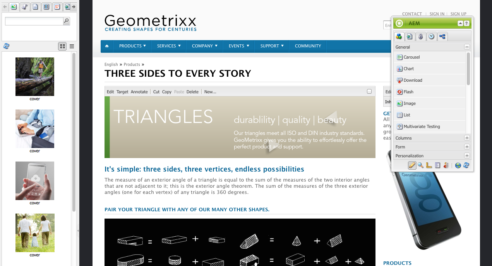

# 작성 - 환경 및 도구 {#authoring-the-environment-and-tools}

AEM의 작성 환경에서는 컨텐츠를 구성하고 편집하기 위한 다양한 메커니즘을 제공합니다. 제공된 도구는 다양한 콘솔 및 페이지 편집기에서 액세스됩니다.

## 사이트 관리 {#site-administration}

다음 **웹 사이트** 콘솔을 사용하여 웹 사이트를 관리하고 탐색할 수 있습니다. 두 창을 사용하면 웹 사이트의 구조를 확장하고 필요한 요소에 대해 작업을 수행할 수 있습니다.

## 페이지 컨텐츠 편집 {#editing-your-page-content}

컨텐츠 파인더 및 사이드 킥을 사용하는 클래식 UI가 포함된 별도의 페이지 편집기가 있습니다.

`https://localhost:4502/cf#/content/geometrixx/en/products/triangle.html`

## 도움말 액세스 {#accessing-help}

다양 **도움말** 리소스는 AEM 내에서 직접 액세스할 수 있습니다.

및 액세스 [콘솔 도구 모음의 도움말](/help/sites-classic-ui-authoring/author-env-basic-handling.md#accessing-help), 사이드 킥의 도움말에 액세스할 수도 있습니다( ? 아이콘)을 클릭하여 페이지를 편집합니다.

또는 를 사용하여 **도움말** 특정 구성 요소의 편집 대화 상자 버튼. 상황에 맞는 도움말이 표시됩니다.

## Sidekick {#sidekick}

다음 **구성 요소** 사이드 킥의 탭에서는 현재 페이지에 추가할 수 있는 구성 요소를 탐색할 수 있습니다. 필요한 그룹을 확장한 다음 구성 요소를 페이지의 필요한 위치로 드래그할 수 있습니다.

## 콘텐츠 파인더 {#the-content-finder}

컨텐츠 파인더는 페이지를 편집할 때 저장소 내에서 자산 및/또는 컨텐츠를 빠르고 쉽게 찾을 수 있는 방법입니다.

콘텐츠 파인더를 사용하여 다양한 리소스를 찾을 수 있습니다. 해당하는 경우 항목을 드래그하여 페이지의 단락에 놓을 수 있습니다.

* [이미지](#finding-images)
* [문서](#finding-documents)
* [동영상](#finding-movies)
* [Dynamic Media 브라우저](/help/sites-administering/scene7.md#scene7contentbrowser)
* [페이지](#finding-pages)

* [단락](#referencing-paragraphs-from-other-pages)
* [제품](#products)
* 또는 [저장소 구조별로 웹 사이트 탐색](#the-content-finder)

모든 옵션을 사용하여 다음과 같은 작업을 수행할 수 있습니다 [특정 항목 검색](#the-content-finder).

### 이미지 찾기 {#finding-images}

이 탭에는 저장소의 모든 이미지가 나열됩니다.

페이지에 이미지 단락을 만든 후 항목을 드래그하여 단락에 놓을 수 있습니다.

### 문서 찾기 {#finding-documents}

이 탭에는 저장소의 모든 문서가 나열됩니다.

페이지에 다운로드 단락을 만든 후 항목을 드래그하여 단락에 놓을 수 있습니다.

### 영화 찾기 {#finding-movies}

이 탭에는 저장소의 모든 동영상(예: Flash 항목)이 나열됩니다.

페이지에 적절한 단락(예: Flash)을 만든 후 항목을 단락에 끌어다 놓을 수 있습니다.

### 제품 {#products}

이 탭에는 모든 제품이 나열됩니다. 페이지에 적절한 단락(예: 제품)을 만든 후 항목을 단락에 끌어다 놓을 수 있습니다.

### 페이지 찾기 {#finding-pages}

이 탭에는 모든 페이지가 표시됩니다. 아무 페이지나 두 번 클릭하여 편집할 수 있도록 엽니다.

### 다른 페이지의 단락 참조 {#referencing-paragraphs-from-other-pages}

이 탭에서는 다른 페이지를 검색할 수 있습니다. 해당 페이지의 모든 단락이 나열됩니다. 그런 다음 단락을 현재 페이지로 드래그하면 원래 단락에 대한 참조가 만들어집니다.

### 전체 저장소 보기 사용 {#using-the-full-repository-view}

이 탭에는 저장소의 모든 리소스가 표시됩니다.

### 컨텐츠 브라우저로 검색 사용 {#using-search-with-the-content-browser}

모든 옵션에서 특정 항목을 검색할 수 있습니다. 검색 패턴과 일치하는 모든 태그 및 리소스가 나열됩니다.

검색에 와일드카드를 사용할 수도 있습니다. 지원되는 와일드카드:

* `*`
는 0자 이상의 시퀀스에 일치합니다.

* `?`
는 단일 문자와 일치합니다.

>[!NOTE]
>
>와일드카드 검색을 수행하는 데 사용해야 하는 가성 속성 &quot;name&quot;이 있습니다.

예를 들어, 다음 이름의 이미지를 사용할 수 있습니다.

`ad-nmvtis.jpg`

다음 검색 패턴이 이 패턴(및 패턴과 일치하는 다른 이미지)을 찾습니다.

* `name:*nmv*`
* `name:AD*`
문자 일치 *아님* 대/소문자를 구분합니다.

* `name:ad?nm??is.*`
쿼리에 와일드카드를 원하는 수만큼 사용할 수 있습니다.

>[!NOTE]
>
>다음을 사용할 수도 있습니다. [SQL2](https://helpx.adobe.com/experience-manager/6-5/sites/developing/using/reference-materials/javadoc/org/apache/jackrabbit/commons/query/sql2/package-summary.html) 검색.

## 참조 표시 {#showing-references}

AEM을 사용하면 현재 작업 중인 페이지에 연결된 페이지를 볼 수 있습니다.

직접 페이지 참조를 표시하려면 다음을 수행하십시오.

1. 사이드 킥에서 **페이지** 탭 아이콘

   

1. 선택 **참조 표시...** AEM은 참조 창을 열고 선택한 페이지를 참조하는 페이지(경로 포함)를 표시합니다.

   

특정 상황에서 다음 작업을 포함하여 Sidekick에서 추가 작업을 사용할 수 있습니다.

* [론치](/help/sites-classic-ui-authoring/classic-launches.md)
* [Live Copy](/help/sites-administering/msm.md)

* [블루프린트](/help/sites-administering/msm-best-practices.md)

기타 [페이지 간 관계는 웹 사이트 콘솔에서 볼 수 있습니다](/help/sites-classic-ui-authoring/author-env-basic-handling.md#page-information-on-the-websites-console).

## 감사 로그 {#audit-log}

다음 **감사 로그** 에서 액세스할 수 있습니다. **정보** 사이드 킥의 탭 현재 페이지에서 수행한 최근 작업이 나열됩니다. 예를 들면 다음과 같습니다.

## 페이지 정보 {#page-information}

웹 사이트 콘솔 [페이지의 현재 상태에 대한 정보를 제공합니다](/help/sites-classic-ui-authoring/author-env-basic-handling.md#page-information-on-the-websites-console) 게시, 수정, 잠김, 라이브 카피 등.

## 페이지 모드 {#page-modes}

클래식 UI로 페이지를 편집할 때 사이드 킥 하단에 있는 아이콘을 사용하여 액세스할 수 있는 모드는 다양합니다.

Sidekick 하단에 있는 아이콘 행은 페이지 작업에 대한 모드를 전환하는 데 사용됩니다.

* [편집](/help/sites-classic-ui-authoring/classic-page-author-edit-mode.md)
기본 모드이며 페이지를 편집하고 구성 요소를 추가 또는 삭제하며 기타 변경할 수 있습니다.

* [미리 보기](/help/sites-classic-ui-authoring/classic-page-author-edit-content.md#previewing-pages)
이 모드를 사용하면 최종 양식으로 웹 사이트에 표시된 것처럼 페이지를 미리 볼 수 있습니다.

* [디자인](/help/sites-classic-ui-authoring/classic-page-author-design-mode.md#main-pars-procedure-0)
이 모드에서는 액세스 가능한 구성 요소를 구성하여 페이지 디자인을 편집할 수 있습니다.

>[!NOTE]
>
>다른 옵션도 사용할 수 있습니다.
>
>* [스캐폴딩](/help/sites-classic-ui-authoring/classic-feature-scaffolding.md)
>* [Client Context](/help/sites-administering/client-context.md)
>* 웹 사이트 - 웹 사이트 콘솔을 엽니다.
>* 다시 로드 - 페이지를 새로 고칩니다.

## 키보드 단축키 {#keyboard-shortcuts}

다양한 [키보드 단축키](/help/sites-classic-ui-authoring/classic-page-author-keyboard-shortcuts.md)도 사용할 수 있습니다.
