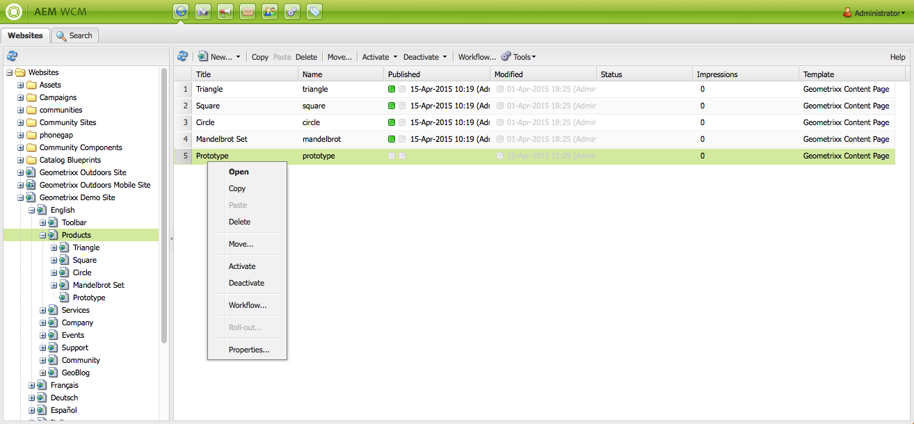
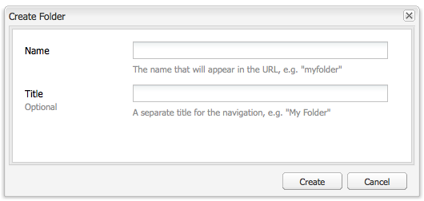

# 페이지 생성 및 구성{#creating-and-organizing-pages}

이 섹션에서는 해당 페이지에 [컨텐츠를 만들 수](/help/sites-classic-ui-authoring/classic-page-author-edit-content.md) 있도록 AEM(Adobe Experience Manager)으로 페이지를 만들고 관리하는 방법을 설명합니다.

>[!NOTE]
>
>작성, 복사, 이동, 편집, 삭제와 같은 작업을 페이지에서 수행하기 위해서는 계정에 [적절한 액세스 권한](/help/sites-administering/security.md)과 [사용 권한](/help/sites-administering/security.md#permissions)이 있어야 합니다. 
>
>문제가 발생하면 시스템 관리자에게 문의하십시오.

## 웹 사이트 구성 {#organizing-your-website}

작성자는 AEM 내에서 웹 사이트를 구성해야 합니다. 이 작업에는 컨텐츠 페이지 생성이 포함되며 이 페이지에 대한 이름 지정 작업도 포함되어 있어서

* 작성자가 작성 환경에서 페이지를 쉽게 찾을 수 있습니다.
* 사이트 방문자가 게시 환경에서 페이지를 쉽게 찾을 수 있습니다.

컨텐츠 구성에 도움이 되도록 [폴더](#creating-a-new-folder)를 사용할 수도 있습니다.

웹 사이트의 구조는 컨텐츠 페이지를 담는 *트리 구조*&#x200B;로 생각할 수 있습니다. 이 컨텐츠 페이지의 이름은 URL을 구성하는 데 사용됩니다. 반면에 제목은 페이지 컨텐츠가 표시될 때 표시됩니다.

예를 들어 다음은 `Triangle` 페이지를 액세스하게 되는 Geometrixx 사이트에서의 추출을 보여 줍니다.

* 작성자 환경

   `http://localhost:4502/cf#/content/geometrixx/en/products/triangle.html`

* 게시 환경

   `http://localhost:4503/content/geometrixx/en/products/triangle.html`

   인스턴스의 구성에 따라서는 게시 환경에서 `/content`의 사용은 선택 사항일 수 있습니다.

```xml
  /content
    /geometrixx
      /en
        /toolbar...
        /products
          /triangle
            /overview
            /features
          /square...
          /circle...
          /...
        /...
      /fr...
      /de...
      /es...
      /...
    /...
```

이 구조는 웹 사이트 콘솔에서 볼 수 있으며, 트리 구조](/help/sites-classic-ui-authoring/author-env-basic-handling.md#main-pars-text-15)에서 탐색하는 데 사용할 수 있습니다.[



### 페이지 이름 지정 규칙 {#page-naming-conventions}

새 페이지를 만드는 경우 다음과 같은 두 개의 주요 필드가 있습니다.

* **[제목](#title)**:

   * 콘솔에서 사용자에게 표시되고, 편집할 때 페이지 컨텐츠 상단에 표시됩니다.
   * 이 필드는 선택 사항입니다.

* **[이름](#name)**:

   * URI를 생성하는 데 사용됩니다.
   * 이 필드에 대한 사용자 입력은 선택 사항입니다. 지정하지 않을 경우 이름이 제목에서 파생됩니다.

AEM은 새 페이지를 만들 때 AEM 및 JCR에서 지정한 규칙](/help/sites-developing/naming-conventions.md)에 따라 페이지 이름을 확인합니다.[

구현 및 허용되는 문자 목록은 UI에 따라 약간 다르지만(터치 지원 UI에 대해 더 광범위함) 허용되는 최소 문자는 다음과 같습니다.

* &#39;a&#39; - &#39;z&#39;
* &#39;A&#39; - &#39;Z&#39;
* &#39;0&#39; - &#39;9&#39;
* _(밑줄)
* `-`(하이픈/빼기)

이러한 문자가 확실히 허용/사용되도록 하려면 해당 문자만 사용합니다(허용되는 모든 문자에 대한 세부 사항이 필요한 경우 [이름 지정 규칙](/help/sites-developing/naming-conventions.md) 참조).

#### 제목 {#title}

새 페이지를 만들 때 페이지 **제목**&#x200B;만 제공하면 AEM은 이 문자열에서 페이지 **이름**[을 파생하고 AEM 및 JCR에서 지정한 규칙에 따라 이름을 확인합니다. ](/help/sites-developing/naming-conventions.md) UI와 **제목** 필드에는 잘못된 문자가 포함될 수 있지만, 파생되는 이름에서는 잘못된 문자가 대체됩니다. 예:

| 제목 | 파생되는 이름 |
|---|---|
| Schön | schoen.html |
| SC%&amp;&amp;ast;jcs+ | sc---c-.html |

#### 이름 {#name}

새 페이지를 만들 때 페이지 **이름**[을 제공하면 AEM이 AEM 및 JCR에서 지정한 규칙에 따라 이름을 확인합니다.](/help/sites-developing/naming-conventions.md)

클래식 UI에서는 **이름** 필드에 잘못된 문자&#x200B;**을 입력할 수 없습니다.**

>[!NOTE]
>터치가 활성화된 UI에서는 **이름** 필드에 잘못된 문자&#x200B;**을 제출할 수 없습니다.** AEM에서 잘못된 문자를 감지하면 필드가 강조 표시되고 제거/교체가 필요한 문자를 나타내는 설명 메시지가 표시됩니다.

>[!NOTE]
>
>언어 루트가 아닌 경우 ISO-639-1에 따라 정의된 두 문자 코드를 사용할 수 없습니다.
>
>자세한 내용은 [컨텐츠 번역 준비](/help/sites-administering/tc-prep.md)를 참조하십시오.

### 템플릿 {#templates}

AEM에서 템플릿은 페이지의 전문 유형을 지정합니다. 템플릿은 만들어지는 새 페이지의 기초로 사용됩니다.

템플릿은 썸네일 이미지 및 기타 속성을 비롯한 페이지 구조를 정의합니다. 예를 들어 제품 페이지, 사이트 맵 및 연락처 정보에 서로 다른 템플릿을 사용할 수 있습니다. 템플릿은 여러 [구성 요소](#components)로 이루어집니다.

AEM에는 특별히 제공되는 몇 개의 템플릿이 있습니다. 제공되는 템플릿은 개별 웹 사이트에 따라 다르며, 제공받아야 하는 정보는(새 페이지 작성 시) 사용되는 UI에 따라 다릅니다. 주요 필드는 다음과 같습니다.

* **제목**
결과 웹 페이지에 표시되는 제목입니다.

* **이름**
페이지 이름을 지정할 때 사용됩니다.

* **템플릿**
새 페이지를 생성하는 데 사용할 수 있는 템플릿 목록입니다.

### 구성 요소 {#components}

구성 요소는 특정 유형의 컨텐츠를 추가할 수 있도록 AEM에서 제공하는 요소입니다. AEM에는 다음과 같이 광범위한 기능을 제공하는 다양하고 특별한 구성 요소가 포함되어 있습니다.

* 텍스트
* 이미지
* Slideshow
* 비디오
* 더 많음

페이지를 만들고 열면 [사이드 킥이나](/help/sites-classic-ui-authoring/classic-page-author-env-tools.md#sidekick)에서 사용할 수 있는 ](/help/sites-classic-ui-authoring/classic-page-author-edit-content.md#insertinganewparagraph)구성 요소를 사용하여 [컨텐트를 추가할 수 있습니다.

## 페이지 관리 {#managing-pages}

### 새 페이지 만들기 {#creating-a-new-page}

모든 페이지가 미리 만들어져 있지 않다면 컨텐츠를 만들기 전에 우선 페이지를 만들어야 합니다.

1. **웹 사이트** 콘솔에서 새 페이지를 만들 수준을 선택합니다.

   다음 예제에서는 왼쪽 창에 표시된 **제품** 수준 아래에 페이지를 만듭니다. 오른쪽 창에는 **제품** 수준 아래에 이미 있는 페이지를 보여 줍니다.

   

1. **새로 만들기...** 메뉴(**새로 만들기...** 옆의 화살표 클릭)에서 **새 페이지...**&#x200B;를 선택합니다. **페이지 만들기** 창이 열립니다.

   **새로 만들기...**&#x200B;를 직접 클릭해도 **새 페이지...** 옵션이 바로 열립니다.

1. **페이지 만들기** 대화 상자에서 다음을 수행할 수 있습니다.

   * 사용자에게 표시되는 **제목**&#x200B;을 입력합니다.
   * URI를 생성하는 데 사용되는&#x200B;**이름**&#x200B;을 제공합니다. 지정하지 않을 경우 이름이 제목에서 파생됩니다.

      * 새 페이지를 만들 때 페이지 **이름**&#x200B;을 제공하면 AEM이 AEM 및 JCR에서 지정한 [규칙에 따라 이름을 확인](/help/sites-developing/naming-conventions.md)합니다.
      * 클래식 UI에서는 **이름** 필드에 **잘못된 문자를 입력할 수 없습니다**.
   * 새 페이지를 만드는 데 사용할 템플릿을 클릭합니다.

      템플릿은 새 페이지의 기초로 사용됩니다. 예를 들어 컨텐트 페이지의 기본적인 레이아웃을 결정합니다.
   >[!NOTE]
   >
   >[페이지 이름 지정 규칙](#page-naming-conventions)을 참조하십시오.

   새 페이지를 만드는 데 필요한 최소 정보는 **제목**&#x200B;과 필요한 템플릿입니다.

   

   >[!NOTE]
   >
   >URL에서 유니코드 문자를 사용하려면 별칭(`sling:alias`) 속성([페이지 속성](/help/sites-classic-ui-authoring/classic-page-author-edit-page-properties.md))을 설정합니다.

1. **만들기**&#x200B;를 클릭하여 페이지를 만듭니다. 화면이 **웹 사이트** 콘솔로 돌아가고 여기에 새 페이지의 항목이 표시됩니다.

   콘솔에는 페이지에 대한 정보(예: 마지막 편집 시간 및 작성자)가 표시되고 필요에 따라 정보가 업데이트됩니다.

   >[!NOTE]
   >
   >기존 페이지를 편집 중일 때 페이지를 만들 수도 있습니다. 사이드 킥의 **페이지** 탭에서 **하위 페이지 만들기 **를 사용하면 편집되는 페이지 바로 아래에 새 페이지가 만들어집니다.

### 편집할 페이지 열기 {#opening-a-page-for-editing}

몇 가지 방법 중 하나를 사용하여 [편집할](/help/sites-classic-ui-authoring/classic-page-author-edit-content.md#editing-a-component-content-and-properties) 페이지를 열 수 있습니다.

* **웹 사이트** 콘솔에서 페이지 제목을 **두 번 클릭**&#x200B;하여 열어서 편집합니다.

* **웹 사이트** 콘솔에서 페이지 항목을 **마우스 오른쪽 단추로 클릭**(컨텍스트 메뉴)한 다음, 메뉴에서 **열기**&#x200B;를 선택합니다.

* 페이지를 연 후 하이퍼링크를 클릭하면 사이트 내의 다른 페이지로 이동하여 편집할 수 있습니다.

### 페이지 복사 및 붙여넣기 {#copying-and-pasting-a-page}

다음 중 하나를 복사할 수 있습니다.

* 단일 페이지
* 페이지와 모든 하위 페이지

1. **웹 사이트** 콘솔에서 복사할 페이지를 선택합니다.

   >[!NOTE]
   >
   >이 단계에서는 단일 페이지를 복사할지 아니면 하위 페이지까지 복사할지와는 관계가 없습니다.

1. **복사**&#x200B;를 클릭합니다.

1. 새 위치로 이동하고 다음을 클릭합니다.

   * **붙여넣기** - 페이지와 모든 하위 페이지를 붙여넣습니다.
   * **Shift + 붙여넣기** - 선택한 페이지만 붙여넣습니다.

   페이지가 새 위치로 붙여넣어집니다.

   >[!NOTE]
   >
   >이름이 같은 기존 페이지가 있으면 페이지 이름이 자동으로 조정됩니다.

   >[!NOTE]
   >
   >사이드 킥의 **페이지** 탭에서 **페이지 복사**&#x200B;를 사용할 수도 있습니다. 이렇게 하면 대상 등을 지정할 수 있는 대화 상자가 열립니다.

### 페이지 이동 또는 이름 바꾸기 {#moving-or-renaming-page}

>[!NOTE]
>
>페이지 이름 바꾸기는 새 페이지 이름을 지정할 때의 [페이지 이름 지정 규칙](#page-naming-conventions)을 따릅니다.

페이지를 이동하는 절차와 이름을 바꾸는 절차는 동일합니다. 동일한 작업으로 다음 작업을 할 수 있습니다.

* 페이지를 새 위치로 이동
* 동일한 위치에서 페이지 이름 변경
* 페이지를 새 위치로 이동하고 동시에 이름 변경

AEM에서는 이름을 바꾸거나 이동하는 페이지에 대한 내부 링크를 업데이트하는 기능을 제공합니다. 페이지별로 다른 기준을 적용할 수 있으므로 완벽한 유연성이 발휘됩니다.

페이지를 이동하거나 이름을 바꾸는 방법은 다음과 같습니다.

1. 다양한 가지 방법으로 이동을 시작할 수 있습니다.

   * **웹 사이트** 콘솔에서 페이지를 클릭하여 선택하고 **이동...**&#x200B;을 선택합니다.
   * **웹 사이트** 콘솔에서 페이지 항목을 선택하고 **마우스 오른쪽 단추로 클릭**&#x200B;한 다음 **이동...**&#x200B;을 선택합니다.
   * 페이지 편집 시 사이드 킥의 **페이지** 탭에서 **페이지 이동**&#x200B;을 사용할 수 있습니다.

1. **이동** 창이 열립니다. 여기에서 새 위치를 지정하거나 페이지의 새 이름을 지정하거나 둘 모두를 지정할 수 있습니다.

   

   이동할 페이지를 참조하는 모든 페이지도 나열됩니다. 참조하는 페이지의 상태에 따라 링크를 조정할 수도 있고, 페이지를 재게시할 수도 있습니다.

1. 다음 필드를 적절히 채웁니다.

   * **대상**

      드롭다운 선택기를 통해 Sitemap을 사용하여 페이지를 이동할 위치를 선택합니다.

      단순히 페이지의 이름을 바꾸려는 경우에는 이 필드를 무시합니다.

   * **이동**

      이동할 페이지 지정 - 이동 작업을 시작한 방법과 위치에 따라 기본적으로 채워져 있는 경우가 많습니다.

   * **이름 바꾸기**

      기본적으로 현재 페이지 레이블이 표시됩니다. 필요한 경우 새 페이지 레이블을 지정합니다.

   * **조정**

      이동한 페이지를 가리키는 나열된 페이지 링크를 업데이트합니다. 예를 들어 페이지 A에 페이지 B에 대한 링크가 있는 경우 페이지 B를 이동하면 페이지 A의 링크가 조정됩니다.

      참조하는 페이지마다 이 동작을 선택하거나 해제할 수 있습니다.

   * **재게시**

      참조하는 페이지를 재게시합니다. 이 동작도 페이지마다 선택할 수 있습니다.
   >[!NOTE]
   >
   >페이지가 이미 활성화된 경우 페이지를 이동하면 자동으로 비활성화됩니다. 기본적으로 이동이 완료되면 다시 활성화되지만 **이동** 창에서 페이지의 **다시 게시** 필드를 선택 취소하여 변경할 수 있습니다.

1. **이동**&#x200B;을 클릭합니다. 확인이 필요합니다. **확인**&#x200B;을 클릭하여 확인합니다.

   >[!NOTE]
   >
   >페이지 제목이 업데이트되지 않습니다.

### 페이지 삭제 {#deleting-a-page}

1. 다양한 위치에서 페이지를 삭제할 수 있습니다.

   * **웹 사이트** 콘솔 내에서 페이지를 클릭하여 선택한 다음 마우스 오른쪽 단추로 클릭하고 표시되는 메뉴에서 **삭제**&#x200B;를 선택합니다.
   * **웹 사이트**&#x200B;콘솔 내에서 페이지를 클릭하여 선택한 다음 도구 모음 메뉴에서 **삭제**&#x200B;를 선택합니다.
   * 사이드 킥의 **페이지** 탭에서 **페이지 삭제**&#x200B;를 선택합니다. 현재 열려 있는 페이지가 삭제됩니다.

1. 페이지 삭제 작업은 취소할 수 없으므로 확인 메시지가 나타납니다.

   >[!NOTE]
   >
   >페이지가 게시되어 있는 경우에는 삭제 후에 최신 버전이나 특정 버전을 복원할 수 있지만, 마지막 버전을 추가로 수정했던 경우에는 컨텐츠가 마지막 버전과 다를 수 있습니다. 자세한 내용은 [페이지 복원 방법](/help/sites-classic-ui-authoring/classic-page-author-work-with-versions.md#restoringpages)을 참조하십시오.

>[!NOTE]
>
>페이지가 이미 활성화되어 있으면 삭제하기 전에 자동으로 비활성화됩니다.

### 페이지 잠금 {#locking-a-page}

콘솔에서 또는 개별 페이지를 편집할 때 [페이지 잠금/잠금 해제](/help/sites-classic-ui-authoring/classic-page-author-edit-content.md#locking-a-page)할 수 있습니다. 페이지가 잠겨 있는지 여부도 두 위치 모두에 표시됩니다.

### 새 폴더 만들기 {#creating-a-new-folder}

>[!NOTE]
>
>폴더도 새 폴더 이름을 지정할 때 [페이지 이름 지정 규칙](#page-naming-conventions)을 따릅니다.

1. **웹 사이트** 콘솔을 열고 필요한 위치로 이동합니다.
1. **새로 만들기...** 메뉴( **새로 만들기... 옆의 화살표를 클릭합니다.**)에서 **새 폴더...를 선택합니다.**.
1. **폴더 만들기** 대화 상자가 열립니다. 여기에서 **이름** 및 **제목**&#x200B;을 입력할 수 있습니다.

   

1. 폴더를 만들려면 **만들기**&#x200B;를 선택합니다.

