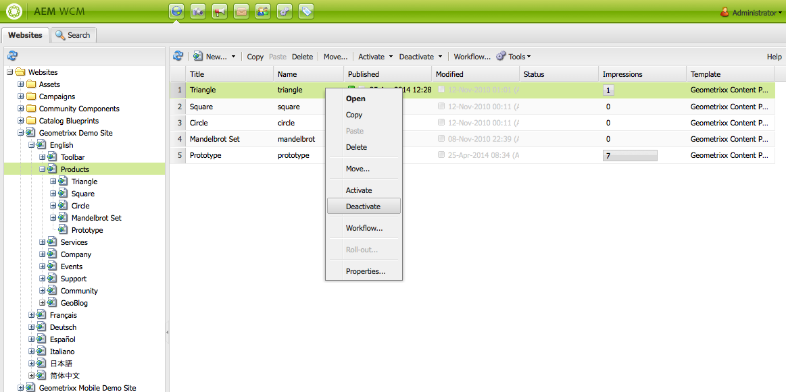

# 페이지 게시{#publishing-pages}

작성 환경에서 컨텐츠를 작성 및 검토한 후에는 공개 웹 사이트(게시 환경)에서 사용할 수 있도록 만들어야 합니다.

이를 페이지 게시라고도 합니다. 게시 환경에서 페이지를 제거하려는 경우 게시 취소라고 합니다. 게시 및 게시 취소할 때 작성 환경에서 페이지를 삭제할 때까지 계속 변경할 수 있습니다.

페이지를 즉시 또는 미래의 미리 정의된 날짜/시간에 게시/게시 취소할 수도 있습니다.

>[!NOTE]
>
>게시와 관련된 특정 용어는 헷갈릴 수 있습니다.
>
>* **게시/게시 취소**
   >  이 용어는 컨텐츠를 게시 환경에서 공개적으로 사용할 수 있도록(또는 사용할 수 없도록) 하는 작업을 위한 기본 용어입니다.
   >
   >
* **활성화/비활성화**
   >  게시/게시 취소와 동의어입니다.
   >
   >
* **복제**
   >  사용자 댓글을 게시하거나 역복제할 때와 같이 한 환경에서 다른 환경으로의 데이터(예: 페이지 컨텐츠, 파일, 코드, 사용자 댓글) 이동을 설명하는 기술 용어입니다.
>

>[!NOTE]
>
>특정 페이지 게시에 필요한 권한이 없는 경우:
>
>* 게시할 요청을 적절한 사람에게 알리도록 워크플로우가 트리거됩니다.
>* 이를 알리는 메시지가 잠깐 동안 표시됩니다.

>

## 페이지 게시 {#publishing-a-page}

두 가지 방법으로 페이지를 활성화할 수 있습니다.

* [웹 사이트 콘솔에서](#activating-a-page-from-the-websites-console)
* [페이지 자체의 사이드 킥에서](#activating-a-page-from-sidekick)

>[!NOTE]
>
>[도구] 콘솔의 [트리 활성화](#howtoactivateacompletesectiontreeofyourwebsite)를 사용하여 여러 페이지의 하위 트리를 활성화할 수도 있습니다.

### 웹 사이트 콘솔에서 페이지 활성화 {#activating-a-page-from-the-websites-console}

웹 사이트 콘솔에서 페이지를 활성화할 수 있습니다. 페이지를 열고 컨텐츠를 수정한 후 웹 사이트 콘솔로 돌아갑니다.

1. 웹 사이트 콘솔에서 활성화할 페이지를 선택합니다.
1. 상단 메뉴 또는 선택한 페이지 항목의 드롭다운 메뉴에서 **활성화**&#x200B;를 선택합니다.

   페이지의 컨텐츠와 모든 하위 페이지를 활성화하려면 [**도구** 콘솔](/help/sites-classic-ui-authoring/classic-page-author-publish-pages.md#howtoactivateacompletesectiontreeofyourwebsite)을 사용합니다.

   

   >[!NOTE]
   >
   >필요한 경우 AEM에서 페이지에 링크된 자산을 활성화하거나 재활성화하도록 요청합니다. 확인란을 선택하거나 취소하여 이러한 자산을 활성화할 수 있습니다.

1. 필요한 경우 AEM에서 페이지에 링크된 자산을 활성화하거나 재활성화하도록 요청합니다. 확인란을 선택하거나 취소하여 이러한 자산을 활성화할 수 있습니다.

   

1. AEM WCM에서 선택한 컨텐츠를 활성화합니다. 하나 이상의 게시된 페이지가 [웹 사이트 콘솔](/help/sites-classic-ui-authoring/author-env-basic-handling.md#page-information-on-the-websites-console)에 나타나고(녹색으로 표시됨) 컨텐츠를 활성화한 사용자 및 활성화 날짜와 시간 등의 정보가 표시됩니다.

   

### 사이드킥에서 페이지 활성화 {#activating-a-page-from-sidekick}

페이지를 열어서 편집할 때 페이지를 활성화할 수도 있습니다.

페이지를 열고 컨텐츠를 수정한 후 다음을 수행합니다.

1. 사이드킥에서 **페이지** 탭을 선택합니다.
1. **페이지 활성화**를 클릭합니다.
창 오른쪽 위에 페이지가 활성화되었다는 메시지가 표시됩니다.

## 페이지 게시 취소 {#unpublishing-a-page}

페이지를 게시 환경에서 제외하려면 컨텐츠를 비활성화합니다.

페이지를 비활성화하는 방법은 다음과 같습니다.

1. 웹 사이트 콘솔에서 비활성화할 페이지를 선택합니다.
1. 상단 메뉴 또는 선택한 페이지 항목의 드롭다운 메뉴에서 **비활성화**&#x200B;를 선택합니다. 삭제를 확인하는 메시지가 나타납니다.

   

1. [웹 사이트 콘솔](/help/sites-classic-ui-authoring/author-env-basic-handling.md#page-information-on-the-websites-console)을 새로고침하면 컨텐츠가 빨간색으로 표시되어 더 이상 게시되지 않음을 나타냅니다.

   

## 나중에 활성화/비활성화 {#activate-deactivate-later}

### 나중에 활성화 {#activate-later}

나중에 활성화를 예약하려면

1. 웹 사이트 콘솔에서 **활성화** 메뉴로 이동하고 **나중에 활성화**&#x200B;를 선택합니다.
1. 대화 상자가 열리면 활성화 날짜와 시간을 지정하고 **확인**&#x200B;을 클릭합니다.이렇게 하면 지정된 시간에 활성화되는 페이지 버전이 만들어집니다.

   

나중에 활성화를 사용하면 지정된 시간에 이 페이지 버전을 활성화하는 워크플로우가 시작됩니다. 반대로 나중에 비활성화를 사용하면 특정 시간에 이 페이지 버전을 비활성화하는 워크플로우가 시작됩니다.

이 활성화/비활성화를 취소하려면 [워크플로우 콘솔](/help/sites-administering/workflows-administering.md#main-pars_title_3-yjqslz-refd)로 가서 해당 워크플로우를 종료합니다.

### 나중에 비활성화  {#deactivate-later}

나중에 비활성화하도록 예약하려면

1. 웹 사이트 콘솔에서 **비활성화** 메뉴로 이동하고 **나중에 비활성화**&#x200B;를 선택합니다.

1. 대화 상자가 열리면 비활성화 날짜 및 시간을 지정하고 **확인**&#x200B;을 클릭합니다.

   

**나중에 비활성화**&#x200B;를 사용하면 특정 시간에 이 페이지 버전을 비활성화하는 워크플로우가 시작됩니다.

이 비활성화를 취소하려면 [워크플로우 콘솔](/help/sites-administering/workflows-administering.md#main-pars_title_3-yjqslz-refd)로 가서 해당 워크플로우를 종료합니다.

## 예약된 활성화/비활성화(설정/해제 시간)  {#scheduled-activation-deactivation-on-off-time}

**페이지 속성**&#x200B;에 정의할 수 있는 **설정 시간** 및 [해제 시간](/help/sites-classic-ui-authoring/classic-page-author-edit-page-properties.md)을 사용하여 페이지를 게시/게시 취소할 시간을 예약할 수 있습니다.

### 페이지 게시 상태 확인 {#determining-page-publication-status-classic-ui}

[웹 사이트 콘솔](/help/sites-classic-ui-authoring/author-env-basic-handling.md#page-information-on-the-websites-console)에서 상태를 볼 수 있습니다. 색상은 게시 상태를 가리킵니다.

## 웹 사이트의 전체 섹션(트리) 활성화  {#activating-a-complete-section-tree-of-your-website}

**웹 사이트** 탭에서 개별 페이지를 활성화할 수 있습니다. 동일한 루트 페이지 아래에서 수많은 컨텐츠 페이지를 입력하거나 업데이트한 경우 전체 트리를 한 번에 활성화하면 더욱 편리할 수 있습니다. 연습 실행을 통해 활성화를 에뮬레이션하여 활성화될 페이지를 강조할 수도 있습니다.

1. **도구** 콘솔을 **시작** 페이지에서 선택한 다음 **복제**&#x200B;를 두 번 클릭하여 콘솔을 엽니다( `https://localhost:4502/etc/replication.html`).

   

1. **복제** 콘솔에서 **트리 활성화**&#x200B;를 클릭합니다.

   다음 창( `https://localhost:4502/etc/replication/treeactivation.html`)이 표시됩니다.

   

1. **시작 경로**&#x200B;를 입력합니다.활성화(게시)할 섹션의 루트 경로를 지정합니다. 이 페이지와 모든 하위 페이지가 활성화 대상으로 선택되거나 연습 실행을 선택한 경우 에뮬레이션에 사용됩니다.
1. 필요한 선택 기준을 활성화합니다.

   * **수정된 항목만**: 수정된 페이지만 활성화합니다.
   * **활성화 항목만**: 이미 활성화된 항목만 활성화합니다. 일종의 재활성화 기능입니다.
   * **비활성화 항목 무시**: 비활성화된 페이지를 무시합니다.

1. 수행할 작업을 선택합니다.

   1. *활성화될 페이지*&#x200B;를 확인하려면 **연습 실행**&#x200B;을 선택합니다.단순히 에뮬레이션일 뿐 페이지가 활성화되지 않습니다.

   1. 페이지를 활성화하려면 **활성화**&#x200B;를 선택합니다.
