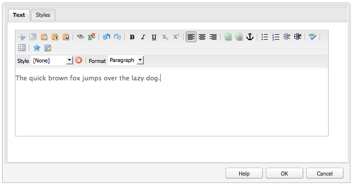

# 리치 텍스트 편집기 {#rich-text-editor}

리치 텍스트 편집기는 텍스트 컨텐츠를 AEM에 입력하는 기본 빌딩 블록입니다. 이 편집기는 다음과 같은 다양한 구성 요소의 기초가 됩니다.

* 텍스트
* 텍스트 이미지
* 표

## 리치 텍스트 편집기 {#rich-text-editor-1}

WYSIWYG 편집 대화 상자는 광범위한 기능을 제공합니다.

>[!NOTE]
>
>프로젝트마다 다르게 기능을 구성할 수 있으므로 사용 가능한 기능은 설치 환경에 따라 다릅니다.

## 즉석 편집 {#in-place-editing}

대화 상자를 사용하는 리치 텍스트 편집 모드 이외에도 AEM에서 제공하는 즉석 편집 모드를 통해 페이지 레이아웃에 표시된 텍스트를 직접 편집할 수 있습니다.

단락을 두 차례 클릭(느리게 두 번 클릭)하면 즉석 편집 모드로 전환되고 구성 요소 테두리가 주황색으로 표시됩니다.

이제 대화 상자 창이 아닌 페이지의 텍스트를 직접 편집할 수 있습니다. 변경 작업을 수행하면 변경 사항이 자동으로 저장됩니다.

>[!NOTE]
>
>컨텐츠 파인더가 열려 있으면, RTE 서식 옵션이 있는 도구 모음이 위와 같이 탭의 맨 위에 표시됩니다.
>
>컨텐츠 파인더가 열려있지 않으면 이 도구 모음이 표시되지 않습니다.

현재 즉석 편집 모드는 **텍스트** 및 **제목** 구성 요소로 생성된 페이지 요소에 사용할 수 있습니다.

>[!NOTE]
>
>[!UICONTROL 제목] 구성 요소는 줄바꿈 없는 짧은 텍스트를 포함하도록 디자인되었습니다. 즉석 편집 모드에서 제목을 편집할 때 줄바꿈을 삽입하면 제목 밑에 새 **텍스트** 구성 요소가 열립니다.

## 리치 텍스트 편집기의 기능 {#features-of-the-rich-text-editor}

리치 텍스트 편집기는 다양한 기능을 제공합니다. 이러한 [은 개별 구성 요소의 구성](/help/sites-administering/rich-text-editor.md)에 따라 다릅니다.이 기능은 터치에 적합한 UI와 클래식 UI 모두에서 사용할 수 있습니다.

### 기본 문자 형식 {#basic-character-formats}

선택(강조 표시)한 문자에 서식을 적용할 수 있으며, 일부 옵션은 단축키로도 사용할 수 있습니다.

* 굵게(Ctrl-B)
* 기울임체(Ctrl-I)
* 밑줄(Ctrl-U)
* 아래 첨자
* 위 첨자

모든 형식은 전환 가능하므로 다시 선택하면 형식이 제거됩니다.

### 사전 정의된 스타일 및 형식  {#predefined-styles-and-formats}

설치 환경에 사전 정의된 스타일과 형식이 포함될 수 있습니다. **[!UICONTROL 스타일]** 및 **[!UICONTROL 서식]** 드롭다운 상자의 스타일과 서식을 선택한 텍스트에 적용할 수 있습니다.

스타일은 특정 문자열에 적용할 수 있으며 CSS와 관련됩니다.

반면에 형식은 전체 텍스트 단락에 적용할 수 있으며 HTML을 기반으로 합니다.

특정 형식은 변경할 수만 있으며 기본값은 **[!UICONTROL 단락]**&#x200B;입니다.

스타일은 제거할 수 있습니다. 스타일이 적용된 텍스트 안에 커서를 놓고 제거 아이콘을 클릭하면 됩니다.

>[!CAUTION]
>
>스타일이 적용된 텍스트를 다시 선택하면 아이콘이 비활성화되므로 주의하시기 바랍니다.

### 잘라내기, 복사, 붙여넣기  {#cut-copy-paste}

**[!UICONTROL 잘라내기]** 및 **[!UICONTROL 복사]**&#x200B;의 표준 기능을 사용할 수 있습니다. 형식이 서로 다른 경우를 처리하기 위해 몇 가지 방식의 **[!UICONTROL 붙여넣기]**&#x200B;가 제공됩니다.

* 잘라내기(Ctrl-X)
* 복사(Ctrl-C)
* 붙여넣기
구성 요소의 기본 붙여넣기 메커니즘(Ctrl-V)입니다.기본적으로 설치되면 [!UICONTROL Word]에서 붙여넣기로 구성됩니다.

* 텍스트로 붙여넣기:스타일과 서식을 모두 제거하고 일반 텍스트만 붙여넣습니다.

* Word에서 붙여넣기:이렇게 하면 컨텐츠가 HTML로 붙여집니다(일부 필요한 서식 다시 지정).

### 실행 취소, 재실행 {#undo-redo}

AEM은 현재 구성 요소의 마지막 50개 작업 기록을 시간 순서대로 유지합니다. 필요한 경우 이러한 작업을 순서에 따라 취소하고 재실행할 수 있습니다.

>[!CAUTION]
>
>내역은 현재 편집 세션에 대해서만 보유됩니다. 편집할 구성 요소를 열 때마다 다시 시작됩니다.

>[!NOTE]
>
>기본 작업 수는 50개이며 설치에 따라 다를 수 있습니다.

### 정렬 {#alignment}

텍스트를 왼쪽, 가운데 또는 오른쪽으로 정렬할 수 있습니다.

### 들여쓰기 {#indentation}

단락의 들여쓰기를 늘리거나 줄일 수 있습니다. 선택한 단락에 들여쓰기가 적용되고 새로 입력하는 텍스트에 현재 들여쓰기 수준이 적용됩니다.

### 목록 {#lists}

텍스트 안에 글머리 기호 목록과 번호 매기기 목록을 만들 수 있습니다. 목록 유형을 선택하고 입력을 시작하거나 변환할 텍스트를 강조 표시합니다. 두 경우 모두 새 목록 항목으로 새 줄이 시작됩니다.

하나 이상의 목록 항목을 들여쓰면 중첩된 목록을 만들 수 있습니다.

목록 스타일을 변경하려면 목록 안에 커서를 놓고 다른 스타일을 선택하기만 하면 됩니다. 하위 목록의 스타일을 상위 목록과 다르게 할 수 있습니다. 들여쓰기를 통해 하위 목록을 만든 후 다른 스타일을 적용할 수 있습니다.

### 링크 {#links}

필요한 텍스트를 강조 표시한 다음 하이퍼링크 아이콘을 클릭하여 URL(웹 사이트 내 또는 외부 위치)에 대한 링크가 생성됩니다.

대화 상자에서 대상 URL 및 새 창에서 열지 여부를 지정할 수 있습니다.

다음을 작업을 수행할 수 있습니다.

* URI에 직접 입력
* 사이트 맵을 사용하여 웹 사이트 내의 페이지 선택
* URI를 입력한 다음 대상 앵커를 추가합니다.예:`www.TargetUri.org#AnchorName`
* 기준만 입력(&quot;현재 페이지&quot;를 참조하려면);예: `#anchor`
* Content Finder에서 페이지를 검색한 다음 페이지 아이콘을 하이퍼링크 대화 상자로 드래그하여 놓기

>[!NOTE]
>
>URI 앞에 설치 환경에 구성된 프로토콜을 추가할 수도 있습니다. 표준 설치에서는 `https://`, `ftp://` 및 `mailto:`입니다. 설치 환경에 구성되지 않은 프로토콜은 거부되며 오류로 표시됩니다.

링크를 끊으려면 링크 텍스트 안에 커서를 두고 [!UICONTROL 링크 해제] 아이콘을 클릭합니다.

### 앵커  {#anchors}

텍스트 안에 커서를 두거나 텍스트를 선택하여 어디든지 앵커를 만들 수 있습니다. **앵커** 아이콘을 클릭하면 대화 상자가 열립니다.

앵커 이름을 입력하고 **확인**&#x200B;을 클릭하여 저장합니다.

구성 요소를 편집하는 중에 앵커가 표시되며 이제 앵커를 링크 타겟으로 사용할 수 있습니다.

### 찾기 및 바꾸기 {#find-and-replace}

AEM에서는 **찾기** 및 **바꾸기**(찾기 및 바꾸기) 기능을 모두 제공합니다.

두 기능에는 열려 있는 구성 요소에서 지정된 텍스트를 검색하는 **다음 찾기** 단추가 있습니다. 대/소문자를 구분할지도 지정할 수 있습니다.

검색은 항상 텍스트 안에서 현재 커서 위치부터 시작됩니다. 구성 요소의 끝에 도달하면 다음 검색 작업이 맨 처음부터 시작된다는 메시지가 나타납니다.

**바꾸기** 옵션을 사용하면 지정된 텍스트가 나오는 부분을 **찾아서** **바꾸거나** 현재 구성 요소에서 나오는 부분을 **모두 바꿀 수 있습니다** .

### 이미지 {#images}

컨텐츠 파인더에서 이미지를 텍스트에 드래그하여 추가할 수 있습니다.

>[!NOTE]
>
>또한 AEM은 보다 자세한 이미지 구성을 위한 특수 구성 요소도 제공합니다. 예를 들어 **이미지** 및 **텍스트 이미지** 구성 요소를 사용할 수 있습니다.

### 맞춤법 검사 {#spelling-checker}

맞춤법 검사에서는 현재 구성 요소의 모든 텍스트를 검사합니다.

맞춤법이 잘못된 부분은 강조 표시됩니다.

>[!NOTE]
>
>맞춤법 검사는 하위 트리에 있는 언어 속성을 사용하거나 URL에서 언어를 추출하여 웹 사이트의 언어로 작동합니다. 예를 들어 영어의 경우 `en` 분기가 선택되고 독일어의 경우 `de` 분기가 선택됩니다.

### 표 {#tables}

다음과 같이 표를 사용할 수 있습니다.

* **표** 구성 요소로 사용 

   

* **텍스트** 구성 요소 안에서 사용 

   

   >[!NOTE]
   >
   >RTE에서는 표를 사용할 수 있지만 표를 만들 때는 **Table** 구성 요소를 사용하는 것이 좋습니다.

**텍스트** 및 **표** 구성 요소 모두 표 안에서 컨텍스트 메뉴(일반적으로 마우스 오른쪽 단추)를 클릭하여 표 기능을 사용할 수 있습니다. 예를 들면 다음과 같습니다.

>[!NOTE]
>
>**표** 구성 요소에서는, 표 전용 기능 하위 세트와 함께 표준 리치 텍스트 편집기 기능을 비롯한 특수 도구 모음도 사용할 수 있습니다.

표 전용 기능은 다음과 같습니다.

* [표 속성](#table-properties)
* [셀 속성](#cell-properties)
* [행 추가 또는 삭제](#add-or-delete-rows)
* [열 추가 또는 삭제](#add-or-delete-columns)
* [전체 행 또는 열 선택](#selecting-entire-rows-or-columns)
* [셀 병합](#merge-cells)
* [셀 분할](#split-cells)
* [중첩된 표](#creating-nested-tables)
* [표 제거](#remove-table)

#### 표 속성 {#table-properties}

표의 기본 속성을 구성한 후 **확인**&#x200B;을 클릭하여 저장할 수 있습니다.

* **너비**:표의 전체 너비입니다.

* **높이**:표의 전체 높이입니다.

* **테두리**:표 테두리의 크기입니다.

* **셀 패딩**:셀 내용과 테두리 사이의 공백을 정의합니다.

* **셀 간격**:셀 사이의 거리를 정의합니다.

>[!NOTE]
>
>폭 및 높이와 같은 일부 셀 속성은 픽셀 또는 백분율로 정의할 수 있습니다.

>[!CAUTION]
>
>Adobe에서는 표의 너비를 정의하는 것이 좋습니다.

#### 셀 속성 {#cell-properties}

특정 셀이나 연속된 셀의 속성을 구성할 수 있습니다.

* **너비**
* **높이**
* **수평 정렬** - 왼쪽, 가운데 또는 오른쪽
* **세로 정렬**  - 위쪽, 중간, 아래쪽 또는 기준선
* **셀 유형** - 데이터 또는 헤더
* **적용 대상:** 단일 셀, 전체 행, 전체 열

#### 행 추가 또는 삭제 {#add-or-delete-rows}

현재 행 위나 아래에 행을 추가할 수 있습니다.

현재 행을 삭제할 수도 있습니다.

#### 열 추가 또는 삭제  {#add-or-delete-columns}

현재 열 왼쪽이나 오른쪽에 열을 추가할 수 있습니다.

현재 열을 삭제할 수도 있습니다.

#### 전체 행 또는 열 선택  {#selecting-entire-rows-or-columns}

현재 행 또는 열 전체를 선택합니다. 그런 다음 특정 작업(예: 병합)을 수행할 수 있습니다.

#### 셀 병합 {#merge-cells}

 

* 셀 그룹을 선택한 경우 여러 셀을 하나로 병합할 수 있습니다.
* 셀을 하나만 선택한 경우 오른쪽이나 아래쪽에 있는 셀과 병합할 수 있습니다.

#### 셀 분할  {#split-cells}

셀 하나를 선택하여 분할합니다.

* 셀을 가로로 분할하면 현재 열에서 현재 셀 오른쪽에 새로운 셀이 생성됩니다.
* 셀을 세로로 분할하면 현재 행에서 현재 셀 아래에 새로운 셀이 생성됩니다.

#### 중첩된 표 만들기  {#creating-nested-tables}

중첩된 표를 만들면 현재 셀 안에 독립된 표가 새로 생깁니다.

>[!NOTE]
>
>특정한 기타 동작은 브라우저에 따라 다릅니다.
>
>* Windows IE: Ctrl 키를 누른 채로 마우스 기본 단추(일반적으로 왼쪽)를 클릭하여 여러 셀을 선택합니다.
>* Firefox:포인터를 드래그하여 셀 범위를 선택합니다.

#### 표 제거 {#remove-table}

**[!UICONTROL Text]** 구성 요소 내에서 표를 제거하려면 옵션을 사용합니다.

### 특수 문자 {#special-characters}

리치 텍스트 편집기에서 특수 문자를 사용할 수 있습니다. 특수 문자는 설치 환경에 따라 다릅니다.

문자를 마우스로 가리키면 확대된 버전이 표시되고, 클릭하면 텍스트의 현재 위치에 문자가 삽입됩니다.

### 소스 편집 모드  {#source-editing-mode}

소스 편집 모드에서는 구성 요소의 내부 HTML을 확인하고 편집할 수 있습니다.

텍스트는 다음과 같이 표시됩니다.

소스 모드에서는 다음과 같이 표시됩니다. 소스는 매우 길 때는 스크롤로 내려야 합니다.

>[!CAUTION]
>
>소스 모드를 종료하면 AEM에서 유효성 검사를 수행합니다. 예를 들어 텍스트가 블록에 올바르게 포함/중첩되어 있는지 확인합니다. 이로 인해 편집 내용이 변경될 수도 있습니다.
