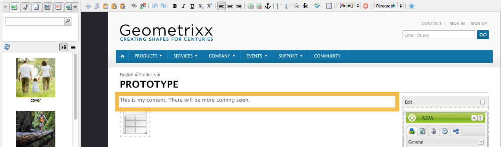
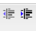
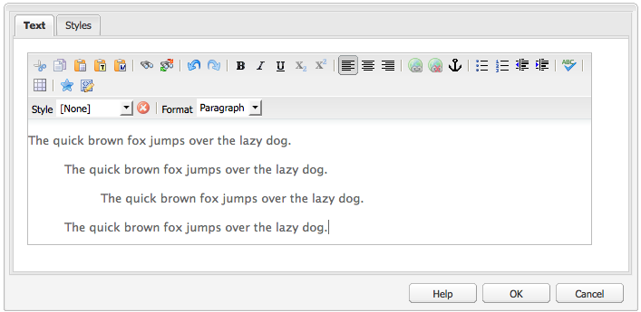
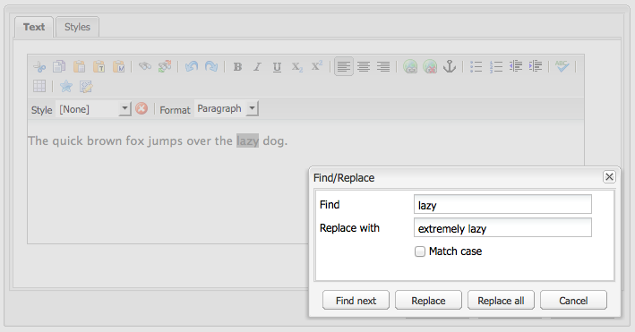
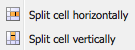

# 리치 텍스트 편집기 {#rich-text-editor}

리치 텍스트 편집기는 텍스트 컨텐츠를 AEM에 입력하는 기본 빌딩 블록입니다. 이는 다음을 포함한 다양한 구성 요소의 기초를 형성합니다.

* 텍스트
* 텍스트 이미지
* 표

## 리치 텍스트 편집기 {#rich-text-editor-1}

WYSIWYG 편집 대화 상자는 다음과 같은 다양한 기능을 제공합니다.

>[!NOTE]
>
>사용 가능한 기능은 개별 프로젝트에 대해 구성할 수 있으므로 설치에 따라 다를 수 있습니다.

## 즉석 편집 {#in-place-editing}

대화 상자를 사용하는 리치 텍스트 편집 모드 이외에도 AEM에서 바로 편집 모드를 제공하여 페이지 레이아웃에 표시된 대로 텍스트를 직접 편집할 수도 있습니다.

단락을 두 번 클릭하여(느리게 두 번 클릭) 즉석 편집 모드로 전환합니다(구성 요소 테두리는 이제 주황색으로 표시됨).

대화 상자 창 내부가 아닌 페이지에서 텍스트를 직접 편집할 수 있습니다. 변경하기만 하면 자동으로 저장됩니다.

>[!NOTE]
>
>컨텐츠 파인더를 연 경우, RTE 서식 옵션이 있는 도구 모음이 탭 상단에 표시됩니다(위와 같이).
>
>컨텐츠 파인더가 열리지 않으면 도구 모음이 표시되지 않습니다.

현재 편집기에서 생성한 페이지 요소에 대해 즉석 편집 모드가 활성화되어 있습니다. **텍스트** 및 **제목** 구성 요소.

>[!NOTE]
>
>다음 [!UICONTROL 제목] 구성 요소는 줄바꿈 없이 짧은 텍스트를 포함하도록 설계되었습니다. 즉석 편집 모드에서 제목을 편집할 때 줄바꿈을 입력하면 새 줄이 열립니다 **텍스트** 제목 아래의 구성 요소입니다.

## 리치 텍스트 편집기의 기능 {#features-of-the-rich-text-editor}

리치 텍스트 편집기에서는 다음과 같은 다양한 기능을 제공합니다 [구성에 따라 다름](/help/sites-administering/rich-text-editor.md) 개별 구성 요소. 이 기능은 터치에 적합한 UI와 클래식 UI 모두에서 사용할 수 있습니다.

### 기본 문자 형식 {#basic-character-formats}

여기에서 선택한(강조 표시된) 문자에 서식을 적용할 수 있습니다. 일부 옵션에는 단축키도 있습니다.

* 굵게(Ctrl-B)
* 기울임체(Ctrl-I)
* 밑줄(Ctrl-U)
* 아래 첨자
* 위 첨자

모두 토글로서 작동하므로 재선택하면 형식이 제거됩니다.

### 사전 정의된 스타일 및 형식 {#predefined-styles-and-formats}

설치에는 사전 정의된 스타일과 형식이 포함될 수 있습니다. 이 기능은 **[!UICONTROL 스타일]** 및 **[!UICONTROL 형식]** 드롭다운 목록을 통해 선택한 텍스트에 적용할 수 있습니다.

특정 문자열에 스타일을 적용할 수 있습니다(스타일은 CSS와 상관 관계가 있음).

반면 형식은 전체 텍스트 단락에 적용됩니다(형식은 HTML 기반).

특정 형식만 변경할 수 있습니다(기본값: **[!UICONTROL 단락]**).

스타일을 제거할 수 있습니다. 스타일이 적용된 텍스트 내에 커서를 놓고 제거 아이콘을 클릭합니다.

>[!CAUTION]
>
>스타일이 적용되었거나 아이콘이 비활성화될 텍스트를 실제로 다시 선택하지 마십시오.

### 잘라내기, 복사, 붙여넣기 {#cut-copy-paste}

의 표준 함수 **[!UICONTROL 잘라내기]** 및 **[!UICONTROL 복사]** 사용할 수 있습니다. 여러 가지 맛 **[!UICONTROL 붙여넣기]** 다른 형식을 제공하기 위해 제공됩니다.

* 잘라내기(Ctrl-X)
* 복사(Ctrl-C)
* 붙여넣기 구성 요소에 대한 기본 붙여넣기 메커니즘(Ctrl-V)입니다. 즉시 설치할 경우 다음과 같이 구성됩니다. [!UICONTROL Word에서 붙여넣기].

* 텍스트로 붙여넣기: 모든 스타일과 서식을 스트립하여 일반 텍스트만 붙여넣습니다.

* Word에서 붙여넣기: 콘텐츠를 HTML으로 붙여 넣습니다(필요한 서식 다시 지정 포함).

### 실행 취소, 다시 실행 {#undo-redo}

AEM은 현재 구성 요소에 마지막 50개 작업에 대한 기록을 시간 순서대로 유지합니다. 이러한 작업은 필요한 경우 엄격한 순서로 실행 취소(그런 다음 다시 실행)할 수 있습니다.

>[!CAUTION]
>
>기록은 현재 편집 세션에 대해서만 유지됩니다. 편집할 구성 요소를 열 때마다 다시 시작됩니다.

>[!NOTE]
>
>기본 작업 수는 50개입니다. 설치 시 다를 수 있습니다.

### 정렬 {#alignment}

텍스트는 왼쪽, 가운데 또는 오른쪽으로 정렬할 수 있습니다.

### 들여쓰기 {#indentation}

단락의 들여쓰기를 늘리거나 줄일 수 있습니다. 선택한 단락은 들여쓰기되며, 새로 입력한 텍스트는 현재 들여쓰기 수준을 유지합니다.

### 목록 {#lists}

글머리 기호 및 번호 매기기 목록은 모두 텍스트 내에 만들 수 있습니다. 목록 유형을 선택하고 입력을 시작하거나 변환할 텍스트를 강조 표시합니다. 두 경우 모두 라인 피드가 새 목록 항목을 시작합니다.

중첩된 목록은 하나 이상의 목록 항목을 들여써서 만들 수 있습니다.

목록 내에 커서를 놓은 다음 다른 스타일을 선택하면 목록의 스타일을 변경할 수 있습니다. 하위 목록은 포함 목록과 다른 스타일을 가질 수도 있습니다. 하위 목록이 만들어지면(들여쓰기로) 적용할 수 있습니다.

### 링크 {#links}

필요한 텍스트를 강조 표시한 다음 하이퍼링크 아이콘을 클릭하여 URL(웹 사이트 또는 외부 위치 내)에 대한 링크가 생성됩니다.

대화 상자를 통해 대상 URL을 지정할 수 있습니다. 또한 새 창에서 열어야 하는지 여부도 지정할 수 있습니다.

다음과 같은 작업을 수행할 수 있습니다.

* URI에 직접 입력
* 사이트 맵을 사용하여 웹 사이트 내에서 페이지를 선택합니다
* URI를 입력한 다음 대상 앵커를 추가합니다. 예: `www.TargetUri.org#AnchorName`
* 앵커만 입력(&quot;현재 페이지&quot; 참조). 예: `#anchor`
* 콘텐츠 파인더에서 페이지를 검색한 다음 페이지 아이콘을 하이퍼링크 대화 상자로 드래그하여 놓습니다

>[!NOTE]
>
>URI는 설치에 대해 구성된 프로토콜 앞에 추가할 수 있습니다. 표준 설치에서는 다음과 같습니다 `https://`, `ftp://`, 및 `mailto:`. 설치에 대해 구성되지 않은 프로토콜은 거부되고 잘못된 것으로 표시됩니다.

링크 텍스트 내의 아무 곳에나 커서를 놓고 [!UICONTROL 연결 해제] 아이콘:

### 앵커 {#anchors}

앵커는 커서의 위치나 일부 텍스트를 선택하여 텍스트 내의 어디에나 만들 수 있습니다. 그런 다음 **앵커** 대화 상자를 여는 아이콘

앵커 이름을 입력한 다음 **확인** 저장.

앵커는 구성 요소가 편집될 때 표시되며, 이제 링크 대상 내에서 사용할 수 있습니다.

### 찾기 및 바꾸기 {#find-and-replace}

AEM에서 두 가지 모두 **찾기** 및 a **바꾸기** (찾기 및 바꾸기) 함수.

둘 다 **다음 찾기** 단추를 클릭하여 열린 구성 요소에서 지정된 텍스트를 검색합니다. 대/소문자(상/하)를 일치시켜야 하는지 여부를 지정할 수도 있습니다.

검색은 항상 텍스트 내의 현재 커서 위치에서 시작됩니다. 구성 요소의 끝에 도달하면 다음 검색 작업이 맨 위부터 시작된다는 메시지가 표시됩니다.

다음 **바꾸기** 옵션을 사용하면 다음 작업을 수행할 수 있습니다. **찾기**, 그런 다음 **바꾸기** 지정된 텍스트를 가진 개별 인스턴스 또는 **모두 바꾸기** 현재 구성 요소의 인스턴스

### 이미지 {#images}

컨텐츠 파인더에서 이미지를 드래그하여 텍스트에 추가할 수 있습니다.

>[!NOTE]
>
>AEM은 보다 자세한 이미지 구성을 위해 특수 구성 요소도 제공합니다. 예: **이미지** 및 **텍스트 이미지** 구성 요소를 사용할 수 있습니다.

### 맞춤법 검사기 {#spelling-checker}

맞춤법 검사기는 현재 구성 요소의 모든 텍스트를 검사합니다.

잘못된 맞춤법이 모두 강조 표시됩니다.

>[!NOTE]
>
>맞춤법 검사기는 하위 트리의 언어 속성을 사용하거나 URL에서 언어를 추출하여 웹 사이트의 언어로 작동합니다. 예: `en` 분기에서 영어 및 을(를) 확인합니다. `de` 독일어로 분기.

### 표 {#tables}

표는 다음 두 가지 방법으로 사용할 수 있습니다.

* 다음으로: **표** 구성 요소

   

* 다음 범위 내에서 **텍스트** 구성 요소

   

   >[!NOTE]
   >
   >표는 RTE에서 사용할 수 있지만 **표** 구성 요소를 사용하여 표를 만들 수 있습니다.

두 가지 모두 **텍스트** 및 **표** 구성 요소 테이블 기능은 테이블 내에서 클릭한 컨텍스트 메뉴(일반적으로 마우스 오른쪽 버튼)를 통해 사용할 수 있습니다. 예를 들면 다음과 같습니다.

>[!NOTE]
>
>다음에서 **표** 구성 요소에는 테이블별 함수의 하위 집합과 함께 다양한 표준 리치 텍스트 편집기 함수를 포함하는 특수 도구 모음도 사용할 수 있습니다.

테이블별 함수는 다음과 같습니다.

* [표 속성](#table-properties)
* [셀 속성](#cell-properties)
* [행 추가 또는 삭제](#add-or-delete-rows)
* [열 추가 또는 삭제](#add-or-delete-columns)
* [전체 행 또는 열 선택](#selecting-entire-rows-or-columns)
* [셀 병합](#merge-cells)
* [셀 분할](#split-cells)
* [중첩된 표](#creating-nested-tables)
* [테이블 제거](#remove-table)

#### 표 속성 {#table-properties}

를 클릭하기 전에 표의 기본 속성을 구성할 수 있습니다. **확인** 저장하려면:

* **폭**: 표의 총 너비입니다.

* **높이**: 표의 총 높이입니다.

* **테두리**: 표 테두리 크기입니다.

* **셀 패딩**: 셀 콘텐츠와 테두리 사이의 공백을 정의합니다.

* **셀 간격**: 셀 간 거리를 정의합니다.

>[!NOTE]
>
>너비 및 높이와 같은 몇 가지 셀 속성은 픽셀 또는 백분율로 정의할 수 있습니다.

>[!CAUTION]
>
>Adobe은 표의 너비를 정의할 것을 권장합니다.

#### 셀 속성 {#cell-properties}

특정 셀 또는 셀 시리즈의 속성을 구성할 수 있습니다.

* **너비**
* **높이**
* **수평 정렬** - 왼쪽, 가운데 또는 오른쪽
* **수직 정렬** - 위쪽, 중간, 아래쪽 또는 기준선
* **셀 유형**- 데이터 또는 헤더
* **적용 대상:** 단일 셀, 전체 행, 전체 열

#### 행 추가 또는 삭제 {#add-or-delete-rows}

현재 행의 위나 아래에 행을 추가할 수 있습니다.

현재 행도 삭제할 수 있습니다.

#### 열 추가 또는 삭제 {#add-or-delete-columns}

열은 현재 열의 왼쪽 또는 오른쪽에 추가할 수 있습니다.

현재 열도 삭제할 수 있습니다.

#### 전체 행 또는 열 선택 {#selecting-entire-rows-or-columns}

현재 행 또는 열 전체를 선택합니다. 그런 다음 특정 작업(예: 병합)을 사용할 수 있습니다.

#### 셀 병합 {#merge-cells}

 

* 셀 그룹을 선택한 경우 이러한 셀 그룹을 하나로 병합할 수 있습니다.
* 셀을 하나만 선택한 경우 오른쪽 또는 아래의 셀과 병합할 수 있습니다.

#### 셀 분할 {#split-cells}

분할할 단일 셀을 선택합니다.

* 셀을 가로로 분할하면 현재 열 내에서 현재 셀의 오른쪽에 새 셀이 생성됩니다.
* 셀을 세로로 분할하면 현재 셀 아래에 있지만 현재 행 내에 있는 새 셀이 생성됩니다.

#### 중첩 테이블 생성 {#creating-nested-tables}

중첩된 표를 만들면 현재 셀 내에 자체 포함된 새 표가 만들어집니다.

>[!NOTE]
>
>특정 추가 동작은 브라우저에 따라 다릅니다.
>
>* Windows IE: Ctrl+기본-마우스-단추 클릭(보통 왼쪽)을 사용하여 여러 셀을 선택합니다.
>* Firefox: 포인터를 드래그하여 셀 범위를 선택합니다.

#### 테이블 제거 {#remove-table}

옵션을 사용하여 내에서 테이블을 제거합니다. **[!UICONTROL 텍스트]** 구성 요소.

### 특수 문자 {#special-characters}

특수 문자는 리치 텍스트 편집기에서 사용할 수 있습니다. 이러한 문자는 설치에 따라 달라질 수 있습니다.

마우스오버를 사용하여 문자의 확대된 버전을 확인한 다음, 를 클릭하여 텍스트의 현재 위치에 포함합니다.

### 소스 편집 모드 {#source-editing-mode}

소스 편집 모드에서는 구성 요소의 기본 HTML을 보고 편집할 수 있습니다.

따라서 텍스트는 다음과 같습니다.

소스 모드에서 은 다음과 같이 표시됩니다(종종 소스가 훨씬 길기 때문에 스크롤해야 함).

>[!CAUTION]
>
>소스 모드를 종료하면 AEM에서 특정 유효성 검사(예: 텍스트가 블록에 올바르게 포함/중첩되었는지 확인)를 수행합니다. 이로 인해 편집 내용이 변경될 수 있습니다.
