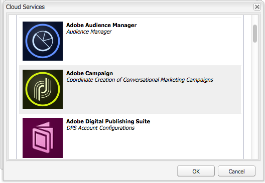

# Adobe Campaign 6.1 및 Adobe Campaign Standard 작업{#working-with-adobe-campaign-and-adobe-campaign-standard}

AEM에서 이메일 컨텐츠를 만들고 Adobe Campaign 이메일에서 처리할 수 있습니다. 이를 위해 다음을 수행해야 합니다.

1. Adobe Campaign 관련 템플릿에서 AEM의 새 뉴스레터를 만듭니다.
1. 모든 기능에 액세스하려면 컨텐츠를 편집하기 전에 [Adobe Campaign 서비스](#selectingtheadobecampaigncloudservice)를 선택합니다.
1. 컨텐츠를 편집합니다.
1. 컨텐츠를 확인합니다.

그러면 컨텐츠가 Adobe Campaign의 게재와 동기화될 수 있습니다. 자세한 지침은 이 문서에 설명되어 있습니다.

>[!NOTE]
>
>이 기능을 사용하려면 먼저 [Adobe Campaign](/help/sites-administering/campaignonpremise.md) 또는 [Adobe Campaign Standard](/help/sites-administering/campaignstandard.md)와 통합되도록 AEM을 구성해야 합니다.

## Adobe Campaign을 통해 이메일 컨텐츠 보내기 {#sending-email-content-via-adobe-campaign}

AEM 및 Adobe Campaign을 구성한 후에는 AEM에서 직접 이메일 게재 컨텐츠를 만든 후 Adobe Campaign에서 처리할 수 있습니다.

AEM에서 Adobe Campaign 컨텐츠를 만들 때 모든 기능에 액세스하려면 컨텐츠를 편집하기 전에 Adobe Campaign 서비스에 연결해야 합니다.

다음 두 가지 경우가 가능합니다.

* 컨텐츠가 Adobe Campaign의 게재와 동기화될 수 있습니다. 이를 통해 게재에서 AEM 컨텐츠를 사용할 수 있습니다.
* (Adobe Campaign 온-프레미스만) 컨텐츠를 Adobe Campaign으로 직접 전송할 수 있으며, 이 경우 자동으로 새 이메일 게재가 생성됩니다. 이 모드에는 제한 사항이 있습니다.

자세한 지침은 이 문서에 설명되어 있습니다.

### 새 이메일 컨텐츠 만들기  {#creating-new-email-content}

>[!NOTE]
>
>이메일 템플릿을 추가할 때는 **/content/campaigns** 아래에 추가하여 사용할 수 있도록 해야 합니다.

1. AEM에서 **웹 사이트** 폴더를 선택한 다음 탐색기에서 이메일 캠페인이 관리되는 위치를 찾습니다. 다음 예에서, 관련 노드는 **웹 사이트** > **캠페인** > **Geometrixx Outdoors** > **이메일 캠페인**&#x200B;입니다.

   >[!NOTE]
   >
   >[이메일 샘플은 Geometrixx에서만 사용할 수 있습니다](/help/sites-developing/we-retail.md#weretail). 패키지 공유에서 샘플 Geometrixx 콘텐츠를 다운로드하십시오.

   

1. **새로 만들기** > **새 페이지**&#x200B;를 선택하여 새 이메일 내용을 만듭니다.
1. Adobe Campaign용으로 만들어진 템플릿 중 하나를 선택한 다음, 페이지의 일반 속성을 입력합니다. 기본적으로 다음과 같은 세 가지 템플릿을 사용할 수 있습니다.

   * **Adobe Campaign Email(AC 6.1)**: 배달을 위해 Adobe Campaign 6.1에 보내기 전에 미리 정의된 템플릿에 컨텐츠를 추가할 수 있습니다.
   * **Adobe Campaign Email(ACS)**: 배달을 위해 Adobe Campaign Standard에 보내기 전에 미리 정의된 템플릿에 컨텐츠를 추가할 수 있습니다.

   

1. **만들기**&#x200B;를 클릭하여 이메일 또는 뉴스레터를 만듭니다.

### Adobe Campaign 클라우드 서비스 및 템플릿 선택 {#selecting-the-adobe-campaign-cloud-service-and-template}

Adobe Campaign과 통합하려면 페이지에 Adobe Campaign 클라우드 서비스를 추가해야 합니다. 이렇게 하면 개인화 및 기타 Adobe Campaign 정보에 액세스할 수 있습니다.

또한 Adobe Campaign 템플릿을 선택하고 제목을 변경한 후, HTML에서 이메일을 보지 않는 사용자를 위해 일반 텍스트 컨텐츠를 추가해야 할 수도 있습니다.

1. 사이드 킥에서 **페이지** 탭을 선택한 다음 **페이지 속성을 선택합니다.**
1. 팝업 창의 **클라우드 서비스** 탭에서 **서비스 추가**&#x200B;를 선택하여 Adobe Campaign 서비스를 추가하고 **확인**&#x200B;을 클릭합니다.

   

1. 드롭다운 목록에서 Adobe Campaign 인스턴스와 일치하는 구성을 선택한 다음 **확인**&#x200B;을 클릭합니다.

   >[!NOTE]
   >
   >클라우드 서비스를 추가한 후에는 반드시 **확인** 또는 **적용**&#x200B;을 탭/클릭하십시오. 이렇게 하면 **Adobe Campaign** 탭이 제대로 작동할 수 있습니다.

1. 기본 **mail** 템플릿 이외의 특정 이메일 배달 템플릿을 적용하려면 **페이지 속성**&#x200B;을 다시 선택합니다. **Adobe Campaign** 탭에서 관련 Adobe Campaign 인스턴스에 이메일 배달 템플릿의 내부 이름을 입력합니다.

   Adobe Campaign Standard에서 템플릿은 **AEM 컨텐츠 포함 배달**&#x200B;입니다. Adobe Campaign 6.1에서는 **AEM 컨텐츠 포함 이메일 배달**&#x200B;입니다.

   템플릿을 선택하면 AEM에서 **Adobe Campaign 뉴스레터** 구성 요소를 자동으로 활성화합니다.

### 이메일 컨텐츠 편집 {#editing-email-content}

클래식 사용자 인터페이스나 터치에 적합한 사용자 인터페이스에서 이메일 컨텐츠를 편집할 수 있습니다.

1. 도구 상자에서 **페이지 속성** > **이메일**&#x200B;을 선택하여 이메일의 제목과 텍스트 버전을 입력합니다.

   

1. 사이드 킥에서 원하는 요소를 추가하여 이메일 컨텐츠를 편집합니다. 이렇게 하려면 요소를 드래그하여 놓으십시오. 그런 다음 편집하려는 요소를 두 번 클릭합니다.

   예를 들어, 개인화 필드가 포함된 텍스트를 추가할 수 있습니다.

   

   Adobe Campaign 뉴스레터/이메일 캠페인에 사용할 수 있는 구성 요소에 대한 설명은 [Adobe Campaign 구성 요소](/help/sites-classic-ui-authoring/classic-personalization-ac-components.md)를 참조하십시오.

   

### 개인화 삽입 {#inserting-personalization}

컨텐츠를 편집할 때 다음을 삽입할 수 있습니다.

* Adobe Campaign 컨텍스트 필드. 이러한 필드는 텍스트 내에 삽입할 수 있는 필드로, 수신자 데이터(예: 이름, 성 또는 대상 차원의 데이터)에 따라 조정됩니다.
* Adobe Campaign 개인화 블록. 브랜드 로고 또는 미러 페이지에 대한 링크와 같은 수신자 데이터와 관련이 없는 사전 정의된 컨텐츠 블록입니다.

캠페인 구성 요소에 대한 전체 설명을 보려면 [Adobe Campaign 구성 요소](/help/sites-classic-ui-authoring/classic-personalization-ac-components.md)를 참조하십시오.

>[!NOTE]
>
>* Adobe Campaign **프로필** 타깃팅 차원의 필드만 고려됩니다.
>* **사이트**&#x200B;에서 속성을 볼 때 Adobe Campaign 컨텍스트 필드에 액세스할 수 없습니다. 편집하는 동안 이메일에서 직접 액세스할 수 있습니다.

>

1. 새 **뉴스레터** > **텍스트 및 개인화(캠페인)** 구성 요소를 삽입합니다.
1. 구성 요소를 두 번 클릭하여 엽니다. **편집** 창에는 개인화 요소를 삽입할 수 있는 기능이 있습니다.

   >[!NOTE]
   >
   >사용 가능한 컨텍스트 필드는 Adobe Campaign의 **프로필** 타깃팅 차원에 해당합니다.
   >
   >AEM 페이지를 Adobe Campaign 이메일](/help/sites-classic-ui-authoring/classic-personalization-ac-campaign.md#linkinganaempagetoanadobecampaignemail)에 연결을 참조하십시오.[

   

1. 사이드 킥에서 **Client Context**&#x200B;를 선택하여 모습 프로필의 데이터를 사용하여 개인화 필드를 테스트합니다.

   

1. 창이 표시되고 원하는 모습을 선택할 수 있습니다. 개인화 필드는 선택된 프로필의 데이터로 자동 교체됩니다.

   

### 뉴스레터 미리 보기 {#previewing-a-newsletter}

뉴스레터의 모양을 미리 보고 개인화도 미리 볼 수 있습니다.

1. 미리 보려는 뉴스레터를 열고 [미리 보기](확대경)를 클릭하여 사이드 킥을 축소합니다.
1. 이메일 클라이언트 아이콘 중 하나를 클릭하여 각 이메일 클라이언트에서 표시되는 뉴스레터 모습을 확인합니다.

   

1. 사이드 킥을 확장하여 편집을 다시 시작합니다.

### AEM에서 컨텐츠 승인  {#approving-content-in-aem}

컨텐츠가 완료되면 승인 프로세스를 시작할 수 있습니다. 도구 상자의 **Workflow** 탭으로 이동하고 **Adobe Campaign에 대한 승인** 작업 과정을 선택합니다.

곧바로 사용할 수 있는 이 워크플로우에는 개정 후 개정 또는 개정 후 거부의 두 단계가 포함되어 있습니다. 그렇지만 이 워크플로우를 확장하고 좀 더 복잡한 프로세스에 맞게 조정할 수 있습니다.

Adobe Campaign에 대한 컨텐츠를 승인하려면 사이드 킥에서 **워크플로우**&#x200B;을 선택하고 **Adobe Campaign에 대한 승인**&#x200B;을 선택하고 **워크플로우 시작**&#x200B;을 클릭하여 워크플로우를 적용합니다. 단계를 거쳐 컨텐츠를 승인합니다. 마지막 워크플로우 단계에서 **승인** 대신 **거부**&#x200B;를 선택하여 컨텐츠를 거부할 수도 있습니다.

컨텐츠가 승인되면 Adobe Campaign에 승인된 것으로 나타납니다. 그러면 이메일을 전송할 수 있습니다.

Adobe Campaign Standard:

Adobe Campaign 6.1:

>[!NOTE]
>
>승인되지 않은 컨텐츠는 Adobe Campaign의 게재와 동기화할 수 있지만 게재를 실행할 수는 없습니다. 승인된 컨텐츠만 캠페인 게재를 통해 전송할 수 있습니다.

## Adobe Campaign Standard 및 Adobe Campaign 6.1에 AEM 연결  {#linking-aem-with-adobe-campaign-standard-and-adobe-campaign}

>[!NOTE]
>
>자세한 내용은 표준 작성 설명서의 [Adobe Campaign 6.1 및 Adobe Campaign Standard을 사용한 작업](/help/sites-authoring/campaign.md)에서 [Adobe Campaign Standard 및 Adobe Campaign 6.1과 AEM 연결](/help/sites-authoring/campaign.md#linking-aem-with-adobe-campaign-standard-and-adobe-campaign-classic)을 참조하십시오.

