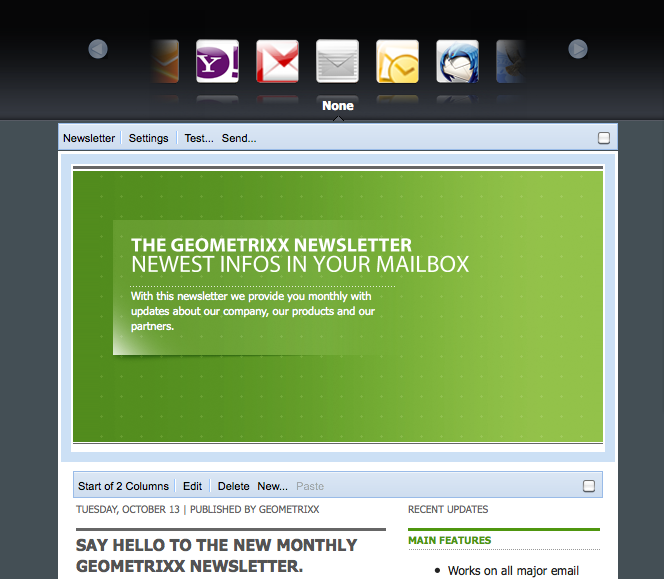

# 이메일 마케팅{#e-mail-marketing}

>[!NOTE]
>
>Adobe는 AEM SMTP 서비스로 열기/바운스(전달 불가능) 보내기의 이메일 추적을 추가로 개선할 계획이 없습니다.
>[AEM을 Adobe Campaign과 통합](/help/sites-administering/campaign.md)하여 활용하는 것이 좋습니다.

뉴스레터와 같은 이메일 마케팅은 리드에게 컨텐츠를 보내는 데 사용할 수 있으므로 모든 마케팅 캠페인에서 중요한 부분을 차지합니다. AEM에서는 기존 AEM 컨텐츠로 뉴스레터를 만들거나 뉴스레터에 사용할 새 컨텐츠를 추가할 수 있습니다.

작성한 뉴스레터를 특정 사용자 그룹에 즉시 보내거나 워크플로우를 사용하여 예약된 시간에 보낼 수 있습니다. 또한 사용자는 원하는 형식의 뉴스레터에 가입할 수 있습니다.

뿐만 아니라 AEM에서 주제 관리, 이전 Newsletter 보관, Newsletter 통계 확인 등의 Newsletter 기능을 관리할 수 있습니다.

>[!NOTE]
>
>Geometrixx에서 Newsletter 템플릿은 자동으로 이메일 편집기를 엽니다. 초대 메시지와 같이 이메일을 보내려는 다른 템플릿에서도 이메일 편집기를 사용할 수 있습니다. 이메일 편집기는 페이지가 **mcm/components/newsletter/page**&#x200B;에서 상속될 때마다 표시됩니다.

이 문서에서는 AEM에서의 뉴스레터 작성에 대한 기본 사항을 설명합니다. 이메일 마케팅을 사용하는 방법에 대한 자세한 내용은 다음 문서를 참조하십시오.

* [효과적인 뉴스레터 랜딩 페이지 만들기](/help/sites-classic-ui-authoring/classic-personalization-campaigns-email-landingpage.md)
* [구독 관리](/help/sites-classic-ui-authoring/classic-personalization-campaigns-email-subscriptions.md)
* [이메일 서비스 공급자에 이메일 게시](/help/sites-classic-ui-authoring/classic-personalization-campaigns-email-newsletters.md)
* [바운스된 이메일 추적](/help/sites-classic-ui-authoring/classic-personalization-campaigns-email-tracking-bounces.md)

>[!NOTE]
>
>뉴스레터를 게시 인스턴스에 먼저 게시하지 않았거나 게시 인스턴스를 사용할 수 없는 경우에 이메일 공급자를 업데이트하거나, 플라이트 테스트를 수행하거나, 뉴스레터를 전송하는 경우 이러한 작업이 실패합니다. 뉴스레터를 게시하고 게시 인스턴스가 작동되어 실행 중인지 확인하십시오.

## 뉴스레터 경험 만들기 {#creating-a-newsletter-experience}

>[!NOTE]
>
>osgi 구성을 통해 이메일 알림을 구성해야 합니다. [이메일 알림 구성](/help/sites-administering/notification.md)을 참조하십시오.

1. 왼쪽 창에서 새 캠페인을 선택하거나 오른쪽 창에서 캠페인을 두 번 클릭합니다.

1. 다음 아이콘을 사용하여 목록 보기를 선택합니다.

   

1. **새로 만들기...**&#x200B;를 클릭합니다...

   만들 경험의 **제목**, **이름** 및 유형을 지정합니다(이 경우에는 Newsletter).

   

1. **만들기**&#x200B;를 클릭합니다.

1. 새 대화 상자가 즉시 열립니다. 여기에서 뉴스레터의 속성을 입력할 수 있습니다.

   **기본 수신자 목록**&#x200B;은 뉴스레터의 터치포인트를 구성하므로 필수 필드입니다(목록에 대한 자세한 내용은 [목록 작업](/help/sites-classic-ui-authoring/classic-personalization-campaigns.md#workingwithlists) 참조).

   

   * **발송자 이름**: 뉴스레터 발송자로 표시되는 이름입니다.

   * **보낸 주소**: 뉴스레터 발송자로 표시되는 메일 주소입니다.

   * **제목**: 뉴스레터의 제목입니다.

   * **회신**: 발송된 뉴스레터에 대해 회신 가능한 메일 주소입니다.

   * **설명**: 뉴스레터에 대한 설명입니다.

   * **발송 시간**: 뉴스레터를 발송할 시간입니다.

   * **기본 수신자 목록**: 뉴스레터를 수신할 수신자의 기본 목록입니다.
   이후 단계에 **속성...** 대화 상자에서 업데이트할 수 있습니다.

1. **확인**&#x200B;을 클릭하여 저장합니다.

## 뉴스레터에 컨텐츠 추가 {#adding-content-to-newsletters}

다른 AEM 구성 요소의 경우와 마찬가지로 동적 컨텐츠를 비롯한 컨텐츠를 뉴스레터에 추가할 수 있습니다. Geometrixx의 Newsletter 템플릿에는 컨텐트를 Newsletter에 추가하고 수정하는 데 사용할 수 있는 여러 구성 요소가 있습니다.

1. MCM에서 **캠페인** 탭을 클릭하고 컨텐트를 추가하거나 편집할 Newsletter를 두 번 클릭합니다. Newsletter가 열립니다.

1. 구성 요소가 표시되지 않는 경우 디자인 보기로 이동하고 필요한 구성 요소(예: Newsletter 구성 요소)를 활성화한 후에 편집을 시작합니다.
1. 필요한 텍스트, 이미지 또는 기타 구성 요소를 입력합니다. Geometrixx 예제에서는 텍스트, 이미지, 제목 및 2열이라는 4가지 구성 요소를 사용할 수 있습니다. 뉴스레터 설정 방법에 따라 이보다 많거나 적은 구성 요소가 사용될 수 있습니다.

   >[!NOTE]
   >
   >변수를 사용하여 뉴스레터를 개인화합니다. Geometrixx 뉴스레터의 경우 텍스트 구성 요소에 변수가 있습니다. 변수 값은 사용자 프로필의 정보에서 상속됩니다.

   

1. 변수를 삽입하려면 목록에서 변수를 선택하고 **삽입**&#x200B;을 클릭합니다. 프로필의 값이 변수에 채워집니다.

## 뉴스레터 개인화 {#personalizing-newsletters}

Geometrixx의 뉴스레터에 있는 텍스트 구성 요소에 사전 정의된 변수를 삽입하여 뉴스레터를 개인화합니다. 변수 값은 사용자 프로필의 정보에서 상속됩니다.

클라이언트 컨텍스트를 사용하고 프로필을 로드하여 Newsletter의 개인화 결과를 시뮬레이션할 수도 있습니다.

Newsletter를 개인화하고 결과를 시뮬레이션하는 방법은 다음과 같습니다.

1. MCM에서 설정을 사용자 지정할 Newsletter를 엽니다.

1. 개인화할 텍스트 구성 요소를 엽니다.

1. 변수를 표시할 위치에 커서를 두고 드롭다운 목록에서 변수를 선택한 다음 **삽입**&#x200B;을 클릭합니다. 필요에 따라 여러 변수를 삽입하고 **확인**&#x200B;을 클릭합니다.

   

1. 발송 후에 변수가 어떻게 표시되는지 시뮬레이션하려면 Ctrl+Alt+C를 눌러 클라이언트 컨텍스트를 열고 **로드**&#x200B;를 선택합니다. 목록에서 프로필을 로드할 사용자를 선택하고 **확인**&#x200B;을 클릭합니다.

   로드한 프로필의 정보가 변수에 채워집니다.

   

## 여러 이메일 클라이언트에서 뉴스레터 테스트 {#testing-newsletters-in-different-e-mail-clients}

>[!NOTE]
>
>뉴스레터를 보내기 전에 `https://localhost:4502/system/console/configMgr`에서 OSGi 구성의 Day CQ Link Externalizer를 확인하십시오.
>
>기본적으로 이 매개 변수의 값은 `localhost:4502`이며 인스턴스 실행을 위한 포트가 바뀌면 작업을 완료할 수 없습니다.

널리 사용되는 여러 이메일 클라이언트에서 뉴스레터가 리드에게 어떻게 표시되는지 시험해 봅니다. 기본적으로 뉴스레터는 어떠한 이메일 클라이언트도 선택되지 않은 상태에서 열립니다.

현재 다음과 같은 이메일 클라이언트에서 뉴스레터를 확인할 수 있습니다.

* Yahoo! 메일
* Gmail
* Hotmail
* Thunderbird
* Microsoft Outlook 2007
* Apple Mail

다른 클라이언트로 전환하려면 해당 아이콘을 클릭하여 해당 이메일 클라이언트에서 뉴스레터를 확인합니다.

1. MCM에서 설정을 사용자 지정할 Newsletter를 엽니다.

1. 상단 막대에서 이메일 클라이언트를 클릭하여 해당 클라이언트에서 Newsletter가 어떻게 표시되는지 확인합니다.

   

1. 확인할 다른 이메일 클라이언트에 대해 이 단계를 반복합니다.

   

## 뉴스레터 설정 사용자 지정 {#customizing-newsletter-settings}

승인된 사용자만 뉴스레터를 보낼 수 있지만 다음과 같은 설정을 사용자 지정할 수 있습니다.

* 제목 줄. 사용자가 뉴스레터를 스팸으로 취급하지 않고 이메일을 열어 볼 수 있도록 합니다.
* 보낸 사람 주소(예: noreply@geometrixx.com). 사용자가 특정 주소에서 보낸 이메일을 수신하도록 합니다.

Newsletter 설정을 사용자 지정하는 방법은 다음과 같습니다.

1. MCM에서 설정을 사용자 지정할 Newsletter를 엽니다.

   

1. Newsletter 상단에서 **설정**&#x200B;을 클릭합니다.

   
1. **보낸 사람** 이메일 주소를 입력합니다.

1. 필요한 경우 이메일의 **제목**&#x200B;을 수정합니다.

1. 드롭다운 목록에서 **기본 수신자 목록**&#x200B;을 선택합니다.

1. **확인**&#x200B;을 클릭합니다.

   뉴스레터를 테스트하거나 보내면 지정된 이메일 주소와 제목으로 수신자에게 이메일이 발송됩니다.

## 뉴스레터 플라이트 테스트 {#flight-testing-newsletters}

플라이트 테스트는 필수적이지는 않지만, 뉴스레터를 발송하기 전에 원하는 대로 표시되는지를 확인해 볼 수 있습니다.

플라이트 테스트의 기능은 다음과 같습니다.

* [의도된 모든 클라이언트](#testing-newsletters-in-different-e-mail-clients)에서 뉴스레터를 확인합니다.
* 메일 서버가 올바르게 설정되었는지 확인합니다.
* 이메일이 스팸으로 분류되는지 확인합니다. 수신자 목록에 자신을 포함하십시오.

>[!NOTE]
>
>뉴스레터를 게시 인스턴스에 먼저 게시하지 않았거나 게시 인스턴스를 사용할 수 없는 경우에 이메일 공급자를 업데이트하거나, 플라이트 테스트를 수행하거나, 뉴스레터를 전송하는 경우 이러한 작업이 실패합니다. 뉴스레터를 게시하고 게시 인스턴스가 작동되어 실행 중인지 확인하십시오.

뉴스레터 플라이트 테스트 방법은 다음과 같습니다.

1. MCM에서 테스트하여 발송할 Newsletter를 엽니다.

1. Newsletter 상단에서 **테스트**&#x200B;를 클릭하여 발송하기 전에 테스트합니다.

   

1. 뉴스레터를 보낼 테스트 메일 주소를 입력하고 **전송**&#x200B;을 클릭합니다. 프로필을 변경하려면 클라이언트 컨텍스트에서 다른 프로필을 로드합니다. 이렇게 하려면 Ctrl+Alt+C를 누르고 로드를 선택한 후 프로필을 로드합니다.

## 뉴스레터 보내기 {#sending-newsletters}

>[!NOTE]
>
>Adobe는 AEM SMTP 서비스로 열기/바운스(전달 불가능) 보내기의 이메일 추적을 추가로 개선할 계획이 없습니다.
>[AEM을 Adobe Campaign과 통합](/help/sites-administering/campaign.md)하여 활용하는 것이 좋습니다.

뉴스레터 또는 목록에서 뉴스레터를 발송할 수 있습니다. 여기에서는 두 가지 절차를 모두 설명합니다.

>[!NOTE]
>
>뉴스레터를 보내기 전에 `https://localhost:4502/system/console/configMgr`에서 OSGi 구성의 Day CQ Link Externalizer를 확인하십시오.
>
>기본적으로 이 매개 변수의 값은 `localhost:4502`이며 인스턴스 실행을 위한 포트가 바뀌면 작업을 완료할 수 없습니다.

>[!NOTE]
>
>뉴스레터를 게시 인스턴스에 먼저 게시하지 않았거나 게시 인스턴스를 사용할 수 없는 경우에 이메일 공급자를 업데이트하거나, 플라이트 테스트를 수행하거나, 뉴스레터를 전송하는 경우 이러한 작업이 실패합니다. 뉴스레터를 게시하고 게시 인스턴스가 작동되어 실행 중인지 확인하십시오.

### 캠페인에서 뉴스레터 보내기  {#sending-newsletters-from-a-campaign}

캠페인 내에서 뉴스레터를 발송하는 방법은 다음과 같습니다.

1. MCM에서 발송할 뉴스레터를 엽니다.

   >[!NOTE]
   >
   >뉴스레터를 발송하기 전에 [설정을 사용자 지정](#customizing-newsletter-settings)하여 뉴스레터의 제목 및 보낸 사람 이메일 주소를 사용자 지정했는지 확인합니다.
   >
   >
   >뉴스레터를 발송하기 전에 [플라이트 테스트](#flight-testing-newsletters)를 거치는 것이 좋습니다.

1. 뉴스레터 상단에서 **전송**&#x200B;을 클릭합니다. Newsletter 마법사가 열립니다.

1. 수신자 목록에서 Newsletter를 수신할 목록을 선택하고 **다음**&#x200B;을 클릭합니다.

   

1. 설정 완료를 확인하는 메시지가 나타납니다. **전송**&#x200B;을 클릭하여 실제로 뉴스레터를 보냅니다.

   

   >[!NOTE]
   >
   >Newsletter가 정상적으로 수신되었는지 확인할 수 있도록 수신자에 자신을 포함하십시오.

### 목록에서 Newsletter 보내기  {#sending-newsletters-from-a-list}

목록에서 뉴스레터를 발송하는 방법은 다음과 같습니다.

1. MCM의 왼쪽 창에서 **목록**&#x200B;을 클릭합니다.

   >[!NOTE]
   >
   >뉴스레터를 발송하기 전에 [설정을 사용자 지정](#customizing-newsletter-settings)하여 뉴스레터의 제목 및 보낸 사람 이메일 주소를 사용자 지정했는지 확인합니다. 목록에서 뉴스레터를 보낼 때는 테스트할 수 없습니다. 뉴스레터에서 보낼 때는 [플라이트 테스트](#flight-testing-newsletters)를 수행할 수 있습니다.

1. Newsletter를 발송할 리드 목록 옆의 확인란을 선택합니다.

1. **도구** 메뉴에서 **뉴스레터 전송**&#x200B;을 선택합니다. **뉴스레터 전송** 창이 열립니다.

   

1. **Newsletter** 필드에서 발송할 Newsletter를 선택하고 **다음**&#x200B;을 클릭합니다.

   

1. 설정 완료를 확인하는 메시지가 나타납니다. **전송**&#x200B;을 클릭하여 선택한 뉴스레터를 지정된 리드 목록에 발송합니다.

   

   Newsletter가 선택된 수신자에게 발송됩니다.

## 뉴스레터 가입 {#subscribing-to-a-newsletter}

이 섹션에서는 뉴스레터에 가입하는 방법을 설명합니다.

### 뉴스레터 가입  {#subscribing-to-a-newsletter-1}

Newsletter에 가입하는 방법은 다음과 같습니다. Geometrixx 웹 사이트를 예로 들겠습니다.

1. **웹 사이트**&#x200B;를 클릭하고 Geometrixx **도구 모음**&#x200B;을 찾아 엽니다.

   

1. Geometrixx 뉴스레터 **등록** 필드에 이메일 주소를 입력하고 **등록**&#x200B;을 클릭합니다. 이제 Newsletter에 가입되었습니다.
