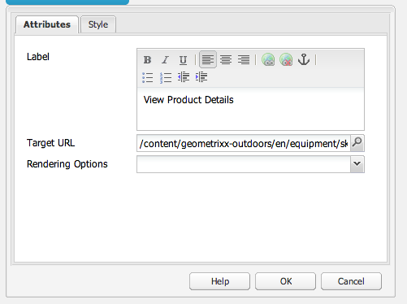
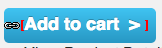

# 랜딩 페이지{#landing-pages}

랜딩 페이지 기능을 사용하면 디자인과 컨텐츠를 빠르고 쉽게 AEM 페이지로 가져올 수 있습니다. 웹 개발자는 전체 페이지 또는 페이지의 일부만을 가져올 수 있는 HTML과 추가 자산을 준비할 수 있습니다. 이 기능은 제한된 시간 동안만 활성화되고 신속히 만들어야 하는 마케팅 랜딩 페이지를 만드는 데 유용합니다.

이 페이지에서는 다음 사항에 대해 설명합니다.

* 사용 가능한 구성 요소를 포함하여 AEM에 표시되는 랜딩 페이지의 모양
* 랜딩 페이지를 만드는 방법과 디자인 패키지를 가져오는 방법
* AEM에서 랜딩 페이지로 작업하는 방법
* 모바일 랜딩 페이지를 설정하는 방법

가져올 디자인 패키지 준비에 대해서는 [디자인 가져오기 확장 및 구성](/help/sites-administering/extending-the-design-importer-for-landingpages.md)에서 다룹니다. Adobe Analytics와의 통합에 대해서는 [랜딩 페이지를 Adobe Analytics와 통합](/help/sites-administering/integrating-landing-pages-with-adobe-analytics.md)에서 다룹니다.

>[!CAUTION]
>
>랜딩 페이지를 가져오는 데 사용되는 디자인 가져오기 프로그램은 [AEM 6.5에서 더 이상 사용되지 않습니다](/help/release-notes/deprecated-removed-features.md#deprecated-features).

>[!CAUTION]
>
>디자인 가져오기는 `/apps`에 대한 액세스를 요구하므로 `/apps`이(가) 변경할 수 없는 포함된 클라우드 환경에서는 작동하지 않습니다.

## 랜딩 페이지란 무엇입니까? {#what-are-landing-pages}

랜딩 페이지는 이메일, Adword/배너, 소셜 미디어와 같이 마케팅 활동의 &quot;종점&quot;이 되는 하나 또는 여러 페이지로 이루어진 사이트입니다. 랜딩 페이지는 다양한 용도로 사용될 수 있지만, 모든 랜딩 페이지의 공통적인 용도는 바로 방문자가 작업을 완수하고 이것이 랜딩 페이지의 성공을 정의한다는 것입니다.

AEM의 랜딩 페이지 기능을 통해 마케터는 에이전시의 웹 디자이너나 내부 크리에이티브 팀과 함께 작업하여 AEM에 쉽게 가져오고, 마케터가 여전히 편집할 수 있고, 나머지 AEM 제공 사이트와 동일한 관리하에 게시되는 페이지 디자인을 만들 수 있습니다.

AEM에서, 다음 단계를 수행하여 랜딩 페이지를 만듭니다.

1. 랜딩 페이지 캔버스가 들어 있는 페이지를 AEM에서 만듭니다. AEM은 **Importer 페이지**&#x200B;라는 샘플과 함께 제공됩니다.

1. [HTML 및 자산을 준비합니다.](/help/sites-administering/extending-the-design-importer-for-landingpages.md)
1. 리소스를 여기서 디자인 패키지로 지칭되는 ZIP 파일에 넣어 패키지로 만듭니다.
1. Importer 페이지에서 디자인 패키지를 가져옵니다.
1. 페이지를 수정하고 게시합니다.

### 데스크톱 랜딩 페이지 {#desktop-landing-pages}

AEM의 샘플 랜딩 페이지는 다음과 같은 모양입니다.

### 모바일 랜딩 페이지 {#mobile-landing-pages}

랜딩 페이지에는 페이지의 모바일 버전도 있을 수 있습니다. 랜딩 페이지의 모바일 버전이 별도로 있으려면 가져오기 디자인에는 두 개의 html 파일이 있어야 합니다.*index.htm(l)* 및 *mobile.index.htm(l)*.

랜딩 페이지 가져오기 절차는 일반 랜딩 페이지의 절차와 동일하며, 랜딩 페이지 디자인에는 모바일 랜딩 페이지에 해당하는 추가 html 파일이 있습니다. 이 html 파일에도 데스크톱 랜딩 페이지 html처럼 `div`인 canvas `id=cqcanvas`가 있어야 하며, 이것은 데스크톱 랜딩 페이지에 대해 설명된 모든 편집 가능한 구성 요소를 지원합니다.

모바일 랜딩 페이지는 데스크톱 랜딩 페이지의 하위 페이지로 만들어집니다. 열려면, [웹 사이트]에서 랜딩 페이지로 이동하고 하위 페이지를 엽니다.

>[!NOTE]
>
>모바일 랜딩 페이지는 데스크톱 랜딩 페이지가 삭제되거나 비활성화되는 경우 데스크톱 랜딩 페이지와 함께 삭제되거나/비활성화됩니다.

## 랜딩 페이지 구성 요소  {#landing-page-components}

가져오는 HTML 부분들을 AEM 내에서 편집할 수 있게 하려면, 랜딩 페이지 HTML 내의 컨텐츠를 직접 AEM 구성 요소에 매핑하면 됩니다. 디자인 가져오기는 기본값당 다음 구성 요소를 인식합니다.

* 텍스트 - 모든 텍스트
* 제목 - H1-6 태그에 있는 컨텐트
* 이미지 - 교환할 수 있도록 만든 이미지
* 클릭유도문안:

   * 클릭스루 링크
   * 그래픽 링크

* CTA 리드 양식 - 사용자 정보 수집
* 단락 시스템(Parsys) - 모든 구성 요소의 추가 허용, 또는 위의 전환된 구성 요소

이 외에, 이를 확장하고 사용자 지정 구성 요소를 지원할 수 있습니다. 이 섹션에서는 구성 요소에 대해 자세히 설명합니다.

### 텍스트 {#text}

텍스트 구성 요소로 WYSIWYG 편집기를 사용하여 텍스트 블록을 입력할 수 있습니다. 자세한 내용은 [텍스트 구성 요소](/help/sites-authoring/default-components.md#text)를 참조하십시오.

다음은 랜딩 페이지에 있는 텍스트 구성 요소의 예입니다.

#### 제목 {#title}

제목 구성 요소를 통해 제목을 표시하고 크기(h1-6)를 구성할 수 있습니다. 자세한 내용은 [제목 구성 요소](/help/sites-authoring/default-components.md#title)를 참조하십시오.

다음은 랜딩 페이지에 있는 제목 구성 요소의 예입니다.

#### 이미지 {#image}

이미지 구성 요소에는 Content Finder에서 드래그 드롭하거나 클릭하여 업로드할 수 있는 이미지가 표시됩니다. 자세한 내용은 [이미지 구성 요소](/help/sites-authoring/default-components.md)를 참조하십시오.

다음은 랜딩 페이지에 있는 이미지 구성 요소의 예입니다.

#### 클릭유도문안(CTA) {#call-to-action-cta}

랜딩 페이지 디자인에는 몇 가지 링크가 있는데, 이중 일부는 &quot;클릭유도문안용&quot;일 수 있습니다.

클릭유도문안(CTA)은 방문자에게 랜딩 페이지에서 &quot;지금 가입&quot;, &quot;이 비디오 보기&quot;, &quot;제한된 시간만&quot; 등과 같은 즉각적인 작업을 수행하도록 하는 데 사용됩니다.

* 클릭스루 링크 - 클릭 시 방문자를 타겟 URL로 이동시키는 텍스트 링크를 추가할 수 있습니다.
* 그래픽 링크 - 클릭 시 방문자를 타겟 URL로 이동시키는 이미지를 추가할 수 있습니다.

두 CTA 구성 요소 모두에 유사한 옵션이 있습니다. 클릭스루 링크에는 추가 서식 옵션이 있습니다. 구성 요소는 음 단락에서 자세히 설명합니다.

#### 클릭스루 링크 {#click-through-link}

이 CTA 구성 요소는 랜딩 페이지에서 텍스트 링크를 추가하는 데 사용할 수 있습니다. 이 링크를 클릭하면 구성 요소 속성에 지정된 타겟 URL이 표시됩니다. &quot;클릭유도문안&quot; 그룹의 일부입니다.

**레이블** 사용자에게 표시되는 텍스트입니다. 서식은 리치 텍스트 편집기로 수정할 수 있습니다.

**Target** URL사용자가 텍스트를 클릭하는 경우 방문할 URI를 입력합니다.

**렌더링** 옵션렌더링 옵션을 설명합니다. 다음 중에서 선택할 수 있습니다.

* 새 브라우저 창에 페이지를 로드합니다.
* 페이지를 현재 창에서 로드합니다.
* 상위 프레임에 페이지를 로드합니다.
* 모든 프레임을 취소하고 전체 브라우저 창에서 페이지를 로드합니다.

**[** 스타일] 탭에서 CSS 스타일 시트 경로를 입력합니다.

**[** 스타일] 탭에서 구성 요소를 고유하게 식별할 수 있는 ID를 입력합니다.

다음은 클릭스루 링크의 예입니다.

#### 그래픽 링크 {#graphical-link}

이 CTA 구성 요소는 랜딩 페이지에서 링크가 있는 그래픽 이미지를 추가하는 데 사용할 수 있습니다. 이미지는 간단한 단추나 배경용 그래픽 이미지일 수 있습니다. 이미지를 클릭하면, 구성 요소 속성에 지정된 타겟 URL로 이동합니다. **클릭유도문안** 그룹의 일부입니다.

**레이블** 사용자가 그래픽에 표시되는 텍스트입니다. 서식은 리치 텍스트 편집기로 수정할 수 있습니다.

**Target** URL사용자가 이미지를 클릭하면 방문할 URI를 입력합니다.

**렌더링** 옵션렌더링 옵션을 설명합니다. 다음 중에서 선택할 수 있습니다.

* 새 브라우저 창에 페이지를 로드합니다.
* 페이지를 현재 창에서 로드합니다.
* 상위 프레임에 페이지를 로드합니다.
* 모든 프레임을 취소하고 전체 브라우저 창에서 페이지를 로드합니다.

**[** 스타일] 탭에서 CSS 스타일 시트 경로를 입력합니다.

**[** 스타일] 탭에서 구성 요소를 고유하게 식별할 수 있는 ID를 입력합니다.

다음은 그래픽 링크의 예입니다.

### 클릭유도문안(CTA) 리드 양식 {#call-to-action-cta-lead-form}

리드 양식은 방문자/리드의 프로필 정보를 수집하는 데 사용되는 양식입니다. 이 정보는 저장했다가 나중에 이 정보를 기반으로 효과적인 마케팅을 수행하는 데 사용할 수 있습니다. 이 정보에는 일반적으로 직책, 이름, 이메일, 출생일, 주소, 관심사 등이 포함됩니다. **CTA 리드 양식** 그룹의 일부입니다.

CTA 리드 양식의 예는 다음과 같은 모양입니다.

CTA 리드 양식은 여러 가지 구성 요소로 이루어집니다.

* **리드 양식**
리드 양식 구성 요소는 페이지에서 새 리드 양식의 시작 부분과 끝 부분을 정의합니다. 이러한 요소 사이에 이메일 ID, 이름 등의 다른 구성 요소를 배치할 수 있습니다.

* **양식 필드 및 요소**
양식 필드 및 요소에는 텍스트 상자, 라디오 단추, 이미지 등이 포함될 수 있습니다. 사용자는 양식 필드에서 텍스트 입력 등의 작업을 수행하는 경우가 많습니다. 자세한 내용은 개별 양식 요소를 참조하십시오.

* **프로필 구성 요소**
프로필 구성 요소는 Social Collaboration에 사용되는 방문자 프로필 및 방문자별 개인화가 필요한 기타 영역과 관련됩니다.

앞의 내용은 예제 양식을 보여 줍니다.**리드 양식** 구성 요소(시작 및 종료)로 구성되며 **첫 번째 이름** 및 **이메일 ID** 필드와 **제출** 필드로 구성됩니다.

사이드킥에서, CTA 리드 양식에 다음 구성 요소를 사용할 수 있습니다.

#### 많은 리드 양식 구성 요소에 공통되는 설정 {#settings-common-to-many-lead-form-components}

각 리드 양식 구성 요소가 다른 용도로 사용되더라도 비슷한 옵션 및 매개 변수로 구성되는 경우가 많습니다.

양식 구성 요소를 구성할 때, 대화 상자에서 다음 탭을 사용할 수 있습니다.

* **제목 및 텍스트**
여기서는 기본 정보(예: 구성 요소의 제목 및 추가 텍스트)를 지정해야 합니다. 적절한 경우 필드의 다중 선택 여부 및 항목 선택 가능 여부 등 기타 핵심 정보를 정의할 수도 있습니다.

* **초기값**
기본값을 지정할 수 있습니다.

* **제한**
여기에서 필수 필드인지 여부 및 필드의 제한 조건(예: 숫자여야 함)을 지정할 수 있습니다.

* **스타일링**
필드의 크기 및 스타일을 지정합니다.

>[!NOTE]
>
>표시되는 필드는 개별 구성 요소에 따라 다릅니다.
>
>일부 리드 양식 구성 요소에는 특정 옵션이 없습니다. 이러한 [일반 설정](/help/sites-authoring/default-components.md#formsgroup)에 대한 자세한 내용은 양식을 참조하십시오.

#### 리드 양식 구성 요소 {#lead-form-components}

다음 섹션에서는 클릭유도문안 리드 양식에 사용할 수 있는 구성 요소에 대해 설명합니다.

**정보** 사용자가 정보를 추가할 수 있습니다.

**주소** 필드사용자에게 주소 정보를 입력할 수 있습니다. 이 구성 요소를 구성할 때에는 대화 상자에서 요소 이름을 입력해야 합니다. 요소 이름은 양식 요소의 이름입니다. 저장소 내 데이터가 저장되는 위치를 나타냅니다.

**생년월일** 은 생년월일 정보를 입력할 수 있습니다.

**이메일** ID사용자가 이메일 주소(ID)를 입력할 수 있습니다.

**이름** 사용자가 이름을 입력할 수 있는 필드를 제공합니다.

**성별** 사용자는 드롭다운 목록에서 성별을 선택할 수 있습니다.

**성** 이름 사용자가 성 정보를 입력할 수 있습니다.

**리드** 양식이 구성 요소를 추가하여 랜딩 페이지에 리드 양식을 추가합니다. 리드 양식에는 자동으로 리드 양식 시작 및 리드 양식 끝 필드가 포함됩니다. 그 사이에 이 섹션에 설명된 리드 양식 구성 요소를 추가합니다.

리드 양식 구성 요소는 **양식 시작** 및 **양식 끝** 요소를 사용하여 양식의 시작과 끝을 정의합니다. 이러한 단락이 항상 쌍을 이루어야 양식이 올바르게 정의됩니다.

리드 양식을 추가한 후에는 해당 막대에서 **편집**&#x200B;을 클릭하여 양식의 시작이나 양식의 끝을 구성할 수 있습니다.

**리드 양식 시작**

구성을 위해 **양식** 및 **고급** 탭을 사용할 수 있습니다.

**감사 인사 페이지**
방문자의 정보 입력에 대한 감사 인사를 표시하는 참조 페이지입니다. 비워 두면 전송 후 양식이 다시 표시됩니다.

**워크플로우** 시작리드 양식이 제출되면 시작되는 워크플로우를 결정합니다.

**게시물** 옵션다음 게시물 옵션을 사용할 수 있습니다.

* 리드 만들기
* 이메일 서비스: 가입자를 만들고 목록에 추가합니다. ExactTarget과 같은 이메일 서비스 공급자를 사용하는 경우 사용합니다.
* 이메일 서비스:자동 응답자 이메일 보내기 - ExactTarget과 같은 이메일 서비스 공급자를 사용하는 경우에 사용합니다.
* 이메일 서비스:목록에서 사용자 가입 해지 - ExactTarget과 같은 이메일 서비스 공급자를 사용하는 경우 사용합니다.
* 사용자 가입 해지

**양식** 식별자양식 식별자는 리드 양식을 고유하게 식별합니다. 단일 페이지에 여러 개의 양식이 있는 경우 양식 식별자를 사용하십시오. 양식마다 각기 다른 식별자가 있어야 합니다.

**로드 경로** 사전 정의된 값을 리드 양식 필드에 로드하는 데 사용되는 노드 속성의 경로입니다.

저장소의 노드에 대한 경로를 지정하는 선택적 필드입니다. 이 노드의 속성이 필드 이름과 일치하면 양식의 해당 필드에 이러한 속성의 값이 미리 로드됩니다. 일치하는 속성이 없으면 필드에 기본값이 포함됩니다.

**클라이언트** 유효성 검사이 양식에 대해 클라이언트 유효성 검사가 필수인지 여부를 지정합니다(서버 유효성 검사 항상 수행). 이 작업은 Forms Captcha 구성 요소와 연계하여 수행할 수 있습니다.

**유효성 검사 리소스** 유형개별 필드가 아닌 전체 리드 양식의 유효성을 검사하려는 경우 양식 유효성 검사 리소스 유형을 정의합니다.

전체 양식의 유효성을 검사하는 경우 다음 중 하나를 포함해야 합니다.

* 클라이언트 유효성 검사용 스크립트:
   ` /apps/<myApp>/form/<myValidation>/formclientvalidation.jsp`

* 서버 쪽의 유효성 검사용 스크립트:
   ` /apps/<myApp>/form/<myValidation>/formservervalidation.jsp`

**작업 구성** 게시 옵션에서 선택한 내용에 따라, 작업 구성이 변경됩니다. 예를 들어, 리드 만들기를 선택하면 리드를 어떤 목록에 추가할지 구성할 수 있습니다.

* **전송 단추 표시**
전송 단추를 표시할지를 나타냅니다.

* **전송 이름**
양식에 전송 단추가 여러 개인 경우에 사용할 식별자입니다.

* **전송 제목**
단추에 표시되는 이름(예: 전송 또는 보내기)입니다.

* **재설정 단추 표시**
이 확인란을 선택하면 재설정 단추가 표시됩니다.

* **재설정 제목**
재설정 단추에 표시되는 이름입니다.

* **설명**
단추 아래에 표시되는 정보입니다.

## 랜딩 페이지 만들기 {#creating-a-landing-page}

랜딩 페이지를 만들 때에는 세 가지 단계를 수행해야 합니다.

1. Importer 페이지를 작성합니다.
1. [가져올 HTML을 준비합니다.](/help/sites-administering/extending-the-design-importer-for-landingpages.md)
1. 디자인 패키지를 가져옵니다.

### 디자인 가져오기 사용  {#use-of-the-design-importer}

페이지 가져오기에 HTML 준비, 확인 및 페이지 테스트가 포함되므로 랜딩 페이지 가져오기는 관리자 작업으로 사용됩니다. 관리자는 가져오기를 수행하는 사용자가 `/apps`에 대한 읽기, 쓰기, 만들기 및 삭제 권한을 필요로 합니다. 사용자에게 이러한 권한이 없으면 가져오기에 실패합니다.

>[!NOTE]
>
>디자인 가져오기는 `/apps`에 대한 읽기, 쓰기, 만들기 및 삭제 권한이 필요한 관리 도구이므로 Adobe은 제작 과정에서 디자인 가져오기를 사용하지 않는 것이 좋습니다.

Adobe는 스테이징 인스턴스에서 디자인 가져오기 프로그램을 사용하는 것이 좋습니다. 스테이징 인스턴스에서는 프로덕션 인스턴스에 코드 배포를 담당하는 개발자가 가져오기를 테스트하고 유효성을 검증할 수 있습니다.

### Importer 페이지 작성 {#creating-an-importer-page}

랜딩 페이지 디자인을 가져오려면 먼저 캠페인 등에서 Importer 페이지를 만들어야 합니다. Imporer 페이지 템플릿을 사용하면 전체 HTML 랜딩 페이지를 가져올 수 있습니다. 페이지에는 드래그 앤 드롭을 사용하여 랜딩 페이지 디자인 패키지를 가져올 수 있는 드롭 상자가 들어 있습니다.

>[!NOTE]
>
>기본적으로 Importer 페이지는 캠페인 아래에만 만들 수 있지만 `/content/mysite` 아래에 랜딩 페이지를 만들기 위해 이 템플릿을 오버레이할 수도 있습니다.

새 랜딩 페이지를 만들려면:

1. **웹 사이트** 콘솔로 이동합니다.
1. 왼쪽 창에서 캠페인을 선택합니다.
1. **새로 만들기**&#x200B;를 클릭하여 **페이지 만들기** 창을 엽니다.
1. **Importer 페이지** 템플릿을 선택하고, 제목과 선택적으로 이름을 추가한 다음 **만들기**&#x200B;를 클릭합니다.

   

   새 Importer 페이지가 표시됩니다.

### 가져오기용 HTML 준비 {#preparing-the-html-for-import}

디자인 패키지를 가져오기 전에 HTML을 준비해야 합니다. 자세한 내용은 [디자인 Importer 확장 및 구성](/help/sites-administering/extending-the-design-importer-for-landingpages.md)을 참조하십시오.

### 디자인 패키지 가져오기  {#importing-the-design-package}

Importer 페이지가 만들어지면 디자인 패키지를 여기에 가져올 수 있습니다. 디자인 패키지 만들기와 권장 구조에 대한 자세한 내용은 [디자인 Importer 확장 및 구성](/help/sites-administering/extending-the-design-importer-for-landingpages.md)을 참조하십시오.

디자인 패키지가 준비되었다고 가정하고 다음 절차에서는 디자인 패키지를 Importer 페이지에 가져오는 방법을 설명합니다.

1. [앞서 작성한](#creatingablankcanvaspage) 가져오기 프로그램 페이지를 엽니다.

   

1. 디자인 패키지를 드롭 상자에 드래그하여 놓습니다. 패키지를 드래그할 때 화살표의 방향이 바뀝니다.
1. 드래그하여 놓은 결과, Importer 페이지 대신에 랜딩 페이지가 표시됩니다. HTML 랜딩 페이지를 성공적으로 가져왔습니다.

   

>[!NOTE]
>
>가져오기를 수행할 경우 올바르지 않은 마크업 가져오기 및 게시를 방지하기 위해 보안상의 이유로 마크업이 삭제됩니다. 이 경우 HTML 전용 마크업 및 기타 모든 양식의 요소(예: 인라인 SVG 또는 웹 구성 요소)가 필터링되는 것으로 가정합니다.

>[!NOTE]
>
>디자인 패키지를 가져오는 데 문제가 있다면 [문제 해결](/help/sites-administering/extending-the-design-importer-for-landingpages.md#troubleshooting)을 참조하십시오.

## 랜딩 페이지 작업 {#working-with-landing-pages}

랜딩 페이지에 대한 디자인 및 자산은 보통 Adobe Photoshop이나 Adobe Dreamweaver와 같이 디자인 및 자산을 사용하는 디자이너나 에이전시에서 도구로 만듭니다. 디자인이 완료되면, 디자이너는 모든 자산이 들어 있는 zip 파일을 마케팅 부서에 보냅니다. 그러면 마케팅 부서의 담당자에게 zip 파일을 AEM에 놓고 컨텐츠를 게시할 책임이 있습니다.

추가로, 디자이너는 컨텐츠를 편집 또는 삭제하고 클릭유도문안 구성 요소를 구성하여 랜딩 페이지를 가져온 후 랜딩 페이지를 수정해야 할 수 있습니다. 마지막으로, 마케팅 담당자는 랜딩 페이지가 게시되는지 확인하기 위해 랜딩 페이지를 미리 보고 캠페인을 활성화하려고 할 것입니다.

이 섹션에서는 다음을 수행하는 방법에 대해 설명합니다.

* 랜딩 페이지 삭제
* 디자인 패키지 다운로드
* 가져오기 정보 보기
* 랜딩 페이지 재설정
* [CTA 구성 요소 구성 및 페이지에 컨텐츠 추가](#call-to-action-cta)
* 랜딩 페이지 미리 보기
* 랜딩 페이지 활성화/게시

디자인 패키지를 가져올 때 **디자인 지우기** 및 **가져온 zip 다운로드**&#x200B;는 페이지의 설정 메뉴에서 사용할 수 있습니다.

### 가져온 디자인 패키지 다운로드 {#downloading-the-imported-design-package}

zip 파일을 다운로드하면 특정 랜딩 페이지로 가져온 zip을 기록할 수 있습니다. 페이지에 수행된 변경 작업은 zip에 추가되지 않습니다.

가져온 디자인 패키지를 다운로드하려면 랜딩 페이지 도구 모음에서 **Zip 다운로드**&#x200B;를 클릭하십시오.

### 가져오기 정보 보기  {#viewing-import-information}

언제든지 일반 사용자 인터페이스에서 랜딩 페이지의 맨 위에 있는 파란색 느낌표를 클릭하여 마지막 가져오기에 대한 정보를 볼 수 있습니다.

가져온 디자인 패키지에 문제가 있을 경우, 예를 들어, 패키지 내에 없는 이미지/스크립트를 참조하는 경우 디자인 가져오기는 이와 같은 문제를 목록 양식으로 표시합니다. 문제 목록을 보려면, 일반 사용자 인터페이스에서 랜딩 페이지 도구 모음에 있는 문제 링크를 클릭합니다. 다음 이미지에서 **문제** 링크를 클릭하면 가져오기 문제 창이 열립니다.

### 랜딩 페이지 재설정 {#resetting-a-landing-page}

랜딩 페이지 디자인 패키지를 변경한 후 다시 가져오려면 클래식 사용자 인터페이스에서 랜딩 페이지의 맨 위에 있는 **지우기**&#x200B;를 클릭하거나 터치에 적합한 사용자 인터페이스에서 설정 메뉴에 있는 [지우기]를 클릭하여 랜딩 페이지를 &quot;지울&quot; 수 있습니다. 이렇게 하면 가져온 랜딩 페이지가 삭제되고 빈 Importer 페이지가 만들어집니다.

랜딩 페이지를 지울 때 컨텐츠 변경 사항을 제거할 수 있습니다. **No**&#x200B;을 클릭하면 컨텐츠 변경 사항이 보존됩니다. 즉, `jcr:content/importer`의 구조는 유지되고 Importer 페이지 구성 요소와 `etc/design`의 리소스만 제거됩니다. 반면에 **예**&#x200B;를 클릭하면 `jcr:content/importer`도 제거됩니다.

>[!NOTE]
>
>컨텐츠 변경 사항을 제거하기로 결정한 경우 **지우기**&#x200B;를 클릭하면 모든 페이지 속성은 물론 가져온 랜딩 페이지에 대한 모든 변경 사항을 잃게 됩니다.

### 랜딩 페이지에서 구성 요소 수정 및 추가 {#modifying-and-adding-components-on-a-landing-page}

랜딩 페이지에서 구성 요소를 수정하려면, 다른 구성 요소처럼 두 번 클릭하여 구성 요소를 열고 편집합니다.

랜딩 페이지에서 구성 요소를 추가하려면, 클래식 사용자 인터페이스의 사이드 킥이나 터치에 적합한 사용자 인터페이스의 [구성 요소] 창에서 구성 요소를 랜딩 페이지로 드래그하여 놓고 적절하게 편집하십시오.

>[!NOTE]
>
>랜딩 페이지에 있는 구성 요소를 편집할 수 없을 경우에는 [HTML 파일을 수정](/help/sites-administering/extending-the-design-importer-for-landingpages.md)한 후 zip 파일을 다시 가져와야 합니다. 이것은 가져오기 동안 편집할 수 없는 부분이 AEM 구성 요소로 전환되었다는 것을 의미합니다.

### 랜딩 페이지 삭제  {#deleting-a-landing-page}

랜딩 페이지를 삭제하는 것은 일반 AEM 페이지를 삭제하는 것과 같습니다.

유일한 예외 사항은 데스크톱 랜딩 페이지를 삭제할 때에는 해당 모바일 랜딩 페이지(있을 경우)도 삭제되며, 그 반대의 경우는 일어나지 않습니다.

### 랜딩 페이지 게시  {#publishing-a-landing-page}

일반 페이지를 게시하는 것처럼 랜딩 페이지와 모든 해당 종속성을 게시할 수 있습니다.

>[!NOTE]
>
>데스크톱 랜딩 페이지를 게시하면 해당 페이지의 모바일 버전(있을 경우)도 게시됩니다. 하지만 모바일 랜딩 페이지를 게시해도 데스크톱 버전은 게시되지 않습니다.
