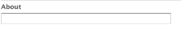
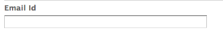

# 랜딩 페이지{#landing-pages}

랜딩 페이지 기능을 사용하면 디자인과 콘텐츠를 AEM 페이지로 빠르고 쉽게 가져올 수 있습니다. 웹 개발자는 HTML 및 전체 페이지로 가져오거나 페이지의 일부로만 가져올 수 있는 추가 에셋을 준비할 수 있습니다. 이 기능은 제한된 시간 동안만 활성화되고 빠르게 생성해야 하는 마케팅 랜딩 페이지를 만드는 데 유용합니다.

이 페이지에서는 다음 사항에 대해 설명합니다.

* 사용 가능한 구성 요소를 포함한 AEM의 랜딩 페이지 모양
* 랜딩 페이지를 만드는 방법 및 디자인 패키지를 가져오는 방법
* AEM에서 랜딩 페이지를 사용하여 작업하는 방법
* 모바일 랜딩 페이지를 설정하는 방법

가져오기를 위한 디자인 패키지 준비는에서 다룹니다 [디자인 Importer 확장 및 구성](/help/sites-administering/extending-the-design-importer-for-landingpages.md). Adobe Analytics과 통합은에서 다룹니다 [Adobe Analytics과 랜딩 페이지 통합.](/help/sites-administering/integrating-landing-pages-with-adobe-analytics.md)

>[!CAUTION]
>
>랜딩 페이지를 가져오는 데 사용되는 디자인 가져오기 [AEM 6.5에서 더 이상 사용되지 않음](/help/release-notes/deprecated-removed-features.md#deprecated-features).

>[!CAUTION]
>
>Design Importer는에 액세스해야 하므로 `/apps`, 다음과 같은 컨테이너화된 클라우드 환경에서는 작동하지 않습니다. `/apps` 변경할 수 없습니다.

## 랜딩 페이지란 무엇입니까? {#what-are-landing-pages}

랜딩 페이지는 이메일, 광고/배너, 소셜 미디어와 같은 마케팅 활동의 &quot;엔드포인트&quot;인 단일 또는 다중 페이지 사이트입니다. 랜딩 페이지는 다양한 용도로 사용될 수 있지만 모두 한 가지 공통점이 있습니다. 방문자가 작업을 완수해야 하고 랜딩 페이지의 성공을 정의해야 합니다.

AEM의 랜딩 페이지 기능을 사용하면 마케터가 에이전시 또는 내부 크리에이티브 팀의 웹 디자이너와 함께 AEM으로 쉽게 가져올 수 있고 마케터가 편집할 수 있으며 AEM 기반 사이트의 나머지 부분과 동일한 거버넌스 하에 게시할 수 있는 페이지 디자인을 만들 수 있습니다.

AEM에서 다음 단계를 수행하여 랜딩 페이지를 만듭니다.

1. 랜딩 페이지 캔버스가 포함된 AEM의 페이지를 만듭니다. AEM에는 라는 샘플이 포함되어 있습니다. **Importer 페이지**.

1. [HTML 및 자산을 준비합니다.](/help/sites-administering/extending-the-design-importer-for-landingpages.md)
1. 리소스를 여기에서 디자인 패키지라고 하는 ZIP 파일로 패키징합니다.
1. 가져오기 페이지에서 디자인 패키지를 가져옵니다.
1. 페이지를 수정하고 게시합니다.

### 데스크탑 랜딩 페이지 {#desktop-landing-pages}

AEM의 샘플 랜딩 페이지는 다음과 같습니다.

### 모바일 랜딩 페이지 {#mobile-landing-pages}

랜딩 페이지에는 페이지의 모바일 버전이 있을 수도 있습니다. 랜딩 페이지의 별도의 모바일 버전을 사용하려면 가져오기 디자인에 두 개의 html 파일이 있어야 합니다. *index.htm(l)* 및 *mobile.index.htm(l)*.

랜딩 페이지 가져오기 프로시저는 일반 랜딩 페이지와 동일하며 랜딩 페이지 디자인에는 모바일 랜딩 페이지에 해당하는 추가 html 파일이 있습니다. 이 html 파일에도 캔버스가 있어야 합니다. `div` 포함 `id=cqcanvas` 데스크탑 랜딩 페이지 html과 마찬가지로 데스크탑 랜딩 페이지에 설명된 편집 가능한 모든 구성 요소를 지원합니다.

모바일 랜딩 페이지는 데스크탑 랜딩 페이지의 하위 페이지로 만들어집니다. 열려면 웹 사이트의 랜딩 페이지로 이동하여 하위 페이지를 엽니다.

>[!NOTE]
>
>모바일 랜딩 페이지는 데스크탑 랜딩 페이지가 삭제되거나 비활성화될 경우 데스크탑 랜딩 페이지와 함께 삭제/비활성화됩니다.

## 랜딩 페이지 구성 요소 {#landing-page-components}

가져온 HTML의 일부를 AEM 내에서 편집할 수 있도록 하기 위해 랜딩 페이지 HTML 내의 콘텐츠를 AEM 구성 요소에 직접 매핑할 수 있습니다. 디자인 가져오기는 기본적으로 다음 구성 요소를 이해합니다.

* 텍스트(모든 텍스트)
* 제목, H1-6 태그의 콘텐츠
* 이미지(교환이 가능하도록 만들어야 하는 이미지의 경우)
* 콜 투 액션:

   * 클릭스루 링크
   * 그래픽 링크

* CTA 리드 양식, 사용자 정보 캡처
* 단락 시스템(Parsys), 구성 요소 추가 허용 또는 위의 구성 요소 변환

또한 이를 확장하고 사용자 지정 구성 요소를 지원할 수 있습니다. 이 섹션에서는 구성 요소에 대해 자세히 설명합니다.

### 텍스트 {#text}

텍스트 구성 요소를 사용하면 WYSIWYG 편집기를 사용하여 텍스트 블록을 입력할 수 있습니다. 다음을 참조하십시오 [텍스트 구성 요소](/help/sites-authoring/default-components.md#text) 추가 정보.

다음은 랜딩 페이지의 텍스트 구성 요소에 대한 예입니다.

#### 제목 {#title}

제목 구성 요소를 사용하여 제목을 표시하고 크기(h1-6)를 구성할 수 있습니다. 다음을 참조하십시오 [제목 구성 요소](/help/sites-authoring/default-components.md#title) 추가 정보.

다음은 랜딩 페이지의 제목 구성 요소의 예입니다.

#### 이미지 {#image}

이미지 구성 요소에는 콘텐츠 파인더에서 드래그하여 놓거나 클릭하여 업로드할 수 있는 이미지가 표시됩니다. 다음을 참조하십시오 [이미지 구성 요소](/help/sites-authoring/default-components.md) 추가 정보.

다음은 랜딩 페이지의 이미지 구성 요소 예입니다.

#### 클릭 유도 문안(CTA) {#call-to-action-cta}

랜딩 페이지 디자인에는 여러 링크가 있을 수 있습니다. 이러한 링크 중 일부는 &quot;콜 투 액션&quot;으로 의도될 수 있습니다.

CTA(콜 투 액션)는 방문자가 랜딩 페이지에서 &quot;지금 구독&quot;, &quot;이 비디오 보기&quot;, &quot;제한된 시간만&quot; 등과 같은 작업을 즉시 수행하도록 하는 데 사용됩니다.

* 클릭스루 링크 - 클릭할 때 방문자를 대상 URL로 안내하는 텍스트 링크를 추가할 수 있습니다.
* 그래픽 링크 - 클릭하면 방문자를 대상 URL로 안내하는 이미지를 추가할 수 있습니다.

두 CTA 구성 요소에는 유사한 옵션이 있습니다. 클릭스루 링크에는 리치 텍스트 옵션이 추가로 제공됩니다. 구성 요소는 다음 단락에 자세히 설명되어 있습니다.

#### 클릭스루 링크 {#click-through-link}

이 CTA 구성 요소를 사용하여 랜딩 페이지에 텍스트 링크를 추가할 수 있습니다. 해당 링크를 클릭하여 구성 요소 속성에 지정된 대상 URL로 사용자를 안내할 수 있습니다. &quot;콜 투 액션&quot; 그룹의 일부입니다.

**레이블** 사용자에게 표시되는 텍스트입니다. 서식 있는 텍스트 편집기로 서식을 수정할 수 있습니다.

**TARGET URL** 사용자가 텍스트를 클릭할 경우 방문할 URI를 입력합니다.

**렌더링 옵션** 렌더링 옵션에 대해 설명합니다. 다음 중에서 선택할 수 있습니다.

* 새 브라우저 창에 페이지 로드
* 페이지를 현재 창에서 로드합니다.
* 상위 프레임에 페이지 로드
* 모든 프레임을 취소하고 전체 브라우저 창에서 페이지 로드

**CSS** 스타일 탭에서 CSS 스타일 시트의 경로를 입력합니다.

**ID** 스타일 탭에서 구성 요소를 고유하게 식별할 수 있는 ID를 입력합니다.

다음은 클릭스루 링크의 예입니다.

#### 그래픽 링크 {#graphical-link}

이 CTA 구성 요소를 사용하여 랜딩 페이지에 링크가 있는 모든 그래픽 이미지를 추가할 수 있습니다. 이미지는 간단한 버튼일 수 있거나 배경으로서의 모든 그래픽 이미지일 수 있습니다. 이미지를 클릭하면 구성 요소 속성에 지정된 대상 URL로 이동합니다. 의 일부입니다. **클릭 유도 문안** 그룹입니다.

**레이블** 그래픽에 표시되는 텍스트. 서식 있는 텍스트 편집기로 서식을 수정할 수 있습니다.

**TARGET URL** 사용자가 이미지를 클릭할 경우 방문할 URI를 입력합니다.

**렌더링 옵션** 렌더링 옵션에 대해 설명합니다. 다음 중에서 선택할 수 있습니다.

* 새 브라우저 창에 페이지 로드
* 페이지를 현재 창에서 로드합니다.
* 상위 프레임에 페이지 로드
* 모든 프레임을 취소하고 전체 브라우저 창에서 페이지 로드

**CSS** 스타일 탭에서 CSS 스타일 시트의 경로를 입력합니다.

**ID** 스타일 탭에서 구성 요소를 고유하게 식별할 수 있는 ID를 입력합니다.

다음은 예제 그래픽 링크입니다.

### 클릭 유도 문안(CTA) 리드 양식 {#call-to-action-cta-lead-form}

잠재 고객 양식은 방문자/잠재 고객의 프로필 정보를 수집하는 데 사용되는 양식입니다. 이 정보는 나중에 저장해 두었다가 그 정보를 바탕으로 효과적인 마케팅을 하는 데 사용할 수 있다. 이 정보에는 일반적으로 제목, 이름, 이메일, 생년월일, 주소, 관심 등이 포함됩니다. 의 일부입니다. **CTA 리드 양식** 그룹입니다.

CTA 리드 양식의 예는 다음과 같습니다.

CTA 리드 양식은 다음과 같은 여러 구성 요소로 구성됩니다.

* **리드 양식**
리드 양식 구성 요소는 페이지에서 새 리드 양식의 시작과 끝을 정의합니다. 그런 다음 이메일 ID, 이름 등과 같은 다른 구성 요소를 이러한 요소 사이에 배치할 수 있습니다.

* **양식 필드 및 요소**
양식 필드 및 요소에는 텍스트 상자, 라디오 단추, 이미지 등이 포함될 수 있습니다. 사용자는 종종 텍스트 입력처럼 양식 필드에서 작업을 완료합니다. 자세한 내용은 개별 양식 요소 를 참조하십시오.

* **프로필 구성 요소**
프로필 구성 요소는 소셜 공동 작업에 사용되는 방문자 프로필 및 방문자 개인화가 필요한 기타 영역과 관련됩니다.

앞의 양식은 다음과 같은 예제입니다 **리드 양식** 구성 요소(시작 및 끝), 포함 **이름** 및 **이메일 ID** 입력용으로 사용되는 필드 및 **제출** 필드

사이드 킥에서 CTA 리드 양식에 사용할 수 있는 구성 요소는 다음과 같습니다.

#### 많은 리드 양식 구성 요소에 공통되는 설정 {#settings-common-to-many-lead-form-components}

각각의 리드 양식 구성 요소는 목적이 다르지만 많은 구성 요소가 유사한 옵션과 매개 변수로 구성되어 있습니다.

양식 구성 요소를 구성할 때 대화 상자에서 다음 탭을 사용할 수 있습니다.

* **제목 및 텍스트**
여기에서 구성 요소 제목 및 관련 텍스트와 같은 기본 정보를 지정해야 합니다. 또한 해당하는 경우 필드를 다중 선택 가능한지 여부와 선택 가능한 항목 등 다른 키 정보를 정의할 수 있습니다.

* **초기값**
기본값을 지정할 수 있습니다.

* **제한**
여기에서 필드가 필요한지 여부를 지정하고 해당 필드에 제약 조건을 배치할 수 있습니다(예: 는 숫자여야 함).

* **스타일링**
필드의 크기 및 스타일을 나타냅니다.

>[!NOTE]
>
>표시되는 필드는 개별 구성 요소에 따라 다릅니다.
>
>모든 리드 양식 구성 요소에 모든 옵션을 사용할 수 있는 것은 아닙니다. 자세한 내용은 Forms 를 참조하십시오 [공통 설정](/help/sites-authoring/default-components.md#formsgroup).

#### 리드 양식 구성 요소 {#lead-form-components}

다음 섹션에서는 콜 투 액션 리드 양식에 사용할 수 있는 구성 요소에 대해 설명합니다.

**정보** 사용자가 정보 정보를 추가할 수 있습니다.

**주소 필드** 사용자가 주소 정보를 입력할 수 있습니다. 이 구성 요소를 구성할 때는 대화 상자에 요소 이름을 입력해야 합니다. Element Name은 양식 요소의 이름입니다. 저장소 내 데이터가 저장되는 위치를 나타냅니다.

**생일** 생년월일 정보를 입력할 수 있습니다.

**이메일 ID** 사용자가 이메일 주소(ID)를 입력할 수 있습니다.

**이름** 사용자가 이름을 입력할 수 있는 필드를 제공합니다.

**성별** 드롭다운 목록에서 성별을 선택할 수 있습니다.

**성** 성 정보를 입력할 수 있습니다.

**리드 양식** 이 구성 요소를 추가하여 리드 양식을 랜딩 페이지에 추가합니다. 리드 양식에는 리드 양식 시작 및 리드 양식 끝 필드가 자동으로 포함됩니다. 그 사이에 이 섹션에 설명된 리드 양식 구성 요소를 추가합니다.

리드 양식 구성 요소는 다음을 사용하여 양식의 시작 및 끝을 정의합니다. **양식 시작** 및 **양식 끝** 요소. 양식이 올바르게 정의되도록 항상 쌍으로 표시됩니다.

리드 양식을 추가한 후 을 클릭하여 양식의 시작 또는 양식 끝을 구성할 수 있습니다. **편집** 을 클릭합니다.

**리드 양식 시작**

구성에는 두 개의 탭을 사용할 수 있습니다 **양식** 및 **고급**:

**감사 인사 페이지** 방문자가 입력을 제공한 것에 대해 감사하는 의미로 참조되는 페이지입니다. 비워 두면 제출 후 양식이 다시 표시됩니다.

**워크플로우 시작** 리드 양식이 제출되면 트리거되는 워크플로우를 결정합니다.

**게시물 옵션** 다음 게시 옵션을 사용할 수 있습니다.

* 리드 만들기
* 이메일 서비스: 구독자를 만들고 목록에 추가 - ExactTarget과 같은 이메일 서비스 공급자를 사용하는 경우 사용합니다.
* 이메일 서비스: 자동 응답자 이메일을 보냅니다. ExactTarget과 같은 이메일 서비스 공급자를 사용하는 경우 사용합니다.
* 이메일 서비스: 목록에서 사용자 구독 취소 - ExactTarget과 같은 이메일 서비스 공급자를 사용하는 경우 사용합니다.
* 사용자 구독 취소

**양식 식별자** 양식 식별자는 잠재 고객 양식을 고유하게 식별합니다. 단일 페이지에 여러 개의 양식이 있는 경우 양식 식별자를 사용하십시오. 양식마다 각기 다른 식별자가 있어야 합니다.

**로드 경로** 사전 정의된 값을 리드 양식 필드에 로드하는 데 사용되는 노드 속성의 경로입니다.

저장소의 노드에 대한 경로를 지정하는 선택적 필드입니다. 이 노드에 필드 이름과 일치하는 속성이 있으면 양식의 해당 필드에 해당 속성 값이 미리 로드됩니다. 일치하는 항목이 없으면 필드에 기본값이 포함됩니다.

**클라이언트 유효성 검사** 이 양식에 클라이언트 유효성 검사가 필요한지 여부를 나타냅니다(서버 유효성 검사는 항상 발생). Forms Captcha 구성 요소와 함께 이 작업을 수행할 수 있습니다.

**유효성 검사 리소스 유형** 개별 필드가 아닌 전체 리드 양식의 유효성을 검사하려는 경우 양식 유효성 검사 리소스 유형을 정의합니다.

전체 양식의 유효성을 검사하는 경우 다음 중 하나를 포함해야 합니다.

* 클라이언트 유효성 검사용 스크립트:
  ` /apps/<myApp>/form/<myValidation>/formclientvalidation.jsp`

* 서버 쪽의 유효성 검사용 스크립트:
  ` /apps/<myApp>/form/<myValidation>/formservervalidation.jsp`

**작업 구성** [게시 옵션]에서 선택한 항목에 따라 [작업 구성]이 변경됩니다. 예를 들어 Create Lead 를 선택하면 Lead 가 추가되는 목록을 구성할 수 있습니다.

* **전송 단추 표시**
제출 단추를 표시할지 여부를 나타냅니다.

* **이름 제출**
양식에서 여러 제출 단추를 사용하는 경우의 식별자입니다.

* **전송 제목**
제출 또는 전송과 같이 단추에 표시되는 이름입니다.

* **재설정 단추 표시**
재설정 단추를 표시하려면 확인란을 선택합니다.

* **제목 재설정**
재설정 단추에 나타나는 이름입니다.

* **설명**
단추 아래에 표시되는 정보입니다.

## 랜딩 페이지 만들기 {#creating-a-landing-page}

랜딩 페이지를 만들 때 다음 세 단계를 수행해야 합니다.

1. Importer 페이지를 만듭니다.
1. [가져올 HTML을 준비합니다.](/help/sites-administering/extending-the-design-importer-for-landingpages.md)
1. 디자인 패키지를 가져옵니다.

### 디자인 Importer 사용 {#use-of-the-design-importer}

페이지 가져오기에는 HTML 준비, 확인 및 페이지 테스트가 포함되므로 랜딩 페이지 가져오기는 관리 작업으로 간주됩니다. 관리자는 가져오기를 수행하는 사용자가에 대한 읽기, 쓰기, 만들기 및 삭제 권한이 필요합니다. `/apps`. 사용자에게 이러한 권한이 없으면 가져오기에 실패합니다.

>[!NOTE]
>
>왜냐하면 디자인 임포터는 다음에 대한 읽기, 쓰기, 만들기 및 삭제 권한이 필요한 관리 도구이기 때문입니다 `/apps`, Adobe은 프로덕션 환경에서 디자인 임포터를 사용하지 않는 것이 좋습니다.

Adobe은 스테이징 인스턴스에서 디자인 임포터를 사용하는 것을 권장합니다. 스테이징 인스턴스에서 개발자가 코드를 프로덕션 인스턴스에 배포하여 가져오기를 테스트하고 유효성을 검사할 수 있습니다.

### Importer 페이지 만들기 {#creating-an-importer-page}

랜딩 페이지 디자인을 가져오려면 먼저 캠페인 아래에 Importer 페이지를 만들어야 합니다. 페이지 가져오기 템플릿을 사용하여 전체 HTML 랜딩 페이지를 가져올 수 있습니다. 페이지에는 끌어다 놓기를 사용하여 랜딩 페이지 디자인 패키지를 가져올 수 있는 드롭 상자가 포함되어 있습니다.

>[!NOTE]
>
>기본적으로 가져오기 페이지는 캠페인에서만 만들 수 있지만, 아래에 랜딩 페이지를 만들기 위해 이 템플릿을 오버레이할 수도 있습니다. `/content/mysite`.

새 랜딩 페이지를 만들려면 다음 작업을 수행하십시오.

1. 로 이동 **웹 사이트** 콘솔.
1. 왼쪽 창에서 캠페인을 선택합니다.
1. 클릭 **신규** 을(를) 열려면 **페이지 만들기** 창.
1. 다음 항목 선택 **Importer 페이지** 을(를) 템플릿으로 만들고 제목, 이름(선택 사항) 및 **만들기**.

   

   새 Importer 페이지가 표시됩니다.

### 가져오기 HTML 준비 {#preparing-the-html-for-import}

디자인 패키지를 가져오기 전에 HTML을 준비해야 합니다. 다음을 참조하십시오 [디자인 가져오기 확장 및 구성](/help/sites-administering/extending-the-design-importer-for-landingpages.md) 추가 정보.

### 디자인 패키지 가져오기 {#importing-the-design-package}

Importer 페이지가 만들어지면 디자인 패키지를 가져올 수 있습니다. 디자인 패키지 및 권장 구조 만들기에 대한 자세한 내용은에 설명되어 있습니다 [디자인 가져오기 확장 및 구성](/help/sites-administering/extending-the-design-importer-for-landingpages.md).

디자인 패키지가 준비되었다고 가정할 경우 다음 단계에서는 디자인 패키지를 Importer 페이지로 가져오는 방법을 설명합니다.

1. Importer 페이지를 엽니다 [이전에 생성됨](#creatingablankcanvaspage).

   

1. 디자인 패키지를 드롭박스로 끌어서 놓습니다. 패키지를 드래그하면 화살표의 방향이 변경됩니다.
1. 끌어다 놓기 결과 가져오기 페이지 대신 랜딩 페이지가 표시됩니다. HTML 랜딩 페이지를 정상적으로 가져왔습니다.

   

>[!NOTE]
>
>가져오기 시 보안상의 이유로 잘못된 마크업을 가져와서 게시하지 않도록 마크업이 정리됩니다. 이는 HTML 전용 마크업과 인라인 SVG 또는 웹 구성 요소와 같은 다른 모든 형식의 요소가 필터링된다고 가정합니다.

>[!NOTE]
>
>디자인 패키지를 가져오는 데 문제가 있는 경우 [문제 해결](/help/sites-administering/extending-the-design-importer-for-landingpages.md#troubleshooting).

## 랜딩 페이지 작업 {#working-with-landing-pages}

랜딩 페이지의 디자인 및 에셋은 일반적으로 디자이너가 Adobe Photoshop 또는 Adobe Dreamweaver과 같은 익숙한 도구의 에이전시에 만들 수 있습니다. 디자인이 완료되면 디자이너는 모든 에셋이 포함된 zip 파일을 마케팅으로 보냅니다. 그런 다음 마케팅 담당자는 zip 파일을 AEM에 삭제하고 콘텐츠를 게시합니다.

또한 콘텐츠를 편집하거나 삭제하고 콜 투 액션 구성 요소를 구성하여 랜딩 페이지를 가져온 후 디자이너가 이를 수정해야 할 수 있습니다. 마지막으로, 마케터는 랜딩 페이지를 미리 본 다음 캠페인을 활성화하여 랜딩 페이지가 게시되도록 할 수 있습니다.

이 섹션에서는 다음 작업을 수행하는 방법에 대해 설명합니다.

* 랜딩 페이지 삭제
* 디자인 패키지 다운로드
* 가져오기 정보 보기
* 랜딩 페이지 재설정
* [CTA 구성 요소 구성 및 페이지에 콘텐츠 추가](#call-to-action-cta)
* 랜딩 페이지 미리보기
* 랜딩 페이지 활성화/게시

디자인 패키지를 가져올 때 **디자인 지우기** 및 **가져온 Zip 다운로드** 은 페이지의 설정 메뉴에서 사용할 수 있습니다.

### 가져온 디자인 패키지 다운로드 {#downloading-the-imported-design-package}

zip 파일을 다운로드하면 특정 랜딩 페이지와 함께 가져온 zip을 기록할 수 있습니다. 페이지에서 변경한 사항은 zip에 추가되지 않습니다.

가져온 디자인 패키지를 다운로드하려면 **Zip 다운로드** 을 클릭하여 제품에서 사용할 수 있습니다.

### 가져오기 정보 보기 {#viewing-import-information}

언제든지 클래식 사용자 인터페이스의 랜딩 페이지 상단에 있는 파란색 느낌표 를 클릭하여 마지막 가져오기에 대한 정보를 볼 수 있습니다.

가져온 디자인 패키지에 문제가 있는 경우, 예를 들어 패키지 내에 존재하지 않는 이미지/스크립트를 참조하는 경우 디자인 임포터는 이러한 문제를 목록 형태로 표시합니다. 문제 목록을 보려면 클래식 사용자 인터페이스에서 랜딩 페이지 도구 모음의 문제 링크를 클릭합니다. 다음 이미지에서 **문제** 링크는 가져오기 문제 창을 엽니다.

### 랜딩 페이지 재설정 {#resetting-a-landing-page}

랜딩 페이지 디자인 패키지를 변경한 후 다시 가져오려는 경우 를 클릭하여 랜딩 페이지를 &quot;지우기&quot;할 수 있습니다. **지우기** 클래식 사용자 인터페이스의 랜딩 페이지 맨 위에서 를 클릭하거나, 터치에 적합한 사용자 인터페이스의 설정 메뉴에서 지우기 를 클릭합니다. 이렇게 하면 가져온 랜딩 페이지가 삭제되고 빈 Importer 페이지가 만들어집니다.

랜딩 페이지를 지우는 동안 콘텐츠 변경 사항을 제거할 수 있습니다. 다음을 클릭: **아니요**&#x200B;그런 다음 콘텐츠 변경 사항이 보존됩니다. 즉, 아래의 구조가 보존됩니다. `jcr:content/importer`는 유지되며 의 importer 페이지 구성 요소와 리소스만 유지됩니다. `etc/design` 제거됩니다. 반면, **예**, `jcr:content/importer` 도 제거됩니다.

>[!NOTE]
>
>콘텐츠 변경 사항을 제거하기로 결정한 경우 를 클릭하면 가져온 랜딩 페이지와 모든 페이지 속성에서 변경한 사항이 모두 손실됩니다 **지우기**.

### 랜딩 페이지에서 구성 요소 수정 및 추가 {#modifying-and-adding-components-on-a-landing-page}

랜딩 페이지의 구성 요소를 수정하려면 해당 구성 요소를 두 번 클릭하여 열고 다른 구성 요소와 마찬가지로 편집합니다.

랜딩 페이지에서 구성 요소를 추가하려면 클래식 사용자 인터페이스의 사이드 킥 또는 터치에 적합한 사용자 인터페이스의 구성 요소 창에서 구성 요소를 랜딩 페이지로 드래그하여 놓고 적절하게 편집합니다.

>[!NOTE]
>
>랜딩 페이지의 구성 요소를 편집할 수 없는 경우 다음 위치에서 zip 파일을 다시 가져와야 합니다 [HTML 파일을 수정하는 중입니다.](/help/sites-administering/extending-the-design-importer-for-landingpages.md) 즉, 가져오는 동안 편집할 수 없는 부품은 AEM 구성 요소로 변환되지 않았습니다.

### 랜딩 페이지 삭제 {#deleting-a-landing-page}

랜딩 페이지를 삭제하는 것은 일반 AEM 페이지를 삭제하는 것과 같습니다.

유일한 예외는 데스크탑 랜딩 페이지를 삭제할 때 해당 모바일 랜딩 페이지(있는 경우)도 삭제하지만 그 반대의 경우는 삭제하지 않는다는 것입니다.

### 랜딩 페이지 게시 {#publishing-a-landing-page}

일반 페이지를 게시하는 것처럼 랜딩 페이지와 모든 종속성을 게시할 수 있습니다.

>[!NOTE]
>
>데스크탑 랜딩 페이지를 게시하면 해당 모바일 버전(있는 경우)도 게시됩니다. 그러나 모바일 랜딩 페이지를 게시하면 데스크탑 버전이 게시되지 않습니다.
