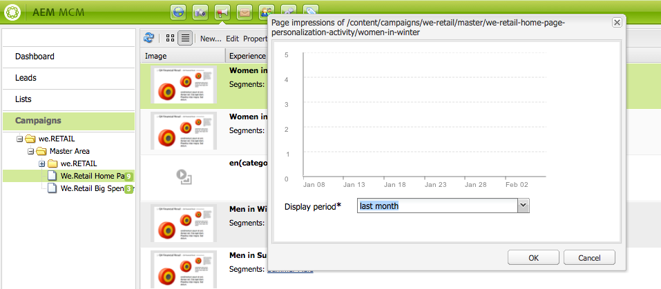

# 마케팅 캠페인 관리자 작업{#working-with-the-marketing-campaign-manager}

AEM에서 마케팅 캠페인 관리자(MCM)는 멀티채널 캠페인을 관리하는 데 도움이 되는 콘솔입니다. 이 마케팅 자동화 소프트웨어를 사용하면 모든 브랜드, 캠페인 및 경험을 관련 세그먼트, 목록, 리드 및 보고서와 함께 관리할 수 있습니다.

MCM은 AEM의 다양한 위치에서 액세스할 수 있습니다(예: 시작 화면, 캠페인 아이콘 또는 URL을 사용하여).

`https://<hostname>:<port>/libs/mcm/content/admin.html`

예:

`https://localhost:4502/libs/mcm/content/admin.html`

MCM에서 다음 항목에 액세스할 수 있습니다.

* **[대시보드](#dashboard)**
이는 네 개의 창으로 나뉩니다.

   * [목록](#lists)
이 창에는 이미 만든 목록과 해당 목록의 잠재 고객 수가 표시됩니다. 이 창에서 직접 목록을 만들거나 리드 가져오기로 목록을 만들 수 있습니다.
특정 목록을 선택하면 목록의 세부 정보를 보여주는 [목록](#lists) 섹션으로 이동합니다.

   * [세그먼트](/help/sites-classic-ui-authoring/classic-personalization-campaigns.md#anoverviewofsegmentation)
이 창에는 정의한 세그먼트가 표시됩니다. 세그먼트를 사용하여 특정 트레이트를 공유하는 방문자 컬렉션을 특성화할 수 있습니다.
특정 세그먼트를 선택하면 세그먼트 정의 페이지가 열립니다.

   * [보고서](/help/sites-administering/reporting.md)
AEM에서는 인스턴스의 상태를 분석하고 모니터링하는 데 도움이 되는 다양한 보고서를 제공합니다. 이 MCM 창에는 보고서가 나열됩니다.
보고서를 선택하면 보고서 페이지가 열립니다.

   * [캠페인](#campaigns)
이 창에는 [뉴스레터](/help/sites-classic-ui-authoring/classic-personalization-campaigns.md#newsletters) 및 [티저](/help/sites-classic-ui-authoring/classic-personalization-campaigns.md#teasers)와 같은 캠페인 경험이 나열됩니다.

* **[리드](#leads)**
여기에서 리드를 관리할 수 있습니다. 리드를 생성 또는 가져오고, 개별 리드에 대한 특정 세부 정보를 편집하거나, 더 이상 필요하지 않은 경우 삭제할 수 있습니다. Lists라는 다른 그룹에 잠재 고객을 배치할 수도 있습니다. **참고:** Adobe은 이 기능을 더 향상시킬 계획이 없습니다.
권장 사항은 [Adobe Campaign 및 AEM에 통합](/help/sites-administering/campaign.md)을 사용하는 것입니다.

* **[목록](#lists)**
여기에서 잠재 고객 목록을 관리할 수 있습니다.**참고:** Adobe은 이 기능을 더 향상시킬 계획이 없습니다.
권장 사항은 [Adobe Campaign 및 AEM에 통합](/help/sites-administering/campaign.md)을 사용하는 것입니다.

* **[캠페인](#campaigns)**
여기에서 브랜드, 캠페인 및 경험을 관리할 수 있습니다.

## 대시보드 {#dashboard}

대시보드에는 목록(리드), 세그먼트, 보고서 및 캠페인의 개요를 제공하는 네 개의 창이 표시됩니다. 이러한 기능에 대한 기본 기능은 여기에서 액세스할 수 있습니다.

### 리드 {#leads}

>[!NOTE]
>
>Adobe은 이 기능을 더 강화하지 않을 계획입니다 (리드 관리).
>권장 사항은 [Adobe Campaign 및 AEM에 통합](/help/sites-administering/campaign.md)을 사용하는 것입니다.

AEM MCM에서 리드를 수동으로 입력하거나 메일링 목록과 같이 쉼표로 구분된 목록을 가져와서 리드를 구성하고 추가할 수 있습니다. 리드를 생성하는 추가 방법은 뉴스레터 등록 또는 커뮤니티 등록에서 입니다(구성된 경우, 리드를 채우는 워크플로우를 트리거할 수 있음). 리드는 일반적으로 분류되어 목록에 추가되므로 나중에 전체 목록에서 작업을 수행할 수 있습니다(예: 사용자 정의 이메일을 특정 목록으로 전송).

왼쪽 창의 **리드**&#x200B;에서 리드를 만들고, 가져오고, 편집하고, 삭제한 다음 필요에 따라 활성화하거나 비활성화할 수 있습니다. 목록에 잠재 고객을 추가하거나 이미 속한 목록을 확인할 수 있습니다.

>[!NOTE]
>
>특정 작업에 대한 자세한 내용은 [리드 작업](/help/sites-classic-ui-authoring/classic-personalization-campaigns.md#workingwithleads)을 참조하십시오.

### 목록 {#lists}

>[!NOTE]
>
>Adobe은 이 기능(목록 관리)을 더 강화하지 않을 계획입니다.
>권장 사항은 [Adobe Campaign 및 AEM에 통합](/help/sites-administering/campaign.md)을 사용하는 것입니다.

목록을 사용하면 잠재 고객을 그룹으로 구성할 수 있습니다. 목록을 사용하면 마케팅 캠페인을 선택한 사용자 그룹에 타깃팅할 수 있습니다. 예를 들어 타깃팅된 뉴스레터를 목록에 보낼 수 있습니다.

**목록**&#x200B;에서 목록을 만들고, 가져오고, 편집하고, 병합하고, 삭제하면 목록을 관리할 수 있으며 필요에 따라 활성화하거나 비활성화할 수 있습니다. 해당 목록 내에서 가망 고객을 조회하고 목록이 다른 목록의 구성원인지 확인하거나 설명을 조회할 수도 있습니다.

>[!NOTE]
>
>특정 작업에 대한 자세한 내용은 [목록 작업](/help/sites-classic-ui-authoring/classic-personalization-campaigns.md#workingwithlists)을 참조하십시오.

### 캠페인 {#campaigns}

>[!NOTE]
>
>특정 작업에 대한 자세한 내용은 [티저 및 전략](/help/sites-classic-ui-authoring/classic-personalization-campaigns.md#workingwithlists), [캠페인 설정](/help/sites-classic-ui-authoring/classic-personalization-campaigns.md#settingupyourcampaign) 및 [뉴스레터](/help/sites-classic-ui-authoring/classic-personalization-campaigns.md#newsletters)를 참조하십시오.

기존 캠페인에 액세스하려면 MCM에서 **캠페인**&#x200B;을 클릭합니다.

* **왼쪽 창에서**:
모든 브랜드 및 캠페인 목록이 있습니다.
브랜드를 클릭하면 목록이 확장되어 왼쪽 창에 모든 관련 캠페인이 표시됩니다. 이 목록에는 각 캠페인에 대한 경험 수도 표시됩니다. 오른쪽 창에 브랜드 개요도 열립니다.

* **오른쪽 창에서**:
각 브랜드에 대한 아이콘이 표시됩니다(이전 캠페인은 표시되지 않음).
이러한 아이콘을 두 번 클릭하여 브랜드 개요를 열 수 있습니다.

#### 브랜드 개요 {#brand-overview}

여기에서 다음 작업을 수행할 수 있습니다.

* 이 브랜드에 대해 존재하는 캠페인 및 경험의 수(왼쪽 창에 표시되는 번호)를 참조하십시오.
* 이 브랜드에 대한 **새..** 캠페인을 만듭니다.

* 보고 있는 시간 범위를 변경합니다. **주**, **월** 또는 **분기**&#x200B;를 선택하고 화살표를 사용하여 특정 기간을 선택하거나 **오늘**(으)로 돌아갑니다.

* 오른쪽 창에서 다음 작업을 수행할 캠페인을 선택합니다.

   * **속성 편집...**
   * 캠페인을 **삭제**&#x200B;합니다.

* 캠페인 개요를 엽니다(오른쪽 창에서 캠페인을 두 번 클릭하거나 왼쪽 창에서 한 번 클릭).

#### Campaign 개요 {#campaign-overview}

개별 캠페인의 경우 다음 두 가지 보기를 사용할 수 있습니다.

1. **캘린더 보기**

   아이콘 사용:

   

   여기에는 해당 터치포인트에 연결된 경험의 가로 시간대(녹색)가 있는 모든 터치포인트 목록(회색)이 표시됩니다.

   

   여기에서 다음 작업을 수행할 수 있습니다.

   * 화살표를 사용하여 보고 있는 시간 범위를 변경하거나 **오늘**(으)로 돌아갑니다.

   * **터치포인트 추가...**&#x200B;을(를) 사용하여 기존 경험에 대한 새 터치포인트를 추가합니다.

   * 티저(오른쪽 창)를 클릭하여 **설정 시간** 및 **해제 시간**&#x200B;을 설정합니다.

1. **목록 보기**

   아이콘 사용:

   

   선택한 캠페인에 대한 모든 경험(예: 티저 및 뉴스레터)이 나열됩니다.

   

   여기에서 다음 작업을 수행할 수 있습니다.

   * **새로운...** 경험 만들기(예: Adobe Target 오퍼, 티저 및 뉴스레터).
   * **특정 티저 페이지 또는 뉴스레터의 세부 정보를 편집**&#x200B;합니다(두 번 클릭해도 됨).
   * 특정 티저 페이지 또는 뉴스레터의 **속성...**&#x200B;을(를) 정의합니다.
   * **경험의 모양과 느낌(티저 페이지 또는 뉴스레터)을 시뮬레이션**&#x200B;합니다.
시뮬레이션된 페이지가 열리면 사이드 킥을 열어 해당 페이지의 편집 모드로 전환할 수 있습니다.

   * 페이지에 대해 생성된 노출 횟수를 **분석...**&#x200B;합니다.

   * 항목이 더 이상 필요하지 않으면 **삭제**&#x200B;합니다.
   * 텍스트를 **검색**&#x200B;합니다(경험의 제목 필드가 검색됨).
   * **고급** 검색을 사용하여 검색에 필터를 적용합니다.

### 캠페인 경험 시뮬레이션 {#simulating-your-campaign-experiences}

MCM에서 **캠페인**&#x200B;을 클릭합니다. 목록 보기가 활성 상태인지 확인한 다음 필요한 캠페인 환경을 선택하고 **시뮬레이션**&#x200B;을 클릭합니다. 터치포인트(티저 또는 뉴스레터 페이지)가 열리고, 선택한 경험이 방문자에게 표시됩니다.

여기에서 사이드 킥을 열고(작은 아래쪽 화살표 클릭) 페이지를 업데이트하기 위한 편집 모드로 변경할 수도 있습니다.

### Campaign 경험 분석 {#analyzing-your-campaign-experiences}

MCM에서 **캠페인**&#x200B;을 클릭합니다. 목록 보기가 활성 상태인지 확인한 다음 필요한 캠페인 환경을 선택하고 **분석..**&#x200B;을 선택합니다. 시간 경과에 따른 페이지 노출 횟수의 차트가 표시됩니다.

