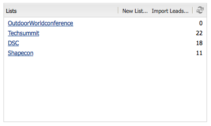

# 캠페인 설정{#setting-up-your-campaign}

새 캠페인 설정에는 다음(일반) 단계가 포함됩니다.

1. 캠페인을 보관할 [브랜드를 만드세요](#creating-a-new-brand).
1. 필요한 경우 [새 브랜드의 속성을 정의](#defining-the-properties-for-your-new-brand)할 수 있습니다.
1. 경험을 보관할 [캠페인을 만들기](#creating-a-new-campaign)(예: 티저 페이지나 뉴스레터)
1. 필요한 경우 [새 캠페인에 대한 속성을 정의](#defining-the-properties-for-your-new-campaign)할 수 있습니다.

그런 다음 만드는 경험 유형에 따라 [경험을 만들기](#creating-a-new-experience)해야 합니다. 경험의 세부 정보 및 경험 작성에 따른 작업은 작성하려는 경험 유형에 따라 달라집니다.

* 티저를 만드는 경우:

   1. [티저 환경 만들기](/help/sites-classic-ui-authoring/classic-personalization-campaigns.md#creatingateaserexperience).
   1. [티저에 콘텐츠 추가](/help/sites-classic-ui-authoring/classic-personalization-campaigns.md#addingcontenttoyourteaser).
   1. [티저에 대한 터치포인트를 만듭니다](/help/sites-classic-ui-authoring/classic-personalization-campaigns.md#creatingatouchpointforyourteaser)(콘텐츠 페이지에 티저 추가).

* 뉴스레터를 만드는 경우:

   1. [뉴스레터 환경 만들기](/help/sites-classic-ui-authoring/classic-personalization-campaigns.md#creatinganewsletterexperience).
   1. [뉴스레터에 콘텐츠를 추가합니다.](/help/sites-classic-ui-authoring/classic-personalization-campaigns.md#addingcontenttonewsletters)
   1. [뉴스레터를 개인화합니다.](/help/sites-classic-ui-authoring/classic-personalization-campaigns.md#personalizingnewsletters)
   1. [매력적인 뉴스레터 랜딩 페이지 만들기](/help/sites-classic-ui-authoring/classic-personalization-campaigns.md#settingupanewsletterlandingpage).
   1. 구독자 또는 잠재 고객에게 [뉴스레터를 전송](/help/sites-classic-ui-authoring/classic-personalization-campaigns.md#sendingnewsletters)합니다.

* Adobe Target(이전 Test&amp;Target) 오퍼를 만드는 경우:

   1. [Adobe Target 오퍼 경험을 만듭니다](/help/sites-classic-ui-authoring/classic-personalization-campaigns.md#creatingatesttargetofferexperience).
   1. [Adobe Target과 통합](/help/sites-classic-ui-authoring/classic-personalization-campaigns.md#integratewithadobetesttarget)

>[!NOTE]
>
>세그먼트 정의에 대한 자세한 지침은 [세그먼테이션](/help/sites-administering/campaign-segmentation.md)을 참조하세요.

## 새 브랜드 만들기 {#creating-a-new-brand}

1. **MCM**&#x200B;을(를) 열고 왼쪽 창에서 **캠페인**&#x200B;을(를) 선택합니다.

1. **새로 만들기..**&#x200B;을(를) 선택하여 **제목** 및 **이름**&#x200B;과(와) 새 브랜드에 사용할 템플릿을 입력하십시오.

   

1. **만들기**&#x200B;를 클릭합니다. 새 브랜드는 MCM에 표시됩니다(기본 아이콘과 함께).

### 새 브랜드의 속성 정의 {#defining-the-properties-for-your-new-brand}

1. 왼쪽 창의 **캠페인**&#x200B;에서 오른쪽 창의 새 브랜드 아이콘을 선택하고 **속성...**&#x200B;을 클릭합니다.

   아이콘으로 사용할 **제목**, **설명** 및 이미지를 입력할 수 있습니다.

   

1. 저장하려면 **확인**&#x200B;을 클릭하세요.

### 새 캠페인 만들기 {#creating-a-new-campaign}

1. **캠페인**&#x200B;에서 왼쪽 창에서 새 브랜드를 선택하거나 오른쪽 창에서 아이콘을 두 번 클릭합니다.

   개요가 표시됩니다(브랜드가 새로운 경우 비어 있음).

1. **새로 만들기...**&#x200B;를 클릭하고 새 캠페인에 사용할 **제목**, **이름** 및 템플릿을 지정합니다.

   

1. **만들기**&#x200B;를 클릭합니다. 귀하의 새로운 캠페인은 MCM에 나와 있습니다.

### 새 캠페인에 대한 속성 정의 {#defining-the-properties-for-your-new-campaign}

비헤이비어를 제어하는 캠페인 속성을 구성합니다.

* **우선 순위:** 다른 캠페인과 관련된 이 캠페인의 우선 순위입니다. 여러 캠페인이 동시에 켜진 경우 우선순위가 가장 높은 캠페인이 방문자 경험을 제어합니다.
* **설정 및 해제 시간:** 이러한 속성은 캠페인이 방문자 경험을 제어하는 기간을 제어합니다. 설정 시간 속성은 캠페인이 경험을 제어하기 시작하는 시간을 제어합니다. 해제 시간 속성은 캠페인이 경험 제어를 중지할 시기를 제어합니다.
* **이미지:** AEM의 캠페인을 나타내는 이미지입니다.
* **Cloud Services:** 캠페인이 통합된 Cloud Service 구성입니다. [Adobe Marketing Cloud과 통합](/help/sites-administering/marketing-cloud.md)을 참조하세요.

* Adobe Target과 통합된 캠페인을 구성하는 **Adobe Target:** 속성입니다. [Adobe Target과 통합](/help/sites-administering/target.md)을 참조하세요.

1. **캠페인**&#x200B;에서 브랜드를 선택하세요. 오른쪽 창에서 캠페인을 선택하고 **속성**&#x200B;을 클릭합니다.

   **제목**, **설명** 및 원하는 **Cloud Service** 등 다양한 속성을 입력할 수 있습니다.

   

1. 저장하려면 **확인**&#x200B;을 클릭하세요.

### 새 경험 만들기 {#creating-a-new-experience}

경험을 만드는 절차는 경험 유형에 따라 다릅니다.

* [티저 만들기](/help/sites-classic-ui-authoring/classic-personalization-campaigns.md#creatingateaser)
* [뉴스레터 만들기](/help/sites-classic-ui-authoring/classic-personalization-campaigns.md#creatinganewsletter)
* [Adobe Target 오퍼 만들기](/help/sites-classic-ui-authoring/classic-personalization-campaigns.md#creatingatesttargetoffer)

>[!NOTE]
>
>이전 릴리스와 마찬가지로 **웹 사이트** 콘솔에서 경험을 페이지로 만들 수 있습니다(그리고 이전 릴리스에서 만든 모든 페이지는 여전히 완벽하게 지원됨).
>
>권장되는 방법은 이제 경험을 생성하는 데 MCM을 사용하는 것입니다.

### 새 경험 구성 {#configuring-your-new-experience}

경험에 대한 기본 뼈대를 만들었으므로 경험 유형에 따라 다음 작업을 계속해야 합니다.

* [티저](/help/sites-classic-ui-authoring/classic-personalization-campaigns.md#teasers):

   * [티저 페이지를 방문자 세그먼트에 연결합니다.](/help/sites-classic-ui-authoring/classic-personalization-campaigns.md#applyingasegmenttoyourteaser)
   * [티저에 대한 터치포인트를 만듭니다](/help/sites-classic-ui-authoring/classic-personalization-campaigns.md#creatingatouchpointforyourteaser)(콘텐츠 페이지에 티저 추가).

* [뉴스레터](/help/sites-classic-ui-authoring/classic-personalization-campaigns.md#newsletters):

   * [뉴스레터에 콘텐츠를 추가합니다.](/help/sites-classic-ui-authoring/classic-personalization-campaigns.md#addingcontenttonewsletters)
   * [뉴스레터를 개인화합니다.](/help/sites-classic-ui-authoring/classic-personalization-campaigns.md#personalizingnewsletters)
   * 구독자 또는 잠재 고객에게 [뉴스레터를 전송](/help/sites-classic-ui-authoring/classic-personalization-campaigns.md#sendingnewsletters)합니다.
   * [매력적인 뉴스레터 랜딩 페이지 만들기](/help/sites-classic-ui-authoring/classic-personalization-campaigns.md#settingupanewsletterlandingpage).

* [Adobe Target 오퍼](/help/sites-classic-ui-authoring/classic-personalization-campaigns.md#testtargetoffers):

   * [Adobe Target과 통합](/help/sites-administering/target.md)

### 새 터치포인트 추가 {#adding-a-new-touchpoint}

기존 경험이 있는 경우 MCM의 달력 보기에서 직접 터치포인트를 추가할 수 있습니다.

1. 캠페인에 대한 달력 보기를 선택합니다.

1. **접점 추가...**&#x200B;를 클릭하여 대화 상자를 엽니다. 추가할 경험을 지정합니다.

   

1. 저장하려면 **확인**&#x200B;을 클릭하세요.

## 리드 작업 {#working-with-leads}

>[!NOTE]
>
>Adobe은 이 기능을 더 강화하지 않을 계획입니다 (리드 관리).
>권장 사항은 [Adobe Campaign 및 AEM에 통합](/help/sites-administering/campaign.md)을 사용하는 것입니다.

AEM MCM에서 리드를 수동으로 입력하거나 메일링 목록과 같이 쉼표로 구분된 목록을 가져와서 리드를 구성하고 추가할 수 있습니다. 리드를 생성하는 추가 방법은 뉴스레터 등록 또는 커뮤니티 등록에서 찾을 수 있습니다(구성된 경우, 리드를 채우는 워크플로우를 트리거할 수 있음).

리드는 일반적으로 분류되어 목록에 추가되므로 나중에 사용자 지정 이메일을 특정 목록으로 보내는 등의 작업을 전체 목록에서 수행할 수 있습니다.

대시보드에서 왼쪽 창에서 **리드**&#x200B;를 클릭하여 모든 리드에 액세스합니다. **목록** 창에서 리드에 액세스할 수도 있습니다.

>[!NOTE]
>
>사용자의 아바타를 추가하거나 수정하려면 클릭스트림 클라우드(Ctrl+Alt+c)를 열고 프로필을 로드한 다음 **편집**&#x200B;을 클릭합니다.

### 새 리드 만들기 {#creating-new-leads}

새 잠재 고객을 만든 후에는 게시 인스턴스에서 해당 사용자의 활동을 추적하고 해당 사용자의 경험을 개인화할 수 있도록 [활성화하십시오](#activating-or-deactivating-leads).

가망 고객을 수동으로 생성하려면

1. AEM에서 MCM으로 이동합니다. 대시보드에서 **리드**&#x200B;를 클릭합니다.
1. **새로 만들기**&#x200B;를 클릭합니다. **새로 만들기** 창이 열립니다.

   

1. 필드에 정보를 적절히 입력합니다. **주소** 탭을 클릭합니다.

   

1. 주소 정보를 적절하게 입력합니다. 리드를 저장하려면 **저장**&#x200B;을 클릭하세요. 리드를 더 추가하려면 **저장 및 새로 만들기**&#x200B;를 클릭하세요.

   새 리드가 리드 창에 나타납니다. 항목을 클릭하면 오른쪽 창에 입력된 모든 정보가 나타납니다. 리드를 만든 후 목록에 추가할 수 있습니다.

   

### 리드 활성화 또는 비활성화 {#activating-or-deactivating-leads}

리드를 활성화하면 게시 인스턴스에서 해당 활동을 추적하는 데 도움이 되며 해당 경험을 개인화할 수 있습니다. 더 이상 활동을 추적하지 않으려는 경우 비활성화할 수 있습니다.

활성 리드나 비활성 리드를 생성하려면

1. AEM에서 MCM으로 이동하여 **리드**&#x200B;를 클릭합니다.

1. 활성화하거나 비활성화할 리드를 선택하고 **활성화** 또는 **비활성화**&#x200B;를 클릭합니다.

   

   AEM 페이지와 마찬가지로 게시 상태는 **게시됨** 열에 표시됩니다.

   

### 새 리드 가져오기 {#importing-new-leads}

새 리드를 가져오면 자동으로 기존 목록에 추가하거나 이러한 리드를 포함할 목록을 생성할 수 있습니다.

쉼표로 구분된 목록에서 리드를 가져오려면

1. AEM에서 MCM으로 이동하여 **리드**&#x200B;를 클릭합니다.

   >[!NOTE]
   >
   >또는 다음 중 하나를 수행하여 리드를 가져올 수 있습니다.
   >
   >* 대시보드의 **목록** 창에서 **리드 가져오기**&#x200B;를 클릭합니다.
   >* **목록**&#x200B;을 클릭하고 **도구** 메뉴에서 **리드 가져오기**&#x200B;를 선택합니다.

1. **도구** 메뉴에서 **가져오기** **리드**&#x200B;를 선택합니다.

1. 샘플 데이터에 설명된 대로 정보를 입력합니다. 가져올 수 있는 필드는 email,familyName,givenName,gender,aboutMe,city,country,phoneNumber,postalCode,region,streetAddress입니다.

   >[!NOTE]
   >
   >CSV 목록의 첫 번째 행은 예제와 정확히 동일하게 작성되어야 하는 사전 정의된 레이블입니다.
   >
   >
   >`email,givenName,familyName` - `givenname`(으)로 작성된 경우 시스템에서 인식하지 못합니다.
   >
   >

   

1. **다음**&#x200B;을 클릭합니다. 여기서 리드를 미리 보기하여 정확한지 확인합니다.

   

1. **다음**&#x200B;을 클릭합니다. 가망 고객이 속할 목록을 선택합니다. 목록에 포함되지 않도록 하려면 필드의 정보를 삭제합니다. 기본적으로 AEM은 날짜 및 시간을 포함하는 목록 이름을 만듭니다. **가져오기**&#x200B;를 클릭합니다.

   

   새 리드가 리드 창에 나타납니다. 항목을 클릭하면 입력한 모든 정보가 오른쪽 창에 나타납니다. 리드를 만든 후 목록에 추가할 수 있습니다.

### 목록에 리드 추가 {#adding-leads-to-lists}

기존 목록에 리드를 추가하려면 다음을 수행합니다.

1. MCM에서 **리드**&#x200B;를 클릭하여 사용 가능한 모든 리드를 봅니다.

1. 가망 고객 옆에 있는 확인란을 선택하여 목록에 추가할 가망 고객을 선택합니다. 원하는 만큼 리드를 추가할 수 있습니다.

   

1. **도구** 메뉴에서 **목록에 추가를 선택합니다....** **목록에 추가** 창이 열립니다.

   

1. 잠재 고객을 추가할 목록을 선택하고 **확인**&#x200B;을 클릭합니다. 리드가 해당 목록에 추가됩니다.

### 가망 고객 정보 조회 {#viewing-lead-information}

가망 고객 정보를 조회하려면 MCM에서 가망 고객 옆에 있는 확인란을 클릭하면 목록 소속을 포함하여 모든 가망 고객의 정보가 표시된 오른쪽 창이 열립니다.

### 기존 리드 수정 {#modifying-existing-leads}

기존 가망 고객 정보를 수정하려면

1. MCM에서 **리드**&#x200B;를 클릭합니다. Lead 목록에서 편집할 Lead 옆에 있는 확인란을 선택합니다. 모든 잠재 고객 정보가 오른쪽 창에 나타납니다.

   

   >[!NOTE]
   >
   >한 번에 하나의 리드만 편집할 수 있습니다. 동일한 목록에 속하는 리드를 수정해야 하는 경우 목록을 대신 수정할 수 있습니다.

1. **편집**&#x200B;을 클릭합니다. **리드 편집** 창이 열립니다.

   

1. 필요에 따라 편집하고 **저장**&#x200B;을 클릭하여 변경 내용을 저장합니다.

   >[!NOTE]
   >
   >리드 아바타를 변경하려면 사용자 프로필로 이동하십시오. Ctrl+Alt+c를 누르고 **로드**&#x200B;를 클릭한 다음 프로필을 선택하여 클릭스트림 클라우드에서 프로필을 로드할 수 있습니다.

### 기존 리드 삭제 {#deleting-existing-leads}

MCM에서 기존 잠재 고객을 삭제하려면 잠재 고객 옆에 있는 확인란을 선택하고 **삭제**&#x200B;를 클릭합니다. 가망 고객 목록 및 모든 관련 목록에서 가망 고객이 제거됩니다.

>[!NOTE]
>
>삭제하기 전에 AEM에서 기존 리드를 삭제할 것임을 확인합니다. 삭제된 후에는 검색할 수 없습니다.

## 목록 작업 {#working-with-lists}

>[!NOTE]
>
>Adobe은 이 기능(목록 관리)을 더 강화하지 않을 계획입니다.
>권장 사항은 [Adobe Campaign 및 AEM에 통합](/help/sites-administering/campaign.md)을 사용하는 것입니다.

목록을 사용하면 잠재 고객을 그룹으로 구성할 수 있습니다. 목록을 사용하면 마케팅 캠페인을 선택한 사용자 그룹에 타기팅할 수 있습니다. 예를 들어 타기팅된 뉴스레터를 목록에 보낼 수 있습니다. 목록은 대시보드 또는 **목록**&#x200B;을 클릭하여 MCM에 표시됩니다. 둘 다 목록의 이름과 구성원 수를 제공합니다.

**목록**&#x200B;을 클릭하면 목록이 다른 목록의 구성원인지 확인하고 설명을 볼 수도 있습니다.

### 새 목록 만들기 {#creating-new-lists}

1. MCM 대시보드에서 **새 목록 ...**&#x200B;을 클릭하거나 **목록**&#x200B;에서 **새로 만들기**&#x200B;을 클릭합니다. 목록 작성 창이 열립니다.

   

1. 이름(필수)을 입력하고 필요한 경우 설명을 입력한 다음 **저장**&#x200B;을 클릭합니다. 목록이 **목록** 창에 나타납니다.

   

### 기존 목록 수정 {#modifying-existing-lists}

1. MCM에서 **목록**&#x200B;을 클릭합니다.

1. 목록에서 편집할 목록 옆의 확인란을 선택하고 **편집**&#x200B;을 클릭합니다. **목록 편집** 창이 열립니다.

   

   >[!NOTE]
   >
   >한 번에 하나의 목록만 편집할 수 있습니다.

1. 필요에 따라 편집하고 **저장**&#x200B;을 클릭하여 변경 내용을 저장합니다.

### 기존 목록 삭제 {#deleting-existing-lists}

기존 목록을 삭제하려면 MCM에서 목록 옆에 있는 확인란을 선택하고 **삭제**&#x200B;를 클릭합니다. 목록이 제거됩니다. 목록과 연계된 Lead 는 제거되지 않으며 목록과의 연계만 삭제됩니다.

>[!NOTE]
>
>삭제하기 전에 AEM에서 기존 목록을 삭제할 것임을 확인합니다. 삭제된 후에는 검색할 수 없습니다.

### 목록 병합 {#merging-lists}

기존 목록을 다른 목록과 병합할 수 있습니다. 이렇게 하면 병합하는 목록이 다른 목록의 멤버가 됩니다. 이는 여전히 별도의 엔티티로도 존재하며 삭제해서는 안 됩니다.

서로 다른 두 위치에 동일한 회의가 있고 이러한 회의를 모든 회의의 참석자 목록에 병합하려는 경우 목록을 병합할 수 있습니다.

기존 목록을 병합하려면 다음을 수행합니다.

1. MCM에서 **목록**&#x200B;을 클릭합니다.

1. 다른 목록을 병합할 목록을 선택하려면 옆에 있는 확인란을 선택합니다.

1. **도구** 메뉴에서 **목록 병합**&#x200B;을 선택합니다.

   >[!NOTE]
   >
   >한 번에 하나의 목록만 병합할 수 있습니다.

1. **목록 병합** 창에서 병합할 목록을 선택하고 **확인**&#x200B;을 클릭합니다.

   

   병합한 목록이 구성원 한 명씩 증가해야 합니다. 병합된 목록을 보려면 병합한 목록을 선택하고 **도구** 메뉴에서 **잠재 고객 표시**&#x200B;를 선택하십시오.

1. 원하는 모든 목록을 병합할 때까지 단계를 반복합니다.

   

>[!NOTE]
>
>병합된 목록을 멤버쉽에서 제거하는 것은 목록에서 리드를 제거하는 것과 동일합니다. **목록** 탭을 열고 병합된 목록이 포함된 목록을 선택한 다음 목록 옆에 있는 빨간색 원을 클릭하여 구성원 자격을 제거합니다.

### 목록에서 리드 보기 {#viewing-leads-in-lists}

언제든지 회원을 검색하거나 검색하여 특정 목록에 속하는 리드를 조회할 수 있습니다.

목록에서 가망 고객을 조회하려면

1. MCM에서 **목록**&#x200B;을 클릭합니다.

1. 멤버를 보려는 목록 옆에 있는 확인란을 선택합니다.

1. **도구** 메뉴에서 **리드 표시**&#x200B;를 선택합니다. AEM은 해당 목록의 멤버인 가망 고객을 표시합니다. 목록을 검색하거나 구성원을 검색할 수 있습니다.

   >[!NOTE]
   >
   >또한 목록에서 리드를 선택한 다음 **구성원 제거**&#x200B;를 클릭하여 목록에서 리드를 삭제할 수 있습니다.

   

1. MCM으로 돌아가려면 **닫기**&#x200B;를 클릭합니다.
