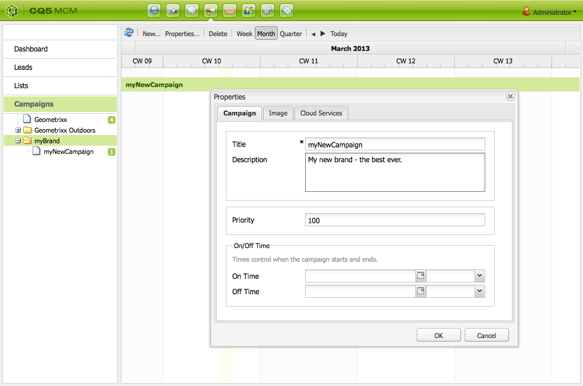
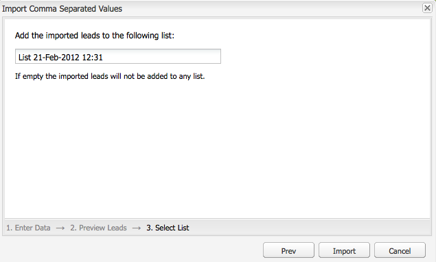

# 캠페인 설정{#setting-up-your-campaign}

새 캠페인을 설정하려면 다음과 같은(범용) 단계를 수행합니다.

1. 캠페인을 개최할 [브랜드를 만듭니다](#creating-a-new-brand).
1. 필요하다면 [새 브랜드에 대한 속성을 정의](#defining-the-properties-for-your-new-brand)할 수 있습니다.
1. 티저 페이지 또는 뉴스레터와 같은 경험을 제공할 [캠페인을 만듭니다](#creating-a-new-campaign).
1. 필요하다면 [새 캠페인에 대한 속성을 정의](#defining-the-properties-for-your-new-campaign)할 수 있습니다.

만들려는 경험의 유형에 따라 [경험을 만들어야](#creating-a-new-experience) 합니다. 경험의 세부 정보와 경험을 만든 이후의 동작은 만들고자 하는 경험 유형에 의해 좌우됩니다.

* 티저를 만드는 경우:

   1. [티저 경험을 만듭니다](/help/sites-classic-ui-authoring/classic-personalization-campaigns.md#creatingateaserexperience).
   1. [티저에 컨텐츠를 추가합니다](/help/sites-classic-ui-authoring/classic-personalization-campaigns.md#addingcontenttoyourteaser).
   1. [티저에 대한 터치포인트를 만듭니다](/help/sites-classic-ui-authoring/classic-personalization-campaigns.md#creatingatouchpointforyourteaser)(컨텐츠 페이지에 티저 추가하십시오.).

* 뉴스레터를 만드는 경우:

   1. [뉴스레터 경험을 만듭니다](/help/sites-classic-ui-authoring/classic-personalization-campaigns.md#creatinganewsletterexperience).
   1. [뉴스레터에 컨텐츠를 추가합니다](/help/sites-classic-ui-authoring/classic-personalization-campaigns.md#addingcontenttonewsletters).
   1. [뉴스레터를 개인의 필요에 맞게 만듭니다](/help/sites-classic-ui-authoring/classic-personalization-campaigns.md#personalizingnewsletters).
   1. [눈길을 끄는 뉴스레터 랜딩 페이지를 만듭니다](/help/sites-classic-ui-authoring/classic-personalization-campaigns.md#settingupanewsletterlandingpage).
   1. 가입자나 리드에게 [뉴스레터를 보냅니다](/help/sites-classic-ui-authoring/classic-personalization-campaigns.md#sendingnewsletters).

* Adobe Target(이전 Test&amp;Target) 오퍼를 생성하는 경우 다음을 수행하십시오.

   1. [Adobe Target 오퍼 경험을 만듭니다](/help/sites-classic-ui-authoring/classic-personalization-campaigns.md#creatingatesttargetofferexperience).
   1. [Adobe Target과 통합합니다](/help/sites-classic-ui-authoring/classic-personalization-campaigns.md#integratewithadobetesttarget).

>[!NOTE]
>
>세그먼트 정의에 대한 자세한 내용은 [세그멘테이션](/help/sites-administering/campaign-segmentation.md)을 참조하십시오.

## 새 브랜드 만들기 {#creating-a-new-brand}

새 브랜드를 만드는 방법은 다음과 같습니다.

1. **MCM**&#x200B;을 열고 왼쪽 창에서 **캠페인**&#x200B;을 선택합니다.

1. **새로 만들기...**&#x200B;를 선택하고 새 브랜드에 사용할 **제목** 및 **이름**&#x200B;과 템플릿을 입력합니다.

   

1. **만들기**&#x200B;를 클릭합니다. 새 브랜드가 MCM에 기본 아이콘으로 표시됩니다.

### 새 브랜드에 대한 속성 정의 {#defining-the-properties-for-your-new-brand}

1. 왼쪽 창의 **캠페인**&#x200B;을 선택한 뒤 오른쪽 창에서 새 브랜드 아이콘을 선택하고 **속성...**&#x200B;을 클릭합니다.

   **제목**, **설명** 및 아이콘으로 사용할 이미지를 입력할 수 있습니다.

   

1. **확인**&#x200B;을 클릭하여 저장합니다.

### 새 캠페인 만들기  {#creating-a-new-campaign}

새 캠페인을 만드는 방법은 다음과 같습니다.

1. **캠페인**&#x200B;에서 왼쪽 창에 있는 새 브랜드를 선택하거나 오른쪽 창에서 아이콘을 두 번 클릭합니다.

   개요가 표시됩니다(새 브랜드이면 아무 내용도 표시되지 않음).

1. **새로 만들기...**&#x200B;를 클릭하고 새 캠페인에 사용할 **제목**, **이름** 및 템플릿을 지정합니다.

   

1. **만들기**&#x200B;를 클릭합니다. 새 캠페인이 MCM에 표시됩니다.

### 새 캠페인에 대한 속성 정의  {#defining-the-properties-for-your-new-campaign}

행동을 제어하는 캠페인 속성을 구성하십시오.

* **우선 순위:** 다른 캠페인에 상대적인 이 캠페인의 우선 순위입니다. 여러 캠페인이 동시에 설정되어 있으면 우선 순위가 가장 높은 캠페인이 방문자 경험을 제어합니다.
* **설정 및 해제 시간:** 이 속성은 캠페인이 방문자 경험을 제어할 때의 기간을 제어합니다. 설정 시간 속성은 캠페인이 경험 제어를 시작하는 시간을 제어합니다. 해제 시간 속성은 캠페인이 경험 제어를 중지하는 시기를 제어합니다.
* **이미지:** AEM에서 캠페인을 나타내는 이미지입니다.
* **클라우드 서비스:** 캠페인이 통합되는 클라우드 서비스 구성입니다. ([Adobe Marketing Cloud와 통합](/help/sites-administering/marketing-cloud.md)을 참조하십시오.)

* **Adobe Target:** Adobe Target과 통합된 캠페인을 구성하는 속성입니다. ([Adobe Target과 통합](/help/sites-administering/target.md)을 참조하십시오.)

1. **캠페인**&#x200B;에서 귀사의 브랜드를 선택합니다. 오른쪽 창에서 캠페인을 선택하고 **속성**&#x200B;을 클릭하십시오.

   **제목**, **설명** 및 원하는 **클라우드 서비스**&#x200B;를 포함하여 원하는 다양한 속성을 입력할 수 있습니다.

   

1. **확인**&#x200B;을 클릭하여 저장합니다.

### 새 경험 만들기  {#creating-a-new-experience}

새 경험을 만드는 절차는 경험 유형에 좌우됩니다.

* [티저 만들기](/help/sites-classic-ui-authoring/classic-personalization-campaigns.md#creatingateaser)
* [뉴스레터 만들기](/help/sites-classic-ui-authoring/classic-personalization-campaigns.md#creatinganewsletter)
* [Adobe Target 오퍼 만들기](/help/sites-classic-ui-authoring/classic-personalization-campaigns.md#creatingatesttargetoffer)

>[!NOTE]
>
>이전 릴리스와 마찬가지로 여전히 **웹 사이트** 콘솔에서 경험을 페이지로 만들 수 있습니다(이전 릴리스에서 만든 페이지도 완전히 지원됨).
>
>지금은 경험을 만들 때 MCM을 사용하는 방법을 권장합니다.

### 새 경험 구성  {#configuring-your-new-experience}

경험에 대한 기본 골격을 만들었으므로 이제 경험 유형에 따라 다음 작업을 계속 진행해야 합니다.

* [티저](/help/sites-classic-ui-authoring/classic-personalization-campaigns.md#teasers):

   * [티저 페이지를 방문자 세그먼트에 연결합니다.](/help/sites-classic-ui-authoring/classic-personalization-campaigns.md#applyingasegmenttoyourteaser)
   * [티저에 대한 터치포인트를 만듭니다](/help/sites-classic-ui-authoring/classic-personalization-campaigns.md#creatingatouchpointforyourteaser)(컨텐츠 페이지에 티저 추가하십시오.).

* [뉴스레터](/help/sites-classic-ui-authoring/classic-personalization-campaigns.md#newsletters):

   * [뉴스레터에 컨텐츠를 추가합니다](/help/sites-classic-ui-authoring/classic-personalization-campaigns.md#addingcontenttonewsletters).
   * [뉴스레터를 개인의 필요에 맞게 만듭니다.](/help/sites-classic-ui-authoring/classic-personalization-campaigns.md#personalizingnewsletters)
   * 가입자나 리드에게 [뉴스레터를 보냅니다](/help/sites-classic-ui-authoring/classic-personalization-campaigns.md#sendingnewsletters).
   * [눈길을 끄는 뉴스레터 랜딩 페이지를 만듭니다](/help/sites-classic-ui-authoring/classic-personalization-campaigns.md#settingupanewsletterlandingpage).

* [Adobe Target 오퍼](/help/sites-classic-ui-authoring/classic-personalization-campaigns.md#testtargetoffers):

   * [Adobe Target과 통합합니다](/help/sites-administering/target.md).

### 새로운 터치포인트 추가 {#adding-a-new-touchpoint}

기존 경험이 있는 경우 MCM의 달력 보기에서 직접 터치포인트를 추가할 수 있습니다.

1. 캠페인에 대한 달력 보기를 선택합니다.

1. **터치포인트 추가...**&#x200B;를 클릭하여 대화 상자를 엽니다. 추가하려는 경험을 지정합니다.

   

1. **확인**&#x200B;을 클릭하여 저장합니다.

## 리드 작업 {#working-with-leads}

>[!NOTE]
>
>Adobe는 이 기능(리드 관리)을 추가로 개선할 계획이 없습니다.
>[AEM을 Adobe Campaign과 통합](/help/sites-administering/campaign.md)하여 활용하는 것이 좋습니다.

AEM MCM에서는 리드를 직접 입력하거나 메일링 목록과 같이 쉼표로 구분된 목록을 가져오는 방법으로 리드를 구성하고 추가할 수 있습니다. 리드를 생성하는 또 다른 방법은 Newsletter 등록 또는 커뮤니티 등록입니다. 적절한 구성을 통해 이러한 등록으로부터 리드를 생성하는 Workflow를 시작할 수 있습니다.

리드는 일반적으로 분류를 통해 목록에 배치되므로 이후에 목록 단위로 작업을 수행할 수 있습니다. 예를 들어 특정 목록에 사용자 지정 이메일을 보낼 수 있습니다.

대시보드에서 왼쪽 창의 **리드**&#x200B;를 클릭하면 모든 리드에 액세스할 수 있습니다. **목록** 창에서도 리드에 액세스할 수 있습니다.

>[!NOTE]
>
>사용자 아바타를 추가하거나 수정하려면 Clickstream Cloud(Ctrl+Alt+c)를 열고 프로필을 로드한 다음 **편집**&#x200B;을 클릭합니다.

### 새 리드 만들기  {#creating-new-leads}

새 리드를 만든 후에는 [리드를 활성화](#activating-or-deactivating-leads)해야 게시 인스턴스에서 리드의 활동을 추적하고 리드의 경험을 개인화(개인의 필요에 맞게 만들기)할 수 있습니다.

새 리드를 직접 만드는 방법은 다음과 같습니다.

1. AEM에서 MCM으로 이동합니다. 대시보드에서 **리드**&#x200B;를 클
1. **새로 만들기**&#x200B;를 클릭합니다. **새로 만들기** 창이 열립니다.

   

1. 필드에 정보를 적절히 입력합니다. **주소** 탭을 클릭합니다.

   

1. 주소 정보를 적절히 입력합니다. **저장**&#x200B;을 클릭하여 리드를 저장합니다. 리드를 더 추가하려면 **저장하고 새로 만들기**&#x200B;를 클릭합니다.

   리드 창에 새 리드가 나타납니다. 항목을 클릭하면 입력된 모든 정보가 오른쪽 창에 표시됩니다. 리드를 만든 후 목록에 추가할 수 있습니다.

   

### 리드 활성화 또는 비활성화 {#activating-or-deactivating-leads}

리드를 활성화하면 게시 인스턴스에서 리드의 활동을 추가하고 리드의 환경을 개인화할 수 있습니다. 리드의 활동을 더 이상 추적하지 않으려면 리드를 비활성화합니다.

리드를 활성화하거나 비활성화하는 방법은 다음과 같습니다.

1. AEM에서 MCM으로 이동하고 **리드**&#x200B;를 클릭합니다.

1. 활성화하거나 비활성화할 리드를 선택하고 **활성화** 또는 **비활성화**&#x200B;를 클릭합니다.

   

   AEM 페이지와 마찬가지로 게시 상태가 **게시됨** 열에 표시됩니다.

   

### 새 리드 가져오기 {#importing-new-leads}

새 리드를 가져올 때는 기존 목록에 자동으로 추가할 수도 있고, 리드를 포함할 새 목록을 만들 수도 있습니다.

쉼표로 구분된 목록에서 리드를 가져오는 방법은 다음과 같습니다.

1. AEM에서 MCM으로 이동하고 **리드**&#x200B;를 클릭합니다.

   >[!NOTE]
   >
   >다음 방법 중 하나로 리드를 가져올 수도 있습니다.
   >
   >
   >
   >    * 대시보드의 **목록** 창에서 **리드 가져오기**&#x200B;를 클릭합니다.
      >
      >    
   * **목록**&#x200B;을 클릭하고 **도구** 메뉴에서 **리드 가져오기**&#x200B;를 클릭합니다.

1. **도구** 메뉴에서 **리드** **가져오기**&#x200B;를 클릭합니다.

1. 샘플 데이터에 나와 있는 정보를 입력합니다. email,familyName,givenName,gender,aboutMe,city,country,phoneNumber,postalCode,region,streetAddress 필드를 가져올 수 있습니다.

   >[!NOTE]
   >
   >CSV 목록의 첫 번째 행은 사전 정의된 레이블로 예제와 동일하게 작성되어야 합니다.
   >
   >
   >`email,givenName,familyName` - 예를  `givenname`들어 이렇게 쓰여진 경우 시스템은 이를 인식하지 못합니다.

   

1. **다음**&#x200B;을 클릭합니다. 여기에서 리드를 미리 보고 정보가 정확한지 확인합니다.

   

1. **다음**&#x200B;을 클릭합니다. 리드가 속할 목록을 선택합니다. 목록에 속하게 하지 않으려면 해당 필드의 정보를 삭제합니다. 기본적으로 AEM은 날짜와 시간이 포함된 목록 이름을 만듭니다. **가져오기**&#x200B;를 클릭합니다. 

   

   리드 창에 새 리드가 나타납니다. 항목을 클릭하면 입력된 모든 정보가 오른쪽 창에 표시됩니다. 리드를 만든 후 목록에 추가할 수 있습니다.

### 목록에 리드 추가  {#adding-leads-to-lists}

기존 목록에 리드를 추가하는 방법은 다음과 같습니다.

1. MCM에서 **리드**&#x200B;를 클릭하여 사용 가능한 모든 리드를 확인합니다.

1. 목록에 추가할 리드 옆의 확인란을 선택합니다. 필요에 따라 여러 리드를 추가할 수 있습니다.

   

1. **도구** 메뉴에서 **목록에 추가...**&#x200B;를 클릭합니다. **목록에 추가** 창이 열립니다.

   

1. 리드를 추가할 목록을 선택하고 **확인**&#x200B;을 클릭합니다. 해당 목록에 리드가 추가됩니다.

### 리드 정보 확인  {#viewing-lead-information}

리드 정보를 확인하려는 경우 MCM에서 리드 옆의 확인란을 클릭하면 오른쪽 창에 소속된 목록을 비롯하여 리드의 모든 정보가 표시됩니다.

### 기존 리드 수정 {#modifying-existing-leads}

기존 리드 정보를 수정하는 방법은 다음과 같습니다.

1. MCM에서 **리드**&#x200B;를 클릭합니다. 리드 목록에서 편집할 리드 옆의 확인란을 선택합니다. 오른쪽 창에 모든 리드 정보가 표시됩니다.

   

   >[!NOTE]
   >
   >리드를 한 번에 하나씩만 편집할 수 있습니다. 같은 목록에 속하는 여러 리드를 수정하려는 경우 목록 자체를 수정할 수 있습니다.

1. **편집**&#x200B;을 클릭합니다. **리드 편집** 창이 열립니다.

   

1. 필요에 따라 편집하고 **저장**&#x200B;을 클릭하여 변경 사항을 저장합니다.

   >[!NOTE]
   >
   >리드 아바타를 변경하려면 사용자 프로필로 이동합니다. Clickstream Cloud에 프로필을 로드하려면 Ctrl+Alt+C를 누르고 **로드**&#x200B;를 클릭한 다음 프로필을 선택합니다.

### 기존 리드 삭제  {#deleting-existing-leads}

MCM에서 기존 리드를 삭제하려면 리드 옆의 확인란을 선택하고 **삭제**&#x200B;를 클릭합니다. 리드가 리드 목록과 모든 관련 목록에서 제거됩니다.

>[!NOTE]
>
>삭제가 실행되기 전에 기존 리드를 삭제할지 확인하는 메시지가 나타납니다. 삭제된 항목은 복원할 수 없습니다.

## 목록 작업  {#working-with-lists}

>[!NOTE]
>
>Adobe는 이 기능(목록 관리)을 추가로 개선할 계획이 없습니다.
>[AEM을 Adobe Campaign과 통합](/help/sites-administering/campaign.md)하여 활용하는 것이 좋습니다.

목록을 통해 리드를 여러 그룹으로 정리할 수 있습니다. 목록을 사용하여 마케팅 캠페인을 특정 사용자 그룹으로 타게팅할 수 있습니다. 예를 들어 특정 목록에 맞춤형 뉴스레터를 보낼 수 있습니다. 목록은 MCM에서 대시보드에서 확인하거나 **목록**&#x200B;을 클릭하여 확인할 수 있습니다. 두 경우 모두 목록 이름과 구성원 수가 표시됩니다.

**목록**&#x200B;을 클릭하는 경우 목록이 다른 목록에 속하는지 여부 및 설명을 볼 수도 있습니다.

### 새 목록 만들기 {#creating-new-lists}

새 목록(그룹)을 만드는 방법은 다음과 같습니다.

1. MCM 대시보드에서 **새 목록...**&#x200B;을 클릭하거나 **목록**&#x200B;에서 **새로 만들기...**&#x200B;를 클릭합니다. 목록 만들기 창이 열립니다.

   

1. 이름(필수 항목)을 입력하고 필요한 경우 설명을 입력한 후 **저장**&#x200B;을 클릭합니다. **목록** 창에 목록이 나타납니다.

   

### 기존 목록 수정 {#modifying-existing-lists}

기존 목록을 수정하는 방법은 다음과 같습니다.

1. MCM에서 **목록**&#x200B;을 클릭합니다.

1. 편집할 목록 옆의 확인란을 선택하고 **편집**&#x200B;을 클릭합니다. **목록 편집** 창이 열립니다.

   

   >[!NOTE]
   >
   >목록을 한 번에 하나씩만 편집할 수 있습니다.

1. 필요에 따라 편집하고 **저장**&#x200B;을 클릭하여 변경 사항을 저장합니다.

### 기존 목록 삭제  {#deleting-existing-lists}

기존 목록을 삭제하려면 MCM에서 목록 옆의 확인란을 선택하고 **삭제**&#x200B;를 클릭합니다. 목록이 제거됩니다. 목록에 속한 리드는 제거되지 않으며 단순히 목록에서 제외됩니다.

>[!NOTE]
>
>삭제가 실행되기 전에 기존 목록을 삭제할지 확인하는 메시지가 나타납니다. 삭제된 항목은 복원할 수 없습니다.

### 목록 병합  {#merging-lists}

기존 목록을 다른 목록과 병합할 수 있습니다. 이때 병합하는 목록은 다른 목록에 속하게 됩니다. 이 목록은 별도의 항목으로 계속 유지되므로 삭제해서는 안 됩니다.

예를 들어 두 장소에서 같은 회의가 열리는 경우 전체 회의의 참석자 목록을 하나로 병합할 수 있습니다.

기존 목록을 병합하는 방법은 다음과 같습니다.

1. MCM에서 **목록**&#x200B;을 클릭합니다.

1. 다른 목록에 병합할 목록 옆의 확인란을 선택합니다.

1. **도구** 메뉴에서 **목록 병합**&#x200B;을 선택합니다.

   >[!NOTE]
   >
   >목록을 한 번에 하나씩만 병합할 수 있습니다.

1. **목록 병합** 창에서 병합할 목록을 선택하고 **확인**&#x200B;을 클릭합니다.

   

   병합된 목록의 구성원 수가 하나 증가합니다. 목록이 병합되었는지 확인하려면 병합된 목록을 선택하고 **도구** 메뉴에서 **리드 표시**&#x200B;를 선택합니다.

1. 위 단계를 반복하여 필요한 목록을 모두 병합합니다.

   

>[!NOTE]
>
>병합된 목록을 구성원에서 제외하는 방법은 목록에서 리드를 제외하는 방법과 동일합니다. **목록** 탭을 열고 병합된 목록을 포함하는 목록을 선택한 후 목록 옆의 빨간색 원을 클릭하여 목록에서 제외합니다.

### 목록의 리드 확인  {#viewing-leads-in-lists}

언제든지 구성원을 찾아보거나 검색하여 특정 목록에 속한 리드를 확인할 수 있습니다.

특정 목록에 속하는 리드를 확인하는 방법은 다음과 같습니다.

1. MCM에서 **목록**&#x200B;을 클릭합니다.

1. 구성원을 확인할 목록 옆의 확인란을 선택합니다.

1. **도구** 메뉴에서 **리드 표시**&#x200B;를 선택합니다. 해당 목록에 속하는 리드가 표시됩니다. 목록을 살펴보거나 구성원을 검색할 수 있습니다.

   >[!NOTE]
   >
   >또한 리드를 선택하고 **구성원 제거**&#x200B;를 클릭하여 리드를 목록에서 삭제할 수 있습니다.

   

1. **닫기**&#x200B;를 클릭하여 MCM으로 돌아갑니다.
