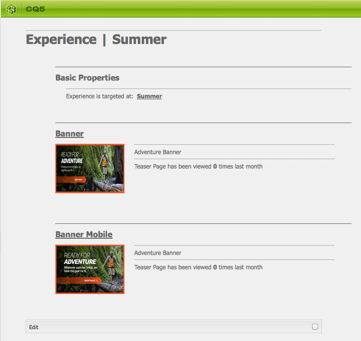

# 티저 및 전략{#teasers-and-strategies}

캠페인에서는 특정한 방문자 세그먼트를 관심사에 맞는 컨텐츠로 유도하기 위한 메커니즘으로 티저를 사용하는 경우가 많습니다. 특정 캠페인에 하나 이상의 티저가 정의될 수 있습니다.

>[!NOTE]
>
>티저 구성 요소는 AEM 6.2에서 더 이상 사용되지 않습니다. 대신 [Target 구성 요소](/help/sites-authoring/content-targeting-touch.md)를 사용하십시오.

* **브랜드** 페이지는 웹 사이트의 캠페인 섹션에 저장됩니다. 브랜드에는 개별 캠페인이 포함되어 있습니다.
* **캠페인** 페이지는 웹 사이트의 캠페인 섹션에 저장됩니다. 각 캠페인에는 개별 페이지가 있고, 개별 페이지에 티저 정의가 있습니다. 또한 컨테이너 또는 개요 페이지는 개별 티저 페이지에 대한 특정 정보 및 통계를 포함합니다.

AEM의 티저는 여러 부분으로 구성됩니다.

* **Teaser** 페이지는 해당 캠페인 페이지에 저장되고 각 특정 캠페인에 사용할 수 있는 Teaser 단락의 정의를 포함합니다. 이러한 정의는 티저 단락을 표시할 때 사용되며 컨텐츠 변형, 변형을 선택하는 데 사용할 세그먼트 및 증폭 인수를 포함합니다.
* **티저 구성 요소**&#x200B;는 기본적으로 제공되며 컨텐츠 페이지에 특정 티저 단락의 인스턴스를 만들 수 있게 합니다. 사이드킥에서 티저 구성 요소를 드래그한 다음 티저 정의를 지정하여 티저 단락을 직접 만들 수 있습니다. **참고: 티저 구성 요소** 는 AEM 6.2에서 더 이상 사용되지 않습니다. 대신  [Target 구성 ](/help/sites-authoring/content-targeting-touch.md) 요소를 사용하십시오.
* **티저 단락**&#x200B;은 컨텐츠 페이지에 포함된 티저의 실제 인스턴스입니다. 이 단락은 특정 방문자 세그먼트를 관심사에 맞는 컨텐츠로 유도합니다.
* 특정 방문자 세그먼트를 위한 맞춤 캠페인 컨텐츠를 포함하는 페이지입니다. 일반적으로 티저 단락은 방문자를 이러한 페이지로 유도합니다.

## 전략 {#strategies}

페이지에 Teaser 단락을 추가할 때는 **Strategy**&#x200B;를 정의해야 합니다.

이는 여러 티저에 지정된 세그먼트가 모두 성공적으로 해결되어 선택이 가능해질 수 있기 때문입니다. 이러한 경우에 **전략**&#x200B;에 지정된 추가 기준을 통해 표시할 티저가 선택됩니다.

* **Clickstream 점수**: 방문자의 클라이언트 컨텍스트(방문자가 각 태그가 포함된 페이지를 몇 번 클릭했는지 표시)에 포함된 태그 및 관련 태그 조회수를 기준으로 합니다. 티저 페이지에 정의된 태그의 조회수가 비교됩니다.
* **임의**, &quot;임의&quot; 선택을 위한 경우;페이지에 대해 생성된 무작위 인수를 사용합니다. 클라이언트 컨텍스트에서 확인할 수  [있습니다](/help/sites-administering/client-context.md).
* **해결된** 세그먼트 목록을 먼저 확인하십시오. 이 순서는 캠페인 컨테이너 페이지에 포함된 티저 순서와 같습니다.

세그먼트의 [증폭 인수](/help/sites-administering/campaign-segmentation.md#boost-factor)도 선택에 영향을 줍니다. 이 인수는 세그먼트 정의에 추가되어 상대적인 선택 가능성을 높이거나 낮추는 가중치입니다.

다양한 선택 기준의 처리와 상호 관계를 알기 쉽게 예제로 설명하겠습니다. 이 방법을 티저가 의도한 대상에게 도달하는지 확인하는 데 사용할 수도 있습니다.

다음과 같은 세그먼트를 만들었으며 증폭 인수를 각각 지정했다고 가정해 보겠습니다.

| 세그먼트 | 증폭 인수 |
|---|---|
| S1 | 0 |
| S2 | 0 |
| S3 | 10 |
| S4 | 30 |
| S5 | 0 |
| S6 | 100 |

다음과 같은 Tease 정의를 사용합니다.

<table>
 <tbody>
  <tr>
   <td>캠페인</td>
   <td>티저</td>
   <td>지정된 세그먼트</td>
   <td>지정된 태그 </td>
  </tr>
  <tr>
   <td>C1</td>
   <td>T3</td>
   <td>S1, S2</td>
   <td>비즈니스, 마케팅</td>
  </tr>
  <tr>
   <td>C3</td>
   <td>T2 </td>
   <td>S1</td>
   <td>  </td>
  </tr>
  <tr>
   <td>C3 </td>
   <td>T3</td>
   <td>, S3, S4</td>
   <td>  </td>
  </tr>
  <tr>
   <td>C1 </td>
   <td>T4</td>
   <td>, S2, S5</td>
   <td>  </td>
  </tr>
  <tr>
   <td>C1 </td>
   <td>T5</td>
   <td>S1, S2, S6</td>
   <td>마케팅</td>
  </tr>
  <tr>
   <td>C3 </td>
   <td>T6</td>
   <td>S6</td>
   <td>비즈니스  </td>
  </tr>
 </tbody>
</table>

다음과 같은 방문자에게 적용합니다.

* **S1**,  **S2** 와  **S6** 을 성공적으로해결

* **마케팅** 태그의 조회수 3회
* **비즈니스** 태그의 조회수 6회

다음과 같은 결과를 확인할 수 있습니다.

* 일치 성공 - 티저에 지정된 세그먼트 중 현재 방문자를 대상으로 해결에 성공한 세그먼트가 하나라도 있는지 여부
* 증폭 인수 - 적용 가능한 모든 세그먼트 중 가장 높은 증폭 인수
* Clickstream 점수 - 적용 가능한 모든 태그 조회수의 누적 합계

적절한 전략을 적용하기 전에 계산:

<table>
 <tbody>
  <tr>
   <td>캠페인</td>
   <td>티저</td>
   <td>지정된 세그먼트</td>
   <td>태그 </td>
   <td>일치 성공?</td>
   <td>결과 증폭 인수</td>
   <td>결과 클릭스트림 점수 </td>
  </tr>
  <tr>
   <td>C1</td>
   <td>T1</td>
   <td>S1, S2</td>
   <td>비즈니스, 마케팅</td>
   <td>예</td>
   <td>0</td>
   <td>9</td>
  </tr>
  <tr>
   <td>C3</td>
   <td>T2 </td>
   <td>S1</td>
   <td>  </td>
   <td>예</td>
   <td>0</td>
   <td>  </td>
  </tr>
  <tr>
   <td>C3 </td>
   <td>T3</td>
   <td>, S3, S4</td>
   <td>  </td>
   <td>아니오</td>
   <td>  </td>
   <td>  </td>
  </tr>
  <tr>
   <td>C3 </td>
   <td>T4</td>
   <td>, S2, S5</td>
   <td>  </td>
   <td>예  </td>
   <td>0  </td>
   <td>  </td>
  </tr>
  <tr>
   <td>C3 </td>
   <td>T5</td>
   <td>S1, S2, S6</td>
   <td>마케팅</td>
   <td>예</td>
   <td>100년</td>
   <td>3</td>
  </tr>
  <tr>
   <td>C3 </td>
   <td>T6</td>
   <td>S6</td>
   <td>비즈니스</td>
   <td>예</td>
   <td>100년</td>
   <td>6 </td>
  </tr>
 </tbody>
</table>

이러한 값을 사용하여 Teaser 단락에 적용된 **전략**&#x200B;에 따라 방문자에게 표시할 Teaser를 결정합니다.

<table>
 <tbody>
  <tr>
   <td>전략</td>
   <td>결과 Teaser</td>
   <td>댓글</td>
  </tr>
  <tr>
   <td>첫 번째 날</td>
   <td>T5</td>
   <td>세그먼트가 해결되는 <i>동시에</i> 증폭 인수가 가장 높은 T5 및 T6만 고려됩니다. 반환되는 목록의 순서가 T5, T6이므로 T5이 선택되어 표시됩니다.</td>
  </tr>
  <tr>
   <td>임의</td>
   <td>T5 또는 T6</td>
   <td>두 Teaser의 세그먼트가 해결되고 증폭 인수가 동일합니다. 따라서 두 Teaser가 동일한 비율로 표시됩니다.</td>
  </tr>
  <tr>
   <td>Clickstream 점수</td>
   <td>T6</td>
   <td>
방문자에 대해 T1, T4, T5 및 T6의 세그먼트가 모두 해결됩니다. 증폭 인수가 가장 높은 T5 및 T6만 남고 T1 및 T4는 제외됩니다. 마지막으로 Clickstream 점수가 더 높은 T6이 선택됩니다.
 </td>
  </tr>
 </tbody>
</table>

>[!NOTE]
>
>위와 같은 해결 기법을 거친 후에도 여러 Teaser를 선택할 수 있는 경우 무작위 내부 선택을 통해 하나의 Teaser가 선택되어 표시됩니다.
>
>예를 들어 전략이 Clickstream 점수이고 T5의 Clickstream 점수가 3이 아닌 T6과 같은 6점이라면 무작위 내부 선택을 통해 둘 중 하나가 선택됩니다.

티저 페이지/단락은 특정 방문자 세그먼트를 관심사에 맞는 컨텐츠로 유도하는 데 사용됩니다. 이것은 특정 방문자 세그먼트에 따라 방문자가 선택할 수 있는 여러 옵션을 제시할 수도 있고 하나의 티저 단락만 표시할 수도 있습니다. 예를 들어 방문자의 나이에 따라 다른 티저 단락을 표시할 수 있습니다.

일반적으로 티저 페이지는 특정 기간 동안만 일시적으로 작동하며, 기간이 지나면 다음 티저 페이지로 대체됩니다.

브랜드 및 캠페인을 만든 후에는 티저 경험을 만들고 설정할 수 있습니다.

### 티저에 대한 터치포인트 만들기 {#creating-a-touchpoint-for-your-teaser}

>[!NOTE]
>
>티저 구성 요소는 AEM 6.2에서 더 이상 사용되지 않습니다. 대신 [Target 구성 요소](/help/sites-authoring/content-targeting-touch.md)를 사용하십시오.

1. 캠페인 페이지로 연결될 티저 단락을 배치할 컨텐츠 페이지로 이동합니다.
1. 사이드킥의 **개인화** 섹션에 있는 **티저** 구성 요소를 필요한 위치에 추가합니다. 처음 만들면 캠페인 경로가 아직 구성되지 않았다고 표시됩니다.

   

1. 티저 구성 요소를 편집하여 다음을 추가합니다.

   * **캠페인 경로** 개별 티저 페이지를 포함하는 캠페인 페이지의 경로이며, 세그먼트에 따라 표시되는 티저가 정확히 결정됩니다.

   * **[전략](/help/sites-classic-ui-authoring/classic-personalization-campaigns.md#strategies)** 여러 세그먼트가 성공적으로 해결된 경우에 사용할 선택 방법입니다.
   

1. **확인**&#x200B;을 클릭하여 저장합니다. 티저에 대해 설정한 세그먼트와 현재 로그인된 사용자의 프로필에 따라, 적절한 컨텐츠가 표시됩니다.

   

1. 티저 단락 위로 마우스를 가져가 물음표 아이콘을 표시합니다(구성 요소의 오른쪽 하단 구석). 적용된 세그먼트와 현재 해결되었는지를 확인하려면 클릭합니다.

   

### 티저 개요 {#teaser-overview}

MCM의 캠페인 보기와 마찬가지로, 캠페인 페이지에서도 연결된 Teaser에 대한 정보가 표시됩니다.

1. **웹 사이트** 콘솔에서 캠페인 페이지를 엽니다. 예를 들면 다음과 같습니다.

   `https://localhost:4502/content/campaigns/geometrixx-outdoors/storefront/summer.html`

   여기에는 Teaser 정의와 보기 통계의 개요가 표시됩니다.

   
