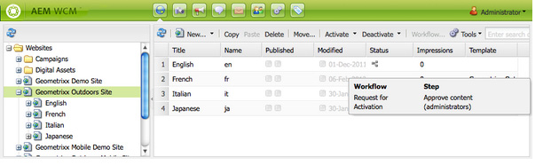

# 페이지에 워크플로우 적용{#applying-workflows-to-pages}

워크플로우를 적용할 때에는 다음 정보를 지정합니다.

* 적용할 워크플로우.

    모든 워크플로우(AEM 관리자가 지정한 액세스 권한이 있는 워크플로우)를 적용할 수 있습니다.
* 원할 경우:

   * 워크플로우를 시작한 이유에 대한 정보를 제공하는 주석.
   * 사용자의 받은 편지함에서 워크플로우 인스턴스를 식별하는 데 도움이 되는 제목.

>[!NOTE]
>
>AEM 관리자는 [몇 가지 다른 방법](/help/sites-administering/workflows-starting.md)을 사용하여 워크플로우를 시작할 수 있습니다.

## 워크플로우 적용 {#applying-workflows}

워크플로우는 웹 사이트 콘솔에서, 또는 페이지 편집 시에는 사이드 킥에서 시작할 수 있습니다.

**웹 사이트** 콘솔의 **상태** 열은 워크플로우가 페이지에 적용되었는지 여부를 나타냅니다.

### 웹 사이트 콘솔에서 워크플로우 시작 {#starting-a-workflow-from-the-websites-console}

1. 웹 사이트 콘솔을 엽니다. ([http://localhost:4502/siteadmin](http://localhost:4502/siteadmin))
1. 웹 사이트 트리에서 워크플로우를 적용할 페이지의 상위를 선택합니다.
1. 페이지 목록에서 페이지를 선택한 다음 [워크플로우]를 클릭합니다.
1. [워크플로우 시작] 대화 상자에서 적용할 워크플로우를 선택합니다. 원할 경우, 주석과 제목을 입력하십시오. 그런 다음 [시작]을 클릭합니다.

### 사이드 킥을 사용한 워크플로우 시작  {#starting-a-workflow-using-sidekick}

1. 웹 사이트 콘솔을 엽니다.
1. 필요한 페이지를 엽니다.
1. 사이드 킥에서 [워크플로우] 탭을 선택합니다.
1. **워크플로우** 대화 상자를 확장하여 **워크플로우**&#x200B;를 선택하고 선택적으로 **워크플로우 제목** 및 **주석**&#x200B;을 입력합니다.

   

1. **워크플로우 시작**&#x200B;을 클릭하여 구성한 속성과 현재 페이지를 페이로드로 사용하여 새 워크플로우 인스턴스를 시작합니다. 이제 워크플로우가 실행 중입니다.

