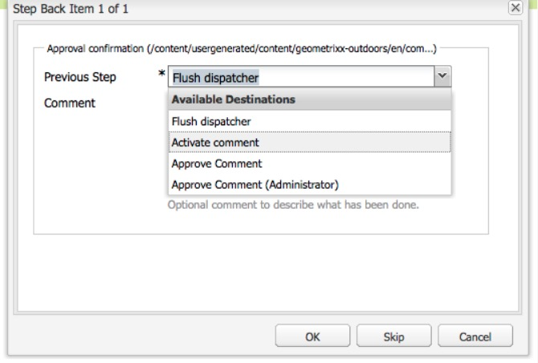

# 워크플로우에 참여{#participating-in-workflows}

워크플로우는 일반적으로 페이지나 자산에 대해 사람이 활동을 수행해야 하는 단계를 포함합니다. 워크플로우는 활동을 수행할 사용자 또는 그룹을 선택하고 해당 개인 또는 그룹에 작업 항목을 지정합니다.

## 작업 항목 처리 {#processing-your-work-items}

다음 작업을 수행하여 작업 항목을 처리할 수 있습니다.

* **완료**

   워크플로우가 다음 단계로 진행될 수 있도록 하는 항목을 완료할 수 있습니다.

* **위임**

   하나의 단계가 사용자에게 지정되었지만 어떠한 이유로 작업을 수행할 수 없는 경우, 다른 사용자 또는 그룹에 해당 단계를 위임할 수 있습니다.

   위임에 사용할 수 있는 사용자는 작업 항목이 지정된 사용자에게 따라 다릅니다.

   * 작업 항목이 그룹에 지정된 경우 그룹 구성원을 사용할 수 있습니다.
   * 작업 항목이 그룹에 지정된 후 사용자에게 위임된 경우 그룹 구성원과 그룹을 사용할 수 있습니다.
   * 작업 항목이 단일 사용자에게 지정된 경우에는 작업 항목을 위임할 수 없습니다.

* **뒤로 이동**

   단계 또는 일련의 단계를 반복해야 하는 경우 다시 돌아갈 수 있습니다. 따라서 워크플로우에서 이전에 발생한 단계를 선택하여 다시 처리할 수 있습니다. 워크플로우가 사용자가 지정한 단계로 돌아가서 그 단계에서부터 진행됩니다.

## 워크플로우 참여 {#participating-in-a-workflow}

### 지정된 워크플로우 작업의 알림 {#notifications-of-assigned-workflow-actions}

작업 항목(예: **컨텐츠 승인**)을 지정받으면 다양한 경고 및/또는 알림이 나타납니다.

* 웹 사이트 콘솔의 **상태** 열은 페이지가 언제 워크플로우에 있는지를 나타냅니다.

   

* 사용자나 사용자가 속한 그룹이 워크플로우의 일부인 작업 항목을 지정받으면 이 작업 항목이 사용자의 AEM 워크플로우 받은 편지함에 표시됩니다.

   

### 참가자 단계 완료 {#completing-a-participant-step}

표시된 작업을 수행한 후에는 작업 항목을 완료할 수 있으므로 워크플로우가 계속될 수 있습니다. 다음 절차를 사용하여 작업 항목을 완료하십시오.

1. 워크플로우 단계를 선택하고 맨 위 탐색 막대에서 **완료** 단추를 클릭합니다.
1. 결과 대화 상자에서 **다음 단계**(즉, 다음으로 실행될 단계)를 선택합니다. 드롭다운 목록에는 모든 적절한 대상이 표시됩니다. **주석**&#x200B;을 입력할 수도 있습니다.

   

   나열된 단계 수는 워크플로우 모델의 디자인에 따라 다릅니다.

1. **확인**&#x200B;을 클릭하여 작업을 확인합니다.

### 참가자 단계 위임  {#delegating-a-participant-step}

다음 절차를 사용하여 작업 항목을 위임하십시오.

1. 맨 위 탐색 막대에서 **위임** 단추를 클릭합니다.
1. 대화 상자에서 드롭다운 목록을 사용하여 작업 항목을 위임받을 **사용자**&#x200B;를 선택합니다. **주석**&#x200B;을 추가할 수도 있습니다.

   

1. **확인**&#x200B;을 클릭하여 작업을 확인합니다.

### 참가자 단계에서 뒤로 이동 수행  {#performing-step-back-on-a-participant-step}

다음 절차를 사용하여 뒤 단계로 이동하십시오.

1. 맨 위 탐색 막대에서 [뒤로 이동] 단추를 클릭합니다.
1. 결과 대화 상자에서 [이전 단계](즉, 워크플로우에서 이전에 발생한 단계지만 다음으로 실행될 단계임)를 선택합니다. 드롭다운 목록에는 모든 적절한 대상이 표시됩니다. 

   

1. 확인을 클릭하여 작업을 확인합니다.

