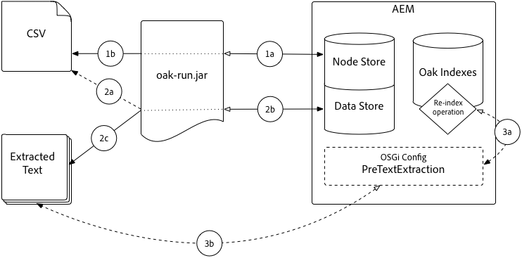

# 쿼리 및 색인 작성 우수 사례{#best-practices-for-queries-and-indexing}

AEM 6에서 Oak로 전환하는 것과 함께 쿼리와 색인을 관리하는 방식에 몇 가지 주요 변경 사항이 적용되었습니다. Jackrabbit 2에서 모든 컨텐츠는 기본적으로 인덱싱되어 있으며 자유롭게 쿼리할 수 있습니다. Oak에서 색인은 `oak:index` 노드 아래에 수동으로 만들어야 합니다. 쿼리가 인덱스 없이 실행될 수 있지만 큰 데이터 집합의 경우 매우 느리게 실행되거나 중단됩니다.

이 문서에서는 색인을 만들 때뿐만 아니라 색인이 필요하지 않은 시기, 쿼리가 필요하지 않은 경우 쿼리를 사용하지 않는 기법 및 최적으로 수행하기 위한 색인 및 쿼리를 최적화하기 위한 팁에 대해 설명합니다.

또한 쿼리 및 색인 작성에 대한 [Oak 설명서를 읽어야 합니다](/help/sites-deploying/queries-and-indexing.md). AEM 6의 새로운 개념인 인덱스 외에도 Oak 쿼리에는 이전 AEM 설치에서 코드를 마이그레이션할 때 고려해야 하는 구문 차이점이 있습니다.

## 쿼리 사용 시기 {#when-to-use-queries}

### 저장소 및 분류 디자인 {#repository-and-taxonomy-design}

저장소의 분류 체계를 디자인할 때 몇 가지 요인을 고려해야 합니다. 여기에는 액세스 제어, 로컬라이제이션, 구성 요소 및 페이지 속성 상속이 포함됩니다.

이러한 문제를 해결하는 분류 체계를 디자인하는 동안 색인 디자인의 &quot;순차적 가능성&quot;을 고려해야 합니다. 이러한 맥락에서, 순회 기능은 경로를 기반으로 컨텐츠를 예측 가능하게 액세스할 수 있도록 하는 분류 시스템의 기능입니다. 이렇게 하면 많은 쿼리를 실행해야 하는 성능 시스템보다 유지 관리가 더 쉬워집니다.

또한 택소노미를 디자인할 때 주문 중요성이 있는지 고려해야 합니다. 명시적 순서가 필요하지 않고 많은 수의 동기 노드가 예상될 경우 `sling:Folder` 또는 `oak:Unstructured`과 같이 순서가 지정되지 않은 노드 유형을 사용하는 것이 좋습니다. 주문이 필요한 경우 `nt:unstructured` 및 `sling:OrderedFolder`이(가) 더 적합합니다.

### 구성 요소 {#queries-in-components}의 쿼리

쿼리는 AEM 시스템에서 수행하는 보다 많은 세금 작업 중 하나일 수 있으므로 구성 요소에서 쿼리를 사용하지 않는 것이 좋습니다. 페이지를 렌더링할 때마다 여러 개의 쿼리가 실행되면 종종 시스템의 성능이 저하될 수 있습니다. 구성 요소를 렌더링할 때 쿼리를 실행하지 않도록 하는 두 가지 전략이 있습니다.**노드 탐색** 및 **프리페치 결과**.

#### 노드 탐색 {#traversing-nodes}

저장소가 필요한 데이터의 위치를 사전에 파악할 수 있도록 설계된 경우 필요한 경로에서 이 데이터를 검색하는 코드는 쿼리를 찾기 위해 실행하지 않고도 배포할 수 있습니다.

이러한 예로는 특정 카테고리 내에 맞는 컨텐츠를 렌더링할 수 있습니다. 카테고리의 항목을 표시하는 구성 요소를 채우기 위해 쿼리할 수 있는 카테고리 속성으로 컨텐츠를 구성하는 한 가지 방법이 됩니다.

이러한 컨텐츠를 범주별로 구조화하여 수동으로 검색할 수 있도록 하는 것이 좋습니다.

예를 들어 컨텐츠가 다음과 유사한 분류법에 저장되는 경우

```xml
/content/myUnstructuredContent/parentCategory/childCategory/contentPiece
```

`/content/myUnstructuredContent/parentCategory/childCategory` 노드는 간단히 검색할 수 있으며, 하위 노드를 구문 분석하여 구성 요소를 렌더링하는 데 사용할 수 있습니다.

또한 작은 결과 또는 단일 결과 세트를 처리하는 경우 쿼리를 작성하여 동일한 결과 세트를 반환하는 대신 저장소를 보다 빠르게 탐색하고 필요한 노드를 수집할 수 있습니다. 일반적으로 쿼리는 가능한 경우 피하는 것이 좋습니다.

#### 프리페치 결과 {#prefetching-results}

경우에 따라 구성 요소에 대한 컨텐트 또는 요구 사항은 필요한 데이터를 검색하는 방법으로 노드 통과의 사용을 허용하지 않습니다. 이러한 경우 최종 사용자에 대해 최적의 성능을 보장하려면 구성 요소를 렌더링하기 전에 필요한 쿼리를 실행해야 합니다.

구성 요소에 필요한 결과를 작성 시 계산할 수 있으며 컨텐츠가 변경될 기대치가 없는 경우 작성자가 대화 상자에 설정을 적용할 때 쿼리를 실행할 수 있습니다.

데이터나 컨텐츠가 정기적으로 변경되는 경우 기본 데이터에 대한 업데이트를 위해 일정에 따라 또는 수신기를 통해 쿼리를 실행할 수 있습니다. 그런 다음 결과를 저장소의 공유 위치에 작성할 수 있습니다. 이 데이터가 필요한 모든 구성 요소는 런타임에 쿼리를 실행하지 않고 이 단일 노드에서 값을 가져올 수 있습니다.

## 쿼리 최적화 {#query-optimization}

인덱스를 사용하지 않는 쿼리를 실행하면 노드 트래픽에 대한 경고가 기록됩니다. 이 쿼리가 자주 실행될 경우 인덱스를 만들어야 합니다. 지정된 쿼리가 사용 중인 인덱스를 확인하려면 [쿼리 설명 도구](/help/sites-administering/operations-dashboard.md#explain-query)를 사용하는 것이 좋습니다. 자세한 내용은 관련 검색 API에 대해 DEBUG 로깅을 활성화할 수 있습니다.

>[!NOTE]
>
>색인 정의를 수정한 후 색인을 다시 작성(재색인화)해야 합니다. 인덱스 크기에 따라 완료하는 데 시간이 다소 걸릴 수 있습니다.

복잡한 쿼리를 실행할 때 쿼리를 여러 개의 작은 쿼리로 분류하고 팩트 뒤에 코드를 통해 데이터를 연결하는 경우가 있을 수 있습니다. 이러한 경우에 대한 권장 사항은 두 접근 방식의 성능을 비교하여 해당 사용 사례에 더 적합한 옵션을 결정하는 것입니다.

AEM에서는 다음 세 가지 방법 중 하나로 쿼리를 작성할 수 있습니다.

* [QueryBuilder APIs](/help/sites-developing/querybuilder-api.md) 사용(권장)
* XPath 사용(권장)
* SQL2 사용

모든 쿼리가 실행 전에 SQL2로 변환되지만 쿼리 변환 오버헤드는 최소화되므로 쿼리 언어를 선택할 때 가장 큰 문제는 개발 팀에서 가독성과 사용 용이성 수준이 됩니다.

>[!NOTE]
>
>QueryBuilder를 사용할 때 기본적으로 결과 카운트가 결정됩니다. 이전 버전의 Jackrabbit와 비교하여 Oak에서는 더 느립니다. 이를 보상하려면 [guessTotal 매개 변수](/help/sites-developing/querybuilder-api.md#using-p-guesstotal-to-return-the-results)를 사용할 수 있습니다.

### 쿼리 설명 도구 {#the-explain-query-tool}

모든 쿼리 언어와 마찬가지로 쿼리를 최적화하는 첫 번째 단계는 쿼리 실행 방법을 이해하는 것입니다. 이 활동을 활성화하려면 작업 대시보드의 일부인 [쿼리 설명 도구](/help/sites-administering/operations-dashboard.md#explain-query)를 사용할 수 있습니다. 이 도구를 사용하면 쿼리를 연결하여 설명할 수 있습니다. 쿼리가 실행 시간 및 사용할 색인뿐만 아니라 큰 저장소 문제를 발생시키는 경우 경고가 표시됩니다. 또한 도구는 설명하고 최적화할 수 있는 느리고 자주 사용하는 쿼리 목록을 로드할 수 있습니다.

### 쿼리에 대한 디버그 로깅 {#debug-logging-for-queries}

Oak가 사용할 인덱스를 선택하는 방법과 쿼리 엔진이 실제로 쿼리를 실행하는 방식에 대한 추가 정보를 얻으려면 다음 패키지에 대해 **DEBUG** 로깅 구성을 추가할 수 있습니다.

* org.apache.jackrabbit.oak.plugins.index
* org.apache.jackrabbit.oak.query
* com.day.cq.search

쿼리 디버깅이 끝나면 로그 파일을 사용하여 디스크를 채울 수 있으므로 많은 작업을 수행할 수 있으므로 이 로거를 제거해야 합니다.

이 방법에 대한 자세한 내용은 [로깅 설명서](/help/sites-deploying/configure-logging.md)를 참조하십시오.

### 인덱스 통계 {#index-statistics}

Lucene은 각 색인에 있는 문서의 크기 및 수를 비롯하여 인덱싱된 컨텐츠에 대한 세부 사항을 제공하는 JMX bean을 등록합니다.

`https://server:port/system/console/jmx`에서 JMX 콘솔에 액세스하여 액세스할 수 있습니다.

JMX 콘솔에 로그인하고 나면 **Lucene 색인 통계**&#x200B;에 대한 검색을 수행하여 찾으십시오. 다른 인덱스 통계는 **IndexStats** MBean에서 찾을 수 있습니다.

쿼리 통계를 보려면 **Oak 쿼리 통계**&#x200B;라는 MBean을 확인하십시오.

[Luke](https://code.google.com/p/luke/)와 같은 도구를 사용하여 색인을 분석하려면 Oak 콘솔을 사용하여 `NodeStore`의 인덱스를 파일 시스템 디렉토리로 덤프해야 합니다. 이 방법에 대한 지침은 [Lucene 설명서](https://jackrabbit.apache.org/oak/docs/query/lucene.html)를 참조하십시오.

시스템의 색인을 JSON 형식으로 추출할 수도 있습니다. 이렇게 하려면 `https://server:port/oak:index.tidy.-1.json`에 액세스해야 합니다.

### 쿼리 제한 {#query-limits}

**개발 중**

`oak.queryLimitInMemory`(예: 1000) 및 oak `queryLimitReads` (예: 5000) &quot;쿼리가 x 노드보다 많이 읽었습니다.&quot;라는 UnsupportedOperationException을 히트할 때 고가의 쿼리를 최적화합니다.

리소스 사용량이 많은 쿼리(예: 어떤 인덱스도 지원하지 않거나 덜 덮는 인덱스로 뒷받침되지 않음). 예를 들어, 100만 개의 노드를 읽는 쿼리는 입출력을 증가시키고 전체 애플리케이션 성능에 부정적인 영향을 줍니다. 위의 제한 사항으로 인해 실패하는 모든 쿼리는 분석 및 최적화되어야 합니다.

#### **배포 후** {#post-deployment}

* 큰 노드 순회 또는 큰 더미 메모리 사용을 트리거하는 쿼리의 로그를 모니터링합니다.&quot;

   * `*WARN* ... java.lang.UnsupportedOperationException: The query read or traversed more than 100000 nodes. To avoid affecting other tasks, processing was stopped.`
   * 탐색 노드 수를 줄이기 위해 쿼리 최적화

* 대량 더미 메모리 사용을 트리거하는 쿼리의 로그 모니터링:

   * `*WARN* ... java.lang.UnsupportedOperationException: The query read more than 500000 nodes in memory. To avoid running out of memory, processing was stopped`
   * Optimize the query to reduce the heap memory usage

AEM 6.0 - 6.2 버전의 경우 AEM 시작 스크립트의 JVM 매개 변수를 통해 노드 통과에 대한 임계값을 조정하여 큰 쿼리가 환경을 오버로딩하지 못하도록 할 수 있습니다.

권장 값은 다음과 같습니다.

* `-Doak.queryLimitInMemory=500000`
* `-Doak.queryLimitReads=100000`

AEM 6.3에서는 위의 2개 매개 변수가 미리 구성된 OOTB이며 OSGi QueryEngineSettings를 통해 유지될 수 있습니다.

추가 정보:[https://jackrabbit.apache.org/oak/docs/query/query-engine.html#Slow_Queries_and_Read_Limits](https://jackrabbit.apache.org/oak/docs/query/query-engine.html#Slow_Queries_and_Read_Limits)

## 효율적인 인덱스 만들기 팁 {#tips-for-creating-efficient-indexes}

### 색인을 만들어야 합니까?{#should-i-create-an-index}

색인을 만들거나 최적화할 때 묻는 첫 번째 질문은 주어진 상황에서 색인이 실제로 필요한지 여부입니다. 일괄 처리 과정을 통해 시스템에 대해 한 번 또는 한 번만 그리고 피크 시간만 해당 쿼리를 실행하려는 경우 인덱스를 전혀 만들지 않는 것이 좋습니다.

색인을 만든 후 인덱싱된 데이터가 업데이트될 때마다 색인도 업데이트해야 합니다. 이 경우 시스템에 성능에 영향을 주므로 인덱스가 실제로 필요할 때만 만들어야 합니다.

또한 색인은 인덱스 내에 포함된 데이터가 충분히 고유한 경우에만 유용합니다. 책의 색인과 이 책의 주제를 고려합니다. 텍스트로 된 주제 집합을 인덱싱할 때는 일반적으로 수백 또는 수천 개의 항목이 표시되므로, 원하는 정보를 빠르게 찾을 수 있는 페이지 하위 집합으로 빠르게 이동할 수 있습니다. 해당 색인에 2~3개의 항목이 있을 경우 각각 수백 페이지를 가리키면 색인은 별로 유용하지 않습니다. 동일한 개념이 데이터베이스 색인에 적용됩니다. 고유 값이 두 개만 있는 경우 색인은 그다지 유용하지 않습니다. 즉, 지표가 너무 커서 유용할 수도 있다는 것이다. 인덱스 통계를 보려면 위의 [인덱스 통계](/help/sites-deploying/best-practices-for-queries-and-indexing.md#index-statistics)를 참조하십시오.

### Lucene 또는 속성 색인?{#lucene-or-property-indexes}

Lucene 색인은 Oak 1.0.9에서 도입되었고 AEM 6의 초기 출시 때 도입된 부동산 색인에 대해 몇 가지 강력한 최적화를 제공합니다. Lucene 인덱스 또는 속성 색인을 사용할지 결정할 때는 다음을 고려하십시오.

* Lucene 색인은 속성 색인보다 많은 기능을 제공합니다. 예를 들어 속성 색인은 단일 속성만 색인화할 수 있고 Lucene 색인은 여러 개를 포함할 수 있습니다. Lucene 색인에서 사용 가능한 모든 기능에 대한 자세한 내용은 [documentation](https://jackrabbit.apache.org/oak/docs/query/lucene.html)을 참조하십시오.
* Lucene 색인은 비동기적입니다. 이 기능은 상당한 성능 향상을 제공하지만, 데이터를 저장소에 쓰는 시기와 색인이 업데이트되는 시간 사이에 지연을 유발할 수도 있습니다. 쿼리가 100% 정확한 결과를 반환해야 하는 경우 속성 인덱스가 필요합니다.
* 비동기적 관계로 루센 색인은 고유성 제약 조건을 적용할 수 없습니다. 필요한 경우 속성 색인을 적절하게 배치해야 합니다.

일반적으로 높은 성능과 유연성을 얻을 수 있도록 속성 색인을 사용해야 할 특별한 필요가 없는 한 Lucene 색인을 사용하는 것이 좋습니다.

### 솔루션 인덱싱 {#solr-indexing}

또한 AEM에서는 기본적으로 솔루션 색인에 대한 지원을 제공합니다. 전체 텍스트 검색을 지원하는 데 주로 사용되지만 모든 유형의 JCR 쿼리를 지원하는 데 사용할 수도 있습니다. AEM 인스턴스에 동시 사용자가 많은 검색 기반 웹 사이트와 같은 검색 중심 배포에 필요한 쿼리 수를 처리할 수 있는 CPU 용량이 없는 경우를 고려해야 합니다. 또는 Solaris를 크롤러 기반 접근 방식으로 구현하여 플랫폼의 일부 고급 기능을 활용할 수 있습니다.

개발 환경을 위해 AEM 서버에 임베디드 상태를 실행하도록 솔루션 인덱스를 구성하거나 원격 인스턴스로 오프로드하여 프로덕션 및 스테이징 환경에서 검색 확장성을 향상시킬 수 있습니다. 검색 오프로드는 확장성을 향상시키지만 지연을 유발하며, 이로 인해 필요한 경우가 아니면 권장되지 않습니다. Solr 통합을 구성하는 방법과 Solr 색인을 만드는 방법에 대한 자세한 내용은 [Oak Queries and Indexing documentation](/help/sites-deploying/queries-and-indexing.md#the-solr-index)을 참조하십시오.

>[!NOTE]
>
>통합 솔루션 검색 방법을 사용하면 Solr 서버에 색인 로드를 해제할 수 있습니다. 크롤러 기반 접근 방식을 통해 Solaris 서버의 고급 기능을 사용하는 경우 추가 구성 작업이 필요합니다. Headwire에서 이러한 유형의 구현을 가속화하기 위해 [오픈 소스 커넥터](https://www.aemsolrsearch.com/#/)를 만들었습니다.

이 접근 방식을 사용하기 위한 단점은 기본적으로 AEM 쿼리는 ACL을 준수하므로 사용자가 액세스할 수 없는 결과를 숨김하므로 Solr 서버로 검색을 외부화하면 이 기능을 지원하지 않는다는 점입니다. 이러한 방식으로 검색이 외부화되려면 사용자에게 보이지 않아야 할 결과가 표시되지 않도록 각별히 주의해야 합니다.

이 접근 방식이 적절할 가능성이 있는 경우에 한해 여러 소스의 검색 데이터를 집계해야 할 수 있습니다. 예를 들어 AEM에서 호스팅되는 사이트와 타사 플랫폼에서 호스팅되는 보조 사이트가 있을 수 있습니다. 두 사이트의 컨텐츠를 크롤하고 집계된 인덱스에 저장하도록 솔러를 구성할 수 있습니다. 이를 통해 사이트 간 검색을 수행할 수 있습니다.

### 디자인 고려 사항 {#design-considerations}

Lucene 색인에 대한 Oak 설명서에는 색인을 디자인할 때 고려해야 할 몇 가지 사항이 나열되어 있습니다.

* 쿼리에서 다른 경로 제한을 사용하는 경우 `evaluatePathRestrictions`을 활용합니다. 이렇게 하면 쿼리는 지정된 경로 아래의 결과 하위 집합을 반환한 다음 쿼리를 기준으로 필터링할 수 있습니다. 그렇지 않으면 쿼리는 저장소의 쿼리 매개 변수와 일치하는 모든 결과를 검색한 다음 경로를 기반으로 필터링합니다.
* 쿼리에 정렬을 사용하는 경우 정렬된 속성에 대한 명시적 속성 정의를 사용하고 해당 속성에 대해 `ordered`을(를) `true`(으)로 설정합니다. 이렇게 하면 결과를 인덱스와 같이 정렬하고 쿼리 실행 시 비용이 많이 드는 정렬 작업에 저장할 수 있습니다.

* 필요한 것만 색인에 넣으세요. 불필요한 기능 또는 속성을 추가하면 인덱스가 증가하고 성능이 저하됩니다.
* 속성 인덱스에서 고유한 속성 이름을 갖는 것은 인덱스의 크기를 줄이는 데 도움이 되지만 Lucene 색인의 경우 응집적인 색인을 얻으려면 `nodeTypes` 및 `mixins`을 사용해야 합니다. 특정 `nodeType` 또는 `mixin`을 쿼리하는 것은 `nt:base`를 쿼리하는 것보다 더 많은 성능입니다. 이 방법을 사용할 때는 해당 `nodeTypes`에 대해 `indexRules`을 정의합니다.

* 쿼리가 특정 경로에서만 실행 중이면 해당 경로 아래에 해당 색인을 만듭니다. 인덱스는 저장소의 루트에서 사용할 필요가 없습니다.
* Lucene이 기본적으로 가능한 많은 속성 제한을 평가할 수 있도록 인덱스화할 모든 속성이 관련되었을 때 단일 인덱스를 사용하는 것이 좋습니다. 또한 조인을 수행하는 경우에도 쿼리는 하나의 색인만 사용합니다.

### CopyOnRead {#copyonread}

`NodeStore`이(가) 원격으로 저장되는 경우 `CopyOnRead`이라는 옵션을 사용할 수 있습니다. 이 옵션을 선택하면 원격 인덱스가 읽힐 때 로컬 파일 시스템에 기록됩니다. 이렇게 하면 이러한 원격 색인에 대해 종종 실행되는 쿼리의 성능을 향상시키는 데 도움이 됩니다.

OSGi 콘솔에서 **LuceneIndexProvider** 서비스 아래에 구성할 수 있으며 Oak 1.0.13을 기준으로 기본적으로 활성화됩니다.

### 인덱스 {#removing-indexes} 제거

인덱스를 제거할 때는 항상 `type` 속성을 `disabled`로 설정하여 인덱스를 일시적으로 비활성화하고 실제로 삭제하기 전에 응용 프로그램이 제대로 작동하는지 확인하기 위해 테스트를 수행하는 것이 좋습니다. 색인은 비활성화되어 있는 동안 업데이트되지 않으므로, 다시 활성화되고 색인을 다시 설정해야 하는 경우 올바른 내용이 없을 수 있습니다.

TarMK 인스턴스의 속성 인덱스를 제거한 후 사용 중인 디스크 공간을 다시 확보하기 위해 컴포지션을 실행해야 합니다. Lucene 인덱스의 경우 실제 인덱스 컨텐츠는 BlobStore에 있으므로 데이터 저장소 가비지 수집이 필요합니다.

MongoDB 인스턴스에서 인덱스를 제거하면 삭제 비용이 인덱스의 노드 수에 비례합니다. 큰 인덱스를 삭제하면 문제가 발생할 수 있으므로 권장 방법은 **oak-mongo.js**&#x200B;와 같은 도구를 사용하여 인덱스를 비활성화하고 유지 관리 기간 중에만 삭제하는 것입니다. 데이터 불일치를 도입할 수 있으므로 일반 노드 컨텐츠에 이 방법을 사용하면 안 됩니다.

>[!NOTE]
>
>oak-mongo.js에 대한 자세한 내용은 Oak 설명서의 [명령줄 도구 섹션](https://jackrabbit.apache.org/oak/docs/command_line.html)을 참조하십시오.

## {#re-indexing} 다시 색인화

이 섹션에서는 Oak 색인을 다시 색인화할 수 있는 가능한 이유인 **만 간략하게 설명합니다.**

아래 설명된 이유 이외에 Oak 색인의 재색인은 동작을 변경하거나 문제를 해결하지 않고 **AEM에서 로드를 증가시킵니다.**

Oak 색인의 재색인화는 아래 표에 있는 이유로 설명되지 않는 한 회피됩니다.

>[!NOTE]
>
>색인 재지정 방법은 아래 표와 상의하기 전에 유용합니다.** 항상 **verify:
>
>* 쿼리가 정확합니다.
>* 쿼리는 필요한 인덱스로 확인됩니다( [Explain Query](/help/sites-administering/operations-dashboard.md#diagnosis-tools) 사용).
>* 인덱싱 프로세스가 완료되었습니다.

>


### Oak 인덱스 구성이 {#oak-index-configuration-changes} 변경

Oak 색인의 재색인 재지정 시 허용되는 유일한 예외 조건은 Oak 색인의 구성이 변경된 경우입니다.

*색인 재지정 작업은 AEM 전체 성능에 미치는 영향을 적절히 고려하여 항상 이에 대해 접근해야 하며, 활동이 낮거나 유지 관리 기간이 낮은 기간 동안 수행해야 합니다.*

다음과 같은 세부 사항이 해결과 함께 발생할 수 있습니다.

* [속성 색인 정의 변경](#property-index-definition-change)
* [Lucene 색인 정의 변경](#lucene-index-definition-change)

#### 속성 색인 정의 변경 {#property-index-definition-change}

* 적용 대상/해당되는 경우:

   * 모든 Oak 버전
   * [속성 인덱스](https://jackrabbit.apache.org/oak/docs/query/property-index.html)만

* 증상:

   * 속성 인덱스의 정의 업데이트 이전에 존재하는 노드가 결과에서 누락되었습니다.

* 확인 방법:

   * 업데이트된 인덱스 정의를 배포하기 전에 누락된 노드가 생성되었는지/수정되었는지 확인합니다.
   * 인덱스의 수정된 시간에 대해 누락된 노드의 `jcr:created` 또는 `jcr:lastModified` 속성을 확인합니다

* 해결 방법:

   * [루센 ](/help/sites-deploying/best-practices-for-queries-and-indexing.md#how-to-re-index) 색인 다시 색인화
   * 또는 누락된 노드에 터치(양성 쓰기 작업 수행)

      * 수동 수정 또는 사용자 정의 코드 필요
      * 누락된 노드 집합을 알려야 합니다.
      * 노드의 속성을 변경해야 합니다.

#### Lucene 인덱스 정의 변경 {#lucene-index-definition-change}

* 적용 대상/해당되는 경우:

   * 모든 Oak 버전
   * [lucene 인덱스](https://jackrabbit.apache.org/oak/docs/query/lucene.html)만

* 증상:

   * Lucene 색인에 예상 결과가 없습니다.
   * 쿼리 결과는 인덱스 정의의 예상 동작을 반영하지 않습니다.
   * 인덱스 정의를 기반으로 예상 출력을 쿼리 계획에 보고하지 않음

* 확인 방법:

   * Lucene 인덱스 통계 JMX Mbean(LuceneIndex), 메서드 `diffStoredIndexDefinition`을(를) 사용하여 인덱스 정의가 변경되었는지 확인합니다.

* 해결 방법:

   * 1.6 이전의 Oak 버전:

      * [루센 ](#how-to-re-index) 색인 다시 색인화
   * Oak 버전 1.6+

      * 기존 컨텐츠가 변경 사항으로 영향을 받지 않으면 새로 고침만 필요합니다

         * [oak:queryIndexDefinition](https://jackrabbit.apache.org/oak/docs/query/lucene.html#stored-index-definition)   [ ]@refresh=true를 설정하여 lucene 색인 새로 고침
      * 그렇지 않으면 [Reindex](#how-to-re-index) lucene 인덱스

         * 참고:마지막 올바른 다시 색인(또는 초기 색인)의 인덱스 상태는 새로운 다시 색인이 트리거될 때까지 사용됩니다


### 예외 및 예외 상황 {#erring-and-exceptional-situations}

다음 표에서는 Oak 색인을 다시 인덱싱하여 문제를 해결할 수 있는 허용 가능한 예외 및 예외 상황에 대해 설명합니다.

아래 나와 있는 기준과 일치하지 않는 AEM에 문제가 발생하면 문제를 해결하지 못하므로 색인을 다시 색인화하지 **마십시오.**

다음과 같은 세부 사항이 해결과 함께 발생할 수 있습니다.

* [Lucene 인덱스 바이너리가 없습니다.](#lucene-index-binary-is-missing)
* [Lucene Index 바이너리가 손상되었습니다.](#lucene-index-binary-is-corrupt)

#### Lucene 인덱스 바이너리에 {#lucene-index-binary-is-missing}이(가) 없습니다.

* 적용 대상/해당되는 경우:

   * 모든 Oak 버전
   * [lucene 인덱스](https://jackrabbit.apache.org/oak/docs/query/lucene.html)만

* 증상:

   * Lucene 색인에 예상 결과가 없습니다.

* 확인 방법:

   * 오류 로그 파일에 Lucene 인덱스의 바이너리가 누락되었다는 예외가 있습니다.

* 해결 방법:

   * 저장소 검사 탐색 수행;예를 들면 다음과 같습니다.

      [http://localhost:4502/system/console/repositorycheck](http://localhost:4502/system/console/repositorycheck)

      저장소 탐색을 통해 다른 바이너리(lucene 파일 제외)가 누락되었는지 확인합니다.

   * lucene 인덱스 이외의 바이너리가 없는 경우 백업에서 복원
   * 그렇지 않으면 [재색인](#how-to-re-index) *모든* lucene 인덱스
   * 메모:

      이 조건은 ANY 바이너리(예: 자산 이진 파일)이 없습니다.

      이 경우 마지막으로 알려진 저장소 올바른 버전으로 복원하여 누락된 모든 바이너리를 복구합니다.

#### Lucene 인덱스 바이너리가 손상됨 {#lucene-index-binary-is-corrupt}

* 적용 대상/해당되는 경우:

   * 모든 Oak 버전
   * [lucene 인덱스](https://jackrabbit.apache.org/oak/docs/query/lucene.html)만

* 증상:

   * Lucene 색인에 예상 결과가 없습니다.

* 확인 방법:

   * `AsyncIndexUpdate`(매 5초)은 error.log에서 예외로 인해 실패합니다.

      `...a Lucene index file is corrupt...`

* 해결 방법:

   * lucene 색인의 로컬 복사본 제거

      1. AEM 중지
      1. `crx-quickstart/repository/index`에서 lucene 인덱스의 로컬 복사본을 삭제합니다.
      1. AEM 다시 시작
   * 이로 인해 문제가 해결되지 않고 `AsyncIndexUpdate` 예외가 계속되면 다음을 수행합니다.

      1. [색인 ](#how-to-re-index) 재색인
      1. 또한 [Adobe 지원](https://helpx.adobe.com/support.html) 티켓도 파일


### {#how-to-re-index} 다시 색인화하는 방법

>[!NOTE]
>
>AEM 6.5에서 [oak-run.jar는 MongoMK 또는 RDBMK 리포지토리에서 재인덱싱을 위해 유일하게 지원되는 메서드](/help/sites-deploying/indexing-via-the-oak-run-jar.md#reindexingapproachdecisiontree)입니다.

#### 속성 인덱스 다시 지정 {#re-indexing-property-indexes}

* 속성 색인을 다시 인덱싱하려면 [oak-run.jar](/help/sites-deploying/oak-run-indexing-usecases.md#usecase3reindexing)을 사용합니다.
* 속성 인덱스에서 async-reindex 속성을 true로 설정합니다.

   * `[oak:queryIndexDefinition]@reindex-async=true`

* **PropertyIndexAsyncReindex** MBean;을 통해 웹 콘솔을 사용하여 속성 인덱스를 비동기식으로 다시 인덱싱합니다.

   예,

   [http://localhost:4502/system/console/jmx/org.apache.jackrabbit.oak%3Aname%3Dasync%2Ctype%3DPropertyIndexAsyncReindex](http://localhost:4502/system/console/jmx/org.apache.jackrabbit.oak%3Aname%3Dasync%2Ctype%3DPropertyIndexAsyncReindex)

#### Lucene 속성 인덱스 다시 인덱싱 {#re-indexing-lucene-property-indexes}

* [oak-run.jar를 사용하여 Lucene 속성 색인을 다시 인덱싱합니다.](/help/sites-deploying/oak-run-indexing-usecases.md#usecase3reindexing)
* lucene 속성 인덱스에서 async-reindex 속성을 true로 설정합니다.

   * `[oak:queryIndexDefinition]@reindex-async=true`

>[!NOTE]
>
>위의 섹션에서는 AEM 컨텍스트에서 [Apache Oak 설명서](https://jackrabbit.apache.org/oak/docs/query/indexing.html#reindexing)의 Oak 재색인 지침을 요약하고 프레임을 만듭니다.

### 이진 파일 사전 추출 {#text-pre-extraction-of-binaries}

텍스트 사전 추출은 분리된 프로세스를 통해 데이터 저장소에서 바로 바이너리에서 텍스트를 추출하고 처리한 후 추출된 텍스트를 Oak 인덱스의 후속 재인덱스에 직접 노출시키는 프로세스입니다.

* 추출할 수 있는 텍스트(예: 이진 파일)가 많은 저장소에서 Lucene 색인을 다시 인덱싱하는 데 Oak 텍스트 사전 추출을 사용하는 것이 좋습니다. PDF, Word Docs, PPTs, TXT 등 배포되는 Oak 색인을 통해 전체 텍스트 검색을 수행할 수 있습니다.예: `/oak:index/damAssetLucene`
* 속성 색인은 바이너리에서 텍스트를 추출하지 않으므로 텍스트 사전 추출을 사용하면 Lucene 색인과 NOT Oak 속성 색인의 다시 색인화에만 도움이 됩니다.
* 텍스트 사전 추출을 사용하면 텍스트가 많은 바이너리(PDF, Doc, TXT 등)의 전체 텍스트 재색인 작성 시 긍정적인 영향이 매우 큽니다. 이미지 저장소에는 추출 가능한 텍스트가 포함되어 있지 않으므로 동일한 효율성을 경험할 수 없습니다.
* 텍스트 사전 추출을 사용하면 전체 텍스트 검색 관련 텍스트를 보다 효율적으로 추출할 수 있으며, Oak 재검색/색인 프로세스에 이러한 텍스트를 매우 효율적으로 사용할 수 있습니다.

#### CAN text pre-extraction?{#when-can-text-pre-extraction-be-used}

이진 추출을 사용하는 기존 **기존** lucene 색인을 다시 인덱싱합니다.

* 저장소의 모든&#x200B;**후보 컨텐츠를 다시 인덱싱 처리하는 중;전체 텍스트를 추출할 바이너리가 많거나 복잡하면 AEM에서 전체 텍스트 추출을 수행하는 데 필요한 계산 부담이 커집니다.** 텍스트 사전 추출을 사용하면 텍스트 추출 작업의 &quot;계산 비용이 많이 드는 작업&quot;을 AEM Data Store에 직접 액세스하는 분리된 프로세스로 옮길 수 있으므로 AEM에서 발생하는 오버헤드 및 리소스 경합을 방지할 수 있습니다.

이진 추출을 사용하는 AEM에 **new** lucene 인덱스 배포 지원

* 새로운 인덱스(이진 추출을 사용하는 경우)가 AEM에 배포되면 Oak는 다음 비동기 전체 텍스트 색인 실행의 모든 후보 컨텐츠를 자동으로 인덱싱합니다. 위의 다시 색인화에 설명된 동일한 이유로 AEM에서 과도하게 로드될 수 있습니다.

#### 텍스트 사전 추출을 언제 사용할 수 있습니까?{#when-can-text-pre-extraction-not-be-used}

저장소에 추가된 새 컨텐츠에는 텍스트 사전 추출을 사용할 수 없거나 사용할 필요가 없습니다.

새 컨텐츠가 저장소에 추가되면 비동기 전체 텍스트 인덱싱 프로세스(기본적으로 5초마다)에 의해 자연스럽고 점진적으로 인덱싱됩니다.

예를 들어 웹 UI를 통해 자산을 업로드하거나 자산의 프로그래밍 방식으로 인제스트를 업로드하는 등 AEM의 정상적인 작업 하에서 AEM은 새로운 바이너리 컨텐츠에 대해 자동으로 전체 텍스트 색인을 점진적으로 표시합니다. 데이터의 양은 증분 및 비교적 작으므로(약 5초 후에 저장소에 유지될 수 있는 데이터의 양), AEM은 전체 시스템 성능에 영향을 주지 않고 색인 중에 바이너리에서 전체 텍스트 추출을 수행할 수 있습니다.

#### 텍스트 사전 추출 {#prerequisites-to-using-text-pre-extraction} 사용 전제 조건

* 전체 텍스트 이진 추출을 수행하는 lucene 인덱스를 다시 인덱싱하거나 기존 컨텐츠의 전체 텍스트 인덱스 바이너리를 포함하는 새 인덱스를 배포합니다
* 텍스트를 추출할 컨텐츠(바이너리)는 저장소에 있어야 합니다.
* CSV 파일을 생성하고 최종 재색인 작업을 수행할 유지 관리 창
* Oak 버전:1.0.18+, 1.2.3+
* [oak-run.](https://mvnrepository.com/artifact/org.apache.jackrabbit/oak-run/)jarversion 1.7.4+
* 인덱싱 AEM 인스턴스에서 액세스할 수 있는 추출된 텍스트를 저장할 파일 시스템 폴더/공유

   * 텍스트 사전 추출 OSGi 구성은 압축을 푼 텍스트 파일에 대한 파일 시스템 경로가 필요하므로 AEM 인스턴스(로컬 드라이브 또는 파일 공유 마운트)에서 직접 액세스할 수 있어야 합니다

#### 텍스트 사전 압축 풀기를 수행하는 방법 {#how-to-perform-text-pre-extraction}

>[!NOTE]
>
>***아래에 설명된 oak-run.jar 명령은 https://jackrabbit.apache.org/oak/docs/query/pre-extract-text.html에 모두  [열거되어 있습니다.](https://jackrabbit.apache.org/oak/docs/query/pre-extract-text.html)***
>
>아래 다이어그램과 단계는 Apache Oak 설명서에 나와 있는 기술 텍스트 사전 추출 단계에 대해 설명하고 보완합니다.



**사전 추출할 컨텐츠 목록 생성**

*이 작업 중에 노드 스토어가 탐색되므로 유지 관리 기간/소용 기간 동안 1단계(a-b)를 실행하여 시스템에 상당한 로드가 발생할 수 있습니다.*

1a. `oak-run.jar --generate`을(를) 실행하여 텍스트가 미리 추출되는 노드 목록을 만듭니다.

1b. 노드 목록(1a)이 파일 시스템에 CSV 파일로 저장됩니다

`--generate`이(가) 실행될 때마다(oak-run 명령의 경로에 의해 지정된 대로) 전체 노드 스토어가 탐색되고 **new** CSV 파일이 생성됩니다. CSV 파일은 텍스트 사전 추출 프로세스의 개별 실행 간에 다시 사용되지 않는 **입니다(단계 1 - 2).**

**파일 시스템에 텍스트 사전 추출**

*2단계(a-c)는 데이터 스토어와만 상호 작용하므로 AEM의 정상적인 작동 중에 실행될 수 있습니다.*

2a. (1b)에서 생성된 CSV 파일에 열거된 이진 노드에 대한 텍스트를 사전에 추출하려면 `oak-run.jar --tika`을 실행합니다.

2b. (2a)에서 시작된 프로세스는 데이터 저장소의 CSV에 정의된 이진 노드에 직접 액세스하여 텍스트를 추출합니다.

2c.  추출된 텍스트는 Oak 재인덱싱 프로세스(3a)에서 인제스트할 수 있는 포맷으로 파일 시스템에 저장됩니다

사전 추출된 텍스트는 CSV에서 이진 지문으로 식별됩니다. 바이너리 파일이 동일한 경우 AEM 인스턴스 전체에 대해 사전 추출된 동일한 텍스트를 사용할 수 있습니다. AEM 게시는 일반적으로 AEM 작성자의 하위 세트이므로, AEM 작성자로부터 사전에 추출된 텍스트를 AEM 게시도 다시 색인화하는 데 사용할 수 있습니다(AEM 게시에 압축을 푼 텍스트 파일에 대한 파일 시스템 액세스 권한이 있다고 가정).

사전 추출된 텍스트는 시간 경과에 따라 점진적으로 추가할 수 있습니다. 텍스트 사전 추출은 이전에 추출된 바이너리에 대한 추출을 생략하므로 나중에 다시 색인화해야 하는 경우 사전에 추출된 텍스트를 유지하는 것이 좋습니다(추출된 컨텐츠가 그리 크지 않다고 가정할 경우). 그렇다면 텍스트가 잘 누르므로 중간 부분에 있는 내용물을 지핑하는 것을 평가하십시오.

**Oak 색인 재색인, 추출된 텍스트 파일에서 전체 텍스트 소싱**

*이 작업 중에 노드 스토어가 탐색되는 동안 유지 관리/저사용 기간 동안 재인덱싱(3a-b 단계)을 실행하여 시스템에 상당한 로드를 발생시킬 수 있습니다.*

3a. [AEM에서 Lucene ](#how-to-re-index) 인덱스의 재색인이 호출됩니다.

3b. Apache Jackrabbit Oak DataStore PreExtractedTextProvider OSGi 구성(파일 시스템 경로를 통해 추출된 텍스트를 가리키도록 구성)은 Oak가 압축을 푼 파일에서 전체 텍스트 텍스트를 소스에 재근싱하도록 지시하고 저장소에 저장된 데이터를 직접 히트 및 처리하지 않습니다.

