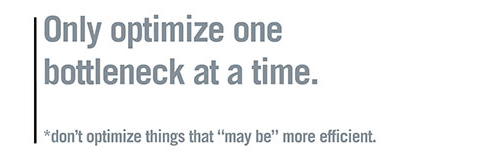

# 성능 최적화{#performance-optimization}

>[!NOTE]
>
>성능에 대한 일반적인 지침은 [성능 지침](/help/sites-deploying/performance-guidelines.md) 페이지를 참조하십시오.
>
>성능 문제 해결 및 수정에 대한 자세한 내용은 [성능 트리](/help/sites-deploying/performance-tree.md)를 참조하십시오.
>
>또한 [성능 조정 팁에 대한 기술 자료 문서를 검토할 수 있습니다.](https://helpx.adobe.com/experience-manager/kb/performance-tuning-tips.html)

주요 문제는 웹 사이트에서 방문자 요청에 응답하는 시간입니다. 이 값은 각 요청에 따라 다르지만 평균 대상 값을 정의할 수 있습니다. 이 값이 달성 가능하고 유지 관리할 수 있는 것으로 확인되면, 웹 사이트의 성능을 모니터링하고 잠재적인 문제의 발생을 나타내는 데 사용할 수 있습니다.

타깃팅할 응답 시간은 대상 대상의 다양한 특성을 반영하여 작성 및 게시 환경에서 달라집니다.

## 작성 환경 {#author-environment}

이 환경은 컨텐츠 입력 및 업데이트에 의해 사용됩니다. 컨텐츠 페이지 및 해당 페이지의 개별 요소를 업데이트할 때 높은 수준의 성능 중심 요청을 생성하는 사용자 수를 대상으로 해야 합니다.

## 게시 환경 {#publish-environment}

이 환경에는 사용자가 사용할 수 있도록 만든 콘텐츠가 포함되어 있습니다. 요청의 수가 훨씬 더 크고 속도도 매우 중요하지만 요청의 특성이 덜 동적이므로 추가적인 성능 향상 메커니즘을 적용할 수 있습니다.컨텐츠 캐싱 또는 로드 밸런싱과 같은 작업을 수행할 수 있습니다.

>[!NOTE]
>
>* 성능 최적화를 구성한 후 [Touch Day](/help/sites-developing/tough-day.md)의 절차에 따라 무거운 부하의 환경을 테스트합니다.
>* [성능 조정 팁](https://helpx.adobe.com/experience-manager/kb/performance-tuning-tips.html)을 참조하십시오.

>


## 성능 최적화 방법론 {#performance-optimization-methodology}

CQ 프로젝트에 대한 성능 최적화 방법론은 처음부터 성능 문제를 방지하기 위해 따를 수 있는 매우 간단한 5가지 규칙으로 요약될 수 있습니다.

1. [최적화 계획](#planning-for-optimization)
1. [현실 시뮬레이션](#simulate-reality)
1. [견고한 목표 설정](#establish-solid-goals)
1. [연관성 유지](#stay-relevant)
1. [민첩한 반복 주기](#agile-iteration-cycles)

이러한 규칙은 전반적인 웹 프로젝트에 적용되며 프로젝트 관리자 및 시스템 관리자와 관련되어 실행 시간이 다가와도 프로젝트의 성능 문제가 발생하지 않도록 합니다.

### 최적화 계획 {#planning-for-optimization}


프로젝트 노력의 약 10%가 성능 최적화 단계에 계획되어야 합니다. 물론 실제 성능 최적화 요구 사항은 프로젝트의 복잡도 수준과 개발팀의 경험에 따라 다릅니다. 프로젝트에 할당된 모든 시간이 필요하지 않지만(궁극적으로) 제안된 영역에서 성능 최적화를 항상 계획하는 것이 좋습니다.

가능할 때마다, 완전한 발표에 따른 추가 부담 없이 실제 경험을 수집하고 추가적인 최적화 작업을 수행하기 위해 프로젝트를 제한된 대상에 먼저 부드럽게 실행해야 합니다.

&quot;라이브&quot;로 전환하더라도 성능 최적화는 끝나지 않습니다. 이 시점은 시스템에서 &quot;실제&quot; 로드를 경험할 때 발생합니다. 출시 후 추가 조정을 계획하는 것이 중요합니다.

시스템 로드가 변경되고 시스템의 성능 프로필이 시간이 지남에 따라 바뀌므로 성능 &quot;조정&quot; 또는 &quot;상태 점검&quot;을 6개월-12개월 간격으로 예약해야 합니다.

### 현실 시뮬레이션 {#simulate-reality}


웹 사이트에서 라이브한 다음 실행 후 성능 문제가 발생하는 경우를 알 수 있는 이유는 단 한 가지뿐입니다.사용자의 부하 및 성능 테스트는 현실을 충분히 시뮬레이션하지 못했습니다.

현실을 시뮬레이션하는 것은 어렵고 &quot;실제&quot;에 투자하려는 합리적이고 많은 노력이 프로젝트의 성격에 따라 달라집니다. &quot;실제&quot;라 함은 &quot;실제 코드&quot;와 &quot;실제 트래픽&quot;뿐만 아니라, 특히 컨텐츠 크기 및 구조와 관련하여 &quot;실제 컨텐츠&quot;를 의미합니다. 저장소의 크기와 구조에 따라 템플릿이 완전히 다를 수 있습니다.

### 실선 목표 설정 {#establish-solid-goals}


성능 목표를 제대로 정립하는 것의 중요성은 과소평가되지 않는다. 흔히 특정 성과에 집중하게 되면 그 뒤의 목표를 바꾸기는 매우 어렵습니다. 심지어 야생적인 가정을 바탕으로 한 것도요.

탄탄한 실적 목표를 세우는 것은 정말로 가장 다루기 힘든 영역 중 하나입니다. 비교 가능한 웹 사이트(예: 새로운 웹 사이트의 이전 웹 사이트)에서 실제 로그와 벤치마크를 수집하는 것이 가장 좋습니다.

### 연관성 유지 {#stay-relevant}



한 번에 하나의 병목 현상을 최적화하는 것이 중요합니다. 한 최적화의 효과를 검증하지 않고 동시에 작업을 수행하려고 하면 실제로 어떤 최적화 측정이 도움이 되었는지 추적할 수 없게 됩니다.

### 민첩한 반복 주기 {#agile-iteration-cycles}


성능 조정은 목표에 도달할 때까지 측정, 분석, 최적화 및 유효성 검사가 필요한 반복적인 프로세스입니다. 이러한 측면을 적절히 고려하려면 각 반복 이후 가중치가 높은 테스트 프로세스가 아니라 최적화 단계에서 민첩한 검증 프로세스를 구현합니다.

따라서 최적화를 구현하는 개발자가 최적화가 이미 목표에 도달했는지 빨리 알 수 있어야 합니다. 이 정보는 중요한 정보로, 목표에 도달하면 최적화는 종료되기 때문입니다.

## 기본 성능 지침 {#basic-performance-guidelines}

일반적으로, 캐시되지 않은 html 요청을 100ms 이하로 유지합니다. 더욱 구체적으로, 다음은 가이드라인이 될 수 있습니다.

* 페이지 요청 중 70%는 100ms 이내에 응답해야 합니다.
* 페이지 요청 중 25%가 100ms-300ms 이내에 응답을 받아야 합니다.
* 페이지 요청의 4%는 300ms-500ms 이내에 응답을 받아야 합니다.
* 페이지 요청 중 1%가 500ms-1000ms 내에 응답을 받아야 합니다.
* 어떤 페이지도 1초보다 느리게 응답해야 합니다.

위의 숫자는 다음 조건을 가정합니다.

* 게시 시 측정(작성 환경과 관련된 오버헤드 없음)
* 서버에서 측정됨(네트워크 오버헤드 없음)
* 캐시되지 않음(CQ 출력 캐시 없음, 발송자 캐시 없음)
* 의존 관계가 많은 복잡한 항목만(HTML, JS, PDF, ...)
* 시스템에 다른 로드 없음

성능 문제에 자주 기여하는 몇 가지 문제가 있습니다. 이러한 기능은 주로 다음과 같이 진행됩니다.

* 발송자 캐싱 비효율
* 일반 표시 템플릿에서 쿼리 사용

JVM 및 OS 레벨 조정은 일반적으로 성능이 크게 향상되는 것은 아니며 따라서 최적화 주기의 마지막 단계에서 수행해야 합니다.

콘텐츠 저장소의 구조화 방식도 성능에 영향을 줄 수 있습니다. 최상의 성능을 위해 콘텐츠 저장소의 개별 노드에 연결된 하위 노드의 수는 1,000개를 초과할 수 없습니다(일반 규칙으로).

평소의 성능 최적화 연습 중 가장 친한 친구는 다음과 같습니다.

* `request.log`
* 구성 요소 기반 타이밍
* 마지막으로 java 프로파일러가 아닙니다.

### 디지털 자산을 로드하고 편집할 때의 성능 {#performance-when-loading-and-editing-digital-assets}

디지털 자산을 로드하고 편집할 때 관련된 많은 양의 데이터로 인해 성능이 문제가 될 수 있습니다.

두 가지 사항이 성능에 영향을 줍니다.

* CPU - 여러 코어를 통해 트랜스코딩 시 더욱 원활해진 작업
* 하드 디스크 - 병렬 RAID 디스크가

성능을 향상시키려면 다음을 고려하십시오.

* 하루에 얼마나 많은 자산을 업로드합니까? 정확한 추정은 다음을 기반으로 할 수 있습니다.


* 편집할 시간(일반적으로 근무일의 길이와 국제 작업에 더 많은 시간)입니다.
* 업로드된 이미지의 평균 크기(및 이미지당 생성된 표현물의 크기)입니다.
* 평균 데이터 전송률 결정:


* 모든 편집의 80%가 20% 후에 완료되므로 최대 시간에 평균 데이터 전송률의 4배가 됩니다. 이것이 여러분의 성과 목표입니다.

## 성능 모니터링 {#performance-monitoring}

성능(또는 성능 부족)은 사용자가 가장 먼저 인식하는 것 중 하나이므로 사용자 인터페이스가 있는 모든 애플리케이션처럼 성능이 중요합니다. CQ 설치 성능을 최적화하려면 인스턴스의 다양한 속성과 동작을 모니터링해야 합니다.

성능 모니터링 수행 방법에 대한 자세한 내용은 [성능 모니터링](/help/sites-deploying/monitoring-and-maintaining.md#monitoring-performance)을 참조하십시오.

성능 문제를 일으키는 문제는 효과를 쉽게 볼 수 있더라도 추적하기가 어려운 경우가 많습니다.

기본 시작점은 시스템이 정상적으로 작동하는 경우 해당 시스템에 대해 잘 알고 있는 것입니다. 환경이 제대로 기능할 때 어떻게 보이고 동작하는지 모르면 성능이 저하될 때 이 문제를 찾기는 어렵다. 즉, 시스템이 원활하게 실행될 때 시스템을 조사하는 데 시간을 소비하고 성능 정보 수집이 진행 중인 작업인지 확인해야 합니다. 이로 인해 성능이 저하될 경우 비교할 수 있는 기반이 됩니다.

다음 다이어그램은 CQ 컨텐츠에 대한 요청이 수행할 수 있는 경로와, 성능에 영향을 줄 수 있는 다른 요소의 수를 보여 줍니다.


성능은 볼륨 및 용량 간의 균형이기도 합니다.

**볼륨** 시스템에서 처리 및 배달되는 출력물의 양입니다.

**용량** 볼륨을 전달하는 시스템의 기능

이 도표는 웹 체인 전체에서 다양한 위치에 나타낼 수 있습니다.


성능에 영향을 주는 몇 가지 기능 영역이 있습니다.

* 캐싱
* 애플리케이션(프로젝트) 코드
* 검색 기능

### 성능 {#basic-rules-regarding-performance}에 대한 기본 규칙

성능을 최적화할 때는 다음 사항을 고려해야 합니다.

* 성능 조정 *은 모든 프로젝트의 일부여야 합니다.*
* 개발 주기 초기에 최적화하지 마십시오.
* 성능은 가장 약한 링크만큼 뛰어납니다.
* 용량 대 볼륨 고려
* 중요한 요소를 먼저 최적화합니다.
* *현실적인* 목표 없이는 최적화하지 마십시오.

>[!NOTE]
>
>성능을 측정하는 데 사용하는 메커니즘은 종종 측정하려는 대상에 영향을 줍니다. 귀하는 항상 이러한 차이를 이해하고 가능한 한 그 효과의 대부분을 제거하도록 노력해야 합니다.특정 브라우저 플러그인에서 가능한 한 모든 것이 비활성화되어 있어야 합니다.

## 성능 구성 {#configuring-for-performance}

CQ(및/또는 기본 CRX)의 특정 측면을 성능을 최적화하기 위해 구성할 수 있습니다. 다음은 가능성과 제안입니다. 변경 전에 해당 기능을 사용할지, 아니면 어떻게 사용할지를 확인해야 합니다.

>[!NOTE]
>
>자세한 내용은 [KB 아티클](https://helpx.adobe.com/experience-manager/kb/performance-tuning-tips.html)을 참조하십시오.

### 검색 인덱싱 {#search-indexing}

AEM 6.0부터 Adobe Experience Manager은 Oak 기반의 저장소 아키텍처를 사용합니다.

업데이트된 색인 정보는 다음 사이트에서 찾을 수 있습니다.

* [쿼리 및 색인 작성 우수 사례](/help/sites-deploying/best-practices-for-queries-and-indexing.md)
* [쿼리 및 인덱싱](/help/sites-deploying/queries-and-indexing.md)

### 동시 워크플로우 처리 {#concurrent-workflow-processing}

동시에 실행되는 워크플로우 프로세스의 수를 제한하여 성능을 향상시킬 수 있습니다. 기본적으로 워크플로우 엔진은 Java VM에 사용할 수 있는 프로세서만큼 동시에 많은 워크플로우를 처리합니다. 워크플로우 단계에 많은 양의 처리 리소스(RAM 또는 CPU)가 필요한 경우 이러한 워크플로우 중 여러 가지를 동시에 실행하면 사용 가능한 서버 리소스에 높은 디맨스가 발생할 수 있습니다.

예를 들어 이미지(또는 일반적으로 DAM 자산)가 업로드되면 워크플로우는 이미지를 DAM으로 자동으로 가져옵니다. 이미지는 고해상도로 종종 처리되므로 수백 MB의 힙을 손쉽게 사용할 수 있습니다. 이러한 이미지를 병렬로 처리하면 메모리 하위 시스템 및 가비지 수집기에 높은 로드가 발생합니다.

워크플로우 엔진은 작업 항목 처리를 처리하고 예약하기 위해 Apache Sling 작업 대기열을 사용합니다. 다음 작업 큐 서비스는 처리 워크플로우 작업을 위해 Apache Sling 작업 큐 구성 서비스 팩터리에서 기본적으로 만들어졌습니다.

* [MOCK] Granite Workflow Queue:DAM 에셋을 처리하는 것과 같은 대부분의 워크플로우 단계는 [Granite Workflow Queue] 서비스를 사용합니다.
* [MOCK] Granite Workflow External Process Job Queue:이 서비스는 외부 시스템에 연결하고 결과를 폴링하는 데 일반적으로 사용되는 특수 외부 워크플로우 단계에 사용됩니다. 예를 들어 InDesign 미디어 추출 프로세스 단계는 외부 프로세스로 구현됩니다. Workflow 엔진은 외부 큐를 사용하여 투표를 처리합니다. ([com.day.cq.workflow.exec.WorkflowExternalProcess](https://helpx.adobe.com/experience-manager/6-5/sites/developing/using/reference-materials/javadoc/com/day/cq/workflow/exec/WorkflowExternalProcess.html)를 참조하십시오.)

동시에 실행되는 워크플로우 프로세스의 최대 수를 제한하도록 이러한 서비스를 구성합니다.

**참고:** 이러한 작업 대기열을 구성하면 특정 워크플로우 모델에 대한 작업 큐를 만들지 않으면 모든 워크플로우에 영향을 줍니다( [아래 특정 워크플로우 모델에 대한 큐 ](/help/sites-deploying/configuring-performance.md#configure-the-queue-for-a-specific-workflow) 구성 참조).

**저장소의 구성**

sling:OsgiConfig 노드](/help/sites-deploying/configuring-osgi.md#adding-a-new-configuration-to-the-repository)를 사용하여 서비스 [를 구성하는 경우 기존 서비스의 PID를 찾아야 합니다. 예:org.apache.sling.event.jobs.QueueConfiguration.370aad73-d01b-4a0b-abe4-20198d85f705. 웹 콘솔을 사용하여 PID를 검색할 수 있습니다.

queue.maxparallel이라는 속성을 구성해야 합니다.

**웹 콘솔의 구성**

웹 콘솔](/help/sites-deploying/configuring-osgi.md#osgi-configuration-with-the-web-console)을 사용하여 이러한 서비스 [를 구성하려면 Apache Sling 작업 큐 구성 서비스 팩토리 아래에서 기존 구성 항목을 찾습니다.

최대 병렬 작업이라는 속성을 구성해야 합니다.

### 특정 작업 과정에 대한 큐 구성 {#configure-the-queue-for-a-specific-workflow}

해당 워크플로우 모델에 대한 작업 처리를 구성할 수 있도록 특정 워크플로우 모델에 대한 작업 큐를 만듭니다. 이러한 방식으로, 구성은 특정 워크플로우의 처리에 영향을 주고, 기본 [화강암 워크플로우 큐]의 구성은 다른 워크플로우의 처리를 제어합니다.

워크플로우 모델이 실행되면 특정 주제에 대한 Sling 작업이 만들어집니다. 기본적으로 이 항목은 일반 [화강암 워크플로우 큐] 또는 [화강암 워크플로우 외부 프로세스 작업 큐]에 대해 구성된 항목과 일치합니다.

* com/adobe/granite/workflow/job&amp;ast;
* com/adobe/granite/workflow/external/job&amp;ast;

워크플로우 모델이 생성하는 실제 작업 항목에는 모델별 접미사가 포함됩니다. 예를 들어, [!UICONTROL DAM 자산 업데이트] 워크플로우 모델은 다음 주제를 가진 작업을 생성합니다.

com/adobe/granite/workflow/job/etc/workflow/models/dam/update_asset/jcr_content/model

따라서 워크플로우 모델의 작업 항목과 일치하는 항목에 대한 작업 큐를 만들 수 있습니다. 대기열의 성능 관련 속성을 구성하는 것은 큐 항목과 일치하는 작업을 생성하는 워크플로우 모델에만 영향을 줍니다.

다음 절차에서는 [!UICONTROL DAM 자산 업데이트] 워크플로우를 예로 사용하여 워크플로우의 작업 큐를 만듭니다.

1. 주제 통계가 생성되도록 작업 대기열을 만들 워크플로우 모델을 실행합니다. 예를 들어 이미지를 자산에 추가하여 [!UICONTROL DAM 자산 업데이트] 워크플로우를 실행합니다.
1. Sling 작업 콘솔을 엽니다. ([http://localhost:4502/system/console/slingevent](http://localhost:4502/system/console/slingevent))
1. 콘솔에서 워크플로우 관련 항목을 알아봅니다. DAM Update Asset의 경우 다음 항목을 찾을 수 있습니다.

   * com/adobe/granite/workflow/external/job/etc/workflow/models/dam/update_asset/jcr_content/model
   * com/adobe/granite/workflow/job/etc/workflow/models/dam/update_asset/jcr_content/model
   * com/adobe/granite/workflow/job/etc/workflow/models/dam-xmp-writeback/jcr_content/model

1. 이러한 각 항목에 대해 하나의 작업 큐를 만듭니다. 작업 큐를 만들려면 Apache Sling 작업 큐 팩토리 서비스에 대한 팩토리 구성을 만듭니다.

   Topics 속성은 워크플로 작업의 항목과 일치한다는 점을 제외하고 팩토리 구성은 [동시 워크플로 처리](/help/sites-deploying/configuring-performance.md#concurrent-workflow-processing)에 설명된 [화강암 워크플로 큐]와 비슷합니다.

### CQ5 DAM 자산 동기화 서비스 {#cq-dam-asset-synchronization-service}

`AssetSynchronizationService`은 마운트된 저장소의 자산을 동기화하는 데 사용됩니다(LiveLink, Documentum 등). 기본적으로 300초(5분)마다 정기적으로 확인되므로 마운트된 저장소를 사용하지 않으면 이 서비스를 비활성화할 수 있습니다.

이 작업은 [OSGi 서비스](/help/sites-deploying/configuring-osgi.md) **CQ DAM 자산 동기화 서비스**&#x200B;를 구성하여 **동기화 기간**( `scheduler.period`)을 1년(초 단위로 정의됨)으로 설정합니다.

### 다중 DAM 인스턴스 {#multiple-dam-instances}

여러 DAM 인스턴스를 배포하면 다음과 같은 경우에 성능을 활용할 수 있습니다.

* 작성 환경에 대한 많은 자산의 정기적인 업로드로 인해 로드가 높습니다.여기에서 별도의 DAM 인스턴스를 작성자를 위한 전용 DAM 인스턴스로 지정할 수 있습니다.
* 전 세계 지역(예: 미국, 유럽, 아시아)에 여러 팀이 있습니다.

추가 고려 사항은 다음과 같습니다.

* 게시 시 작성자의 &quot;진행 중인 작업&quot; 구분
* 게시에서 작성자의 내부 사용자를 외부 방문자/사용자와 구분(예: 대리인, 보도 담당자, 고객, 학생 등)

## 품질 보증 우수 사례 {#best-practices-for-quality-assurance}

게시 환경에 가장 중요한 것은 성능입니다. 따라서 프로젝트를 구현하는 동안 게시 환경에 대해 수행하는 성능 테스트를 신중하게 계획 및 분석해야 합니다.

이 섹션에서는 *publish* 환경에서 성능 테스트를 위한 테스트 개념 정의와 관련된 문제에 대한 표준화된 개요를 제공하기 위해 마련되었습니다. 이는 주로 QA 엔지니어, 프로젝트 관리자 및 시스템 관리자에게 중요합니다.

다음은 *Publish* 환경의 CQ 응용 프로그램에 대한 성능 테스트에 대한 표준화된 접근 방식을 설명합니다. 여기에는 다음 5단계가 포함됩니다.

* [지식 확인](#verification-of-knowledge)
* [범위 정의](#scope-definition)
* [테스트 방법론](#test-methodologies)
* [성과 목표 정의](#defining-the-performance-goals)
* [최적화](#optimization)

제어란 테스트에 한정되지 않고, 모두를 통합시키는 추가 프로세스입니다.

### 지식 확인 {#verification-of-knowledge}

첫 번째 단계는 테스트를 시작하기 전에 알아야 하는 기본 정보를 문서화하는 것입니다.

* 테스트 환경의 아키텍처
* 테스트를 필요로 하는 내부 요소를 자세히 설명하는 응용 프로그램 맵(격리 및 조합)

#### 테스트 아키텍처 {#test-architecture}

성능 테스트에 사용되는 테스트 환경의 아키텍처를 명확하게 문서화해야 합니다.

Dispatcher 및 Load Balancer와 함께 계획된 프로덕션 게시 환경을 복제해야 합니다.

#### 응용 프로그램 맵 {#application-map}

전체 응용 프로그램의 맵을 만들 수 있습니다(작성 환경의 테스트에서 찾을 수 있음).

애플리케이션의 내부 요소를 나타낸 다이어그램으로 테스트 요구 사항에 대한 개요를 알 수 있습니다.또한 색상 코딩을 사용하면 보고 기반으로 활용할 수 있습니다.

### 범위 정의 {#scope-definition}

일반적으로 애플리케이션에는 다양한 사용 사례가 있습니다. 일부는 매우 중요할 것이고 다른 일부는 덜 중요할 것이다.

게시 시 성능 테스트 범위에 초점을 맞추려면 다음을 정의하는 것이 좋습니다.

* 가장 중요한 비즈니스 활용 사례
* 가장 중요한 기술 활용 사례

사용 사례의 수는 귀하에게 달지만 관리하기 쉬운 수(예: 5에서 10개 사이)로 제한되어야 합니다.

주요 사용 사례를 선택하면 KPI(주요 성능 지표)와 이를 측정하는 데 사용되는 도구를 각 케이스에 대해 정의할 수 있습니다. 일반적인 KPI의 예는 다음과 같습니다.

* 엔드 투 엔드 응답 시간
* 서블릿 응답 시간
* 단일 구성 요소에 대한 응답 시간
* 서비스 응답 시간
* 스레드 풀의 유휴 스레드 수
* 무료 연결 수
* CPU 및 I/O 액세스와 같은 시스템 리소스

### 테스트 방법론 {#test-methodologies}

이 개념에는 성능 목표를 정의하고 테스트하는 데 사용되는 4가지 시나리오가 있습니다.

* 단일 구성 요소 테스트
* 구성 요소 테스트 결합
* *Going* Livescenario
* 오류 시나리오

다음 원칙을 기반으로 합니다.

**구성 요소 중단점**

* 각 구성 요소에는 성능과 관련된 특정 중단점이 있습니다. 즉, 특정 지점에 도달할 때까지 구성 요소의 성능이 향상될 수 있으며 그 후 성능이 빠르게 저하됩니다.
* 응용 프로그램의 전체 개요를 얻으려면 먼저 구성 요소를 확인하여 각 중단점에 도달한 시기를 결정해야 합니다.
* 중단점을 찾기 위해 일정 시간 동안 더 많은 사용자 수를 증가시켜 로드를 증가시키는 로드 테스트를 수행할 수 있습니다. 이 로드 및 구성 요소의 응답을 모니터링하면 구성 요소의 중단점에 도달할 때 특정 성능 동작이 발생합니다. 이 포인트는 동시 사용자 수(구성 요소가 이 KPI에 민감한 경우)와 함께 초당 동시 트랜잭션 수로 평가할 수 있습니다.
* 이러한 정보는 개선 사항의 벤치마크 역할을 할 수 있으며, 사용 중인 측정의 효율성을 표시하고 테스트 시나리오를 정의하는 데 도움이 됩니다.

**거래**

* 트랜잭션 용어는 페이지 자체 및 모든 후속 호출을 포함하여 전체 웹 페이지의 요청을 나타내는 데 사용됩니다.페이지 요청, 모든 AJAX 호출, 이미지 및 기타 개체&#x200B;**요청 드릴다운**
* 각 요청을 완전히 분석하려면 호출 스택의 각 요소를 표시한 다음 각 요청에 대한 평균 처리 시간을 합산할 수 있습니다.

### 성과 목표 정의 {#defining-the-performance-goals}

범위 및 관련 KPI가 정의되면 구체적인 성과 목표를 설정할 수 있습니다. 여기에는 대상 값과 함께 테스트 시나리오를 고안하는 작업이 포함됩니다.

평균 및 최대 조건 모두에서 성능을 테스트해야 합니다. 또한 웹 사이트를 처음 사용할 수 있게 되면 웹 사이트에 대한 관심 증가 요구 사항을 충족하기 위해 Go Live 시나리오 테스트가 필요합니다.

기존 웹 사이트에서 수집한 경험 또는 통계도 향후 목표를 결정하는 데 유용할 수 있습니다.예를 들어 라이브 웹 사이트의 상위 트래픽입니다.

#### 단일 구성 요소 테스트 {#single-component-tests}

중요한 구성 요소는 평균 및 최대 조건 모두에서 테스트되어야 합니다.

두 경우 모두 사전 정의된 수의 사용자가 시스템을 사용하는 경우 예상되는 초당 트랜잭션 수를 정의할 수 있습니다.

| 구성 요소 | 테스트 유형 | #사용자 | Tx/초(예상) | Tx/초(테스트됨) | 설명 |
|---|---|---|---|---|---|
| 홈 페이지 단일 사용자 | 평균 | 1 | 3 |  |  |
|  | 최대 | 3 | 3 |  |  |
| 홈 페이지 사용자 100명 | 평균 | 100 | 1 |  |  |
|  | 최대 | 100년 | 1 |  |

#### 결합된 구성 요소 테스트 {#combined-component-tests}

구성 요소를 조합하여 테스트하면 애플리케이션 비헤이비어가 더 잘 반영됩니다. 다시 평균과 최고 조건을 테스트해야 합니다.

| 시나리오 | 구성 요소 | #사용자 | Tx/초(예상) | Tx/초(테스트됨) | 설명 |
|---|---|---|---|---|---|
| 혼합 평균 | 홈 페이지 | 10 | 1 |  |  |
|  | 검색 | 10 | 3 |  |  |
|  | 뉴스 | 10 | 2 |  |  |
|  | 이벤트 | 10 | 1 |  |  |
|  | 활성화 | 10 | 1 |  | 작성자 동작 시뮬레이션 |
| 혼합 피크 | 홈 페이지 | 100년 | 5 |  |  |
|  | 검색 | 50 | 5 |  |  |
|  | 뉴스 | 100년 | 10 |  |  |
|  | 이벤트 | 100년 | 10 |  |  |
|  | 활성화 | 20 | 20년 |  | 작성자 동작 시뮬레이션 |

#### 라이브 테스트 시작 {#going-live-tests}

웹 사이트를 제공한 후 처음 며칠간은 관심 수준이 높아질 것으로 예상할 수 있습니다. 이것은 테스트한 최대 값보다 더 클 수 있습니다. 시스템이 이 상황에 맞게 지원할 수 있도록 진행 중인 라이브 시나리오를 테스트하는 것이 좋습니다.

| 시나리오 | 테스트 유형 | #사용자 | Tx/초(예상) | Tx/초(테스트됨) | 설명 |
|---|---|---|---|---|---|
| 라이브 피크 | 홈 페이지 | 200 | 20년 |  |  |
|  | 검색 | 100년 | 10 |  |  |
|  | 뉴스 | 200년 | 20년 |  |  |
|  | 이벤트 | 200년 | 20년 |  |  |
|  | 활성화 | 20년 | 20년 |  | 작성자 동작 시뮬레이션 |

#### 오류 시나리오 테스트 {#error-scenario-tests}

또한 시스템이 정확하고 적절하게 반응하도록 오류 시나리오를 테스트해야 합니다. 오류 자체를 처리하는 방법뿐만 아니라 성능에 미치는 영향도 있습니다. 예:

* 사용자가 검색 상자에 잘못된 검색어를 입력하려고 하면 발생하는 문제
* 검색어가 너무 일반적이어서 너무 많은 결과를 반환하는 경우

이러한 테스트를 고안할 때, 모든 시나리오가 정기적으로 발생하는 것은 아니라는 것을 기억해야 한다. 그러나 시스템 전체에 미치는 영향은 중요하다.

| 오류 시나리오 | 오류 유형 | #사용자 | Tx/초(예상) | Tx/초(테스트됨) | 설명 |
|---|---|---|---|---|---|
| 검색 구성 요소 오버로드 | 전역 와일드카드 검색(별표) | 10 | 3 |  | &amp;ast;&amp;ast;&amp;ast;검색됩니다. |
|  | 중지 단어 | 20년 | 2 |  | 중지 단어를 검색하는 중입니다. |
|  | 빈 문자열 | 10 | 3 |  | 빈 문자열을 검색하는 중입니다. |
|  | 특수 문자 | 10 | 3 |  | 특수 문자 검색 |

#### 지구력 테스트 {#endurance-tests}

특정 문제는 시스템이 지속적으로 실행된 후에만 발생합니다.그것은 시간 혹은 심지어 날들이어야 합니다. 지구력 시험은 필요한 기간 동안 일정한 평균 부하를 테스트하는 데 사용됩니다. 그런 다음 성능 저하를 분석할 수 있습니다.

| 시나리오 | 테스트 유형 | #사용자 | Tx/초(예상) | Tx/초(테스트됨) | 설명 |
|---|---|---|---|---|---|
| 지구력 테스트(72시간) | 홈 페이지 | 10 | 3 |  |  |
|  | 검색 | 10 | 1 |  |  |
|  | 뉴스 | 20년 | 2 |  |  |
|  | 이벤트 | 10 | 3 |  |  |
|  | 활성화 | 1 | 1 |  | 작성자 동작 시뮬레이션 |

### 최적화 {#optimization}

구현 후 단계에서 성능 목표를 충족하거나 극대화하기 위해 애플리케이션을 최적화해야 합니다.

최적화를 테스트하여 다음을 확인해야 합니다.

* 기능에 영향을 주지 않음
* 릴리스되기 전에 로드 테스트를 통해 확인되었습니다.

로드 생성, 성능 모니터링 및/또는 결과 분석을 지원하는 도구 선택

* [JMeter](https://jakarta.apache.org/jmeter/)
* [Load Runner](https://www.microfocus.com/en-us/products/loadrunner-load-testing/overview)
* [DetermineInsideApps ](https://www.determyne.com/) 
* [InfraRED](https://www.infraredsoftware.com/)
* [Java 대화형 프로필](https://jiprof.sourceforge.net/)
* 더 많음...

최적화 후 효과를 확인하기 위해 다시 테스트해야 합니다.

### 보고 {#reporting}

진행 중인 보고는 모든 사람들이 상황을 알 수 있도록 해야 할 것입니다.앞에서 언급한 색상 코딩 방법과 같이 아키텍처 맵을 여기에 사용할 수 있습니다.

모든 테스트가 완료되면 다음을 보고할 수 있습니다.

* 모든 중요한 오류 발생
* 더 이상의 조사가 필요한 비중대한 문제
* 테스트 중에 발생한 모든 가정
* 테스트에서 발생하는 모든 권장 사항

## Dispatcher {#optimizing-performance-when-using-the-dispatcher} 사용 시 성능 최적화

[Dispatcher](https://helpx.adobe.com/experience-manager/dispatcher/using/dispatcher.html)는 Adobe 캐싱 및/또는 로드 밸런싱 도구입니다. 디스패처를 사용할 때는 캐시 성능을 위해 웹 사이트를 최적화하는 것이 좋습니다.

>[!NOTE]
>
>디스패처 버전은 AEM과 무관하지만 Dispatcher 문서는 AEM 문서에 임베드됩니다. 항상 최신 버전의 AEM용으로 설명서에 포함된 Dispatcher 설명서를 사용하십시오.
>
>이전 버전의 AEM에 대한 설명서에 포함된 Dispatcher 설명서에 대한 링크를 따라간 경우 이 페이지로 리디렉션되었을 수 있습니다.

Dispatcher는 웹 사이트에서 이러한 기능을 활용하는 경우 성능을 최적화하는 데 사용할 수 있는 다양한 기본 제공 메커니즘을 제공합니다. 이 섹션에서는 캐싱의 이점을 극대화하기 위해 웹 사이트를 디자인하는 방법을 설명합니다.

>[!NOTE]
>
>디스패처가 표준 웹 서버에 캐시를 저장한다는 사실을 기억하는 데 도움이 될 수 있습니다. 즉,
>
>* 페이지로 저장할 수 있는 모든 것을 캐싱하고 URL을 사용하여 요청할 수 있습니다.
>* 쿠키, 세션 데이터 및 양식 데이터와 같은 다른 항목은 저장할 수 없습니다.

>
>
일반적으로 많은 캐싱 전략은 좋은 URL을 선택하는 것과 이 추가 데이터에 의존하지 않는 것입니다.
>
>Dispatcher 버전 4.1.11에서는 응답 헤더를 캐싱할 수도 있습니다. [HTTP 응답 헤더 캐싱](https://helpx.adobe.com/experience-manager/dispatcher/using/dispatcher-configuration.html#configuring-the-dispatcher-cache-cache)을 참조하십시오.


### 발송자 캐시 비율 계산 {#calculating-the-dispatcher-cache-ratio}

캐시 비율 공식은 시스템에 들어오는 총 요청 수 중 캐시에서 처리한 요청 비율을 예측합니다. 캐시 비율을 계산하려면 다음이 필요합니다.

* 총 요청 수입니다. 이 정보는 Apache `access.log`에서 사용할 수 있습니다. 자세한 내용은 [공식 Apache 설명서](https://httpd.apache.org/docs/2.4/logs.html#accesslog)를 참조하십시오.

* 게시 인스턴스가 제공된 요청 수입니다. 이 정보는 인스턴스의 `request.log`에서 사용할 수 있습니다. 자세한 내용은 [request.log](/help/sites-deploying/monitoring-and-maintaining.md#interpreting-the-request-log) 및 [로그 파일 찾기](/help/sites-deploying/monitoring-and-maintaining.md#finding-the-log-files)를 참조하십시오.

캐시 비율을 계산하는 공식은 다음과 같습니다.

* (총 요청 수: **빼기** 게시 요청 수) **나누기**&#x200B;을 총 요청 수로 나눈 값입니다.

예를 들어 총 요청 수가 129491이고 게시 인스턴스에서 제공하는 요청 수가 58959이면 캐시 비율은 다음과 같습니다.**(129491 - 58959)/129491= 54.5%**.

1대1 게시자/디스패처 쌍이 없는 경우 정확한 측정을 위해 모든 디스패처 및 게시자의 요청을 함께 추가해야 합니다. [권장 배포](/help/sites-deploying/recommended-deploys.md)도 참조하십시오.

>[!NOTE]
>
>최상의 성능을 위해 Adobe은 90%에서 95%까지의 캐시 비율을 권장합니다.

#### 일관된 페이지 인코딩 사용 {#using-consistent-page-encoding}

Dispatcher 버전 4.1.11에서는 응답 헤더를 캐싱할 수 있습니다. Dispatcher에서 응답 헤더를 캐싱하지 않을 경우 헤더에 페이지 인코딩 정보를 저장하는 경우 문제가 발생할 수 있습니다. 이 경우 Dispatcher가 캐시에서 페이지를 제공하면 웹 서버의 기본 인코딩이 페이지에 사용됩니다. 다음 두 가지 방법으로 이 문제를 해결할 수 있습니다.

* 인코딩을 하나만 사용하는 경우 웹 서버에서 사용되는 인코딩이 AEM 웹 사이트의 기본 인코딩과 동일한지 확인하십시오.
* 다음 예와 같이 HTML `head` 섹션의 `<META>` 태그를 사용하여 인코딩을 설정합니다.

```xml
        <META http-equiv="Content-Type" content="text/html; charset=EUC-JP">
```

#### URL 매개 변수 {#avoid-url-parameters} 방지

가능하면 캐시하려는 페이지의 URL 매개 변수를 피하십시오. 예를 들어 그림 갤러리가 있는 경우 다음 URL은 캐시되지 않습니다(Dispatcher가 [그에 따라 구성된 경우는 제외).](https://helpx.adobe.com/experience-manager/dispatcher/using/dispatcher-configuration.html#configuring-the-dispatcher-cache-cache)

```xml
www.myCompany.com/pictures/gallery.html?event=christmas&amp;page=1
```

그러나 다음과 같이 페이지 URL에 이러한 매개 변수를 배치할 수 있습니다.

```xml
www.myCompany.com/pictures/gallery.christmas.1.html
```

>[!NOTE]
>
>이 URL은 gallery.html과 동일한 페이지와 동일한 템플릿을 호출합니다. 템플릿 정의에서 페이지를 렌더링하는 스크립트를 지정하거나 모든 페이지에 동일한 스크립트를 사용할 수 있습니다.

#### URL {#customize-by-url}로 사용자 지정

사용자가 글꼴 크기(또는 기타 레이아웃 사용자 정의)를 변경할 수 있도록 허용하는 경우 다른 사용자 정의 내용이 URL에 반영되어 있는지 확인하십시오.

예를 들어 쿠키는 캐시되지 않으므로 글꼴 크기를 쿠키(또는 유사한 메커니즘)에 저장하는 경우, 캐시된 페이지에 대해서는 글꼴 크기가 유지되지 않습니다. 결과적으로 Dispatcher는 글꼴 크기의 문서를 임의로 반환합니다.

선택기로 URL에 글꼴 크기를 포함하면 이 문제가 발생하지 않습니다.

```xml
www.myCompany.com/news/main.large.html
```

>[!NOTE]
>
>대부분의 레이아웃 측면에서는 스타일 시트 및/또는 클라이언트측 스크립트를 사용할 수도 있습니다. 이러한 기능은 일반적으로 캐싱 작업에서 잘 작동합니다.
>
>다음과 같은 URL을 사용할 수 있는 인쇄 버전에도 유용합니다.&quot;
>
>`www.myCompany.com/news/main.print.html`
>
>템플릿 정의의 스크립트 글로브를 사용하여 인쇄 페이지를 렌더링하는 별도의 스크립트를 지정할 수 있습니다.

#### 제목 {#invalidating-image-files-used-as-titles}으로 사용된 이미지 파일을 무효화합니다.

페이지 제목 또는 기타 텍스트를 이미지로 렌더링하는 경우 페이지의 컨텐츠 업데이트 시 삭제되도록 파일을 저장하는 것이 좋습니다.

1. 페이지와 동일한 폴더에 이미지 파일을 배치합니다.
1. 이미지 파일에 다음 이름 지정 형식을 사용합니다.

   `<page file name>.<image file name>`

예를 들어 페이지 myPage.html의 제목을 myPage.title.gif 파일에 저장할 수 있습니다. 페이지가 업데이트되면 이 파일은 자동으로 삭제되므로 페이지 제목의 모든 변경 사항이 캐시에 자동으로 반영됩니다.

>[!NOTE]
>
>AEM 인스턴스에 이미지 파일이 반드시 실제로 존재하는 것은 아닙니다. 이미지 파일을 동적으로 만드는 스크립트를 사용할 수 있습니다. 그런 다음 Dispatcher가 웹 서버에 파일을 저장합니다.

#### 탐색에 사용된 이미지 파일 무효화{#invalidating-image-files-used-for-navigation}

탐색 항목에 사진을 사용하는 경우 방법은 기본적으로 제목과 같으며 약간 더 복잡합니다. 모든 내비게이션 이미지를 대상 페이지에 저장합니다. 일반 및 활성 상태를 위해 두 개의 사진을 사용하는 경우 다음 스크립트를 사용할 수 있습니다.

* 페이지를 보통으로 표시하는 스크립트입니다.
* &quot;.normal&quot; 요청을 처리하고 일반 그림을 반환하는 스크립트입니다.
* &quot;.active&quot; 요청을 처리하고 활성화된 사진을 반환하는 스크립트입니다.

콘텐츠에서 페이지 뿐만 아니라 이 그림들을 삭제하도록 하려면 페이지와 동일한 이름 지정 아이디로 이 그림을 만들어야 합니다.

수정되지 않은 페이지의 경우 페이지 자체가 일반적으로 자동으로 무효화되더라도 이미지는 여전히 캐시에 남아 있습니다.

#### 개인화 {#personalization}

Dispatcher는 개인화된 데이터를 캐시할 수 없으므로 개인화를 필요한 위치로 제한하는 것이 좋습니다. 이유를 설명하기 위해:

* 자유롭게 사용자 정의 가능한 시작 페이지를 사용하는 경우 사용자가 페이지를 요청할 때마다 해당 페이지를 구성해야 합니다.
* 반면, 10개의 서로 다른 시작 페이지를 선택할 수 있는 경우 각 시작 페이지를 캐시하여 성능을 향상시킬 수 있습니다.

>[!NOTE]
>
>제목 표시줄에 사용자 이름을 넣는 등 각 페이지를 개인화하면 캐시할 수 없으므로 성능에 큰 영향을 줄 수 있습니다.
>
>그러나 이 작업을 수행해야 하는 경우 다음을 수행할 수 있습니다.
>
>* iFrame을 사용하여 페이지를 모든 사용자에 대해 동일한 한 부분으로 분할하고 사용자의 모든 페이지에 대해 동일한 한 부분으로 분할할 수 있습니다. 그런 다음 두 부품을 캐싱할 수 있습니다.
>* 클라이언트측 JavaScript를 사용하여 개인화된 정보를 표시할 수 있습니다. 그러나 사용자가 JavaScript를 끄는 경우 페이지가 여전히 올바로 표시되는지 확인해야 합니다.

>


#### 고정 연결 {#sticky-connections}

[고정 ](https://helpx.adobe.com/experience-manager/dispatcher/using/dispatcher.html#the-benefits-of-load-balancing) 연결한 사용자에 대한 문서가 모두 동일한 서버에서 작성되는지 확인합니다. 사용자가 이 폴더를 나갔다가 나중에 다시 돌아오면 연결이 계속 유지됩니다. 웹 사이트에 대해 고정 연결이 필요한 모든 문서를 보관할 하나의 폴더를 정의합니다. 다른 문서를 포함하지 마십시오. 이는 개인화된 페이지 및 세션 데이터를 사용하는 경우 로드 밸런싱에 영향을 줍니다.

#### MIME 형식 {#mime-types}

브라우저에서 파일 유형을 결정하는 방법에는 두 가지가 있습니다.

1. 확장자(예:.html, .gif, .jpg 등)
1. 서버가 파일과 함께 보내는 MIME 형식을 기준으로 합니다.

대부분의 파일의 경우 MIME 형식은 파일 확장명에 함축되어 있습니다. i.e.:

1. 확장자(예:.html, .gif, .jpg 등)
1. 서버가 파일과 함께 보내는 MIME 형식을 기준으로 합니다.

파일 이름에 확장자가 없으면 일반 텍스트로 표시됩니다.

Dispatcher 버전 4.1.11에서는 응답 헤더를 캐싱할 수 있습니다. Dispatcher에서 응답 헤더를 캐시하지 않는 경우 MIME 유형이 HTTP 헤더의 일부임을 인식하십시오. 따라서 AEM 응용 프로그램에서 인식할 수 없는 파일 종료 대신 MIME 형식을 사용하는 파일을 반환하는 경우 이러한 파일이 잘못 표시될 수 있습니다.

파일이 제대로 캐시되는지 확인하려면 다음 지침을 따르십시오.

* 파일의 확장자가 항상 올바른지 확인하십시오.
* download.jsp?file=2214와 같은 URL이 있는 일반 파일 서버 스크립트를 사용하지 마십시오. 파일 사양을 포함하는 URL을 사용하도록 스크립트를 다시 작성하십시오.이전 예제의 경우 download.2214.pdf가 됩니다.

## 백업 성능 {#backup-performance}

이 섹션에서는 CQ 백업 성능 및 백업 활동이 애플리케이션 성능에 미치는 영향을 평가하는 데 사용되는 일련의 벤치마크를 제공합니다. CQ 백업은 실행하는 동안 시스템에 상당한 로드를 표시하며, 이를 측정하고 이러한 효과를 수정하려고 하는 백업 지연 설정의 영향도 측정합니다. 목표는 실제 구성과 운영 데이터의 수량으로 예상되는 백업 성능에 대한 일부 참조 데이터를 제공하고 계획된 시스템의 백업 시간을 예측하는 방법을 제공하는 것입니다.

### 참조 환경 {#reference-environment}

#### 물리적 시스템 {#physical-system}

이 문서에서 보고된 결과는 다음과 같은 구성을 가진 참조 환경에서 실행되는 벤치마크로부터 얻어진 것입니다. 이 구성은 데이터 센터의 일반적인 제작 환경과 유사하도록 설계되었습니다.

* H-P ProLiant DL380 G6, 8개의 CPU x 2.533GHz
* 직렬 연결 SCSI 300GB 10,000RPM 드라이브
* 하드웨어 RAID 컨트롤러;RAID0+5 어레이의 드라이브 8개
* VMware 이미지 CPU x 2 Intel Xeon E5540 @ 2.53GHz
* RedHat Linux 2.6.18-194.el5;Java 1.6.0_29
* CQ 5.5 GM을 실행하는 단일 작성자 인스턴스.

이 서버의 디스크 하위 시스템은 매우 빠르고 프로덕션 서버에서 사용할 수 있는 고성능 RAID 구성을 나타냅니다. 백업 성능은 디스크 성능에 영향을 줄 수 있으며 이 환경의 결과는 매우 빠른 RAID 구성에 대한 성능을 반영합니다. VMWare 이미지는 RAID 어레이에 물리적으로 로컬 디스크 스토리지에 있는 단일 대용량 디스크 볼륨을 갖도록 구성되어 있습니다.

CQ 구성은 모든 운영 체제 및 CQ 소프트웨어와 함께 동일한 논리 볼륨에 저장소 및 데이터 저장소를 배치합니다. 백업의 대상 디렉토리는 이 논리 파일 시스템에도 있습니다.

#### 데이터 볼륨 {#data-volumes}

다음 표는 백업 벤치마크에 사용되는 데이터 볼륨의 크기를 보여줍니다. 초기 기준 컨텐츠가 먼저 설치된 다음, 백업된 컨텐츠의 크기를 늘리기 위해 알려진 추가 데이터가 추가됩니다. 컨텐츠의 큰 증가 및 하루에 생성할 수 있는 사항을 나타내기 위해 특정 증분으로 백업을 만듭니다. 실제 제작 에셋 구성을 기반으로 컨텐츠(페이지, 이미지, 태그)의 배포가 대략 이루어집니다. 페이지, 이미지 및 태그는 최대 800개의 하위 페이지로 제한됩니다. 각 페이지에는 제목, Flash, 텍스트/이미지, 비디오, 슬라이드쇼, 양식, 표, 클라우드 및 회전판 구성 요소가 포함됩니다. 이미지는 37kB에서 594kB까지 400개의 고유한 파일 풀에서 업로드됩니다.

<table>
 <tbody>
  <tr>
   <td><strong>컨텐트</strong></td>
   <td><strong>노드</strong></td>
   <td><strong>페이지</strong></td>
   <td><strong>이미지</strong></td>
   <td><strong>태그</strong></td>
  </tr>
  <tr>
   <td>기본 설치</td>
   <td>69,610</td>
   <td>562년</td>
   <td>256년</td>
   <td>237년</td>
  </tr>
  <tr>
   <td>증분 백업을 위한 작은 컨텐츠</td>
   <td><br type="_moz" /> </td>
   <td>+100</td>
   <td>+2</td>
   <td>+2</td>
  </tr>
  <tr>
   <td>전체 백업을 위한 대용량 컨텐츠</td>
   <td><br type="_moz" /> </td>
   <td>+10,000</td>
   <td>+100</td>
   <td>+100</td>
  </tr>
 </tbody>
</table>

백업 벤치마크는 각 반복에 추가 컨텐츠 세트를 추가하여 반복됩니다.

#### 벤치마크 시나리오 {#benchmark-scenarios}

백업 벤치마크에는 두 가지 주요 시나리오가 포함되어 있습니다.시스템이 상당한 애플리케이션 로드일 때 백업하고 시스템이 유휴 상태일 때 백업을 수행합니다. 일반적으로 CQ 시스템이 가능한 유휴 상태일 때 백업을 수행해야 하지만 시스템이 로드될 때 백업을 실행해야 하는 경우가 있습니다.

**유휴** 상태 백업은 CQ에서 다른 작업을 수행하지 않고 수행됩니다.

**LoadBackups** 는 시스템이 온라인 프로세스에서 80% 로드되는 동안 수행됩니다. 백업 지연은 로드 영향을 보기 위해 다양하게 조정되었습니다.

결과 백업의 백업 시간 및 크기는 CQ 서버 로그에서 가져옵니다. 일반적으로 CQ가 유휴 상태일 때(예: 밤중일 경우)로 백업을 예약하는 것이 좋습니다. 이 시나리오는 권장 접근 방식을 나타냅니다.

Load는 페이지 작성/삭제, 순회 및 페이지 순서와 쿼리에서 나오는 대부분의 로드를 갖는 쿼리로 구성됩니다. 너무 많은 페이지를 추가 및 제거하면 작업 영역 크기가 지속적으로 증가하고 백업 작업이 완료되지 않습니다. 스크립트에 사용되는 로드 분배는 75% 페이지 순회, 24% 쿼리 및 1% 페이지 작성입니다(중첩된 하위 페이지가 없는 단일 수준). 유휴 시스템의 초당 최대 평균 트랜잭션은 4개의 동시 스레드로 달성되며, 이는 백업 작업이 로드되는 동안 테스트할 때 사용됩니다.

백업 성능에 대한 로드 영향은 이 애플리케이션 로드와 없는 성능 간의 차이로 예측할 수 있습니다. Impact of the backup on application throughput is found by comparing the scenario throughput in transactions per hour with and without a concurrent backup continued, and with a backups operating with different &quot;backup delay&quot; settings.

**지연** 설정여러 시나리오의 경우 10ms(기본값), 1ms 및 0ms 값을 사용하여 백업 지연 설정을 변경하여 이 설정이 백업 성능에 어떤 영향을 주는지 살펴봅니다.

**백업** 유형모든 백업은 zip을 작성하지 않고 백업 디렉토리에 만들어진 저장소의 외부 백업이었습니다. 단, tar 명령을 직접 사용한 경우를 비교할 경우에는 한 번 예외입니다. zip 파일에 증분 백업을 만들 수 없거나 이전 전체 백업이 zip 파일인 경우 백업 디렉토리 방법이 프로덕션 환경에서 가장 자주 사용됩니다.

### 결과 요약 {#summary-of-results}

#### 백업 시간 및 오류 {#backup-time-and-troughput}

이러한 벤치마크에서는 백업 시간이 백업 유형과 전체 데이터 수량의 기능으로서 어떻게 달라지는지 보여줍니다. 다음 차트는 전체 페이지 수의 함수로 기본 백업 구성을 사용하여 얻은 백업 시간을 보여줍니다.


유휴 인스턴스의 백업 시간은 전체 또는 증분 백업에 관계없이 평균 0.608MB/s로 비교적 일관됩니다(아래 차트 참조). 백업 시간은 단순히 백업되는 데이터의 양입니다. 전체 백업을 완료하는 데 걸리는 시간은 총 페이지 수로 인해 확실히 늘어납니다. 증분 백업을 완료하는 시간도 총 페이지 수로 증가하지만 훨씬 낮은 비율로 증가합니다. 백업 중인 데이터가 상대적으로 적기 때문에 증분 백업을 완료하는 데 걸리는 시간이 훨씬 더 짧습니다.

생성된 백업의 크기는 백업을 완료하는 데 걸리는 시간을 결정하는 주요 요소입니다. 다음 차트는 최종 백업 크기의 기능으로 수행된 시간을 보여줍니다.


이 차트에서는 증분 및 전체 백업 모두 단순한 크기와 시간 패턴을 따르며 처리량으로 측정할 수 있음을 보여줍니다. 유휴 인스턴스의 백업 시간은 벤치마크 환경의 전체 또는 증분 백업에 관계없이 상당히 일관적이며 평균 0.61MB/초 정도 입니다.

#### 백업 지연 {#backup-delay}

백업 지연 매개 변수가 제공되어 백업이 프로덕션 작업 로드를 방해할 수 있는 범위를 제한합니다. 이 매개 변수는 대기시간(밀리초)을 지정합니다. 이 대기 시간은 파일별로 백업 작업에 삽입됩니다. 전체 효과는 영향을 받는 파일의 일부에 따라 달라집니다. 백업 성능 측정(MB/초)을 통해 백업에 대한 지연 효과를 비교할 수 있습니다.

* 정규 애플리케이션 로드와 동시에 백업을 실행하면 일반 로드의 처리량에 부정적인 영향이 발생합니다.
* The impact might be slight — as little as 5% — or be very signed — cause as much as 75% drop in throughput, 그리고 이것은 무엇보다도 애플리케이션에 달려 있습니다.
* 백업은 CPU에서 부하가 많지 않으므로 CPU가 많은 운영 워크로드는 I/O가 많은 작업보다 백업에 의해 영향을 덜 받습니다.


비교를 위해 파일 시스템 백업(&#39;tar&#39; 사용)을 사용하여 얻은 처리량을 비교하여 동일한 저장소 파일을 백업합니다. tar의 성능은 비교할 수 있지만 지연 값이 0으로 설정된 백업보다 약간 높습니다. Setting even a small delay worldwide reduces the backup throughput and the default delay of 10ms results in much reduced throughput. 전체 애플리케이션 사용량이 매우 낮거나 애플리케이션이 완전히 유휴 상태일 때 백업을 예약할 수 있는 경우 백업을 보다 신속하게 진행하기 위해 기본값 아래의 지연을 줄이는 것이 좋습니다.

지속적인 백업의 애플리케이션 처리량이 미치는 실질적인 영향은 애플리케이션 및 인프라 세부 정보에 따라 달라집니다. 지연 값 선택은 애플리케이션에 대한 경험적 분석을 통해 이루어져야 하지만 가능한 한 적게 선택하여 백업을 가능한 한 빨리 완료할 수 있어야 합니다. 지연 값 선택과 애플리케이션 처리량에 미치는 영향 간에는 상관관계가 약하기 때문에 지연을 선택하는 것이 전체 백업 시간을 줄이는 데 유리하므로 백업의 전반적인 영향을 최소화해야 합니다. 완료하는 데 8시간이 걸리지만 처리량이 -20%에 영향을 미치는 백업은 완료하는 데 2시간이 걸리지만 처리량이 -30%까지 영향을 주는 1보다 전반적인 영향을 더 많이 받을 수 있습니다.

### 참조 {#references}

* [관리 - 백업 및 복원](/help/sites-administering/backup-and-restore.md)
* [관리 - 용량 및 볼륨](/help/managing/best-practices-further-reference.md#capacity-and-volume)

