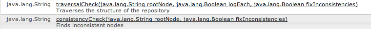

# 일관성 및 순회 검사{#consistency-and-traversal-checks}

업그레이드 시 작업 영역 불일치로 인한 문제가 발생할 수 있습니다. 테스트 업그레이드를 실행하여 문제가 있는지 확인하거나 예방 조치로 일관성 검사를 실행할 수 있습니다.

작업 공간 불일치로 인해 실패하는 테스트 업그레이드를 실행하면 crx-quickstart/logs/crx/error.log에 다음과 유사한 항목이 표시됩니다.

```xml
*ERROR* TarPersistenceManager: No bundle found for uuid 'deadbeef-cafe-babe-cafe-babecafebabe'
 ...
*ERROR* RepositoryImpl: Failed to initialize workspace 'crx.default'
javax.jcr.RepositoryException: Error indexing workspace: Error indexing workspace: Error indexing workspace
...
```

## 일관성 검사 수행 {#perform-a-consistency-check}

일관성 검사를 수행하려면 JMX Mbean에 대한 관리 페이지로 이동합니다 **com.adobe.granite(저장소)**. AEM 기본 화면에서 다음 위치로 이동합니다.

**도구 > 웹 콘솔 > 메인(메뉴 모음) > JMX > com.adobe.granite(저장소)**

기본 설치에서는 다음 위치에 있습니다.  **[|표시|](http://localhost:4502/system/console/jmx/com.adobe.granite%3Atype%3DRepository)**

다음에서 **작업** 페이지의 섹션에서 두 가지 메서드를 찾을 수 있습니다. **`traversalCheck`** 및 **`consistencyCheck`**. 검사를 실행하려면 작업을 클릭하고 원하는 매개 변수를 입력합니다.


