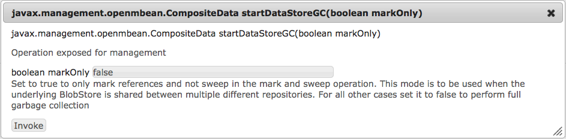

# AEM 6에서 노드 저장소 및 데이터 저장소 구성{#configuring-node-stores-and-data-stores-in-aem}

## 소개 {#introduction}

Adobe Experience Manager(AEM)에서 바이너리 데이터는 컨텐츠 노드와 독립적으로 저장될 수 있습니다. 바이너리 데이터는 데이터 저장소에 저장되는 반면, 콘텐츠 노드는 노드 저장소에 저장됩니다.

데이터 저장소와 노드 저장소는 모두 OSGi 구성을 사용하여 구성할 수 있습니다. 각 OSGi 구성은 영구 식별자(PID)를 사용하여 참조됩니다.

## 구성 단계 {#configuration-steps}

노드 저장소와 데이터 저장소를 모두 구성하려면 다음 단계를 수행합니다.

1. AEM quickstart JAR 파일을 해당 설치 디렉토리에 복사합니다.
1. 설치 디렉터리에 `crx-quickstart/install` 폴더를 만듭니다.
1. 먼저 `crx-quickstart/install` 디렉터리에 사용할 노드 저장소 옵션 이름으로 구성 파일을 만들어 노드 저장소를 구성합니다.

   예를 들어 AEM의 MongoMK 구현의 기반이 되는 문서 노드 저장소는 `org.apache.jackrabbit.oak.plugins.document.DocumentNodeStoreService.config` 파일을 사용합니다.

1. 파일을 편집하고 구성 옵션을 설정합니다.
1. 사용하려는 데이터 저장소의 PID로 구성 파일을 만듭니다. 파일을 편집하여 구성 옵션을 설정합니다.

   >[!NOTE]
   >
   >구성 옵션은 [노드 저장소 구성](#node-store-configurations) 및 [데이터 저장소 구성](#data-store-configurations)을 참조하십시오.

1. AEM을 시작합니다.

## 노드 저장소 구성 {#node-store-configurations}

>[!CAUTION]
>
>최신 버전의 Oak에서는 OSGi 구성 파일에 대해 새로운 이름 지정 체계 및 형식을 사용합니다. 새 이름 지정 구성표를 사용하려면 구성 파일 이름이 **.config**&#x200B;이고 새 형식을 사용하려면 값을 입력해야 하며 이 형식은 [여기에 설명되어 있습니다](https://sling.apache.org/documentation/development/slingstart.html#default-configuration-format).
>
>이전 버전의 Oak에서 업그레이드하는 경우 먼저 `crx-quickstart/install`폴더를 백업해야 합니다. 업그레이드 후 폴더의 내용을 업그레이드된 설치로 복원하고 구성 파일의 확장자를 **.cfg**&#x200B;에서 **.config**(으)로 수정합니다.
>
>**AEM 5.x** 설치에서 업그레이드를 준비하기 위해 이 문서를 읽고 있는 경우 먼저 [업그레이드](https://experienceleague.adobe.com/docs/) 설명서를 참조하십시오.

### 세그먼트 노드 저장소 {#segment-node-store}

세그먼트 노드 저장소는 AEM6에서 Adobe의 TarMK 구현의 기반입니다. 구성에 `org.apache.jackrabbit.oak.segment.SegmentNodeStoreService` PID를 사용합니다.

>[!CAUTION]
>
>세그먼트 노드 저장소의 PID가 AEM 6.3에서 AEM 6의 `org.apache.jackrabbit.oak.plugins.segment.SegmentNodeStoreService in previous versions`에서 `org.apache.jackrabbit.oak.segment.SegmentNodeStoreService`(으)로 변경되었습니다. 이 변경 사항을 반영하도록 필요한 구성을 조정해야 합니다.

다음 옵션을 구성할 수 있습니다.

* `repository.home`: 저장소 관련 데이터가 저장되는 저장소 홈의 경로입니다. 기본적으로 세그먼트 파일은 `crx-quickstart/segmentstore` 디렉터리에 저장됩니다.

* `tarmk.size`: 세그먼트의 최대 크기(MB)입니다. 기본 최대값은 256MB입니다.
* `customBlobStore`: 사용자 지정 데이터 저장소가 사용됨을 나타내는 부울 값입니다. AEM 6.3 이상 버전의 기본값은 true입니다. AEM 6.3 이전에는 기본값이 false였습니다.

다음은 샘플 `org.apache.jackrabbit.oak.segment.SegmentNodeStoreService.config` 파일입니다.

```shell
#Path to repo
repository.home="crx-quickstart/repository"

#Max segment size
tarmk.size=I"256"

#Custom data store
customBlobStore=B"true"
```

#### 문서 노드 저장소 {#document-node-store}

문서 노드 저장소는 AEM의 MongoMK 구현의 기초입니다. `org.apache.jackrabbit.oak.plugins.document.DocumentNodeStoreService`* *PID를 사용합니다. 다음 구성 옵션을 사용할 수 있습니다.

* `mongouri`: Mongo 데이터베이스에 연결하는 데 필요한 [MongoURI](https://docs.mongodb.org/manual/reference/connection-string/)입니다. 기본값은 `mongodb://localhost:27017`입니다.

* `db`: Mongo 데이터베이스의 이름입니다. 기본값은 기본 데이터베이스 이름으로 **Oak** ``. However, new AEM 6 installations use **aem-author** ``입니다.

* `cache`: 캐시 크기(MB)입니다. 이는 DocumentNodeStore에서 사용되는 다양한 캐시에 분산됩니다. 기본값은 `256`입니다.

* `changesSize`: 비교 출력을 캐시하기 위해 Mongo에서 사용되는 제한 컬렉션 크기(MB)입니다. 기본값은 `256`입니다.

* `customBlobStore`: 사용자 지정 데이터 저장소가 사용됨을 나타내는 부울 값입니다. 기본값은 `false`입니다.

다음은 샘플 `org.apache.jackrabbit.oak.plugins.document.DocumentNodeStoreService.config` 파일입니다.

```shell
#Mongo server details
mongouri="mongodb://localhost:27017"

#Name of Mongo database to use
db="aem-author"

#Store binaries in custom BlobStore
customBlobStore=B"false"
```

## 데이터 저장소 구성 {#data-store-configurations}

많은 수의 바이너리를 처리할 때는 기본 노드 저장소 대신 외부 데이터 저장소를 사용하여 성능을 극대화하는 것이 좋습니다.

예를 들어 프로젝트에 많은 미디어 에셋이 필요한 경우 파일 또는 S3 데이터 저장소 아래에 저장하면 MongoDB 내에 직접 저장하는 것보다 빠르게 액세스할 수 있습니다.

파일 데이터 저장소는 MongoDB보다 나은 성능을 제공하며, Mongo 백업 및 복원 작업도 자산 수가 많아 속도가 느립니다.

다양한 데이터 저장소 및 구성에 대한 자세한 내용은 아래에 설명되어 있습니다.

>[!NOTE]
>
>사용자 지정 데이터 저장소를 사용하려면 각 노드 저장소 구성 파일([세그먼트 노드 저장소](/help/sites-deploying/data-store-config.md#segment-node-store) 또는 [문서 노드 저장소](/help/sites-deploying/data-store-config.md#document-node-store))에서 `customBlobStore`이(가) `true`(으)로 설정되어 있는지 확인해야 합니다.

### 파일 데이터 저장소 {#file-data-store}

Jackrabbit 2에 있는 [FileDataStore](https://jackrabbit.apache.org/api/trunk/org/apache/jackrabbit/core/data/FileDataStore.html)의 구현입니다. 이진 데이터를 파일 시스템에 일반 파일로 저장하는 방법을 제공합니다. `org.apache.jackrabbit.oak.plugins.blob.datastore.FileDataStore` PID를 사용합니다.

다음 구성 옵션을 사용할 수 있습니다.

* `repository.home`: 다양한 저장소 관련 데이터가 저장되는 저장소 홈의 경로입니다. 기본적으로 이진 파일은 `crx-quickstart/repository/datastore` 디렉터리에 저장됩니다.

* `path`: 파일을 저장할 디렉터리의 경로입니다. 지정하면 `repository.home` 값보다 우선합니다.

* `minRecordLength`: 데이터 저장소에 저장된 파일의 최소 크기(바이트)입니다. 이 값보다 작은 이진 컨텐츠는 인라인됩니다.

>[!NOTE]
>
>NAS를 사용하여 공유 파일 데이터 저장소를 저장할 때 성능 문제를 방지하기 위해 성능이 좋은 장치만 사용해야 합니다.

## Amazon S3 데이터 저장소 {#amazon-s-data-store}

AEM은 Amazon의 Simple Storage Service(S3)에 데이터를 저장하도록 구성할 수 있습니다. 구성에 `org.apache.jackrabbit.oak.plugins.blob.datastore.S3DataStore.config` PID를 사용합니다.

>[!NOTE]
>
>AEM 6.5는 Amazon의 S3에 데이터 저장을 지원하지만, 이러한 지원은 공급업체가 Amazon의 S3 API를 자체적으로 구현할 수 있는 다른 플랫폼에 데이터를 저장하는 것으로는 확장되지 않습니다.

S3 데이터 저장소 기능을 활성화하려면 S3 데이터 저장소 커넥터가 포함된 기능 팩을 다운로드하여 설치해야 합니다. [Adobe 저장소](https://repo1.maven.org/maven2/com/adobe/granite/com.adobe.granite.oak.s3connector/)(으)로 이동하여 기능 팩의 1.10.x 버전(예: com.adobe.granite.oak.s3connector-1.10.0.zip)에서 최신 버전을 다운로드합니다. 또한 [AEM 6.5 릴리스 노트](/help/release-notes/release-notes.md) 페이지에 나열된 최신 AEM 서비스 팩을 다운로드하여 설치해야 합니다.

>[!NOTE]
>
>TarMK와 함께 AEM을 사용하는 경우 기본적으로 바이너리는 `FileDataStore`에 저장됩니다. TarMK를 S3 데이터 저장소와 함께 사용하려면 `crx3tar-nofds` 실행 모드를 사용하여 AEM을 시작해야 합니다. 예를 들면 다음과 같습니다.

```shell
java -jar <aem-jar-file>.jar -r crx3tar-nofds
```

다운로드하고 나면 다음과 같이 S3 Connector를 설치하고 구성할 수 있습니다.

1. 기능 팩 zip 파일의 컨텐츠를 임시 폴더에 추출합니다.

1. 임시 폴더로 이동하여 다음 위치로 이동합니다.

   ```xml
   jcr_root/libs/system/install
   ```

   위의 위치에서 `<aem-install>/crx-quickstart/install.`(으)로 모든 콘텐츠 복사

1. AEM이 이미 Tar 또는 MongoDB 스토리지에서 작동하도록 구성된 경우 계속하기 전에 ***&lt;aem-install>***/*crx-quickstart*/*install* 폴더에서 기존 구성 파일을 제거하십시오. 제거해야 하는 파일은 다음과 같습니다.

   * `For MongoMK: org.apache.jackrabbit.oak.plugins.document.DocumentNodeStoreService.config`
   * `For TarMK: org.apache.jackrabbit.oak.segment.SegmentNodeStoreService.config`

1. 기능 팩이 추출된 임시 위치로 돌아가서 다음 폴더의 내용을 복사합니다.

   * `jcr_root/libs/system/config`

   대상

   * `<aem-install>/crx-quickstart/install`

   현재 구성에 필요한 구성 파일만 복사해야 합니다. 전용 데이터 저장소와 공유 데이터 저장소 설치 모두에 대해 `org.apache.jackrabbit.oak.plugins.blob.datastore.S3DataStore.config` 파일을 복사합니다.

   >[!NOTE]
   >
   >클러스터 설정에서 클러스터의 모든 노드에 대해 위의 단계를 하나씩 수행합니다. 또한 모든 노드에 대해 동일한 S3 설정을 사용해야 합니다.

1. 파일을 편집하고 설정에 필요한 구성 옵션을 추가합니다.
1. AEM을 시작합니다.

## 1.10.x S3 Connector 새 버전으로 업그레이드 {#upgrading-to-a-new-version-of-the-s-connector}

새 버전의 1.10.x S3 커넥터(예: 1.10.0에서 1.10.4로)로 업그레이드하려면 다음 단계를 수행합니다.

1. AEM 인스턴스를 중지합니다.

1. AEM 설치 폴더의 `<aem-install>/crx-quickstart/install/15`(으)로 이동하여 해당 내용을 백업합니다.
1. 백업 후 `<aem-install>/crx-quickstart/install/15` 폴더에서 모든 jar 파일을 삭제하여 S3 커넥터의 이전 버전과 해당 종속성을 삭제합니다. 예를 들면 다음과 같습니다.

   * **oak-blob-cloud-1.6.1.jar**
   * **aws-java-sdk-osgi-1.10.76.jar**

   >[!NOTE]
   >
   >위에 표시된 파일 이름은 일러스트레이션 용도로만 사용됩니다.

1. [Adobe 저장소](https://repo1.maven.org/maven2/com/adobe/granite/com.adobe.granite.oak.s3connector/)에서 최신 버전의 1.10.x 기능 팩을 다운로드합니다.
1. 콘텐츠를 별도의 폴더로 압축 해제한 다음 `jcr_root/libs/system/install/15`(으)로 이동합니다.
1. jar 파일을 AEM 설치 폴더의 **&lt;aem-install>**/crx-quickstart/install/15에 복사합니다.
1. AEM을 시작하고 커넥터 기능을 확인합니다.

아래 설명된 옵션과 함께 구성 파일을 사용할 수 있습니다.

<!--
* accessKey: The AWS access key.
* secretKey: The AWS secret access key. **Note:** When the `accessKey` or `secretKey` is not specified then the [IAM role](https://docs.aws.amazon.com/sdk-for-java/v1/developer-guide/java-dg-roles.html) is used for authentication.
* s3Bucket: The bucket name.
* s3Region: The bucket region.
* path: The path of the data store. The default is **&lt;AEM install folder&gt;/repository/datastore**
* minRecordLength: The minimum size of an object that should be stored in the data store. The minimum/default is **16KB.**
* maxCachedBinarySize: Binaries with size less than or equal to this size will be stored in memory cache. The size is in bytes. The default is **17408 **(17 KB).
* cacheSize: The size of the cache. The value is specified in bytes. The default is **64GB**.
* secret: Only to be used if using binaryless replication for shared datastore setup.
* stagingSplitPercentage: The percentage of cache size configured to be used for staging asynchronous uploads. The default value is **10**.
* uploadThreads: The number of uploads threads that are used for asynchronous uploads. The default value is **10**.
* stagingPurgeInterval: The interval in seconds for purging finished uploads from the staging cache. The default value is **300** seconds (5 minutes).
* stagingRetryInterval: The retry interval in seconds for failed uploads. The default value is **600** seconds (10 minutes).
-->

### S3 커넥터 구성 파일 옵션 {#s3-connector-configuration-file-options}

>[!NOTE]
>
>S3 커넥터는 IAM 사용자 인증과 IAM 역할 인증을 모두 지원합니다. IAM 역할 인증을 사용하려면 구성 파일에서 `accessKey` 및 `secretKey` 값을 생략합니다. 그러면 S3 커넥터는 인스턴스에 할당된 [IAM 역할](https://docs.aws.amazon.com/sdk-for-java/v1/developer-guide/java-dg-roles.html)로 기본 설정됩니다.

| 키 | 설명 | 기본값 | 필수 |
| --- | --- | --- | --- |
| accessKey | 버킷에 액세스할 수 있는 IAM 사용자의 액세스 키 ID입니다. | | 예. IAM 역할을 사용하지 않을 때 사용합니다. |
| 비밀 키 | 버킷에 액세스할 수 있는 IAM 사용자의 보안 액세스 키입니다. | | 예. IAM 역할을 사용하지 않을 때 사용합니다. |
| cacheSize | 로컬 캐시의 크기(바이트)입니다. | 64GB | 아니. |
| 연결 시간 제한 | 처음 연결을 설정할 때 시간 초과되기 전까지 대기할 시간(밀리초)을 설정합니다. | 10000 | 아니. |
| maxCachedBinarySize | 크기가 이 값보다 작거나 같은 바이너리(바이트)는 메모리 캐시에 저장됩니다. | 17408(17KB) | 아니. |
| maxConnection | 허용되는 최대 열린 HTTP 연결 수를 설정합니다. | 50 | 아니. |
| maxErrorRetry | 실패한(재시도 가능) 요청의 최대 재시도 횟수를 설정하십시오. | 3 | 아니. |
| minRecordLength | 데이터 저장소에 저장해야 하는 개체의 최소 크기(바이트)입니다. | 16384 | 아니. |
| 경로 | AEM 데이터 저장소의 로컬 경로입니다. | `crx-quickstart/repository/datastore` | 아니. |
| proxyHost | 클라이언트가 연결하는 선택적 프록시 호스트를 설정합니다. | | 아니. |
| proxyPort | 클라이언트가 연결하는 선택적 프록시 포트를 설정합니다. | | 아니. |
| s3Bucket | S3 버킷의 이름입니다. | | 예 |
| s3Endpoint | S3 REST API 엔드포인트. | | 아니. |
| s3Region | 버켓이 있는 지역. 자세한 내용은 이 [페이지](https://docs.aws.amazon.com/general/latest/gr/s3.html)를 참조하세요. | AWS 인스턴스가 실행 중인 지역입니다. | 아니. |
| socketTime | 연결 시간이 초과되어 닫히기 전에 설정된 열려 있는 연결을 통해 데이터를 전송할 때까지 대기할 시간(밀리초)을 설정합니다. | 50000 | 아니. |
| stagingPurgeInterval | 스테이징 캐시에서 완료된 업로드를 지우는 간격(초)입니다. | 300 | 아니. |
| stagingRetryInterval | 실패한 업로드를 다시 시도할 간격(초)입니다. | 600 | 아니. |
| stagingSplitPercentage | 비동기 업로드를 스테이징하는 데 사용할 `cacheSize`의 백분율입니다. | 10 | 아니. |
| uploadThread | 비동기 업로드에 사용되는 업로드 스레드 수입니다. | 10 | 아니. |
| writeThread | S3 전송 관리자를 통한 쓰기에 사용되는 동시 스레드 수입니다. | 10 | 아니. |

<!---
### Bucket region options {#bucket-region-options}

<table>
 <tbody>
  <tr>
   <td>US Standard</td>
   <td><code>us-standard</code></td>
  </tr>
  <tr>
   <td>US West</td>
   <td><code>us-west-2</code></td>
  </tr>
  <tr>
   <td>US West (Northern California)</td>
   <td><code>us-west-1</code></td>
  </tr>
  <tr>
   <td>EU (Ireland)<br /> </td>
   <td><code>EU</code></td>
  </tr>
  <tr>
   <td>Asia Pacific (Singapore)<br /> </td>
   <td><code>ap-southeast-1</code></td>
  </tr>
  <tr>
   <td>Asia Pacific (Sydney)<br /> </td>
   <td><code>ap-southeast-2</code></td>
  </tr>
  <tr>
   <td>Asia Pacific (Tokyo)</td>
   <td><code>ap-northeast-1</code></td>
  </tr>
  <tr>
   <td>South America (Sao Paolo)<br /> </td>
   <td><code>sa-east-1</code></td>
  </tr>
 </tbody>
</table>
-->

### DataStore 캐싱 {#data-store-caching}

>[!NOTE]
>
>`S3DataStore`, `CachingFileDataStore` 및 `AzureDataStore`의 DataStore 구현은 로컬 파일 시스템 캐싱을 지원합니다. `CachingFileDataStore` 구현은 DataStore가 NFS(네트워크 파일 시스템)에 있는 경우 유용합니다.

이전 캐시 구현(Oak 1.6 이전)에서 업그레이드할 때 로컬 파일 시스템 캐시 디렉터리 구조에 차이가 있습니다. 이전 캐시 구조에서는 다운로드한 파일과 업로드한 파일을 모두 캐시 경로 바로 아래에 두었다. 새 구조는 다운로드와 업로드를 분리하여 캐시 경로 아래의 `upload` 및 `download` 두 디렉터리에 저장합니다. 업그레이드 프로세스는 매끄러워야 하며 보류 중인 업로드는 업로드를 예약해야 하며 캐시에 있는 이전에 다운로드한 파일은 초기화 시 캐시에 저장됩니다.

oak-run의 `datastorecacheupgrade` 명령을 사용하여 오프라인에서 캐시를 업그레이드할 수도 있습니다. 명령 실행 방법에 대한 자세한 내용은 oak-run 모듈의 [readme](https://svn.apache.org/repos/asf/jackrabbit/oak/trunk/oak-run/README.md)을(를) 확인하십시오.

캐시에 크기 제한이 있으며 cacheSize 매개 변수를 사용하여 구성할 수 있습니다.

#### 다운로드 {#downloads}

DataStore에서 액세스하기 전에 요청된 파일/blob의 레코드에 대해 로컬 캐시를 확인합니다. 캐시에 파일을 추가하는 동안 캐시가 구성된 한도를 초과하면(`cacheSize` 매개 변수 참조) 일부 파일이 제거되어 공간이 확보됩니다.

#### 비동기 업로드 {#async-upload}

캐시는 데이터 저장소에 대한 비동기 업로드를 지원합니다. 파일은 파일 시스템의 캐시에서 로컬로 준비되고 비동기 작업이 파일 업로드를 시작합니다. 비동기 업로드의 수는 스테이징 캐시의 크기에 의해 제한됩니다. `stagingSplitPercentage` 매개 변수를 사용하여 스테이징 캐시의 크기를 구성했습니다. 이 매개 변수는 스테이징 캐시에 사용할 캐시 크기의 백분율을 정의합니다. 또한 다운로드에 사용할 수 있는 캐시의 비율은 **(100 - `stagingSplitPercentage`) &#42;`cacheSize`**(으)로 계산됩니다.

비동기 업로드는 다중 스레드이며 스레드 수는 `uploadThreads` 매개 변수를 사용하여 구성됩니다.

업로드가 완료되면 파일이 기본 다운로드 캐시로 이동됩니다. 스테이징 캐시 크기가 제한을 초과하면 이전 비동기 업로드가 완료되고 스테이징 캐시에서 공간을 다시 사용할 수 있을 때까지 파일이 DataStore에 동기적으로 업로드됩니다. `stagingPurgeInterval` 매개 변수에 의해 간격이 구성된 정기 작업으로 인해 업로드된 파일이 준비 영역에서 제거됩니다.

실패한 업로드(예: 네트워크 중단으로 인해)는 재시도 큐에 추가되어 정기적으로 재시도합니다. `stagingRetryInterval parameter`을(를) 사용하여 다시 시도 간격을 구성했습니다.

#### Amazon S3를 사용하여 바이너리 없는 복제 구성 {#configuring-binaryless-replication-with-amazon-s}

S3를 사용하여 바이너리 없는 복제를 구성하려면 다음 단계가 필요합니다.

1. 작성자 및 게시 인스턴스를 설치하고 제대로 시작되었는지 확인하십시오.
1. *https://localhost:4502/etc/replication/agents.author/publish.html* 페이지를 열어 복제 에이전트 설정으로 이동합니다.
1. **설정** 섹션에서 **편집** 단추를 누릅니다.
1. **Serialization** 형식 옵션을 **Binary less**(으)로 변경하십시오.

1. 전송 URI에 매개 변수 &quot; `binaryless`= `true`&quot;을(를) 추가합니다. 변경 후 uri는 다음과 유사해야 합니다.

   *https://localhost:4503/bin/receive?sling:authRequestLogin=1&amp;binaryless=true*

1. 변경 사항을 적용하려면 모든 작성자 및 게시 인스턴스를 다시 시작하십시오.

#### S3 및 MongoDB를 사용하여 클러스터 만들기 {#creating-a-cluster-using-s-and-mongodb}

1. 다음 명령을 사용하여 CQ 빠른 시작 압축을 풉니다.

   `java -jar cq-quickstart.jar -unpack`

1. AEM의 압축을 푼 후에 설치 디렉터리 *crx-quickstart*/*install* 내에 폴더를 만듭니다.

1. `crx-quickstart` 폴더 내에 다음 두 파일을 만듭니다.

   * *org.apache.jackrabbit.oak.plugins.document.DocumentNodeStoreService*.*구성*

   * *org.apache.jackrabbit.oak.plugins.blob.datastore.S3DataStore*.*구성*

   파일을 만든 후 필요에 따라 구성 옵션을 추가합니다.

1. 위에 설명된 대로 S3 데이터 저장소에 필요한 두 개의 번들을 설치합니다.
1. MongoDB가 설치되어 있고 `mongod`의 인스턴스가 실행 중인지 확인하십시오.
1. 다음 명령을 사용하여 AEM을 시작합니다.

   `java -Xmx1024m -jar cq-quickstart.jar -r crx3,crx3mongo`

1. 두 번째 AEM 인스턴스에 대해 1~4단계를 반복합니다.
1. 두 번째 AEM 인스턴스를 시작합니다.

#### 공유 데이터 저장소 구성 {#configuring-a-shared-data-store}

1. 먼저 데이터 저장소를 공유하는 데 필요한 각 인스턴스에 데이터 저장소 구성 파일을 만듭니다.

   * `FileDataStore`을(를) 사용하는 경우 `org.apache.jackrabbit.oak.plugins.blob.datastore.FileDataStore.config` 파일을 만들어 `<aem-install>/crx-quickstart/install` 폴더에 배치합니다.

   * S3을 데이터 저장소로 사용하는 경우 위와 같이 `<aem-install>/crx-quickstart/install` 폴더에 이름이 `rg.apache.jackrabbit.oak.plugins.blob.datastore.S3DataStore.config`인 파일을 만듭니다.

1. 동일한 데이터 저장소를 가리키도록 각 인스턴스의 데이터 저장소 구성 파일을 수정합니다. 자세한 내용은 [이 문서](/help/sites-deploying/data-store-config.md#data-store-configurations)를 참조하세요.
1. 인스턴스가 기존 서버에서 복제된 경우 저장소가 오프라인 상태인 동안 최신 oak-run 도구를 사용하여 새 인스턴스의 `clusterId`을(를) 제거해야 합니다. 실행해야 하는 명령은 다음과 같습니다.

   ```xml
   java -jar oak-run.jar resetclusterid < repository path | Mongo URI >
   ```

   >[!NOTE]
   >
   >세그먼트 노드 저장소가 구성된 경우 저장소 경로를 지정해야 합니다. 기본적으로 경로는 `<aem-install-folder>/crx-quickstart/repository/segmentstore.`입니다. 문서 노드 저장소가 구성된 경우 [Mongo 연결 문자열 URI](https://docs.mongodb.org/manual/reference/connection-string/)를 사용할 수 있습니다.

   >[!NOTE]
   >
   >Oak 실행 도구는 다음 위치에서 다운로드할 수 있습니다.
   >
   >
   >[https://mvnrepository.com/artifact/org.apache.jackrabbit/oak-run/](https://mvnrepository.com/artifact/org.apache.jackrabbit/oak-run/)
   >
   >
   >AEM 설치에서 사용하는 Oak 버전에 따라 다른 버전의 도구를 사용해야 합니다. 도구를 사용하기 전에 아래의 버전 요구 사항 목록을 확인하십시오.
   >
   >
   >
   >    * Oak 버전 **1.2.x**&#x200B;의 경우 Oak 실행 **1.2.12 이상을 사용**
   >    * Oak 버전 **위의 버전보다 최신 버전**&#x200B;의 경우 AEM 설치의 Oak 코어와 일치하는 Oak 실행 버전을 사용하십시오.
   >
   >

1. 마지막으로, 구성을 확인합니다. 유효성을 검사하려면 데이터 저장소를 공유하는 각 저장소에서 데이터 저장소에 추가된 고유한 파일을 찾습니다. 파일 형식은 `repository-[UUID]`입니다. 여기서 UUID는 각 개별 저장소의 고유 식별자입니다.

   따라서 적절한 구성에는 데이터 저장소를 공유하는 저장소의 수만큼 고유 파일이 있어야 합니다.

   파일은 데이터 저장소에 따라 다르게 저장됩니다.

   * `FileDataStore`의 경우 데이터 저장소 폴더의 루트 경로 아래에 파일이 만들어집니다.
   * `S3DataStore`의 경우 `META` 폴더 아래에 구성된 S3 버킷에 파일이 만들어집니다.

## Azure 데이터 저장소 {#azure-data-store}

AEM은 Microsoft®의 Azure 스토리지 서비스에 데이터를 저장하도록 구성할 수 있습니다. 구성에 `org.apache.jackrabbit.oak.plugins.blob.datastore.AzureDataStore.config` PID를 사용합니다.

Azure 데이터 저장소 기능을 활성화하려면 Azure 커넥터가 포함된 기능 팩을 다운로드하여 설치해야 합니다. [Adobe 저장소](https://repo1.maven.org/maven2/com/adobe/granite/com.adobe.granite.oak.azureblobconnector/)(으)로 이동하여 기능 팩의 1.6.x 버전(예: com.adobe.granite.oak.azureblobconnector-1.6.3.zip)에서 최신 버전을 다운로드합니다.

>[!NOTE]
>
>TarMK와 함께 AEM을 사용하는 경우 바이너리는 기본적으로 FileDataStore에 저장됩니다. Azure DataStore에서 TarMK를 사용하려면 `crx3tar-nofds` 실행 모드를 사용하여 AEM을 시작해야 합니다. 예:

```shell
java -jar <aem-jar-file>.jar -r crx3tar-nofds
```

다운로드한 후에는 다음과 같이 Azure 커넥터를 설치하고 구성할 수 있습니다.

1. 기능 팩 zip 파일의 컨텐츠를 임시 폴더에 추출합니다.

1. 임시 폴더로 이동하여 `jcr_root/libs/system/install`의 내용을 `<aem-install>crx-quickstart/install` 폴더로 복사합니다.
1. AEM이 이미 Tar 또는 MongoDB 스토리지에서 작동하도록 구성된 경우 계속하기 전에 `/crx-quickstart/install` 폴더에서 기존 구성 파일을 제거하십시오. 제거해야 하는 파일은 다음과 같습니다.

   MongoMK의 경우:

   `org.apache.jackrabbit.oak.plugins.document.DocumentNodeStoreService.config`

   TarMK의 경우:

   `org.apache.jackrabbit.oak.segment.SegmentNodeStoreService.config`

1. 기능 팩이 추출된 임시 위치로 돌아가서 `jcr_root/libs/system/config`의 내용을 `<aem-install>/crx-quickstart/install` 폴더에 복사합니다.
1. 구성 파일을 편집하고 설정에 필요한 구성 옵션을 추가합니다.
1. AEM을 시작합니다.

다음 옵션과 함께 구성 파일을 사용할 수 있습니다.

* azureSas=&quot;&quot;: 커넥터 버전 1.6.3에서 Azure SAS(Shared Access Signature) 지원이 추가되었습니다. **SAS와 저장소 자격 증명이 모두 구성 파일에 있는 경우 SAS에 우선 순위가 있습니다.** SAS에 대한 자세한 내용은 [공식 문서](https://learn.microsoft.com/en-us/azure/storage/common/storage-sas-overview)를 참조하십시오. &#39;=&#39; 문자가 &#39;\=&#39;처럼 이스케이프되는지 확인하십시오.

* azureBlobEndpoint=&quot;&quot;: Azure Blob 끝점입니다. 예: https://&lt;storage-account>.blob.core.windows.net.
* accessKey=&quot;&quot;: 저장소 계정 이름입니다. Microsoft® Azure 인증 자격 증명에 대한 자세한 내용은 [공식 설명서](https://azure.microsoft.com/en-us/documentation/articles/storage-create-storage-account)를 참조하세요.

* secretKey=&quot;&quot;: 저장소 액세스 키입니다. &#39;=&#39; 문자가 &#39;\=&#39;처럼 이스케이프되는지 확인하십시오.
* container=&quot;&quot;: Microsoft® Azure Blob 저장 공간 컨테이너 이름입니다. 컨테이너는 블롭 한 세트의 그룹입니다. 자세한 내용은 [공식 설명서](https://learn.microsoft.com/en-us/rest/api/storageservices/Naming-and-Referencing-Containers--Blobs--and-Metadata?redirectedfrom=MSDN)를 참조하세요.
* maxConnections=&quot;&quot;&quot;: 작업당 동시 요청 수입니다. 기본값은 1입니다.
* maxErrorRetry=&quot;&quot;: 요청당 재시도 횟수입니다. 기본값은 3입니다.
* socketTimeout=&quot;&quot;: 요청에 사용되는 시간 제한 간격(밀리초)입니다. 기본값은 5분입니다.

위의 설정 외에 다음 설정도 구성할 수 있습니다.

* 경로: 데이터 저장소의 경로입니다. 기본값은 `<aem-install>/repository/datastore.`입니다.
* RecordLength: 데이터 저장소에 저장해야 하는 개체의 최소 크기입니다. 기본값은 16KB입니다.
* maxCachedBinarySize: 이 크기보다 작거나 같은 바이너리는 메모리 캐시에 저장됩니다. 크기는 바이트 단위입니다. 기본값은 17408(17KB)입니다.
* cacheSize: 캐시의 크기입니다. 이 값은 바이트 단위로 지정됩니다. 기본값은 64GB입니다.
* secret: 공유 데이터 저장소 설정에 binaryless 복제를 사용하는 경우에만 사용됩니다.
* stagingSplitPercentage: 스테이징 비동기 업로드에 사용하도록 구성된 캐시 크기의 백분율입니다. 기본값은 10입니다.
* uploadThreads: 비동기 업로드에 사용되는 업로드 스레드 수입니다. 기본값은 10입니다.
* stagingPurgeInterval: 준비 캐시에서 완료된 업로드를 제거하는 간격(초)입니다. 기본값은 300초(5분)입니다.
* stagingRetryInterval: 업로드에 실패한 재시도 간격(초)입니다. 기본값은 600초(10분)입니다.

>[!NOTE]
>
>모든 설정은 따옴표 사이에 입력해야 합니다. 예:

```shell
accessKey="ASDASDERFAERAER"
secretKey="28932hfjlkwdo8fufsdfas\=\="
```

## 데이터 저장소 가비지 수집 {#data-store-garbage-collection}

데이터 저장소 가비지 수집 프로세스는 데이터 저장소에서 사용되지 않은 파일을 제거하는 데 사용되므로 프로세스에서 귀중한 디스크 공간을 확보할 수 있습니다.

다음과 같은 방법으로 데이터 저장소 가비지 수집을 실행할 수 있습니다.

1. *https://&lt;serveraddress:port>/system/console/jmx*&#x200B;의 JMX 콘솔로 이동
1. **RepositoryManagement를 검색하는 중입니다.** 저장소 관리자 MBean을 찾으면 이를 클릭하여 사용 가능한 옵션을 표시합니다.
1. 페이지 끝으로 스크롤하여 **startDataStoreGC(부울 markOnly)** 링크를 클릭합니다.
1. 다음 대화 상자에서 `markOnly` 매개 변수에 대해 `false`을(를) 입력한 다음 **호출**&#x200B;을(를) 클릭합니다.

   

   >[!NOTE]
   >
   >`markOnly` 매개 변수는 가비지 수집의 스윕 단계가 실행되는지 여부를 나타냅니다.

## 공유 데이터 저장소에 대한 데이터 저장소 가비지 수집 {#data-store-garbage-collection-for-a-shared-data-store}

>[!NOTE]
>
>클러스터된 또는 공유 데이터 저장소에서 가비지 수집을 수행할 때 설정(Mongo 또는 Segment Tar 사용)에 특정 Blob ID를 삭제할 수 없다는 경고가 로그에 표시될 수 있습니다. 이전 가비지 컬렉션에서 삭제된 Blob ID가 ID 삭제에 대한 정보가 없는 다른 클러스터 또는 공유 노드에서 다시 잘못 참조됩니다. 결과적으로 가비지 수집이 수행되면 마지막 실행에서 이미 삭제된 ID를 삭제하려고 할 때 경고가 기록됩니다. 이 동작은 성능 또는 기능에 영향을 주지 않습니다.

>[!NOTE]
>
>공유 데이터 저장소 설정을 사용 중이고 데이터 저장소 가비지 수집이 비활성화된 경우 Lucene 이진 정리 작업을 실행하면 디스크 공간이 갑자기 늘어날 수 있습니다. 다음을 수행하여 모든 작성자 및 게시 인스턴스에서 BlobTracker를 비활성화하는 것이 좋습니다.
>
>1. AEM 인스턴스를 중지합니다.
>2. `crx-quickstart/install/org.apache.jackrabbit.oak.segment.SegmentNodeStoreService.config` 파일에 `blobTrackSnapshotIntervalInSecs=L"0"` 매개 변수를 추가합니다. 이 매개 변수를 사용하려면 Oak 1.12.0, 1.10.2 이상이 필요합니다.
>3. AEM 인스턴스를 다시 시작합니다.

최신 버전의 AEM에서는 둘 이상의 저장소에서 공유하는 데이터 저장소에서도 데이터 저장소 가비지 수집을 실행할 수 있습니다. 공유 데이터 저장소에서 데이터 저장소 가비지 수집을 실행하려면 다음 단계를 수행하십시오.

1. 데이터 저장소 가비지 수집에 대해 구성된 유지 관리 작업이 데이터 저장소를 공유하는 모든 저장소 인스턴스에서 비활성화되도록 합니다.
1. 데이터 저장소를 공유하는 **모두** 저장소 인스턴스에서 [이진 가비지 수집](/help/sites-deploying/data-store-config.md#data-store-garbage-collection)에 언급된 단계를 개별적으로 실행합니다. 그러나 호출 단추를 클릭하기 전에 `markOnly` 매개 변수에 대해 `true`을(를) 입력해야 합니다.

   

1. 모든 인스턴스에서 위의 절차를 완료한 후 인스턴스의 **any**&#x200B;에서 데이터 저장소 가비지 수집을 다시 실행하십시오.

   1. JMX 콘솔로 이동하고 저장소 관리자 Mbean을 선택합니다.
   1. **startDataStoreGC(부울 markOnly)** 링크를 클릭합니다.
   1. 다음 대화 상자에서 `markOnly` 매개 변수에 대해 `false`을(를) 다시 입력하십시오.

   검색된 모든 파일은 이전에 사용한 표시 단계를 사용하여 정렬하고 데이터 저장소에서 사용하지 않은 나머지 파일을 삭제합니다.
