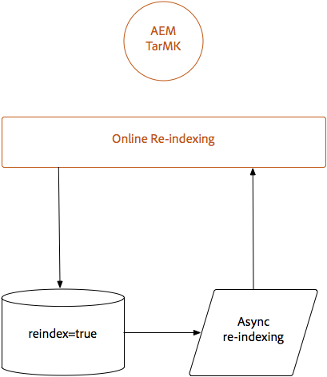

# Oak-run Jar {#indexing-via-the-oak-run-jar}을 통한 색인 지정

Oak-run은 JMX 수준에서 작업을 수행하지 않고도 명령줄에서 모든 색인 사용 사례를 지원합니다. oak-run 접근 방식의 장점은 다음과 같습니다.

1. AEM 6.4용 새로운 색인 지정 도구 세트입니다
1. 이는 대규모 리포지토리의 재색인화 시간에 유용한 재색인화 시간을 감소시킵니다
1. AEM에서 다시 색인화하는 동안 리소스 사용량이 줄어 다른 AEM 활동에 대한 시스템 성능이 향상됩니다
1. Oak-run은 대역 외 지원을 제공합니다.운영 환경에서 운영 인스턴스에 대해 재색인화를 실행할 수 없는 경우, 복제된 환경을 재색인화에 사용하여 중요한 성능에 영향을 주지 않을 수 있습니다.

아래에 `oak-run` 도구를 통해 색인 작업을 수행할 때 활용할 수 있는 사용 사례 목록이 있습니다.

## 인덱스 일관성 검사 {#indexconsistencychecks}

>[!NOTE]
>
>이 시나리오에 대한 자세한 내용은 [사용 사례 1 - 색인 일관성 검사](/help/sites-deploying/oak-run-indexing-usecases.md#usercase1indexconsistencycheck)를 참조하십시오.

* `oak-run.jar`lucene oak 인덱스가 손상되었는지 빠르게 확인합니다.
* 일관성 검사 수준 1 및 2를 위해 사용 중인 AEM 인스턴스에서 실행되는 것이 안전합니다.

## 인덱스 통계 {#indexstatistics}

>[!NOTE]
>
>이 시나리오에 대한 자세한 내용은 [사용 사례 2 - 인덱스 통계](/help/sites-deploying/oak-run-indexing-usecases.md#usecase2indexstatistics) 를 참조하십시오.

* `oak-run.jar` 오프라인 분석을 위해 모든 인덱스 정의, 중요한 색인 통계 및 색인 컨텐츠를 덤프합니다.
* 사용 중인 AEM 인스턴스에서 실행되는 것이 안전합니다.

## 재인덱싱 접근 방식 결정 트리 {#reindexingapproachdecisiontree}

이 다이어그램은 다양한 재인덱싱 접근 방식을 사용할 시점을 위한 의사 결정 트리입니다.

## MongoMK/RDMBMK 재인덱싱 {#reindexingmongomk}

>[!NOTE]
>
>이 시나리오에 대한 자세한 내용은 [사용 사례 3 - 재색인화](/help/sites-deploying/oak-run-indexing-usecases.md#usecase3reindexing)를 참조하십시오.

### SegmentNodeStore 및 DocumentNodeStore {#textpre-extraction}에 대한 텍스트 사전 추출

[텍스트 사전 추출](/help/sites-deploying/best-practices-for-queries-and-indexing.md#how-to-perform-text-pre-extraction) (AEM 6.3에 있었던 기능)을 사용하여 다시 색인화하는 시간을 줄일 수 있습니다. 텍스트 사전 추출은 모든 재인덱싱 접근 방식과 함께 사용할 수 있습니다.

`oak-run.jar` 색인 지정 방법에 따라 아래 다이어그램에서 재색인화 수행 단계의 양쪽에 다양한 단계가 있습니다.

>[!NOTE]
>
>주황색은 AEM이 유지 관리 창에 있어야 하는 활동을 나타냅니다.

### oak-run.jar {#onlinere-indexingformongomk}을 사용하여 MongoMK 또는 RDBMK에 대한 온라인 재인덱싱

>[!NOTE]
>
>이 시나리오에 대한 자세한 내용은 [Reindex - DocumentNodeStore](/help/sites-deploying/oak-run-indexing-usecases.md#reindexdocumentnodestore)를 참조하십시오.

MongoMK(및 RDBMK) AEM 설치를 재색인화하는 데 권장되는 방법입니다. 다른 방법은 사용할 수 없습니다.

이 프로세스는 클러스터의 단일 AEM 인스턴스에 대해서만 실행해야 합니다.

## TarMK {#re-indexingtarmk} 재인덱싱

>[!NOTE]
>
>이 시나리오에 대한 자세한 내용은 [Reindex - SegmentNodeStore](/help/sites-deploying/oak-run-indexing-usecases.md#reindexsegmentnodestore) 를 참조하십시오.

* **콜드 대기 고려 사항(TarMK)**

   * 콜드 스탠바이(Cold Standby)에 대한 특별한 고려 사항은 없습니다.콜드 대기 인스턴스는 평소대로 변경 내용을 동기화합니다.

* **AEM 게시 팜 (AEM 게시 팜 은 항상 TarMK여야 함)**

   * 게시 팜의 경우 모든 OR에 대해 단일 게시에서 단계를 실행한 다음 다른 사용자에 대해 설정을 복제해야 합니다(AEM 인스턴스를 복제할 때 일반적인 사용 중).sling.id - 여기에서 해당 항목에 링크해야 함)

### TarMK {#onlinere-indexingfortarmk}에 대한 온라인 재인덱싱

>[!NOTE]
>
>이 시나리오에 대한 자세한 내용은 [온라인 재인덱스 - SegmentNodeStore](/help/sites-deploying/oak-run-indexing-usecases.md#onlinereindexsegmentnodestore)를 참조하십시오.

oak-run.jar의 새 색인 기능을 도입하기 전에 사용되는 메서드입니다. 이 작업은 Oak 색인에서 `reindex=true` 속성을 설정하여 수행할 수 있습니다.

이 접근 방식은 고객이 색인화하는 시간 및 성능 효과를 사용할 수 있는 경우에 사용할 수 있습니다. 이는 종종 중소형 AEM 설치에 해당합니다.

### oak-run.jar {#onlinere-indexingtarmkusingoak-run-jar}을 사용하여 TarMK를 온라인 재인덱싱

>[!NOTE]
>
>이 시나리오에 대한 자세한 내용은 [온라인 재인덱스 - SegmentNodeStore - AEM 인스턴스가 실행 중](/help/sites-deploying/oak-run-indexing-usecases.md#onlinereindexsegmentnodestoretheaeminstanceisrunning)을 참조하십시오.

TarMK의 온라인 재색인화는 위에 설명된 Online TarkMK의 재색인화보다 빠릅니다. 그러나 유지 관리 기간 동안 실행해야 하며 이 방법은 기간이 더 짧으며 재색인을 수행하려면 더 많은 단계가 필요합니다.

>[!NOTE]
>
>주황색은 유지 관리 기간에 AEM을 수행해야 하는 작업을 나타냅니다.

### oak-run.jar {#offlinere-indexingtarmkusingoak-run-jar}을 사용하여 TarMK를 오프라인 재인덱싱

>[!NOTE]
>
>이 시나리오에 대한 자세한 내용은 [온라인 재인덱스 - SegmentNodeStore - AEM 인스턴스가 종료됨](/help/sites-deploying/oak-run-indexing-usecases.md#onlinereindexsegmentnodestoreaeminstanceisdown)을 참조하십시오.

TarMK의 오프라인 재색인화는 단일 `oak-run.jar` 주석이 필요하므로 TarMK의 가장 간단한 `oak-run.jar` 기반 재색인화 접근 방식입니다. 그러나 AEM 인스턴스를 종료해야 합니다.

>[!NOTE]
>
>빨간색은 AEM을 종료해야 하는 작업을 나타냅니다.

### oak-run.jar {#out-of-bandre-indexingtarmkusingoak-run-jar}을 사용하여 대역 외 TarMK의 재인덱싱

>[!NOTE]
>
>이 시나리오에 대한 자세한 내용은 [대역 외 재인덱스 - SegmentNodeStore](/help/sites-deploying/oak-run-indexing-usecases.md#outofbandreindexsegmentnodestore)를 참조하십시오.

대역 외 재색인화는 사용 중인 AEM 인스턴스에 대해 재색인화가 미치는 영향을 최소화합니다.

>[!NOTE]
>
>빨간색은 AEM이 종료될 수 있는 작업을 나타냅니다.

## 색인 정의 업데이트 {#updatingindexingdefinitions}

>[!NOTE]
>
>이 시나리오에 대한 자세한 내용은 [사용 사례 4 - 색인 정의 업데이트](/help/sites-deploying/oak-run-indexing-usecases.md#usecase4updatingindexdefinitions)를 참조하십시오.

### ACS Confirm Index를 사용하여 TarMK의 인덱스 정의 생성 및 업데이트 {#creatingandupdatingindexdefinitionsontarmkusingacsensureindex}

>[!NOTE]
>
>ACS Sure Index는 커뮤니티 지원 프로젝트이며 Adobe 지원에서 지원되지 않습니다.

이를 통해 컨텐츠 패키지를 통해 배송 인덱스 정의를 수행할 수 있으므로 나중에 다시 인덱스 플래그를 `true`으로 설정하여 다시 색인화할 수 있습니다. 이 기능은 색인 재지정 시간이 오래 걸리지 않는 작은 설정에 작동합니다.

자세한 내용은 [ACS 색인 확인 설명서](https://adobe-consulting-services.github.io/acs-aem-commons/features/ensure-oak-index/index.html)를 참조하십시오.

### oak-run.jar {#creatingandupdatingindexdefinitionsontarmkusingoak-run-jar}을 사용하여 TarMK에서 색인 정의 생성 및 업데이트

비 `oak-run.jar` 메서드를 사용하여 다시 색인화하는 데 시간 또는 성능이 너무 높은 경우 다음 `oak-run.jar` 기반 접근 방식을 사용하여 TarMK 기반 AEM 설치에서 Lucene 인덱스 정의를 가져오고 다시 색인화할 수 있습니다.

### oak-run.jar {#creatingandupdatingindexdefinitionsonmonogmkusingoak-run-jar}을 사용하여 MonogMK에서 색인 정의 생성 및 업데이트

비 `oak-run.jar` 메서드를 사용하여 다시 색인화하는 데 시간 또는 성능이 너무 높은 경우 다음 `oak-run.jar` 기반 접근 방식을 사용하여 MongoMK 기반 AEM 설치에서 Lucene 인덱스 정의를 가져오고 다시 색인화할 수 있습니다.

