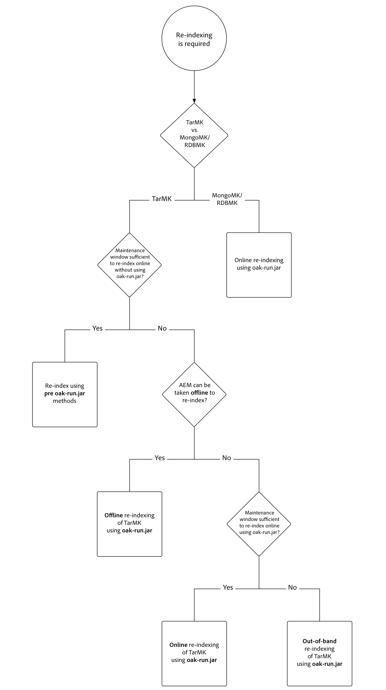
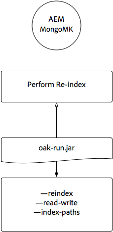

# Oak-run Jar를 통한 인덱싱 {#indexing-via-the-oak-run-jar}

Oak-run은 JMX 수준에서 작업할 필요 없이 명령줄에서 모든 인덱싱 사용 사례를 지원합니다. oak-run 접근 방식의 이점은 다음과 같습니다.

1. AEM 6.4에 대한 새로운 인덱싱 도구 세트입니다.
1. EMC Centera를 사용하면 재색하는 시간이 줄어들기 때문에 더 큰 저장소에서 다시 색인화 시간이 단축됩니다.
1. AEM에서 다시 색인화하는 동안 리소스 사용량을 줄여 다른 AEM 활동에 대한 시스템 성능이 향상됩니다
1. Oak-run은 다음과 같은 대역 외 지원을 제공합니다.프로덕션 조건이 프로덕션 인스턴스에서 다시 색인을 실행하도록 허용하지 않는 경우, 복제된 환경을 다시 색인화하는 데 사용하여 성능에 심각한 영향을 주지 않습니다.

아래에서 `oak-run` 도구를 통해 색인 작업을 수행할 때 활용할 수 있는 사용 사례 목록을 확인할 수 있습니다.

## 색인 일관성 검사 {#indexconsistencychecks}

>[!NOTE]
>
>이 시나리오에 대한 자세한 내용은 사용 사례 1 - [인덱스 일관성 검사를 참조하십시오](/help/sites-deploying/oak-run-indexing-usecases.md#usercase1indexconsistencycheck).

* `oak-run.jar`lucene oak 색인이 손상되었는지 빠르게 판별합니다.
* 일관성 확인 수준 1 및 2를 위해 사용 중인 AEM 인스턴스에서 실행되는 것이 안전합니다.

## 색인 통계 {#indexstatistics}

>[!NOTE]
>
>이 시나리오에 대한 자세한 내용은 사용 사례 [2 - 인덱스 통계를 참조하십시오.](/help/sites-deploying/oak-run-indexing-usecases.md#usecase2indexstatistics)

* `oak-run.jar` 오프라인 분석을 위해 모든 색인 정의, 중요한 색인 통계 및 색인 컨텐츠를 덤프합니다.
* 사용 중인 AEM 인스턴스에서 실행되도록 안전합니다.

## 다시 인덱싱 접근 방식 결정 트리 {#reindexingapproachdecisiontree}

이 다이어그램은 다양한 색인 지정 접근 방식을 사용하는 경우에 대한 결정 트리입니다.

## MongoMK/RDMBMK 다시 인덱싱 {#reindexingmongomk}

>[!NOTE]
>
>이 시나리오에 대한 자세한 내용은 사용 사례 3 - [재인덱싱을 참조하십시오](/help/sites-deploying/oak-run-indexing-usecases.md#usecase3reindexing).

### SegmentNodeStore 및 DocumentNodeStore용 텍스트 사전 추출 {#textpre-extraction}

[텍스트 사전 추출](/help/sites-deploying/best-practices-for-queries-and-indexing.md#how-to-perform-text-pre-extraction) (AEM 6.3과 함께 존재했던 기능)을 사용하여 다시 색인화하는 시간을 줄일 수 있습니다. 텍스트 사전 추출은 모든 재인덱싱 접근 방식과 함께 사용할 수 있습니다.

색인 `oak-run.jar` 지정 방식에 따라 아래 다이어그램에서 다시 인덱스 수행 단계 중 한 쪽에 다양한 단계가 있습니다.

>[!NOTE]
>
>주황색은 AEM이 유지 관리 창에 있어야 하는 활동을 나타냅니다.

### oak-run.jar를 사용하여 MongoMK 또는 RDBMK에 대한 온라인 재인덱싱 {#onlinere-indexingformongomk}

>[!NOTE]
>
>이 시나리오에 대한 자세한 내용은 Reindex - DocumentNodeStore [를 참조하십시오](/help/sites-deploying/oak-run-indexing-usecases.md#reindexdocumentnodestore).

이 방법은 MongoMK(및 RDBMK) AEM 설치를 다시 색인화하는 데 권장되는 방법입니다. 다른 방법은 사용할 수 없습니다.

이 프로세스는 클러스터의 단일 AEM 인스턴스에만 실행해야 합니다.

## TarMK의 재인덱싱 {#re-indexingtarmk}

>[!NOTE]
>
>이 시나리오에 대한 자세한 내용은 Reindex - SegmentNodeStore [를 참조하십시오](/help/sites-deploying/oak-run-indexing-usecases.md#reindexsegmentnodestore).

* **콜드 대기 고려 사항(TarMK)**

   * 콜드스탠바이 에 대한 특별한 고려 사항은 없습니다.cold Standby 인스턴스는 평소대로 변경 내용을 동기화합니다.

* **AEM 게시 팜(AE 게시 팜은 항상 TarMK여야 함)**

   * 게시 팜의 경우, 모든 OR에 대해 한 번의 게시에서 단계를 실행한 다음 다른 사용자에 대해 설정을 복제해야 합니다(AEM 인스턴스를 복제할 때 일반적인 모든 정밀한 작업 수행).sling.id - 여기에 링크해야 함)

### TarMK를 위한 온라인 재인덱싱 {#onlinere-indexingfortarmk}

>[!NOTE]
>
>이 시나리오에 대한 자세한 내용은 온라인 다시 [인덱스 - SegmentNodeStore를 참조하십시오](/help/sites-deploying/oak-run-indexing-usecases.md#onlinereindexsegmentnodestore).

이것은 oak-run.jar의 새로운 인덱싱 기능을 시작하기 전에 사용되는 방법입니다. Oak 색인에 `reindex=true` 속성을 설정하여 수행할 수 있습니다.

고객이 색인에 대한 시간 및 성능 효과를 허용하는 경우 이 방법을 사용할 수 있습니다. 이는 종종 중소 규모의 AEM 설치에 해당합니다.

### oak-run.jar를 사용하는 TarMK의 온라인 재인덱싱 {#onlinere-indexingtarmkusingoak-run-jar}

>[!NOTE]
>
>이 시나리오에 대한 자세한 내용은 온라인 [재인덱스 - SegmentNodeStore - AEM 인스턴스가 실행 중임을 참조하십시오](/help/sites-deploying/oak-run-indexing-usecases.md#onlinereindexsegmentnodestoretheaeminstanceisrunning).

TarMK의 온라인 재인덱스는 위에서 설명한 온라인 TarkMK의 재인덱싱보다 더 빠릅니다. 하지만 유지 관리 기간 동안 실행해야 하며 창이 더 짧아지고 색인 재작성을 수행하려면 더 많은 단계가 필요합니다.

>[!NOTE]
>
>주황색은 유지 관리 기간 동안 AEM을 수행해야 하는 작업을 나타냅니다.

### oak-run.jar를 사용하는 TarMK의 오프라인 다시 인덱싱 {#offlinere-indexingtarmkusingoak-run-jar}

>[!NOTE]
>
>이 시나리오에 대한 자세한 내용은 온라인 [다시 인덱스 - SegmentNodeStore - AEM 인스턴스가 종료됨을 참조하십시오](/help/sites-deploying/oak-run-indexing-usecases.md#onlinereindexsegmentnodestoreaeminstanceisdown).

TarMK의 오프라인 재인덱스는 단일 `oak-run.jar` 주석이 필요하므로 TarMK의 가장 간단한 `oak-run.jar` 기반 다시 인덱싱 접근 방식입니다. 그러나 AEM 인스턴스를 종료해야 합니다.

>[!NOTE]
>
>빨간색은 AEM을 종료해야 하는 작업을 나타냅니다.

### oak-run.jar를 사용하는 대역 외 TarMK의 재인덱싱 {#out-of-bandre-indexingtarmkusingoak-run-jar}

>[!NOTE]
>
>이 시나리오에 대한 자세한 내용은 대역 외 [재인덱스 - SegmentNodeStore를 참조하십시오](/help/sites-deploying/oak-run-indexing-usecases.md#outofbandreindexsegmentnodestore).

대역외 재인덱싱을 사용하면 사용 중인 AEM 인스턴스에 대해 다시 색인화가 미치는 영향을 최소화할 수 있습니다.

>[!NOTE]
>
>빨간색은 AEM이 종료될 수 있는 작업을 나타냅니다.

## 색인 정의 업데이트 {#updatingindexingdefinitions}

>[!NOTE]
>
>이 시나리오에 대한 자세한 내용은 사용 사례 4 - [색인 정의 업데이트를 참조하십시오](/help/sites-deploying/oak-run-indexing-usecases.md#usecase4updatingindexdefinitions).

### ACS 확인 인덱스를 사용하여 TarMK에서 색인 정의 만들기 및 업데이트 {#creatingandupdatingindexdefinitionsontarmkusingacsensureindex}

>[!NOTE]
>
>ACS Ensure Index는 커뮤니티에서 지원하는 프로젝트이며 Adobe 지원 팀에서 지원하지 않습니다.

이를 통해 컨텐츠 패키지를 통해 색인 정의를 전달할 수 있으므로 나중에 다시 색인 플래그를 `true`로 설정하여 색인 지정을 다시 할 수 있습니다. 이렇게 하면 다시 색인화하는 데 시간이 오래 걸리지 않는 작은 설정에 적용됩니다.

자세한 내용은 ACS 색인 [확인 설명서를](https://adobe-consulting-services.github.io/acs-aem-commons/features/ensure-oak-index/index.html) 참조하십시오.

### TarMK에서 oak-run.jar를 사용하여 색인 정의 만들기 및 업데이트 {#creatingandupdatingindexdefinitionsontarmkusingoak-run-jar}

비 `oak-run.jar` 메서드를 사용하여 다시 색인화함으로써 얻는 시간 또는 성능 영향이 너무 높을 경우 다음 `oak-run.jar` 기반 방법을 사용하여 TarMK 기반 AEM 설치의 Lucene 색인 정의를 가져오고 다시 색인화할 수 있습니다.

### oak-run.jar를 사용하여 MonogMK에서 색인 정의 만들기 및 업데이트 {#creatingandupdatingindexdefinitionsonmonogmkusingoak-run-jar}

비 `oak-run.jar` 메서드를 사용하여 다시 색인화함으로써 얻는 시간 또는 성능 영향이 너무 높을 경우 다음 `oak-run.jar` 기반 방법을 사용하여 MongoMK 기반 AEM 설치의 Lucene 색인 정의를 가져오고 다시 색인화할 수 있습니다.

