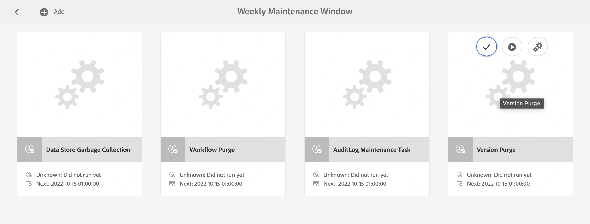
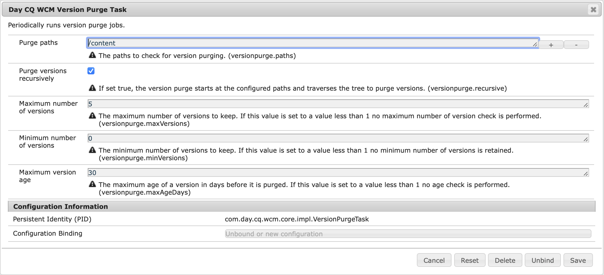

# Adobe Experience Manager 인스턴스 모니터링 및 유지 관리{#monitoring-and-maintaining-your-aem-instance}

AEM 인스턴스가 배포된 후 작업, 성능 및 무결성을 모니터링하고 유지해야 합니다.

여기서 중요한 요소는 잠재적인 문제를 인식하려면 시스템이 정상적인 조건에서 어떻게 보이고 작동하는지 알아야 합니다. 이 기능은 시스템을 모니터링하고 시간이 지남에 따라 정보를 수집하는 것이 가장 좋습니다.

| 확인 | 고려 사항 | 댓글 / 작업 |
|---|---|---|
| 백업 계획. |  | [인스턴스를 백업하는 방법](/help/sites-deploying/monitoring-and-maintaining.md#backups)을 참조하세요. |
| 재해 복구 계획 | 귀사의 재해 복구 지침 |  |
| 오류 추적 시스템은 보고 문제에 사용할 수 있습니다. | 예를 들어, [Bugzilla](https://www.bugzilla.org/), [Jira](https://www.atlassian.com/software/jira) 또는 여러 가지 중 하나가 있습니다. |  |
| 파일 시스템을 모니터링하고 있습니다. | 사용 가능한 디스크 공간이 부족하면 CRX 저장소가 &quot;정지&quot;됩니다. 공간을 사용할 수 있게 되면 다시 시작됩니다. | 사용 가능한 공간이 부족해지면 로그 파일에서 &quot; `*ERROR* LowDiskSpaceBlocker`&quot; 메시지를 볼 수 있습니다. |
| [로그 파일](/help/sites-deploying/monitoring-and-maintaining.md#working-with-audit-records-and-log-files)을(를) 모니터링하고 있습니다. |  |  |
| 시스템 모니터링이 백그라운드에서 계속 실행됩니다. | CPU, 메모리, 디스크 및 네트워크 사용량 포함 예를 들어 iostat / vmstat / perfmon을 사용합니다. | 기록된 데이터는 시각화되며 성능 문제를 추적하는 데 사용할 수 있습니다. 원시 데이터에도 액세스할 수 있습니다. |
| [AEM 성능을 모니터링하고 있습니다](/help/sites-deploying/monitoring-and-maintaining.md#monitoring-performance). | 트래픽 수준을 모니터링하기 위해 [요청 카운터](/help/sites-deploying/monitoring-and-maintaining.md#request-counters)를 포함합니다. | 중대한, 장기적 성과 손실이 보이면 정밀한 조사를 해야 한다. |
| [복제 에이전트](/help/sites-deploying/monitoring-and-maintaining.md#monitoring-your-replication-agents)를 모니터링하고 있습니다. |  |  |
| 정기적으로 워크플로우 인스턴스를 제거합니다. | 저장소 크기 및 워크플로 성능. | [워크플로 인스턴스 정기적 제거](/help/sites-administering/workflows-administering.md#regular-purging-of-workflow-instances)를 참조하십시오. |

## 백업 {#backups}

다음 항목을 백업하는 것이 좋습니다.

* 소프트웨어 설치 - 구성을 크게 변경하기 전/후
* 저장소 내에 보관된 콘텐츠 - 정기적으로

백업 정책을 준수하고 있을 가능성이 높으며, 백업할 내용과 시기에 대한 추가 고려 사항은 다음과 같습니다.

* 시스템 및 데이터의 중요도
* 소프트웨어 또는 데이터가 변경되는 빈도.
* 데이터 볼륨, 백업 수행 시간과 마찬가지로 가끔 용량이 문제가 될 수 있습니다.
* 사용자가 온라인 상태일 때 백업을 수행할 수 있는지 여부 및 가능한 경우 성능에 미치는 영향
* 사용자의 지리적 분포. 즉, 영향을 최소화하기 위해 백업하는 최적의 시기는 언제입니까?
* 재해 복구 정책: 백업 데이터를 저장할 위치(예: 오프사이트와 특정 매체)에 대한 지침이 있습니까?

전체 백업은 정기적인 간격(예: 매일, 매주 또는 매월)으로 수행되며 그 사이에는 증분 백업(예: 시간별, 일별 또는 주별)이 있습니다.

>[!CAUTION]
>
>프로덕션 인스턴스의 백업을 구현할 때 백업을 성공적으로 복원할 수 있도록 *해야*&#x200B;합니다.
>
>이 테스트가 없으면 백업이 무용지물이 될 수 있습니다(최악의 경우).

>[!NOTE]
>
>백업 성능에 대한 자세한 내용은 성능](/help/sites-deploying/configuring-performance.md#backup-performance) 뒤로 섹션을 참조하십시오[.

### 소프트웨어 설치 백업 {#backing-up-your-software-installation}

설치 후 또는 구성이 크게 변경된 경우 소프트웨어 설치의 백업 백업을 만듭니다.

이 작업을 [수행하려면 전체 저장소](#backing-up-your-repository) 백업을 한 후 다음을 수행합니다.

1. 정지 AEM.
1. 파일 시스템에서 전체 `<cq-installation-dir>`을(를) 백업합니다.

>[!CAUTION]
>
>타사 애플리케이션 서버를 운영하는 경우 추가 폴더가 다른 위치에 있을 수 있으므로 백업해야 합니다. 응용 프로그램 서버 설치에 대한 자세한 내용은 [응용 프로그램 서버에 AEM을 설치하는 방법](/help/sites-deploying/application-server-install.md)을 참조하십시오.

>[!CAUTION]
>
>파일 데이터 저장소의 증분 백업이 지원됩니다. 다른 구성 요소(예: Lucene 인덱스)에 증분 백업을 사용할 때는 삭제된 파일도 백업에서 삭제된 것으로 표시되는지 확인하십시오.

>[!NOTE]
>
>디스크 미러링은 백업 메커니즘으로도 사용할 수 있습니다.

### 저장소 백업 {#backing-up-your-repository}

CRX 설명서의 [백업 및 복원](/help/sites-administering/backup-and-restore.md) 섹션에서는 CRX 저장소의 백업과 관련된 모든 문제를 다룹니다.

온라인 &quot;핫&quot; 백업을 만드는 방법에 대한 자세한 내용은 [온라인 백업 만들기](/help/sites-administering/backup-and-restore.md#online-backup)를 참조하십시오.

## 버전 삭제 {#version-purging}

**버전 제거** 도구는 저장소의 노드 또는 노드 계층 구조를 제거하기 위한 것입니다. 기본 목적은 이전 버전의 노드를 제거하여 저장소 크기를 줄이는 데 도움이 됩니다.

이 섹션에서는 AEM의 버전 관리 기능과 관련된 유지 관리 작업을 다룹니다. **버전 제거** 도구는 저장소의 노드 또는 노드 계층 구조를 제거하기 위한 것입니다. 주요 목적은 이전 버전의 노드를 제거하여 저장소 크기를 줄이는 데 도움이 되는 것입니다.

### 개요 {#overview}

**버전** 삭제 도구 은 주별 유지 관리 작업으로 사용할 수 있습니다. 처음 사용하기 전에 추가한 다음 구성해야 합니다. 그 후에는 요청 시 또는 매주 실행할 수 있습니다.

### 웹 사이트 버전 삭제 {#purging-versions-of-a-web-site}

웹 사이트의 버전을 제거하려면 다음과 같이 진행하십시오.

1. **[도구](/help/sites-administering/tools-consoles.md)** **콘솔**(으)로 이동하고 **작업**, **유지 관리**&#x200B;를 선택한 다음 **주별 유지 관리 기간**&#x200B;을 선택합니다.

1. 상단 도구 모음에서 **+ 추가**&#x200B;를 선택합니다.

   

1. **새 작업 추가** 대화 상자의 드롭다운 목록에서 **버전 제거**&#x200B;를 선택합니다. 그런 다음 **저장**&#x200B;합니다.

   

1. **버전 제거** 작업이 추가되었습니다. 카드 작업을 사용하여 다음을 수행합니다.
   * 선택 - 상단 도구 모음에 추가 작업이 표시됩니다.
   * 실행 - 구성된 제거를 즉시 실행합니다.
   * 구성 - 주별 제거 작업을 구성합니다.

   

1. **구성** 작업을 선택하여 **일 CQ WCM 버전 제거 작업**&#x200B;에 대한 웹 콘솔을 엽니다. 여기서 다음을 구성할 수 있습니다.

   

   * **경로 제거**
삭제할 콘텐츠의 시작 경로를 설정하십시오(예: `/content/wknd`).

     >[!CAUTION]
     >
     >Adobe은 각 웹 사이트에 대해 여러 경로를 정의할 것을 권장합니다.
     >
     >하위 항목이 너무 많은 경로를 정의하면 제거 수행 시간이 크게 늘어날 수 있습니다.

   * **버전을 재귀적으로 제거**

      * 경로에 정의된 노드만 제거하려면 선택을 취소합니다.
      * 경로 및 하위 항목에 의해 정의된 노드를 제거하려는 경우 선택합니다.

   * **최대 버전 수**
유지할 최대 버전 수(각 노드에 대해)를 설정합니다. 이 설정을 사용하지 않으려면 비워 둡니다.

   * **최소 버전 수**
유지할 최소 버전 수(각 노드에 대해)를 설정합니다. 이 설정을 사용하지 않으려면 비워 둡니다.

   * **최대 버전 사용 기간**
유지할 최대 버전 보존 기간(일)(각 노드에 대해)을 설정합니다. 이 설정을 사용하지 않으려면 비워 둡니다.

   그런 다음 **저장**&#x200B;합니다.

1. **주별 유지 관리 창** 창으로 이동/돌아가서 **실행**&#x200B;을 선택하여 프로세스를 즉시 시작합니다.

>[!CAUTION]
>
>클래식 UI 대화 상자를 사용하여 구성의 [시험 실행](#analyzing-the-console)을 수행할 수 있습니다.
>
>* http://localhost:4502/etc/versioning/purge.html
>
>삭제된 노드는 저장소를 복원하지 않으면 되돌릴 수 없습니다. 제거하기 전에 항상 드라이 실행을 수행하여 구성을 관리하십시오.

#### 시험 실행 - 콘솔 분석 {#analyzing-the-console}

클래식 UI는 다음에서 **시험 실행** 옵션을 제공합니다.

* http://localhost:4502/etc/versioning/purge.html

이 프로세스에는 처리된 모든 노드가 나열됩니다. 프로세스 중에 노드는 다음 상태 중 하나를 가질 수 있습니다.

* `ignore (not versionnable)`: 노드가 버전 관리를 지원하지 않으며 프로세스 중에 무시됩니다.

* `ignore (no version)`: 노드에 버전이 없으며 프로세스 중에 무시됩니다.

* `retained`: 노드가 삭제되지 않았습니다.
* `purged`: 노드가 삭제되었습니다.

또한 콘솔에서는 버전에 대한 유용한 정보를 제공합니다.

* `V 1.0`: 버전 번호입니다.
* `V 1.0.1`&#42;: 별표는 버전이 현재(기본) 버전이며 제거할 수 없음을 나타냅니다.

* `Thu Mar 15 2012 08:37:32 GMT+0100`: 버전의 날짜입니다.

다음 예제에서:

* **[!DNL Shirts]** 버전 사용 기간이 2일보다 길기 때문에 버전이 제거됩니다.
* 버전 수가 5보다 크므로 **[!DNL Tonga Fashions!]** 버전이 삭제됩니다.


## 감사 레코드 및 로그 파일 작업 {#working-with-audit-records-and-log-files}

Adobe Experience Manager(AEM)와 관련된 감사 레코드 및 로그 파일은 다양한 위치에서 찾을 수 있습니다. 다음은 찾을 수 있는 내용과 찾을 수 있는 위치에 대한 개요를 제공하기 위해 제공됩니다.

### 로그 작업 {#working-with-logs}

AEM WCM은 세부 로그를 기록합니다. 압축을 풀고 빠른 시작을 시작하면 다음에서 로그를 찾을 수 있습니다.

* `<cq-installation-dir>/crx-quickstart/logs/`

* `<cq-installation-dir>/crx-quickstart/repository/`

#### 로그 파일 회전 {#log-file-rotation}

로그 파일 순환은 주기적으로 파일을 만들어 파일의 성장을 제한하는 프로세스를 말합니다. AEM에서 `error.log`(이)라는 로그 파일은 지정된 규칙에 따라 하루에 한 번 회전됩니다.

* `{original_filename}.yyyy-MM-dd` 패턴에 따라 `error.log` 파일의 이름이 바뀝니다. 예를 들어 2010년 7월 11일에 현재 로그 파일의 이름이 `error.log-2010-07-10`으로 바뀌고 새 `error.log`이(가) 만들어집니다.

* 이전 로그 파일은 삭제되지 않으므로 오래된 로그 파일을 주기적으로 정리하여 디스크 사용량을 제한해야 합니다.

>[!NOTE]
>
>AEM 설치를 업그레이드하는 경우 AEM에서 더 이상 사용되지 않는 기존 로그 파일은 디스크에 남아 있습니다. 위험 없이 제거할 수 있습니다. 모든 새 로그 항목은 새 로그 파일에 기록됩니다.

### 로그 파일 찾기 {#finding-the-log-files}

AEM을 설치한 파일 서버에는 다양한 로그 파일이 보관되어 있습니다.

* `<cq-installation-dir>/crx-quickstart/logs`

   * `access.log`
AEM WCM 및 저장소에 대한 모든 액세스 요청이 여기에 등록됩니다.

   * `audit.log`
중재 작업은 여기에 등록됩니다.

   * `error.log`
여기에는 (다양한 심각도 수준의) 오류 메시지가 등록됩니다.

   * [`ImageServer-<PortId>-yyyy>-<mm>-<dd>.log`](https://experienceleague.adobe.com/docs/dynamic-media-developer-resources/image-serving-api/image-serving-api/config-admin/server-logging/c-image-server-log.html)
이 로그는 [!DNL Dynamic Media]이(가) 활성화된 경우에만 사용됩니다. 내부 ImageServer 프로세스의 동작을 분석하는 데 사용되는 통계 및 분석 정보를 제공합니다.

   * `request.log`
각 액세스 요청은 응답과 함께 여기에 등록됩니다.

   * [`s7access-<yyyy>-<mm>-<dd>.log`](https://experienceleague.adobe.com/docs/dynamic-media-developer-resources/image-serving-api/image-serving-api/config-admin/server-logging/c-access-log.html)
이 로그는 [!DNL Dynamic Media]이(가) 활성화된 경우에만 사용됩니다. s7access 로그는 `/is/image` 및 `/is/content`을(를) 통해 [!DNL Dynamic Media]에 대한 각 요청을 기록합니다.

   * `stderr.log`
시작 중에 생성된 다양한 심각도 수준의 오류 메시지를 다시 저장합니다. 기본적으로 로그 수준은 `Warning`( `WARN`)로 설정됩니다.

   * `stdout.log`
시작 중 이벤트를 나타내는 로깅 메시지를 보관합니다.

   * `upgrade.log`
`com.day.compat.codeupgrade` 및 `com.adobe.cq.upgradesexecutor` 패키지에서 실행되는 모든 업그레이드 작업의 로그를 제공합니다.

* `<cq-installation-dir>/crx-quickstart/repository/segmentstore`

   * `journal.log`
개정 저널링 정보.

>[!NOTE]
>
>ImageServer 및 s7액세스 로그는 **시스템/콘솔/상태**번들리스트**페이지에서 생성된 전체 다운로드**패키지에 포함되지 않습니다. 지원을 위해 [!DNL Dynamic Media] 문제가 있는 경우 고객 지원 센터에 문의할 때 ImageServer 및 s7액세스 로그를 추가하십시오.

### DEBUG 로그 수준 활성화 {#activating-the-debug-log-level}

기본 로그 수준([Apache Sling 로깅 구성](/help/sites-deploying/osgi-configuration-settings.md#apacheslingloggingconfiguration))은 정보이므로 디버그 메시지가 기록되지 않습니다.

Logger에 대한 디버그 로그 수준을 활성화하려면 저장소에서 `org.apache.sling.commons.log.level` 속성을 debug로 설정합니다. 예를 들어 `/libs/sling/config/org.apache.sling.commons.log.LogManager`에서 [전역 Apache Sling 로깅](/help/sites-deploying/osgi-configuration-settings.md#apacheslingloggingconfiguration)을 구성하십시오.

>[!CAUTION]
>
>디버그 로그 수준에서 로그를 필요 이상으로 오래 두면 안 됩니다. 로그 항목이 많이 생성되고 리소스가 소모되기 때문입니다.

디버그 파일의 행은 일반적으로 DEBUG로 시작한 다음 로그 수준, 설치 관리자 작업 및 로그 메시지를 제공합니다. 예:

```shell
DEBUG 3 WebApp Panel: WebApp successfully deployed
```

로그 수준은 다음과 같습니다.

| 0 | 치명적인 오류 | 작업이 실패하여 설치 관리자를 진행할 수 없습니다. |
|---|---|---|
| 1 | 오류 | 작업이 실패했습니다. 설치가 진행되지만 AEM WCM의 일부가 올바르게 설치되지 않아 작동하지 않습니다. |
| 2 | 경고 | 작업이 성공했지만 문제가 발생했습니다. AEM WCM이 제대로 작동할 수도 있고 작동하지 않을 수도 있습니다. |
| 3 | 정보 | 작업이 성공했습니다. |

### 사용자 지정 로그 파일 만들기 {#create-a-custom-log-file}

>[!NOTE]
>
>Adobe Experience Manager을 사용하여 작업할 때 이러한 서비스에 대한 구성 설정을 관리할 수 있는 방법에는 몇 가지가 있습니다. 자세한 내용 및 권장 사례를 확인하려면 [OSGi 구성](/help/sites-deploying/configuring-osgi.md)을(를) 참조하십시오.

경우에 따라 다른 로그 수준으로 사용자 지정 로그 파일을 만들 수 있습니다. 저장소에서 다음을 수행합니다.

1. 존재하지 않는 경우 프로젝트 `/apps/<project-name>/config`에 대한 구성 폴더(`sling:Folder`)를 만듭니다.
1. `/apps/<project-name>/config`에서 새 [Apache Sling 로깅 로거 구성](/help/sites-deploying/osgi-configuration-settings.md#apacheslingloggingloggerconfigurationfactoryconfiguration)에 대한 노드를 만드십시오.

   * 이름: `org.apache.sling.commons.log.LogManager.factory.config-<identifier>`

     Where `<identifier>` 는 인스턴스 식별을 위해 입력해야 하는 무료 텍스트로 대체됩니다(이 정보는 생략할 수 없음).

     예, `org.apache.sling.commons.log.LogManager.factory.config-MINE`

   * 유형: `sling:OsgiConfig`

   >[!NOTE]
   >
   >기술적 요구 사항은 아니지만 고유하게 만드는 `<identifier>` 것이 좋습니다.

1. 이 노드 설정에서 다음 속성을 설정합니다.

   * 이름: `org.apache.sling.commons.log.file`

     유형: 문자열

     값: 로그 파일을 지정하십시오(예: `logs/myLogFile.log`).

   * 이름: `org.apache.sling.commons.log.names`

     유형: String[](String + Multi)

     값: 로거가 메시지를 기록할 OSGi 서비스를 지정합니다. 예를 들어 다음과 같습니다.

      * `org.apache.sling`
      * `org.apache.felix`
      * `com.day`

   * 이름: `org.apache.sling.commons.log.level`

     유형: 문자열

     값: 필요한 로그 수준(`debug`, `info`, `warn` 또는 `error`)을 지정합니다(예: `debug`).

   * 필요에 따라 다른 매개 변수를 구성합니다.

      * 이름: `org.apache.sling.commons.log.pattern`

        유형: `String`

        값: 필요에 따라 로그 메시지의 패턴을 지정합니다. 예를 들어

        `{0,date,dd.MM.yyyy HH:mm:ss.SSS} *{4}* [{2}] {3} {5}`

   >[!NOTE]
   >
   >`org.apache.sling.commons.log.pattern`은(는) 최대 6개의 인수를 지원합니다.
   >
   >{0} `java.util.Date` 유형의 타임스탬프
   >
   >{1} 로그 마커
   >
   >{2} 현재 스레드 이름
   >
   >{3} 로거의 이름
   >
   >{4} 로그 수준
   >
   >로그 메시지 {5}
   >
   >로그 호출에 `Throwable`이(가) 포함된 경우 스택 추적이 메시지에 추가됩니다.

   >[!CAUTION]
   >
   >org.apache.sling.commons.log.names에는 값이 있어야 합니다.

   >[!NOTE]
   >
   >로그 기록기 경로는 `crx-quickstart` 위치에 상대적입니다.
   >
   >따라서 로그 파일은 다음과 같이 지정됩니다.
   >
   >`logs/thelog.log`
   >
   >쓰기 대상:
   >
   >`<cq-installation-dir>/crx-quickstart/logs/thelog.log`
   >
   >및 로그 파일이 다음으로 지정됨:
   >
   >`../logs/thelog.log`
   >
   >디렉터리에 쓰기:
   >
   >`<cq-installation-dir>/logs/`\
   >(즉, `<cq-installation-dir>/crx-quickstart/` 옆에 있음)

1. 이 단계는 새 작성기가 필요한 경우(즉, 기본 작성기와 다른 구성을 사용하는 경우)에만 필요합니다.

   >[!CAUTION]
   >
   >새 로깅 작성기 구성은 기존 기본값이 적합하지 않은 경우에만 필요합니다.
   >
   >명시적 Writer가 구성되어 있지 않으면 시스템은 기본값을 기반으로 암시적 Writer를 자동으로 생성합니다.

   `/apps/<project-name>/config`에서 새 [Apache Sling 로깅 작성기 구성](/help/sites-deploying/osgi-configuration-settings.md#apacheslingloggingwriterconfigurationfactoryconfiguration)에 대한 노드를 만드십시오.

   * 이름: `org.apache.sling.commons.log.LogManager.factory.writer-<identifier>`(작성자)

     Logger와 마찬가지로 `<identifier>`은(는) 인스턴스를 식별하기 위해 입력해야 하는 자유 텍스트로 대체됩니다(이 정보를 생략할 수 없음). 예, `org.apache.sling.commons.log.LogManager.factory.writer-MINE`

   * 유형: `sling:OsgiConfig`

   >[!NOTE]
   >
   >기술 요구 사항은 아니지만 `<identifier>`을(를) 고유하게 만드는 것이 좋습니다.

   이 노드에서 다음 속성을 설정합니다.

   * 이름: `org.apache.sling.commons.log.file`

     유형: `String`

     값: 로거에 지정된 파일과 일치하도록 로그 파일을 지정합니다.

     예를 들면 `../logs/myLogFile.log`입니다.

   * 필요에 따라 다른 매개 변수를 구성합니다.

      * 이름: `org.apache.sling.commons.log.file.number`

        유형: `Long`

        값: 보관할 로그 파일의 수를 지정합니다(예: `5`).

      * 이름: `org.apache.sling.commons.log.file.size`

        유형: `String`

        값: 크기/날짜별로 파일 회전을 제어하는 데 필요한 값을 지정합니다(예: `'.'yyyy-MM-dd`).

   >[!NOTE]
   >
   >`org.apache.sling.commons.log.file.size`은(는) 다음 중 하나를 설정하여 로그 파일의 회전을 제어합니다.
   >
   >* 최대 파일 크기
   >* 시간/날짜 일정
   >
   >새 파일이 만들어지는 시점(및 기존 파일의 이름이 이름 패턴에 따라 변경됨)을 나타냅니다.
   >
   >* 숫자로 크기 제한을 지정할 수 있습니다. 크기 표시기가 제공되지 않으면 바이트 수로 간주하거나 크기 표시기 중 하나(`KB`, `MB` 또는 `GB`)를 추가할 수 있습니다(대/소문자가 무시됨).
   >* 시간/날짜 일정은 패턴으로 `java.util.SimpleDateFormat` 지정할 수 있습니다. 파일이 회전되는 기간 이후를 정의합니다. 또한 회전된 파일에 추가된 접미어(식별용).
   >
   >기본값은 &#39;.&#39;yyyy-MM-dd(일별 로그 회전용).
   >
   >예를 들어, 2010년 1월 20일 자정(또는 이 날짜 이후의 첫 번째 로그 메시지가 정확할 때)에 .. /logs/error.log의 이름이 .로 바뀝니다. /logs/error.log.2010-01-20입니다. 1 월 21 일에 대한 로깅은 (새롭고 비어 있음)에 출력됩니다. /logs/error.log 다음 변경 시 롤오버될 때까지 유지됩니다.
   >
   >| `'.'yyyy-MM` | 매월 초에 순환 |
   >|---|---|
   >| `'.'yyyy-ww` | 매주 첫째 날의 순환(로케일에 따라 다름) |
   >| `'.'yyyy-MM-dd` | 매일 자정에 순환. |
   >| `'.'yyyy-MM-dd-a` | 매일 자정과 정오에 순환. |
   >| `'.'yyyy-MM-dd-HH` | 매시간 맨 위에 회전. |
   >| `'.'yyyy-MM-dd-HH-mm` | 매 분 시작 시 회전. |
   >
   >참고: 시간/날짜를 지정할 때:
   >
   >1. 작은 따옴표(&#39; &#39;) 쌍 안에 리터럴 텍스트를 &quot;이스케이프&quot;해야 합니다.
   >
   >    특정 문자가 패턴 문자로 해석되지 않도록 합니다.
   >
   >1. 옵션의 어디에나 유효한 파일 이름에 사용할 수 있는 문자만 사용하십시오.

1. 선택한 도구로 새 로그 파일을 읽습니다.

   이 예제에서 만든 로그 파일은 `../crx-quickstart/logs/myLogFile.log`입니다.

Felix 콘솔은 `../system/console/slinglog`의 Sling 로그 지원에 대한 정보도 제공합니다(예: `https://localhost:4502/system/console/slinglog`).

### 감사 레코드 찾기 {#finding-the-audit-records}

감사 기록은 누가 언제 무엇을 했는지 기록하기 위해 보관됩니다. AEM WCM 및 OSGi 이벤트 모두에 대해 서로 다른 감사 레코드가 생성됩니다.

#### 페이지 작성 시 표시되는 AEM WCM 감사 레코드 {#aem-wcm-audit-records-shown-when-page-authoring}

1. 페이지를 엽니다.
1. 사이드 킥에서 잠금 아이콘으로 탭을 선택한 다음 **감사 로그...**&#x200B;를 두 번 클릭합니다
1. 현재 페이지에 대한 감사 레코드 목록을 표시하는 새 창이 열립니다.

   

1. 창을 닫으려면 **확인**&#x200B;을 클릭합니다.

#### 저장소 내의 AEM WCM 감사 레코드 {#aem-wcm-auditing-records-within-the-repository}

`/var/audit` 폴더 내에서 감사 레코드는 리소스에 따라 유지됩니다. 개별 레코드 및 해당 레코드에 포함된 정보가 표시될 때까지 드릴다운할 수 있습니다.

이러한 항목은 페이지를 편집할 때 표시된 것과 동일한 정보를 포함합니다.

#### 웹 콘솔에서 OSGi 감사 레코드 {#osgi-audit-records-from-the-web-console}

OSGi 이벤트는 AEM 웹 콘솔의 **구성 상태** 탭 > **로그 파일** 탭에서 볼 수 있는 감사 레코드도 생성합니다.


## 복제 에이전트 모니터링 {#monitoring-your-replication-agents}

[복제 큐](/help/sites-deploying/replication.md)를 모니터링하여 큐가 다운되었거나 차단되었는지 확인할 수 있습니다. 이는 게시 인스턴스 또는 외부 시스템에 문제가 있음을 나타낼 수 있습니다.

* 모든 필수 대기열이 활성화되었습니까?
* 비활성화된 대기열이 계속 필요합니까?
* 모든 `enabled` 큐의 상태는 `idle` 또는 `active`이어야 하며 정상적인 작업을 나타냅니다. `blocked`은(는) 큐가 없어야 합니다. 이는 종종 수신자측에서 문제가 있음을 나타냅니다.

* 큐 크기가 시간이 지남에 따라 커지면 차단된 큐를 나타낼 수 있습니다.

복제 에이전트를 모니터링하려면 다음을 수행합니다.

1. AEM의 **도구** 탭에 액세스합니다.
1. **복제**&#x200B;를 클릭합니다.
1. 적절한 환경(왼쪽 또는 오른쪽 창)에 대한 에이전트 링크를 두 번 클릭합니다(예: **작성자의 에이전트**).

   결과 창에는 대상 및 상태를 포함하여 작성 환경에 대한 모든 복제 에이전트의 개요가 표시됩니다.

1. 적절한 에이전트 이름(링크임)을 클릭하여 해당 에이전트에 대한 자세한 정보를 표시합니다.

   

   여기에서 다음과 같은 작업을 수행할 수 있습니다.

   * 에이전트가 활성화되었는지 확인합니다.
   * 복제 타겟을 참조하십시오.
   * 복제 큐가 활성(활성화)인지 여부를 확인합니다.
   * 큐에 항목이 있는지 확인합니다.
   * **새로 고침** 또는 **지우기**&#x200B;를 클릭하여 큐 항목 표시를 업데이트합니다. 이렇게 하면 큐에 들어가고 나가는 항목을 보는 데 도움이 됩니다.
   * **로그를 봅니다**. 복제 에이전트에서 모든 작업의 로그에 액세스합니다.
   * 대상 인스턴스에 대한 **연결 테스트**.
   * 필요한 경우 큐 항목에 대해 **다시 시도**&#x200B;합니다.

   >[!CAUTION]
   >
   >게시 인스턴스의 역방향 복제 보낼 상자에 &quot;연결 테스트&quot; 링크를 사용하지 마십시오.
   >
   >보낼 편지함 대기열에 대해 복제 테스트를 수행하면 테스트 복제보다 오래된 모든 항목이 모든 역방향 복제와 함께 다시 처리됩니다.
   >
   >이러한 항목이 큐에 있는 경우 다음 XPath JCR 쿼리와 함께 찾을 수 있으므로 제거해야 합니다.
   >
   >`/jcr:root/var/replication/outbox//*[@cq:repActionType='TEST']`

다시 모든 복제 에이전트(`/etc/replication/author` 또는 `/etc/replication/publish`에 있음)를 검색하는 솔루션을 개발한 다음 에이전트(`enabled`, `disabled`) 및 기본 큐(`active`, `idle`, `blocked`)의 상태를 확인할 수 있습니다.

## 성능 모니터링 {#monitoring-performance}

[성능 최적화](/help/sites-deploying/configuring-performance.md)는 개발 중에 포커스를 받는 대화형 프로세스입니다. 배포 후 특정 간격이나 이벤트 후에 검토됩니다.

최적화를 위해 정보를 수집하는 동안 사용되는 방법은 또한 지속적인 모니터링에 사용될 수 있다.

>[!NOTE]
>
>성능을 개선하는 데 사용할 수 있는 [구성](/help/sites-deploying/configuring-performance.md#configuring-for-performance)도 확인할 수 있습니다.

다음은 발생하는 일반적인 성능 문제를 찾아 대응하는 방법에 대한 제안과 함께 나열합니다.

| 영역 | 증상 | 용량 증가... | 볼륨을 줄이려면... |
|---|---|---|---|
| 클라이언트 | 클라이언트 CPU 사용량이 많습니다. | 성능이 더 높은 클라이언트 CPU를 설치합니다. | (HTML) 레이아웃을 간소화합니다. |
|   | 낮은 서버 CPU 사용률. | 더 빠른 브라우저로 업그레이드하십시오. | 클라이언트측 캐시를 개선합니다. |
|   | 어떤 고객은 빠르고, 어떤 고객은 느립니다. |  |  |
| 서버 |  |  |  |
| 네트워크 | 서버와 클라이언트의 CPU 사용량이 낮습니다. | 네트워크 병목 현상을 제거합니다. | 클라이언트 캐시의 구성을 개선/최적화합니다. |
|   | 서버에서 로컬로 탐색하는 것이 (비교적) 빠릅니다. | 네트워크 대역폭 향상. | 웹 페이지의 &quot;가중치&quot;를 줄입니다(예: 더 적은 수의 이미지, 최적화된 HTML). |
| 웹 서버 | 웹 서버의 CPU 사용량이 높습니다. | 웹 서버를 클러스터링합니다. | 페이지당(방문) 히트 수를 줄입니다. |
|   |  | 하드웨어 로드 밸런서를 사용합니다. |  |
| 애플리케이션 | 서버 CPU 사용량이 많습니다. | AEM 인스턴스를 클러스터링합니다. | CPU 및 메모리 호그를 검색하고 제거합니다(코드 검토 및 타이밍 출력 사용). |
|   | 메모리 사용량이 많습니다. |  | 모든 수준에서 캐싱을 개선합니다. |
|   | 응답 시간이 짧습니다. |  | 템플릿 및 구성 요소(예: 구조, 논리)를 최적화합니다. |
| 저장소 |  |  |  |
| 캐시 |  |  |  |

성능 문제는 연결 속도, CPU 로드 등의 일시적인 성능 저하를 포함하여 웹 사이트와 관련이 없는 다양한 원인에서 기인할 수 있습니다.

모든 방문자 또는 방문자의 하위 집합에만 영향을 줄 수도 있습니다.

일반적인 성능을 최적화하거나 특정 문제를 해결하기 전에 이 모든 정보를 얻고, 정렬하고, 분석해야 합니다.

* 성능 문제가 발생하기 전에:

   * 정상적인 상황에서 시스템에 대한 올바른 작업 지식을 쌓기 위해 가능한 한 많은 정보를 수집합니다.

* 성능 문제가 발생하는 경우:

   * 일반적인 성능이 좋은 다른 클라이언트 및/또는 서버 자체(가능한 경우)에서 하나(또는 바람직하게는 더 많은) 표준 웹 브라우저로 복제해 보십시오.
   * 시스템과 관련된 변경 사항이 적절한 시공간 내에 있는지 확인하고 이러한 변경 사항이 성능에 영향을 줄 수 있는지 확인합니다.
   * 질문하기:

      * 문제가 특정 시간에만 발생합니까?
      * 특정 페이지에서만 문제가 발생합니까?
      * 다른 요청도 영향을 받습니까?

   * 일반적인 상황에서 시스템에 대한 지식을 비교하기 위해 가능한 많은 정보를 수집합니다.

### 성능 모니터링 및 분석 툴 {#tools-for-monitoring-and-analyzing-performance}

다음은 성능 모니터링 및 분석에 사용할 수 있는 일부 도구에 대한 간략한 개요를 제공합니다.

이러한 도구 중 일부는 운영 체제에 따라 다릅니다.

<table>
 <tbody>
  <tr>
   <td>도구</td>
   <td>분석에 사용...</td>
   <td>사용/추가 정보...</td>
  </tr>
  <tr>
   <td>request.log</td>
   <td>응답 시간 및 동시 실행.</td>
   <td><a href="#interpreting-the-request-log">request.log 해석</a>.</td>
  </tr>
  <tr>
   <td>트러스/스트랩</td>
   <td>페이지 로드</td>
   <td><p>시스템 호출 및 신호를 추적하는 Unix/Linux 명령 로그 수준을 <code>INFO</code>(으)로 늘립니다.</p> <p>요청당 페이지 로드 수 및 페이지를 분석합니다.</p> </td>
  </tr>
  <tr>
   <td>스레드 덤프</td>
   <td>JVM 스레드를 관찰합니다. 경합, 잠금 및 장기 달리기 사용자를 식별합니다.</td>
   <td><p>운영 체제에 따라 다름: <br /> - Unix/Linux: <code>kill -QUIT &lt;<em>pid</em>&gt;</code><br /> - Windows(콘솔 모드): Ctrl-Break<br /> </p> <p><a href="https://github.com/irockel/tda">TDA</a>.<br />와 같은 분석 도구도 사용할 수 있습니다. </p> </td>
  </tr>
  <tr>
   <td>더미 덤프</td>
   <td>성능 저하를 유발하는 메모리 부족 문제.</td>
   <td><p>AEM으로 이동하는 Java™ 호출에 <br /> <code>-XX:+HeapDumpOnOutOfMemoryError</code><br /> 옵션을 추가합니다.</p> <p><a href="https://docs.oracle.com/javase/8/docs/technotes/guides/troubleshoot/prepapp002.html#CEGBHDFH">JVM용 옵션/플래그 문제 해결 페이지</a>를 참조하세요.</p> </td>
  </tr>
  <tr>
   <td>시스템 호출</td>
   <td>타이밍 문제를 식별합니다.</td>
   <td><p><code>System.currentTimeMillis()</code> 또는 <code>com.day.util</code> 호출. 타이밍은 코드에서 또는 <a href="#html-comments">HTML 주석</a>을 통해 타임스탬프를 생성하는 데 사용됩니다.</p> <p><strong>참고:</strong> 필요에 따라 활성화/비활성화할 수 있도록 이러한 기능을 구현하십시오. 시스템이 원활하게 실행될 때 통계 수집 오버헤드가 필요하지 않습니다.</p> </td>
  </tr>
  <tr>
   <td>아파치 벤치</td>
   <td>메모리 누수를 식별하고 응답 시간을 선택적으로 분석합니다.</td>
   <td><p>기본 사용:</p> <p><code>ab -k -n &lt;<em>requests</em>&gt; -c &lt;<em>concurrency</em>&gt; &lt;<em>url</em>&gt;</code></p> <p>자세한 내용은 <a href="#apache-bench">Apache Bench</a> 및 <a href="https://httpd.apache.org/docs/2.4/programs/ab.html">ab 매뉴얼 페이지</a>를 참조하십시오.</p> </td>
  </tr>
  <tr>
   <td>검색 분석</td>
   <td> </td>
   <td>검색 쿼리를 오프라인으로 실행하고, 쿼리의 응답 시간을 식별하고, 테스트하고, 결과 집합을 확인합니다.<br /> </td>
  </tr>
  <tr>
   <td>JMeter</td>
   <td>부하 및 기능 테스트.</td>
   <td><a href="https://jmeter.apache.org/">https://jmeter.apache.org/</a></td>
  </tr>
  <tr>
   <td>JProfiler</td>
   <td>심층적인 CPU 및 메모리 프로파일링</td>
   <td><a href="https://www.ej-technologies.com/">https://www.ej-technologies.com/</a></td>
  </tr>
  <tr>
   <td>Java™ 비행 레코더</td>
   <td>Java™ Flight Recorder(JFR)는 실행 중인 Java™ 애플리케이션에 대한 진단 및 프로파일링 데이터를 수집하는 도구입니다.</td>
   <td><a href="https://docs.oracle.com/javase/8/docs/technotes/guides/troubleshoot/tooldescr004.html#BABJJEEE">https://docs.oracle.com/javase/8/docs/technotes/guides/troubleshoot/tooldescr004.html#BABJJEEE</a></td>
  </tr>
  <tr>
   <td>JConsole</td>
   <td>JVM 지표 및 스레드를 관찰합니다.</td>
   <td><p>사용: jconsole</p> <p><a href="https://docs.oracle.com/javase/8/docs/technotes/guides/management/jconsole.html">jconsole</a> 및 <a href="#monitoring-performance-using-jconsole">JConsole을 사용하여 성능 모니터링</a>을 참조하십시오.</p> <p><strong>참고:</strong> JDK 1.8을 사용하는 JConsole은 플러그 인을 사용하여 확장할 수 있습니다(예: Top 또는 TDA(스레드 덤프 분석기)).</p> </td>
  </tr>
  <tr>
   <td>Java™ VisualVM</td>
   <td>JVM 지표, 스레드, 메모리 및 프로파일링을 관찰합니다.</td>
   <td><p>사용법: visualvm 또는 visualvm<br /> </p> <p><a href="https://docs.oracle.com/javase/8/docs/technotes/guides/visualvm/">visualvm</a> 및 <a href="#monitoring-performance-using-j-visualvm">VisualVM을 사용하여 성능 모니터링</a>을 참조하십시오.</p> <p><strong>참고:</strong> JDK 1.8을 사용하면 VisualVM을 플러그인으로 확장할 수 있습니다. VisualVM은 JDK 9 이후 중단됩니다. 대신 Java™ Flight Recorder를 사용하십시오.</p> </td>
  </tr>
  <tr>
   <td>트러스/스트레이스, lsof</td>
   <td>심층적인 커널 호출 및 프로세스 분석(UNIX®).</td>
   <td>Unix/Linux 명령.</td>
  </tr>
  <tr>
   <td>시간 통계</td>
   <td>페이지 렌더링에 대한 타이밍 통계 를 참조하십시오.</td>
   <td><p>페이지 렌더링에 대한 타이밍 통계를 보려면 URL에 설정된 <code>?debugClientLibs=true</code>과(와) 함께 <strong>Ctrl-Shift-U</strong>을(를) 사용할 수 있습니다.</p> </td>
  </tr>
  <tr>
   <td>CPU 및 메모리 프로파일링 도구<br /> </td>
   <td><a href="#interpreting-the-request-log">개발 중 느린 요청을 분석할 때 사용</a>.</td>
   <td>예: <a href="https://www.yourkit.com/">YourKit</a>. 또는 <a href="https://docs.oracle.com/javase/8/docs/technotes/guides/troubleshoot/tooldescr004.html#BABJJEEE">Java™ 비행 레코더</a>입니다.</td>
  </tr>
  <tr>
   <td><a href="#information-collection">정보 수집</a></td>
   <td>설치 상태가 진행 중입니다.</td>
   <td>설치에 대해 가능한 한 많이 알고 있으면 성능 변화를 일으켰을 수 있는 원인과 이러한 변화가 정당한지 추적하는 데 도움이 될 수도 있습니다. 중요한 변경 사항을 쉽게 볼 수 있도록 이러한 지표를 정기적으로 수집합니다.</td>
  </tr>
 </tbody>
</table>

### request.log 해석 {#interpreting-the-request-log}

이 파일은 AEM에 대한 모든 요청에 대한 기본 정보를 등록합니다. 이로부터 가치 있는 결론을 추출할 수 있다.

`request.log`은(는) 기본 제공 방식으로 요청을 처리하는 데 걸리는 시간을 확인할 수 있습니다. 개발 목적상 `request.log`을(를) `tail -f`하고 응답 속도가 느려지지 않도록 관찰하는 것이 유용합니다. Adobe 더 큰 `request.log`을(를) 분석하려면 응답 시간을 정렬 및 필터링할 수 있는 [`rlog.jar`을(를) 사용하는 것이 좋습니다](#using-rlog-jar-to-find-requests-with-long-duration-times).

Adobe은 `request.log`에서 &quot;느린&quot; 페이지를 격리한 다음 더 나은 성능을 위해 개별적으로 조정할 것을 권장합니다. 구성 요소별 성능 지표를 포함하거나 ` [yourkit](https://www.yourkit.com/)`과(와) 같은 성능 프로파일링 도구를 사용합니다.

#### 웹 사이트의 트래픽 모니터링 {#monitoring-traffic-on-your-website}

요청 로그는 수행된 각 요청과 수행된 응답을 등록합니다.

```xml
09:43:41 [66] -> GET /author/y.html HTTP/1.1
09:43:41 [66] <- 200 text/html 797ms
```

특정 기간(예: 다양한 24시간 기간) 내에 모든 GET 항목을 합계함으로써 웹 사이트의 평균 트래픽에 대해 진술할 수 있습니다.

#### request.log로 응답 시간 모니터링 {#monitoring-response-times-with-the-request-log}

성능 분석의 좋은 시작점은 요청 로그입니다.

`<cq-installation-dir>/crx-quickstart/logs/request.log`

로그는 다음과 같습니다(단순성을 위해 줄이 짧아짐).

```xml
31/Mar/2009:11:32:57 +0200 [379] -> GET /path/x HTTP/1.1
31/Mar/2009:11:32:57 +0200 [379] <- 200 text/html 33ms
31/Mar/2009:11:33:17 +0200 [380] -> GET /path/y HTTP/1.1
31/Mar/2009:11:33:17 +0200 [380] <- 200 application/json 39ms
```

이 로그에는 요청 또는 응답당 한 줄이 있습니다.

* 각 요청 또는 응답이 수행된 날짜입니다.
* 대괄호 안의 요청 번호입니다. 이 숫자는 요청 및 응답과 일치합니다.
* 요청(오른쪽을 가리키는 화살표)인지 아니면 응답(왼쪽을 가리키는 화살표)인지를 나타내는 화살표입니다.
* 요청의 경우 행에 다음이 포함됩니다.

   * 메서드(일반적으로 GET, HEAD 또는 POST)
   * 요청된 페이지
   * 프로토콜

* 응답의 경우 행에 다음이 포함됩니다.

   * 상태 코드(200은 &quot;성공&quot;을, 404는 &quot;페이지를 찾을 수 없음&quot;을 의미합니다.
   * MIME 유형
   * 응답 시간

작은 스크립트를 사용하여 로그 파일에서 필요한 정보를 추출하고 원하는 통계를 조합할 수 있습니다. 이러한 통계를 통해 어떤 페이지 또는 페이지 유형이 느리고 전반적인 성능이 만족스러운지 확인할 수 있습니다.

#### request.log로 검색 응답 시간 모니터링 {#monitoring-search-response-times-with-the-request-log}

검색 요청도 로그 파일에 등록됩니다.

```xml
31/Mar/2009:11:35:34 +0200 [338] -> GET /author/playground/en/tools/search.html?query=dilbert&size=5&dispenc=utf-8 HTTP/1.1
31/Mar/2009:11:35:34 +0200 [338] <- 200 text/html 1562ms
```

따라서 위와 같이 스크립트를 사용하여 관련 정보를 추출하고 통계를 작성할 수 있습니다.

그러나 응답 시간을 결정한 후 요청이 왜 시간이 걸리고 있는지, 응답을 개선하기 위해 수행할 수 있는 작업을 분석합니다.

#### 동시 사용자의 수 및 영향 모니터링 {#monitoring-the-number-and-impact-of-concurrent-users}

다시 `request.log`을(를) 사용하여 동시성 및 이에 대한 시스템의 반응을 모니터링할 수 있습니다.

부정적인 영향이 나타나기 전에 시스템에서 처리할 수 있는 동시 사용자 수를 결정하기 위해 테스트를 수행해야 합니다. 다시 스크립트를 사용하여 로그 파일에서 결과를 추출할 수 있습니다.

* 1분 등 특정 시간 범위 내에 수행된 요청의 수를 모니터링합니다.
* 특정 수의 사용자가 모두 동일한 요청을 동시에 (가능한 한 가깝게) 수행하는 효과를 테스트합니다. 예를 들어 30명의 사용자가 동시에 **저장**&#x200B;을 클릭합니다.

```xml
31/Mar/2009:11:45:29 +0200 [333] -> GET /author/libs/Personalize/content/statics.close.gif HTTP/1.1
31/Mar/2009:11:45:29 +0200 [334] -> GET /author/libs/Personalize/content/statics.detach.gif HTTP/1.1
31/Mar/2009:11:45:30 +0200 [335] -> GET /author/libs/CFC/content/imgs/logo.rZMNURccynWcTpCxyuBNiTCoiBMmw000.default.gif HTTP/1.1
31/Mar/2009:11:45:32 +0200 [335] <- 304 text/html 0ms
31/Mar/2009:11:45:33 +0200 [334] <- 200 image/gif 31ms
31/Mar/2009:11:45:38 +0200 [333] <- 200 image/gif 31ms
31/Mar/2009:11:45:42 +0200 [336] -> GET /author/libs/CFC/content/imgs/logo.rZMNURccynWcTZRXunQbbQtvuuCMbRRBuWXz0000.default.gif HTTP/1.1
31/Mar/2009:11:45:43 +0200 [337] -> GET /author/titlebar_bg.gif HTTP/1.1
31/Mar/2009:11:45:43 +0200 [336] <- 304 text/html 0ms
31/Mar/2009:11:45:44 +0200 [337] <- 304 text/html 0ms
```

### rlog.jar를 사용하여 긴 지속 시간이 있는 요청 찾기 {#using-rlog-jar-to-find-requests-with-long-duration-times}

AEM에는 다음과 같은 다양한 도우미 도구가 포함되어 있습니다.
`<cq-installation-dir>/crx-quickstart/opt/helpers`

이러한 도구 중 하나인 `rlog.jar`을(를) 사용하여 `request.log`을(를) 빠르게 정렬하여 가장 긴 시간부터 가장 짧은 시간까지 기간별로 요청을 표시할 수 있습니다.

다음 명령은 가능한 인수를 보여 줍니다.

```shell
$java -jar rlog.jar
Request Log Analyzer Version 21584 Copyright 2005 Day Management AG
Usage:
  java -jar rlog.jar [options] <filename>
Options:
  -h               Prints this usage.
  -n <maxResults>  Limits output to <maxResults> lines.
  -m <maxRequests> Limits input to <maxRequest> requests.
  -xdev            Exclude POST request to CRXDE.
```

예를 들어 `request.log` 파일을 매개 변수로 지정하여 실행하고 기간이 가장 긴 10개의 첫 번째 요청을 표시할 수 있습니다.

```shell
$ java -jar ../opt/helpers/rlog.jar -n 10 request.log
*Info * Parsed 464 requests.
*Info * Time for parsing: 22ms
*Info * Time for sorting: 2ms
*Info * Total Memory: 1mb
*Info * Free Memory: 1mb
*Info * Used Memory: 0mb
------------------------------------------------------
     18051ms 31/Mar/2009:11:15:34 +0200 200 GET /content/geometrixx/en/company.html text/ html
      2198ms 31/Mar/2009:11:15:20 +0200 200 GET /libs/cq/widgets.js application/x-javascript
      1981ms 31/Mar/2009:11:15:11 +0200 200 GET /libs/wcm/content/welcome.html text/html
      1973ms 31/Mar/2009:11:15:52 +0200 200 GET /content/campaigns/geometrixx.teasers..html text/html
      1883ms 31/Mar/2009:11:15:20 +0200 200 GET /libs/security/cq-security.js application/x-javascript
      1876ms 31/Mar/2009:11:15:20 +0200 200 GET /libs/tagging/widgets.js application/x-javascript
      1869ms 31/Mar/2009:11:15:20 +0200 200 GET /libs/tagging/widgets/themes/default.js application/x-javascript
      1729ms 30/Mar/2009:16:45:56 +0200 200 GET /libs/wcm/content/welcome.html text/html; charset=utf-8
      1510ms 31/Mar/2009:11:15:34 +0200 200 GET /bin/wcm/contentfinder/asset/view.json/ content/dam?_dc=1238490934657&query=&mimeType=image&_charset_=utf-8 application/json
      1462ms 30/Mar/2009:17:23:08 +0200 200 GET /libs/wcm/content/welcome.html text/html; charset=utf-8
```

대용량 데이터 샘플에서 이 작업을 수행해야 하는 경우 개별 `request.log` 파일을 연결합니다.

### 아파치 벤치 {#apache-bench}

가비지 수집과 같은 특수 사례의 영향을 최소화하려면 메모리 누수를 식별하고 응답 시간을 선택적으로 분석하는 데 도움이 되도록 `apachebench`(예: 추가 설명서의 경우 [ab](https://httpd.apache.org/docs/2.4/programs/ab.html))과 같은 도구를 사용하는 것이 좋습니다.

Apache Bench는 다음과 같은 방식으로 사용할 수 있습니다.

```shell
$ ab -c 5 -k -n 1000 "https://localhost:4503/content/geometrixx/en/company.html"
This is ApacheBench, Version 2.3 <$Revision: 655654 $>
Copyright 1996 Adam Twiss, Zeus Technology Ltd, https://www.zeustech.net/
Licensed to The Apache Software Foundation, https://www.apache.org/

Benchmarking localhost (be patient)
Completed 100 requests
Completed 200 requests
Completed 300 requests
Completed 400 requests
Completed 500 requests
Completed 600 requests
Completed 700 requests
Completed 800 requests
Completed 900 requests
Completed 1000 requests
Finished 1000 requests

Server Software: Day-Servlet-Engine/4.1.52
Server Hostname: localhost
Server Port: 4503

Document Path: /content/geometrixx/en/company.html
Document Length: 24127 bytes

Concurrency Level: 5
Time taken for tests: 69.766 seconds
Complete requests: 1000
Failed requests: 998
(Connect: 0, Receive: 0, Length: 998, Exceptions: 0)
Write errors: 0
Keep-Alive requests: 0
Total transferred: 24160923 bytes
HTML transferred: 24010923 bytes
Requests per second: 14.33 /sec (mean)
Time per request: 348.828 [ms] (mean)
Time per request: 69.766 [ms] (mean, across all concurrent requests)
Transfer rate: 338.20 [Kbytes/sec] received

Connection Times (ms)
min mean[+/-sd] median max
Connect: 0 1 3.9 0 58
Processing: 138 347 568.5 282 8106
Waiting: 137 344 568.1 281 8106
Total: 139 348 568.4 283 8106

Percentage of the requests served within a certain time (ms)
50% 283
66% 323
75% 356
80% 374
90% 439
95% 512
98% 1047
99% 1132
100% 8106 (longest request)
```

위의 숫자는 기본 AEM 설치에 포함된 Geometrixx 회사 페이지에 액세스하는 표준 MAcBook Pro 노트북(2010년 중반)에서 가져온 것입니다. 페이지는 간단하지만 성능에 최적화되지 않았습니다.

`apachebench`은(는) 또한 모든 동시 요청에 대해 요청당 시간을 평균으로 표시합니다. `Time per request: 54.595 [ms]`(모든 동시 요청에 대해 평균)을 참조하십시오. 동시성 매개 변수 `-c`의 값(한 번에 수행할 여러 요청 수)을 변경하여 효과를 볼 수 있습니다.

### 요청 카운터 {#request-counters}

요청 트래픽(특정 기간 동안의 요청 수)에 대한 정보는 인스턴스에 대한 로드를 나타냅니다. 카운터를 사용하면 데이터 수집을 자동화하여 다음 내용을 볼 수 있지만 [request.log](#interpreting-the-request-log)에서 이 정보를 추출할 수 있습니다.

* 활동의 중요한 차이점(즉, &quot;많은 요청&quot;과 &quot;낮은 활동&quot;을 구분함)
* 인스턴스가 사용되고 있지 않을 때
* 모든 다시 시작(카운터가 0으로 다시 설정됨)

정보 수집을 자동화하기 위해 RequestFilter 를 설치하여 모든 요청에서 카운터를 증가시킬 수도 있습니다. 여러 카운터는 서로 다른 기간에 사용할 수 있습니다.

수집된 정보는 다음을 나타내는 데 사용할 수 있습니다.

* 활동의 중요한 변화
* 중복 인스턴스
* 모든 다시 시작(카운터가 0으로 재설정)

### HTML 주석 {#html-comments}

서버 성능을 위해 모든 프로젝트에 `html comments`이(가) 포함되는 것이 좋습니다. 좋은 공공 사례를 많이 찾을 수 있다. 페이지를 선택하고 표시할 페이지 소스를 연 다음 아래로 스크롤합니다. 다음과 같은 코드를 볼 수 있습니다.

```xml
</body>
 </html>
        <!--
        Page took 58 milliseconds to be rendered by server
         -->
```

### JConsole을 사용한 성능 모니터링 {#monitoring-performance-using-jconsole}

도구 명령 `jconsole`은(는) JDK에서 사용할 수 있습니다.

1. AEM 인스턴스를 시작합니다.
1. `jconsole.` 실행
1. AEM 인스턴스를 선택하고 **연결**&#x200B;하세요.

1. `Local` 응용 프로그램 내에서 `com.day.crx.quickstart.Main`을(를) 두 번 클릭합니다. 기본적으로 개요가 표시됩니다.

   

   이제 다른 옵션을 선택할 수 있습니다.

### (J)VisualVM을 이용한 성능 모니터링 {#monitoring-performance-using-j-visualvm}

JDK 6-8의 경우 도구 명령을 `visualvm` 사용할 수 있습니다. JDK를 설치한 후 다음을 수행할 수 있습니다.

1. AEM 인스턴스를 시작합니다.

   >[!NOTE]
   >
   >Java™ 5를 사용하는 경우 JVM을 시작하는 Java™ 명령줄에 `-Dcom.sun.management.jmxremote` 인수를 추가할 수 있습니다. JMX는 기본적으로 Java™ 6으로 활성화됩니다.

1. 다음 중 하나를 실행합니다.

   * `jvisualvm`: JDK 1.6 bin 폴더(테스트된 버전)의
   * `visualvm`: [VisualVM](https://docs.oracle.com/javase/8/docs/technotes/guides/visualvm/)에서 다운로드할 수 있습니다(출혈 에지 버전).

1. `Local` 응용 프로그램 내에서 `com.day.crx.quickstart.Main`을(를) 두 번 클릭합니다. 개요가 기본값으로 표시됩니다.

   

   이제 모니터를 포함한 다른 옵션을 선택할 수 있습니다.

   

이 도구를 사용하여 스레드 덤프와 메모리 헤드 덤프를 생성할 수 있습니다. 이 정보는 기술 지원 팀에서 요청하는 경우가 많습니다.

### 정보 수집 {#information-collection}

설치에 대해 가능한 한 많이 알고 있으면 성능에 변화를 일으켰을 수 있는 원인과 이러한 변화가 정당한지 추적하는 데 도움이 될 수 있습니다. 중요한 변경 사항을 쉽게 볼 수 있도록 이러한 지표를 정기적으로 수집합니다.

다음 정보가 유용할 수 있습니다.

* [몇 명의 작성자가 시스템을 사용하고 있습니까?](#how-many-authors-are-working-with-the-system)
* [하루 평균 페이지 활성화 수는 얼마입니까?](#what-is-the-average-number-of-page-activations-per-day)
* [현재 이 시스템에서 몇 페이지를 유지 관리하고 있습니까?](#how-many-pages-do-you-currently-maintain-on-this-system)
* [MSM을 사용하는 경우 월별 평균 롤아웃 수는 얼마입니까?](#if-you-use-msm-what-is-the-average-number-of-rollouts-per-month)
* [월별 평균 라이브 카피 수는 얼마입니까?](#what-is-the-average-number-of-live-copies-per-month)
* [AEM Assets을 사용하는 경우 현재 Assets에서 유지 관리하고 있는 에셋은 몇 개입니까?](#ifyouusecqdamhowmanyassetsdoyoucurrentlymaintainincqdam)
* [에셋의 평균 크기는 얼마입니까?](#what-is-the-average-size-of-the-assets)
* [현재 몇 개의 템플릿이 사용됩니까?](#how-many-templates-are-currently-used)
* [현재 사용되는 구성 요소는 몇 개입니까?](#how-many-components-are-currently-used)
* [피크 타임에 작성자 시스템에 시간당 몇 개의 요청이 있습니까?](#how-many-requests-per-hour-do-you-have-on-the-author-system-at-peak-time)
* [피크 타임에 게시 시스템에 시간당 몇 개의 요청이 있습니까?](#how-many-requests-per-hour-do-you-have-on-the-publish-system-at-peak-time)

#### 몇 명의 작성자가 시스템을 사용하고 있습니까? {#how-many-authors-are-working-with-the-system}

설치 이후 시스템을 사용한 작성자 수를 보려면 다음 명령줄을 사용하십시오.

```shell
cd <cq-installation-dir>/crx-quickstart/logs
cut -d " " -f 3 access.log | sort -u | wc -l
```

지정된 날짜에 작업하는 작성자 수를 보려면 다음을 수행합니다.

```shell
grep "<date>" access.log | cut -d " " -f 3 | sort -u | wc -l
```

#### 하루 평균 페이지 활성화 수는 얼마입니까? {#what-is-the-average-number-of-page-activations-per-day}

서버 설치 이후 총 페이지 활성화 수를 보려면 저장소 쿼리를 사용하십시오. CRXDE - Tools - Query를 사용하면 됩니다.

* **유형** `XPath`

* **경로** `/`

* **쿼리** `//element(*, cq:AuditEvent)[@cq:type='Activate']`

그런 다음 설치 이후 경과된 일 수를 계산하여 평균을 계산합니다.

#### 현재 이 시스템에서 몇 페이지를 유지 관리하고 있습니까? {#how-many-pages-do-you-currently-maintain-on-this-system}

현재 서버에 있는 페이지 수를 보려면 CRXDE - Tools - Query를 통해 저장소 쿼리를 사용합니다.

* **유형** `XPath`

* **경로** `/`

* **쿼리** `//element(*, cq:Page)`

#### MSM을 사용하는 경우 월별 평균 롤아웃 수는 얼마입니까? {#if-you-use-msm-what-is-the-average-number-of-rollouts-per-month}

설치 이후 총 롤아웃 수를 결정하려면 저장소 쿼리를 사용합니다. CRXDE - Tools - Query를 사용하여 다음을 수행합니다.

* **유형** `XPath`

* **경로** `/`

* **쿼리** `//element(*, cq:AuditEvent)[@cq:type='PageRolledOut']`

설치 이후 경과된 개월 수를 계산하여 평균을 계산합니다.

#### 월별 평균 라이브 카피 수는 얼마입니까? {#what-is-the-average-number-of-live-copies-per-month}

설치 이후 수행된 총 라이브 카피 수를 확인하려면 CRXDE - Tools - Query를 통해 저장소 쿼리를 사용합니다.

* **유형** `XPath`

* **경로** `/`

* **쿼리** `//element(*, cq:LiveSyncConfig)`

설치 이후 경과된 개월 수를 다시 사용하여 평균을 계산합니다.

#### AEM Assets을 사용하는 경우 현재 Assets에서 유지 관리하고 있는 에셋은 몇 개입니까? {#if-you-use-aem-assets-how-many-assets-do-you-currently-maintain-in-assets}

현재 유지 관리하는 DAM 에셋의 수를 확인하려면 CRXDE - 도구 - 쿼리를 통해 저장소 쿼리를 사용합니다.

* **유형** `XPath`
* **경로** `/`
* **쿼리** `/jcr:root/content/dam//element(*, dam:Asset)`

#### 에셋의 평균 크기는 얼마입니까? {#what-is-the-average-size-of-the-assets}

폴더의 전체 크기를 확인하려면 다음을 수행합니다.`/var/dam`

1. WebDAV를 사용하여 저장소를 로컬 파일 시스템에 매핑합니다.

1. 명령줄을 사용합니다.

   ```shell
   cd /Volumes/localhost/var
   du -sh dam/
   ```

   평균 크기를 얻으려면 전역 크기를 `/var/dam`의 총 자산 수로 나누십시오(위에서 가져옴).

#### 현재 몇 개의 템플릿이 사용됩니까? {#how-many-templates-are-currently-used}

현재 서버에 있는 템플릿 수를 보려면 CRXDE - Tools - Query를 통해 저장소 쿼리를 사용합니다.

* **유형** `XPath`
* **경로** `/`
* **쿼리** `//element(*, cq:Template)`

#### 현재 사용되는 구성 요소는 몇 개입니까? {#how-many-components-are-currently-used}

현재 서버에 있는 구성 요소의 수를 보려면 CRXDE - Tools - Query를 통해 저장소 쿼리를 사용하십시오.

* **유형** `XPath`
* **경로** `/`
* **쿼리** `//element(*, cq:Component)`

#### 피크 타임에 작성자 시스템에 시간당 몇 개의 요청이 있습니까? {#how-many-requests-per-hour-do-you-have-on-the-author-system-at-peak-time}

피크 타임에 작성자 시스템에 있는 시간당 요청을 확인하려면 다음을 수행하십시오.

1. 설치 이후 총 요청 수를 확인하려면 다음 명령줄을 사용합니다.

   ```shell
   cd <cq-installation-dir>/crx-quickstart/logs
   grep -R "\->" request.log | wc -l
   ```

1. 시작 및 종료 일자를 결정하려면

   ```shell
   vim request.log
   G / 1G: for the last/first lines
   ```

   이 값을 사용하여 설치 이후 경과된 시간 수를 계산한 다음 시간당 평균 요청 수를 계산합니다.

#### 피크 타임에 게시 시스템에 시간당 몇 개의 요청이 있습니까? {#how-many-requests-per-hour-do-you-have-on-the-publish-system-at-peak-time}

게시 인스턴스에서 위의 절차를 반복합니다.

## 특정 시나리오 분석 {#analyzing-specific-scenarios}

다음은 특정 성능 문제가 발생하기 시작할 때 확인할 사항에 대한 제안 목록입니다. 이 목록은 (안타깝게도) 완전히 포괄적이지는 않습니다.

>[!NOTE]
>
>자세한 내용은 다음 문서를 참조하십시오.
>
>* [스레드 덤프](https://experienceleague.adobe.com/docs/experience-cloud-kcs/kbarticles/KA-17452.html)
>* [메모리 문제 분석](https://experienceleague.adobe.com/docs/experience-cloud-kcs/kbarticles/KA-17482.html)
>* [기본 제공 프로파일러를 사용하여 분석](https://experienceleague.adobe.com/docs/experience-cloud-kcs/kbarticles/KA-17499.html)
>* [느리고 차단된 프로세스 분석](https://helpx.adobe.com/experience-manager/kb/AnalyzeSlowAndBlockedProcesses.html)
>

### 100%의 CPU {#cpu-at}

시스템의 CPU가 100%로 계속 실행되는 경우 다음을 참조하십시오.

* 기술 자료:

   * [느리고 차단된 프로세스 분석](https://helpx.adobe.com/experience-manager/kb/AnalyzeSlowAndBlockedProcesses.html)

### 메모리 부족 {#out-of-memory}

개발 및 테스트 중에 이러한 오류를 감지해야 하지만 특정 시나리오가 실수로 인해 발생할 수 있습니다.

시스템에 메모리가 부족한 경우 성능 저하 및 하위 텍스트를 포함한 오류 메시지를 포함하여 다양한 방식으로 이 문제를 볼 수 있습니다.

`java.lang.OutOfMemoryError`

이 경우 다음을 확인하십시오.

* [AEM을 시작](/help/sites-deploying/deploy.md#getting-started)하는 데 사용되는 JVM 설정
* 기술 자료:

   * [메모리 문제 분석](https://experienceleague.adobe.com/docs/experience-cloud-kcs/kbarticles/KA-17482.html)

### 디스크 I/O {#disk-i-o}

시스템에 디스크 공간이 부족하거나 디스크 스래싱이 표시되면 다음을 참조하십시오.

* 디버그 정보 수집을 비활성화했는지 여부에 관계없이 다음을 포함하여 다양한 위치에서 구성할 수 있습니다.

   * [Apache Sling JSP Script Handler](/help/sites-deploying/osgi-configuration-settings.md#apacheslingjspscripthandler)
   * [Apache Sling JavaScript 핸들러](/help/sites-deploying/osgi-configuration-settings.md#apacheslingjavascripthandler)
   * [Apache Sling 로깅 구성](/help/sites-deploying/osgi-configuration-settings.md#apacheslingloggingconfiguration)
   * [CQ HTML 라이브러리 관리자](/help/sites-deploying/osgi-configuration-settings.md#daycqhtmllibrarymanager)
   * [CQ WCM 디버그 필터링](/help/sites-deploying/osgi-configuration-settings.md#daycqwcmdebugfilter)
   * [거](/help/sites-deploying/monitoring-and-maintaining.md#activating-the-debug-log-level)

* 버전 제거를 구성 [했는지 여부 및 방법](/help/sites-deploying/version-purging.md)
* 기술 자료:

   * [열려 있는 파일이 너무 많음](https://experienceleague.adobe.com/docs/experience-cloud-kcs/kbarticles/KA-17470.html)
   * [저널이 너무 많은 디스크 공간을 사용함](https://helpx.adobe.com/experience-manager/kb/JournalTooMuchDiskSpace.html)

### 정기적인 성능 저하 {#regular-performance-degradation}

재부팅할 때마다(때로는 일주일 이상) 인스턴스 성능이 저하되는 경우 다음을 확인할 수 있습니다.

* [메모리 부족](#outofmemory)
* 기술 자료:

   * [닫히지 않은 세션](https://helpx.adobe.com/experience-manager/kb/AnalyzeUnclosedSessions.html)

### JVM 조정 {#jvm-tuning}

JVM(Java™ Virtual Machine)은 튜닝과 관련하여 개선되었습니다(특히 Java™ 7 이후). 따라서, 적절한 고정 JVM 크기를 지정하고 기본값을 사용하는 것이 종종 적절합니다.

기본 설정이 적합하지 않은 경우 GC 성능을 모니터 및 평가하는 방법을 설정하는 것이 중요합니다. JVM을 조정하기 전에 이를 수행하십시오. 이 프로세스에는 힙 크기, 알고리즘 및 기타 측면을 포함한 모니터링 요소가 포함될 수 있습니다.

몇 가지 일반적인 선택 사항은 다음과 같습니다.

* VerboseGC

  ```
  -verbose:gc \
   -Xloggc:$LOGS/verbosegc.log \
   -XX:+PrintGCDetails \
   -XX:+PrintGCDateStamps
  ```

결과 로그는 다음과 같은 GC 시각화기에서 수집할 수 있습니다.

` [https://www.ibm.com/developerworks/library/j-ibmtools2/](https://www.ibm.com/developerworks/library/j-ibmtools2/)`

또는 JConsole:

* 이러한 설정은 &quot;와이드 오픈&quot; JMX 연결용입니다.

  ```
  -Dcom.sun.management.jmxremote \
   -Dcom.sun.management.jmxremote.port=8889 \
   -Dcom.sun.management.jmxremote.authenticate=false \
   -Dcom.sun.management.jmxremote.ssl=false
  ```

* 그런 다음 JConsole을 사용하여 JVM에 연결합니다. 다음을 참조하십시오.
  ` [https://docs.oracle.com/javase/8/docs/technotes/guides/management/jconsole.html](https://docs.oracle.com/javase/8/docs/technotes/guides/management/jconsole.html)`

사용 중인 메모리 양, 사용 중인 GC 알고리즘, 실행 소요 시간 및 이 프로세스가 애플리케이션 성능에 미치는 영향을 확인할 수 있습니다. 그것이 없으면, 동조는 단지 &quot;무작위로 뒤틀리는 꼭지&quot;일 뿐입니다.

>[!NOTE]
>
>oracle의 VM의 경우 다음 위치에도 정보가 있습니다.
>
>[https://docs.oracle.com/javase/8/docs/technotes/guides/vm/server-class.html](https://docs.oracle.com/javase/8/docs/technotes/guides/vm/server-class.html)
