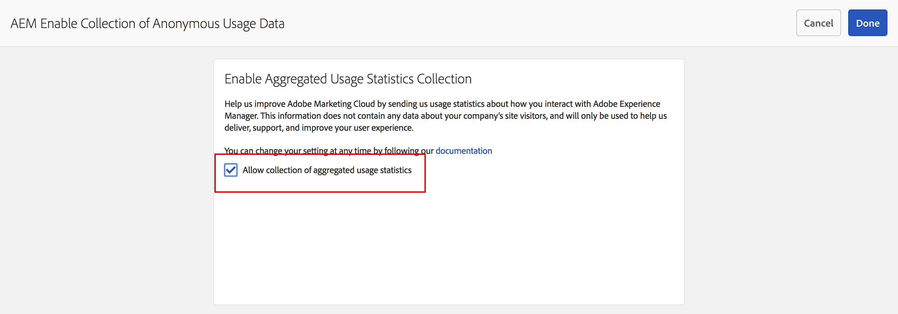

# 집계된 사용 통계 수집 선택{#opting-into-aggregated-usage-statistics-collection}

## 소개 {#introduction}

AEM(Adobe Experience Cloud)과 상호 작용하는 방법에 대한 Adobe 통계를 전송하여 Adobe Experience Manager을 개선하는 데 도움이 될 수 있습니다. 이 정보에는 회사의 사이트 방문자에 대한 데이터가 포함되어 있지 않으며, Adobe이 사용자 경험을 제공, 지원 및 개선하는 데만 사용됩니다.

Touch UI 또는 웹 콘솔을 사용하여 사용 통계 수집을 선택할 수 있습니다.

>[!NOTE]
>
>GDPR 및 CCPA와 같은 다양한 데이터 보호 및 개인 정보 보호 규정이 있습니다. AEM Sites은 데이터 보호 및 개인정보 보호 규정 준수 의무와 관련하여 고객을 지원할 준비가 되어 있습니다. 이 페이지는 고객에게 집계된 사용 통계 수집을 옵트인(또는 옵트아웃)하는 절차를 안내합니다.
>
>자세한 내용은 [Adobe 개인정보 보호 센터](https://www.adobe.com/kr/privacy.html).

>[!NOTE]
>
>다음을 사용하여 언제든지 옵트아웃할 수 있습니다. [웹 콘솔](/help/sites-deploying/opt-in-aggregated-usage-statistics.md#opt-in-by-using-the-web-console) 또는 AEM 옵트인 화면에서 옵트인 옵션을 선택하지 않습니다.

## Touch UI를 사용한 옵트인 {#opt-in-by-using-the-touch-ui}

AEM을 처음 시작하면 다음과 같이 Touch UI를 사용하여 옵트인할 수 있습니다.

1. AEM 탐색 화면에서 **받은 편지함** (벨) 아이콘.

   

1. 드롭다운 목록에서 &quot;**집계된 사용 통계 수집 활성화**&quot;.

   

1. 옵트인 화면에서 &quot;**집계된 사용 통계 수집 허용**&quot;.

   

1. 클릭 &quot;**완료**&quot;.

## 웹 콘솔을 사용한 옵트인 {#opt-in-by-using-the-web-console}

다음과 같이 웹 콘솔을 사용하여 옵트인(또는 옵트아웃)할 수 있습니다.

1. AEM 탐색 화면에서 **도구** 그런 다음 **작업**.

   

1. 작업 창에서 다음을 클릭합니다. **웹 콘솔**.

   

1. 검색 대상&#x200B;**집계된 사용 통계 수집**&quot;.
1. 다음을 클릭합니다. **편집** 아이콘.

   

1. 다음 항목 선택 **활성화됨** 확인란. 또는 사용 통계 수집을 옵트아웃하려는 경우 확인란을 선택 취소할 수 있습니다.

   

1. **저장**&#x200B;을 클릭합니다.
