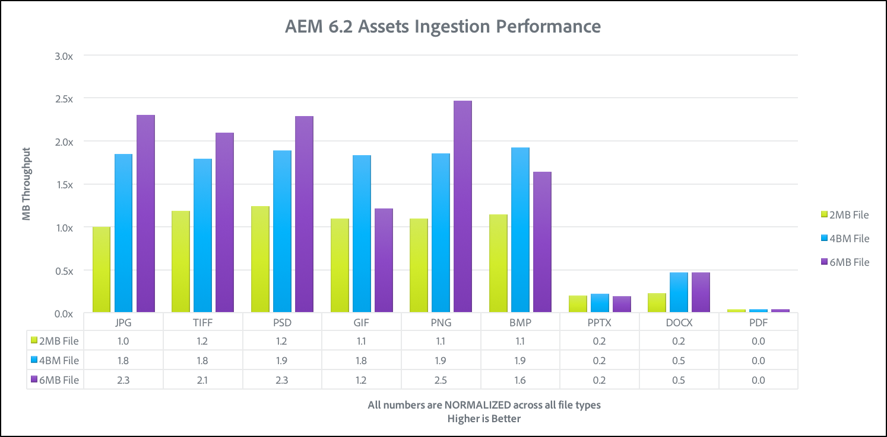
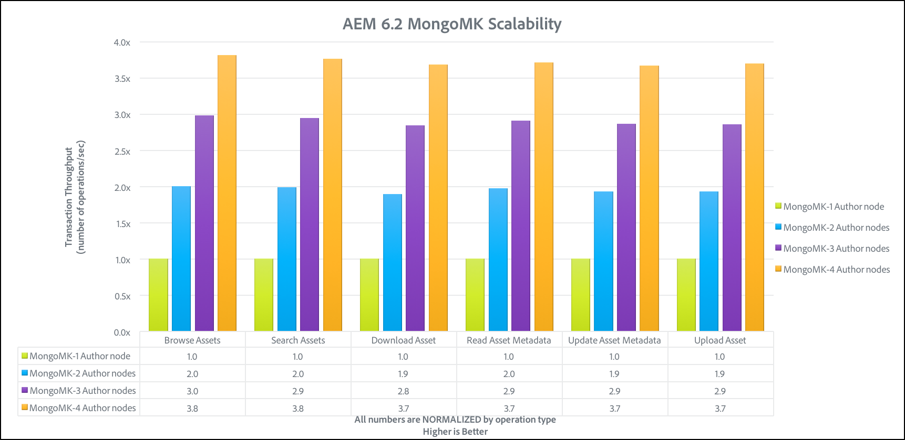

# 성능 지침{#performance-guidelines}

이 페이지에서는 AEM 배포 성능을 최적화하는 방법에 대한 일반 지침을 제공합니다. AEM을 처음 사용하는 경우 성능 지침을 읽기 전에 다음 페이지를 검토하십시오.

* [AEM 기본 개념](/help/sites-deploying/deploy.md#basic-concepts)
* [AEM의 스토리지 개요](/help/sites-deploying/storage-elements-in-aem-6.md#overview-of-storage-in-aem)
* [권장 배포](/help/sites-deploying/recommended-deploys.md)
* [기술 요구 사항](/help/sites-deploying/technical-requirements.md)

아래 그림은 AEM에 사용할 수 있는 배포 옵션(모든 옵션을 보려면 스크롤)입니다.

<table>
 <tbody>
  <tr>
   <td>
<strong>AEM</strong>
 
<strong>제품</strong>
 </td>
   <td>
<strong>토폴로지</strong>
 </td>
   <td>
<strong>운영 체제</strong>
 </td>
   <td>
<strong>응용 프로그램 서버</strong>
 </td>
   <td>
<strong>JRE</strong>
 </td>
   <td>
<strong>보안</strong>
 </td>
   <td>
<strong>마이크로 커널</strong>
 </td>
   <td>
<strong>데이터 저장소</strong>
 </td>
   <td>
<strong>색인 생성</strong>
 </td>
   <td>
<strong>웹 서버</strong>
 </td>
   <td>
<strong>브라우저</strong>
 </td>
   <td>
<strong>Marketing Cloud</strong>
 </td>
  </tr>
  <tr>
   <td>
Sites
 </td>
   <td>
비-HA
 </td>
   <td>
Windows
 </td>
   <td>
CQSE
 </td>
   <td>
Oracle
 </td>
   <td>
LDAP
 </td>
   <td>
Tar
 </td>
   <td>
세그먼트
 </td>
   <td>
속성
 </td>
   <td>
Apache
 </td>
   <td>
Edge
 </td>
   <td>
대상
 </td>
  </tr>
  <tr>
   <td>
에셋
 </td>
   <td>
Publish-HA
 </td>
   <td>
Solaris
 </td>
   <td>
WebLogic
 </td>
   <td>
IBM
 </td>
   <td>
SAML
 </td>
   <td>
MongoDB
 </td>
   <td>
파일
 </td>
   <td>
Lucene
 </td>
   <td>
IIS
 </td>
   <td>
IE
 </td>
   <td>
분석
 </td>
  </tr>
  <tr>
   <td>
커뮤니티
 </td>
   <td>
Author-CS
 </td>
   <td>
빨간색 모자
 </td>
   <td>
WebSphere
 </td>
   <td>
HP
 </td>
   <td>
Oauth
 </td>
   <td>
RDB/Oracle
 </td>
   <td>
S3/Azure
 </td>
   <td>
Solr
 </td>
   <td>
iPlanet
 </td>
   <td>
FireFox
 </td>
   <td>
캠페인
 </td>
  </tr>
  <tr>
   <td>
Forms
 </td>
   <td>
작성자 오프로드
 </td>
   <td>
HP-UX
 </td>
   <td>
Tomcat
 </td>
   <td>
 
 </td>
   <td>
 
 </td>
   <td>
RDB/DB2
 </td>
   <td>
MongoDB
 </td>
   <td>
 
 </td>
   <td>
 
 </td>
   <td>
Chrome
 </td>
   <td>
Social
 </td>
  </tr>
  <tr>
   <td>
모바일
 </td>
   <td>
Author-Cluster
 </td>
   <td>
IBM AIX
 </td>
   <td>
JBoss
 </td>
   <td>
 
 </td>
   <td>
 
 </td>
   <td>
RDB/MySQL
 </td>
   <td>
RDBMS
 </td>
   <td>
 
 </td>
   <td>
 
 </td>
   <td>
Safari
 </td>
   <td>
대상자
 </td>
  </tr>
  <tr>
   <td>
다중 사이트
 </td>
   <td>
ASRP
 </td>
   <td>
SUSE
 </td>
   <td>
 
 </td>
   <td>
 
 </td>
   <td>
 
 </td>
   <td>
RDB/SQLServer
 </td>
   <td>
 
 </td>
   <td>
 
 </td>
   <td>
 
 </td>
   <td>
 
 </td>
   <td>
에셋
 </td>
  </tr>
  <tr>
   <td>
상거래
 </td>
   <td>
MSRP
 </td>
   <td>
Apple OS
 </td>
   <td>
 
 </td>
   <td>
 
 </td>
   <td>
 
 </td>
   <td>
 
 </td>
   <td>
 
 </td>
   <td>
 
 </td>
   <td>
 
 </td>
   <td>
 
 </td>
   <td>
활성화
 </td>
  </tr>
  <tr>
   <td>
Dynamic Media
 </td>
   <td>
JSRP
 </td>
   <td>
 
 </td>
   <td>
 
 </td>
   <td>
 
 </td>
   <td>
 
 </td>
   <td>
 
 </td>
   <td>
 
 </td>
   <td>
 
 </td>
   <td>
 
 </td>
   <td>
 
 </td>
   <td>
모바일
 </td>
  </tr>
  <tr>
   <td>
Brand Portal
 </td>
   <td>
J2E
 </td>
   <td>
 
 </td>
   <td>
 
 </td>
   <td>
 
 </td>
   <td>
 
 </td>
   <td>
 
 </td>
   <td>
 
 </td>
   <td>
 
 </td>
   <td>
 
 </td>
   <td>
 
 </td>
   <td>
 
 </td>
  </tr>
  <tr>
   <td>
AoD
 </td>
   <td>
 
 </td>
   <td>
 
 </td>
   <td>
 
 </td>
   <td>
 
 </td>
   <td>
 
 </td>
   <td>
 
 </td>
   <td>
 
 </td>
   <td>
 
 </td>
   <td>
 
 </td>
   <td>
 
 </td>
   <td>
 
 </td>
  </tr>
  <tr>
   <td>
LiveFyre
 </td>
   <td>
 
 </td>
   <td>
 
 </td>
   <td>
 
 </td>
   <td>
 
 </td>
   <td>
 
 </td>
   <td>
 
 </td>
   <td>
 
 </td>
   <td>
 
 </td>
   <td>
 
 </td>
   <td>
 
 </td>
   <td>
 
 </td>
  </tr>
  <tr>
   <td>
스크린
 </td>
   <td>
 
 </td>
   <td>
 
 </td>
   <td>
 
 </td>
   <td>
 
 </td>
   <td>
 
 </td>
   <td>
 
 </td>
   <td>
 
 </td>
   <td>
 
 </td>
   <td>
 
 </td>
   <td>
 
 </td>
   <td>
 
 </td>
  </tr>
  <tr>
   <td>
문서 보안
 </td>
   <td>
 
 </td>
   <td>
 
 </td>
   <td>
 
 </td>
   <td>
 
 </td>
   <td>
 
 </td>
   <td>
 
 </td>
   <td>
 
 </td>
   <td>
 
 </td>
   <td>
 
 </td>
   <td>
 
 </td>
   <td>
 
 </td>
  </tr>
  <tr>
   <td>
프로세스 Mgt
 </td>
   <td>
 
 </td>
   <td>
 
 </td>
   <td>
 
 </td>
   <td>
 
 </td>
   <td>
 
 </td>
   <td>
 
 </td>
   <td>
 
 </td>
   <td>
 
 </td>
   <td>
 
 </td>
   <td>
 
 </td>
   <td>
 
 </td>
  </tr>
  <tr>
   <td>
데스크탑 앱
 </td>
   <td>
 
 </td>
   <td>
 
 </td>
   <td>
 
 </td>
   <td>
 
 </td>
   <td>
 
 </td>
   <td>
 
 </td>
   <td>
 
 </td>
   <td>
 
 </td>
   <td>
 
 </td>
   <td>
 
 </td>
   <td>
 
 </td>
  </tr>
 </tbody>
</table>

>[!NOTE]
>
>성능 지침은 주로 AEM Sites에 적용됩니다.

## 성능 지침을 사용해야 하는 경우 {#when-to-use-the-performance-guidelines}

다음과 같은 경우에는 성능 지침을 사용해야 합니다.

* **최초 배포**: 처음으로 AEM Sites 또는 자산을 배포하려고 할 때 마이크로 커널, 노드 저장소 및 데이터 저장소를 구성할 때 사용할 수 있는 옵션을 이해하는 것이 중요합니다(기본 설정과 비교). 예를 들어 TarMK용 데이터 저장소의 기본 설정을 파일 데이터 저장소로 변경하는 경우가 있습니다.
* **새 버전으로 업그레이드**: 새 버전으로 업그레이드할 때는 실행 중인 환경과 비교하여 성능 차이를 이해하는 것이 중요합니다. 예를 들어, AEM 6.1에서 6.2로 업그레이드 하거나 AEM 6.0 CRX2에서 6.2 OAK로 업그레이드
* **응답 시간이 느립니다.**: 선택한 Nodestore 아키텍처가 요구 사항을 충족하지 않는 경우 다른 토폴로지 옵션과 비교하여 성능 차이를 이해하는 것이 중요합니다. 예를 들어 MongoMK 대신 TarMK를 배포하거나 Amazon S3 또는 Microsoft Azure 데이터 저장소 대신 파일 데이터 저장소를 사용하는 경우가 있습니다.
* **추가 작성자**: 권장 TarMK 토폴로지가 성능 요구 사항을 충족하지 않고 작성자 노드를 업사이징하면 사용 가능한 최대 용량이 되면 3개 이상의 작성자 노드에서 MongoMK를 사용하는 것과 비교하여 성능 차이점을 이해하는 것이 중요합니다. 예를 들어 TarMK 대신 MongoMK를 배포합니다.
* **추가 콘텐츠**: 권장 데이터 저장소 아키텍처가 요구 사항을 충족하지 않는 경우 다른 데이터 저장소 옵션과 비교하여 성능 차이를 이해하는 것이 중요합니다. 예: 파일 데이터 저장소 대신 Amazon S3 또는 Microsoft Azure 데이터 저장소 사용.

## 소개 {#introduction}

이 장에서는 AEM 아키텍처와 가장 중요한 구성 요소에 대한 일반적인 개요를 제공합니다. 또한 개발 지침을 제공하며 TarMK 및 MongoMK 벤치마크 테스트에 사용되는 테스트 시나리오에 대해 설명합니다.

### AEM 플랫폼 {#the-aem-platform}

AEM 플랫폼은 다음 구성 요소로 구성됩니다.

AEM 플랫폼에 대한 자세한 내용은 [AEM 소개](/help/sites-deploying/deploy.md#what-is-aem).

### AEM 아키텍처 {#the-aem-architecture}

AEM 배포에는 세 가지 중요한 구성 요소가 있습니다. 다음 **작성자 인스턴스** 컨텐츠 작성자, 편집자 및 승인자가 컨텐츠를 만들고 검토하는 데 사용하는 컨텐츠입니다. 컨텐츠가 승인되면 이름이 **게시 인스턴스** 최종 사용자가 액세스할 수 있는 위치. 세 번째 빌딩 블록은 **Dispatcher** 캐싱 및 URL 필터링을 처리하는 모듈이며 웹 서버에 설치됩니다. AEM 아키텍처에 대한 자세한 내용은 [일반적인 배포 시나리오](/help/sites-deploying/deploy.md#typical-deployment-scenarios).

### 마이크로 커널들 {#micro-kernels}

Micro Kernels는 AEM에서 지속성 관리자 역할을 합니다. AEM에 사용되는 세 가지 유형의 마이크로 커널이 있습니다. TarMK, MongoDB 및 관계형 데이터베이스(제한된 지원 아래). 고려하고 있는 인스턴스의 목적 및 배포 유형에 따라 본인의 요구에 맞는 것을 하나 선택합니다. 마이크로 커널에 대한 자세한 내용은 [권장 배포](/help/sites-deploying/recommended-deploys.md) 페이지.

### 노데스토르 {#nodestore}

AEM에서 이진 데이터는 컨텐츠 노드와 독립적으로 저장할 수 있습니다. 이진 데이터가 저장되는 위치를 **데이터 저장소**&#x200B;인 반면 컨텐츠 노드 및 속성의 위치는 **노드 저장소**.

>[!NOTE]
>
>Adobe은 TarMK를 AEM 작성자 및 게시 인스턴스 둘 다에 대해 고객이 사용하는 기본 지속성 기술로 권장합니다.

>[!CAUTION]
>
>관계형 데이터베이스 마이크로 커널은 제한된 지원 하에 있습니다. 연락처 [고객 지원 Adobe](https://helpx.adobe.com/kr/marketing-cloud/contact-support.html) 이러한 유형의 마이크로 커널을 사용하기 전에

### 데이터 저장소 {#data-store}

많은 바이너리를 처리할 때 성능을 최대화하기 위해 기본 노드 저장소 대신 외부 데이터 저장소를 사용하는 것이 좋습니다. 예를 들어 프로젝트에 많은 미디어 자산이 필요한 경우 파일 또는 Azure/S3 데이터 저장소 아래에 저장하면 MongoDB에 직접 저장하는 것보다 더 빠르게 미디어 자산에 액세스할 수 있습니다.

사용 가능한 구성 옵션에 대한 자세한 내용은 [노드 및 데이터 저장소 구성](/help/sites-deploying/data-store-config.md).

>[!NOTE]
>
>Adobe은 Adobe Managed Services를 사용하여 AEM을 Azure에 배포하거나 Amazon Web Services(AWS)에 배포하는 옵션을 선택할 것을 권장합니다. 이 경우 고객은 이러한 클라우드 컴퓨팅 환경에서 AEM을 배포하고 운영하는 경험과 기술을 갖춘 팀으로부터 혜택을 받을 수 있습니다. 다음을 확인하십시오 [Adobe Managed Services에 대한 추가 설명서](https://www.adobe.com/marketing-cloud/enterprise-content-management/managed-services-cloud-platform.html?aemClk=t).
>
>Adobe Managed Services의 외부에서 Azure 또는 AWS에 AEM을 배포하는 방법에 대한 권장 사항을 제공하려면 클라우드 제공업체 또는 선택한 클라우드 환경에서 AEM을 배포하도록 지원하는 Adobe 파트너 중 하나와 직접 작업하는 것이 좋습니다. 선택한 클라우드 제공업체 또는 파트너는 특정 성능, 로드, 확장성 및 보안 요구 사항을 충족하기 위해 지원할 아키텍처의 크기 조정 사양, 디자인 및 구현을 책임집니다.
>
>자세한 내용은 [기술 요구 사항](/help/sites-deploying/technical-requirements.md#supported-platforms) 페이지.

### 검색 {#search-features}

이 섹션에 나열된 항목은 AEM과 함께 사용되는 사용자 지정 인덱스 공급자입니다. 색인에 대한 자세한 내용은 [Oak 쿼리 및 색인 지정](/help/sites-deploying/queries-and-indexing.md).

>[!NOTE]
>
>대부분의 배포의 경우 Lucene 인덱스를 사용하는 것이 좋습니다. 특수 및 복잡한 배포에 Solr만 사용해야 합니다.

### 개발 지침 {#development-guidelines}

타겟 AEM용으로 개발해야 합니다 **성능 및 확장성**. 다음은 따라야 할 많은 모범 사례입니다.

**DO**

* 프레젠테이션, 논리 및 컨텐츠 분리 적용
* 기존 AEM API 사용(예: Sling) 및 툴(예: 복제)
* 실제 컨텐츠 컨텍스트에서 개발
* 최적의 캐시 성능을 위한 개발
* 저장 횟수 최소화(예: 임시 워크플로우 사용
* 모든 HTTP 종료 포인트가 RESTful인지 확인합니다.
* JCR 관찰 범위 제한
* 비동기 스레드에 주의하십시오

**금지**

* 가능하면 JCR API를 직접 사용하지 마십시오
* /libs를 변경하지 말고 오버레이를 사용하십시오
* 가능하면 쿼리를 사용하지 마십시오
* Sling 바인딩을 사용하여 Java 코드에서 OSGi 서비스를 가져오지 않고 를 사용합니다.

   * @Reference in a DS 구성 요소
   * @Inject 모델
   * Sightly 사용 클래스의 sling.getService()
   * JSP의 sling.getService()
   * a ServiceTracker
   * OSGi 서비스 레지스트리에 대한 직접 액세스

AEM 개발에 대한 자세한 내용은 [개발 - 기본 사항](/help/sites-developing/the-basics.md). 추가 우수 사례에 대해서는 [개발 우수 사례](/help/sites-developing/best-practices.md).

### 벤치마크 시나리오 {#benchmark-scenarios}

>[!NOTE]
>
>이 페이지에 표시되는 모든 벤치마크 테스트는 실험 설정에서 수행되었습니다.

아래에 자세히 설명된 테스트 시나리오는 TarMK, MongoMk 및 TarMK 및 MongoMk 장의 벤치마크 섹션에 사용됩니다. 특정 벤치마크 테스트에 사용된 시나리오를 보려면 [기술 사양](/help/sites-deploying/performance-guidelines.md#tarmk-performance-benchmark) 테이블.

**단일 제품 시나리오**

AEM Assets:

* 사용자 상호 작용: 자산 찾아보기 / 자산 검색 / 자산 다운로드 / 자산 메타데이터 읽기 / 자산 메타데이터 업데이트 / 자산 업로드 / 자산 업로드 워크플로우 실행
* 실행 모드: 동시 사용자, 사용자당 단일 상호 작용

**혼합 제품 시나리오**

AEM Sites + 자산:

* 사이트 사용자 상호 작용: 문서 페이지 읽기 / 페이지 읽기 / 단락 만들기 / 단락 편집 / 컨텐츠 페이지 만들기 / 컨텐츠 페이지 활성화 / 작성자 검색
* 자산 사용자 상호 작용: 자산 찾아보기 / 자산 검색 / 자산 다운로드 / 자산 메타데이터 읽기 / 자산 메타데이터 업데이트 / 자산 업로드 / 자산 업로드 워크플로우 실행
* 실행 모드: 동시 사용자, 사용자당 혼합 상호 작용

**세로 사용 사례 시나리오**

미디어:

* 문서 페이지 읽기(27.4%), 읽기 페이지(10.9%), 세션 만들기(2.6%), 컨텐츠 페이지 활성화(1.7%), 컨텐츠 페이지 작성(0.4%), 단락 만들기(4.3%), 단락 편집(0.9%), 이미지 구성 요소(0.9%), 자산 읽기(20%), 자산 다운로드(4.5%), 자산 다운로드(4.2%), 자산 업데이트(2.0%), 자산 검색(2.0%), 자산 업데이트(2.0%) (2.4%), 자산 업로드(1.2%), 탐색 프로젝트(4.9%), 프로젝트 읽기(6.6%), 프로젝트 추가 자산(1.2%), 프로젝트 추가 사이트(1.2%), 프로젝트 만들기(0.1%), 작성자 검색(0.4%)
* 실행 모드: 동시 사용자, 사용자당 혼합 상호 작용

## TarMK {#tarmk}

이 장에서는 최소 아키텍처 요구 사항 및 설정 구성을 지정하는 TarMK에 대한 일반 성능 지침을 제공합니다. 벤치마크 테스트도 더 명확히 하기 위해 제공됩니다.

Adobe은 TarMK를 AEM 작성자 및 게시 인스턴스 모두에 대해 모든 배포 시나리오에서 고객이 사용하는 기본 지속성 기술로 권장합니다.

TarMK에 대한 자세한 내용은 [배포 시나리오](/help/sites-deploying/recommended-deploys.md#deployment-scenarios) 및 [Tar 저장소](/help/sites-deploying/storage-elements-in-aem-6.md#tar-storage).

### TarMK 최소 아키텍처 지침 {#tarmk-minimum-architecture-guidelines}

>[!NOTE]
>
>아래에 나와 있는 최소 아키텍처 지침은 프로덕션 환경과 높은 트래픽 사이트에 대한 것입니다. 이것들은 **not** a [최소 사양](/help/sites-deploying/technical-requirements.md#prerequisites) AEM을 실행하는 데 필요합니다.

TarMK를 사용할 때 성능을 제대로 설정하려면 다음 아키텍처에서 시작해야 합니다.

* 작성자 인스턴스 1개
* 두 개의 게시 인스턴스
* Dispatcher 2명

아래 그림은 AEM Sites 및 AEM Assets에 대한 아키텍처 지침입니다.

>[!NOTE]
>
>바이너리 없는 복제 기능 사용 **설정** 파일 데이터 저장소가 공유되는 경우

**AEM Sites에 대한 Tar 아키텍처 지침**

**AEM Assets에 대한 Tar 아키텍처 지침**

### TarMK 설정 지침 {#tarmk-settings-guideline}

성능을 향상시키기 위해 아래에 표시된 설정 지침을 따라야 합니다. 설정을 변경하는 방법에 대한 지침은 [이 페이지 보기](https://helpx.adobe.com/experience-manager/kb/performance-tuning-tips.html).

<table>
 <tbody>
  <tr>
   <td><strong>설정</strong></td>
   <td><strong>매개변수</strong></td>
   <td><strong>값</strong></td>
   <td><strong>설명</strong></td>
  </tr>
  <tr>
   <td>Sling 작업 큐</td>
   <td><code>queue.maxparallel</code></td>
   <td>값을 CPU 코어 수의 절반으로 설정합니다. </td>
   <td>기본적으로 작업 큐당 동시 스레드 수는 CPU 코어 수와 같습니다.</td>
  </tr>
  <tr>
   <td>Granite Transient 워크플로 큐</td>
   <td><code>Max Parallel</code></td>
   <td>값을 CPU 코어 수의 절반으로 설정합니다.</td>
   <td> </td>
  </tr>
  <tr>
   <td>JVM 매개 변수</td>
   <td>
<code>Doak.queryLimitInMemory</code>
 
<code>Doak.queryLimitReads</code>
 
<code>Dupdate.limit</code>
 
<code>Doak.fastQuerySize</code>
 </td>
   <td>
500000
 
100000
 
250000
 
True
 </td>
   <td>AEM 시작 스크립트에 이러한 JVM 매개 변수를 추가하여 광범위한 쿼리가 시스템을 오버로드하지 못하도록 합니다.</td>
  </tr>
  <tr>
   <td>Lucene 인덱스 구성</td>
   <td>
<code>CopyOnRead</code>
 
<code>CopyOnWrite</code>
 
<code>Prefetch Index Files</code>
 </td>
   <td>
활성화됨
 
활성화됨
 
활성화됨
 </td>
   <td>사용 가능한 매개 변수에 대한 자세한 내용은 <a href="https://jackrabbit.apache.org/oak/docs/query/lucene.html">이 페이지</a>.</td>
  </tr>
  <tr>
   <td>데이터 저장소 = S3 데이터 저장소</td>
   <td>
<code>maxCachedBinarySize</code>
 
<code>cacheSizeInMB</code>
 </td>
   <td>
1048576(1MB) 이하
 
최대 heap 크기의 2-10%
 </td>
   <td>참조 - <a href="/help/sites-deploying/data-store-config.md#data-store-configurations">데이터 저장소 구성</a>.</td>
  </tr>
  <tr>
   <td>DAM 자산 업데이트 워크플로우</td>
   <td><code>Transient Workflow</code></td>
   <td>선택함</td>
   <td>이 워크플로우는 자산 업데이트를 관리합니다.</td>
  </tr>
  <tr>
   <td>DAM 메타데이터 원본에 쓰기</td>
   <td><code>Transient Workflow</code></td>
   <td>선택함</td>
   <td>이 워크플로우는 원래 바이너리에 대한 XMP 다시 쓰기를 관리하고 JCR에서 마지막으로 수정한 날짜를 설정합니다.</td>
  </tr>
 </tbody>
</table>

### TarMK 성능 벤치마크 {#tarmk-performance-benchmark}

#### 기술 사양 {#technical-specifications}

벤치마크 테스트는 다음 사양에 따라 수행되었습니다.

|  | **작성자 노드** |
|---|---|
| 서버 | 베어 메탈 하드웨어(HP) |
| 운영 체제 | RedHat Linux |
| CPU/코어 | Intel(R) Xeon(R) CPU E5-2407 @2.40GHz, 8개 코어 |
| RAM | 32GB |
| 디스크 | 자석 |
| Java | Oracle JRE 버전 8 |
| JVM Heap | 16GB |
| 제품 | AEM 6.2 |
| 노데스토르 | TarMK |
| 데이터 저장소 | 파일 DS |
| 시나리오 | 단일 제품: 자산 / 30개의 동시 스레드 |

#### 성능 벤치마크 결과 {#performance-benchmark-results}

>[!NOTE]
>
>아래 표시된 숫자는 기준 요소로 1로 표준화되었으며 실제 처리량 숫자는 아닙니다.

 

## MongoMK {#mongomk}

TarMK보다 MongoMK 지속성 백엔드를 선택하는 주된 이유는 인스턴스를 가로로 크기 조절하기 위한 것입니다. 즉, 두 개 이상의 활성 작성자 인스턴스가 항상 실행되고 MongoDB를 지속성 스토리지 시스템으로 사용합니다. 일반적으로 두 개 이상의 작성 인스턴스를 실행해야 하는 이유는 모든 동시 작성 활동을 지원하는 단일 서버의 CPU 및 메모리 용량이 더 이상 지속되지 않기 때문입니다.

TarMK에 대한 자세한 내용은 [배포 시나리오](/help/sites-deploying/recommended-deploys.md#deployment-scenarios) 및 [Mongo 저장소](/help/sites-deploying/storage-elements-in-aem-6.md#mongo-storage).

### MongoMK 최소 아키텍처 지침 {#mongomk-minimum-architecture-guidelines}

MongoMK를 사용할 때 좋은 성능을 설정하려면 다음 아키텍처에서 시작해야 합니다.

* 세 개의 작성자 인스턴스
* 두 개의 게시 인스턴스
* 세 개의 MongoDB 인스턴스
* Dispatcher 2명

>[!NOTE]
>
>운영 환경에서 MongoDB는 항상 운영 및 2개의 보조 복제본이 있는 복제 세트로 사용됩니다. 읽기 및 쓰기 작업은 운영 사이트로 이동하고 읽기는 보조 스토리지로 이동할 수 있습니다. 스토리지를 사용할 수 없는 경우 보조 노드 중 하나를 중재자로 교체할 수 있지만 MongoDB 복제본 세트는 항상 인스턴스 수가 홀수로 구성되어야 합니다.

>[!NOTE]
>
>바이너리 없는 복제 기능 사용 **설정** 파일 데이터 저장소가 공유되는 경우

### MongoMK 설정 지침 {#mongomk-settings-guidelines}

성능을 향상시키기 위해 아래에 표시된 설정 지침을 따라야 합니다. 설정을 변경하는 방법에 대한 지침은 [이 페이지 보기](https://helpx.adobe.com/experience-manager/kb/performance-tuning-tips.html).

<table>
 <tbody>
  <tr>
   <td><strong>설정</strong></td>
   <td><strong>매개변수</strong></td>
   <td><strong>값(기본값)</strong></td>
   <td><strong>설명</strong></td>
  </tr>
  <tr>
   <td>Sling 작업 큐</td>
   <td><code>queue.maxparallel</code></td>
   <td>값을 CPU 코어 수의 절반으로 설정합니다. </td>
   <td>기본적으로 작업 큐당 동시 스레드 수는 CPU 코어 수와 같습니다.</td>
  </tr>
  <tr>
   <td>Granite Transient 워크플로 큐</td>
   <td><code>Max Parallel</code></td>
   <td>값을 CPU 코어 수의 절반으로 설정합니다.</td>
   <td> </td>
  </tr>
  <tr>
   <td>JVM 매개 변수</td>
   <td>
<code>Doak.queryLimitInMemory</code>
 
<code>Doak.queryLimitReads</code>
 
<code>Dupdate.limit</code>
 
<code>Doak.fastQuerySize</code>
 
<code>Doak.mongo.maxQueryTimeMS</code>
 </td>
   <td>
500000
 
100000
 
250000
 
True
 
60000
 </td>
   <td>AEM 시작 스크립트에 이러한 JVM 매개 변수를 추가하여 광범위한 쿼리가 시스템을 오버로드하지 못하도록 합니다.</td>
  </tr>
  <tr>
   <td>Lucene 인덱스 구성</td>
   <td>
<code>CopyOnRead</code>
 
<code>CopyOnWrite</code>
 
<code>Prefetch Index Files</code>
 </td>
   <td>
활성화됨
 
활성화됨
 
활성화됨
 </td>
   <td>사용 가능한 매개 변수에 대한 자세한 내용은 <a href="https://jackrabbit.apache.org/oak/docs/query/lucene.html">이 페이지</a>.</td>
  </tr>
  <tr>
   <td>데이터 저장소 = S3 데이터 저장소</td>
   <td>
<code>maxCachedBinarySize</code>
 
<code>cacheSizeInMB</code>
 </td>
   <td>
1048576(1MB) 이하
 
최대 heap 크기의 2-10%
 </td>
   <td>참조 - <a href="/help/sites-deploying/data-store-config.md#data-store-configurations">데이터 저장소 구성</a>.</td>
  </tr>
  <tr>
   <td>DocumentNodeStoreService</td>
   <td>
<code>cache</code>
 
<code>nodeCachePercentage</code>
 
<code>childrenCachePercentage</code>
 
<code>diffCachePercentage</code>
 
<code>docChildrenCachePercentage</code>
 
<code>prevDocCachePercentage</code>
 
<code>persistentCache</code>
 </td>
   <td>
2048년
 
35 (25)
 
20 (10)
 
30 (5)
 
10 (3)
 
4. 4
 
./cache,size=2048,binary=0,-compact,-compress
 </td>
   <td>
캐시의 기본 크기가 256MB로 설정되어 있습니다.
 
캐시 무효화를 수행하는 데 걸리는 시간에 영향을 줍니다.
 </td>
  </tr>
  <tr>
   <td>oak-observation</td>
   <td>
<code>thread pool</code>
 
<code>length</code>
 </td>
   <td>
min 및 max = 20
 
50000
 </td>
   <td> </td>
  </tr>
 </tbody>
</table>

### MongoMK 성능 벤치마크 {#mongomk-performance-benchmark}

### 기술 사양 {#technical-specifications-1}

벤치마크 테스트는 다음 사양에 따라 수행되었습니다.

|  | **작성자 노드** | **MongoDB 노드** |
|---|---|---|
| 서버 | 베어 메탈 하드웨어(HP) | 베어 메탈 하드웨어(HP) |
| 운영 체제 | RedHat Linux | RedHat Linux |
| CPU/코어 | Intel(R) Xeon(R) CPU E5-2407 @2.40GHz, 8개 코어 | Intel(R) Xeon(R) CPU E5-2407 @2.40GHz, 8개 코어 |
| RAM | 32GB | 32GB |
| 디스크 | 마그네틱 - 1k IOPS 이상 | 마그네틱 - 1k IOPS 이상 |
| Java | Oracle JRE 버전 8 | 해당 없음 |
| JVM Heap | 16GB | 해당 없음 |
| 제품 | AEM 6.2 | MongoDB 3.2 WiredTiger |
| 노데스토르 | MongoMK | 해당 없음 |
| 데이터 저장소 | 파일 DS | 해당 없음 |
| 시나리오 | 단일 제품: 자산 / 30개의 동시 스레드 | 단일 제품: 자산 / 30개의 동시 스레드 |

### 성능 벤치마크 결과 {#performance-benchmark-results-1}

>[!NOTE]
>
>아래 표시된 숫자는 기준 요소로 1로 표준화되었으며 실제 처리량 숫자는 아닙니다.

 

## TarMK와 MongoMK 비교 {#tarmk-vs-mongomk}

두 가지 중 하나를 선택할 때 고려해야 하는 기본 규칙은 TarMK가 성능용으로 설계된 반면 MongoMK는 확장성을 위해 사용됩니다. Adobe은 TarMK를 AEM 작성자 및 게시 인스턴스 모두에 대해 모든 배포 시나리오에서 고객이 사용하는 기본 지속성 기술로 권장합니다.

TarMK보다 MongoMK 지속성 백엔드를 선택하는 주된 이유는 인스턴스를 가로로 크기 조절하기 위한 것입니다. 즉, 두 개 이상의 활성 작성자 인스턴스가 항상 실행되고 MongoDB를 지속성 스토리지 시스템으로 사용합니다. 일반적으로 두 개 이상의 작성 인스턴스를 실행해야 하는 이유는 모든 동시 작성 활동을 지원하는 단일 서버의 CPU 및 메모리 용량이 더 이상 지속되지 않기 때문입니다.

TarMK와 MongoMK에 대한 자세한 내용은 [권장 배포](/help/sites-deploying/recommended-deploys.md#microkernels-which-one-to-use).

### TarMK와 MongoMk 지침 {#tarmk-vs-mongomk-guidelines}

**TarMK의 이점**

* 콘텐츠 관리 애플리케이션을 위한 용도
* 파일은 항상 일관되며 파일 기반 백업 툴을 사용하여 백업할 수 있습니다
* 페일오버 메커니즘을 제공합니다. 자세한 내용은 [콜드 대기](/help/sites-deploying/tarmk-cold-standby.md) 자세한 내용
* 운영 오버헤드를 최소화하면서 고성능 및 안정적인 데이터 스토리지 제공
* TCO 절감(총 소유 비용)

**MongoMK 선택 기준**

* 하루에 연결된 명명된 사용자 수: 수천, 그 이상으로
* 동시 사용자 수: 100개 이상
* 일별 자산 수집 볼륨: 수십만이나 그 이상
* 일별 페이지 편집 볼륨: 수십만이나 그 이상
* 일일 검색 양: 수만 혹은 그 이상

### TarMK와 MongoMK 벤치마크 비교 {#tarmk-vs-mongomk-benchmarks}

>[!NOTE]
>
>아래 표시된 숫자가 기준 요소로 1로 표준화되었으며 실제 처리량 숫자는 아닙니다.

### 시나리오 1 기술 사양 {#scenario-technical-specifications}

<table>
 <tbody>
  <tr>
   <td><strong> </strong></td>
   <td><strong>작성자 OAK 노드</strong></td>
   <td><strong>MongoDB 노드</strong></td>
   <td> </td>
  </tr>
  <tr>
   <td>서버</td>
   <td>베어 메탈 하드웨어(HP)</td>
   <td>베어 메탈 하드웨어(HP)</td>
   <td> </td>
  </tr>
  <tr>
   <td>운영 체제</td>
   <td>RedHat Linux</td>
   <td>RedHat Linux</td>
   <td> </td>
  </tr>
  <tr>
   <td>CPU/코어</td>
   <td>Intel(R) Xeon(R) CPU E5-2407 @2.40GHz, 8개 코어</td>
   <td>Intel(R) Xeon(R) CPU E5-2407 @2.40GHz, 8개 코어</td>
   <td> </td>
  </tr>
  <tr>
   <td>RAM</td>
   <td>32GB</td>
   <td>32GB</td>
   <td> </td>
  </tr>
  <tr>
   <td>디스크</td>
   <td>마그네틱 - 1k IOPS 이상</td>
   <td>마그네틱 - 1k IOPS 이상</td>
   <td> </td>
  </tr>
  <tr>
   <td>Java</td>
   <td>Oracle JRE 버전 8</td>
   <td>해당 없음</td>
   <td> </td>
  </tr>
  <tr>
   <td>JVM Heap16GB</td>
   <td>16GB</td>
   <td>해당 없음</td>
   <td> </td>
  </tr>
  <tr>
   <td>제품 </td>
   <td>AEM 6.2</td>
   <td>MongoDB 3.2 WiredTiger</td>
   <td> </td>
  </tr>
  <tr>
   <td>노데스토르</td>
   <td>TarMK 또는 MongoMK</td>
   <td>해당 없음</td>
   <td> </td>
  </tr>
  <tr>
   <td>데이터 저장소</td>
   <td>파일 DS </td>
   <td>해당 없음</td>
   <td> </td>
  </tr>
  <tr>
   <td>시나리오</td>
   <td>
  단일 제품: 실행당 자산 / 30개의 동시 스레드 수
 </td>
   <td> </td>
   <td> </td>
  </tr>
 </tbody>
</table>

### 시나리오 1 성능 벤치마크 결과 {#scenario-performance-benchmark-results}

### 시나리오 2 기술 사양 {#scenario-technical-specifications-1}

>[!NOTE]
>
>MongoDB와 TarMK 시스템 한 대와 동일한 수의 작성자를 활성화하려면 두 개의 AEM 노드가 있는 클러스터가 필요합니다. 네 개의 노드 MongoDB 클러스터는 Author의 1.8배를 TarMK 인스턴스보다 처리할 수 있습니다. 8개의 노드 MongoDB 클러스터는 Authors 수의 2.3배를 TarMK 인스턴스보다 처리할 수 있습니다.

<table>
 <tbody>
  <tr>
   <td><strong> </strong></td>
   <td><strong>작성자 TarMK 노드</strong></td>
   <td><strong>작성자 MongoMK 노드</strong></td>
   <td><strong>MongoDB 노드</strong></td>
  </tr>
  <tr>
   <td>서버</td>
   <td>AWS c3.8xlarge</td>
   <td>AWS c3.8xlarge</td>
   <td>AWS c3.8xlarge</td>
  </tr>
  <tr>
   <td>운영 체제</td>
   <td>RedHat Linux</td>
   <td>RedHat Linux</td>
   <td>RedHat Linux</td>
  </tr>
  <tr>
   <td>CPU/코어</td>
   <td>32</td>
   <td>32</td>
   <td>32</td>
  </tr>
  <tr>
   <td>RAM</td>
   <td>60GB</td>
   <td>60GB</td>
   <td>60GB</td>
  </tr>
  <tr>
   <td>디스크</td>
   <td>SSD - 10k IOPS</td>
   <td>SSD - 10k IOPS</td>
   <td>SSD - 10k IOPS</td>
  </tr>
  <tr>
   <td>Java</td>
   <td>Oracle JRE 버전 8</td>
   <td>  Oracle JRE 버전 8</td>
   <td>해당 없음</td>
  </tr>
  <tr>
   <td>JVM Heap16GB</td>
   <td>30GB</td>
   <td>30GB</td>
   <td>해당 없음</td>
  </tr>
  <tr>
   <td>제품 </td>
   <td>AEM 6.2</td>
   <td>AEM 6.2</td>
   <td>  MongoDB 3.2 WiredTiger</td>
  </tr>
  <tr>
   <td>노데스토르</td>
   <td>TarMK </td>
   <td>MongoMK</td>
   <td>  해당 없음</td>
  </tr>
  <tr>
   <td>데이터 저장소</td>
   <td>파일 DS </td>
   <td>  파일 DS</td>
   <td>  해당 없음</td>
  </tr>
  <tr>
   <td>시나리오</td>
   <td>
    세로 사용 사례: 미디어 / 2000개의 동시 스레드
 </td>
   <td></td>
   <td></td>
  </tr>
 </tbody>
</table>

### 시나리오 2 성능 벤치마크 결과 {#scenario-performance-benchmark-results-1}

### AEM Sites 및 자산을 위한 아키텍처 확장성 지침 {#architecture-scalability-guidelines-for-aem-sites-and-assets}

## 성능 지침 요약  {#summary-of-performance-guidelines}

이 페이지에 제시된 지침은 다음과 같이 요약할 수 있습니다.

* **파일 데이터 저장소가 있는 TarMK** 대부분의 고객을 위한 권장 아키텍처입니다.

   * 최소 토폴로지: 작성자 인스턴스 1개, 게시 인스턴스 2개, Dispatcher 2개
   * 파일 데이터 저장소가 공유되면 바이너리 없는 복제가 켜집니다

* **파일 데이터 저장소가 있는 MongoMK** 작성 계층의 수평 확장성을 위한 권장 아키텍처입니다.

   * 최소 토폴로지: 작성자 인스턴스 3개, MongoDB 인스턴스 3개, 게시 인스턴스 2개, Dispatcher 2개
   * 파일 데이터 저장소가 공유되면 바이너리 없는 복제가 켜집니다

* **노데스토르** NAS(Network Attached Storage)가 아니라 로컬 디스크에 저장해야 합니다.
* 사용 시 **Amazon S3**:

   * Amazon S3 데이터 저장소는 작성자와 게시 계층 간에 공유됩니다
   * 바이너리 없는 복제를 설정해야 합니다.
   * 데이터 저장소 가비지 수집에서는 모든 작성자 및 게시 노드에서 먼저 실행한 다음 작성자에서 두 번째 실행이 필요합니다

* **기본 색인과 함께 사용자 지정 색인을 만들어야 합니다** 가장 일반적인 검색 기준

   * Lucene 인덱스는 사용자 지정 인덱스에 사용해야 합니다

* **워크플로우를 사용자 지정하여 성능을 크게 향상시킬 수 있습니다**&#x200B;예를 들어 &quot;자산 업데이트&quot; 워크플로우에서 비디오 단계를 제거하여 사용하지 않는 수신기를 비활성화하는 등의 작업을 수행합니다.

자세한 내용은 [권장 배포](/help/sites-deploying/recommended-deploys.md) 페이지.
