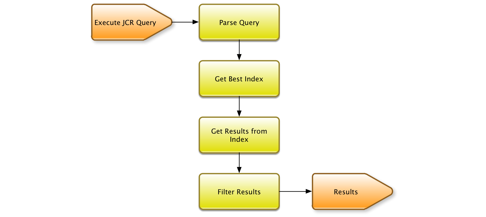
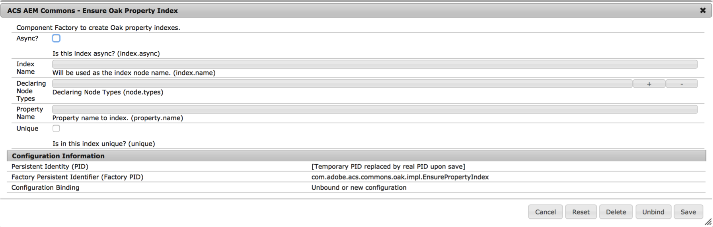

# Oak 쿼리 및 인덱싱{#oak-queries-and-indexing}

>[!NOTE]
>
>이 문서에서는 AEM 6의 색인 구성에 대해 설명합니다. 쿼리 및 색인 성능 최적화에 대한 우수 사례를 보려면 [쿼리 및 색인화에 대한 우수 사례](/help/sites-deploying/best-practices-for-queries-and-indexing.md)를 참조하십시오.

## 소개 {#introduction}

Jackrabbit 2와 달리 Oak는 기본적으로 컨텐츠를 색인화하지 않습니다. 기존 관계형 데이터베이스와 마찬가지로 필요한 경우 사용자 정의 인덱스를 만들어야 합니다. 특정 쿼리에 대한 인덱스가 없는 경우 많은 노드가 순회될 수 있습니다. 쿼리는 여전히 작동하지만 매우 느릴 수 있습니다.

Oak에 색인이 없는 쿼리가 나타나면 WARN 수준 로그 메시지가 인쇄됩니다.

```xml
*WARN* Traversed 1000 nodes with filter Filter(query=select ...) consider creating an index or changing the query
```

## 지원되는 쿼리 언어 {#supported-query-languages}

Oak 쿼리 엔진은 다음 언어를 지원합니다.

* XPath(권장)
* SQL-2
* SQL(사용되지 않음)
* JQOM

## 인덱서 유형 및 비용 계산 {#indexer-types-and-cost-calculation}

Apache Oak 기반 백엔드를 사용하여 저장소에 다른 인덱서를 연결할 수 있습니다.

인덱서 하나는 **속성 인덱스**&#x200B;이며, 이 인덱스 정의는 저장소 자체에 저장됩니다.

**Apache Lucene** 및 **Solr**&#x200B;에 대한 구현도 기본적으로 사용할 수 있으며, 모두 전체 텍스트 인덱싱을 지원합니다.

다른 인덱서를 사용할 수 없는 경우 **순회 인덱스**&#x200B;가 사용됩니다. 즉, 컨텐츠가 인덱싱되지 않고 컨텐츠 노드가 검색되어 쿼리에 일치하는 항목을 찾습니다.

쿼리에 여러 인덱서를 사용할 수 있는 경우 사용 가능한 각 인덱서는 쿼리 실행 비용을 예상합니다. 그런 다음 Oak는 예상 비용이 가장 낮은 인덱서를 선택합니다.



위 다이어그램은 Apache Oak의 쿼리 실행 메커니즘을 높은 수준으로 나타냅니다.

먼저 쿼리를 추상 구문 트리로 구문 분석합니다. 그런 다음 쿼리가 확인되고 Oak 쿼리의 기본 언어인 SQL-2로 변환됩니다.

다음으로 각 색인은 쿼리 비용을 예상하기 위해 협의됩니다. 일단 그것이 완성되면, 가장 저렴한 색인의 결과가 검색된다. 마지막으로, 결과를 필터링하여 현재 사용자가 결과에 대한 읽기 권한을 가지고 있고 그 결과가 전체 쿼리와 일치하는지 확인합니다.

## 인덱스 {#configuring-the-indexes} 구성

>[!NOTE]
>
>대규모 저장소의 경우 색인을 작성하는 작업은 시간이 많이 소요됩니다. 이 값은 인덱스를 처음 만들고 다시 색인화(정의를 변경한 후 인덱스 다시 작성)하는 경우 모두 적용됩니다. [Oak 인덱스 문제 해결](/help/sites-deploying/troubleshooting-oak-indexes.md) 및 [느린 다시 인덱싱 방지](/help/sites-deploying/troubleshooting-oak-indexes.md#preventing-slow-re-indexing)를 참조하십시오.

MongoDB를 사용하는 경우와 전체 텍스트 인덱스의 경우, 특히 전체 텍스트 인덱스의 경우 텍스트 사전 추출을 고려하고 oak-run을 사용하여 초기 인덱스를 만들고 다시 색인화할 수 있습니다.

인덱스는 **oak:index** 노드 아래의 저장소의 노드로 구성됩니다.

인덱스 노드의 유형은 **oak:QueryIndexDefinition이어야 합니다.** 각 인덱서에는 노드 속성으로 몇 가지 구성 옵션을 사용할 수 있습니다. 자세한 내용은 아래 각 인덱서 유형에 대한 구성 세부 사항을 참조하십시오.

### 속성 인덱스 {#the-property-index}

속성 색인은 일반적으로 속성 제한이 있지만 전체 텍스트가 아닌 쿼리에 유용합니다. 다음 절차에 따라 구성할 수 있습니다.

1. `http://localhost:4502/crx/de/index.jsp`으로 이동하여 CRXDE를 엽니다.
1. **oak:index** 아래에 새 노드 만들기
1. 노드 **PropertyIndex**&#x200B;의 이름을 지정하고 노드 유형을 **oak:QueryIndexDefinition**&#x200B;으로 설정합니다.
1. 새 노드에 대해 다음 속성을 설정합니다.

   * **type:**  `property` (문자열 유형)
   * **propertyNames:**  `jcr:uuid` (Name 유형)

   이 특정 예제에서는 `jcr:uuid` 속성을 인덱싱합니다. 이 속성을 인덱싱하여 작업이 연결된 노드의 UUID(범용 고유 식별자)를 노출합니다.

1. 변경 사항을 저장합니다.

속성 색인에는 다음 구성 옵션이 있습니다.

* **type** 속성은 인덱스 유형을 지정하며 이 경우 인덱스 유형은 **property**&#x200B;로 설정해야 합니다.

* **propertyNames** 속성은 인덱스에 저장할 속성 목록을 나타냅니다. 누락된 경우 노드 이름이 속성 이름 참조 값으로 사용됩니다. 이 예제에서 노드의 고유 식별자(UUID)를 표시하는 작업을 하는 **jcr:uuid** 속성이 인덱스에 추가됩니다.

* **unique** 플래그로 설정되면 속성 인덱스에 고유성 제약 조건이 추가됩니다.****

* **decoringNodeTypes** 속성을 사용하면 색인만 적용할 특정 노드 유형을 지정할 수 있습니다.
* **reindex** 플래그를 사용하면 **true**&#x200B;로 설정된 경우 전체 내용 다시 색인이 트리거됩니다.

### 주문한 인덱스 {#the-ordered-index}

순서가 지정된 색인은 속성 색인의 확장입니다. 그러나 이 기능은 더 이상 사용되지 않습니다. 이 유형의 인덱스는 [Lucene 속성 인덱스](#the-lucene-property-index)로 바꿔야 합니다.

### Lucene 전체 텍스트 인덱스 {#the-lucene-full-text-index}

Apache Lucene을 기반으로 하는 전체 텍스트 인덱서는 AEM 6에서 사용할 수 있습니다.

전체 텍스트 인덱스를 구성한 경우 전체 텍스트 조건이 있는 모든 쿼리는 인덱싱된 다른 조건이 있고 경로 제한이 있더라도 전체 텍스트 인덱스를 사용합니다.

전체 텍스트 색인이 구성되지 않으면 전체 텍스트 조건이 있는 쿼리는 예상대로 작동하지 않습니다.

인덱스는 비동기 배경 스레드를 통해 업데이트되므로 배경 프로세스가 완료될 때까지 일부 전체 텍스트 검색은 짧은 기간 동안 사용할 수 없습니다.

아래 절차에 따라 Lucene 전체 텍스트 인덱스를 구성할 수 있습니다.

1. CRXDE를 열고 **oak:index** 아래에 새 노드를 만듭니다.
1. 노드 **LuceneIndex**&#x200B;의 이름을 지정하고 노드 유형을 **oak:QueryIndexDefinition**&#x200B;으로 설정합니다.
1. 노드에 다음 속성을 추가합니다.

   * **type:**  `lucene` (문자열 유형)
   * **async:**  `async` (문자열 유형의 경우)

1. 변경 사항을 저장합니다.

Lucene 색인에는 다음과 같은 구성 옵션이 있습니다.

* 인덱스 유형을 지정할 **type** 속성은 **lucene**&#x200B;으로 설정해야 합니다.
* **async**&#x200B;로 설정해야 하는 **async** 속성입니다. 그러면 색인 업데이트 프로세스가 배경 스레드로 전송됩니다.
* 인덱스에 포함할 속성 유형의 하위 집합을 정의하는 **includePropertyTypes** 속성입니다.
* 인덱스에서 제외해야 하는 속성 이름 목록을 정의하는 **excludePropertyNames** 속성입니다.
* **reindex** 플래그를 지정하면 **true**&#x200B;로 설정되면 전체 내용 다시 색인이 트리거됩니다.

### Lucene 속성 인덱스 {#the-lucene-property-index}

**Oak 1.0.8** 이후 Lucene을 사용하여 전체 텍스트가 아닌 속성 제약 조건을 포함하는 색인을 만들 수 있습니다.

Lucene 속성 색인을 만들려면 **fulltextEnabled** 속성이 항상 false로 설정되어야 합니다.

다음 예제 쿼리를 수행하십시오.

```xml
select * from [nt:base] where [alias] = '/admin'
```

위의 쿼리에 대한 Lucene 속성 인덱스를 정의하려면 **oak:index:** 아래에 새 노드를 만들어 다음 정의를 추가할 수 있습니다.

* **이름:** `LucenePropertyIndex`
* **유형:** `oak:QueryIndexDefinition`

노드가 만들어지면 다음 속성을 추가합니다.

* **유형:**

   ```
   lucene (of type String)
   ```

* **비동기:**

   ```
   async (of type String)
   ```

* **fulltextEnabled:**

   ```
   false (of type Boolean)
   ```

* **includePropertyNames:** `["alias"] (of type String)`

>[!NOTE]
>
>일반 속성 색인과 비교하여 Lucene 속성 색인은 항상 비동기 모드로 구성됩니다. 따라서 인덱스로 반환된 결과가 항상 저장소의 최신 상태를 반영하지는 않을 수 있습니다.

>[!NOTE]
>
>Lucene 속성 색인에 대한 자세한 내용은 [Apache Jackrabbit Oak Lucene 설명서 페이지](https://jackrabbit.apache.org/oak/docs/query/lucene.html)를 참조하십시오.

### Lucene Analyzers {#lucene-analyzers}

버전 1.2.0 이후 Oak는 Lucene 분석을 지원합니다.

분석기는 문서가 인덱싱될 때와 쿼리 시간에 모두 사용됩니다. 분석기가 필드 텍스트를 검사하고 토큰 스트림을 생성합니다. Lucene 분석기는 일련의 토큰기 및 필터 클래스로 구성됩니다.

분석기는 `oak:index` 정의 내에 있는 `analyzers` 노드(`nt:unstructured` 유형)를 통해 구성할 수 있습니다.

인덱스에 대한 기본 분석기가 분석 노드의 `default` 하위에 구성됩니다.


>[!NOTE]
>
>사용 가능한 분석기의 목록은 사용 중인 Lucene 버전의 API 설명서를 참조하십시오.

#### Analyzer 클래스 직접 지정 {#specifying-the-analyzer-class-directly}

즉시 사용 가능한 분석기를 사용하려면 아래 절차에 따라 구성할 수 있습니다.

1. `oak:index` 노드 아래에 있는 분석기를 사용할 인덱스를 찾습니다.

1. 인덱스 아래에서 `nt:unstructured` 유형의 `default`이라는 하위 노드를 만듭니다.

1. 다음 속성을 사용하여 기본 노드에 속성을 추가합니다.

   * **이름:** `class`
   * **유형:** `String`
   * **값:** `org.apache.lucene.analysis.standard.StandardAnalyzer`

   값은 사용할 분석기 클래스의 이름입니다.

   선택적 `luceneMatchVersion` 문자열 속성을 사용하여 분석기가 특정 루틴 버전과 함께 사용하도록 설정할 수도 있습니다. Lucene 4.7과 함께 사용할 수 있는 구문은 다음과 같습니다.

   * **이름:** `luceneMatchVersion`
   * **유형:** `String`
   * **값:** `LUCENE_47`

   `luceneMatchVersion`이(가) 제공되지 않으면 Oak는 함께 제공되는 Lucene 버전을 사용합니다.

1. Analyzer 구성에 초급 파일을 추가하려면 다음 속성을 사용하여 `default` 아래에 새 노드를 만들 수 있습니다.

   * **이름:** `stopwords`
   * **유형:** `nt:file`

#### 컴포지션 {#creating-analyzers-via-composition}을 통해 분석 만들기

또한 분석기는 `Tokenizers`, `TokenFilters` 및 `CharFilters`를 기반으로 작성할 수 있습니다. 분석기를 지정하고 선택적인 토큰화 및 목록의 순서로 적용될 필터의 하위 노드를 만들어 이 작업을 수행할 수 있습니다. [https://wiki.apache.org/solr/AnalyzersTokenizersTokenFilters#Specifying_an_Analyzer_in_the_schema](https://wiki.apache.org/solr/AnalyzersTokenizersTokenFilters#Specifying_an_Analyzer_in_the_schema) 참조

이 노드 구조를 예로 간주합니다.

* **이름:** `analyzers`

   * **이름:** `default`

      * **이름:** `charFilters`
      * **유형:** `nt:unstructured`

         * **이름:** `HTMLStrip`
         * **이름:** `Mapping`
      * **이름:** `tokenizer`

         * **속성 이름:** `name`

            * **유형:** `String`
            * **값:** `Standard`
      * **이름:** `filters`
      * **유형:** `nt:unstructured`

         * **이름:** `LowerCase`
         * **이름:** `Stop`

            * **속성 이름:** `words`

               * **유형:** `String`
               * **값:** `stop1.txt, stop2.txt`
            * **이름:** `stop1.txt`

               * **유형:** `nt:file`
            * **이름:** `stop2.txt`

               * **유형:** `nt:file`


팩토리 접미어를 제거하여 필터 이름, charFilters 및 tokenizers가 만들어집니다. 따라서:

* `org.apache.lucene.analysis.standard.StandardTokenizerFactory` becomes  `standard`

* `org.apache.lucene.analysis.charfilter.MappingCharFilterFactory` becomes  `Mapping`

* `org.apache.lucene.analysis.core.StopFilterFactory` becomes  `Stop`

팩터리에 필요한 구성 매개 변수는 해당 코드의 속성으로 지정됩니다.

외부 파일의 콘텐트를 로드해야 하는 중지 단어를 로드하는 경우와 같이 해당 파일의 `nt:file` 유형의 하위 노드를 만들어 콘텐트를 제공할 수 있습니다.

### 솔루션 인덱스 {#the-solr-index}

Solr 색인의 목적은 주로 전체 텍스트 검색이지만 경로, 속성 제한 및 기본 유형 제한 사항별로 검색을 인덱싱하는 데 사용할 수도 있습니다. 즉, Oak의 Solr 색인은 모든 유형의 JCR 쿼리에 사용할 수 있습니다.

AEM의 통합은 저장소 수준에서 진행되므로 Solr이 AEM과 함께 제공된 새로운 저장소 구현인 Oak에서 사용할 수 있는 인덱스 중 하나입니다.

AEM 인스턴스가 포함된 서버로 또는 원격 서버로 작동하도록 구성할 수 있습니다.

### 포함된 Solr 서버 {#configuring-aem-with-an-embedded-solr-server}로 AEM 구성

>[!CAUTION]
>
>프로덕션 환경에 포함된 Solr 서버를 사용하지 마십시오. 개발 환경에서만 사용해야 합니다.

AEM은 웹 콘솔을 통해 구성할 수 있는 포함된 Solr 서버와 함께 사용할 수 있습니다. 이 경우 Solr 서버는 포함된 AEM 인스턴스와 동일한 JVM에서 실행됩니다.

포함된 Solr 서버를 다음 방법으로 구성할 수 있습니다.

1. `https://serveraddress:4502/system/console/configMgr`의 웹 콘솔로 이동
1. &quot;**Oak Solr 서버 공급자**&quot;를 검색합니다.
1. 편집 단추를 누르고 다음 창에서 서버 유형을 드롭다운 목록에서 **포함된 솔루션**&#x200B;으로 설정합니다.

1. 그런 다음 &quot;**Oak Solr 포함된 서버 구성**&quot;을 편집하고 구성을 만듭니다. 구성 옵션에 대한 자세한 내용은 [Apache Solr 웹 사이트](https://lucene.apache.org/solr/documentation.html)를 방문하십시오.

   >[!NOTE]
   >
   >Solr 홈 디렉토리(solr.home.path) 구성은 AEM 설치 폴더에서 동일한 이름의 폴더를 찾습니다.

1. CRXDE를 열고 관리자로 로그인합니다.
1. **oak:index** 아래의 **oak:QueryIndexDefinition** 유형의 **sollndex**&#x200B;라는 노드를 추가합니다.

   * **type:** `solr`(문자열 유형)
   * **async:** `async`(문자열 유형의 경우)
   * **reindex:** `true`(부울 유형)

1. 변경 사항을 저장합니다.

### 단일 원격 솔루션 서버 {#configuring-aem-with-a-single-remote-solr-server}로 AEM 구성

원격 Solr 서버 인스턴스로 작업하도록 AEM을 구성할 수도 있습니다.

1. 최신 버전의 Solr를 다운로드하여 추출합니다. 이 방법에 대한 자세한 내용은 [Apache Solr 설치 설명서](https://cwiki.apache.org/confluence/display/solr/Installing+Solr)를 참조하십시오.
1. 이제 2개의 솔러 섀드를 만듭니다. 이렇게 하려면 Solr을 업로드한 폴더의 각 공유 폴더에 폴더를 만듭니다.

   * 첫 번째 공유의 경우 폴더를 만듭니다.

   `<solrunpackdirectory>\aemsolr1\node1`

   * 두 번째 공유의 경우 폴더를 만듭니다.

   `<solrunpackdirectory>\aemsolr2\node2`

1. Solr 패키지에서 예제 인스턴스를 찾습니다. 일반적으로 패키지의 루트에 있는 &quot; `example`&quot;라는 폴더에 있습니다.
1. 예제 인스턴스의 다음 폴더를 2개의 공유 폴더( `aemsolr1\node1` 및 `aemsolr2\node2`)로 복사합니다.

   * `contexts`
   * `etc`
   * `lib`
   * `resources`
   * `scripts`
   * `solr-webapp`
   * `webapps`
   * `start.jar`

1. 두 개의 공유 폴더 각각에 &quot; `cfg`&quot;라는 새 폴더를 만듭니다.
1. 새로 만든 `cfg` 폴더에 Solr 및 Zookeeper 구성 파일을 배치합니다.

   >[!NOTE]
   >
   >Solr 및 ZooKeeper 구성에 대한 자세한 내용은 [Solr 구성 설명서](https://wiki.apache.org/solr/ConfiguringSolr) 및 [ZooKeeper 시작 안내서](https://zookeeper.apache.org/doc/r3.1.2/zookeeperStarted.html)를 참조하십시오.

1. `aemsolr1\node1`으로 이동하여 다음 명령을 실행하여 ZooKeeper 지원으로 첫 번째 공유 작업을 시작합니다.

   ```xml
   java -Xmx2g -Dbootstrap_confdir=./cfg/oak/conf -Dcollection.configName=myconf -DzkRun -DnumShards=2 -jar start.jar
   ```

1. `aemsolr2\node2`으로 이동하여 다음 명령을 실행하여 두 번째 조각을 시작합니다.

   ```xml
   java -Xmx2g -Djetty.port=7574 -DzkHost=localhost:9983 -jar start.jar
   ```

1. 두 섀드가 모두 시작된 후 `http://localhost:8983/solr/#/`에 있는 Solr 인터페이스에 연결하여 모든 것이 실행 중인지 테스트합니다.
1. AEM을 시작하고 `http://localhost:4502/system/console/configMgr`의 웹 콘솔로 이동합니다.
1. **Oak Solr 원격 서버 구성** 아래에서 다음 구성을 설정합니다.

   * 솔루션 HTTP URL:`http://localhost:8983/solr/`

1. **Oak Solr** 서버 공급자 아래의 드롭다운 목록에서 **원격 솔루션**&#x200B;을 선택합니다.

1. CRXDE로 이동하여 관리자로 로그인합니다.
1. **oak:index** 아래에 **solrIndex**&#x200B;라는 새 노드를 만들고 다음 속성을 설정합니다.

   * **type:** solr(문자열 유형)
   * **async:** async(문자열 유형의 경우)
   * **reindex:** true(Boolean 유형)

1. 변경 사항을 저장합니다.

#### Solr {#recommended-configuration-for-solr}에 대한 권장 구성

다음은 이 문서에 설명된 세 가지 솔루션 배포와 함께 사용할 수 있는 기본 구성의 예입니다. AEM에 이미 있는 전용 속성 인덱스를 수용하며 다른 응용 프로그램과 함께 사용해서는 안 됩니다.

제대로 사용하려면 아카이브의 컨텐츠를 Solr Home 디렉토리에 직접 배치해야 합니다. 다중 노드 배포의 경우 각 노드의 루트 폴더 바로 아래에 있어야 합니다.

권장 솔루션 구성 파일

[파일 가져오기](assets/recommended-conf.zip)

### AEM 인덱싱 도구 {#aem-indexing-tools}

또한 AEM 6.1은 Adobe Consulting Services Commons 도구 세트의 일부로 AEM 6.0에 있는 두 개의 인덱싱 도구를 통합합니다.

1. **관리자가 쿼리의 실행 방법을 이해하는 데 도움이 되는 도구인 [쿼리** 설명];
1. **Oak 색인 관리자** - 기존 인덱스를 유지 관리하는 웹 사용자 인터페이스입니다.

이제 AEM 시작 화면에서 **도구 - 작업 - 대시보드 - 진단**&#x200B;으로 이동하여 액세스할 수 있습니다.

사용 방법에 대한 자세한 내용은 [작업 대시보드 설명서](/help/sites-administering/operations-dashboard.md)를 참조하십시오.

#### OSGi {#creating-property-indexes-via-osgi}을 통해 속성 인덱스 만들기

또한 ACS Commons 패키지는 속성 인덱스를 만드는 데 사용할 수 있는 OSGi 구성을 표시합니다.

&quot;**Sure Oak 속성 인덱스**&quot;를 검색하여 웹 콘솔에서 액세스할 수 있습니다.



### 인덱싱 문제 해결 {#troubleshooting-indexing-issues}

쿼리를 실행하는 데 시간이 오래 걸리고 일반적인 시스템 응답 시간이 느려지는 상황이 발생할 수 있습니다.

이 섹션에서는 이러한 문제의 원인을 추적하기 위해 수행해야 하는 사항에 대한 권장 사항과 해결 방법에 대한 조언을 제공합니다.

#### 분석 {#preparing-debugging-info-for-analysis} 디버깅 정보 준비

실행되는 쿼리에 필요한 정보를 가져오는 가장 쉬운 방법은 [쿼리 설명 도구](/help/sites-administering/operations-dashboard.md#explain-query)를 이용하는 것입니다. 그러면 로그 수준 정보를 참조하지 않고도 슬로우 쿼리를 디버깅하는 데 필요한 정확한 정보를 수집할 수 있습니다. 디버깅되고 있는 쿼리를 알고 있으면 유용합니다.

어떤 이유로든 이렇게 할 수 없는 경우 단일 파일에 인덱싱 로그를 수집하고 이를 사용하여 특정 문제를 해결할 수 있습니다.

#### 로깅 사용 {#enable-logging}

로깅을 사용하려면 Oak 인덱싱 및 쿼리와 관련된 범주에 대해 **DEBUG** 수준 로그를 활성화해야 합니다. 이러한 범주는 다음과 같습니다.

* org.apache.jackrabbit.oak.plugins.index
* org.apache.jackrabbit.oak.query
* com.day.cq.search

**com.day.cq.search** 범주는 AEM 제공 QueryBuilder 유틸리티를 사용하는 경우에만 적용됩니다.

>[!NOTE]
>
>문제 해결하려는 쿼리가 실행되는 동안 로그가 DEBUG로만 설정되어 있어야 하며, 그렇지 않으면 시간에 따른 로그에 많은 이벤트가 생성됩니다. 따라서 필요한 로그가 수집되면 위에 언급된 카테고리에 대한 정보 수준 로깅으로 다시 전환합니다.

다음 절차에 따라 로깅을 활성화할 수 있습니다.

1. 브라우저를 `https://serveraddress:port/system/console/slinglog`으로 가리킵니다.
1. 콘솔 아래쪽에 있는 **새 로거 추가** 버튼을 클릭합니다.
1. 새로 만든 행에서 위에 언급된 카테고리를 추가합니다. **+** 기호를 사용하여 단일 로거에 두 개 이상의 카테고리를 추가할 수 있습니다.
1. **로그 수준** 드롭다운 목록에서 **DEBUG**&#x200B;를 선택합니다.
1. 출력 파일을 `logs/queryDebug.log`으로 설정합니다. 이렇게 하면 모든 DEBUG 이벤트가 하나의 로그 파일에 상호 연관시킬 수 있습니다.
1. 쿼리를 실행하거나 디버깅할 쿼리를 사용하는 페이지를 렌더링합니다.
1. 쿼리를 실행한 후 로깅 콘솔로 돌아가서 새로 만든 로거의 로그 수준을 **INFO**&#x200B;로 변경합니다.

#### 색인 구성 {#index-configuration}

쿼리가 평가되는 방식은 색인 구성에 의해 크게 영향을 받습니다. 분석하거나 지원을 위해 전송하려면 색인 구성을 가져오는 것이 중요합니다. 구성을 콘텐츠 패키지로 가져오거나 JSON 변환을 가져올 수 있습니다.

대부분의 경우 색인 구성은 CRXDE의 `/oak:index` 노드 아래에 저장되므로 JSON 버전을 다음 위치에 가져올 수 있습니다.

`https://serveraddress:port/oak:index.tidy.-1.json`

인덱스가 다른 위치에 구성된 경우 그에 따라 경로를 변경합니다.

#### MBean 출력 {#mbean-output}

경우에 따라 디버깅을 위해 색인 관련 MBean의 출력을 제공하는 것이 유용합니다. 다음을 통해 이 작업을 수행할 수 있습니다.

1. 다음 위치의 JMX 콘솔로 이동합니다.
   `https://serveraddress:port/system/console/jmx`

1. 다음 MBean을 검색합니다.

   * Lucene Index 통계
   * CopyOnRead 지원 통계
   * Oak 쿼리 통계
   * IndexStats

1. 각 MBean을 클릭하여 성능 통계를 가져옵니다. 스크린샷을 만들거나 지원이 필요한 경우 아래에 메모해 둡니다.

다음 URL에서 이러한 통계의 JSON 변형을 가져올 수도 있습니다.

* `https://serveraddress:port/system/sling/monitoring/mbeans/org/apache/jackrabbit/oak/%2522LuceneIndex%2522.tidy.-1.json`
* `https://serveraddress:port/system/sling/monitoring/mbeans/org/apache/jackrabbit/oak/%2522LuceneIndex%2522.tidy.-1.json`
* `https://serveraddress:port/system/sling/monitoring/mbeans/org/apache/jackrabbit/oak/%2522LuceneIndex%2522.tidy.-1.json`
* `https://serveraddress:port/system/sling/monitoring/mbeans/org/apache/jackrabbit/oak/%2522LuceneIndex%2522.tidy.-1.json`

`https://serveraddress:port/system/sling/monitoring/mbeans/org/apache/jackrabbit/oak.tidy.3.json`을(를) 통해 통합된 JMX 출력을 제공할 수도 있습니다. 여기에는 JSON 형식의 모든 Oak 관련 MBean 세부 정보가 포함됩니다.

#### 기타 세부 정보 {#other-details}

다음과 같이 문제를 해결하는 데 도움이 되도록 추가 세부 정보를 수집할 수 있습니다.

1. 인스턴스가 실행 중인 Oak 버전입니다. CRXDE를 열고 시작 페이지의 오른쪽 아래 모서리에 있는 버전을 보거나 `org.apache.jackrabbit.oak-core` 번들의 버전을 확인하여 이를 확인할 수 있습니다.
1. 문제 쿼리의 QueryBuilder 디버거 출력입니다. 디버거는 다음 위치에서 액세스할 수 있습니다.`https://serveraddress:port/libs/cq/search/content/querydebug.html`

