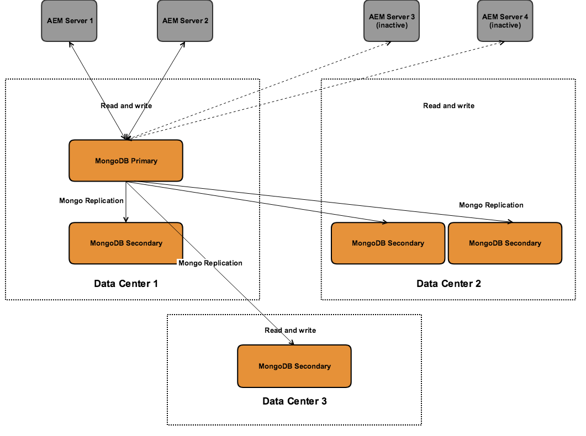

# 권장 배포{#recommended-deployments}

>[!NOTE]
>
>이 페이지는 AEM용 권장 토폴로지를 참조합니다. 클러스터링 기능과 구성 방법에 대한 자세한 내용은 [Apache Sling Discovery API 설명서](https://sling.apache.org/documentation/bundles/discovery-api-and-impl.html)를 참조하십시오.

MicroKernels는 AEM 6.2부터 시작하는 지속성 관리자 역할을 합니다. 필요에 맞게 하나를 선택하면 인스턴스의 목적과 고려하고 있는 배포 유형에 따라 달라집니다.

아래 예제는 가장 일반적인 AEM 설정에서 권장되는 사용 방법을 나타내기 위한 것입니다.

## 배포 시나리오 {#deployment-scenarios}

### 단일 TarMK 인스턴스 {#single-tarmk-instance}

이 시나리오에서는 단일 TarMK 인스턴스가 단일 서버에서 실행됩니다.

**작성자 인스턴스의 기본 배포입니다.**

장점:

* 간단
* 간편한 유지 관리
* 뛰어난 성능

단점:

* 서버 용량 한도를 초과하지 않는 범위
* 페일오버 용량 없음

### TarMK Cold Standby {#tarmk-cold-standby}

하나의 TarMK 인스턴스가 기본 인스턴스로 작동합니다. 기본 저장소에서 대기 페일오버 시스템으로 복제됩니다.

전체 저장소가 장애 조치 서버에 지속적으로 복제되므로 콜드 대기 메커니즘도 백업으로 사용할 수 있습니다. 장애 조치(failover) 서버가 콜드 대기 모드로 실행 중입니다. 즉, 인스턴스의 HttpReceiver만 실행 중입니다.

장점:

* 단순성
* 유지 관리
* 공연
* 장애 조치

단점:

* 서버 용량 한도를 초과하지 않는 범위 확장 불가
* 대부분의 시간 동안 한 대의 서버가 유휴 상태입니다.
* 장애 조치(failover)가 자동으로 수행되지 않습니다. 페일오버 시스템이 요청 제공을 시작하기 전에 외부에서 감지되어야 합니다.

>[!NOTE]
>
>TarMK Cold Standby를 사용하여 AEM을 구성하는 방법에 대한 자세한 내용은 [이](/help/sites-deploying/tarmk-cold-standby.md) 문서를 참조하십시오.

>[!NOTE]
>
>이 TarMK 예제의 Cold Standby 배포에서는 장애 조치 서버에 대한 지속적인 복제가 있기 때문에 기본 인스턴스와 대기 인스턴스 모두에 개별적으로 라이센스가 부여되어야 합니다. 라이선스에 대한 자세한 내용은 [Adobe 일반 라이선스 약관](https://www.adobe.com/kr/legal/terms/enterprise-licensing.html)을 참조하십시오.

### TarMK Farm {#tarmk-farm}

여러 Oak 인스턴스가 하나의 TarMK 인스턴스로 각각 실행됩니다. TarMK 리포지토리는 독립적이며 동기화되어야 합니다.

보관 저장소를 동기화된 상태로 유지하는 것은 작성자 서버가 각 팜 멤버에게 동일한 컨텐츠를 게시한다는 사실과 함께 제공됩니다. 자세한 내용은 [복제](/help/sites-deploying/replication.md)를 참조하십시오.

AEM Communities의 경우 사용자가 생성한 컨텐츠(UGC)는 절대로 복제되지 않습니다. TarMK 팜에서 UGC를 지원하려면 AEM Communities](#considerations-for-aem-communities)에 대한 [고려 사항을 참조하십시오.

**게시 환경을 위한 기본 배포입니다.**

장점:

* 공연
* 읽기 액세스를 위한 확장성
* 장애 조치

### 단일 데이터 센터 {#oak-cluster-with-mongomk-failover-for-high-availability-in-a-single-datacenter}에서 고가용성을 위한 MongoMK 장애 조치가 설치된 Oak 클러스터

이 접근 방식은 단일 데이터 센터 내의 MongoDB 복제본 세트에 액세스하는 여러 Oak 인스턴스를 의미하며, 실제로는 AEM 작성자 환경에 대해 활성 상태의 클러스터를 만듭니다. MongoDB의 복제본 세트는 하드웨어 또는 네트워크 장애 시 고가용성 및 중복을 제공하는 데 사용됩니다.

장점:

* 새로운 AEM 작성자 인스턴스를 사용하여 수평 크기 조절
* 데이터 레이어의 고가용성, 이중화 및 자동 페일오버

단점:

* 일부 시나리오의 경우 TarMK보다 성능이 낮을 수 있습니다.

### 여러 데이터 센터에서 MongoMK 장애 조치(failover)가 포함된 Oak 클러스터 {#oak-cluster-with-mongomk-failover-across-multiple-datacenters}

이 접근 방식은 여러 데이터 센터에 걸쳐 MongoDB 복제본 세트에 액세스하는 여러 Oak 인스턴스를 의미하며, 실제로는 AEM 작성자 환경에 대해 활성 상태의 클러스터를 만듭니다. 여러 데이터 센터를 보유한 MongoDB 복제는 동일한 고가용성과 이중성을 제공하지만 이제 데이터 센터 가동 중단을 처리하는 기능을 포함합니다.

장점:

* 새로운 AEM 작성자 인스턴스를 사용하여 수평 크기 조절
* 데이터 레이어의 고가용성, 이중화 및 자동 페일오버(데이터 센터 운영 중단 포함)

>[!NOTE]
>
>위의 다이어그램에서 AEM Server 3 및 AEM Server 4는 문서화된 요구 사항보다 높은 Data Center 2의 AEM 서버와 Data Center 1의 MongoDB 주 노드 사이의 네트워크 지연을 가정하고 비활성 상태로 표시됩니다.[. ](/help/sites-deploying/aem-with-mongodb.md#checklists) 예를 들어 가용 영역 사용을 통해 최대 대기 시간이 요구 사항과 호환하는 경우 Data Center 2의 AEM 서버도 활성화하여 여러 데이터 센터에서 활성 AEM 클러스터를 만들 수 있습니다.

>[!NOTE]
>
>이 섹션에 설명된 MongoDB 아키텍처 개념에 대한 자세한 내용은 [MongoDB Replication](https://docs.mongodb.org/manual/replication/)을 참조하십시오.

## 마이크로커널:다음 중 하나를 사용하여 {#microkernels-which-one-to-use}

두 개의 사용 가능한 마이크로 커널 중에서 선택할 때 고려해야 하는 기본 규칙은 TarMK가 성능용으로 설계되었으며 MongoMK는 확장성을 위해 사용됩니다.

이러한 의사 결정 행렬을 사용하여 요구 사항에 가장 적합한 배포 유형을 설정할 수 있습니다.

Adobe은 아래 설명된 사용 사례를 제외하고 모든 배포 시나리오에서 고객이 사용하는 기본 지속성 기술로 TarMK를 권장합니다.

### 작성자 인스턴스 {#exceptions-for-choosing-aem-mongomk-over-tarmk-on-author-instances}에서 TarMK보다 AEM MongoMK를 선택하는 예외

TarMK보다 MongoMK 지속성 백엔드를 선택하는 주된 이유는 인스턴스를 가로로 크기 조절하기 위한 것입니다. 즉, 두 개 이상의 활성 작성자 인스턴스가 항상 실행되고 MongoDB를 지속성 스토리지 시스템으로 사용하는 것입니다. 일반적으로 모든 동시 작성 활동을 지원하는 단일 서버의 CPU 및 메모리 용량이 더 이상 지속되지 않는다는 점을 이유로 둘 이상의 작성자 인스턴스를 실행해야 합니다.

새로운 사이트가 라이브된 후 정확한 동시 시청 모델이 어떤 모습일지 예측하는 것은 거의 불가능하다. 따라서 Adobe은 MongoMK와 두 개 이상의 작성자 활성 노드를 사용할지 여부를 평가할 때 다음 기준을 고려할 것을 권장합니다.

1. 하루에 연결된 지정된 사용자 수:수천 개 이상의
1. 동시 사용자 수:수백 개 이상의
1. 일별 자산 처리 볼륨:수십만 명 이상의
1. 일일 페이지 편집 볼륨:수 십만 개 이상의 파일(예: Multi Site Manager 또는 뉴스 피드 지정을 통한 자동 업데이트 포함)을 만들 수 있습니다.
1. 일일 검색 볼륨:수만개 이상의

>[!NOTE]
>
>어려운 날은 배포된 하드웨어 구성 컨텍스트에서 고객의 애플리케이션 성능을 평가하는 데 사용할 수 있습니다. 이 도구에 대한 자세한 내용은 [여기](/help/sites-developing/tough-day.md)를 참조하십시오.

MongoDB를 사용하는 최소 배포에는 일반적으로 다음 토폴로지가 포함됩니다.

* MongoDB 복제본 세트는 하나의 기본 노드, 각 노드에서 지연 시간이 15밀리초보다 작은 가용성 영역에서 실행되는 두 개의 보조 노드, 가용성 영역에서 실행되는 두 개의 보조 노드로 구성됩니다.
* MongoDB 기본 및 보조 인스턴스가 실행 중인 각 데이터 센터에서 각 작성자 인스턴스가 실행되는 단일 리더 노드, 비리더 노드 및 두 노드가 항상 활성 상태인 작성자 인스턴스의 클러스터입니다.

또한 자산 또는 바이너리가 MongoDB 내에 저장되지 않도록 공유 파일 시스템 또는 Amazon S3에 데이터 저장소를 구성하는 것이 좋습니다. 배포 내에서 최적의 성능을 보장합니다.

두 개 이상의 작성자 인스턴스 클러스터로 구성된 MongoDB 복제본 세트를 배포하면 추가적으로 얻을 수 있는 이점 중 하나는 작성자 인스턴스, MongoDB 복제본 또는 전체 데이터 센터 오류가 발생하는 경우 다운타임을 최소화하면서 자동 복구 시나리오를 만드는 것입니다. 그럼에도 불구하고 TarMK는 제어된 장애 조치 메커니즘으로 최소한의 다운타임 솔루션을 제공할 수 있으므로 TarMK의 MongoMK를 통한 선택은 복구 요구 사항에만 국한되지 않습니다.

배포 후 18개월 동안 위의 기준이 충족되지 않을 것으로 예상되는 경우 먼저 TarMK를 사용하여 AEM을 배포한 다음 위의 기준이 적용되는 이후 날짜에 구성을 다시 평가하고 TarMK에 남아 있는지 또는 MongoMK로 마이그레이션할지 여부를 결정하는 것이 좋습니다.

### 게시 인스턴스 {#exceptions-for-choosing-aem-mongomk-over-tarmk-on-publish-instances}에서 TarMK보다 AEM MongoMK를 선택하는 예외

게시 인스턴스에 MongoMK를 배포하는 것은 권장되지 않습니다. 배포의 게시 계층은 거의 항상 TarMK를 실행하는 완전 독립 게시 인스턴스의 팜으로 배포되며, 작성자 인스턴스의 컨텐츠를 복제하여 동기화 상태로 유지됩니다. 게시 인스턴스에 적합한 이 &quot;공유 없음&quot; 아키텍처는 게시 계층의 배포를 선형 방식으로 가로로 확장할 수 있도록 합니다. 팜 토폴로지는 또한 업데이트 또는 업그레이드를 순차적으로 인스턴스를 게시하기 위해 적용할 수 있습니다. 따라서 게시 계층에 대한 변경 사항이 다운타임이 필요하지 않습니다.

둘 이상의 발행자가 있을 때마다 게시 계층에 MongoMK 클러스터를 사용하는 AEM Communities에는 적용되지 않습니다. JSRP를 선택하는 경우([Community Content Storage](/help/communities/working-with-srp.md) 참조), MongoDB 또는 RDB와 같이 선택한 MK에 상관없이 모든 게시 측 클러스터와 마찬가지로 MongoMK 클러스터가 적절합니다.

### MongoMK {#prerequisites-and-recommendations-when-deploying-aem-with-mongomk}와 함께 AEM을 배포할 때 전제 조건 및 Recommendations

AEM용 MongoMK 배포를 고려 중인 경우 사전 요구 사항 및 권장 사항 세트를 사용할 수 있습니다.

**MongoDB 배포에 대한 필수 필수 전제 조건:**

1. AEM에 익숙한 MongoDB 배포 아키텍처 및 크기 조정은 Adobe 컨설팅 또는 MongoDB Architects의 도움을 받아 프로젝트 구현의 일부여야 합니다.
1. 기존 또는 새로운 MongoDB 환경을 유지 관리하고 유지할 수 있다는 확신을 얻으려면 파트너나 고객 팀 내에 MongoDB 전문 지식이 있어야 합니다.
1. 귀하는 MongoDB의 상업용 또는 오픈 소스 버전(AEM 지원 모두)을 배포할 수 있지만 MongoDB Inc;에서 직접 MongoDB Maintenance and Support 계약을 구입해야 합니다.
1. 전체 AEM 및 MongoDB 아키텍처 및 인프라는 Adobe AEM 설계자에 의해 잘 정의되고 검증되어야 합니다.
1. MongoDB가 포함된 AEM 배포에 대한 지원 모델을 검토해야 합니다.

**MongoDB 배포에 대한 강력한 권장 사항:**

* Adobe Experience Manager [아티클](https://www.mongodb.com/lp/contact/mongodb-adobe-experience-manager)에 대한 MongoDB를 참조하십시오.
* MongoDB 프로덕션 [검사 목록](https://docs.mongodb.org/manual/administration/production-checklist/); 검토
* MongoDB의 인증 클래스에 참석하여 온라인 [여기](https://university.mongodb.com/)에 이용할 수 있습니다.

>[!NOTE]
>
>이러한 지침, 사전 요구 사항 및 권장 사항에 대한 추가 질문 사항은 [Adobe 고객 지원 센터](https://helpx.adobe.com/kr/marketing-cloud/contact-support.html)에 문의하십시오.

### AEM Communities {#considerations-for-aem-communities} 고려 사항

[AEM Communities](/help/communities/overview.md)을(를) 배포하려는 사이트의 경우 게시 환경의 커뮤니티 구성원이 게시한 UGC를 처리하기 위해 최적화된 배포](/help/communities/working-with-srp.md#characteristicsofstorageoptions)를 선택하는 것이 좋습니다.[

UGC의 일관된 보기를 얻기 위해 [공통 스토어](/help/communities/working-with-srp.md)를 사용해도 작성자와 다른 게시 인스턴스 사이에 UGC를 복제할 필요가 없습니다.

아래는 배포의 최상의 지속성 유형을 선택할 수 있도록 도와줄 수 있는 일련의 의사 결정 매트릭스입니다.

#### 작성자 인스턴스 {#choosing-the-deployment-type-for-author-instances}에 대한 배포 유형 선택

#### 게시 인스턴스 {#choosing-the-deployment-type-for-publish-instances}에 대한 배포 유형 선택

>[!NOTE]
>
>MongoDB는 타사 소프트웨어이며 AEM 라이선스 패키지에 포함되어 있지 않습니다. 자세한 내용은 [MongoDB 라이선스 정책](https://www.mongodb.org/about/licensing/) 페이지를 참조하십시오.
>
>AEM 배포를 최대한 활용하려면 전문 지원을 받으려면 MongoDB Enterprise 버전의 라이선스가 있어야 합니다.
>
>라이센스에는 표준 복제본 세트가 포함되어 있으며, 이는 작성자 또는 게시 배포에 사용할 수 있는 1개의 기본 인스턴스와 2개의 보조 인스턴스로 구성됩니다.
>
>MongoDB에서 작성자와 게시를 모두 실행하려면 별도의 두 개의 라이선스를 구입해야 합니다.
>
>자세한 내용은 Adobe Experience Manager용 [MongoDB 페이지](https://www.mongodb.com/lp/contact/mongodb-adobe-experience-manager)를 참조하십시오.

