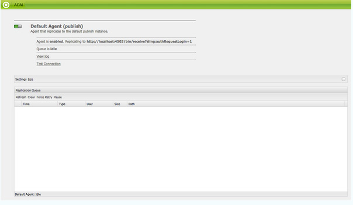
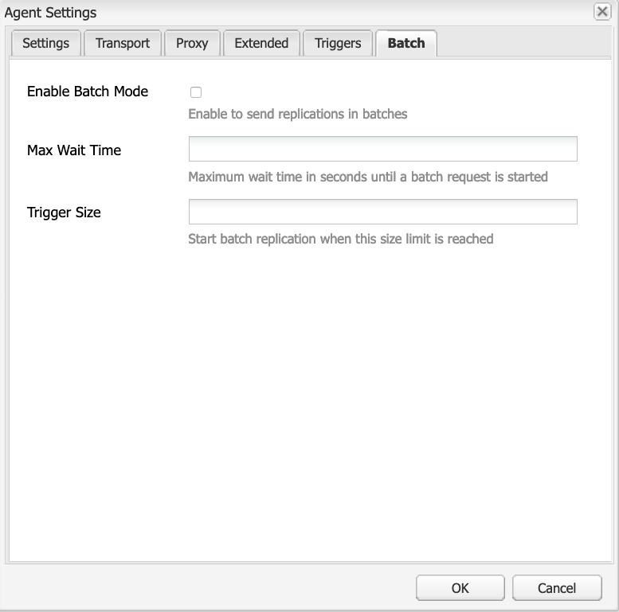

# 복제{#replication}

복제 에이전트는 다음과 같은 작업에 사용되는 메커니즘으로 Adobe Experience Manager(AEM)에 중심적입니다.

* 작성자의 콘텐츠를 Publish 환경으로 [Publish(활성화)](/help/sites-authoring/publishing-pages.md#activatingcontent)합니다.
* Dispatcher 캐시에서 콘텐츠를 명시적으로 플러시합니다.
* Publish 환경의 사용자 입력(예: 양식 입력)을 작성자 환경(작성자 환경의 제어 아래)으로 반환합니다.

요청을 처리할 적절한 에이전트에 대해 [큐에 ](/help/sites-deploying/osgi-configuration-settings.md#apacheslingjobeventhandler)있습니다.

>[!NOTE]
>
>작성자 및 Publish 인스턴스 간에 사용자 데이터(사용자, 사용자 그룹 및 사용자 프로필)가 복제되지 않습니다.
>
>여러 Publish 인스턴스의 경우 [사용자 동기화](/help/sites-administering/sync.md)를 사용하도록 설정하면 사용자 데이터가 Sling으로 배포됩니다.

## 작성자에서 Publish으로 복제 {#replicating-from-author-to-publish}

Publish 인스턴스 또는 Dispatcher으로의 복제는 다음 몇 가지 단계에서 수행됩니다.

* 작성자는 특정 콘텐츠를 게시(활성화)하도록 요청합니다. 이 작업은 수동 요청이나 사전 구성된 자동 트리거를 통해 시작할 수 있습니다.
* 요청이 적절한 기본 복제 에이전트에 전달됩니다. 한 환경에서는 이러한 작업에 대해 항상 선택되어 있는 여러 기본 에이전트가 있을 수 있습니다.
* 복제 에이전트는 콘텐츠를 &quot;패키지&quot;하고 복제 큐에 배치합니다.
* 웹 사이트 탭에서 [색상 상태 표시기](/help/sites-authoring/publishing-pages.md#determiningpagepublicationstatus)가 개별 페이지에 대해 설정되어 있습니다.
* 콘텐츠는 큐에서 해제되고 구성된 프로토콜을 사용하여 Publish 환경으로 전송됩니다. 일반적으로 HTTP입니다.
* Publish 환경의 서블릿이 요청을 수신하고 수신된 콘텐츠를 게시합니다. 기본 서블릿은 `https://localhost:4503/bin/receive`입니다.

* 여러 작성자 및 Publish 환경을 구성할 수 있습니다.

### Publish에서 작성자로 복제 {#replicating-from-publish-to-author}

일부 기능을 사용하면 Publish 인스턴스의 데이터를 입력할 수 있습니다.

경우에 따라 이 데이터가 다른 Publish 환경으로 재배포된 위치에서 작성자 환경으로 반환하려면 역방향 복제라고 하는 복제 유형이 필요합니다. 보안 고려 사항으로 인해 Publish에서 작성 환경으로의 모든 트래픽은 엄격하게 제어해야 합니다.

역방향 복제에서는 작성자 환경을 참조하는 Publish 환경의 에이전트를 사용합니다. 이 에이전트는 데이터를 보낼 편지함에 넣습니다. 이 보낼 편지함은 작성자 환경의 복제 리스너와 일치합니다. 리스너는 보낼 편지함을 폴링하여 입력된 데이터를 수집한 다음 필요에 따라 배포합니다. 이렇게 하면 작성자 환경이 모든 트래픽을 제어합니다.

커뮤니티 기능(예: 포럼, 블로그, 댓글 및 검토)의 경우, Publish 환경에 입력되는 사용자 생성 콘텐츠의 양(UGC)은 복제를 사용하여 AEM 인스턴스 간에 효율적으로 동기화하기 어렵습니다.

AEM [Communities](/help/communities/overview.md)에서 UGC에 대한 복제를 사용하지 않습니다. 대신 커뮤니티 배포에는 UGC에 대한 일반 저장소가 필요합니다([커뮤니티 콘텐츠 저장소](/help/communities/working-with-srp.md) 참조).

### 복제 - 기본 제공 {#replication-out-of-the-box}

AEM의 표준 설치에 포함된 we-retail 웹 사이트를 사용하여 복제를 설명할 수 있습니다.

이 예제를 따르고 기본 복제 에이전트를 사용하려면 다음을 사용하여 [AEM 설치](/help/sites-deploying/deploy.md)하십시오.

* `4502` 포트의 작성자 환경
* 포트 `4503`의 Publish 환경

>[!NOTE]
>
>기본적으로 활성화됨:
>
>* 작성자의 에이전트 : 기본 에이전트(게시)
>
>기본적으로 효과적으로 비활성화됨(AEM 6.1부터) :
>
>* 작성자의 에이전트 : 역방향 복제 에이전트(publish_reverse)
>* Publish의 에이전트 : 역방향 복제(보낼 편지함)
>
>에이전트나 큐의 상태를 확인하려면 **도구** 콘솔을 사용하십시오.
>[복제 에이전트 모니터링](#monitoring-your-replication-agents)을 참조하세요.

#### 복제(작성자에서 Publish) {#replication-author-to-publish}

1. 작성 환경의 지원 페이지로 이동합니다.
   **https://localhost:4502/content/we-retail/us/en/experience.html** `<pi>`
1. 새 텍스트를 추가할 수 있도록 페이지를 편집합니다.
1. 변경 내용을 게시할 수 있도록 **페이지를 활성화**&#x200B;합니다.
1. Publish 환경에서 지원 페이지를 엽니다.
   **https://localhost:4503/content/we-retail/us/en/experience.html**
1. 이제 작성자에 입력한 변경 사항을 볼 수 있습니다.

이 복제는 작성자 환경에서 다음을 통해 수행됩니다.

* **기본 에이전트(게시)**
이 에이전트는 기본 Publish 인스턴스에 콘텐츠를 복제합니다.
이에 대한 세부 사항(구성 및 로그)은 작성 환경의 도구 콘솔에서 액세스할 수 있습니다. 또는
  `https://localhost:4502/etc/replication/agents.author/publish.html`

#### 복제 에이전트 - 기본 제공 {#replication-agents-out-of-the-box}

표준 AEM 설치에서 사용할 수 있는 에이전트는 다음과 같습니다.

* [기본 에이전트](#replication-author-to-publish)
작성자에서 Publish으로 복제하는 데 사용됩니다.

* Dispatcher 플러시
Dispatcher 캐시 관리에 사용됩니다. 자세한 내용은 [작성 환경에서 Dispatcher 캐시 무효화](https://experienceleague.adobe.com/docs/experience-manager-dispatcher/using/configuring/page-invalidate.html#invalidating-dispatcher-cache-from-the-authoring-environment) 및 [게시 인스턴스에서 Dispatcher 캐시 무효화](https://experienceleague.adobe.com/docs/experience-manager-dispatcher/using/configuring/page-invalidate.html#invalidating-dispatcher-cache-from-a-publishing-instance)를 참조하십시오.

* [역방향 복제](#reverse-replication-publish-to-author)
Publish에서 작성자로 복제하는 데 사용됩니다. 포럼, 블로그 및 댓글과 같은 커뮤니티 기능에는 역방향 복제가 사용되지 않습니다. 보낼 편지함이 활성화되지 않아 사실상 비활성화됩니다. 역방향 복제를 사용하려면 사용자 지정 구성이 필요합니다.

* 정적 에이전트
&quot;노드의 정적 표현을 파일 시스템에 저장하는 에이전트&quot;입니다.
예를 들어 기본 설정을 사용하면 콘텐츠 페이지와 dam 자산은 `/tmp` 아래에 HTML 또는 적절한 자산 형식으로 저장됩니다. 구성에 대해서는 `Settings` 및 `Rules` 탭을 참조하십시오.
애플리케이션 서버에서 직접 페이지를 요청할 때 콘텐츠를 볼 수 있도록 이 작업을 요청했습니다. 이는 전문 에이전트이며 대부분의 경우 필요하지 않습니다.

## 복제 에이전트 - 구성 매개 변수 {#replication-agents-configuration-parameters}

도구 콘솔에서 복제 에이전트를 구성할 때 대화 상자에서 네 개의 탭을 사용할 수 있습니다.

### 설정 {#settings}

* **이름**

  복제 에이전트의 고유 이름입니다.

* **설명**

  이 복제 에이전트가 제공하는 목적에 대한 설명입니다.

* **사용**

  복제 에이전트가 활성화되었는지 여부를 나타냅니다.

  에이전트가 **사용**&#x200B;이면 큐는 다음과 같이 표시됩니다.

   * 항목이 처리되는 경우 **활성**.
   * 큐가 비어 있는 경우 **유휴 상태**
   * 항목이 큐에 있지만 처리할 수 없는 경우 **차단됨**. 예를 들어 수신 큐가 비활성화된 경우.

* **직렬화 유형**

  직렬화 유형:

   * **기본값**: 에이전트를 자동으로 선택할 경우 설정합니다.
   * **Dispatcher 플러시**: 에이전트를 Dispatcher 캐시 플러시에 사용하려면 이 옵션을 선택하십시오.

* **다시 시도 지연**

  문제가 발생했을 경우 두 재시도 사이의 지연(대기 시간(밀리초))입니다.

  기본값: `60000`

* **에이전트 사용자 Id**

  환경에 따라 에이전트는 이 사용자 계정을 사용하여 다음을 수행합니다.

   * 작성 환경에서 컨텐츠 수집 및 패키지
   * Publish 환경에서 컨텐츠 만들기 및 쓰기

  시스템 사용자 계정(sling에 관리자 사용자로 정의된 계정, 기본적으로 `admin`임)을 사용하려면 이 필드를 비워 두십시오.

  >[!CAUTION]
  >
  >작성자 환경의 에이전트의 경우, 이 계정 *은(는) 복제하려는 모든 경로에 대한 읽기 액세스 권한을 가져야 합니다*.

  >[!CAUTION]
  >
  >Publish 환경의 에이전트의 경우, 이 계정 *은(는) 콘텐츠를 복제하는 데 필요한 만들기/쓰기 액세스 권한이 있어야*&#x200B;합니다.

  >[!NOTE]
  >
  >복제할 특정 컨텐츠를 선택하는 메커니즘으로 사용할 수 있습니다.

* **로그 수준**

  로그 메시지에 사용할 상세 정보 수준을 지정합니다.

   * `Error`: 오류만 기록됩니다
   * `Info`: 오류, 경고 및 기타 정보 메시지가 기록됩니다
   * `Debug`: 주로 디버그를 위해 높은 수준의 세부 정보가 메시지에 사용됩니다.

  기본값: `Info`

* **역방향 복제에 사용**

  이 에이전트가 역복제에 사용되는지 여부를 나타냅니다. Publish에서 작성자 환경으로 사용자 입력을 반환합니다.

* **별칭 업데이트**

  이 옵션을 선택하면 Dispatcher에 별칭 또는 vanity 경로 무효화 요청이 활성화됩니다. [Dispatcher 플러시 에이전트 구성](/help/sites-deploying/replication.md#configuring-a-dispatcher-flush-agent)도 참조하세요.

#### 전송 {#transport}

* **URI**

  대상 위치에서 수신 서블릿을 지정합니다. 특히 여기에서 대상 인스턴스의 호스트 이름(또는 별칭)과 컨텍스트 경로를 지정할 수 있습니다.

  예:

   * 기본 에이전트가 `https://localhost:4503/bin/receive`에 복제될 수 있습니다.
   * Dispatcher 플러시 에이전트가 `https://localhost:8000/dispatcher/invalidate.cache`에 복제할 수 있습니다.

  여기에서 지정된 프로토콜(HTTP 또는 HTTPS)이 전송 방법을 결정합니다.

  Dispatcher 플러시 에이전트의 경우, 경로 기반 가상 호스트 항목을 사용하여 팜을 구분하는 경우에만 URI 속성이 사용됩니다. 이 필드를 사용하여 무효화할 팜을 대상으로 합니다. 예를 들어 팜 #1에는 `www.mysite.com/path1/*`의 가상 호스트가 있고 팜 #2에는 `www.mysite.com/path2/*`의 가상 호스트가 있습니다. `/path1/invalidate.cache`의 URL을 사용하여 첫 번째 팜을 대상으로 지정하고 `/path2/invalidate.cache`을(를) 사용하여 두 번째 팜을 대상으로 지정할 수 있습니다.

* **사용자**

  대상에 액세스하는 데 사용할 계정의 사용자 이름입니다.

* **암호**

  대상에 액세스하는 데 사용할 계정의 암호입니다.

* **NTLM 도메인**

  NTML 인증용 도메인.

* **NTLM 호스트**

  NTML 인증용 호스트입니다.

* **느슨한 SSL 사용**

  자체 인증 SSL 인증서를 허용하려면 활성화합니다.

* **만료된 인증서 허용**

  만료된 SSL 인증서를 허용하려면 활성화합니다.

#### 프록시 {#proxy}

다음 설정은 프록시가 필요한 경우에만 필요합니다.

* **프록시 호스트**

  전송에 사용되는 프록시의 호스트 이름입니다.

* **프록시 포트**

  프록시의 포트입니다.

* **프록시 사용자**

  사용할 계정의 사용자 이름입니다.

* **프록시 암호**

  사용할 계정의 암호입니다.

* **프록시 NTLM 도메인**

  프록시 NTLM 도메인입니다.

* **프록시 NTLM 호스트**

  프록시 NTLM 도메인입니다.

#### 확장됨 {#extended}

* **인터페이스**

  여기에서 바인딩할 소켓 인터페이스를 정의할 수 있습니다.

  연결을 만들 때 사용할 로컬 주소를 설정합니다. 설정되지 않은 경우 기본 주소가 사용됩니다. 이 기능은 다중 홈 또는 클러스터형 시스템에서 사용할 인터페이스를 지정하는 데 유용합니다.

* **HTTP 메서드**

  사용할 HTTP 메서드입니다.

  Dispatcher 플러시 에이전트의 경우, 이는 거의 항상 GET 상태이며 변경해서는 안 됩니다(POST은 다른 가능한 값일 수 있음).

* **HTTP 헤더**

  Dispatcher 플러시 에이전트에 사용되고 플러시해야 하는 요소를 지정합니다.

  Dispatcher 플러시 에이전트의 경우 다음 세 가지 표준 항목을 변경할 필요가 없습니다.

   * `CQ-Action:{action}`
   * `CQ-Handle:{path}`
   * `CQ-Path:{path}`

  이 탭은 핸들이나 경로를 플러시할 때 사용할 작업을 나타내기 위해 적절하게 사용됩니다. 하위 매개 변수는 동적입니다.

   * `{action}`은(는) 복제 작업을 나타냅니다.

   * `{path}`은(는) 경로를 나타냅니다.

  이 매개변수는 요청과 관련된 경로/작업으로 대체되므로 &quot;하드코딩&quot;할 필요가 없습니다.

  >[!NOTE]
  >
  >권장 기본 컨텍스트가 아닌 컨텍스트에 AEM을 설치한 경우 HTTP 헤더에 컨텍스트를 등록해야 합니다. 예:
  >`CQ-Handle:/<*yourContext*>{path}`

* **연결 끊기**

  활성화하면 각 요청 후에 연결을 닫을 수 있습니다.

* **연결 시간 초과**

  연결을 설정할 때 적용할 시간 제한(밀리초)입니다.

* **소켓 시간 제한**

  연결이 설정된 후 트래픽을 대기할 때 적용할 시간 제한(밀리초)입니다.

* **프로토콜 버전**

  프로토콜 버전. 예: HTTP/1.0의 경우 `1.0`.

#### 트리거 {#triggers}

다음 설정을 사용하여 자동 복제를 위한 트리거를 정의합니다.

* **기본값 무시**

  선택하면 에이전트가 기본 복제에서 제외됩니다. 즉, 콘텐츠 작성자가 복제 작업을 지시할 때 에이전트가 사용되지 않습니다.

* **수정 시**

  여기서 이 에이전트에 의한 복제는 페이지가 수정되면 자동으로 트리거됩니다. Dispatcher 플러시 에이전트뿐만 아니라 역방향 복제에도 사용됩니다.

* **배포 중**

  선택하면 에이전트가 배포용으로 표시된 모든 콘텐츠를 수정할 때 자동으로 복제합니다.

* **설정/해제 시간 도달**

  이렇게 하면 페이지에 대해 정의된 시간 또는 시간이 초과될 때 자동 복제(페이지를 적절히 활성화 또는 비활성화)가 트리거됩니다. 주로 Dispatcher 플러시 에이전트에 사용됩니다.

* **수신 중**

  선택하면 에이전트 체인이 복제 이벤트를 수신할 때마다 복제합니다.

* **상태 업데이트 없음**

  선택하면 에이전트가 복제 상태를 강제로 업데이트하지 않습니다.

* **버전 관리 안 함**

  선택하면 에이전트가 활성화된 페이지에 버전 관리를 적용하지 않습니다.

## 복제 에이전트 구성 {#configuring-your-replication-agents}

MSSL을 사용하여 Publish 인스턴스에 복제 에이전트를 연결하는 방법에 대한 자세한 내용은 [상호 SSL을 사용하여 복제](/help/sites-deploying/mssl-replication.md)를 참조하십시오.

### 작성자 환경에서 복제 에이전트 구성 {#configuring-your-replication-agents-from-the-author-environment}

작성 환경의 도구 탭에서 작성 환경(**작성자의 에이전트**) 또는 Publish 환경(**Publish의 에이전트**)에 있는 복제 에이전트를 구성할 수 있습니다. 다음 절차는 작성 환경용 에이전트의 구성을 보여 주지만, 두 가지 모두에 사용할 수 있습니다.

>[!NOTE]
>
>Dispatcher이 작성자 또는 Publish 인스턴스에 대한 HTTP 요청을 처리할 때 복제 에이전트의 HTTP 요청에는 PATH 헤더가 포함되어야 합니다. 다음 절차 외에 PATH 헤더를 클라이언트 헤더의 Dispatcher 목록에 추가해야 합니다. [/clientheaders(클라이언트 헤더)](https://experienceleague.adobe.com/docs/experience-manager-dispatcher/using/configuring/dispatcher-configuration.html#specifying-the-http-headers-to-pass-through-clientheaders)을(를) 참조하십시오.
>

1. AEM의 **도구** 탭에 액세스합니다.
1. **복제**(폴더를 열려면 왼쪽 창)을 클릭합니다.
1. **작성자의 에이전트**(왼쪽 또는 오른쪽 창)을 두 번 클릭합니다.
1. 적절한 에이전트 이름(링크)을 클릭하여 해당 에이전트에 대한 자세한 정보를 표시합니다.
1. 구성 대화 상자를 열려면 **편집**&#x200B;을 클릭하세요.

   

1. 제공된 값은 기본 설치에 충분해야 합니다. 변경하는 경우 **확인**&#x200B;을 클릭하여 저장합니다(개별 매개 변수에 대한 자세한 내용은 [복제 에이전트 - 구성 매개 변수](#replication-agents-configuration-parameters) 참조).

>[!NOTE]
>
>AEM의 표준 설치에서는 기본 복제 에이전트 내의 전송 자격 증명에 대한 사용자로 `admin`을(를) 지정합니다.
>
>필요한 경로를 복제할 권한이 있는 사이트 특정 복제 사용자 계정으로 변경해야 합니다.

### 역복제 구성 {#configuring-reverse-replication}

역방향 복제는 Publish 인스턴스에서 생성된 사용자 콘텐츠를 다시 작성자 인스턴스로 가져오는 데 사용됩니다. 이는 일반적으로 설문 조사 및 등록 양식과 같은 기능에 사용됩니다.

보안상의 이유로 대부분의 네트워크 토폴로지에서는 &quot;Demilitarized Zone&quot;(인터넷과 같은 신뢰할 수 없는 네트워크에 외부 서비스를 노출하는 하위 네트워크)에서 *을(를) 연결할 수 없습니다.*

Publish 환경은 일반적으로 DMZ에 있으므로 콘텐츠를 다시 작성자 환경으로 가져오려면 작성자 인스턴스에서 연결을 시작해야 합니다. 이 작업은 다음 작업을 통해 수행됩니다.

* 콘텐츠가 있는 Publish 환경의 *outbox*.
* 새 콘텐츠에 대한 보낼 편지함을 정기적으로 폴링하는 작성 환경의 에이전트(게시).

>[!NOTE]
>
>AEM [Communities](/help/communities/overview.md)의 경우 Publish 인스턴스의 사용자 생성 컨텐츠에 복제가 사용되지 않습니다. [커뮤니티 콘텐츠 저장소](/help/communities/working-with-srp.md)를 참조하세요.

이렇게 하려면 다음이 필요합니다.

**작성자 환경의 역방향 복제 에이전트** - Publish 환경의 보낼 편지함에서 정보를 수집하는 활성 구성 요소 역할을 합니다.

역방향 복제를 사용하려면 이 에이전트가 활성화되어 있는지 확인하십시오.

**Publish 환경의 역방향 복제 에이전트(보낼 편지함)** - &quot;보낼 편지함&quot; 역할을 하는 수동 요소입니다. 사용자 입력은 여기에 배치되는데, 여기서 작성자 환경의 에이전트에 의해 수집됩니다.

### 여러 Publish 인스턴스에 대한 복제 구성 {#configuring-replication-for-multiple-publish-instances}

>[!NOTE]
>
>콘텐츠만 복제됩니다. 사용자 데이터는 사용자, 사용자 그룹 및 사용자 프로필이 아닙니다.
>
>여러 Publish 인스턴스 간에 사용자 데이터를 동기화하려면 [사용자 동기화](/help/sites-administering/sync.md)를 사용하도록 설정하십시오.

설치 후 localhost의 포트 4503에서 실행 중인 Publish 인스턴스에 콘텐츠를 복제하기 위해 기본 에이전트가 이미 구성되어 있습니다.

추가 Publish 인스턴스에 대한 콘텐츠 복제를 구성하려면 새 복제 에이전트를 만들고 구성합니다.

1. AEM에서 **도구** 탭을 엽니다.
1. 왼쪽 패널에서 **복제**&#x200B;를 선택한 다음 **작성자의 에이전트**&#x200B;를 선택합니다.
1. **새로 만들기...**&#x200B;을(를) 선택하십시오.
1. **제목** 및 **이름**&#x200B;을 설정한 다음 **복제 에이전트**&#x200B;를 선택하십시오.
1. 에이전트를 만들려면 **만들기**&#x200B;를 클릭하십시오.
1. 구성 패널이 열리도록 새 에이전트 항목을 두 번 클릭합니다.
1. **편집** - **에이전트 설정** 대화 상자가 열립니다. - **직렬화 유형**&#x200B;이(가) 이미 기본값으로 정의되어 있으므로 그대로 유지해야 합니다.

   * **설정** 탭에서:

      * **사용**&#x200B;을 활성화합니다.
      * **설명**&#x200B;을 입력하십시오.
      * **다시 시도 지연**&#x200B;을(를) `60000`(으)로 설정합니다.

      * **직렬화 형식**&#x200B;을(를) `Default`(으)로 둡니다.

   * **전송** 탭에서:

      * 새 Publish 인스턴스에 필요한 URI를 입력합니다. 예:
        `https://localhost:4504/bin/receive`

      * 복제에 사용되는 사이트별 사용자 계정을 입력합니다.
      * 필요에 따라 다른 매개 변수를 구성할 수 있습니다.

1. **확인**&#x200B;을 클릭합니다.

그런 다음 작성 환경에서 페이지를 업데이트한 다음 게시하여 작업을 테스트할 수 있습니다.

위와 같이 구성된 모든 Publish 인스턴스에 업데이트가 표시됩니다.

문제가 발생하면 작성자 인스턴스의 로그를 확인할 수 있습니다. 필요한 세부 정보 수준에 따라 위와 같은 **에이전트 설정** 대화 상자를 사용하여 **로그 수준**&#x200B;을 `Debug`(으)로 설정할 수도 있습니다.

>[!NOTE]
>
>이를 [에이전트 사용자 ID](#agentuserid)의 사용과 결합하여 개별 Publish 환경에 복제할 다른 콘텐츠를 선택할 수 있습니다. 각 Publish 환경의 경우:
>
>1. 해당 Publish 환경에 복제할 복제 에이전트를 구성합니다.
>1. 특정 Publish 환경에 복제된 콘텐츠를 읽는 데 필요한 액세스 권한을 가진 사용자 계정을 구성합니다.
>1. 사용자 계정을 복제 에이전트에 대한 **에이전트 사용자 ID**(으)로 할당하십시오.
>

### Dispatcher 플러시 에이전트 구성 {#configuring-a-dispatcher-flush-agent}

기본 에이전트가 설치에 포함됩니다. 그러나 특정 구성이 여전히 필요하며 새 에이전트를 정의하는 경우에도 마찬가지입니다.

1. AEM에서 **도구** 탭을 엽니다.
1. **배포**&#x200B;를 클릭합니다.
1. **복제**&#x200B;를 선택한 다음 **Publish의 에이전트**&#x200B;를 선택하십시오.
1. **Dispatcher 플러시** 항목을 두 번 클릭하여 개요를 엽니다.
1. **편집**&#x200B;을 클릭합니다. **에이전트 설정** 대화 상자가 열립니다.

   * **설정** 탭에서:

      * **사용**&#x200B;을 활성화합니다.
      * **설명**&#x200B;을 입력하십시오.
      * **Serialization Type**&#x200B;을(를) `Dispatcher Flush`(으)로 유지하거나 에이전트를 만드는 경우 설정하십시오.

      * (선택 사항) Dispatcher에 대한 별칭 또는 vanity 경로 무효화 요청을 활성화하려면 **별칭 업데이트**&#x200B;를 선택합니다.

   * **전송** 탭에서:

      * 새 Publish 인스턴스에 필요한 URI를 입력합니다. 예:
        `https://localhost:80/dispatcher/invalidate.cache`

      * 복제에 사용되는 사이트별 사용자 계정을 입력합니다.
      * 필요에 따라 다른 매개 변수를 구성할 수 있습니다.

   Dispatcher 플러시 에이전트의 경우, 경로 기반 가상 호스트 항목을 사용하여 팜을 구분하는 경우에만 URI 속성이 사용됩니다. 이 필드를 사용하여 무효화할 팜을 대상으로 합니다. 예를 들어 팜 #1에는 `www.mysite.com/path1/*`의 가상 호스트가 있고 팜 #2에는 `www.mysite.com/path2/*`의 가상 호스트가 있습니다. `/path1/invalidate.cache`의 URL을 사용하여 첫 번째 팜을 대상으로 지정하고 `/path2/invalidate.cache`을(를) 사용하여 두 번째 팜을 대상으로 지정할 수 있습니다.

   >[!NOTE]
   >
   >권장 기본 컨텍스트가 아닌 다른 컨텍스트에 AEM을 설치한 경우 **확장** 탭에서 [HTTP 헤더](#extended)를 구성하십시오.

1. **확인**&#x200B;을 클릭합니다.
1. **도구** 탭으로 돌아가서 **Dispatcher 플러시** 에이전트(**Publish의 에이전트**)를 **활성화**&#x200B;할 수 있습니다.

작성자에서 **Dispatcher 플러시** 복제 에이전트가 활성화되지 않았습니다. 동일한 URI를 사용하여 Publish 환경에서 동일한 페이지에 액세스할 수 있습니다(예: `https://localhost:4503/etc/replication/agents.publish/flush.html`).

### 복제 에이전트에 대한 액세스 제어 {#controlling-access-to-replication-agents}

`etc/replication` 노드에서 사용자 및/또는 그룹 페이지 권한을 사용하여 복제 에이전트를 구성하는 데 사용되는 페이지에 대한 액세스를 제어할 수 있습니다.

>[!NOTE]
>
>이러한 권한을 설정해도 사용자가 콘텐츠를 복제하는 데는 영향을 주지 않습니다(예: 웹 사이트 콘솔 또는 사이드 킥 옵션). 복제 프레임워크는 페이지를 복제할 때 현재 사용자의 &quot;사용자 세션&quot;을 사용하여 복제 에이전트에 액세스하지 않습니다.

### CRXDE Lite에서 복제 에이전트 구성 {#configuring-your-replication-agents-from-crxde-lite}

>[!NOTE]
>
>복제 에이전트 만들기는 `/etc/replication` 저장소 위치에서만 지원됩니다. 연관된 ACL을 제대로 처리하려면 이 작업이 필요합니다. 트리의 다른 위치에 복제 에이전트를 만들면 무단 액세스가 발생할 수 있습니다.

CRXDE Lite을 사용하여 복제 에이전트의 다양한 매개 변수를 구성할 수 있습니다.

`/etc/replication`(으)로 이동하면 다음 세 개의 노드가 표시됩니다.

* `agents.author`
* `agents.publish`
* `treeactivation`

두 `agents`은(는) 적절한 환경에 대한 구성 정보를 보유하며 해당 환경이 실행 중인 경우에만 활성화됩니다. 예를 들어 `agents.publish`은(는) Publish 환경에서만 사용됩니다. 다음 스크린샷은 AEM WCM에 포함된 작성 환경의 Publish 에이전트를 보여 줍니다.

## 복제 에이전트 모니터링 {#monitoring-your-replication-agents}

복제 에이전트를 모니터링하려면 다음을 수행합니다.

1. AEM의 **도구** 탭에 액세스합니다.
1. **복제**&#x200B;를 클릭합니다.
1. 왼쪽 또는 오른쪽 창에서 해당 환경에 대한 에이전트 링크를 두 번 클릭합니다. 예: **작성자의 에이전트**.

   결과 창에는 대상 및 상태를 포함하여 작성 환경에 대한 모든 복제 에이전트의 개요가 표시됩니다.

1. 적절한 에이전트 이름(링크임)을 클릭하여 해당 에이전트에 대한 자세한 정보를 표시합니다.

   

   여기서 다음과 같은 작업을 수행할 수 있습니다.

   * 에이전트가 활성화되었는지 확인합니다.
   * 복제 타겟을 참조하십시오.
   * 복제 큐가 활성(활성화)인지 여부를 확인합니다.
   * 큐에 항목이 있는지 확인합니다.
   * **새로 고침** 또는 **지우기**&#x200B;를 클릭하여 큐 항목 표시를 업데이트합니다. 이렇게 하면 항목이 대기열에 들어오고 나가는 것을 볼 수 있습니다.

   * **로그를 봅니다**. 복제 에이전트에서 모든 작업의 로그에 액세스합니다.
   * 대상 인스턴스에 대한 **연결 테스트**.
   * 필요한 경우 큐 항목에 대해 **다시 시도**&#x200B;합니다.

   >[!CAUTION]
   >
   >Publish 인스턴스의 역방향 복제 보낼 상자에 &quot;연결 테스트&quot; 링크를 사용하지 마십시오.
   >
   >
   >보낼 편지함 대기열에 대해 복제 테스트를 수행하면 테스트 복제보다 오래된 모든 항목이 모든 역방향 복제와 함께 다시 처리됩니다.
   >
   >
   >이러한 항목이 큐에 있는 경우 다음 XPath JCR 쿼리와 함께 찾을 수 있으므로 제거해야 합니다.
   >
   >
   >`/jcr:root/var/replication/outbox//*[@cq:repActionType='TEST']`

## 일괄 복제 {#batch-replication}

일괄 복제는 개별 페이지 또는 자산을 복제하지 않고 시간 또는 크기를 기준으로 두 페이지의 첫 번째 임계값이 트리거될 때까지 기다립니다.

그런 다음 모든 복제 항목을 패키지에 압축하고, 단일 파일로 게시자에게 복제합니다.

Publisher는 모든 항목의 압축을 풀고 저장한 후 작성자에게 다시 보고합니다.

### 일괄 복제 구성 {#configuring-batch-replication}

1. `http://serveraddress:serverport/siteadmin`(으)로 이동
1. 화면 상단의 **[!UICONTROL 도구]** 아이콘을 누릅니다
1. 왼쪽 탐색 레일에서 **[!UICONTROL 복제 - 작성자의 에이전트]**(으)로 이동하여 **[!UICONTROL 기본 에이전트]**&#x200B;를 두 번 클릭합니다.
   * `http://serveraddress:serverport/etc/replication/agents.author/publish.html`(으)로 직접 이동하여 기본 Publish 복제 에이전트에 연결할 수도 있습니다.
1. 복제 큐 위에 있는 **[!UICONTROL 편집]** 단추를 누르십시오.
1. 다음 창에서 **[!UICONTROL 일괄 처리]** 탭으로 이동합니다.
   
1. 에이전트를 구성합니다.

### 매개변수 {#parameters}

* `[!UICONTROL Enable Batch Mode]` - 일괄 복제 모드를 활성화하거나 비활성화합니다.
* `[!UICONTROL Max Wait Time]` - 일괄 처리 요청이 시작될 때까지의 최대 대기 시간(초)입니다. 기본값은 2초입니다.
* `[!UICONTROL Trigger Size]` - 이 크기가 제한되면 일괄 복제를 시작합니다.

## 추가 리소스 {#additional-resources}

문제 해결에 대한 자세한 내용은 [복제 문제 해결](/help/sites-deploying/troubleshoot-rep.md) 페이지를 참조하십시오.
