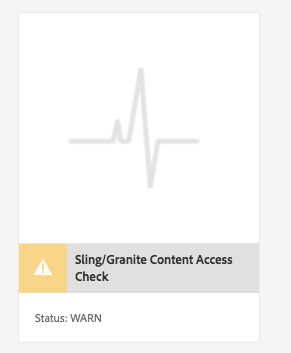

# 지속 가능한 업그레이드{#sustainable-upgrades}

## Customization Framework {#customization-framework}

### 아키텍처(기능/인프라/컨텐츠/애플리케이션)  {#architecture-functional-infrastructure-content-application}

Customization Framework 기능은 API와 같은 코드 또는 친숙한 업그레이드 이외의 콘텐츠(예: 오버레이)의 확장 불가능한 영역에서 위반을 줄이는 데 도움이 되도록 설계되었습니다.

사용자 지정 프레임워크에는 두 가지 구성 요소가 있습니다. a **API Surface** 그리고 **컨텐츠 분류**.

#### API Surface {#api-surface}

이전 AEM 릴리스에서는 많은 API가 Uber Jar를 통해 노출되었습니다. 이러한 API 중 일부는 고객이 사용하기 위한 것이 아니라 번들 간에 AEM 기능을 지원하도록 노출되었습니다. 앞으로, Java API는 업그레이드 컨텍스트에서 사용할 안전한 API를 고객에게 표시하기 위해 공개 또는 비공개 로 표시됩니다. 기타 세부 사항은 다음과 같습니다.

* 로 표시된 Java API `Public` 사용자 지정 구현 번들에서 사용 및 참조할 수 있습니다.

* 공용 API는 호환성 패키지 설치와 이전 버전과 호환됩니다.
* 호환성 패키지에는 이전 버전과의 호환성을 보장하기 위해 호환성 Uber JAR가 포함됩니다
* 로 표시된 Java API `Private` 는 AEM 내부 번들에서만 사용하기 위한 것으로서, 사용자 지정 번들에서는 사용하지 않아야 합니다.

>[!NOTE]
>
>의 개념 `Private` 및 `Public` 이 같은 맥락에서 공ㆍ사립 클래스에 대한 자바개념과 혼동해서는 안 된다.

#### 컨텐츠 분류 {#content-classifications}

AEM에서는 고객이 AEM 기능을 확장 및 사용자 지정할 수 있도록 오버레이 및 Sling Resource Merger의 주요 기능을 오랫동안 사용해왔습니다. AEM 콘솔 및 UI를 구동하는 사전 정의된 기능은에 저장됩니다. **/libs**. 고객은 그 아래에 있는 어떤 것도 수정할 수 없습니다 **/libs** 그러나 더 많은 컨텐츠를 **/apps** 에 정의된 기능을 오버레이하고 확장하려면 **/libs** (자세한 내용은 오버레이로 개발 을 참조하십시오.) 이로 인해 AEM을 의 컨텐츠로 업그레이드할 때 여전히 많은 문제가 발생했습니다. **/libs** 의 경우 오버레이 기능이 예기치 않은 방식으로 중단되는 문제가 발생할 수 있습니다. 고객은 를 통해 상속을 통해 AEM 구성 요소를 확장할 수도 있습니다 `sling:resourceSuperType`또는 의 구성 요소를 참조하면 됩니다 **/libs** sling:resourceType을 통해 직접 액세스할 수 있습니다. 참조 및 재정의 사용 사례에서 유사한 업그레이드 문제가 발생할 수 있습니다.

고객이 어떤 영역의 **/libs** 의 컨텐츠를 사용하고 오버레이해도 안전합니다. **/libs** 은 다음 mixin으로 분류되었습니다.

* **공용(granite:PublicArea)** - 노드를 public으로 정의하여 오버레이하고 상속할 수 있습니다( `sling:resourceSuperType`) 또는 직접 사용( `sling:resourceType`). Public으로 표시된 /libs 아래의 노드는 호환성 패키지를 추가하여 안전하게 업그레이드할 수 있습니다. 일반적으로 고객은 Public으로 표시된 노드만 활용해야 합니다.

* **요약(granite:AbstractArea)** - 노드를 요약으로 정의합니다. 노드를 오버레이하거나 상속할 수 있습니다( `sling:resourceSupertype`)이지만 직접 사용해서는 안 됩니다( `sling:resourceType`).

* **최종(granite:FinalArea)** - 노드를 최종으로 정의합니다. 최종적인 것으로 분류된 노드는 오버레이하거나 상속해서는 안 됩니다. 최종 노드는 를 통해 직접 사용할 수 있습니다 `sling:resourceType`. 최종 노드 아래의 하위 노드는 기본적으로 내부로 간주됩니다.

* ***내부(granite:InternalArea)*** *- *노드를 내부로 정의합니다. 내부로 분류된 노드는 오버레이, 상속 또는 직접 사용해서는 안 됩니다. 이러한 노드는 AEM의 내부 기능만을 위한 것입니다

* **주석 없음** - 노드는 트리 계층 구조를 기반으로 분류를 상속합니다. / 루트는 기본적으로 공개입니다. **Internal 또는 Final으로 분류된 상위가 있는 노드도 Internal로 처리됩니다.**

>[!NOTE]
>
>이러한 정책은 Sling 검색 경로 기반 메커니즘에만 적용됩니다. 의 기타 영역 **/libs** 클라이언트측 라이브러리와 마찬가지로 `Internal`를 사용해도 되지만 standard clientlib 포함 과 함께 사용할 수 있습니다. 고객은 이러한 경우에 내부 분류를 계속 존중해야 합니다.

#### CRXDE Lite 컨텐츠 유형 표시기 {#crxde-lite-content-type-indicators}

CRXDE Lite에 적용된 Mixins는 로 표시된 컨텐츠 노드 및 트리를 표시합니다 `INTERNAL` 회색으로 표시됨. 대상 `FINAL` 아이콘만 회색으로 표시됩니다. 이러한 노드의 하위 노드도 회색으로 표시됩니다. 이 두 경우 모두 오버레이 노드 기능이 비활성화됩니다.

**공용**

**최종**

**내부**

**콘텐츠 상태 확인**

>[!NOTE]
>
>AEM 6.5부터는 패턴 탐지기 를 사용하여 컨텐츠 액세스 위반을 감지할 것을 권장합니다. 패턴 탐지기 보고서는 보다 자세히 설명되며 더 많은 문제를 감지하고 긍정 오류(false positive)의 확률을 낮춥니다.
>
>자세한 내용은 [패턴 탐지기를 사용한 업그레이드 복잡성 평가](/help/sites-deploying/pattern-detector.md).

AEM 6.5는 컨텐츠 분류와 일치하지 않는 방식으로 오버레이되거나 참조된 컨텐츠를 사용하는 경우 고객에게 경고하기 위한 상태 확인과 함께 제공됩니다.

** Sling/Granite Content Access Check**는 고객 코드가 AEM에서 보호된 노드에 잘못 액세스하고 있는지 확인하기 위해 저장소를 모니터링하는 새로운 상태 검사입니다.

이 경우 **/apps** 그리고 일반적으로 완료하는 데 몇 초가 걸립니다.

이 새 상태 확인에 액세스하려면 다음을 수행해야 합니다.

1. AEM 홈 화면에서 로 이동합니다. **도구 > 작업 > 상태 보고서**
1. 을(를) 클릭합니다. **Sling/Granite Content Access Check** 아래와 같이 아래와 같습니다.

   

검사가 완료되면, 잘못된 참조 중인 보호된 노드의 최종 사용자에게 경고 목록이 표시됩니다.

위반을 수정한 후 녹색 상태로 돌아갑니다.

상태 확인은 모든 Sling 검색 경로에서 오버레이 또는 리소스 유형이 사용될 때마다 비동기적으로 확인하는 백그라운드 서비스에서 수집한 정보를 표시합니다. 컨텐츠 혼합을 잘못 사용하면 위반을 보고합니다.
