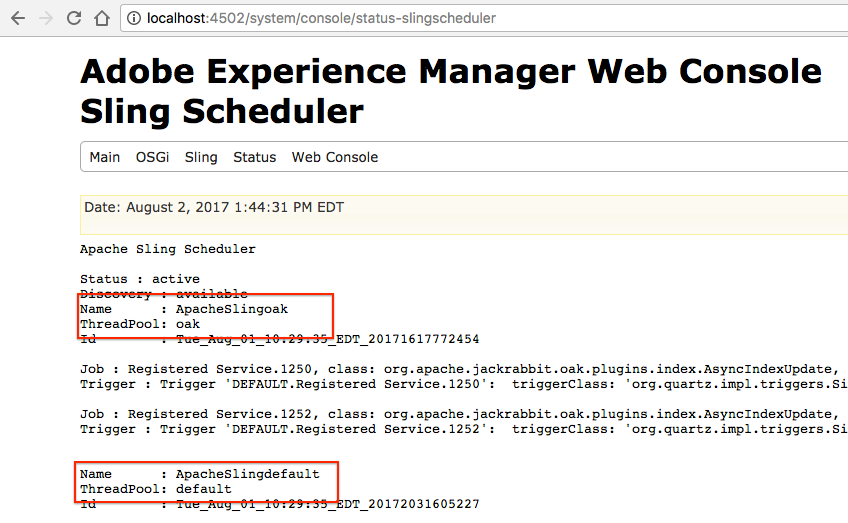

# Oak 색인 문제 해결{#troubleshooting-oak-indexes}

## 느린 다시 인덱싱 {#slow-re-indexing}

AEM 내부 재색인 프로세스는 저장소 데이터를 수집하고 Oak 색인에 저장하여 컨텐츠 쿼리를 지원하는 성능을 지원합니다. 예외적인 상황에서는 절차가 느리거나 중지될 수 있습니다. 이 페이지는 인덱싱 속도가 느리는지 확인하고 원인을 찾고 문제를 해결하는 데 도움이 되는 문제 해결 안내서 역할을 합니다.

콘텐츠를 대량으로 인덱싱하고 있기 때문에 시간이 오래 걸리는 재인덱스와 시간이 오래 걸리는 재색인화를 구별하는 것이 중요합니다. 예를 들어 컨텐츠를 인덱싱하는 데 걸리는 시간이 컨텐츠 양에 따라 확장되므로 대규모 프로덕션 리포지토리는 소규모 개발 저장소보다 재색하는 데 더 오래 걸립니다.

컨텐츠를 다시 색인화하는 시기와 방법에 대한 자세한 내용은 [쿼리 및 색인화에 대한 우수 사례](/help/sites-deploying/best-practices-for-queries-and-indexing.md)를 참조하십시오.

## 초기 감지 {#initial-detection}

초기 감지 느린 인덱싱을 사용하려면 `IndexStats` JMX MBeans를 검토해야 합니다. 영향을 받는 AEM 인스턴스에서 다음을 수행합니다.

1. 웹 콘솔을 열고 JMX 탭을 클릭하거나 https://&lt;host>:&lt;port>/system/console/jmx(예: [http://localhost:4502/system/console/jmx](http://localhost:4502/system/console/jmx))로 이동합니다.
1. `IndexStats` Mbeans로 이동합니다.
1. &quot; `async`&quot; 및 &quot; `fulltext-async`&quot;의 `IndexStats` MBeans를 엽니다.

1. 두 MBeans의 경우 **Done** 타임스탬프와 **LastIndexTime** 타임스탬프가 현재 시간에서 45분 미만인지 확인하십시오.

1. MBean의 경우, 시간 값(**Done** 또는 **LastIndexedTime**)이 현재 시간보다 45분 이상이면 인덱스 작업이 실패하거나 너무 오래 걸립니다. 이렇게 하면 비동기 인덱스가 오래된 상태가 됩니다.

## 색인 작업은 강제 종료 {#indexing-is-paused-after-a-forced-shutdown} 후 일시 중지됩니다.

강제 종료로 인해 AEM은 다시 시작한 후 최대 30분 동안 비동기 인덱싱을 일시 중단하게 되며, 일반적으로 첫 번째 다시 색인 처리를 완료하는 데 15분이 추가로 필요하며, 약 45분 동안(45분의 [초기 감지](/help/sites-deploying/troubleshooting-oak-indexes.md#initial-detection) 기간) 다시 시도합니다. 강제로 종료된 후 색인화가 일시 중지된 것으로 의심되는 경우:

1. 먼저 AEM 인스턴스가 강제적으로 종료되었는지(AEM 프로세스가 강제로 종료되었는지 또는 전원 장애가 발생했는지) 확인한 후 다시 시작합니다.

   * [이 ](/help/sites-deploying/configure-logging.md) 목적을 위해 AEM 로그인을 검토할 수 있습니다.

1. 강제 종료가 발생한 경우 다시 시작할 때 AEM은 최대 30분 동안 재색인을 자동으로 일시 중단합니다.
1. AEM에서 일반적인 비동기 인덱싱 작업을 다시 시작할 때까지 약 45분 정도 기다리십시오.

## 스레드 풀 오버로드된 {#thread-pool-overloaded}

>[!NOTE]
>
>AEM 6.1의 경우 [AEM 6.1 CFP 11](https://helpx.adobe.com/experience-manager/release-notes-aem-6-1-cumulative-fix-pack.html)이(가) 설치되어 있는지 확인하십시오.

예외적인 환경에서 시간별 색인 관리에 사용된 스레드 풀은 오버로드될 수 있습니다. 색인 프로세스를 격리하기 위해 다른 AEM 작업이 Oak의 컨텐츠 색인 지정 기능을 적시에 방해하지 않도록 스레드 풀을 구성할 수 있습니다. 이렇게 하려면 다음을 수행해야 합니다.

1. 비동기 인덱싱에 사용할 Apache Sling 스케줄러에 대해 새로운 격리된 스레드 풀을 정의합니다.

   * 영향을 받는 AEM 인스턴스에서 AEM OSGi 웹 콘솔>OSGi>Configuration>Apache Sling Scheduler로 이동하거나 https://&lt;host>:&lt;port>/system/console/configMgr(예: [http://localhost:4502/system/console/configMgr](http://localhost:4502/system/console/configMgr))로 이동합니다.
   * &quot;허용된 스레드 풀&quot; 필드에 &quot;oak&quot; 값을 사용하여 항목을 추가합니다.
   * 오른쪽 하단에 있는 저장을 클릭하여 변경 사항을 저장합니다.

   

1. 새 Apache Sling 스케줄러 스레드 풀이 등록되어 Apache Sling 스케줄러 상태 웹 콘솔에 표시되는지 확인합니다.

   * AEM OSGi 웹 콘솔>상태>Sling 스케줄러로 이동하거나 https://&lt;host>:&lt;port>/system/console/status-slingscheduler(예: [http://localhost:4502/system/console/status-slingscheduler](http://localhost:4502/system/console/status-slingscheduler))로 이동합니다.
   * 다음 풀 항목이 있는지 확인합니다.

      * ApacheSlingoak
      * ApacheSlingdefault

   

## 관측 큐가 꽉 찼습니다 {#observation-queue-is-full}.

너무 많은 변경 사항 및 커밋이 저장소에 짧은 시간 내에 수행되면 전체 관찰 대기열로 인해 색인화가 지연될 수 있습니다. 먼저, 감시 큐가 가득 찼는지 확인합니다.

1. 웹 콘솔로 이동하여 JMX 탭을 클릭하거나 https://&lt;host>:&lt;port>/system/console/jmx(예: [http://localhost:4502/system/console/jmx](http://localhost:4502/system/console/jmx))로 이동합니다.
1. Oak 저장소 통계 MBean을 열고 `ObservationQueueMaxLength` 값이 10,000보다 큰지 확인합니다.

   * 일반적인 작업에서 이 최대값은 항상 0(특히 `per second` 섹션에서)으로 낮춰야 하므로 `ObservationQueueMaxLength`의 초 지표가 0인지 확인합니다.
   * 값이 10,000개 이상이고 계속 증가하면 새 변경(커밋)이 발생하는 만큼 하나 이상의 대기열을 신속하게 처리할 수 없음을 나타냅니다.
   * 각 관측 큐에는 제한(기본적으로 10,000개)이 있으며, 큐 히트가 이 제한을 초과할 경우 처리 등급이 낮아집니다.
   * MongoMK를 사용할 때 큐 길이가 증가하여 내부 Oak 캐시 성능이 저하됩니다. 이 상관 관계는 `Consolidated Cache` 통계 MBean의 `DocChildren` 캐시에 대한 증가된 `missRate`에서 볼 수 있습니다.

1. 허용되는 감시 큐 제한을 초과하지 않도록 하려면 다음을 수행하는 것이 좋습니다.

   * 커밋의 고정 비율을 낮춥니다. 커밋의 짧은 스파이크는 허용되지만 상수 속도를 줄여야 합니다.
   * [성능 조정 팁 > Mongo 저장소 조정 > 문서 캐시 크기](https://helpx.adobe.com/experience-manager/kb/performance-tuning-tips.html#main-pars_text_3)에 설명된 대로 `DiffCache`의 크기를 늘립니다.

## 멈춰 있는 다시 색인 프로세스 식별 및 수정 {#identifying-and-remediating-a-stuck-re-indexing-process}

재색인화는 다음 두 가지 조건에 따라 &quot;완전히 막히지 않음&quot;으로 간주될 수 있습니다.

* 색인 재지정 작업은 매우 느리며, 로그 파일에서 탐색 중인 노드 수와 관련하여 중요한 진행 상태가 보고되지 않습니다.

   * 예를 들어 한 시간 동안 메시지가 없거나 진행 속도가 너무 느린 경우 완료하는 데 1주일 이상 걸립니다.

* 색인 스레드의 로그 파일(예: `OutOfMemoryException`)에 반복 예외가 나타날 경우 다시 색인화는 무한 루프에 고정됩니다. 로그에서 동일한 예외 내용이 반복되는 것은 Oak가 동일한 항목을 반복적으로 색인화하려고 하지만 동일한 문제에 대해 실패했음을 나타냅니다.

멈춰 있는 다시 색인화 프로세스를 식별하고 수정하려면 다음을 수행합니다.

1. 색인 작업이 중단되는 원인을 식별하려면 다음 정보를 수집해야 합니다.

   * 스레드 덤프 5분, 스레드 덤프가 2초마다 하나씩 수집됩니다.
   * [응용 프로그램에 대한 DEBUG 수준 및 로그를 설정합니다](/help/sites-deploying/configure-logging.md).

      * *org.apache.jackrabbit.oak.plugins.index.AsyncIndexUpdate*
      * *org.apache.jackrabbit.oak.plugins.index.IndexUpdate*
   * 비동기 `IndexStats` MBean에서 데이터 수집:

      * AEM OSGi 웹 콘솔>Main>JMX>IndexStat>async로 이동합니다.

         또는 [http://localhost:4502/system/console/jmx/org.apache.jackrabbit.oak%3Aname%3Dasync%2Ctype%3DIndexStats](http://localhost:4502/system/console/jmx/org.apache.jackrabbit.oak%3Aname%3Dasync%2Ctype%3DIndexStats)로 이동합니다.
   * [oak-run.jar의 콘솔 모드](https://github.com/apache/jackrabbit-oak/tree/trunk/oak-run)를 사용하여 * `/:async`* 노드 아래에 있는 항목에 대한 세부 정보를 수집합니다.
   * `CheckpointManager` MBean:을 사용하여 저장소 체크포인트 목록을 수집합니다.

      * AEM OSGi 웹 콘솔>Main>JMX>CheckpointManager>listCheckpoint()

         또는 [http://localhost:4502/system/console/jmx/org.apache.jackrabbit.oak%3Aname%3DSegment+node+store+checkpoint+management%2Ctype%3DCheckpointManager](http://localhost:4502/system/console/jmx/org.apache.jackrabbit.oak%3Aname%3DSegment+node+store+checkpoint+management%2Ctype%3DCheckpointManager)로 이동합니다.

1. 1단계에서 설명한 모든 정보를 수집한 후 AEM을 다시 시작합니다.

   * AEM을 다시 시작하면 동시 로드가 높은 경우(관측 대기열 오버플로우 또는 유사) 문제를 해결할 수 있습니다.
   * 다시 시작해도 문제가 해결되지 않는 경우 [Adobe 고객 지원 센터](https://helpx.adobe.com/kr/marketing-cloud/contact-support.html)의 문제를 열고 1단계에서 수집한 모든 정보를 제공합니다.

## 비동기 다시 인덱싱 {#safely-aborting-asynchronous-re-indexing}을(를) 안전하게 중단합니다.

다시 색인화는 `async, async-reindex`과 `ulltext-async` 인덱싱 레인( `IndexStats` Mbean)을 통해 안전하게 중단(완료 전에 중지됨)될 수 있습니다. 자세한 내용은 [How to Abort Reinding Reindexing](https://jackrabbit.apache.org/oak/docs/query/indexing.html#abort-reindex)의 Apache Oak 설명서를 참조하십시오. 또한 다음 사항을 고려하십시오.

* Lucene 및 Lucene 속성 인덱스의 재인덱스는 자연적으로 매우 복잡하므로 중단할 수 있습니다.
* Oak 속성 인덱스의 재인덱스는 `PropertyIndexAsyncReindexMBean`을(를) 통해 다시 색인화한 경우에만 중단할 수 있습니다.

재색인을 안전하게 중단하려면 다음 단계를 수행합니다.

1. 중지해야 하는 다시 인덱싱 레인을 제어하는 IndexStats MBean을 식별합니다.

   * AEM OSGi Web Console>Main>JMX 또는 https://&lt;host>:&lt;port>/system/console/jmx(예: [http://localhost:4502/system/console/jmx](http://localhost:4502/system/console/jmx))로 이동하여 JMX 콘솔을 통해 해당 IndexStats MBean으로 이동합니다.
   * 중지할 다시 인덱싱 레인( `async`, `async-reindex` 또는 `fulltext-async`)을 기반으로 IndexStats MBean을 엽니다.

      * 적절한 레인과 IndexStats MBean 인스턴스를 식별하려면 Oak 인덱스 &quot;async&quot; 속성을 확인합니다. &quot;async&quot; 속성에는 레인 이름이 포함됩니다.`async`, `async-reindex` 또는 `fulltext-async`.
      * 레인은 &quot;비동기&quot; 열에서 AEM 색인 관리자에 액세스하여 사용할 수도 있습니다. 색인 관리자에 액세스하려면 작업 > 진단 > 색인 관리자로 이동합니다.

   

1. 해당 `IndexStats` MBean에서 `abortAndPause()` 명령을 호출합니다.
1. 색인 레인이 다시 시작되면 다시 색인화를 다시 시작하지 않도록 Oak 인덱스 정의를 적절하게 표시합니다.

   * **기존** 인덱스를 다시 색인화할 때 reindex 속성을 false로 설정합니다.

      * `/oak:index/someExistingIndex@reindex=false`
   * 또는 **new** 인덱스의 경우 다음 중 하나를 수행합니다.

      * type 속성을 disabled로 설정

         * `/oak:index/someNewIndex@type=disabled`
      * 색인 정의를 완전히 제거하거나

   완료되면 변경 사항을 저장소에 커밋합니다.

1. 마지막으로, 취소된 인덱싱 레인에 대해 시간순으로 색인화를 다시 시작합니다.

   * 2단계에서 `abortAndPause()` 명령을 실행한 `IndexStats` MBean에서 `resume()` 명령을 호출합니다.

## 느린 다시 인덱싱 방지 {#preventing-slow-re-indexing}

대규모 컨텐츠 인제스트 중에는 물론, AEM 로드가 알려져 제어되는 유지 관리 기간 동안에는 비정기적인 색인 지정 작업을 하는 것이 가장 좋습니다. 또한 다른 유지 관리 작업 중에는 다시 색인화가 발생하지 않도록 하십시오.
