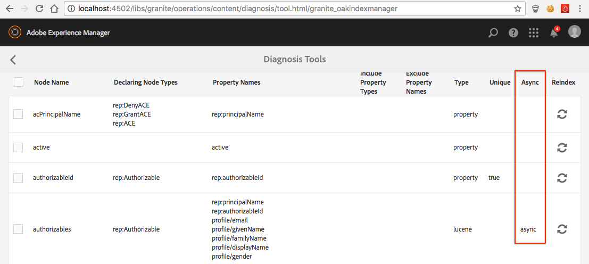

# Oak 인덱스 문제 해결{#troubleshooting-oak-indexes}

## 느린 리인덱싱  {#slow-re-indexing}

AEM의 내부 리인덱싱 프로세스는 수행적 콘텐츠 쿼리를 지원하기 위해 저장소 데이터를 수집하고 Oak 인덱스에 저장합니다. 예외적인 상황에서는 프로세스가 느려지거나 심지어 중단될 수 있습니다. 이 페이지는 색인화가 느려지는지 식별하고 원인을 찾고 문제를 해결하는 데 도움이 되는 문제 해결 가이드 역할을 합니다.

부적절하게 긴 시간이 소요되는 리인덱싱과 방대한 양의 컨텐츠를 인덱싱하는 것이므로 긴 시간이 소요되는 리인덱싱을 구분하는 것이 중요합니다. 예를 들어 컨텐츠 크기와 함께 컨텐츠 크기를 색인화하는 데 걸리는 시간이 짧기 때문에 큰 프로덕션 리포지토리는 작은 개발 리포지토리보다 색인을 다시 지정하는 데 더 오래 걸립니다.

콘텐츠를 다시 인덱싱하는 시기와 방법에 대한 자세한 내용은 [쿼리 및 인덱싱에 대한 모범 사례](/help/sites-deploying/best-practices-for-queries-and-indexing.md)를 참조하십시오.

## 초기 감지 {#initial-detection}

초기 검색 느린 인덱싱을 사용하려면 `IndexStats` JMX MBean을 검토해야 합니다. 영향을 받는 AEM 인스턴스에서 다음을 수행합니다.

1. 웹 콘솔을 열고 JMX 탭을 클릭하거나 https://&lt;host>:&lt;port>/system/console/jmx(예: [http://localhost:4502/system/console/jmx](http://localhost:4502/system/console/jmx))로 이동합니다.
1. `IndexStats` Mbean으로 이동합니다.
1. &quot; `async`&quot; 및 &quot; `fulltext-async`&quot;에 대한 `IndexStats`MBean을 엽니다.

1. 두 MBean의 경우 **완료** 타임스탬프 및 **LastIndexTime** 타임스탬프가 현재 시간으로부터 45분 미만인지 확인하십시오.

1. MBean의 경우 시간 값(**완료** 또는 **LastIndexedTime**)이 현재 시간에서 45분 이상인 경우 인덱스 작업이 실패하거나 너무 오래 걸립니다. 이 문제로 인해 비동기 인덱스가 오래된 상태가 됩니다.

## 강제 종료 후 인덱싱이 일시 중지되었습니다. {#indexing-is-paused-after-a-forced-shutdown}

강제 종료로 인해 AEM이 다시 시작 후 최대 30분 동안 비동기 인덱싱을 일시 중단합니다. 그리고 일반적으로 첫 번째 리인덱싱 패스를 완료하는 데 15분이 추가로 필요합니다(총 45분 동안 [초기 감지](/help/sites-deploying/troubleshooting-oak-indexes.md#initial-detection) 시간 프레임을 다시 연결). 강제 종료 후 인덱싱이 일시 중지된 경우:

1. 먼저 AEM 인스턴스가 강제 방식으로 종료되었는지(AEM 프로세스가 강제 종료되었거나 전원 오류가 발생했는지) 확인하고 나중에 다시 시작하십시오.

   * [AEM 로깅](/help/sites-deploying/configure-logging.md)은(는) 이러한 목적으로 검토할 수 있습니다.

1. 강제 종료가 발생한 경우 다시 시작하면 AEM은 최대 30분 동안 자동으로 색인 재지정을 일시 중단합니다.
1. AEM이 일반적인 비동기 인덱싱 작업을 다시 시작할 때까지 약 45분 정도 기다립니다.

## 스레드 풀이 오버로드됨 {#thread-pool-overloaded}

>[!NOTE]
>
>AEM 6.1의 경우 [AEM 6.1 CFP 11](https://experienceleague.adobe.com/docs/experience-manager-release-information/aem-release-updates/previous-updates/aem-previous-versions.html?lang=ko)이 설치되어 있는지 확인하십시오.

예외적인 상황에서는 비동기 인덱싱을 관리하는 데 사용되는 스레드 풀이 오버로드될 수 있습니다. 인덱싱 프로세스를 분리하기 위해 스레드 풀을 구성하여 다른 AEM 작업이 적시에 콘텐츠를 인덱싱하는 Oak의 기능을 방해하지 않도록 할 수 있습니다. 이 경우 다음을 수행합니다.

1. 비동기 인덱싱에 사용할 Apache Sling 스케줄러에 대해 격리된 새 스레드 풀을 정의합니다.

   * 영향을 받는 AEM 인스턴스에서 AEM OSGi 웹 콘솔>OSGi>구성>Apache Sling 스케줄러로 이동하거나, https://&lt;host>:&lt;port>/system/console/configMgr(예: [http://localhost:4502/system/console/configMgr](http://localhost:4502/system/console/configMgr))로 이동합니다.
   * 값이 &quot;oak&quot;인 &quot;허용된 스레드 풀&quot; 필드에 항목을 추가합니다.
   * 변경 내용을 저장하려면 오른쪽 하단의 **저장**&#x200B;을 클릭합니다.

   

1. 새 Apache Sling 스케줄러 스레드 풀이 등록되고 Apache Sling 스케줄러 상태 웹 콘솔에 표시되는지 확인합니다.

   * AEM OSGi 웹 콘솔>상태>Sling 스케줄러로 이동하거나, https://&lt;host>:&lt;port>/system/console/status-slingscheduler(예: [http://localhost:4502/system/console/status-slingscheduler](http://localhost:4502/system/console/status-slingscheduler))로 이동합니다.
   * 다음 풀 항목이 있는지 확인하십시오.

      * 아파치슬링고악
      * ApacheSlingdefault

   

## 관찰 큐가 가득 찼습니다. {#observation-queue-is-full}

짧은 시간에 너무 많은 변경 사항과 커밋이 저장소에 수행된 경우 전체 관찰 큐로 인해 인덱싱이 지연될 수 있습니다. 먼저 관찰 대기열이 가득 찼는지 확인합니다.

1. 웹 콘솔로 이동하고 JMX 탭을 클릭하거나 https://&lt;host>:&lt;port>/system/console/jmx(예: [http://localhost:4502/system/console/jmx](http://localhost:4502/system/console/jmx))로 이동합니다.
1. Oak 저장소 통계 MBean을 열고 `ObservationQueueMaxLength` 값이 10,000보다 큰지 확인합니다.

   * 일반 작업에서는 이 최대값이 항상 0으로 줄어야 합니다(특히 `per second` 섹션에서). 따라서 `ObservationQueueMaxLength`의 초 지표가 0인지 확인하십시오.
   * 값이 10,000 이상이며 꾸준히 증가하는 경우 새로운 변경(커밋)이 발생하는 즉시 하나 이상의 대기열을 처리할 수 없음을 나타냅니다.
   * 각 관찰 큐에는 제한(기본적으로 10,000)이 있으며 큐가 해당 제한에 도달하면 처리가 저하됩니다.
   * MongoMK를 사용할 때 대기열 길이가 커지면 내부 Oak 캐시 성능이 저하됩니다. 이 상관 관계는 `Consolidated Cache` 통계 MBean의 `DocChildren` 캐시에 대해 증가된 `missRate`에서 볼 수 있습니다.

1. 허용 가능한 관찰 대기열 한도를 초과하지 않도록 다음 작업을 수행하는 것이 좋습니다.

   * 일정한 커밋 비율을 낮춥니다. 커밋의 짧은 스파이크는 허용되지만 상수 비율은 감소해야 합니다.
   * [성능 조정 팁 > Mongo 저장소 조정 > 문서 캐시 크기](/help/sites-deploying/configuring-performance.md)에 설명된 대로 `DiffCache`의 크기를 늘리십시오.

## 중단된 리인덱싱 프로세스 식별 및 수정 {#identifying-and-remediating-a-stuck-re-indexing-process}

리인덱싱은 다음 두 가지 조건에서 &quot;완전히 중단&quot;된 것으로 간주될 수 있습니다.

* 통과하는 노드 수와 관련하여 로그 파일에 중요한 진행 상황이 보고되지 않을 정도로 리인덱싱이 느립니다.

   * 예를 들어 한 시간 동안 메시지가 없거나 진행이 너무 느려 완료하는 데 1주 이상 걸리는 경우 등이 있습니다.

* 색인 지정 스레드의 로그 파일(예: `OutOfMemoryException`)에 반복된 예외가 나타나면 색인 재지정이 무한 루프에 중단됩니다. 로그에서 하나 이상의 동일한 예외가 반복되면 Oak이 동일한 항목을 반복적으로 색인화하려고 시도하지만, 동일한 문제에서 실패함을 나타냅니다.

중단된 리인덱싱 프로세스를 식별하고 수정하려면 다음을 수행합니다.

1. 색인화가 중단된 원인을 식별하려면 다음 정보를 수집해야 합니다.

   * 5분의 스레드 덤프를 수집하고, 2초마다 하나의 스레드 덤프를 수집합니다.
   * [Appenders에 대한 디버그 수준 및 로그를 설정합니다](/help/sites-deploying/configure-logging.md).

      * *org.apache.jackrabbit.oak.plugins.index.AsyncIndexUpdate*
      * *org.apache.jackrabbit.oak.plugins.index.IndexUpdate*

   * 비동기 `IndexStats`MBean에서 데이터 수집:

      * AEM OSGi Web Console>Main>JMX>IndexStat>async로 이동합니다

        또는 [http://localhost:4502/system/console/jmx/org.apache.jackrabbit.oak%3Aname%3Dasync%2Ctype%3DIndexStats](http://localhost:4502/system/console/jmx/org.apache.jackrabbit.oak%3Aname%3Dasync%2Ctype%3DIndexStats)(으)로 이동

   * [oak-run.jar의 콘솔 모드](https://github.com/apache/jackrabbit-oak/tree/trunk/oak-run)을(를) 사용하여 * `/:async`* 노드 아래에 있는 항목에 대한 세부 정보를 수집합니다.
   * `CheckpointManager`MBean을 사용하여 저장소 체크포인트 목록을 수집합니다.

      * AEM OSGi 웹 콘솔>기본>JMX>CheckpointManager>listCheckpoints()

        또는 [http://localhost:4502/system/console/jmx/org.apache.jackrabbit.oak%3Aname%3DSegment+node+store+checkpoint+management%2Ctype%3DCheckpointManager](http://localhost:4502/system/console/jmx/org.apache.jackrabbit.oak%3Aname%3DSegment+node+store+checkpoint+management%2Ctype%3DCheckpointManager)(으)로 이동

1. 1단계에서 설명한 모든 정보를 수집한 후 AEM을 다시 시작합니다.

   * AEM을 다시 시작하면 동시 부하가 높은 경우(관찰 대기열 오버플로 등) 문제를 해결할 수 있습니다.
   * 다시 시작해도 문제가 해결되지 않으면 [고객 지원 센터 Adobe](https://experienceleague.adobe.com/ko?support-solution=General&amp;support-tab=home#support)에 문제를 열고 1단계에서 수집된 모든 정보를 제공하세요.

## 비동기 리인덱싱을 안전하게 중단합니다. {#safely-aborting-asynchronous-re-indexing}

`async, async-reindex` 및 `ulltext-async` 인덱싱 레인(`IndexStats` Mbean)을 통해 리인덱싱을 안전하게 중단(완료되기 전에 중지)할 수 있습니다. 자세한 내용은 [리인덱싱을 중단하는 방법](https://jackrabbit.apache.org/oak/docs/query/indexing.html#abort-reindex)에 대한 Apache Oak 설명서를 참조하십시오. 또한 다음 사항을 고려하십시오.

* Lucene 및 Lucene 속성 인덱스 리인덱싱은 비동기적이므로 중단될 수 있습니다.
* `PropertyIndexAsyncReindexMBean`을(를) 통해 리인덱싱이 시작된 경우에만 Oak 속성 인덱스의 리인덱싱을 중단할 수 있습니다.

리인덱싱을 안전하게 중단하려면 다음 단계를 따르십시오.

1. 중지해야 하는 리인덱싱 레인을 제어하는 IndexStats MBean을 식별합니다.

   * AEM OSGi Web Console>Main>JMX 또는 https://&lt;host>:&lt;port>/system/console/jmx(예: [http://localhost:4502/system/console/jmx](http://localhost:4502/system/console/jmx))로 이동하여 JMX 콘솔을 통해 적절한 IndexStats MBean으로 이동합니다.
   * 중지할 리인덱싱 레인(`async`, `async-reindex` 또는 `fulltext-async`)을 기준으로 IndexStats MBean을 엽니다.

      * 적절한 레인과 IndexStats MBean 인스턴스를 식별하려면 Oak Indexes &quot;async&quot; 속성을 참조하십시오. &quot;async&quot; 속성에 레인 이름 `async`, `async-reindex` 또는 `fulltext-async`이(가) 포함되어 있습니다.
      * &quot;비동기&quot; 열에서 AEM의 인덱스 관리자에 액세스하여 레인을 사용할 수도 있습니다. 색인 관리자에 액세스하려면 작업>진단>색인 관리자로 이동합니다.

   

1. 적절한 `IndexStats`MBean에서 `abortAndPause()` 명령을 호출합니다.
1. 인덱싱 레인이 다시 시작될 때 다시 인덱싱되지 않도록 Oak 인덱스 정의를 적절하게 표시합니다.

   * **기존** 인덱스를 다시 인덱싱하는 경우 reindex 속성을 false로 설정하십시오.

      * `/oak:index/someExistingIndex@reindex=false`

   * 또는 **new** 인덱스의 경우 다음 중 하나를 수행합니다.

      * 유형 속성을 비활성화로 설정

         * `/oak:index/someNewIndex@type=disabled`

      * 또는 색인 정의를 완전히 제거하십시오

   완료되면 변경 사항을 저장소에 커밋합니다.

1. 마지막으로, 중단된 인덱싱 레인에서 비동기 인덱싱을 다시 시작합니다.

   * 2단계에서 `abortAndPause()` 명령을 실행한 `IndexStats` MBean에서 `resume()` 명령을 호출합니다.

## 느린 리인덱싱 방지 {#preventing-slow-re-indexing}

색인을 재지정하는 것은 조용한 기간(예: 큰 컨텐츠 수집 중이 아님) 및 이상적으로는 AEM 로드가 알려져 있고 제어되는 유지 관리 기간 동안 가장 좋습니다. 또한 다른 유지 관리 활동 중에 리인덱싱이 수행되지 않도록 해야 합니다.
