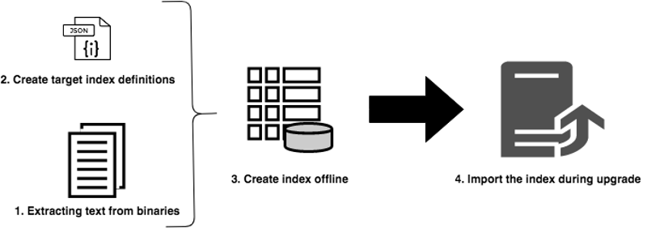

# 오프라인 다시 색인화를 사용하여 업그레이드 중 중단 시간 단축 {#offline-reindexing-to-reduce-downtime-during-upgrades}

## 소개 {#introduction}

Adobe Experience Manager 업그레이드의 주요 문제점 중 하나는 즉석 업그레이드가 수행될 때 작성 환경과 연관된 가동 중지 시간입니다. 컨텐츠 작성자는 업그레이드 동안 환경에 액세스할 수 없습니다. 따라서 업그레이드를 수행하는 데 소요되는 시간을 최소화하는 것이 좋습니다. 대용량 저장소, 특히 시간당 대규모 데이터 저장소와 높은 수준의 에셋 업로드를 갖는 AEM Assets 프로젝트의 경우 Oak 인덱스의 재인덱싱을 수행하면 업그레이드 시간이 차지하는 비율이 매우 높습니다.

이 섹션에서는 Oak-run 도구를 사용하여 업그레이드를 수행하기 전에 **리포지토리 인덱스를 다시 인덱싱하여 실제 업그레이드 동안 다운타임의 양을 줄이는 방법에 대해 설명합니다.** 제공된 단계는 AEM 6.4 이상 버전의 [Lucene](https://jackrabbit.apache.org/oak/docs/query/lucene.html) 인덱스에 적용할 수 있습니다.

## 개요 {#overview}

AEM의 새 버전에서는 기능 세트가 확장됨에 따라 Oak 색인 정의에 변경 사항이 적용되었습니다. Oak 색인에 대한 변경 사항은 AEM 인스턴스를 업그레이드할 때 강제로 다시 인덱싱합니다. 다시 색인화하면 에셋의 텍스트(예: pdf 파일의 텍스트)가 추출되고 색인화되어 에셋을 배포하는 경우 비용이 많이 소요됩니다. MongoMK 리포지토리를 사용하면 데이터가 네트워크를 통해 유지되므로 다시 인덱싱하는 데 걸리는 시간이 늘어납니다.

업그레이드 중 대부분의 고객이 직면하고 있는 문제는 다운타임 기간을 줄이는 것입니다. 이 솔루션은 업그레이드 동안 **skip** 다시 색인화 활동을 수행하는 것입니다. 업그레이드를 수행한 다음 업그레이드 중에 새 indeces **이전**&#x200B;을(를) 만든 다음 간단히 가져올 수 있습니다.

## 접근 방법 {#approach}



업그레이드 전에 [Oak-run](/help/sites-deploying/indexing-via-the-oak-run-jar.md) 도구를 사용하여 대상 AEM 버전의 인덱스 정의를 기준으로 인덱스를 만드는 것이 좋습니다. 위의 다이어그램은 오프라인 다시 색인화 방법을 보여줍니다.

또한 이 단계는 접근 방법에 설명된 단계 순서입니다.

1. 이진 파일의 텍스트가 먼저 추출됩니다.
2. Target 색인 정의 만들기
3. 오프라인 색인이 만들어집니다.
4. 그런 다음 업그레이드 프로세스 동안 인덱스를 가져옵니다.

### 텍스트 추출 {#text-extraction}

AEM에서 전체 인덱싱을 사용하려면 PDF와 같은 이진 파일의 텍스트가 추출되어 색인에 추가됩니다. 일반적으로 인덱싱 프로세스에서 많은 비용이 소요되는 단계입니다. 텍스트 추출은 많은 바이너리를 저장하므로 자산 저장소를 다시 인덱싱하기 위해 특히 필요한 최적화 단계입니다.


시스템에 저장된 바이너리의 텍스트는 tika 라이브러리와 함께 oak 실행 도구를 사용하여 추출할 수 있습니다. 업그레이드 전에 운영 시스템의 클론을 생성할 수 있으며 이러한 텍스트 추출 과정에 사용할 수 있습니다. 그런 다음 다음 다음 단계를 수행하여 텍스트 저장소를 만듭니다.

**1. 저장소를 트래버스하고 이진 파일** 세부 정보를 수집합니다.

이 단계에서는 경로 및 BLOB ID가 포함된 이진 파일이 포함된 CSV 파일을 생성합니다.

인덱스를 만들 디렉토리에서 아래 명령을 실행합니다. 아래 예제에서는 저장소 홈 디렉토리를 가정합니다.

```
java java -jar oak-run.jar tika <nodestore path> --fds-path <datastore path> --data-file text-extraction/oak-binary-stats.csv --generate
```

여기서 `nodestore path`은 `mongo_ur` 또는 `crx-quickstart/repository/segmentstore/`입니다.

`–fds-path` 대신 `--fake-ds-path=temp` 매개 변수를 사용하여 프로세스를 가속화합니다.

**2. 기존 인덱스**&#x200B;에서 사용할 수 있는 이진 텍스트 저장소를 다시 사용합니다.

기존 시스템에서 인덱스 데이터를 덤프하고 텍스트 저장소를 추출합니다.

다음 명령을 사용하여 기존 인덱스 데이터를 덤프할 수 있습니다.

```
java -jar oak-run.jar index <nodestore path> --fds-path=<datastore path> --index-dump
```

여기서 `nodestore path`은 `mongo_ur` 또는 `crx-quickstart/repository/segmentstore/`입니다.

그런 다음 위의 인덱스 덤프를 사용하여 스토어를 채웁니다.

```
java -jar oak-run.jar tika --data-file text-extraction/oak-binary-stats.csv --store-path text-extraction/store --index-dir ./indexing-result/index-dumps/<oak-index-name>/data populate
```

여기서 `oak-index-name`은 전체 텍스트 인덱스의 이름입니다(예: &quot;lucene&quot;).

**3. 위 단계**&#x200B;에서 누락된 이진 파일에 대한 tika 라이브러리를 사용하여 텍스트 추출 프로세스를 실행합니다.

```
java -cp oak-run.jar:tika-app-1.21.jar org.apache.jackrabbit.oak.run.Main tika --data-file text-extraction/oak-binary-stats.csv --store-path text-extraction/store --fds-path <datastore path> extract
```

여기서 `datastore path`은 이진 데이터 저장소의 경로입니다.

만들어진 텍스트 저장소는 나중에 다시 색인화할 때 업데이트되고 다시 사용할 수 있습니다.

텍스트 추출 과정에 대한 자세한 내용은 [Oak-run documentation](https://jackrabbit.apache.org/oak/docs/query/pre-extract-text.html)을 참조하십시오.

### 오프라인 다시 인덱싱 {#offline-reindexing}


업그레이드 전에 Lucene 색인을 오프라인으로 만듭니다. MongoMK를 사용하는 경우 네트워크 오버헤드를 방지하기 때문에 MongoMk 노드 중 하나에서 직접 실행하는 것이 좋습니다.

색인을 오프라인으로 만들려면 아래 단계를 수행하십시오.

**1. 대상 AEM 버전**&#x200B;에 대한 Oak Lucene 색인 정의 생성

기존 색인 정의를 덤프합니다. 변경된 색인 정의는 대상 AEM 버전 및 oak-run의 Adobe Granite 리포지토리 번들을 사용하여 생성되었습니다.

**source** AEM 인스턴스에서 인덱스 정의를 덤프하려면 다음 명령을 실행합니다.

>[!NOTE]
>
>색인 정의 덤핑에 대한 자세한 내용은 [Oak 설명서](https://jackrabbit.apache.org/oak/docs/query/oak-run-indexing.html#async-index-data)를 참조하십시오.

```
java -jar oak-run.jar index --fds-path <datastore path> <nodestore path> --index-definitions
```

여기서 `datastore path` 및 `nodestore path`은 **source** AEM 인스턴스의 것입니다.

그런 다음 대상 버전의 Granite 리포지토리 번들을 사용하여 **target** AEM 버전에서 인덱스 정의를 생성합니다.

```
java -cp oak-run.jar:bundle-com.adobe.granite.repository.jar org.apache.jackrabbit.oak.index.IndexDefinitionUpdater --in indexing-definitions_source.json --out merge-index-definitions_target.json --initializer com.adobe.granite.repository.impl.GraniteContent
```

>[!NOTE]
>
> 위의 인덱스 정의 만들기 프로세스는 `oak-run-1.12.0` 버전에서만 지원됩니다. 타게팅은 Granite 리포지토리 번들 `com.adobe.granite.repository-x.x.xx.jar`을 사용하여 수행됩니다.

위의 단계에서는 색인 정의인 `merge-index-definitions_target.json`이라는 JSON 파일을 만듭니다.

**2. 저장소에서 체크포인트 만들기**

제작 **source** AEM 인스턴스에 긴 라이프타임으로 체크포인트를 만듭니다. 저장소를 복제하기 전에 이 작업을 수행해야 합니다.

`http://serveraddress:serverport/system/console/jmx`에 있는 JMX 콘솔을 통해 `CheckpointMBean`로 이동하여 라이프타임이 긴 체크포인트를 만듭니다(예: 200일). 이와 같이 라이프타임 기간에 대한 인수로서 `17280000000`이 있는 `CheckpointMBean#createCheckpoint`을(를) 호출합니다(밀리초).

이 작업이 완료되면 새로 만든 체크포인트 ID를 복사하고 JMX `CheckpointMBean#listCheckpoints`을(를) 사용하여 라이프타임을 확인합니다.

>[!NOTE]
>
> 이 체크포인트는 인덱스를 나중에 가져올 때 삭제됩니다.

자세한 내용은 Oak 문서에서 [체크포인트 생성](https://jackrabbit.apache.org/oak/docs/query/oak-run-indexing.html#out-of-band-create-checkpoint)을 참조하십시오.

**생성된 색인 정의에 대해 오프라인 색인 만들기 수행**

Lucene 색인화는 oak-run을 사용하여 오프라인으로 수행할 수 있습니다. 이 프로세스는 `indexing-result/indexes` 아래의 디스크에 인덱스 데이터를 만듭니다. 보관소에 **쓰기가 없으므로 실행 중인 AEM 인스턴스를 중지할 필요가 없습니다.** 만들어진 텍스트 저장소는 이 프로세스에 추가됩니다.

```
java -Doak.indexer.memLimitInMB=500 -jar oak-run.jar index <nodestore path> --reindex --doc-traversal-mode --checkpoint <checkpoint> --fds-path <datastore path> --index-definitions-file merge-index-definitions_target.json --pre-extracted-text-dir text-extraction/store

Sample <checkpoint> looks like r16c85700008-0-8
—fds-path: path to data store.
--pre-extracted-text-dir: Directory of pre-extracted text.
merge-index-definitions_target: JSON file having merged definitions for the target AEM instance. indexes in this file will be re-indexed.
```

`--doc-traversal-mode` 매개 변수를 사용하면 저장소 컨텐츠를 로컬 플랫 파일로 스풀링함으로써 다시 인덱스 시간을 크게 향상시킬 수 있으므로 MongoMK 설치 시 매우 유용합니다. 그러나 저장소 크기를 두 배로 하는 추가 디스크 공간이 필요합니다.

MongoMK의 경우 이 단계가 MongoDB 인스턴스에 가까운 인스턴스에서 실행되는 경우 이 프로세스를 가속화할 수 있습니다. 동일한 컴퓨터에서 실행되는 경우 네트워크 오버헤드를 방지할 수 있습니다.

추가 기술 세부 사항은 색인](https://jackrabbit.apache.org/oak/docs/query/oak-run-indexing.html)에 대한 [oak-run 설명서에서 확인할 수 있습니다.

### 인덱스 {#importing-indexes} 가져오기

AEM 6.4 이상 버전의 AEM에는 시작 시퀀스에서 디스크에서 색인을 가져오는 기능이 내장되어 있습니다. 시작 중에 인덱스 데이터가 있는지 `<repository>/indexing-result/indexes` 폴더가 감시됩니다. **target** AEM jar의 새 버전으로 시작하기 전에 [업그레이드 프로세스](in-place-upgrade.md#performing-the-upgrade) 동안 미리 만들어진 인덱스를 위 위치에 복사할 수 있습니다. AEM은 이를 저장소로 가져오고 해당 체크포인트를 시스템에서 제거합니다. 따라서 색인은 완전히 피하는 것이다.

## 추가 팁 및 문제 해결 {#troubleshooting}

아래에서 유용한 팁과 문제 해결 지침을 확인할 수 있습니다.

### 라이브 프로덕션 시스템에 미치는 영향 감소 {#reduce-the-impact-on-the-live-production-system}

복제를 사용하여 프로덕션 시스템을 복제하고 오프라인 색인을 만드는 것이 좋습니다. 이는 생산 시스템에 잠재적인 영향을 미치지 않습니다. 하지만 인덱스를 가져오는 데 필요한 체크포인트가 프로덕션 시스템에 있어야 합니다. 따라서 클론을 만들기 전에 체크포인트를 만드는 것이 중요합니다.

### Runbook 및 시험버전 실행 준비 {#prepare-a-runbook-and-trial-run}

프로덕션에서 업그레이드를 실행하기 전에 [Runbook](https://docs.adobe.com/content/help/en/experience-manager-65/deploying/upgrading/upgrade-planning.html#building-the-upgrade-and-rollback-runbook)을 준비하고 몇 가지 시험버전을 수행하는 것이 좋습니다.

### 오프라인 색인 {#doc-traversal-mode-with-offline-indexing}이(가) 있는 문서 탐색 모드

오프라인 색인화에는 전체 저장소의 여러 트랙이 필요합니다. MongoMK 설치 시 인덱싱 프로세스의 성능에 영향을 주는 네트워크를 통해 저장소에 액세스합니다. 한 가지 옵션은 MongoDB 복제본에서 오프라인 인덱싱 프로세스를 실행하여 네트워크 오버헤드를 제거합니다. 다른 옵션은 문서 탐색 모드를 사용하는 것입니다.

오프라인 인덱싱을 위해 명령줄 매개 변수 `—doc-traversal`을 oak-run 명령에 추가하여 문서 탐색 모드를 적용할 수 있습니다. 이 모드는 로컬 디스크의 전체 저장소 사본을 일반 파일로 스푸킹하여 이를 사용하여 색인화를 실행합니다.
