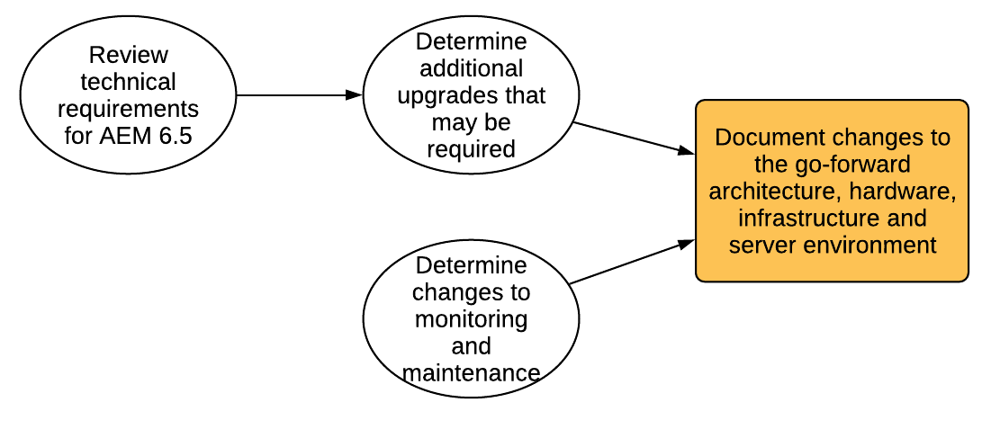

# 업그레이드 계획{#planning-your-upgrade}

## AEM 프로젝트 개요 {#aem-project-overview}

AEM은 수백만 명의 사용자에게 서비스를 제공할 수 있는 효과적인 배포에 주로 사용됩니다. 대부분의 경우 인스턴스에 배포되는 사용자 정의 응용 프로그램이 있으므로 복잡성이 가중됩니다. 이러한 배포를 업그레이드하려는 모든 노력을 체계적으로 처리해야 합니다.

이 가이드는 업그레이드를 계획할 때 명확한 목표, 단계 및 결과물을 설정하는 데 도움이 됩니다. 전체 프로젝트 실행 및 지침에 중점을 둡니다. 실제 업그레이드 단계에 대한 개요를 제공하는 반면, 적절한 경우 사용 가능한 기술 리소스를 말합니다. 이 도구는 문서에 언급된 사용 가능한 기술 리소스와 함께 사용해야 합니다.

AEM 업그레이드 프로세스는 각 단계에서 주요 결과물을 정의한 계획, 분석 및 실행 단계를 신중하게 처리해야 합니다.

AEM 버전 6.0 및 최대 6.5에서 바로 업그레이드할 수 있습니다. 5.6.x 이하 버전을 사용하는 고객은 6.0(SP3)을 권장하면서 먼저 버전 6.0 이상으로 업그레이드해야 합니다. 또한 6.3 이후 세그먼트 노드 저장소에 새로운 OAK 세그먼트 Tar 포맷이 사용되고 6.0, 6.1 및 6.2의 경우 이 새로운 포맷으로의 저장소 마이그레이션은 필수 사항입니다.

>[!CAUTION]
>
>AEM 6.2에서 6.3으로 업그레이드하는 경우 버전(**6.2-SP1-CFP1 - -6.2SP1-CFP12.1**) 또는 **6.2SP1-CFP15** 이상)에서 업그레이드해야 합니다. 그렇지 않은 경우 **6.2SP1-CFP13/6.2SP1CFP14**&#x200B;에서 AEM 6.3으로 업그레이드하는 경우 적어도 버전 **6.3.2.2**&#x200B;로 업그레이드해야 합니다. 그렇지 않으면 AEM Sites은 업그레이드 후 실패합니다.

## 업그레이드 범위 및 요구 사항 {#upgrade-scope-requirements}

아래에는 일반적인 AEM 업그레이드 프로젝트의 영향을 받는 영역 목록이 표시됩니다.

<table>
 <tbody>
  <tr>
   <td><strong>구성 요소</strong></td>
   <td><strong>영향</strong></td>
   <td><strong>설명</strong></td>
  </tr>
  <tr>
   <td>운영 체제</td>
   <td>불확실하지만 미세한 효과</td>
   <td>AEM 업그레이드 시 운영 체제를 업그레이드해야 하는 시기가 될 수 있으며 이러한 업그레이드에 일부 영향을 미칠 수 있습니다.</td>
  </tr>
  <tr>
   <td>Java 런타임</td>
   <td>중간 영향</td>
   <td>AEM 6.3에는 JRE 1.7.x(64비트) 이상이 필요합니다. JRE 1.8은 현재 Oracle에서 지원하는 유일한 버전입니다.</td>
  </tr>
  <tr>
   <td>하드웨어</td>
   <td>중간 영향</td>
   <td>온라인 개정 정리 작업을 성공적으로 완료하려면 저장소 크기의 25%와 동일한 여유 디스크 공간 , 사용 가능한 더미 공간 이 15%와 동일한 여유 공간이 필요합니다. 하드웨어를  으로 업그레이드하여 온라인 개정 정리를 위한 충분한 리소스를 확보하여 완전히  실행해야 할 수 있습니다. 또한 AEM 6 이전 버전에서 업그레이드하는 경우 에 추가 스토리지 요구 사항이 있을 수 있습니다.</td>
  </tr>
  <tr>
   <td>컨텐츠 저장소(CRX 또는 Oak)</td>
   <td>높은 영향</td>
   <td>버전 6.1부터 AEM은 CRX2를 지원하지 않으므로 이전 버전에서 업그레이드하는 경우  Oak(CRX3)로 마이그레이션해야 합니다. AEM 6.3에는 마이그레이션이 필요한 새 세그먼트 노드 저장소가 구현되었습니다.     crx2oak 도구는 이 용도로 사용됩니다.</td>
  </tr>
  <tr>
   <td>AEM 구성 요소/컨텐츠</td>
   <td>중간 영향</td>
   <td><code>/libs</code> 및 <code>/apps</code>은(는) 업그레이드를 통해 쉽게 처리되지만 <code>/etc</code>은 일반적으로 사용자 지정을 수동으로 다시 적용해야 합니다.</td>
  </tr>
  <tr>
   <td>AEM 서비스</td>
   <td>낮은 영향</td>
   <td>대부분의 AEM 핵심 서비스는 업그레이드를 테스트합니다. 이것은 저충격의 한 단계이다.</td>
  </tr>
  <tr>
   <td>맞춤형 애플리케이션 서비스</td>
   <td>저음 및 높은 영향</td>
   <td>Oak에서 인덱스가 자동으로 생성되지 않으므로 응용 프로그램 및 사용자 정의에 따라 JVM, 운영 체제 버전 및 일부 색인 관련 변경 사항 에 대한 종속성이 있을 수 있습니다. </td>
  </tr>
  <tr>
   <td>사용자 지정 애플리케이션 컨텐츠</td>
   <td>저음 및 높은 영향</td>
   <td>업그레이드를 통해 처리되지 않는 컨텐츠는 업그레이드 작업이 시작되기 전에  에 백업되고 다시 저장소로 이동할 수 있습니다.  대부분의 내용은 마이그레이션 도구를 통해 처리할 수 있습니다.</td>
  </tr>
 </tbody>
</table>

지원되는 운영 체제, Java 런타임, httpd 및 Dispatcher 버전을 실행하는 것이 중요합니다. 자세한 내용은 [AEM 6.5 기술 요구 사항 페이지](/help/sites-deploying/technical-requirements.md)를 참조하십시오. 이러한 구성 요소를 업그레이드하려면 프로젝트 계획에 포함되어야 하며 AEM을 업그레이드하기 전에 수행해야 합니다.

## 프로젝트 단계 {#project-phases}

AEM 업그레이드를 계획 및 실행하는 데 많은 작업이 사용됩니다. 이 과정에 들어가는 다양한 노력을 명확히 하기 위해, 우리는 계획과 실행 훈련을 별개의 단계로 분류했습니다. 아래 섹션에서 각 단계는 프로젝트의 향후 단계에서 종종 활용되는 결과물을 만듭니다.

### 작성자 교육 계획 {#planning-for-author-training}

새로운 릴리스에서는 UI 및 사용자 워크플로우에 대한 변경 사항이 적용될 수 있습니다. 또한 새로운 릴리스는 기업이 활용할 수 있는 새로운 기능을 제공합니다. 도입된 기능 변경 사항을 검토하고 사용자를 효과적으로 활용할 수 있도록 교육 계획을 세우는 것이 좋습니다.

AEM 6.5의 새로운 기능은 adobe.com](/help/release-notes/release-notes.md)의 AEM 섹션에 있습니다. [ 조직에서 일반적으로 사용하는 UI 또는 제품 기능의 변경 사항을 반드시 메모해 두십시오. 새로운 기능을 살펴보면서 조직에 유용한 모든 기능을 살펴볼 수 있습니다. AEM 6.5의 변경 사항을 살펴본 후 작성자를 위한 교육 계획을 수립합니다. 여기에는 [Adobe Digital Learning Services](https://www.adobe.com/training.html)를 통해 제공되는 도움말 기능 비디오나 공식 트레이닝과 같이 무료로 제공되는 리소스를 활용할 수 있습니다.

### 테스트 계획 만들기 {#creating-a-test-plan}

각 고객의 AEM 구현은 고유하며 비즈니스 요구 사항에 맞게 맞춤화되었습니다. 따라서 테스트 계획에 포함시킬 수 있도록 시스템에 수행된 모든 사용자 지정을 확인하는 것이 중요합니다. 이 테스트 계획은 업그레이드된 인스턴스에서 수행하는 QA 프로세스를 강화합니다.

모든 애플리케이션과 사용자 지정 코드가 원하는 대로 계속 실행되도록 하려면 정확한 프로덕션 환경을 복제해야 하며, 업그레이드 후에 이 환경에 대한 테스트를 수행해야 합니다. 모든 사용자 정의 내용을 등록하고 성능, 로드 및 보안 테스트를 실행해야 합니다. 테스트 계획을 구성할 때는 일상적으로 작업하는 데 사용되는 기본 UI 및 워크플로우 외에 시스템에 수행된 모든 사용자 지정을 포함해야 합니다. 여기에는 사용자 정의 OSGI 서비스 및 서비스, Adobe Marketing Cloud 통합, AEM 커넥터를 통한 제3자와의 통합, 사용자 정의 제3자 통합, 사용자 정의 구성 요소 및 템플릿, AEM의 사용자 정의 UI 오버레이, 사용자 정의 워크플로우가 포함될 수 있습니다. AEM 6 이전 버전에서 마이그레이션하는 고객의 경우 색인이 필요할 수 있으므로 모든 사용자 지정 쿼리를 분석해야 합니다. AEM 6.x 버전을 이미 사용하고 있는 고객의 경우 업그레이드 후에도 색인이 계속 효과적으로 작동되도록 이러한 쿼리를 테스트해야 합니다.

### 아키텍처 및 인프라 변경 사항 결정 필요 {#determining-architectural-and-infrastructure-changes-needed}

업그레이드할 때 운영 체제 또는 JVM과 같은 기술 스택의 다른 구성 요소를 업그레이드해야 할 수도 있습니다. 또한 저장소 구성 변경으로 인해 추가 하드웨어가 필요할 수 있습니다. 일반적으로 6.x 이전 인스턴스에서 마이그레이션하는 고객에게만 해당되지만 고려해야 하는 사항이 중요합니다. 마지막으로 모니터링, 유지 관리, 백업 및 재해 복구 프로세스를 비롯하여 운영 방식에 변경이 필요할 수 있습니다.

AEM 6.5에 대한 기술 요구 사항을 검토하고 현재 사용 중인 하드웨어 및 소프트웨어가 충분한지 확인하십시오. 운영 프로세스를 변경할 수 있는 방법은 다음 문서를 참조하십시오.

**모니터링 및 유지 관리:**

[작업 대시보드](/help/sites-administering/operations-dashboard.md)

[Assets 모니터링 우수 사례](/help/assets/assets-monitoring-best-practices.md)

[JMX 콘솔을 사용하여 서버 리소스 모니터링](/help/sites-administering/jmx-console.md)

[개정 정리](/help/sites-deploying/revision-cleanup.md)

**백업/복원 및 재해 복구:**

[백업 및 복원](/help/sites-administering/backup-and-restore.md)

[성능 및 확장성](/help/sites-deploying/performance.md)

[TarMK Cold Standby를 사용하여 AEM을 실행하는 방법](/help/sites-deploying/tarmk-cold-standby.md)

#### 내용 재구성 고려 사항 {#content-restructuring-considerations}

AEM은 보다 매끄러운 업그레이드를 만드는 데 도움이 되는 저장소 구조에 대한 변경 사항을 도입했습니다. 변경 사항에는 Adobe 또는 고객이 컨텐츠를 소유하는지 여부에 따라 /etc 폴더의 컨텐츠를 /libs, /apps 및 /content를 비롯한 폴더로 이동하여 릴리스 중에 컨텐츠를 덮어쓸 가능성을 제한합니다. 업그레이드를 계획하는 동안 [AEM](/help/sites-deploying/repository-restructuring.md)의 리포지토리 재구조화에서 세부 정보를 검토하는 것이 좋지만, 6.5 업그레이드 시 코드 변경이 필요하지 않도록 리포지토리 재조정이 수행되었습니다.

### 업그레이드 복잡도 평가 중 {#assessing-upgrade-complexity}

고객이 AEM 환경에 적용하는 사용자 지정 사항의 양과 특성에 따라 다양한 점을 감안하여 업그레이드 시 예상해야 하는 전반적인 노력을 미리 파악하는 것이 중요합니다.

업그레이드의 복잡성을 평가하는 데 두 가지 접근 방법이 있으며, 예비 단계는 AEM 6.1, 6.2 및 6.3 인스턴스에서 실행할 수 있는 새롭게 도입된 Pattern Detector를 사용할 수 있습니다. 패턴 탐지기는 보고된 패턴을 사용하여 업그레이드가 예상되는 전체 복잡성을 평가하는 가장 쉬운 방법입니다. 패턴 감지 보고서에는 사용자 지정 코드베이스에서 사용 중인 사용할 수 없는 API를 식별하기 위한 패턴이 포함되어 있습니다(6.3의 사전 업그레이드 호환성 검사를 사용하여 수행됨).

초기 평가 후 보다 포괄적인 다음 단계는 테스트 인스턴스에서 업그레이드를 수행하고 몇 가지 기본적인 연기 테스트를 수행하는 것입니다. Adobe은 일부 기능을 제공합니다. 또한 [사용되지 않음 및 제거된 기능](/help/release-notes/deprecated-removed-features.md) 목록은 업그레이드하려는 버전뿐만 아니라 소스 버전과 대상 버전 간의 모든 버전에 대해서도 검토해야 합니다. 예를 들어 AEM 6.2에서 6.5로 업그레이드하는 경우 AEM 6.5용 기능 외에도 더 이상 사용되지 않고 제거된 AEM 6.3을 검토해야 합니다.

최근 소개된 패턴 탐지기는 대부분의 경우 업그레이드 시 예상하는 내용을 상당히 정확하게 파악할 수 있도록 합니다. 그러나 호환되지 않는 변경 사항이 있는 복잡한 사용자 지정 및 배포의 경우 [즉석 업그레이드 수행](/help/sites-deploying/in-place-upgrade.md)의 지침에 따라 개발 인스턴스를 AEM 6.5로 업그레이드할 수 있습니다. 완료되면 이 환경에서 높은 수준의 연기 테스트를 수행합니다. 이 연습의 목적은 테스트 케이스 재고를 철저히 완료하고 공식 결함 재고를 생성하는 것이 아니라 6.5 호환성을 위해 코드를 업그레이드하는 데 필요한 작업량을 대략적으로 추정해 주는 것입니다. [패턴 감지](/help/sites-deploying/pattern-detector.md)와 이전 섹션에서 결정한 아키텍처 변경 사항을 결합하면 업그레이드를 계획하기 위해 프로젝트 관리 팀에 대략적인 견적을 제공할 수 있습니다.

### 업그레이드 및 롤백 Runbook 만들기 {#building-the-upgrade-and-rollback-runbook}

Adobe은 AEM 인스턴스를 업그레이드하는 과정을 문서화했지만 각 고객의 네트워크 레이아웃, 배포 아키텍처 및 사용자 지정을 세분화하고 이러한 방식을 수정해야 합니다. 이러한 이유로, Adobe가 제공한 모든 문서를 검토하고 이 문서를 사용하여 사용자 환경에서 따를 특정 업그레이드 및 롤백 절차에 대해 대략적으로 설명하는 프로젝트 특정 Runbook에 알리십시오. CRX2에서 업그레이드하는 경우 CRX2에서 Oak로 이동할 때 컨텐츠 마이그레이션이 얼마나 걸리는지 평가해야 합니다. 대형 리포지토리의 경우 매우 중요할 수 있습니다.

[업그레이드 절차](/help/sites-deploying/upgrade-procedure.md)에 업그레이드 및 롤백 절차와 [즉석 업그레이드 수행](/help/sites-deploying/in-place-upgrade.md)에서 업그레이드를 적용하기 위한 단계별 지침을 제공했습니다. 이러한 지침은 업그레이드 중에 실행할 적절한 전환 및 롤백 절차를 결정하기 위해 시스템 아키텍처, 사용자 지정 사항 및 다운타임 허용 여부와 함께 검토하고 고려해야 합니다. 사용자 정의된 Runbook을 작성할 때 아키텍처 또는 서버 크기에 대한 변경 사항이 포함되어야 합니다. 이 항목은 첫 번째 초안으로 취급되어야 한다는 점에 유의하십시오. 팀에서 QA 및 개발 주기를 완료하고 스테이징 환경으로 업그레이드를 배포하면 추가 단계를 수행해야 할 수도 있습니다. 가장 좋은 방법은 이 문서에 충분한 정보를 포함하고 있어야 합니다. 이러한 정보를 운영 직원에게 전달하면 해당 정보 내에서 완전히 업그레이드를 완료할 수 있다는 것입니다.

### 프로젝트 계획 개발 {#developing-a-project-plan}

이전 연습의 결과물을 사용하여 테스트 또는 개발 노력, 트레이닝 및 실제 업그레이드 실행에 대한 예상 일정을 포함하는 프로젝트 계획을 구축할 수 있습니다.

포괄적인 프로젝트 플랜에는 다음이 포함되어야 합니다.

* 개발 및 테스트 계획의 완성
* 개발 및 QA 환경 업그레이드
* AEM 6.5용 사용자 지정 코드 베이스 업데이트
* QA 테스트 및 수정 주기
* 스테이징 환경 업그레이드
* 통합, 성능 및 로드 테스트
* 환경 인증
* 라이브

### 개발 수행 및 QA {#performing-development-and-qa}

AEM 6.5와 호환되도록 [코드 및 사용자 지정 업그레이드](/help/sites-deploying/upgrading-code-and-customizations.md)에 대한 절차를 제공했습니다. 이 반복 프로세스가 실행되므로 필요에 따라 Runbook을 변경해야 합니다. 업그레이드 후 즉시 개발이 필요 없는 대부분의 경우 사용자 정의 설정을 뒤로 호환성 상태로 유지하는 방법에 대한 자세한 내용은 AEM 6.5](/help/sites-deploying/backward-compatibility.md)의 이전 버전과의 호환성을 참조하십시오.[

개발 및 테스트 프로세스는 일반적으로 반복적인 프로세스입니다. 사용자 지정 사항으로 인해 업그레이드 중에 변경한 내용이 제품 전체 섹션을 사용할 수 없게 될 가능성이 있습니다. 개발자가 문제의 근본 원인을 해결하고 테스트 팀이 이러한 기능을 테스트할 수 있게 되면 추가적인 문제를 발견할 수 있습니다. 업그레이드 프로세스를 조정해야 하는 문제가 발견되면 사용자 지정 업그레이드 Runbook에 해당 문제를 추가해야 합니다. 여러 번의 테스트 및 수정 반복이 완료되면 코드 베이스의 유효성을 철저히 검증하고 스테이징 환경에 배포할 수 있어야 합니다.

### 최종 테스트 {#final-testing}

코드베이스를 조직의 QA 팀에서 인증한 후 최종 테스트 라운드를 권장합니다. 이 테스트 과정에서는 스테이징 환경에서 Runbook의 유효성 검사를 수행한 후 사용자 수락, 성능 및 보안 테스트가 포함됩니다.

이 단계는 Runbook의 단계를 프로덕션과 같은 환경에서 확인할 수 있는 유일한 시간이므로 반드시 필요합니다. 환경이 업그레이드된 후에는 최종 사용자가 로그인하여 일상적으로 사용하는 동안 시스템을 사용할 때 수행하는 활동을 살펴보도록 하는 것이 중요합니다. 이전에 고려되지 않았던 시스템의 일부를 사용자가 활용하는 것은 드문 일이 아닙니다. 라이브되기 전에 이러한 영역에서 문제를 찾아 수정하는 것은 비용이 많이 드는 운영 중단을 방지하는 데 도움이 될 수 있습니다. AEM의 새 버전에는 기본 플랫폼에 중요한 변경 사항이 포함되어 있으므로 처음 실행했던 것처럼 시스템에서 성능, 로드 및 보안 테스트를 수행하는 것이 중요합니다.

### 업그레이드 수행 중 {#performing-the-upgrade}

모든 이해 관계자로부터 최종 로그오프가 수신되면 정의된 Runbook 절차를 실행할 시간입니다. [업그레이드 절차](/help/sites-deploying/upgrade-procedure.md)에 업그레이드 및 롤백에 대한 단계와 [즉석 업그레이드](/help/sites-deploying/in-place-upgrade.md)를 참조점으로 수행하는 설치 단계를 제공했습니다.

환경 유효성 검사를 위한 업그레이드 지침에 몇 가지 단계를 제공했습니다. 이러한 검사에는 업그레이드 로그 스캔, 모든 OSGi 번들이 제대로 시작되었는지 확인하는 등의 기본 검사가 포함되지만 비즈니스 프로세스에 따라 고유한 테스트 케이스를 확인하는 것이 좋습니다. 또한 AEM 온라인 개정 정리 일정 및 관련 작업을 확인하여 회사에서 조용한 시간에 이러한 작업이 수행되는지 확인하는 것이 좋습니다. 이러한 루틴들은 AEM의 장기적인 성능에 필수적입니다.
