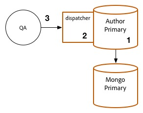
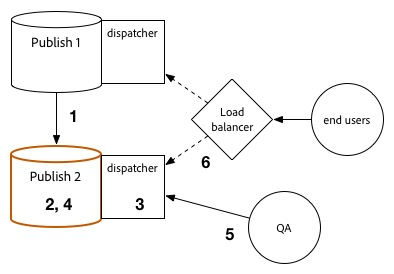

# 업그레이드 절차 {#upgrade-procedure}

>[!NOTE]
>
>대부분의 AEM 업그레이드가 직접 수행되므로 이 업그레이드는 작성자 계층의 가동 중지 시간이 필요합니다. 이러한 모범 사례를 통해 게시 계층 다운타임을 최소화하거나 제거할 수 있습니다.

AEM 환경을 업그레이드할 때 작성자와 최종 사용자 모두에게 다운타임을 최소화하기 위해 작성자 환경 또는 게시 환경 간의 접근 방식 차이를 고려해야 합니다. 이 페이지에서는 AEM 6.x 버전에서 현재 실행 중인 AEM 토폴로지를 업그레이드하는 높은 수준의 절차를 설명합니다.작성 및 게시 계층과 Mongo 및 TarMK 기반 배포 방식이 다르므로 각 계층과 마이크로커널이 별도의 섹션에 나열되어 있습니다. 배포를 실행할 때 먼저 작성 환경을 업그레이드하고 성공을 확인한 다음 게시 환경으로 이동하는 것이 좋습니다.

<!--
>[!IMPORTANT]
>
>The downtime during the upgrade can be significally reduced by indexing the repository before performing the upgrade. For more information, see [Using Offline Reindexing To Reduce Downtime During an Upgrade](/help/sites-deploying/upgrade-offline-reindexing.md)
-->

## TarMK 작성자 계층 {#tarmk-author-tier}

### 토폴로지 시작 중 {#starting-topology}

이 섹션에 대해 가정된 토폴로지는 Cold Standby를 사용하여 TarMK에서 실행 중인 작성자 서버로 구성됩니다. 복제는 작성자 서버에서 TarMK 게시 팜으로 수행됩니다. 여기에 설명된 것은 아니지만 오프로드를 사용하는 배포에 이 접근 방법을 사용할 수도 있습니다. 작성 인스턴스에서 복제 에이전트를 비활성화하고 다시 활성화하기 전에 새 버전에서 오프로딩 인스턴스를 업그레이드하거나 다시 빌드해야 합니다.

### 업그레이드 준비 {#upgrade-preparation}

1. 콘텐츠 제작 중지

1. 대기 인스턴스 중지

1. 작성자에서 복제 에이전트 비활성화

1. [사전 업그레이드 유지 관리 작업](/help/sites-deploying/pre-upgrade-maintenance-tasks.md)을 실행합니다.

### 업그레이드 실행 {#upgrade-execution}

1. [즉석 업그레이드](/help/sites-deploying/in-place-upgrade.md) 실행
1. 필요한 경우 디스패처 모듈 *을 업데이트합니다.*

1. QA에서 업그레이드 확인

1. 작성자 인스턴스를 종료합니다.

### 성공한 경우 {#if-successful}

1. 업그레이드된 인스턴스를 복사하여 새 Cold Standby 생성

1. 작성자 인스턴스 시작

1. 대기 인스턴스를 시작합니다.

### 실패할 경우(롤백) {#if-unsuccessful-rollback}

1. Cold Standby 인스턴스를 새 기본 인스턴스로 시작합니다.

1. Cold Standby에서 작성 환경을 다시 작성합니다.

## MongoMK 작성자 클러스터 {#mongomk-author-cluster}

### 토폴로지 시작 중 {#starting-topology-1}

이 섹션에 대해 가정된 토폴로지는 두 개 이상의 MongoMK 데이터베이스가 지원하는 2개 이상의 AEM 작성자 인스턴스가 있는 MongoMK 작성자 클러스터로 구성됩니다. 모든 작성자 인스턴스는 데이터 저장소를 공유합니다. 이러한 단계는 S3 데이터 저장소와 파일 데이터 저장소 모두에 적용됩니다. 복제는 작성자 서버에서 TarMK 게시 팜으로 수행됩니다.

### 업그레이드 준비 {#upgrade-preparation-1}

1. 콘텐츠 제작 중지
1. 백업을 위해 데이터 저장소 복제
1. 하나의 AEM 작성자 인스턴스만 제외하고 기본 작성자를 모두 중지합니다.
1. 복제 집합에서 MongoDB 노드를 하나만 제외하고 기본 Mongo 인스턴스를 모두 제거합니다.
1. 단일 멤버 복제본 세트를 반영하도록 기본 작성자의 `DocumentNodeStoreService.cfg` 파일을 업데이트합니다.
1. 기본 작성자가 올바르게 다시 시작되도록 다시 시작합니다.
1. 기본 작성자에서 복제 에이전트 비활성화
1. 기본 작성자 인스턴스에서 [사전 업그레이드 유지 관리 작업](/help/sites-deploying/pre-upgrade-maintenance-tasks.md) 실행
1. 필요한 경우 기본 Mongo 인스턴스의 MongoDB를 WiredTiger와 함께 버전 3.2로 업그레이드하십시오.

### 업그레이드 실행 {#Upgrade-execution-1}

1. 기본 작성자에서 [즉석 업그레이드](/help/sites-deploying/in-place-upgrade.md)를 실행합니다.
1. 필요한 경우 Dispatcher 또는 웹 모듈 *을(를) 업데이트합니다.*
1. QA에서 업그레이드 확인

### 성공한 경우 {#if-successful-1}

1. 업그레이드된 Mongo 인스턴스에 연결된 새 6.5 작성자 인스턴스를 만듭니다.

1. 클러스터에서 제거된 MongoDB 노드를 다시 빌드합니다.

1. 전체 복제본 세트를 반영하도록 `DocumentNodeStoreService.cfg` 파일을 업데이트합니다.

1. 작성자 인스턴스를 한 번에 하나씩 다시 시작합니다.

1. 복제된 데이터 저장소를 제거합니다.

### 실패할 경우(롤백) {#if-unsuccessful-rollback-2}

1. 복제된 데이터 저장소에 연결할 보조 작성자 인스턴스를 다시 구성하십시오.

1. 업그레이드된 작성자 기본 인스턴스를 종료합니다.

1. 업그레이드된 Mongo 기본 인스턴스를 종료합니다.

1. 두 번째 Mongo 인스턴스를 새로운 기본 인스턴스로 사용하여 시작

1. 아직 업그레이드되지 않은 Mongo 인스턴스의 복제본 세트를 가리키도록 보조 작성자 인스턴스의 `DocumentNodeStoreService.cfg` 파일을 구성합니다.

1. 보조 작성자 인스턴스 시작

1. 업그레이드된 작성자 인스턴스, Mongo 노드 및 데이터 저장소를 정리합니다.

## TarMK 게시 팜 {#tarmk-publish-farm}

### TarMK 게시 팜 {#tarmk-publish-farm-1}

이 섹션에 대해 가정된 토폴로지는 로드 밸런서에 의해 다시 시작되는 Dispatcher에 의해 앞에 있는 두 개의 TarMK 게시 인스턴스로 구성됩니다. 복제는 작성자 서버에서 TarMK 게시 팜으로 수행됩니다.

### 업그레이드 실행 {#upgrade-execution-2}

1. 로드 밸런서에서 게시 2 인스턴스에 대한 트래픽 중지
1. 게시 2에서 [사전 업그레이드 유지 관리](/help/sites-deploying/pre-upgrade-maintenance-tasks.md)를 실행합니다.
1. 게시 2에서 [즉석 업그레이드](/help/sites-deploying/in-place-upgrade.md)를 실행합니다.
1. 필요한 경우 Dispatcher 또는 웹 모듈 *을(를) 업데이트합니다.*
1. Dispatcher 캐시 플러시
1. QA는 Dispatcher를 통해 방화벽 뒤에서 게시 2를 확인합니다.
1. 게시 종료 2
1. 게시 2 인스턴스 복사
1. 게시 2 시작

### 성공한 경우 {#if-successful-2}

1. 게시할 트래픽 활성화 2
1. 게시 1에 대한 트래픽 중지
1. 게시 1 인스턴스 중지
1. 게시 1 인스턴스를 게시 2 사본으로 바꾸기
1. 필요한 경우 Dispatcher 또는 웹 모듈 *을(를) 업데이트합니다.*
1. 게시 1에 대한 발송자 캐시 플러시
1. 게시 1 시작
1. QA는 Dispatcher를 통해 방화벽 뒤에서 게시 1을 검증합니다

### 실패할 경우(롤백) {#if-unsuccessful-rollback-1}

1. 게시 1 사본 만들기
1. 게시 2 인스턴스를 게시 1 사본으로 바꾸기
1. 게시 2에 대한 발송자 캐시 플러시
1. 게시 2 시작
1. QA는 Dispatcher를 통해 방화벽 뒤에서 게시 2를 확인합니다.
1. 게시할 트래픽 활성화 2

## 최종 업그레이드 단계 {#final-upgrade-steps}

1. 게시할 트래픽 활성화 1
1. QA는 공개 URL에서 최종 유효성 검사를 수행합니다.
1. 작성 환경에서 복제 에이전트 사용
1. 컨텐츠 작성 다시 시작
1. [업그레이드 후 검사](/help/sites-deploying/post-upgrade-checks-and-troubleshooting.md)를 수행합니다.

