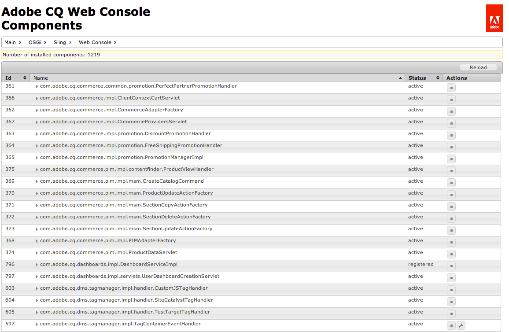

# 웹 콘솔{#web-console}

Adobe Experience Manager(AEM)의 웹 콘솔은 [Apache Felix 웹 관리 콘솔](https://felix.apache.org/documentation/subprojects/apache-felix-web-console.html). Apache Felix는 OSGi 프레임워크 및 표준 서비스를 포함하는 OSGi R4 서비스 플랫폼을 구현하기 위한 커뮤니티 작업입니다.

>[!NOTE]
>
>웹 콘솔에서 기본 설정을 언급하는 모든 설명은 Sling 기본값과 관련되어 있습니다.
>
>AEM에는 자체 기본값이 있으므로 설정된 기본값이 콘솔에 기록된 기본값과 다를 수 있습니다.

웹 콘솔은 다음을 포함하여 OSGi 번들을 유지 관리하기 위한 탭 선택을 제공합니다.

* [구성](#configuration): OSGi 번들 구성에 사용되므로 AEM 시스템 매개 변수를 구성하는 기본 메커니즘입니다
* [번들](#bundles): 번들 설치에 사용됨
* [구성 요소](#components): AEM에 필요한 구성 요소의 상태를 제어하는 데 사용됩니다

모든 변경 사항은 실행 중인 시스템에 즉시 적용됩니다. 다시 시작할 필요가 없습니다.

콘솔에서 액세스할 수 있습니다. `../system/console`; 예:

`http://localhost:4502/system/console/components`

## 구성 {#configuration}

다음 **구성** tab은 OSGi 번들을 구성하는 데 사용되므로 AEM 시스템 매개변수를 구성하는 기본 메커니즘입니다.

>[!NOTE]
>
>다음을 참조하십시오 [웹 콘솔을 사용한 OSGi 구성](/help/sites-deploying/configuring-osgi.md) 을 참조하십시오.

다음 **구성** 탭은 다음 방법 중 하나로 액세스할 수 있습니다.

* 드롭다운 메뉴:

  **OSGi >**

* URL입니다. 예:

  `http://localhost:4502/system/console/configMgr`

구성 목록이 표시됩니다.

이 화면의 드롭다운 목록에서 사용할 수 있는 구성 유형은 다음 두 가지입니다.

* **구성**
기존 구성을 업데이트할 수 있습니다. 영구 ID(PID)가 있으며 다음 중 하나일 수 있습니다.

   * 표준 및 AEM에 대한 정수 계열. 값을 삭제하면 기본 설정으로 되돌아갑니다.
   * 출하 시 구성에서 생성된 인스턴스: 이 인스턴스는 사용자가 생성하고, 삭제하면 인스턴스가 제거됩니다.

* **출하 시 구성**
필요한 기능 개체의 인스턴스를 만들 수 있습니다.

  이 ID는 영구 ID에 할당된 다음 구성 드롭다운 목록에 나열됩니다.

목록에서 항목을 선택하면 해당 구성과 관련된 매개 변수가 표시됩니다.

그런 다음 필요에 따라 매개변수를 업데이트할 수 있습니다.

* **저장**

  변경 사항을 저장합니다.

  출하 시 구성의 경우 영구 ID를 사용하는 인스턴스가 생성됩니다. 그러면 구성 아래에 새 인스턴스가 나열됩니다.

* **재설정**

  화면에 표시된 매개 변수를 마지막으로 저장된 매개 변수로 재설정합니다.

* **삭제**

  현재 구성을 삭제합니다. 표준인 경우 매개 변수가 기본 설정으로 반환됩니다. 공장 구성에서 생성된 경우 특정 인스턴스가 삭제됩니다.

* **바인딩 해제**

  번들에서 현재 구성을 바인딩 해제합니다.

* **취소**

  현재 변경 사항을 취소합니다.

## 번들 {#bundles}

다음 **번들** 탭은 AEM에 필요한 OSGi 번들을 설치하기 위한 메커니즘입니다. 탭은 다음 방법 중 하나를 사용하여 액세스할 수 있습니다.

* 드롭다운 메뉴:

  **OSGi >**

* URL입니다. 예:

  `http://localhost:4502/system/console/bundles`

번들 목록이 표시됩니다.

이 탭을 사용하여 다음과 같은 작업을 수행할 수 있습니다.

* **설치 또는 업데이트**

  다음을 수행할 수 있습니다. **찾아보기** 번들이 포함된 파일을 찾아 다음을 수행할지 여부를 지정합니다. **시작** 즉시 **시작 수준**.

* **다시 로드**

  표시된 목록을 새로 고칩니다.

* **패키지 새로 고침**

  모든 패키지의 참조를 확인하고 필요에 따라 새로 고칩니다.

  예를 들어 업데이트 후 이전 참조로 인해 이전 버전과 새 버전이 모두 실행될 수 있습니다. 이 옵션은 모든 참조를 확인하고 새 버전으로 이동하여 이전 버전을 중지할 수 있도록 합니다.

* **시작**

  지정된 시작 수준에 따라 번들을 시작합니다.

* **중지**

  번들을 중지합니다.

* **제거**

  시스템에서 번들을 제거합니다.

* **상태 보기**

  이 목록은 번들의 상태를 지정합니다. 추가 정보가 있는 특정 번들의 이름을 클릭합니다.

>[!NOTE]
>
>다음 이후 **업데이트**, Adobe은 다음을 수행할 것을 권장합니다. **패키지 새로 고침**.

## 구성 요소 {#components}

다음 **구성 요소** 탭에서는 다양한 구성 요소를 활성화 및/또는 비활성화할 수 있습니다. 다음 중 하나를 통해 액세스할 수 있습니다.

* 드롭다운 메뉴:

  **기본 >**

* URL입니다. 예:

  `http://localhost:4502/system/console/components`

구성 요소 목록이 표시됩니다. 다양한 아이콘을 사용하여 특정 구성 요소에 대한 구성 세부 정보를 활성화, 비활성화 또는 (해당되는 경우) 열 수 있습니다.

특정 구성 요소의 이름을 클릭하면 구성 요소 상태에 대한 추가 정보가 표시됩니다. 여기에서 구성 요소를 활성화, 비활성화 또는 다시 로드할 수도 있습니다.

>[!NOTE]
>
>구성 요소 활성화 또는 비활성화는 AEM/CRX가 다시 시작될 때까지 적용됩니다.
>
>시작 상태는 구성 요소 설명자 내에서 정의되며, 구성 요소 설명자는 개발 중에 생성되고 번들 생성 시 번들에 저장됩니다.
