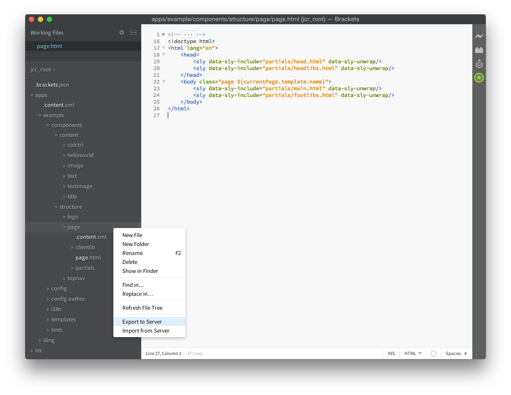

# AEM Brackets 확장{#aem-brackets-extension}

## 개요 {#overview}

AEM Brackets 확장은 AEM 구성 요소 및 클라이언트 라이브러리를 편집하는 매끄러운 워크플로를 제공하며 코드 편집기 내에서 Photoshop 파일 및 레이어에 액세스할 수 있는 [Brackets](https://brackets.io/) 코드 편집기의 기능을 사용합니다. 확장에서 제공하는 간편한 동기화(Maven 또는 File Vault 필요 없음)를 통해 개발자 효율성을 높이고 AEM 지식이 제한된 프론트엔드 개발자가 프로젝트에 참여할 수 있습니다. 또한 이 확장은 [HTL(HTML 템플릿 언어)](https://experienceleague.adobe.com/docs/experience-manager-htl/content/overview.html?lang=ko)에 대한 일부 지원도 제공하므로 JSP의 복잡성을 제거하여 구성 요소를 보다 쉽고 안전하게 개발할 수 있습니다.

### 기능 {#features}

AEM Brackets Extension의 주요 기능은 다음과 같습니다.

* 변경된 파일을 AEM 개발 인스턴스로 자동 동기화합니다.
* 파일 및 폴더의 수동 양방향 동기화
* 프로젝트의 전체 콘텐츠 패키지 동기화.
* 표현식 및 `data-sly-*` 블록 문에 대한 HTL 코드 완료입니다.

또한 Brackets에는 AEM 프론트엔드 개발자에게 유용한 기능이 많이 포함되어 있습니다.

* Photoshop 파일은 레이어, 측정, 색상, 글꼴, 텍스트 등과 같은 PSD 파일에서 정보를 추출하도록 지원합니다.
* 코드에서 추출된 정보를 쉽게 재사용하기 위해 PSD에서 코드 힌트를 얻습니다.
* LESS 및 SCSS와 같은 CSS 전처리기 지원.
* 또한 보다 구체적인 요구 사항을 충족하는 수백 개의 추가 확장 기능을 제공합니다.

## 설치 {#installation}

### 대괄호 {#brackets}

AEM Brackets 확장은 Brackets 버전 1.0 이상을 지원합니다.

[brackets.io](https://brackets.io/)에서 최신 Brackets 버전을 다운로드합니다.

### 확장 {#the-extension}

확장을 설치하려면 다음과 같이 진행합니다.

1. 대괄호를 엽니다. **파일** 메뉴에서 **Extension Manager...**&#x200B;을(를) 선택합니다.
1. 검색 창에 **AEM**&#x200B;을(를) 입력하고 **AEM Brackets Extension**&#x200B;을(를) 찾습니다.

   

1. **설치**&#x200B;를 클릭합니다.
1. 설치가 완료되면 대화 상자를 닫고 Extension Manager을 합니다.

## 시작 {#getting-started}

### 콘텐츠 패키지 프로젝트 {#the-content-package-project}

확장을 설치한 후 Brackets를 사용하여 파일 시스템에서 컨텐츠 패키지 폴더를 열어 AEM 구성 요소 개발을 시작할 수 있습니다.

프로젝트에는 최소한 다음 항목이 포함되어야 합니다.

1. `jcr_root` 폴더(예: `myproject/jcr_root`)

1. `filter.xml` 파일(예: `myproject/META-INF/vault/filter.xml`). `filter.xml` 파일의 구조에 대한 자세한 내용은 [Workspace 필터 정의](https://jackrabbit.apache.org/filevault/filter.html)를 참조하십시오.

대괄호 **파일** 메뉴에서 **폴더 열기...**&#x200B;를 선택하고 `jcr_root` 폴더 또는 상위 프로젝트 폴더를 선택합니다.

>[!NOTE]
>
>콘텐츠 패키지가 있는 고유한 프로젝트가 없는 경우 [HTL TodoMVC 예제](https://github.com/Adobe-Marketing-Cloud/aem-sightly-sample-todomvc)를 사용해 보십시오. GitHub에서 **ZIP 다운로드**&#x200B;를 클릭하고 로컬로 파일을 추출한 다음 위의 지침에 따라 Brackets에서 `jcr_root` 폴더를 엽니다. 그런 다음 아래 단계에 따라 **프로젝트 설정**&#x200B;을 설정하고, 마지막으로 전체 콘텐츠 패키지 동기화 섹션의 지침에 따라 **콘텐츠 패키지 내보내기**&#x200B;를 수행하여 전체 패키지를 AEM 개발 인스턴스에 업로드합니다.
>
>이 단계를 수행한 후에는 AEM 개발 인스턴스의 `/content/todo.html` URL에 액세스할 수 있어야 하며 Brackets에서 코드를 수정하기 시작하고 웹 브라우저에서 새로 고침을 수행한 후 변경 사항이 AEM 서버에 즉시 동기화되는 방법을 확인할 수 있습니다.

### 프로젝트 설정 {#project-settings}

AEM 개발 인스턴스와 콘텐츠를 동기화하려면 프로젝트 설정을 정의해야 합니다. **AEM** 메뉴로 이동하여 **프로젝트 설정...**&#x200B;을 선택하면 이 작업을 수행할 수 있습니다.

프로젝트 설정을 사용하여 다음을 정의할 수 있습니다.

1. 서버 URL(예: `http://localhost:4502`)
1. 유효한 HTTPS 인증서가 없는 서버를 허용할지 여부(필요한 경우 선택하지 않음)
1. 콘텐츠 동기화에 사용된 사용자 이름(예: `admin`)
1. 사용자 암호(예: `admin`)

## 컨텐츠 동기화 {#synchronizing-content}

AEM Brackets 확장은 `filter.xml`에 정의된 필터링 규칙에 의해 허용되는 파일 및 폴더에 대해 다음 유형의 콘텐츠 동기화를 제공합니다.

### 변경된 파일의 자동 동기화 {#automated-synchronization-of-changed-files}

이렇게 하면 Brackets의 변경 사항을 AEM 인스턴스와 동기화할 뿐 그 반대 방향으로는 동기화할 수 없습니다.

### 수동 양방향 동기화 {#manual-bidirectional-synchronization}

프로젝트 탐색기에서 파일 또는 폴더를 마우스 오른쪽 단추로 클릭하여 상황별 메뉴를 열면 **서버로 내보내기** 또는 **서버에서 가져오기** 옵션에 액세스할 수 있습니다.

>[!NOTE]
>
>선택한 항목이 `jcr_root` 폴더 밖에 있으면 **서버로 내보내기** 및 **서버에서 가져오기** 상황별 메뉴 항목을 사용할 수 없습니다.

### 전체 콘텐츠 패키지 동기화 {#full-content-package-synchronization}

**AEM** 메뉴에서 **콘텐츠 패키지 내보내기** 또는 **콘텐츠 패키지 가져오기** 옵션을 사용하면 전체 프로젝트를 서버와 동기화할 수 있습니다.

### 동기화 상태 {#synchronization-status}

AEM Brackets 확장 기능은 Brackets 창 오른쪽의 도구 모음에 마지막 동기화 상태를 나타내는 알림 아이콘을 제공합니다.

* 녹색 - 모든 파일이 정상적으로 동기화되었습니다.
* 파란색 - 동기화 작업이 진행 중입니다.
* 노란색 - 일부 파일이 동기화되지 않았습니다.
* 빨간색 - 동기화된 파일이 없음

알림 아이콘을 클릭하면 동기화된 각 파일의 모든 상태를 나열하는 동기화 상태 보고서 대화 상자가 열립니다.

>[!NOTE]
>
>`filter.xml`의 필터링 규칙에 의해 포함된 것으로 표시된 콘텐츠만 사용된 동기화 방법에 관계없이 동기화됩니다.
>
>또한 `.vltignore`개의 파일이 지원됩니다. 저장소에서 콘텐츠를 동기화하거나 동기화하지 못하도록 제외할 수 있습니다.

## HTL 코드 편집 {#editing-htl-code}

AEM Brackets Extension은 HTL 속성 및 표현식을 쉽게 작성할 수 있는 일부 자동 완성 기능도 제공합니다.

### 속성 자동 완성 {#attribute-auto-completion}

1. HTML 특성에 `sly`을(를) 입력합니다. 특성이 `data-sly-`(으)로 자동 완료되었습니다.
1. 드롭다운 목록에서 HTL 속성을 선택합니다.

### 표현식 자동 완성 {#expression-auto-completion}

`${}` 식 내에서 일반 변수 이름은 자동으로 완성됩니다.

## 추가 정보 {#more-information}

AEM Brackets 확장은 GitHub에서 [Adobe Marketing Cloud](https://github.com/Adobe-Marketing-Cloud) 조직이 Apache 라이센스 버전 2.0으로 호스팅하는 오픈 소스 프로젝트입니다.

* 코드 리포지토리: [https://github.com/Adobe-Marketing-Cloud/aem-sightly-brackets-extension](https://github.com/Adobe-Marketing-Cloud/aem-sightly-brackets-extension)
* Apache 라이선스, 버전 2.0: [https://www.apache.org/licenses/LICENSE-2.0.html](https://www.apache.org/licenses/LICENSE-2.0.html)

또한 Brackets 코드 편집기는 [Adobe Systems Incorporated](https://github.com/adobe) 조직에서 GitHub에 호스팅하는 오픈 소스 프로젝트입니다.

* 코드 리포지토리: [https://github.com/adobe/brackets](https://github.com/adobe/brackets)

자유롭게 기여하십시오!
