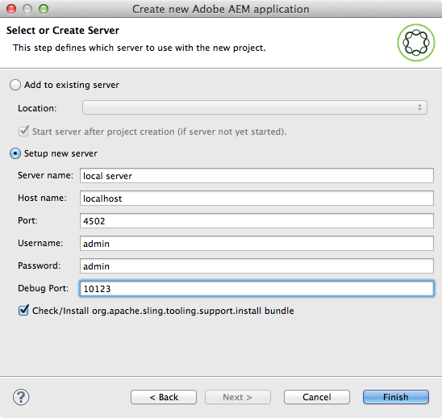

# Eclipse용 AEM 개발자 도구{#aem-developer-tools-for-eclipse}


## 개요 {#overview}

&quot;AEM Developer Tools&quot;는 다음을 기반으로 하는 Eclipse 플러그인입니다. [Apache Sling용 Eclipse 플러그인](https://sling.apache.org/documentation/development/ide-tooling.html) apache 라이센스 2에 따라 릴리스되었습니다.

AEM 개발을 쉽게 만드는 몇 가지 기능을 제공합니다.

* Eclipse Server Connector를 통해 AEM 인스턴스와 원활하게 통합됩니다.
* 콘텐츠 및 OSGI 번들 모두에 대한 동기화.
* 코드 핫 스왑 기능으로 디버깅 지원.
* 특정 프로젝트 만들기 마법사를 통한 AEM 프로젝트 단순 Bootstrap.
* JCR 속성을 쉽게 편집할 수 있습니다.

## 요구 사항 {#requirements}

AEM 개발자 도구를 사용하기 전에 다음을 수행하십시오.

* 다운로드 및 설치 [Java™ EE 개발자용 Eclipse IDE](https://www.eclipse.org/downloads/packages/release/luna/r/eclipse-ide-java-ee-developers). AEM 개발자 도구는 현재 Eclipse Kepler 이상을 지원합니다

* AEM 버전 5.6.1 이상에서 사용할 수 있습니다.
* Eclipse 설치를 구성하여 를 편집하여 1GB 이상의 힙 메모리가 있는지 확인합니다. `eclipse.ini` 에 설명된 대로 구성 파일 [Eclipse FAQ](https://wiki.eclipse.org/FAQ_How_do_I_increase_the_heap_size_available_to_Eclipse%3F).

>[!NOTE]
>
>macOS에서 마우스 오른쪽 단추 클릭 **Eclipse.app**&#x200B;을 선택한 다음 을 선택합니다 **패키지 내용 표시** 를 찾으려면 `eclipse.ini`.

## Eclipse용 AEM 개발자 도구를 설치하는 방법 {#how-to-install-the-aem-developer-tools-for-eclipse}

를 완료하면 [요구 사항](#requirements) 위에서 다음과 같이 플러그인을 설치할 수 있습니다.

1. 찾아보기 **AEM 개발자 도구** 웹 사이트 `https://eclipse.adobe.com/aem/dev-tools/`.

1. 다음을 복사합니다. **설치 링크**.

   또는 설치 링크를 사용하는 대신 아카이브를 다운로드할 수 있습니다. 이렇게 하면 오프라인 설치가 가능하지만 자동 업데이트 알림이 없습니다.

1. Eclipse에서 **도움말** 메뉴 아래의 제품에서 사용할 수 있습니다.
1. 클릭 **새 소프트웨어 설치**.
1. 클릭 **추가...**.
1. 위치 **이름** AEM 개발자 도구를 입력합니다.
1. 위치 **위치** 설치 URL을 복사합니다.
1. 클릭 **확인**.
1. 둘 다 확인 **AEM** 및 **슬링** plugins.
1. **다음**&#x200B;을 클릭합니다.
1. **다음**&#x200B;을 클릭합니다.
1. 사용권 계약에 동의하고 **완료**.
1. 클릭 **예** Eclipse를 다시 시작합니다.

## 기존 프로젝트를 가져오는 방법 {#how-to-import-existing-projects}

>[!NOTE]
>
>다음을 참조하십시오 [AEM에서 다운로드할 때 Eclipse에서 번들로 작업하는 방법](https://stackoverflow.com/questions/29699726/how-to-work-with-a-bundle-in-eclipse-when-it-was-downloaded-from-aem/29705407#29705407).

## AEM 관점 {#the-aem-perspective}

AEM Development Tools for Eclipse에는 AEM 프로젝트 및 인스턴스를 완벽하게 제어할 수 있는 관점이 포함되어 있습니다.


## 샘플 다중 모듈 프로젝트 {#sample-multi-module-project}

&quot;AEM 개발자 도구&quot;에는 Eclipse의 프로젝트 설정을 빠르게 시작하는 데 도움이 되는 샘플 다중 모듈 프로젝트가 포함되어 있습니다. 또한 여러 AEM 기능에 대한 모범 사례 안내서 역할을 합니다. [Project Archetype에 대해 자세히 알아보기](https://github.com/adobe/aem-project-archetype).

샘플 프로젝트를 만들려면 다음 단계를 완료하십시오.

1. 다음에서 **파일** > **신규** > **프로젝트** 메뉴, 다음 위치로 이동 **AEM** 섹션 및 선택 **AEM 샘플 다중 모듈 프로젝트**.

   

1. **다음**&#x200B;을 클릭합니다.

   >[!NOTE]
   >
   >m2eclipse는 Archetype 카탈로그를 스캔해야 하므로 이 단계는 시간이 걸릴 수 있습니다.

   

1. 선택 **com.adobe.granite.archetype : sample-project-archetype : (가장 높은 숫자)** 메뉴에서 을(를) 클릭한 다음 **다음**.

   

1. 다음을 입력하십시오. **이름**, **그룹 ID**, 및 **아티팩트 ID** 샘플 프로젝트용입니다. 일부 고급 속성을 설정하도록 선택할 수도 있습니다.

   

1. 이제 Eclipse가 연결할 수 있는 AEM 서버를 구성합니다.

   디버거 기능을 사용하려면 AEM을 디버그 모드로 시작했는지 확인하십시오. 이 모드는 명령줄에 다음을 추가하여 수행할 수 있습니다.

   ```
       -nofork -agentlib:jdwp=transport=dt_socket,server=y,suspend=n,address=10123
   ```

   

1. 클릭 **완료**. 프로젝트 구조가 생성됩니다.

   >[!NOTE]
   >
   >새로 설치 시(특히, Maven 종속 항목을 다운로드한 적이 없는 경우) 프로젝트가 오류와 함께 생성될 수 있습니다. 이 경우 다음에 설명된 절차를 따르십시오. [잘못된 프로젝트 정의 해결 중](#resolving-invalid-project-definition).

## 문제 해결 {#troubleshooting}

### 잘못된 프로젝트 정의 해결 중 {#resolving-invalid-project-definition}

잘못된 종속성 및 프로젝트 정의를 해결하려면 다음과 같이 진행합니다.

1. 생성된 모든 프로젝트를 선택합니다.
1. 마우스 오른쪽 버튼을 클릭합니다. 메뉴에서 **Maven**, 선택 **프로젝트 업데이트**.
1. 확인 **스냅샷/릴리스 강제 업데이트**.
1. **확인**&#x200B;을 클릭합니다. Eclipse는 필요한 종속성을 다운로드하려고 합니다.

### JSP 파일에서 태그 라이브러리 자동 완성 사용 {#enabling-tag-library-autocompletion-in-jsp-files}

적절한 종속성이 프로젝트에 추가되면 태그 라이브러리 자동 완성이 즉시 작동합니다. AEM Uber Jar를 사용할 때 필요한 tld 및 TagExtraInfo 파일이 포함되지 않는 알려진 문제가 있습니다.

이를 해결하려면 org.apache.sling.scripting.jsp.taglib 아티팩트가 AEM Uber Jar 앞의 클래스 경로에 있는지 확인합니다. Maven 프로젝트의 경우 Uber Jar 앞에 pom.xml에 다음 종속성을 배치합니다.

```xml
<dependency>
  <groupId>org.apache.sling</groupId>
  <artifactId>org.apache.sling.scripting.jsp.taglib</artifactId>
  <scope>provided</scope>
</dependency>
```

AEM 배포에 적합한 버전을 추가해야 합니다.

## 추가 정보 {#more-information}

Eclipse용 공식 Apache Sling IDE 툴링 웹사이트는 다음과 같은 유용한 정보를 제공합니다.

* 다음 [**Eclipse용 Apache Sling IDE 도구** 사용 안내서](https://sling.apache.org/documentation/development/ide-tooling.html), 이 설명서는 AEM 개발 도구에서 지원하는 전체 개념, 서버 통합 및 배포 기능을 안내합니다.
* 다음 [문제 해결 섹션](https://sling.apache.org/documentation/development/ide-tooling.html#troubleshooting).
* 다음 [알려진 문제 목록](https://sling.apache.org/documentation/development/ide-tooling.html#known-issues).

다음의 관리 [Eclipse](https://www.eclipse.org/) 설명서는 환경을 설정하는 데 도움이 될 수 있습니다.

* [Eclipse 시작하기](https://eclipseide.org/getting-started/)
* [이클립스 루나 도움말](https://help.eclipse.org/latest/index.jsp)
* [Maven 통합(m2eclipse)](https://www.eclipse.org/m2e/)
