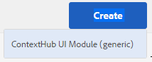

# ContextHub {#configuring-contexthub} 구성

ContextHub는 컨텍스트 데이터를 저장, 조작 및 표시하기 위한 프레임워크입니다. ContextHub에 대한 자세한 내용은 [개발자 설명서](/help/sites-developing/contexthub.md)를 참조하십시오. ContextHub은 터치 UI에서 [Client Context](/help/sites-administering/client-context.md)을 대체합니다.

[ContextHub](/help/sites-developing/contexthub.md) 도구 모음을 구성하여 미리 보기 모드에 나타나는지, ContextHub 스토어를 만들고, 터치에 적합한 UI를 사용하여 UI 모듈을 추가할 수 있습니다.

## ContextHub {#disabling-contexthub} 비활성화

기본적으로 AEM 설치에서는 ContextHub가 활성화됩니다. ContextHub를 비활성화하여 js/css를 로드하거나 초기화할 수 없습니다. ContextHub를 비활성화할 수 있는 두 가지 옵션이 있습니다.

* ContextHub 구성을 편집하고 **ContextHub 비활성화** 옵션을 선택합니다.

   1. 레일에서 **도구 > 사이트 > ContextHub**&#x200B;를 클릭하거나 탭합니다.
   1. 기본 **구성 컨테이너**&#x200B;를 클릭하거나 탭합니다.
   1. **ContextHub 구성**&#x200B;을 선택하고 **선택한 요소 편집**&#x200B;을 클릭하거나 탭합니다.
   1. **ContextHub 비활성화**&#x200B;을 클릭하거나 탭하고 **저장**&#x200B;을 클릭하거나 탭합니다.

또는

* CRXDE Lite을 사용하여 `disabled` 속성을 `/libs/settings/cloudsettings` 아래의 **true**&#x200B;로 설정합니다.

>[!NOTE]
>
>[AEM 6.4의 저장소 재조정](/help/sites-deploying/repository-restructuring.md) 으로 인해 ContextHub 구성 위치가 다음 `/etc/cloudsettings` 으로 변경되었습니다.
>
> * `/libs/settings/cloudsettings`
> * `/conf/global/settings/cloudsettings`
> * `/conf/<tenant>/settings/cloudsettings`


## ContextHub UI 표시 및 숨기기 {#showing-and-hiding-the-contexthub-ui}

페이지에서 [ContextHub UI](/help/sites-authoring/ch-previewing.md)을 표시하거나 숨기도록 Adobe Granite ContextHub OSGi 서비스를 구성합니다. 이 서비스의 PID는 `com.adobe.granite.contexthub.impl.ContextHubImpl.`입니다.

서비스를 구성하려면 [웹 콘솔](/help/sites-deploying/configuring-osgi.md#osgi-configuration-with-the-web-console)을 사용하거나 [JCR 노드를 리포지토리에서 사용할 수 있습니다.](/help/sites-deploying/configuring-osgi.md#osgi-configuration-in-the-repository):

* **웹 콘솔:** UI를 표시하려면 [UI 표시] 속성을 선택합니다. UI를 숨기려면 UI 숨기기 속성을 지우십시오.
* **JCR 노드:** UI를 표시하려면 부울  `com.adobe.granite.contexthub.show_ui` 속성을 로 설정합니다 `true`. UI를 숨기려면 속성을 `false`으로 설정합니다.

ContextHub UI를 표시할 때는 AEM 작성자 인스턴스의 페이지에만 나타납니다. UI는 게시 인스턴스의 페이지에 표시되지 않습니다.

## ContextHub UI 모드 및 모듈 추가 {#adding-contexthub-ui-modes-and-modules}

미리 보기 모드의 ContextHub 도구 모음에 표시되는 UI 모드 및 모듈을 구성합니다.

* UI 모드:관련 모듈 그룹
* 모듈:스토어의 컨텍스트 데이터를 노출하고 작성자가 컨텍스트를 조작할 수 있는 위젯

UI 모드는 도구 모음의 왼쪽에 일련의 아이콘으로 표시됩니다. 선택하면 UI 모드 모듈이 오른쪽에 나타납니다.


아이콘은 [Coral UI 아이콘 라이브러리](https://helpx.adobe.com/experience-manager/6-4/sites/developing/using/reference-materials/coral-ui/coralui3/Coral.Icon.html#availableIcons)의 참조입니다.

### UI 모드 {#adding-a-ui-mode} 추가

관련 ContextHub 모듈을 그룹화하는 UI 모드를 추가합니다. UI 모드를 만들 때 ContextHub 도구 모음에 표시되는 제목과 아이콘을 제공합니다.

1. Experience Manager 레일에서 도구 > 사이트 > 컨텍스트 허브를 클릭하거나 탭합니다.
1. 기본 구성 컨테이너를 클릭하거나 탭합니다.
1. 컨텍스트 허브 구성을 클릭하거나 탭합니다.
1. 만들기 단추를 클릭하거나 탭한 다음, Context Hub UI 모드를 클릭하거나 탭합니다.

   

1. 다음 속성에 대한 값을 제공합니다.

   * UI 모드 제목:UI 모드를 식별하는 제목
   * 모드 아이콘:사용할 [Coral UI 아이콘](https://helpx.adobe.com/experience-manager/6-4/sites/developing/using/reference-materials/coral-ui/coralui3/Coral.Icon.html#availableIcons)에 대한 선택기(예: `coral-Icon--user`)
   * 활성화됨:ContextHub 도구 모음에 UI 모드를 표시하려면 선택합니다.

1. 저장을 클릭하거나 탭합니다.

### UI 모듈 {#adding-a-ui-module} 추가

페이지 컨텐츠를 미리 보기 위해 ContextHub 도구 모음에 표시되도록 UI 모드에 ContextHub UI 모듈을 추가합니다. UI 모듈을 추가하면 ContextHub에 등록된 모듈 유형의 인스턴스를 만드는 것입니다. UI 모듈을 추가하려면 관련 모듈 유형의 이름을 알아야 합니다.

AEM에서는 UI 모듈을 기반으로 하는 몇 가지 샘플 UI 모듈 유형뿐만 아니라 기본 UI 모듈 유형을 제공합니다. 다음 표에서는 각 항목에 대한 간단한 설명을 제공합니다. 사용자 지정 UI 모듈 개발에 대한 자세한 내용은 [ContextHub UI 모듈 만들기](/help/sites-developing/ch-extend.md#creating-contexthub-ui-module-types)를 참조하십시오.

UI 모듈 속성에는 모듈별 속성에 대한 값을 제공할 수 있는 세부 구성이 포함됩니다. JSON 형식으로 세부 구성을 제공합니다. 표의 [모듈 유형] 열은 각 UI 모듈 유형에 필요한 JSON 코드에 대한 정보에 대한 링크를 제공합니다.

| 모듈 유형 | 설명 | 저장소 |
|---|---|---|
| [contexthub.base](/help/sites-developing/ch-samplemodules.md#contexthub-base-ui-module-type) | 일반 UI 모듈 유형 | UI 모듈 속성에 구성됨 |
| [contexthub.browserinfo](/help/sites-developing/ch-samplemodules.md#contexthub-browserinfo-ui-module-type) | 브라우저에 대한 정보를 표시합니다. | surferinfo |
| [contexthub.datetime](/help/sites-developing/ch-samplemodules.md#contexthub-datetime-ui-module-type) | 날짜 및 시간 정보를 표시합니다. | datetime |
| [contexthub.device](/help/sites-developing/ch-samplemodules.md#contexthub-device-ui-module-type) | 클라이언트 장치 표시 | 에뮬레이터 |
| [contexthub.location](/help/sites-developing/ch-samplemodules.md#contexthub-location-ui-module-type) | 클라이언트의 위도 및 경도와 지도의 위치를 표시합니다. 위치를 변경할 수 있습니다. | 위치 정보 |
| [contexthub.screen-orientation](/help/sites-developing/ch-samplemodules.md#contexthub-screen-orientation-ui-module-type) | 장치의 화면 방향(가로 또는 세로)을 표시합니다. | 에뮬레이터 |
| [contexthub.tagcloud](/help/sites-developing/ch-samplemodules.md#contexthub-tagcloud-ui-module-type) | 페이지 태그에 대한 통계를 표시합니다. | tagcloud |
| [granite.profile](/help/sites-developing/ch-samplemodules.md#granite-profile-ui-module-type) | authorizableID, displayName 및 familyName 등 현재 사용자에 대한 프로필 정보를 표시합니다. displayName 및 familyName의 값을 변경할 수 있습니다. | 프로필 |

1. Experience Manager 레일에서 도구 > 사이트 > ContextHub를 클릭하거나 탭합니다.
1. UI 모듈을 추가할 구성 컨테이너를 클릭하거나 탭합니다.
1. UI 모듈을 추가할 ContextHub 구성을 클릭하거나 입력합니다.
1. UI 모듈을 추가할 UI 모드를 클릭하거나 탭합니다.
1. 만들기 단추를 클릭하거나 탭한 다음 ContextHub UI 모듈(일반)을 클릭하거나 탭합니다.

   

1. 다음 속성에 대한 값을 제공합니다.

   * UI 모듈 제목:UI 모듈을 식별하는 제목
   * 모듈 유형:모듈 유형
   * 활성화됨:ContextHub 도구 모음에 UI 모듈을 표시하려면 선택합니다.

1. (선택 사항) 기본 저장소 구성을 무시하려면 JSON 개체를 입력하여 UI 모듈을 구성합니다.
1. 저장을 클릭하거나 탭합니다.

## ContextHub 저장소 {#creating-a-contexthub-store} 만들기

사용자 데이터를 유지하고 필요에 따라 데이터에 액세스하는 Context Hub 저장소를 만듭니다. ContextHub 저장소는 등록된 스토어 후보자를 기반으로 합니다. 스토어를 만들 때 스토어 후보가 등록된 storeType의 값이 필요합니다. (사용자 지정 스토어 후보자 만들기[를 참조하십시오.)](/help/sites-developing/ch-extend.md#creating-custom-store-candidates)

### 자세한 저장소 구성 {#detailed-store-configuration}

스토어를 구성할 때 [세부 사항 구성] 속성을 사용하면 스토어별 속성에 대한 값을 제공할 수 있습니다. 이 값은 스토어 `init` 함수의 `config` 매개 변수를 기반으로 합니다. 따라서 이 값과 값의 형식을 제공해야 하는지 여부는 스토어에 따라 다릅니다.

세부 구성 속성 값은 JSON 형식의 `config` 개체입니다.

### 샘플 스토어 후보자 {#sample-store-candidates}

AEM에서는 스토어를 기반으로 다음과 같은 샘플 스토어 지원자를 제공합니다.

| 스토어 유형 | 설명 |
|---|---|
| [aem.segmentation](/help/sites-developing/ch-samplestores.md#aem-segmentation-sample-store-candidate) | 해결된 및 해결되지 않은 ContextHub 세그먼트를 저장할 수 있습니다. ContextHub 세그먼트 관리자에서 세그먼트를 자동으로 검색합니다. |
| [aem.resoundsegments](/help/sites-developing/ch-samplestores.md#aem-resolvedsegments-sample-store-candidate) | 현재 해결된 세그먼트를 저장합니다. ContextHub SegmentManager 서비스를 수신하여 스토어를 자동으로 업데이트합니다. |
| [contexthub.geolocation](/help/sites-developing/ch-samplestores.md#contexthub-geolocation-sample-store-candidate) | 브라우저 위치의 위도와 경도를 저장합니다. |
| [contexthub.datetime](/help/sites-developing/ch-samplestores.md#contexthub-datetime-sample-store-candidate) | 브라우저 위치의 현재 날짜, 시간 및 계절을 저장합니다. |
| [granite.emulators](/help/sites-developing/ch-samplestores.md#granite-emulators-sample-store-candidate) | 여러 장치의 속성과 기능을 정의하고 현재 클라이언트 장치를 감지합니다. |
| [contexthub.generic-jsonp](/help/sites-developing/ch-samplestores.md#contexthub-generic-jsonp-sample-store-candidate) | JSONP 서비스에서 데이터를 검색하고 저장 |
| [granite.profile](/help/sites-developing/ch-samplestores.md#granite-profile-sample-store-candidate) | 현재 사용자의 프로필 데이터를 저장합니다. |
| [contexthub.surferinfo](/help/sites-developing/ch-samplestores.md#contexthub-surferinfo-sample-store-candidate) | 장치 정보, 브라우저 유형, 창 방향 등 클라이언트에 대한 정보를 저장합니다 |
| [contexthub.tagcloud](/help/sites-developing/ch-samplestores.md#contexthub-tagcloud-sample-data-store) | 페이지 태그 및 태그 카운트를 저장합니다. |

1. Experience Manager 레일에서 도구 > 사이트 > ContextHub를 클릭하거나 탭합니다.
1. 기본 구성 컨테이너를 클릭하거나 탭합니다.
1. 컨텍스트 구성 클릭 또는 탭
1. 스토어를 추가하려면 만들기 아이콘을 클릭하거나 탭한 다음 ContextHub 저장소 구성을 클릭하거나 탭합니다.

   

1. 기본 구성 속성에 대한 값을 제공한 다음 다음을 클릭하거나 탭합니다.

   * **구성 제목:** 스토어를 식별하는 제목
   * **스토어 유형: 스토어** 의 기반이 되는 스토어 대상의 storeType 속성 값
   * **필수:** 선택
   * **활성화됨:** 스토어를 활성화하려면 선택합니다.

1. (선택 사항) 기본 저장소 구성을 무시하려면 JSON(Detail Configuration) 상자에 JSON 개체를 입력합니다.
1. 저장을 클릭하거나 탭합니다.

## 예:JSONP 서비스 {#example-using-a-jsonp-service} 사용

이 예에서는 스토어를 구성하고 UI 모듈에 데이터를 표시하는 방법을 보여 줍니다. 이 예에서는 jsontest.com 사이트의 MD5 서비스가 스토어의 데이터 소스로 사용됩니다. 서비스는 지정된 문자열의 MD5 해시 코드를 JSON 형식으로 반환합니다.

서비스 호출 `https://md5.jsontest.com/?text=%22text%20to%20md5%22`에 대한 데이터를 저장하도록 contexthub.generic-jsonp 스토어가 구성됩니다. 서비스는 UI 모듈에 표시되는 다음 데이터를 반환합니다.

```xml
{
   "md5": "919a56ab62b6d5e1219fe1d95248a2c5",
   "original": "\"text to md5\""
}
```

### contexthub.generic-jsonp 스토어 {#creating-a-contexthub-generic-jsonp-store} 만들기

contexthub.generic-jsonp 샘플 저장소 후보를 사용하면 JSON 데이터를 반환하는 JSONP 서비스 또는 웹 서비스에서 데이터를 검색할 수 있습니다. 이 스토어 지원자의 경우 스토어 구성을 사용하여 사용할 JSONP 서비스에 대한 세부 정보를 제공합니다.

`ContextHub.Store.JSONPStore` Javascript 클래스의 [init](/help/sites-developing/contexthub-api.md#init-name-config) 함수는 이 저장소 후보를 초기화하는 `config` 개체를 정의합니다. `config` 개체에는 JSONP 서비스에 대한 세부 정보가 포함된 `service` 개체가 포함되어 있습니다. 스토어를 구성하려면 `service` 개체를 JSON 형식으로 [세부 구성] 속성 값으로 제공해야 합니다.

jsontest.com 사이트의 MD5 서비스에서 데이터를 저장하려면 다음 속성을 사용하여 [Creating a ContextHub Store](/help/sites-developing/ch-configuring.md#creating-a-contexthub-store)의 절차를 사용하십시오.

* **구성 제목:** md5
* **저장소 유형:** contexthub.generic-jsonp
* **필수:** 선택
* **활성화됨:** 선택
* **세부 정보 구성(JSON):**

   ```xml
   {
    "service": {
    "jsonp": false,
    "timeout": 1000,
    "ttl": 1800000,
    "secure": false,
    "host": "md5.jsontest.com",
    "port": 80,
    "params":{
    "text":"text to md5"
        }
      }
    }
   ```

### md5 데이터의 UI 모듈 추가 {#adding-a-ui-module-for-the-md-data}

UI 모듈을 ContextHub 도구 모음에 추가하여 예제 md5 저장소에 저장된 데이터를 표시합니다. 이 예에서 contexthub.base 모듈은 다음 UI 모듈을 생성하는 데 사용됩니다.


[UI 모듈 추가](#adding-a-ui-module)의 절차를 사용하여 샘플 UI 모드와 같은 기존 UI 모드에 UI 모듈을 추가합니다. UI 모듈의 경우 다음 속성 값을 사용하십시오.

* **UI 모듈 제목:** MD5
* **모듈 유형:** contexthub.base
* **세부 정보 구성(JSON):**

   ```xml
   {
    "icon": "coral-Icon--data",
    "title": "MD5 Converstion",
    "storeMapping": { "md5": "md5" },
    "template": "<p> {{md5.original}}</p>;
                 <p>{{md5.md5}}</p>"
   }
   ```

## ContextHub {#debugging-contexthub} 디버깅

ContextHub에 대한 디버깅 모드를 활성화하여 문제 해결을 허용할 수 있습니다. 디버그 모드는 ContextHub 구성 또는 CRXDE를 통해 활성화할 수 있습니다.

### 구성 {#via-the-configuration} 사용

ContextHub 구성을 편집하고 **디버그** 옵션을 선택합니다.

1. 레일에서 **도구 > 사이트 > ContextHub**&#x200B;를 클릭하거나 탭합니다.
1. 기본 **구성 컨테이너**&#x200B;를 클릭하거나 탭합니다.
1. **ContextHub 구성**&#x200B;을 선택하고 **선택한 요소 편집**&#x200B;을 클릭하거나 탭합니다.
1. **디버그**&#x200B;를 클릭하거나 탭하고 **저장**&#x200B;을 클릭하거나 탭합니다.

### CRXDE {#via-crxde}을 통해

CRXDE Lite을 사용하여 속성 `debug`을 다음 아래에 **true**&#x200B;로 설정합니다.

* `/conf/global/settings/cloudsettings` 또는
* `/conf/<tenant>/settings/cloudsettings`

>[!NOTE]
>
>ContextHub 구성이 여전히 이전 경로 아래에 있는 경우 `debug property`을(를) 설정할 위치는 `/libs/settings/cloudsettings/legacy/contexthub`입니다.

### 자동 모드 {#silent-mode}

자동 모드를 사용하면 모든 디버그 정보가 표시되지 않습니다. 각 ContextHub 구성에 대해 독립적으로 설정할 수 있는 일반 디버그 옵션과 달리, 자동 모드는 ContextHub 구성 수준에서 모든 디버그 설정을 우선하는 전역 설정입니다.

디버그 정보를 전혀 원하지 않는 게시 인스턴스에 유용합니다. 전역 설정이므로 OSGi를 통해 활성화됩니다.

1. **Adobe Experience Manager 웹 콘솔 구성**&#x200B;을 `http://<host>:<port>/system/console/configMgr`에서 엽니다.
1. **Adobe Granite ContextHub** 검색
1. **Adobe Granite ContextHub** 구성을 클릭하여 해당 속성을 편집합니다.
1. **자동 모드** 옵션을 선택하고 **저장**&#x200B;을 클릭합니다.

## {#recovering-contexthub-configurations-after-upgrading} 업그레이드 후 ContextHub 구성 복구

[AEM](/help/sites-deploying/upgrade.md)으로 업그레이드가 수행되면 ContextHub 구성이 백업되어 안전한 위치에 저장됩니다. 업그레이드 중에 기본 ContextHub 구성이 설치되고 기존 구성이 교체됩니다. 수행한 변경 사항이나 추가 사항을 보존하려면 백업이 필요합니다.

ContextHub 구성은 다음 노드 아래의 `contexthub`이라는 폴더에 저장됩니다.

* `/conf/global/settings/cloudsettings`
* `/conf/<tenant>/settings/cloudsettings`

업그레이드 후 백업은 이름이 다음과 같은 노드 아래 `contexthub`인 폴더에 저장됩니다.

`/conf/global/settings/cloudsettings/default-pre-upgrade_yyyymmdd_xxxxxxx` 또는
`/conf/<tenant>/settings/cloudsettings/default-pre-upgrade_yyyymmdd_xxxxxxx`

노드 이름의 `yyyymmdd` 부분은 업그레이드가 수행된 날짜입니다.

ContextHub 구성을 복구하려면 CRXDE Lite을 사용하여 저장소, UI 모드 및 UI 모듈을 나타내는 노드를 `default-pre-upgrade_yyyymmdd_xxxxxx` 노드 아래의 노드로 복사합니다.

* `/conf/global/settings/cloudsettings` 또는
* `/conf/<tenant>/settings/cloudsettings`
