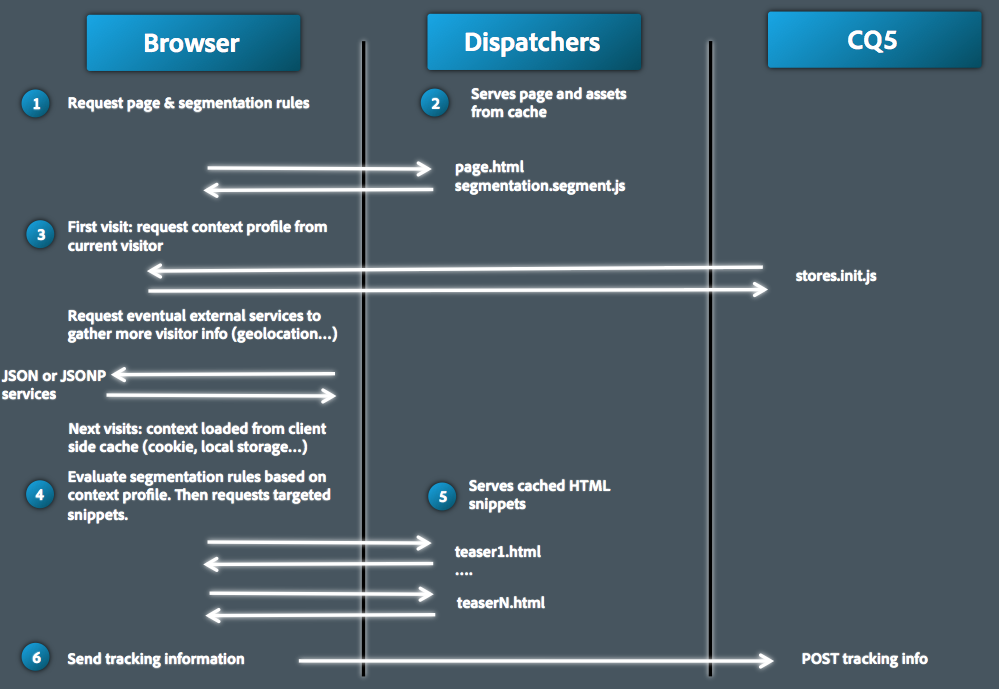

# Client Context 관련 세부 사항{#client-context-in-detail}

>[!NOTE]
>
>Client Context가 ContextHub로 대체되었습니다. 다음을 참조하십시오. [관련 설명서](/help/sites-developing/contexthub.md) 을 참조하십시오.

Client Context는 동적으로 조립된 사용자 데이터의 컬렉션을 나타냅니다. 데이터를 사용하여 주어진 상황(콘텐츠 타겟팅)에서 웹 페이지에 표시할 콘텐츠를 결정할 수 있습니다. 이 데이터는 웹 사이트 분석 및 페이지의 모든 JavaScript에도 사용할 수 있습니다.

Client Context는 주로 다음 측면으로 구성됩니다.

* 사용자 데이터를 포함하는 세션 저장소입니다.
* 사용자 데이터를 표시하고 사용자 경험을 시뮬레이션하는 도구를 제공하는 UI.
* A [javascript API](/help/sites-developing/ccjsapi.md) 세션 저장소와 상호 작용할 수 있습니다.

독립 실행형 세션 저장소를 만들어 Client Context에 추가하거나 Context Store 구성 요소에 연결된 세션 저장소를 만듭니다. AEM은 바로 사용할 수 있는 여러 Context Store 구성 요소를 설치합니다. 이러한 구성 요소를 구성 요소의 기반으로 사용할 수 있습니다.

Client Context 열기, 표시되는 정보 구성 및 사용자 경험 시뮬레이션에 대한 자세한 내용은 다음을 참조하십시오. [Client Context](/help/sites-administering/client-context.md).

## 세션 저장소 {#session-stores}

Client Context에는 사용자 데이터를 포함하는 다양한 세션 저장소가 포함되어 있습니다. 저장소 데이터는 다음 소스에서 가져옵니다.

* 클라이언트 웹 브라우저입니다.
* 서버(참조) [JSONP 저장소](/help/sites-administering/client-context.md#main-pars-variable-8) 타사 소스의 정보를 저장하는 경우)

Client Context 프레임워크는 [javascript API](/help/sites-developing/ccjsapi.md) 를 사용하여 세션 저장소와 상호 작용하여 사용자 데이터를 읽고 쓰고, 저장 이벤트를 수신하고 반응할 수 있습니다. 콘텐츠 타겟팅 또는 다른 용도로 사용하는 사용자 데이터에 대한 세션 저장소를 만들 수도 있습니다.

세션 저장소 데이터는 클라이언트에 유지됩니다. Client Context는 서버에 데이터를 다시 쓰지 않습니다. 데이터를 서버로 보내려면 양식을 사용하거나 사용자 지정 JavaScript를 개발하십시오.

각 세션 저장소는 속성-값 쌍의 컬렉션입니다. 세션 저장소는 데이터의 컬렉션(어떤 종류든)을 나타내며, 개념적인 의미는 디자이너 및/또는 개발자가 결정할 수 있습니다. 다음 예제 JavaScript 코드는 세션 저장소에 포함될 수 있는 프로필 데이터를 나타내는 개체를 정의합니다.

```
{
  age: 20,
  authorizableId: "aparker@geometrixx.info",
  birthday: "27 Feb 1992",
  email: "aparker@geometrixx.info",
  formattedName: "Alison Parker",
  gender: "female",
  path: "/home/users/geometrixx/aparker@geometrixx.info/profile"
}
```

세션 저장소는 브라우저 세션 간에 지속되거나, 생성된 브라우저 세션에 대해서만 지속될 수 있습니다.

>[!NOTE]
>
>저장소 지속성은 브라우저 저장소 또는 쿠키( `SessionPersistence` cookie). 브라우저 스토리지가 더 일반적입니다.
>
>브라우저를 닫고 다시 열면 세션 저장소는 지속 저장소의 값으로 로드될 수 있습니다. 브라우저 캐시를 지우면 이전 값이 제거됩니다.

### 컨텍스트 저장소 구성 요소 {#context-store-components}

컨텍스트 저장소 구성 요소는 Client Context에 추가할 수 있는 CQ 구성 요소입니다. 일반적으로 컨텍스트 저장소 구성 요소는 연결된 세션 저장소의 데이터를 표시합니다. 그러나 컨텍스트 저장소 구성 요소가 표시하는 정보는 세션 저장소 데이터로 제한되지 않습니다.

컨텍스트 저장소 구성 요소에는 다음 항목이 포함될 수 있습니다.

* Client Context에서 모양을 정의하는 JSP 스크립트입니다.
* 사이드 킥에서 구성 요소를 나열하기 위한 속성입니다.
* 구성 요소 인스턴스 구성을 위한 편집 대화 상자
* 세션 저장소를 초기화하는 JavaScript.

Context Store에 추가할 수 있는 설치된 Context Store 구성 요소에 대한 설명은 을 참조하십시오. [사용 가능한 Client Context 구성 요소](/help/sites-administering/client-context.md#available-client-context-components).

>[!NOTE]
>
>페이지 데이터는 더 이상 클라이언트 컨텍스트에 기본 구성 요소로 포함되어 있지 않습니다. 필요한 경우 클라이언트 컨텍스트를 편집하고 **범용 저장소 속성** 구성 요소를 선택한 다음, 구성 요소를 구성하여 **저장** 다음으로: `pagedata`.

### 타깃팅된 컨텐츠 전달 {#targeted-content-delivery}

프로필 정보도 게재에 사용됩니다 [타겟팅된 콘텐츠](/help/sites-authoring/content-targeting-touch.md).

 

## 페이지에 Client Context 추가 {#adding-client-context-to-a-page}

Client Context 구성 요소를 웹 페이지의 본문 섹션에 포함시켜 Client Context를 활성화합니다. Client Context 구성 요소 노드의 경로는 다음과 같습니다. `/libs/cq/personalization/components/clientcontext`. 구성 요소를 포함하려면 아래 페이지 구성 요소의 JSP 파일에 다음 코드를 추가하십시오. `body` 페이지의 요소:

```java
<cq:include path="clientcontext" resourceType="cq/personalization/components/clientcontext"/>
```

clientcontext 구성 요소를 사용하면 페이지에서 Client Context를 구현하는 클라이언트 라이브러리를 로드할 수 있습니다.

* Client Context Javascript API.
* 세션 저장소, 이벤트 관리 등을 지원하는 Client Context 프레임워크
* 정의된 세그먼트입니다.
* Client Context에 추가된 각 컨텍스트 저장소 구성 요소에 대해 생성된 init.js 스크립트입니다.
* (작성자 인스턴스만 해당) Client Context UI입니다.

Client Context UI는 작성자 인스턴스에서만 사용할 수 있습니다.

## Client Context 확장 {#extending-client-context}

Client Context를 확장하려면 세션 저장소를 작성하고 선택적으로 저장소 데이터를 표시합니다.

* 콘텐츠 타겟팅 및 웹 분석에 필요한 사용자 데이터에 대한 세션 저장소를 만듭니다.
* 관리자가 연관된 세션 저장소를 구성하고, 테스트 목적으로 Client Context에 저장소 데이터를 표시할 수 있도록 하는 컨텍스트 저장소 구성 요소를 만듭니다.

>[!NOTE]
>
>다음을 보유한(또는 만드는) 경우 `JSONP` 데이터를 제공할 수 있는 서비스에서는 `JSONP` 컨텍스트 저장소 구성 요소를 사용하여 JSONP 서비스에 매핑합니다. 이렇게 하면 세션 저장소가 처리됩니다.

### 세션 저장소 만들기 {#creating-a-session-store}

Client Context에서 추가하고 검색해야 하는 데이터에 대한 세션 저장소를 만듭니다. 일반적으로 다음 절차를 사용하여 세션 저장소를 생성합니다.

1. 다음 항목이 있는 클라이언트 라이브러리 폴더 만들기 `categories` 속성 값: `personalization.stores.kernel`. Client Context는 이 범주의 클라이언트 라이브러리를 자동으로 로드합니다.

1. 클라이언트 라이브러리 폴더가에 종속되도록 클라이언트 라이브러리 폴더 구성 `personalization.core.kernel` 클라이언트 라이브러리 폴더입니다. 다음 `personalization.core.kernel` 클라이언트 라이브러리는 Client Context javascript API를 제공합니다.

1. 세션 저장소를 생성하고 초기화하는 JavaScript를 추가합니다.

personalization.stores.kernel 클라이언트 라이브러리에 javascript를 포함하면 Client Context 프레임워크가 로드될 때 저장소가 생성됩니다.

>[!NOTE]
>
>컨텍스트 저장소 구성 요소의 일부로 세션 저장소를 만드는 경우, 또는 구성 요소의 init.js.jsp 파일에 javascript를 배치할 수 있습니다. 이 경우 구성 요소가 Client Context에 추가되는 경우에만 세션 저장소가 생성됩니다.

#### 세션 저장소 유형 {#types-of-session-stores}

세션 저장소는 브라우저 세션 중에 생성되어 사용할 수 있거나 브라우저 저장소 또는 쿠키에서 유지됩니다. Client Context Javascript API는 두 가지 유형의 데이터 저장소를 나타내는 여러 클래스를 정의합니다.

* ` [CQ_Analytics.SessionStore](/help/sites-developing/ccjsapi.md#cq-analytics-sessionstore)`: 이러한 개체는 페이지 DOM에만 있습니다. 데이터는 페이지 수명 동안 만들어지고 지속됩니다.
* ` [CQ_Analytics.PerstistedSessionStore](/help/sites-developing/ccjsapi.md#cq-analytics-persistedsessionstore)`: 이러한 개체는 페이지 DOM에 있으며 브라우저 스토리지 또는 쿠키에 유지됩니다. 데이터는 페이지 및 사용자 세션에서 사용할 수 있습니다.

API는 JSON 데이터 또는 JSONP 데이터 저장에 특화된 다음 클래스의 확장도 제공합니다.

* 세션 전용 개체: [CQ_Analytics.JSONStore](/help/sites-developing/ccjsapi.md#cq-analytics-jsonstore) 및 [CQ_Analytics.JSONPtore](/help/sites-developing/ccjsapi.md#cq-analytics-jsonpstore).

* 지속 개체: [CQ_Analytics.PersistedJSONStore](/help/sites-developing/ccjsapi.md#cq-analytics-persistedjsonstore) 및 [CQ_Analytics.PersistedJSONPtore](/help/sites-developing/ccjsapi.md#cq-analyics-persistedjsonpstore).

#### 세션 저장소 개체 만들기 {#creating-the-session-store-object}

클라이언트 라이브러리 폴더의 javascript는 세션 저장소를 생성하고 초기화합니다. 그런 다음 컨텍스트 저장소 관리자를 사용하여 세션 저장소를 등록해야 합니다. 다음 예제에서는 를 만들고 등록합니다 [CQ_Analytics.SessionStore](/help/sites-developing/ccjsapi.md#cq-analytics-sessionstore) 개체.

```
//Create the session store
if (!CQ_Analytics.MyStore) {
    CQ_Analytics.MyStore = new CQ_Analytics.SessionStore();
    CQ_Analytics.MyStore.STOREKEY = "MYSTORE";
    CQ_Analytics.MyStore.STORENAME = "mystore";
    CQ_Analytics.MyStore.data={};
}
//register the session store
if (CQ_Analytics.ClientContextMgr){
    CQ_Analytics.ClientContextMgr.register(CQ_Analytics.MyStore)
}
```

JSON 데이터를 저장하기 위해 다음 예제에서는 를 만들고 등록합니다. [CQ_Analytics.JSONStore](/help/sites-developing/ccjsapi.md#cq-analytics-sessionstore) 개체.

```
if (!CQ_Analytics.myJSONStore) {
    CQ_Analytics.myJSONStore = CQ_Analytics.JSONStore.registerNewInstance("myjsonstore",{});
}
```

### 컨텍스트 저장소 구성 요소 만들기 {#creating-a-context-store-component}

Client Context에서 세션 저장소 데이터를 렌더링할 컨텍스트 저장소 구성 요소를 만듭니다. 작성되면 컨텍스트 저장소 구성 요소를 Client Context로 드래그하여 세션 저장소의 데이터를 렌더링할 수 있습니다. 컨텍스트 저장소 구성 요소는 다음 항목으로 구성됩니다.

* 데이터 렌더링용 JSP 스크립트입니다.
* 편집 대화 상자
* 세션 저장소를 초기화하기 위한 JSP 스크립트입니다.
* (선택 사항) 세션 저장소를 생성하는 클라이언트 라이브러리 폴더입니다. 구성 요소가 기존 세션 저장소를 사용하는 경우 클라이언트 라이브러리 폴더를 포함할 필요가 없습니다.

#### 제공된 컨텍스트 저장소 구성 요소 확장 {#extending-the-provided-context-store-components}

AEM에서는 확장할 수 있는 genericstore 및 genericstoreproperties 컨텍스트 저장소 구성 요소를 제공합니다. 저장소 데이터 구조에 따라 확장할 구성 요소가 결정됩니다.

* 속성-값 쌍: `GenericStoreProperties` 구성 요소. 이 구성 요소는 속성-값 쌍의 저장소를 자동으로 렌더링합니다. 다음과 같은 몇 가지 상호 작용 지점이 제공됩니다.

   * `prolog.jsp` 및 `epilog.jsp`: 구성 요소 렌더링 전 또는 후에 서버측 로직을 추가할 수 있는 구성 요소 상호 작용

* 복잡한 데이터: `GenericStore` 구성 요소. 그런 다음 세션 저장소에는 구성 요소를 렌더링해야 할 때마다 호출되는 &quot;렌더러&quot; 메서드가 필요합니다. renderer 함수는 두 개의 매개 변수를 사용하여 호출됩니다.

   * `@param {String} store`
렌더링할 스토어

   * `@param {String} divId`
스토어를 렌더링해야 하는 div의 ID입니다.

>[!NOTE]
>
>모든 Client Context 구성 요소는 일반 저장소 또는 일반 저장소 속성 구성 요소의 확장입니다. 에 몇 가지 예가 설치됩니다. `/libs/cq/personalization/components/contextstores` 폴더를 삭제합니다.

#### 사이드 킥의 모양 구성 {#configuring-the-appearance-in-sidekick}

Client Context를 편집할 때 컨텍스트 저장소 구성 요소가 사이드 킥에 나타납니다. 모든 구성 요소와 마찬가지로 `componentGroup` 및 `jcr:title` client context 구성 요소의 속성은 구성 요소의 그룹 및 이름을 결정합니다.

가 있는 모든 구성 요소 `componentGroup` 속성 값: `Client Context` 기본적으로 사이드 킥에 나타납니다. 에 다른 값을 사용하는 경우 `componentGroup` 속성을 사용하려면 디자인 모드를 사용하여 구성 요소를 사이드 킥에 수동으로 추가해야 합니다.

#### 컨텍스트 저장소 구성 요소 인스턴스 {#context-store-component-instances}

컨텍스트 저장소 구성 요소를 Client Context에 추가하면 구성 요소 인스턴스를 나타내는 노드가 아래에 만들어집니다 `/etc/clientcontext/default/content/jcr:content/stores`. 이 노드에는 구성 요소의 편집 대화 상자를 사용하여 구성된 속성 값이 포함되어 있습니다.

Client Context가 초기화되면 이러한 노드가 처리됩니다.

#### 연결된 세션 저장소 초기화 {#initializing-the-associated-session-store}

init.js.jsp 파일을 구성 요소에 추가하여 컨텍스트 저장소 구성 요소가 사용하는 세션 저장소를 초기화하는 javascript 코드를 생성합니다. 예를 들어 초기화 스크립트를 사용하여 구성 요소에 대한 구성 속성을 검색하고 이를 사용하여 세션 저장소를 채웁니다.

생성된 Javascript는 작성자 및 게시 인스턴스 모두에서 페이지 로드 시 Client Context가 초기화될 때 페이지에 추가됩니다. 이 JSP는 컨텍스트 저장소 구성 요소 인스턴스가 로드되고 렌더링되기 전에 실행됩니다.

코드는 파일의 mime 유형을 다음으로 설정해야 합니다. `text/javascript`또는 실행되지 않습니다.

>[!CAUTION]
>
>init.js.jsp 스크립트는 작성자 및 게시 인스턴스에서 실행되지만 컨텍스트 저장소 구성 요소가 Client Context에 추가되는 경우에만 실행됩니다.

다음 절차에서는 init.js.jsp 스크립트 파일을 만들고 올바른 MIME 유형을 설정하는 코드를 추가합니다. 저장소 초기화를 수행하는 코드가 따릅니다.

1. 컨텍스트 저장소 구성 요소 노드를 마우스 오른쪽 단추로 클릭하고 만들기 > 파일 만들기를 클릭합니다.
1. 이름 필드에 `init.js.jsp` 그런 다음 확인을 클릭합니다.
1. 페이지 맨 위에서 다음 코드를 추가한 다음 모두 저장을 클릭합니다.

   ```java
   <%@page contentType="text/javascript" %>
   ```

### genericstoreproperties 구성 요소에 대한 세션 저장소 데이터 렌더링 {#rendering-session-store-data-for-genericstoreproperties-components}

일관된 형식을 사용하여 Client Context에 세션 저장소 데이터를 표시합니다.

#### 속성 데이터 표시 {#displaying-property-data}

개인화 taglib은 `personalization:storePropertyTag` 세션 저장소의 속성 값을 표시하는 태그입니다. 태그를 사용하려면 JSP 파일에 다음 코드 행을 포함하십시오.

```xml
<%@taglib prefix="personalization" uri="https://www.day.com/taglibs/cq/personalization/1.0" %>
```

태그는 다음 형식을 갖습니다.

```xml
<personalization:storePropertyTag propertyName="property_name" store="session_store_name"/>
```

다음 `propertyName` attribute는 표시할 스토어 속성의 이름입니다. 다음 `store` attribute는 등록된 저장소의 이름입니다. 다음 예제 태그는 `authorizableId` 의 속성 `profile` 스토어:

```xml
<personalization:storePropertyTag propertyName="authorizableId" store="profile"/>
```

#### HTML 구조 {#html-structure}

personalization.ui 클라이언트 라이브러리 폴더(/etc/clientlibs/foundation/personalization/ui/themes/default)는 Client Context가 HTML 코드의 형식을 지정하는 데 사용하는 CSS 스타일을 제공합니다. 다음 코드는 저장소 데이터를 표시하는 데 사용할 제안된 구조를 보여 줍니다.

```xml
<div class="cq-cc-store">
   <div class="cq-cc-thumbnail">
      <div class="cq-cc-store-property">
           <!-- personalization:storePropertyTag for the store thumbnail image goes here -->
      </div>
   </div>
   <div class="cq-cc-content">
       <div class="cq-cc-store-property cq-cc-store-property-level0">
           <!-- personalization:storePropertyTag for a store property goes here -->
       </div>
       <div class="cq-cc-store-property cq-cc-store-property-level1">
           <!-- personalization:storePropertyTag for a store property goes here -->
       </div>
       <div class="cq-cc-store-property cq-cc-store-property-level2">
           <!-- personalization:storePropertyTag for a store property goes here -->
       </div>
       <div class="cq-cc-store-property cq-cc-store-property-level3">
           <!-- personalization:storePropertyTag for a store property goes here -->
       </div>
   </div>
   <div class="cq-cc-clear"></div>
</div>
```

다음 `/libs/cq/personalization/components/contextstores/profiledata` 컨텍스트 저장소 구성 요소는 이 구조를 사용하여 프로필 세션 저장소의 데이터를 표시합니다. 다음 `cq-cc-thumbnail` 클래스는 썸네일 이미지를 배치합니다. 다음 `cq-cc-store-property-level*x*` 클래스는 영숫자 데이터의 형식을 지정합니다.

* level0, level1, level2는 세로로 분포하며 흰색 글꼴을 사용한다.
* level3 및 추가 레벨은 가로로 배포되며 배경이 어두운 흰색 글꼴을 사용합니다.


### genericstore 구성 요소에 대한 세션 저장소 데이터 렌더링 {#rendering-session-store-data-for-genericstore-components}

genericstore 구성 요소를 사용하여 저장소 데이터를 렌더링하려면 다음을 수행해야 합니다.

* personalization:storeRendererTag 태그를 구성 요소 JSP 스크립트에 추가하여 세션 저장소의 이름을 식별합니다.
* 세션 저장소 클래스에서 렌더러 메서드를 구현합니다.

#### genericstore 세션 저장소 식별 {#identifying-the-genericstore-session-store}

개인화 taglib은 `personalization:storePropertyTag` 세션 저장소의 속성 값을 표시하는 태그입니다. 태그를 사용하려면 JSP 파일에 다음 코드 행을 포함하십시오.

```xml
<%@taglib prefix="personalization" uri="https://www.day.com/taglibs/cq/personalization/1.0" %>
```

태그는 다음 형식을 갖습니다.

```java
<personalization:storeRendererTag store="store_name"/>
```

#### 세션 저장소 렌더러 메서드 구현 {#implementing-the-session-store-renderer-method}

그런 다음 세션 저장소에는 구성 요소를 렌더링해야 할 때마다 호출되는 &quot;렌더러&quot; 메서드가 필요합니다. renderer 함수는 두 개의 매개 변수를 사용하여 호출됩니다.

* @param {String} 저장소 렌더링할 저장소
* @param을 렌더링해야 하는 div의 {String} divId입니다.

## 세션 저장소와 상호 작용 {#interacting-with-session-stores}

Javascript를 사용하여 세션 스토어와 상호 작용합니다.

### 세션 저장소 액세스 {#accessing-session-stores}

저장소에 데이터를 읽거나 쓸 세션 저장소 개체를 가져옵니다. [CQ_Analytics.ClientContextMgr](/help/sites-developing/ccjsapi.md#cq-analytics-clientcontextmgr) 은 저장소 이름을 기반으로 저장소에 대한 액세스를 제공합니다. 가져온 후에는 다음 메서드를 사용합니다. [CQ_Analytics.SessionStore](/help/sites-developing/ccjsapi.md#cq-analytics-sessionstore) 또는 [CQ_Analytics.PersistedSessionStore](/help/sites-developing/ccjsapi.md#cq-analytics-persistedsessionstore) : 스토어 데이터와 상호 작용합니다.

다음 예제는 `profile` 을(를) 저장한 다음 `formattedName` 저장소에서 가져온 속성입니다.

```
function getName(){
   var profilestore = CQ_Analytics.ClientContextMgr.getRegisteredStore("profile");
   if(profilestore){
      return profilestore.getProperty("formattedName", false);
   } else {
      return null;
   }
}
```

### 세션 저장소 업데이트에 대한 리스너 생성 {#creating-a-listener-to-react-to-a-session-store-update}

세션은 실행 이벤트를 저장하므로 이러한 이벤트를 기반으로 리스너를 추가하고 이벤트를 트리거할 수 있습니다.

세션 저장소는 `Observable` 패턴. 확장됩니다 [ `CQ_Analytics.Observable`](/help/sites-developing/ccjsapi.md#cq-analytics-observable) 다음을 제공합니다. ` [addListener](/help/sites-developing/ccjsapi.md#addlistener-event-fct-scope)` 메서드를 사용합니다.

다음 예에서는 리스너를 `update` 이벤트 `profile` 세션 저장소입니다.

```
var profileStore = ClientContextMgr.getRegisteredStore("profile");
if( profileStore ) {
  //callback execution context
  var executionContext = this;

  //add "update" event listener to store
  profileStore.addListener("update",function(store, property) {
    //do something on store update

  },executionContext);
}
```

### 세션 저장소가 정의 및 초기화되었는지 확인하는 중 {#checking-that-a-session-store-is-defined-and-initialized}

세션 저장소는 데이터로 로드되고 초기화될 때까지 사용할 수 없습니다. 다음 요소는 세션 저장소 사용 가능 시점에 영향을 줄 수 있습니다.

* 페이지 로드 중
* JavaScript 로드 중
* JavaScript 실행 시간
* XHR 요청에 대한 응답 시간
* 세션 저장소에 대한 동적 변경 사항

사용 [CQ_Analytics.ClientContextUtils](/help/sites-developing/ccjsapi.md#cq-analytics-clientcontextutils) 개체 [onStoreRegisted](/help/sites-developing/ccjsapi.md#onstoreregistered-storename-callback) 및 [onStoreInitiated](/help/sites-developing/ccjsapi.md#onstoreinitialized-storename-callback-delay) 사용 가능한 경우에만 세션 저장소에 액세스하는 방법입니다. 이러한 메서드를 사용하면 세션 등록 및 초기화 이벤트에 반응하는 이벤트 리스너를 등록할 수 있습니다.

>[!CAUTION]
>
>다른 매장에 의존한다면 매장이 등록되지 않은 경우를 대비해야 한다.

다음 예제에서는 `onStoreRegistered` 이벤트 `profile` 세션 저장소입니다. 저장소가 등록되면 수신기가 `update` 세션 저장소의 이벤트입니다. 스토어가 업데이트되면 의 `<div class="welcome">` 페이지의 요소가 의 이름으로 업데이트됨 `profile` 저장.

```
//listen for the store registration
CQ_Analytics.ClientContextUtils.onStoreRegistered("profile", listen);

//listen for the store's update event
function listen(){
 var profilestore = CQ_Analytics.ClientContextMgr.getRegisteredStore("profile");
    profilestore.addListener("update",insertName);
}

//insert the welcome message
function insertName(){
 $("div.welcome").text("Welcome "+getName());
}

//obtain the name from the profile store
function getName(){
 var profilestore = CQ_Analytics.ClientContextMgr.getRegisteredStore("profile");
 if(profilestore){
  return profilestore.getProperty("formattedName", false);
    } else {
        return null;
    }
}
```

### sessionpersistence 쿠키에서 속성 제외 {#excluding-a-property-from-the-sessionpersistence-cookie}

의 등록 정보를 방지하려면 `PersistedSessionStore` 지속되지 않음(즉, 다음에서 제외) `sessionpersistence` cookie), 지속 세션 저장소의 비지속 속성 목록에 속성을 추가합니다.

자세한 내용은 ` [CQ_Analytics.PersistedSessionStore.setNonPersisted(propertyName)](/help/sites-developing/ccjsapi.md#setnonpersisted-name)`

```
CQ_Analytics.ClientContextUtils.onStoreRegistered("surferinfo", function(store) {
  //this will exclude the browser, OS and resolution properties of the surferinfo session store from the
  store.setNonPersisted("browser");
  store.setNonPersisted("OS");
  store.setNonPersisted("resolution");
});
```

## 장치 슬라이더 구성 {#configuring-the-device-slider}

### 조건 {#conditions}

현재 페이지에는 해당 모바일 페이지가 있어야 합니다. 이는 페이지에 모바일 롤아웃 구성( )으로 구성된 라이브 카피가 있는 경우에만 결정됩니다. `rolloutconfig.path.toLowerCase` 다음 포함 `mobile`).

#### 구성 {#configuration}

데스크탑 페이지에서 모바일로 전환하는 경우:

* 모바일 페이지의 DOM이 로드됩니다.
* 기본 `div` (필수) 콘텐츠가 포함되어 있고 이 추출되어 현재 데스크탑 페이지에 삽입됩니다.

* 로드해야 하는 CSS 및 본문 클래스는 수동으로 구성해야 합니다.

예:

```
window.CQMobileSlider["geometrixx-outdoors"] = {
  //CSS used by desktop that need to be removed when mobile
  DESKTOP_CSS: [
    "/etc/designs/${app}/clientlibs_desktop_v1.css"
  ],

  //CSS used by mobile that need to be removed when desktop
  MOBILE_CSS: [
    "/etc/designs/${app}/clientlibs_mobile_v1.css"
  ],

  //id of the content that needs to be removed when mobile
  DESKTOP_MAIN_ID: "main",

  //id of the content that needs to be removed when desktop
  MOBILE_MAIN_ID: "main",

  //body classes used by desktop that need to be removed when mobile
  DESKTOP_BODY_CLASS: [
    "page"
  ],

  //body classes used by mobile that need to be removed when desktop
  MOBILE_BODY_CLASS: [
    "page-mobile"
  ]
};
```

## 예제: 사용자 지정 컨텍스트 저장소 구성 요소 만들기 {#example-creating-a-custom-context-store-component}

이 예제에서는 외부 서비스에서 데이터를 검색하고 이를 세션 저장소에 저장하는 컨텍스트 저장소 구성 요소를 만듭니다.

* genericstoreproperties 구성 요소를 확장합니다.
* CQ_Analytics.JSONPStore javascript 개체를 사용하여 저장소를 초기화합니다.
* 데이터를 검색하고 저장소에 추가하려면 JSONP 서비스를 호출합니다.
* Client Context에서 데이터를 렌더링합니다.

### geoloc 구성 요소 추가 {#add-the-geoloc-component}

CQ 응용 프로그램을 만들고 geoloc 구성 요소를 추가합니다.

1. 웹 브라우저에서 CRXDE Lite 열기([https://localhost:4502/crx/de](https://localhost:4502/crx/de)).
1. 마우스 오른쪽 단추 클릭 `/apps` 폴더를 만든 다음 만들기 > 폴더 만들기 를 클릭합니다. 이름 지정 `myapp` 그런 다음 확인을 클릭합니다.
1. 마찬가지로 아래 `myapp`, 폴더 만들기 `contextstores`. &quot;
1. 마우스 오른쪽 단추 클릭 `/apps/myapp/contextstores` 폴더를 만들고 만들기 > 구성 요소 만들기 를 클릭합니다. 다음 속성 값을 지정하고 다음을 클릭합니다.

   * 레이블: geoloc
   * 제목: 위치 저장소
   * 상위 유형: cq/personalization/components/contextstores/genericstoreproperties
   * 그룹: Client Context

1. 구성 요소 만들기 대화 상자에서 확인 버튼이 활성화될 때까지 각 페이지에서 다음 을 클릭한 다음 확인 을 클릭합니다.
1. 모두 저장을 클릭합니다.

### Geoloc 편집 대화 상자 만들기 {#create-the-geoloc-edit-dialog}

컨텍스트 저장소 구성 요소에는 편집 대화 상자가 필요합니다. geoloc 편집 대화 상자에는 구성할 속성이 없음을 나타내는 정적 메시지가 포함됩니다.

1. 마우스 오른쪽 단추 클릭 `/libs/cq/personalization/components/contextstores/genericstoreproperties/dialog` 노드를 클릭하고 복사를 클릭합니다.
1. 마우스 오른쪽 단추 클릭 `/apps/myapp/contextstores/geoloc` 노드를 클릭하고 붙여넣기를 클릭합니다.
1. /apps/myapp/contextstores/geoloc/dialog/items/items/tab1/items 노드 아래의 모든 하위 노드를 삭제합니다.

   * 스토어
   * 속성
   * 축소판

1. 마우스 오른쪽 단추 클릭 `/apps/myapp/contextstores/geoloc/dialog/items/items/tab1/items` 노드를 클릭하고 만들기 > 노드 만들기 를 클릭합니다. 다음 속성 값을 지정하고 [확인]을 클릭합니다.

   * 이름: 정적
   * 유형: cq:Widget

1. 노드에 다음 속성을 추가합니다.

   | 이름 | 유형 | 값 |
   |---|---|---|
   | cls | 문자열 | x-form-fieldset-description |
   | text | 문자열 | geoloc 구성 요소에는 구성이 필요하지 않습니다. |
   | xtype | 문자열 | 정적 |

1. 모두 저장을 클릭합니다.

   

### 초기화 스크립트 만들기 {#create-the-initialization-script}

geoloc 구성 요소에 init.js.jsp 파일을 추가하고, 이 파일을 사용하여 세션 저장소를 생성하고 위치 데이터를 검색한 다음 저장소에 추가합니다.

init.js.jsp 파일은 Client Context가 페이지에 의해 로드될 때 실행됩니다. 이 시간까지 Client Context Javascript API가 로드되어 스크립트에 사용할 수 있습니다.

1. /apps/myapp/contextstores/geoloc 노드를 마우스 오른쪽 단추로 클릭하고 만들기 > 파일 만들기를 클릭합니다. init.js.jsp의 이름을 지정하고 [확인]을 클릭합니다.
1. 페이지 맨 위에 다음 코드를 추가한 다음 모두 저장을 클릭합니다.

   ```java
   <%@page contentType="text/javascript;charset=utf-8" %><%
   %><%@include file="/libs/foundation/global.jsp"%><%
   log.info("***** initializing geolocstore ****");
   String store = "locstore";
   String jsonpurl = "https://api.wipmania.com/jsonp?callback=${callback}";
   
   %>
   var locstore = CQ_Analytics.StoreRegistry.getStore("<%= store %>");
   if(!locstore){
    locstore = CQ_Analytics.JSONPStore.registerNewInstance("<%= store %>", "<%= jsonpurl %>",{});
   }
   <% log.info(" ***** done initializing geoloc ************"); %>
   ```

### geoloc 세션 저장소 데이터 렌더링 {#render-the-geoloc-session-store-data}

Client Context에서 스토어 데이터를 렌더링하도록 geoloc 구성 요소의 JSP 파일에 코드를 추가합니다.


1. CRXDE Lite에서 `/apps/myapp/contextstores/geoloc/geoloc.jsp` 파일.
1. 스텁 코드 아래에 다음 HTML 코드를 추가합니다.

   ```xml
   <%@taglib prefix="personalization" uri="https://www.day.com/taglibs/cq/personalization/1.0" %>
   <div class="cq-cc-store">
      <div class="cq-cc-content">
          <div class="cq-cc-store-property cq-cc-store-property-level0">
              Continent: <personalization:storePropertyTag propertyName="address/continent" store="locstore"/>
          </div>
          <div class="cq-cc-store-property cq-cc-store-property-level1">
              Country: <personalization:storePropertyTag propertyName="address/country" store="locstore"/>
          </div>
          <div class="cq-cc-store-property cq-cc-store-property-level2">
              City: <personalization:storePropertyTag propertyName="address/city" store="locstore"/>
          </div>
          <div class="cq-cc-store-property cq-cc-store-property-level3">
              Latitude: <personalization:storePropertyTag propertyName="latitude" store="locstore"/>
          </div>
          <div class="cq-cc-store-property cq-cc-store-property-level4">
              Longitude: <personalization:storePropertyTag propertyName="longitude" store="locstore"/>
          </div>
      </div>
       <div class="cq-cc-clear"></div>
   </div>
   ```

1. 모두 저장을 클릭합니다.

### 클라이언트 컨텍스트에 구성 요소 추가 {#add-the-component-to-client-context}

페이지가 로드될 때 초기화되도록 위치 저장소 구성 요소를 Client Context에 추가합니다.

1. 작성자 인스턴스에서 Geometrixx Outdoors 홈 페이지를 엽니다([https://localhost:4502/content/geometrixx-outdoors/en.html](https://localhost:4502/content/geometrixx-outdoors/en.html)).
1. Ctrl-Alt-c(windows) 또는 control-option-c(Mac)를 클릭하여 Client Context를 엽니다.
1. Client Context 상단에 있는 편집 아이콘을 클릭하여 Client Context Designer를 엽니다.

   

1. 위치 저장소 구성 요소를 Client Context로 드래그합니다.

### Client Context에서 위치 정보 보기 {#see-the-location-information-in-client-context}

편집 모드로 Geometrixx Outdoors 홈 페이지를 연 다음 Client Context를 열어 위치 저장소 구성 요소의 데이터를 봅니다.

1. Geometrixx Outdoors 사이트의 영어 페이지를 엽니다. ([https://localhost:4502/content/geometrixx-outdoors/en.html](https://localhost:4502/content/geometrixx-outdoors/en.html))
1. Client Context를 열려면 Ctrl-Alt-c(windows) 또는 control-option-c(Mac)를 누릅니다.

## 사용자 지정된 클라이언트 컨텍스트 만들기 {#creating-a-customized-client-context}

두 번째 클라이언트 컨텍스트를 만들려면 분기를 복제해야 합니다.

`/etc/clientcontext/default`

* 하위 폴더:
   `/content`
는 사용자 지정된 클라이언트 컨텍스트의 콘텐츠를 포함합니다.

* 폴더:
   `/contextstores`
컨텍스트 저장소에 대해 서로 다른 구성을 정의할 수 있습니다.

사용자 지정된 클라이언트 컨텍스트를 사용하려면 속성을 편집합니다
`path`
페이지 템플릿에 포함된 클라이언트 컨텍스트 구성 요소의 디자인 스타일에서. 예를 들어 를 의 표준 위치로 사용합니다.
`/libs/cq/personalization/components/clientcontext/design_dialog/items/path`
