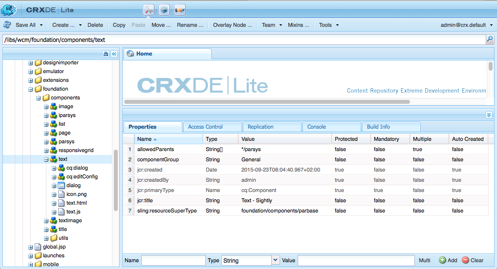
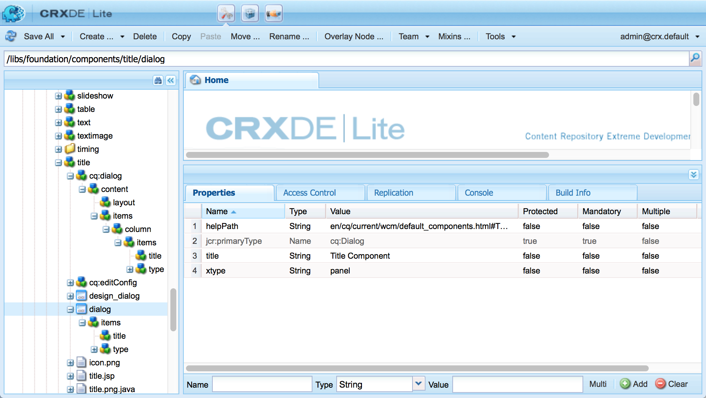
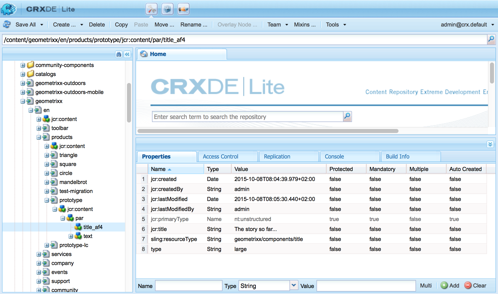

# AEM 구성 요소 - 기본 사항{#aem-components-the-basics}

새 구성 요소를 개발하기 시작할 때 구조 및 구성의 기본 사항을 이해해야 합니다.

이 프로세스에는 이론을 읽고 표준 AEM 인스턴스에서 다양한 구성 요소 구현을 확인하는 작업이 포함됩니다. 이 후자의 접근 방식은 AEM이 새로운 표준, 최신 터치 지원 UI로 이동했지만 클래식 UI를 계속 지원한다는 점에서 약간 복잡합니다.

## 개요 {#overview}

이 섹션에서는 구성 요소를 개발할 때 필요한 세부 사항을 소개하는 주요 개념과 문제를 다룹니다.

### 계획 {#planning}

구성 요소를 실제로 구성하거나 코드를 만들려면 먼저 다음 사항을 고려해야 합니다.

* 새로운 구성 요소가 정확히 필요한 작업은 무엇입니까?
   * 명확한 사양은 개발, 테스트 및 핸드오버의 모든 단계에서 도움이 됩니다. 세부 사항은 시간이 지남에 따라 변경될 수 있지만 사양을 업데이트할 수 있습니다(하지만 변경 사항도 문서화되어야 함).
* 구성 요소를 처음부터 새로 만들어야 합니까, 아니면 기존 구성 요소에서 기본 사항을 상속할 수 있습니까?
   * 바퀴를 다시 만들 필요가 없다.
   * 무시, 오버레이 및 를 포함하여 다른 구성 요소 정의에서 세부 사항을 상속하고 확장할 수 있도록 AEM에서 제공하는 몇 가지 메커니즘이 있습니다 [Sling Resource Merger](/help/sites-developing/sling-resource-merger.md).
* 구성 요소에서 컨텐츠를 선택/조작하는 논리를 필요로 합니까?
   * 로직은 사용자 인터페이스 레이어와 별도로 유지되어야 합니다. HTL은 이러한 상황이 발생하지 않도록 하기 위해 설계되었습니다.
* 구성 요소에 CSS 형식이 필요합니까?
   * CSS 서식은 구성 요소 정의와 별도로 유지되어야 합니다. 외부 CSS 파일을 통해 수정할 수 있도록 HTML 요소의 이름을 지정하는 규칙을 정의합니다.
* 어떤 보안 측면을 고려해야 합니까?
   * 자세한 내용은 [보안 검사 목록 - 개발 우수 사례](/help/sites-administering/security-checklist.md#development-best-practices) 자세한 내용

### 터치 활성화와 클래식 UI 비교 {#touch-enabled-vs-classic-ui}

구성 요소 개발에 대한 진지한 논의가 시작되기 전에 작성자가 사용할 UI를 알고 있어야 합니다.

* **터치 활성화 UI**
   [표준 사용자 인터페이스](/help/sites-developing/touch-ui-concepts.md) 는 의 기본 기술을 사용하여 Adobe Marketing Cloud에 대한 통합 사용자 경험을 기반으로 합니다 [Coral UI](/help/sites-developing/touch-ui-concepts.md#coral-ui) 및 [Granite UI](/help/sites-developing/touch-ui-concepts.md#granite-ui).
* **클래식 UI**
AEM 6.4에서 더 이상 사용되지 않는 ExtJS 기술을 기반으로 한 사용자 인터페이스.

자세한 내용은 [고객을 위한 UI 인터페이스 Recommendations](/help/sites-deploying/ui-recommendations.md) 자세한 내용

터치 지원 UI, 클래식 UI 또는 두 가지 모두를 지원하도록 구성 요소를 구현할 수 있습니다. 표준 인스턴스를 보면 원래 클래식 UI용으로 디자인되었거나 터치 지원 UI 또는 둘 다에 맞게 디자인된 즉시 사용 가능한 구성 요소가 표시됩니다.

이러한 이유로 이 페이지에서 두 가지 기본사항과 이를 인식하는 방법을 다룹니다.

>[!NOTE]
>
>Adobe은 터치 지원 UI를 활용하여 최신 기술을 활용할 것을 권장합니다. [AEM 현대화 도구](modernization-tools.md) 를 사용하면 마이그레이션을 더 쉽게 수행할 수 있습니다.

### 컨텐츠 논리 및 렌더링 마크업  {#content-logic-and-rendering-markup}

구성 요소의 컨텐츠를 선택하는 데 사용되는 논리를 제어하는 코드와는 별도로 마크업 및 렌더링에 대한 코드를 유지하는 것이 좋습니다.

이 철학은 [HTL](https://docs.adobe.com/content/help/en/experience-manager-htl/using/overview.html), 기본 비즈니스 논리를 정의하는 데 실제 프로그래밍 언어가 사용되도록 의도적으로 제한되는 템플릿 언어입니다. 이(선택 사항) 로직은 특정 명령을 사용하여 HTL에서 호출됩니다. 이 메커니즘은 지정된 보기에 대해 호출되는 코드를 강조 표시하며, 필요한 경우 동일한 구성 요소의 다른 보기에 대해 특정 논리를 허용합니다.

### HTL과 JSP {#htl-vs-jsp}

HTL은 AEM 6.0에 도입된 HTML 템플릿 언어입니다.

사용 여부에 대한 논의 [HTL](https://docs.adobe.com/content/help/en/experience-manager-htl/using/overview.html) 또는 고유한 구성 요소를 개발할 때 HTL이 AEM에서 권장되는 스크립팅 언어이므로 JSP(Java Server Pages)가 간단해야 합니다.

HTL과 JSP는 클래식 및 터치 지원 UI 모두에 대한 구성 요소를 개발하는 데 사용할 수 있습니다. HTL이 클래식 UI에 대해 터치 지원 UI 및 JSP에만 해당된다고 가정할 수는 있지만 이는 잘못된 것이며 시기 때문이라고 가정합니다. 터치 활성화 UI 및 HTL이 거의 동일한 기간에 AEM에 통합되었습니다. 이제 HTL이 권장 언어이므로 터치 지원 UI에 적합한 새 구성 요소에 사용됩니다.

>[!NOTE]
>
>예외는 Granite UI Foundation 양식 필드(대화 상자에 사용됨)입니다. JSP를 사용해야 합니다.

### 고유한 구성 요소 개발 {#developing-your-own-components}

적절한 UI에 대한 자체 구성 요소를 만들려면 (이 페이지를 읽은 후)를 참조하십시오.

* [터치 지원 UI에 대한 AEM 구성 요소](/help/sites-developing/developing-components.md)
* [클래식 UI용 AEM 구성 요소](/help/sites-developing/developing-components-classic.md)

시작하는 빠른 방법은 기존 구성 요소를 복사한 다음 원하는 대로 변경하는 것입니다. 고유한 구성 요소를 만들고 단락 시스템에 추가하는 방법에 대해 알아보려면 다음을 참조하십시오.

* [구성 요소 개발](/help/sites-developing/developing-components-samples.md) (터치 지원 UI에 중점을 둡니다.)

### 구성 요소를 게시 인스턴스로 이동 {#moving-components-to-the-publish-instance}

컨텐츠를 렌더링하는 구성 요소는 컨텐츠와 동일한 AEM 인스턴스에 배포해야 합니다. 따라서 작성 인스턴스에서 페이지를 작성 및 렌더링하는 데 사용되는 모든 구성 요소를 게시 인스턴스에 배포해야 합니다. 구성 요소를 배포하면 활성화된 페이지를 렌더링하는 데 사용할 수 있습니다.

다음 도구를 사용하여 구성 요소를 게시 인스턴스로 이동합니다.

* [패키지 관리자 사용](/help/sites-administering/package-manager.md) 구성 요소를 패키지에 추가하고 다른 AEM 인스턴스로 이동합니다.
* [트리 활성화 복제 도구 사용](/help/sites-authoring/publishing-pages.md#manage-publication) 구성 요소를 복제하려면 다음을 수행하십시오.

>[!NOTE]
>
>이러한 메커니즘은 개발 인스턴스에서 테스트 인스턴스와 같은 다른 인스턴스 간에 구성 요소를 전송하는 데에도 사용할 수 있습니다.

### 시작 시 인지할 구성 요소 {#components-to-be-aware-of-from-the-start}

* 페이지:

   * AEM에 *페이지* 구성 요소 ( `cq:Page`).
   * 이는 컨텐츠 관리에 중요한 특정 유형의 리소스입니다.
      * 페이지는 웹 사이트의 컨텐츠를 포함하는 웹 페이지에 해당합니다.

* 단락 시스템:

   * 단락 시스템은 단락 목록을 관리하므로 웹 사이트의 주요 부분입니다. 실제 컨텐츠를 보유하는 개별 구성 요소를 보유하는 데 사용됩니다.
   * 단락 시스템에서 단락을 생성, 이동, 복사 및 삭제할 수 있습니다.
   * 특정 단락 시스템 내에서 사용할 수 있는 구성 요소를 선택할 수도 있습니다.
   * 표준 인스턴스(예: `parsys`, ` [responsivegrid](/help/sites-authoring/responsive-layout.md)`).

## 구조 {#structure}

AEM 구성 요소의 구조가 강력하고 유연하며, 주요 고려 사항은 다음과 같습니다.

* 리소스 유형
* 구성 요소 정의
* 구성 요소의 속성 및 하위 노드
* 대화 상자
* 디자인 대화 상자
* 구성 요소 가용성
* 구성 요소 및 구성 요소가 만드는 컨텐츠

### 리소스 유형 {#resource-type}

구조의 주요 요소는 리소스 유형입니다.

* 컨텐츠 구조가 의도를 선언합니다.
* 리소스 유형이 구현합니다.

이것은 시간이 지남에 따라 모양과 생각이 바뀔 때에도, 의도가 시간을 유지하게 해주는 추상적 표현입니다.

### 구성 요소 정의 {#component-definition}

#### 구성 요소 기본 사항 {#component-basics}

구성 요소의 정의는 다음과 같이 분류할 수 있습니다.

* AEM 구성 요소는 [Sling](https://sling.apache.org/documentation.html).
* AEM 구성 요소는 다음 위치에 있습니다.

   * HTL: `/libs/wcm/foundation/components`
   * JSP: `/libs/foundation/components`

* 프로젝트/사이트별 구성 요소는(일반적으로) 아래에 있습니다.

   * `/apps/<myApp>/components`

* AEM 표준 구성 요소는 다음과 같이 정의됩니다. `cq:Component` 및 에는 다음과 같은 주요 요소가 있습니다.

   * jcr 속성:

      jcr 속성 목록 이러한 변수와 일부는 구성 요소 노드의 기본 구조, 속성 및 하위 노드를 `cq:Component` 정의

   * 리소스:

      이러한 요소는 구성 요소에서 사용하는 정적 요소를 정의합니다.

   * 스크립트:

   구성 요소의 결과 인스턴스의 동작을 구현하는 데 사용됩니다.

* **루트 노드**:

   * `<mycomponent> (cq:Component)` - 구성 요소의 계층 노드입니다.

* **중요한 속성**:

   * `jcr:title` - 구성 요소 제목; 예를 들어 구성 요소가 구성 요소 브라우저나 사이드 킥에 나열될 때 레이블로 사용됩니다.
   * `jcr:description` - 구성 요소에 대한 설명 구성 요소 브라우저 또는 사이드 킥에서 마우스 오버 힌트로 사용할 수 있습니다.
   * 클래식 UI:

      * `icon.png` - 이 구성 요소의 아이콘입니다.
      * `thumbnail.png` - 이 구성 요소가 단락 시스템 내에 나열되는 경우 표시되는 이미지입니다.
   * Touch UI

      * 섹션을 참조하십시오 [Touch UI의 구성 요소 아이콘](/help/sites-developing/components-basics.md#component-icon-in-touch-ui) 자세한 내용


* **필수 하위 노드**:

   * `cq:editConfig (cq:EditConfig)` - 구성 요소의 편집 속성을 정의하고 구성 요소 브라우저 또는 사이드 킥에 구성 요소를 표시할 수 있습니다.

      참고: 구성 요소에 대화 상자가 있으면 cq:editConfig가 없는 경우에도 구성 요소 브라우저나 사이드 킥에 자동으로 표시됩니다.

   * `cq:childEditConfig (cq:EditConfig)` - 직접 정의하지 않는 하위 구성 요소에 대한 작성자 UI 측면을 제어합니다 `cq:editConfig`.
   * 터치 활성화 UI:

      * `cq:dialog` ( `nt:unstructured`) - 이 구성 요소의 대화 상자 사용자가 구성 요소를 구성하거나 컨텐츠를 편집할 수 있는 인터페이스를 정의합니다.
      * `cq:design_dialog` ( `nt:unstructured`) - 이 구성 요소에 대한 디자인 편집
   * 클래식 UI:

      * `dialog` ( `cq:Dialog`) - 이 구성 요소의 대화 상자 사용자가 구성 요소를 구성하거나 컨텐츠를 편집할 수 있는 인터페이스를 정의합니다.
      * `design_dialog` ( `cq:Dialog`) - 이 구성 요소에 대한 디자인 편집.


#### Touch UI의 구성 요소 아이콘 {#component-icon-in-touch-ui}

구성 요소에 대한 아이콘 또는 약어는 개발자가 구성 요소를 만들 때 구성 요소의 JCR 속성을 통해 정의됩니다. 이러한 속성은 다음 순서로 평가되며 발견된 첫 번째 유효한 속성이 사용됩니다.

1. `cq:icon` - 의 표준 아이콘을 가리키는 문자열 속성 [Coral UI 라이브러리](https://helpx.adobe.com/experience-manager/6-5/sites/developing/using/reference-materials/coral-ui/coralui3/Coral.Icon.html) 구성 요소 브라우저에 표시하려면 다음을 수행하십시오.
   * Coral 아이콘의 HTML 속성 값을 사용합니다.
1. `abbreviation` - 구성 요소 브라우저에서 구성 요소 이름의 약어를 사용자 지정하는 문자열 속성
   * 약어는 두 문자로 제한해야 합니다.
   * 빈 문자열을 제공하면 의 처음 두 문자로부터 약어를 빌드합니다 `jcr:title` 속성을 사용합니다.
      * 예를 들어 &quot;Image&quot;의 &quot;Im&quot;
      * 현지화된 제목이 약어를 빌드하는 데 사용됩니다.
   * 약어는 구성 요소에 `abbreviation_commentI18n` 속성(그런 다음 번역 힌트로 사용됩니다.
1. `cq:icon.png` 또는 `cq:icon.svg` - 구성 요소 브라우저에 표시되는 이 구성 요소의 아이콘
   * 20 x 20 픽셀은 표준 구성 요소의 아이콘 크기입니다.
      * 더 큰 아이콘의 크기는 작아집니다(클라이언트측).
   * 권장되는 색상은 rgb(112, 112, 112) > #707070입니다.
   * 표준 구성 요소 아이콘의 배경이 투명합니다.
   * 전용 `.png` 및 `.svg` 파일이 지원됩니다.
   * Eclipse 플러그인을 통해 파일 시스템에서 가져오는 경우 파일 이름을 `_cq_icon.png` 또는 `_cq_icon.svg` 예.
   * `.png` 선례를 `.svg` 둘 다 있는 경우

위의 속성이 없는 경우( `cq:icon`, `abbreviation`, `cq:icon.png` 또는 `cq:icon.svg`)은 구성 요소에서 찾을 수 있습니다.

* 시스템이 다음에 나오는 수퍼 구성 요소에서 동일한 속성을 검색합니다. `sling:resourceSuperType` 속성을 사용합니다.
* 수퍼 구성 요소 수준에서 아무 약어나 빈 약어를 찾을 수 없으면 시스템은 첫 번째 문자의 약어를 만듭니다 `jcr:title` 현재 구성 요소의 속성입니다.

수퍼 구성 요소에서 아이콘 상속을 취소하려면 빈 을 설정합니다 `abbreviation` 구성 요소의 속성은 기본 동작으로 돌아갑니다.

다음 [구성 요소 콘솔](/help/sites-authoring/default-components-console.md#component-details) 특정 구성 요소에 대한 아이콘이 정의되는 방식을 표시합니다.

#### SVG 아이콘 예 {#svg-icon-example}

```xml
<?xml version="1.0" encoding="utf-8"?>
<!DOCTYPE svg PUBLIC "-//W3C//DTD SVG 1.1//EN" "https://www.w3.org/Graphics/SVG/1.1/DTD/svg11.dtd">
<svg version="1.1" id="Layer_1" xmlns="https://www.w3.org/2000/svg" xmlns:xlink="https://www.w3.org/1999/xlink" x="0px" y="0px"
     width="20px" height="20px" viewBox="0 0 20 20" enable-background="new 0 0 20 20" xml:space="preserve">
    <ellipse cx="5" cy="5" rx="3" ry="3" fill="#707070"/>
    <ellipse cx="15" cy="5" rx="4" ry="4" fill="#707070"/>
    <ellipse cx="5" cy="15" rx="5" ry="5" fill="#707070"/>
    <ellipse cx="15" cy="15" rx="4" ry="4" fill="#707070"/>
</svg>
```

### 구성 요소의 속성 및 하위 노드 {#properties-and-child-nodes-of-a-component}

구성 요소를 정의하는 데 필요한 많은 노드/속성은 두 UI 모두에서 일반적이지만, 구성 요소가 두 환경에서 모두 작동할 수 있도록 독립적입니다.

구성 요소는 유형 노드입니다 `cq:Component` 및 에는 다음 속성 및 하위 노드가 있습니다.

<table>
 <tbody>
  <tr>
   <td><strong>이름 <br /> </strong></td>
   <td><strong>유형 <br /> </strong></td>
   <td><strong>설명 <br /> </strong></td>
  </tr>
  <tr>
   <td>.<br /> </td>
   <td><code>cq:Component</code></td>
   <td>현재 구성 요소. 구성 요소는 노드 유형입니다 <code>cq:Component</code>.<br /> </td>
  </tr>
  <tr>
   <td><code>componentGroup</code></td>
   <td><code>String</code></td>
   <td>구성 요소 브라우저(터치 지원 UI) 또는 사이드 킥(클래식 UI)에서 구성 요소를 선택할 수 있는 그룹입니다.<br /> 값 <code>.hidden</code> 실제 단락 시스템과 같이 UI에서 선택할 수 없는 구성 요소에 사용됩니다.</td>
  </tr>
  <tr>
   <td><code>cq:isContainer</code></td>
   <td><code>Boolean</code></td>
   <td>구성 요소가 컨테이너 구성 요소인지 여부를 나타내며, 따라서 단락 시스템과 같은 다른 구성 요소를 포함할 수 있습니다.</td>
  </tr>
  <tr>
   <td> </td>
   <td> </td>
   <td> </td>
  </tr>
  <tr>
   <td><code>cq:dialog</code></td>
   <td><code>nt:unstructured</code> </td>
   <td>터치 지원 UI에 대한 편집 대화 상자의 정의입니다.</td>
  </tr>
  <tr>
   <td><code>dialog</code></td>
   <td><code>cq:Dialog</code></td>
   <td>클래식 UI에 대한 편집 대화 상자의 정의입니다.</td>
  </tr>
  <tr>
   <td><code>cq:design_dialog</code></td>
   <td><code>nt:unstructured</code></td>
   <td>터치 지원 UI에 대한 디자인 대화 상자의 정의입니다.</td>
  </tr>
  <tr>
   <td><code>design_dialog</code></td>
   <td><code>cq:Dialog </code></td>
   <td>클래식 UI에 대한 디자인 대화 상자의 정의입니다.<br /> </td>
  </tr>
  <tr>
   <td><code>dialogPath</code></td>
   <td><code>String</code></td>
   <td>구성 요소에 대화 상자 노드가 없는 경우 이 사례를 다루는 대화 상자의 경로입니다.<br /> </td>
  </tr>
  <tr>
   <td> </td>
   <td> </td>
   <td> </td>
  </tr>
  <tr>
   <td><code>cq:cellName</code></td>
   <td><code>String</code></td>
   <td>설정된 경우 이 속성을 셀 ID로 가져옵니다. 자세한 내용은 기술 자료 문서를 참조하십시오 <a href="https://helpx.adobe.com/experience-manager/kb/DesigneCellId.html">디자인 셀 ID는 어떻게 빌드됩니까?</a>.<br /> </td>
  </tr>
  <tr>
   <td><code>cq:childEditConfig</code></td>
   <td><code>cq:EditConfig</code></td>
   <td>구성 요소가 컨테이너인 경우(예: 단락 시스템) 하위 노드의 편집 구성을 구동합니다.<br /> </td>
  </tr>
  <tr>
   <td><code>cq:editConfig</code></td>
   <td><code>cq:EditConfig</code></td>
   <td><a href="#edit-behavior">구성 요소의 구성 편집</a>.<br /> </td>
  </tr>
  <tr>
   <td><code>cq:htmlTag</code></td>
   <td><code>nt:unstructured </code></td>
   <td>주변 html 태그에 추가된 추가 태그 속성을 반환합니다. 자동으로 생성된 div에 속성을 추가할 수 있습니다.</td>
  </tr>
  <tr>
   <td><code>cq:noDecoration</code></td>
   <td><code>Boolean</code></td>
   <td>true일 경우 구성 요소는 자동으로 생성된 div 및 css 클래스로 렌더링되지 않습니다.<br /> </td>
  </tr>
  <tr>
   <td><code>cq:template</code></td>
   <td><code>nt:unstructured</code></td>
   <td>구성 요소가 있는 경우 이 노드는 구성 요소 브라우저 또는 사이드 킥에서 구성 요소를 추가할 때 컨텐츠 템플릿으로 사용됩니다.</td>
  </tr>
  <tr>
   <td><code>cq:templatePath</code></td>
   <td><code>String</code></td>
   <td>구성 요소 브라우저 또는 사이드 킥에서 구성 요소를 추가할 때 컨텐츠 템플릿으로 사용할 노드의 경로입니다. 구성 요소 노드를 기준으로 하는 것이 아니라 절대 경로여야 합니다.<br /> 다른 곳에서 이미 사용 가능한 컨텐츠를 재사용하려는 경우가 아니라면 이 작업은 필요하지 않으며 <code>cq:template</code> 충분합니다(아래 참조).</td>
  </tr>
  <tr>
   <td><code>jcr:created</code></td>
   <td><code>Date</code></td>
   <td>구성 요소 생성 날짜입니다.<br /> </td>
  </tr>
  <tr>
   <td><code>jcr:description</code></td>
   <td><code>String</code></td>
   <td>구성 요소에 대한 설명입니다.<br /> </td>
  </tr>
  <tr>
   <td><code>jcr:title</code></td>
   <td><code>String</code></td>
   <td>구성 요소의 제목입니다.<br /> </td>
  </tr>
  <tr>
   <td><code>sling:resourceSuperType</code></td>
   <td><code>String</code></td>
   <td>이 설정을 지정하면 구성 요소가 이 구성 요소에서 상속됩니다.<br /> </td>
  </tr>
  <tr>
   <td><code>virtual</code></td>
   <td><code>sling:Folder</code></td>
   <td>가상 구성 요소를 만들 수 있습니다. 예를 보려면 연락처 구성 요소 위치:<br /> <code>/libs/foundation/components/profile/form/contact</code></td>
  </tr>
  <tr>
   <td><code>&lt;breadcrumb.jsp&gt;</code></td>
   <td><code>nt:file</code> </td>
   <td>스크립트 파일입니다.<br /> </td>
  </tr>
  <tr>
   <td><code>icon.png</code></td>
   <td><code>nt:file</code></td>
   <td>구성 요소의 아이콘이 사이드 킥의 제목 옆에 표시됩니다.<br /> </td>
  </tr>
  <tr>
   <td><code>thumbnail.png</code></td>
   <td><code>nt:file</code></td>
   <td>구성 요소를 사이드킥에서 제자리로 드래그하는 동안 표시되는 선택적 축소판입니다.<br /> </td>
  </tr>
 </tbody>
</table>

만약 **텍스트** 구성 요소(두 버전 중 하나)에는 다음 요소가 표시됩니다.

* HTL ( `/libs/wcm/foundation/components/text`)

   

* JSP ( `/libs/foundation/components/text`)

   

특정 관심 영역의 속성은 다음과 같습니다.

* `jcr:title` - 구성 요소의 제목 구성 요소를 식별하는 데 사용할 수 있습니다. 예를 들어 구성 요소 브라우저 또는 사이드 킥의 구성 요소 목록에 표시됩니다
* `jcr:description` - 구성 요소에 대한 설명 사이드 킥의 구성 요소 목록에서 마우스 오버 힌트로 사용할 수 있습니다
* `sling:resourceSuperType`: 구성 요소를 확장할 때(정의를 재정의하여) 상속의 경로를 나타냅니다.

특정 관심 영역의 하위 노드에는 다음이 포함됩니다.

* `cq:editConfig` ( `cq:EditConfig`) - 시각적 측면을 제어합니다. 예를 들어 막대형 또는 위젯의 모양을 정의하거나 사용자 정의된 컨트롤을 추가할 수 있습니다
* `cq:childEditConfig` ( `cq:EditConfig`) - 자체 정의가 없는 하위 구성 요소의 시각적 측면을 제어합니다
* 터치 활성화 UI:
   * `cq:dialog` ( `nt:unstructured`) - 이 구성 요소의 컨텐츠를 편집할 대화 상자를 정의합니다.
   * `cq:design_dialog` ( `nt:unstructured`) - 이 구성 요소의 디자인 편집 옵션을 지정합니다
* 클래식 UI:
   * `dialog` ( `cq:Dialog`) - 이 구성 요소의 컨텐츠를 편집할 수 있는 대화 상자(클래식 UI에만 해당됨)를 정의합니다
   * `design_dialog` ( `cq:Dialog`) - 이 구성 요소의 디자인 편집 옵션을 지정합니다
   * `icon.png` - 사이드 킥에서 구성 요소의 아이콘으로 사용할 그래픽 파일
   * `thumbnail.png` - 사이드 킥에서 구성 요소의 축소판으로 사용할 그래픽 파일

### 대화 상자 {#dialogs}

대화 상자는 작성자가 해당 구성 요소를 구성하고 입력할 수 있는 인터페이스를 제공하므로 구성 요소의 주요 요소입니다.

구성 요소의 복잡성에 따라 대화 상자를 짧게 유지하고 입력 필드를 정렬하려면 대화 상자에 하나 이상의 탭이 필요할 수 있습니다.

대화 상자 정의는 UI에 따라 다릅니다.

>[!NOTE]
>
>* 호환성을 위해, 터치 지원 UI에 대해 대화 상자가 정의되지 않은 경우 터치 지원 UI는 클래식 UI 대화 상자의 정의를 사용할 수 있습니다.
>* 다음 [AEM 현대화 도구](/help/sites-developing/modernization-tools.md) 클래식 UI에 대해 대화 상자만 정의된 구성 요소를 확장/변환하는 데에도 도움이 됩니다.
>


* 터치 활성화 UI
   * `cq:dialog` ( `nt:unstructured`) 노드:
      * 이 구성 요소의 컨텐츠를 편집할 대화 상자 정의
      * 터치 지원 UI에 해당됩니다
      * Granite UI 구성 요소를 사용하여 정의됩니다
      * 재산이 있다 `sling:resourceType`표준 Sling 컨텐츠 구조로서
      * 속성을 가질 수 있습니다. `helpPath` 도움말 아이콘( ? 아이콘)을 선택합니다.
         * 즉시 사용 가능한 구성 요소의 경우 설명서에서 페이지를 참조하는 경우가 많습니다.
         * 없는 경우 `helpPath` 이 지정되면 기본 URL(설명서 개요 페이지)이 표시됩니다.

   

   대화 상자 내에서 개별 필드가 정의됩니다.

   

* 클래식 UI
   * `dialog` ( `cq:Dialog`) 노드
      * 이 구성 요소의 컨텐츠를 편집할 대화 상자 정의
      * 클래식 UI에 따라 다름
      * ExtJS 위젯을 사용하여 정의됩니다
      * 재산이 있다 `xtype`: ExtJS를 참조합니다
      * 속성을 가질 수 있습니다. `helpPath` 컨텍스트 구분 도움말 리소스(절대 또는 상대 경로)를 **도움말** 단추가 선택되어 있습니다.
         * 즉시 사용 가능한 구성 요소의 경우 설명서에서 페이지를 참조하는 경우가 많습니다.
         * 없는 경우 `helpPath` 이 지정되면 기본 URL(설명서 개요 페이지)이 표시됩니다.

   

   대화 상자 내에서 개별 필드가 정의됩니다.

   

   클래식 대화 상자 내에서:

   * 대화 상자를 다음과 같이 만들 수 있습니다. `cq:Dialog`- 텍스트 구성 요소처럼 단일 탭을 제공하거나, 텍스트 이미지 구성 요소와 같이 여러 탭이 필요한 경우 대화 상자를 다음과 같이 정의할 수 있습니다. `cq:TabPanel`.
   * a `cq:WidgetCollection` ( `items`)은 두 입력 필드( )의 베이스를 제공하는 데 사용됩니다 `cq:Widget`) 또는 추가 탭( `cq:Widget`). 이 계층은 확장할 수 있습니다.


### 디자인 대화 상자 {#design-dialogs}

디자인 대화 상자는 컨텐츠를 편집하고 구성하는 데 사용되는 대화 상자와 매우 유사하지만 작성자가 해당 구성 요소에 대한 디자인 세부 사항을 구성하고 제공하는 인터페이스를 제공합니다.

[디자인 대화 상자는 디자인 모드에서 사용할 수 있습니다](/help/sites-authoring/default-components-designmode.md)그러나 모든 구성 요소(예: **제목** 및 **이미지** 둘 다 디자인 대화 상자를 가지고 있지만 **텍스트** 그렇지 않습니다.

단락 시스템(예: parsys)의 디자인 대화 상자는 사용자가 페이지에서 구성 요소 브라우저 또는 사이드 킥에서 선택하여 사용할 수 있는 특정 기타 구성 요소를 지정할 수 있도록 하는 특별한 사례입니다.

### 단락 시스템에 구성 요소 추가 {#adding-your-component-to-the-paragraph-system}

구성 요소가 정의되면 사용할 수 있도록 해야 합니다. 단락 시스템에서 구성 요소를 사용할 수 있도록 하려면 다음 중 하나를 수행할 수 있습니다.

1. 열기 [디자인 모드](/help/sites-authoring/default-components-designmode.md) 페이지에 대해 를 사용 하고 필요한 구성 요소를 활성화합니다.
1. 필요한 구성 요소를 `components` 템플릿 정의의 속성:

   `/etc/designs/<*yourProject*>/jcr:content/<*yourTemplate*>/par`

   예를 들어 다음을 참조하십시오.

   `/etc/designs/geometrixx/jcr:content/contentpage/par`

   

### 구성 요소 및 구성 요소가 만드는 컨텐츠 {#components-and-the-content-they-create}

의 인스턴스를 만들고 구성하는 경우 **제목** 구성 요소를 생성하지 않습니다. `<content-path>/Prototype.html`

* 터치 활성화 UI

   

* 클래식 UI

   

저장소 내에서 만들어진 컨텐츠의 구조를 확인할 수 있습니다.



특히 **제목**:

* 정의(두 UI 모두에 대해)에는 속성이 있습니다 `name`= `./jcr:title`

   * `/libs/foundation/components/title/cq:dialog/content/items/column/items/title`
   * `/libs/foundation/components/title/dialog/items/title`

* 컨텐츠 내에서 속성이 생성됩니다 `jcr:title` 작성자 컨텐츠를 보관합니다.

정의된 속성은 개별 정의에 따라 다릅니다. 비록 그것들이 위보다 더 복잡할 수 있지만 그들은 여전히 같은 기본 원칙을 따르고 있습니다.

## 구성 요소 계층 및 상속 {#component-hierarchy-and-inheritance}

AEM 내의 구성 요소는 3개의 서로 다른 계층을 따릅니다.

* **리소스 유형 계층**

   속성을 사용하여 구성 요소를 확장하는 데 사용됩니다 `sling:resourceSuperType`. 이렇게 하면 구성 요소가 상속될 수 있습니다. 예를 들어, 텍스트 구성 요소는 표준 구성 요소의 다양한 속성을 상속합니다.

   * 스크립트(Sling에 의해 해결됨)
   * 대화 상자
   * 설명(축소판 이미지, 아이콘 등 포함)

* **컨테이너 계층**

   이 필드는 하위 구성 요소에 대한 구성 설정을 채우는 데 사용되며 parsys 시나리오에서 가장 일반적으로 사용됩니다.

   예를 들어 편집 막대 단추, 컨트롤 세트 레이아웃(편집 막대, 롤오버), 대화 상자 레이아웃(인라인, 부동)에 대한 구성 설정은 상위 구성 요소에 정의되고 하위 구성 요소에 전파될 수 있습니다.

   의 구성 설정(편집 기능과 관련됨) `cq:editConfig` 및 `cq:childEditConfig` 전파됩니다.

* **계층 포함**

   이는 포함 시퀀스에 의해 런타임 시 적용됩니다.

   디자이너는 이 계층 구조를 사용하여 렌더링의 다양한 디자인 측면에 대한 기본 역할을 합니다. 레이아웃 정보, css 정보, parsys에서 사용할 수 있는 구성 요소 등을 포함합니다.

## 동작 편집 {#edit-behavior}

이 섹션에서는 구성 요소의 편집 동작을 구성하는 방법을 설명합니다. 여기에는 구성 요소에 사용할 수 있는 작업, 즉석 편집기의 특성 및 구성 요소의 이벤트와 관련된 청취자와 같은 특성이 포함됩니다.

터치 지원 UI와 클래식 UI 양쪽에서 일반적으로 구성되며, 특정한 차이점이 있습니다.

구성 요소의 편집 동작은 `cq:editConfig` 유형 노드 `cq:EditConfig` 구성 요소 노드 아래(유형) `cq:Component`) 및에 나열된 상태로 남아 있는 문제를 해결했습니다. 다음 속성 및 하위 노드를 사용할 수 있습니다.

* [ `cq:editConfig` 노드 속성](#configuring-with-cq-editconfig-properties):

   * `cq:actions` ( `String array`): 구성 요소에서 수행할 수 있는 작업을 정의합니다.
   * `cq:layout` ( `String`): : 클래식 UI에서 구성 요소를 편집하는 방법을 정의합니다.
   * `cq:dialogMode` ( `String`): 구성 요소 대화 상자가 클래식 UI에서 열리는 방식을 정의합니다

      * 터치 지원 UI에서 대화 상자는 항상 데스크탑 모드로 유지되며 모바일에서 전체 화면으로 자동으로 열립니다.
   * `cq:emptyText` ( `String`): 시각적 컨텐츠가 없을 때 표시되는 텍스트를 정의합니다.
   * `cq:inherit` ( `Boolean`): 누락된 값이 상속된 구성 요소에서 상속되는지 여부를 정의합니다.
   * `dialogLayout` (문자열): 대화 상자를 여는 방법을 정의합니다.


* [ `cq:editConfig` 하위 노드](#configuring-with-cq-editconfig-child-nodes):

   * `cq:dropTargets` (노드 유형) `nt:unstructured`): 컨텐츠 파인더의 자산에서 삭제를 허용할 수 있는 드롭 대상 목록을 정의합니다.

      * 여러 드롭 대상은 클래식 UI에서만 사용할 수 있습니다.
      * 터치 활성화 UI에서는 단일 드롭 대상이 허용됩니다.
   * `cq:actionConfigs` (노드 유형) `nt:unstructured`): cq:actions 목록에 추가된 새 작업 목록을 정의합니다.
   * `cq:formParameters` (노드 유형) `nt:unstructured`): 대화 상자 양식에 추가되는 추가 매개 변수를 정의합니다.
   * `cq:inplaceEditing` (노드 유형) `cq:InplaceEditingConfig`): 구성 요소에 대한 즉석 편집 구성을 정의합니다.
   * `cq:listeners` (노드 유형) `cq:EditListenersConfig`): 구성 요소에서 작업이 발생하기 전이나 후에 수행되는 작업을 정의합니다.


>[!NOTE]
>
>이 페이지에서 노드(속성 및 하위 노드)는 다음 예제와 같이 XML로 표시됩니다.

```
<jcr:root xmlns:cq="https://www.day.com/jcr/cq/1.0" xmlns:jcr="https://www.jcp.org/jcr/1.0"
    cq:actions="[edit]"
    cq:dialogMode="floating"
    cq:layout="editbar"
    jcr:primaryType="cq:EditConfig">
    <cq:listeners
        jcr:primaryType="cq:EditListenersConfig"
        afteredit="REFRESH_PAGE"/>
</jcr:root>
```

저장소에 기존 구성이 많습니다. 특정 속성 또는 하위 노드를 쉽게 검색할 수 있습니다.

* 의 속성을 찾으려면 `cq:editConfig` 노드, 예 `cq:actions`에서 쿼리 도구를 사용할 수 있습니다 **CRXDE Lite** 다음 XPath 쿼리 문자열로 를 검색합니다.

   `//element(cq:editConfig, cq:EditConfig)[@cq:actions]`

* 의 하위 노드를 찾으려면 `cq:editConfig`, 예: `cq:dropTargets`: 유형 `cq:DropTargetConfig`; ** CRXDE Lite**에서 쿼리 도구를 사용하고 다음 XPath 쿼리 문자열로 검색할 수 있습니다.

   `//element(cq:dropTargets, cq:DropTargetConfig)`

### 구성 요소 자리 표시자 {#component-placeholders}

구성 요소에 컨텐츠가 없는 경우에도 구성 요소는 항상 작성자가 볼 수 있는 일부 HTML을 렌더링해야 합니다. 그렇지 않으면 편집기 인터페이스에서 보이지 않게 되어 기술적으로 페이지 및 편집기에서 보이지 않게 될 수 있습니다. 이러한 경우 작성자는 빈 구성 요소를 선택하고 상호 작용할 수 없습니다.

이러한 이유로, 페이지가 페이지 편집기에서 렌더링될 때(WCM 모드가 있을 때) 구성 요소는 표시된 출력을 렌더링하지 않는 한 자리 표시자를 렌더링해야 합니다 `edit` 또는 `preview`).
자리 표시자에 대한 일반적인 HTML 마크업은 다음과 같습니다.

```HTML
<div class="cq-placeholder" data-emptytext="Component Name"></div>
```

위의 자리 표시자 HTML을 렌더링하는 일반적인 HTL 스크립트는 다음과 같습니다.

```HTML
<div class="cq-placeholder" data-emptytext="${component.properties.jcr:title}"
     data-sly-test="${(wcmmode.edit || wcmmode.preview) && isEmpty}"></div>
```

앞의 예에서 `isEmpty` 구성 요소에 컨텐츠가 없고 작성자에게 표시되지 않는 경우에만 true인 변수입니다.

반복을 방지하기 위해 Adobe은 구성 요소 구현자에게 이러한 자리 표시자에 대해 HTL 템플릿을 사용하는 것을 권장합니다. [핵심 구성 요소에서 제공하는 것과 같습니다.](https://github.com/adobe/aem-core-wcm-components/blob/master/content/src/content/jcr_root/apps/core/wcm/components/commons/v1/templates.html)

이전 링크에서 템플릿 사용은 다음 HTL 줄로 수행됩니다.

```HTML
<sly data-sly-use.template="core/wcm/components/commons/v1/templates.html"
     data-sly-call="${template.placeholder @ isEmpty=!model.text}"></sly>
```

앞의 예에서 `model.text` 컨텐츠에 컨텐츠가 있고 가 표시되는 경우에만 true인 변수입니다.

이 템플릿의 사용 예는 핵심 구성 요소에서 볼 수 있습니다. [( 제목 구성 요소 에서와 같이).](https://github.com/adobe/aem-core-wcm-components/blob/master/content/src/content/jcr_root/apps/core/wcm/components/title/v2/title/title.html#L27)

### cq:EditConfig 속성으로 구성 {#configuring-with-cq-editconfig-properties}

### cq:actions {#cq-actions}

다음 `cq:actions` 속성( `String array`)은 구성 요소에서 수행할 수 있는 하나 또는 여러 작업을 정의합니다. 구성에 다음 값을 사용할 수 있습니다.

<table>
 <tbody>
  <tr>
   <td><strong>속성 값</strong></td>
   <td><strong>설명</strong></td>
  </tr>
  <tr>
   <td><code>text:&lt;some text&gt;</code></td>
   <td>정적 텍스트 값을 표시합니다 &lt;some text=""&gt;<br /> 클래식 UI에만 표시됩니다. 터치 활성화 UI는 상황별 메뉴에 작업을 표시하지 않으므로 적용할 수 없습니다.</td>
  </tr>
  <tr>
   <td>-</td>
   <td>스페이서를 추가합니다.<br /> 클래식 UI에만 표시됩니다. 터치 활성화 UI는 상황별 메뉴에 작업을 표시하지 않으므로 적용할 수 없습니다.</td>
  </tr>
  <tr>
   <td><code>edit</code></td>
   <td>구성 요소를 편집할 단추를 추가합니다.</td>
  </tr>
      <tr>
    <td><code>editannotate</code></td>
    <td>단추를 추가하여 구성 요소를 편집할 수 있을 뿐만 아니라 <a href="/help/sites-authoring/annotations.md">주석</a>.</td>
   </tr>
  <tr>
   <td><code>delete</code></td>
   <td>구성 요소를 삭제할 단추를 추가합니다</td>
  </tr>
  <tr>
   <td><code>insert</code></td>
   <td>현재 구성 요소 앞에 새 구성 요소를 삽입하는 단추를 추가합니다</td>
  </tr>
  <tr>
   <td><code>copymove</code></td>
   <td>구성 요소를 복사하고 잘라내는 단추를 추가합니다.</td>
  </tr>
 </tbody>
</table>

다음 구성에서는 편집 단추, 스페이서, 삭제 및 삽입 단추를 구성 요소 편집 표시줄에 추가합니다.

```
<jcr:root xmlns:cq="https://www.day.com/jcr/cq/1.0" xmlns:jcr="https://www.jcp.org/jcr/1.0"
    cq:actions="[edit,-,delete,insert]"
    cq:layout="editbar"
    jcr:primaryType="cq:EditConfig"/>
```

다음 구성은 &quot;기본 프레임워크에서 상속된 구성&quot; 텍스트를 구성 요소 편집 표시줄에 추가합니다.

```
<jcr:root xmlns:cq="https://www.day.com/jcr/cq/1.0" xmlns:jcr="https://www.jcp.org/jcr/1.0"
    cq:actions="[text:Inherited Configurations from Base Framework]"
    cq:layout="editbar"
    jcr:primaryType="cq:EditConfig"/>
```

### cq:layout(클래식 UI만 해당) {#cq-layout-classic-ui-only}

다음 `cq:layout` 속성( `String`)은 클래식 UI에서 구성 요소를 편집할 수 있는 방법을 정의합니다. 다음 값을 사용할 수 있습니다.

<table>
 <tbody>
  <tr>
   <td><strong>속성 값</strong></td>
   <td><strong>설명</strong></td>
  </tr>
  <tr>
   <td><code>rollover</code></td>
   <td>기본값. 구성 요소 에디션은 클릭 및/또는 컨텍스트 메뉴를 통해 "마우스를 위에 올려 놓기"에 액세스할 수 있습니다.<br /> 고급 사용을 위해 해당 클라이언트측 객체는 다음과 같습니다. <code>CQ.wcm.EditRollover</code>.</td>
  </tr>
  <tr>
   <td><code>editbar</code></td>
   <td>구성 요소 에디션은 도구 모음을 통해 액세스할 수 있습니다.<br /> 고급 사용을 위해 해당 클라이언트측 객체는 다음과 같습니다. <code>CQ.wcm.EditBar</code>.</td>
  </tr>
  <tr>
   <td><code>auto</code></td>
   <td>선택은 클라이언트측 코드에 남습니다.</td>
  </tr>
 </tbody>
</table>

>[!NOTE]
>
>롤오버 및 편집 막대의 개념은 터치 지원 UI에서 적용할 수 없습니다.

다음 구성은 구성 요소 편집 표시줄에 편집 단추를 추가합니다.

```
<jcr:root xmlns:cq="https://www.day.com/jcr/cq/1.0" xmlns:jcr="https://www.jcp.org/jcr/1.0"
    cq:actions="[edit]"
    cq:layout="editbar"
    jcr:primaryType="cq:EditConfig">
</jcr:root>
```

### cq:dialogMode(클래식 UI만 해당) {#cq-dialogmode-classic-ui-only}

구성 요소를 편집 대화 상자에 연결할 수 있습니다. 다음 `cq:dialogMode` 속성( `String`)은 구성 요소 대화 상자가 클래식 UI에서 열리는 방식을 정의합니다. 다음 값을 사용할 수 있습니다.

<table>
 <tbody>
  <tr>
   <td><strong>속성 값</strong></td>
   <td><strong>설명</strong></td>
  </tr>
  <tr>
   <td><code>floating</code></td>
   <td>대화 상자가 플로팅되고 있습니다.<br /> </td>
  </tr>
  <tr>
   <td><code>inline</code></td>
   <td>(기본값). 대화 상자가 구성 요소 위에 고정되어 있습니다.<br /> </td>
  </tr>
  <tr>
   <td><code>auto</code></td>
   <td>구성 요소 너비가 클라이언트 측보다 작은 경우 <code>CQ.themes.wcm.EditBase.INLINE_MINIMUM_WIDTH</code> 값을 지정하면 대화 상자가 플로팅되고 그렇지 않으면 인라인으로 표시됩니다.</td>
  </tr>
 </tbody>
</table>

>[!NOTE]
>
>터치 지원 UI에서 대화 상자는 항상 데스크탑 모드로 유지되며 모바일에서 전체 화면으로 자동으로 열립니다.

다음 구성은 편집 단추와 부동 대화 상자가 있는 편집 막대를 정의합니다.

```
<jcr:root xmlns:cq="https://www.day.com/jcr/cq/1.0" xmlns:jcr="https://www.jcp.org/jcr/1.0"
    cq:actions="[edit]"
    cq:dialogMode="floating"
    cq:layout="editbar"
    jcr:primaryType="cq:EditConfig">
</jcr:root>
```

### cq:emptyText {#cq-emptytext}

다음 `cq:emptyText` 속성( `String`)은 시각적 콘텐츠가 없을 때 표시되는 텍스트를 정의합니다. 기본값은 다음과 같습니다. `Drag components or assets here`.

### cq:inherit {#cq-inherit}

다음 `cq:inherit` 속성( `boolean`)은 누락된 값이 상속된 구성 요소에서 상속되는지 여부를 정의합니다. 기본값은 입니다. `false`.

### dialogLayout {#dialoglayout}

다음 `dialogLayout` 속성은 기본적으로 대화 상자를 여는 방법을 정의합니다.

* 값 `fullscreen` 대화 상자를 전체 화면으로 엽니다.
* 속성이 없거나 비어 있는 값은 기본적으로 대화 상자가 정상적으로 열립니다.
* 사용자는 항상 대화 상자 내에서 전체 화면 모드를 전환할 수 있습니다.
* 클래식 UI에는 적용되지 않습니다.

### cq:EditConfig 하위 노드로 구성 {#configuring-with-cq-editconfig-child-nodes}

### cq:dropTargets {#cq-droptargets}

다음 `cq:dropTargets` 노드(노드 유형) `nt:unstructured`)은 컨텐츠 파인더에서 끌어 놓은 자산에서 드롭을 허용할 수 있는 드롭 대상 목록을 정의합니다. 유형 노드의 컬렉션으로 사용됩니다 `cq:DropTargetConfig`.

>[!NOTE]
>
>여러 드롭 대상은 클래식 UI에서만 사용할 수 있습니다.
>
>터치 지원 UI에서는 첫 번째 타겟만 사용됩니다.

유형의 각 하위 노드 `cq:DropTargetConfig` 구성 요소에서 드롭 대상을 정의합니다. 노드 이름은 다음과 같이 JSP에서 사용해야 효과적인 드롭 대상인 DOM 요소에 할당된 CSS 클래스 이름을 생성할 수 있으므로 중요합니다.

```
<drop target css class> = <drag and drop prefix> +
 <node name of the drop target in the edit configuration>
```

다음 `<drag and drop prefix>` 는 Java 속성에 의해 정의됩니다.

`com.day.cq.wcm.api.components.DropTarget.CSS_CLASS_PREFIX`.

예를 들어 클래스 이름은 다운로드 구성 요소( `/libs/foundation/components/download/download.jsp`) `file` 다운로드 구성 요소의 편집 구성에 있는 드롭 대상의 노드 이름입니다.

`String ddClassName = DropTarget.CSS_CLASS_PREFIX + "file";`

유형의 노드 `cq:DropTargetConfig` 를 사용하려면 다음 속성이 있어야 합니다.

<table>
 <tbody>
  <tr>
   <td><strong>속성 이름</strong></td>
   <td><strong>속성 값<br /> </strong></td>
  </tr>
  <tr>
   <td><code>accept</code></td>
   <td>드롭이 허용되는지 확인하기 위해 자산 MIME 유형에 적용된 Regex입니다.</td>
  </tr>
  <tr>
   <td><code>groups</code></td>
   <td>드롭 대상 그룹의 배열입니다. 각 그룹은 Content Finder 확장명에 정의되어 있고 자산에 첨부된 그룹 유형과 일치해야 합니다.</td>
  </tr>
  <tr>
   <td><code>propertyName</code></td>
   <td>유효한 삭제 후 업데이트할 속성의 이름입니다.</td>
  </tr>
 </tbody>
</table>

다음 구성은 다운로드 구성 요소에서 가져옵니다. MIME 유형은 페이지의 모든 자산(임의의 문자열일 수 있음)을 `media` 컨텐츠 파인더에서 구성 요소로 제거할 그룹입니다. 드롭 후 구성 요소 속성 `fileReference` 업데이트 중:

```
    <cq:dropTargets jcr:primaryType="nt:unstructured">
        <file
            jcr:primaryType="cq:DropTargetConfig"
            accept="[.*]"
            groups="[media]"
            propertyName="./fileReference"/>
    </cq:dropTargets>
```

### cq:actionConfigs(클래식 UI만 해당) {#cq-actionconfigs-classic-ui-only}

다음 `cq:actionConfigs` 노드(노드 유형) `nt:unstructured`)에서 정의한 목록에 추가되는 새 작업 목록을 정의합니다 `cq:actions` 속성을 사용합니다. 의 각 하위 노드 `cq:actionConfigs` 위젯을 정의하여 새 작업을 정의합니다.

다음 샘플 구성은 새 단추(클래식 UI에 대한 구분 기호 포함)를 정의합니다.

* xtype에 의해 정의된 구분 기호 `tbseparator`;

   * 클래식 UI에서만 사용됩니다.
   * xtype은 무시되므로 이 정의는 터치 지원 UI에서 무시됩니다(작업 도구 모음이 터치 지원 UI에서 다르게 구성되므로 구분 기호는 필요).

* 이름이 지정된 단추 **댓글 관리** 처리기 함수를 실행합니다 `CQ_collab_forum_openCollabAdmin()`.

```
<jcr:root xmlns:cq="https://www.day.com/jcr/cq/1.0" xmlns:jcr="https://www.jcp.org/jcr/1.0" xmlns:nt="https://www.jcp.org/jcr/nt/1.0"
    cq:actions="[EDIT,COPYMOVE,DELETE,INSERT]"
    jcr:primaryType="cq:EditConfig">
    <cq:actionConfigs jcr:primaryType="nt:unstructured">
        <separator0
            jcr:primaryType="nt:unstructured"
            xtype="tbseparator"/>
        <manage
            jcr:primaryType="nt:unstructured"
            handler="function(){CQ_collab_forum_openCollabAdmin();}"
            text="Manage comments"/>
    </cq:actionConfigs>
</jcr:root>
```

>[!NOTE]
>
>자세한 내용은 [구성 요소 도구 모음에 새 작업 추가](/help/sites-developing/customizing-page-authoring-touch.md#add-new-action-to-a-component-toolbar) 터치 지원 UI의 예로서.

### cq:formParameters {#cq-formparameters}

다음 `cq:formParameters` 노드(노드 유형) `nt:unstructured`)은 대화 상자 양식에 추가되는 추가 매개 변수를 정의합니다. 각 속성은 양식 매개 변수에 매핑됩니다.

다음 구성은 `name`, 값으로 설정됨 `photos/primary` 대화 상자 양식에서 다음을 수행합니다.

```
    <cq:formParameters
        jcr:primaryType="nt:unstructured"
        name="photos/primary"/>
```

### cq:inplaceEditing {#cq-inplaceediting}

다음 `cq:inplaceEditing` 노드(노드 유형) `cq:InplaceEditingConfig`)은 구성 요소에 대한 즉석 편집 구성을 정의합니다. 여기에는 다음 속성이 있을 수 있습니다.

<table>
 <tbody>
  <tr>
   <td><strong>속성 이름</strong></td>
   <td><strong>속성 값<br /> </strong></td>
  </tr>
  <tr>
   <td><code>active</code></td>
   <td>(<code>boolean</code>) 구성 요소의 즉석 편집을 활성화하려면 true입니다.</td>
  </tr>
  <tr>
   <td><code>configPath</code></td>
   <td>(<code>String</code>) 편집기 구성의 경로입니다. 구성은 구성 노드에서 지정할 수 있습니다.</td>
  </tr>
  <tr>
   <td><code>editorType</code></td>
   <td><p>(<code>String</code>) 편집기 유형입니다. 사용 가능한 유형은 다음과 같습니다.</p>
    <ul>
     <li>일반 텍스트: HTML이 아닌 컨텐츠에 사용할 수 있습니다.<br /> </li>
     <li>제목: 편집이 시작되기 전에 그래픽 제목을 일반 텍스트로 변환하는 향상된 일반 텍스트 편집기입니다. Geometrixx 제목 구성 요소에서 사용됩니다.<br /> </li>
     <li>텍스트: HTML 컨텐츠에 사용하기 위해(리치 텍스트 편집기 사용).<br /> </li>
    </ul> </td>
  </tr>
 </tbody>
</table>

다음 구성은 구성 요소의 즉석 편집을 활성화하고 다음을 정의합니다 `plaintext` 편집기 유형으로:

```
    <cq:inplaceEditing
        jcr:primaryType="cq:InplaceEditingConfig"
        active="{Boolean}true"
        editorType="plaintext"/>
```

### cq:listeners {#cq-listeners}

다음 `cq:listeners` 노드(노드 유형) `cq:EditListenersConfig`)은 구성 요소에 대한 작업 전이나 후에 수행되는 작업을 정의합니다. 다음 표에서는 가능한 속성을 정의합니다.

<table>
 <tbody>
  <tr>
   <td><strong>속성 이름</strong></td>
   <td><strong>속성 값<br /> </strong></td>
   <td><p><strong>기본 값</strong></p> <p>(클래식 UI만 해당)</p> </td>
  </tr>
  <tr>
   <td><code>beforedelete</code></td>
   <td>구성 요소가 제거되기 전에 처리기가 트리거됩니다.<br /> </td>
   <td> </td>
  </tr>
  <tr>
   <td><code>beforeedit</code></td>
   <td>구성 요소를 편집하기 전에 처리기가 트리거됩니다.</td>
   <td> </td>
  </tr>
  <tr>
   <td><code>beforecopy</code></td>
   <td>구성 요소를 복사하기 전에 처리기가 트리거됩니다.</td>
   <td> </td>
  </tr>
  <tr>
   <td><code>beforemove</code></td>
   <td>구성 요소를 이동하기 전에 처리기가 트리거됩니다.</td>
   <td> </td>
  </tr>
  <tr>
   <td><code>beforeinsert</code></td>
   <td>구성 요소가 삽입되기 전에 처리기가 트리거됩니다.<br /> 터치 지원 UI에 대해서만 작동합니다.</td>
   <td> </td>
  </tr>
  <tr>
   <td><code>beforechildinsert</code></td>
   <td>구성 요소가 다른 구성 요소(컨테이너만 해당) 내에 삽입되기 전에 처리기가 트리거됩니다.</td>
   <td> </td>
  </tr>
  <tr>
   <td><code>afterdelete</code></td>
   <td>구성 요소가 제거되면 처리기가 트리거됩니다.</td>
   <td><code>REFRESH_SELF</code></td>
  </tr>
  <tr>
   <td><code>afteredit</code></td>
   <td>구성 요소를 편집한 후 처리기가 트리거됩니다.</td>
   <td><code>REFRESH_SELF</code></td>
  </tr>
  <tr>
   <td><code>aftercopy</code></td>
   <td>구성 요소가 복사된 후 처리기가 트리거됩니다.</td>
   <td><code>REFRESH_SELF</code></td>
  </tr>
  <tr>
   <td><code>afterinsert</code></td>
   <td>구성 요소가 삽입되면 처리기가 트리거됩니다.</td>
   <td><code>REFRESH_INSERTED</code></td>
  </tr>
  <tr>
   <td><code>aftermove</code></td>
   <td>구성 요소가 이동되면 처리기가 트리거됩니다.</td>
   <td><code>REFRESH_SELFMOVED</code></td>
  </tr>
  <tr>
   <td><code>afterchildinsert</code></td>
   <td>구성 요소가 다른 구성 요소(컨테이너만 해당) 내에 삽입되면 처리기가 트리거됩니다.</td>
   <td> </td>
  </tr>
 </tbody>
</table>

>[!NOTE]
>
>다음 `REFRESH_INSERTED` 및 `REFRESH_SELFMOVED` 핸들러는 클래식 UI에서만 사용할 수 있습니다.

>[!NOTE]
>
>수신기의 기본값은 클래식 UI에서만 설정됩니다.

>[!NOTE]
>
>중첩된 구성 요소의 경우에는 `cq:listeners` 노드:
>
>* 중첩된 구성 요소의 경우 다음 속성 값 *반드시* be `REFRESH_PAGE`: >
>  * `aftermove`
>  * `aftercopy`


이벤트 핸들러는 사용자 지정 구현으로 구현할 수 있습니다. 예(여기서 `project.customerAction` 는 정적 메서드입니다.

`afteredit = "project.customerAction"`

다음 예는 와 같습니다 `REFRESH_INSERTED` 구성:

`afterinsert="function(path, definition) { this.refreshCreated(path, definition); }"`

>[!NOTE]
>
>클래식 UI에서 핸들러에서 사용할 수 있는 매개 변수를 확인하려면 `before<action>` 및 `after<action>` 의 이벤트 섹션 [ `CQ.wcm.EditBar`](https://helpx.adobe.com/experience-manager/6-5/sites/developing/using/reference-materials/widgets-api/index.html?class=CQ.wcm.EditBar) 및 [ `CQ.wcm.EditRollover`](https://helpx.adobe.com/experience-manager/6-5/sites/developing/using/reference-materials/widgets-api/index.html?class=CQ.wcm.EditRollover) 위젯 설명서.

다음 구성을 사용하면 구성 요소가 삭제, 편집, 삽입 또는 이동한 후 페이지를 새로 고칩니다.

```
    <cq:listeners
        jcr:primaryType="cq:EditListenersConfig"
        afterdelete="REFRESH_PAGE"
        afteredit="REFRESH_PAGE"
        afterinsert="REFRESH_PAGE"
        afterMove="REFRESH_PAGE"/>
```
