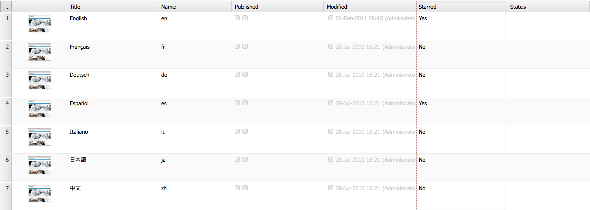

# 웹 사이트 콘솔 사용자 지정(클래식 UI){#customizing-the-websites-console-classic-ui}

## 웹 사이트(siteadmin) 콘솔에 사용자 지정 열 추가 {#adding-a-custom-column-to-the-websites-siteadmin-console}

웹 사이트 관리 콘솔을 확장하여 사용자 정의 열을 표시할 수 있습니다. 콘솔은 `ListInfoProvider` 인터페이스를 구현하는 OSGI 서비스를 만들어 확장할 수 있는 JSON 개체를 기반으로 구축됩니다. 이러한 서비스는 콘솔을 빌드하기 위해 클라이언트에 전송된 JSON 개체를 수정합니다.

이 단계별 자습서에서는 `ListInfoProvider` 인터페이스를 구현하여 웹 사이트 관리 콘솔에서 새 열을 표시하는 방법을 설명합니다. 다음 단계로 구성됩니다.

1. [OSGI 서비스](#creating-the-osgi-service) 를 만들고 이 번들 내용을 AEM 서버에 배포합니다.
1. (선택 사항) [JSON 호출을 실행하여 콘솔을 빌드하는 데 사용되는 JSON 개체를 요청하여 새 서비스](#testing-the-new-service)을 테스트합니다.
1. [저장소에서 콘솔의 노드 구조를 확장하여 새 ](#displaying-the-new-column) 열을 표시합니다.

>[!NOTE]
>
>이 자습서는 다음 관리 콘솔을 확장하는 데에도 사용할 수 있습니다.
>
>* 디지털 자산 콘솔
>* 커뮤니티 콘솔

>


### OSGI 서비스 {#creating-the-osgi-service} 만들기

`ListInfoProvider` 인터페이스는 다음 두 가지 방법을 정의합니다.

* `updateListGlobalInfo`, to update global properties of list,
* `updateListItemInfo`를 클릭하여 단일 목록 항목을 업데이트합니다.

두 메서드 모두에 대한 인수는 다음과 같습니다.

* `request`, 관련 HTTP 요청 객체
* `info`, the JSON object to update, which is each the global list or the current list item,
* `resource`, a Sling resource.

아래 샘플 구현:

* 페이지 이름이 *e*&#x200B;로 시작하는 경우 `true`에 해당하는 각 항목에 대해 *별표(*) 속성을 추가하고, 그 외의 경우에는 `false`를 추가합니다.

* 목록에 대한 전역 속성이며 별표 목록 항목의 수를 포함하는 *stledCount* 속성을 추가합니다.

OSGI 서비스를 만들려면:

1. CRXDE Lite에서 [번들](/help/sites-developing/developing-with-crxde-lite.md#managing-a-bundle)을 만듭니다.
1. 아래 샘플 코드를 추가합니다.
1. 번들 제작

새 서비스가 가동되고 있습니다.

```java
package com.test;

import com.day.cq.commons.ListInfoProvider;
import com.day.cq.i18n.I18n;
import com.day.cq.wcm.api.Page;
import org.apache.felix.scr.annotations.Component;
import org.apache.felix.scr.annotations.Service;
import org.apache.sling.api.SlingHttpServletRequest;
import org.apache.sling.api.resource.Resource;
import org.apache.sling.commons.json.JSONException;
import org.apache.sling.commons.json.JSONObject;

@Component(metatype = false)
@Service(value = ListInfoProvider.class)
public class StarredListInfoProvider implements ListInfoProvider {

    private int count = 0;

    public void updateListGlobalInfo(SlingHttpServletRequest request, JSONObject info, Resource resource) throws JSONException {
        info.put("starredCount", count);
        count = 0; // reset for next execution
    }

    public void updateListItemInfo(SlingHttpServletRequest request, JSONObject info, Resource resource) throws JSONException {
        Page page = resource.adaptTo(Page.class);
        if (page != null) {
            // Consider starred if page name starts with 'e'
            boolean starred = page.getName().startsWith("e");
            if (starred) {
                count++;
            }
            I18n i18n = new I18n(request);
            info.put("starred", starred ? i18n.get("Yes") : i18n.get("No"));
        }
    }

}
```

>[!CAUTION]
>
>* 구현은 제공된 요청 및/또는 리소스를 기반으로 JSON 개체에 정보를 추가할지 여부를 결정해야 합니다.
>* `ListInfoProvider` 구현에서 응답 개체에 이미 존재하는 속성을 정의하면 해당 값은 사용자가 제공한 속성으로 대체됩니다.

>
>  
[서비스 등급](https://www.osgi.org/javadoc/r2/org/osgi/framework/Constants.html#SERVICE_RANKING)을 사용하여 여러 `ListInfoProvider` 구현의 실행 순서를 관리할 수 있습니다.

### 새 서비스 테스트 {#testing-the-new-service}

웹 사이트 관리 콘솔을 열고 사이트를 검색할 때 브라우저는 콘솔을 빌드하는 데 사용되는 JSON 개체를 가져오기 위한 ajax 호출을 실행합니다. 예를 들어 `/content/geometrixx` 폴더를 탐색하면 다음 요청이 AEM 서버로 전송되어 콘솔을 만듭니다.

[https://localhost:4502/content/geometrixx.pages.json?start=0&amp;limit=30&amp;predicate=siteadmin](https://localhost:4502/content/geometrixx.pages.json?start=0&amp;limit=30&amp;predicate=siteadmin)

새 서비스가 포함된 번들을 배포한 후에 실행되고 있는지 확인하려면 다음을 수행하십시오.

1. 브라우저를 다음 URL로 가리킵니다.
   [https://localhost:4502/content/geometrixx.pages.json?start=0&amp;limit=30&amp;predicate=siteadmin](https://localhost:4502/content/geometrixx.pages.json?start=0&amp;limit=30&amp;predicate=siteadmin)

1. 응답에 다음과 같이 새 속성이 표시되어야 합니다.


### 새 열 표시 {#displaying-the-new-column}

마지막 단계는 웹 사이트 관리 콘솔의 노드 구조를 수정하여 `/libs/wcm/core/content/siteadmin`을 오버레이하여 모든 Geometrixx 페이지에 대한 새 속성을 표시하는 것입니다. 다음과 같이 진행합니다.

1. CRXDE Lite에서 `sling:Folder` 유형의 노드가 있는 노드 구조 `/apps/wcm/core/content`을 만들어 `/libs/wcm/core/content` 구조를 반영합니다.

1. `/libs/wcm/core/content/siteadmin` 노드를 복사하고 `/apps/wcm/core/content` 아래에 붙여 넣습니다.

1. `/apps/wcm/core/content/siteadmin/grid/assets` 노드를 `/apps/wcm/core/content/siteadmin/grid/geometrixx`에 복사하고 해당 속성을 변경합니다.

   * **pageText** 제거

   * **pathRegex**&#x200B;을 `/content/geometrixx(/.*)?`로 설정
그러면 모든 geometrixx 웹 사이트에 격자 구성이 활성화됩니다.

   * **storeProxySuffix**&#x200B;을 `.pages.json`(으)로 설정합니다.

   * **storeReaderFields** 다중값 속성을 편집하고 `starred` 값을 추가합니다.

   * MSM 기능을 활성화하려면 다음 MSM 매개 변수를 다중 문자열 속성 **storeReaderFields**&#x200B;에 추가합니다.

      * **msm:isSource**
      * **msm:isInBlueprint**
      * **msm:isLiveCopy**

1. 다음 속성을 사용하여 `/apps/wcm/core/content/siteadmin/grid/geometrixx/columns` 아래에 `starred` 노드(**nt:unstructured** 유형)를 추가합니다.

   * **dataIndex**: `starred` 문자열 유형

   * **헤더**: `Starred` 문자열 유형

   * **xtype**: `gridcolumn` 문자열 유형

1. (선택 사항) `/apps/wcm/core/content/siteadmin/grid/geometrixx/columns`에 표시하지 않을 열을 삭제합니다.

1. `/siteadmin` 는 기본적으로 가리키는 별칭 경로입니다 `/libs/wcm/core/content/siteadmin`.
이 값을 `/apps/wcm/core/content/siteadmin`의 siteadmin 버전으로 리디렉션하려면 `sling:vanityOrder` 속성을 `/libs/wcm/core/content/siteadmin`에 정의된 값보다 높은 값으로 정의합니다. 기본값은 300이므로 더 높은 값은 적절합니다.

1. 웹 사이트 관리 콘솔로 이동하여 Geometrixx 사이트로 이동합니다.
   [https://localhost:4502/siteadmin#/content/geometrixx](https://localhost:4502/siteadmin#/content/geometrixx).

1. **Started**&#x200B;이라는 새 열을 사용할 수 있으며 다음과 같이 사용자 지정 정보를 표시할 수 있습니다.



>[!CAUTION]
>
>여러 그리드 구성이 **pathRegex** 속성에 의해 정의된 요청된 경로와 일치하는 경우 첫 번째 격자 구성이 가장 구체적인 경로가 아니라 사용됩니다. 즉, 구성 순서가 중요합니다.

### 샘플 패키지 {#sample-package}

이 자습서의 결과는 패키지 공유의 [웹 사이트 관리 콘솔 사용자 지정](https://localhost:4502/crx/packageshare/index.html/content/marketplace/marketplaceProxy.html?packagePath=/content/companies/public/adobe/packages/helper/customizing-siteadmin) 패키지에서 확인할 수 있습니다.
