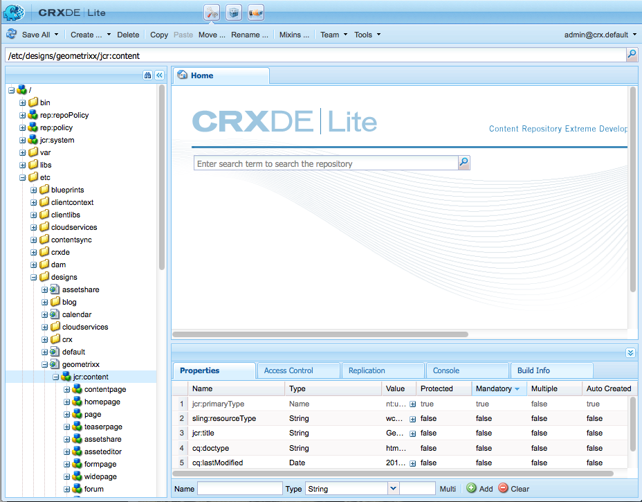

# 디자인 및 디자이너{#designs-and-the-designer}

>[!CAUTION]
>
>이 문서에서는 클래식 UI를 기반으로 웹 사이트를 만드는 방법에 대해 설명합니다. AEM 사이트 개발 시작 문서에 자세히 설명된 대로 웹 사이트에 대한 최신 AEM 기술을 [활용하는 것이 좋습니다](/help/sites-developing/getting-started.md).

웹 사이트 및 AEM에서 디자이너를 사용하여 디자인을 만들어야 합니다.

>[!NOTE]
>
>웹 접근성에 대한 자세한 내용은 AEM 및 웹 [접근성 지침을 참조하십시오](/help/managing/web-accessibility.md).

## 디자이너 사용 {#using-the-designer}

디자인은 도구 탭의 **디자인** 섹션에서 정의할 수 **있습니다** .


여기에서 디자인을 저장하는 데 필요한 구조를 만든 다음 필요한 종속 연결된 스타일 시트와 이미지를 업로드할 수 있습니다.

디자인은 아래에 저장됩니다. `/etc/designs` 웹 사이트에 사용할 디자인 경로는 `cq:designPath` 노드의 `jcr:content` 속성을 사용하여 지정합니다.



>[!NOTE]
>
>디자인 모드에서 페이지에서 수행한 모든 변경 사항은 사이트의 디자인 노드 아래에 그대로 유지되며 동일한 디자인을 갖는 모든 페이지에 자동으로 적용됩니다.

## 필요한 제품 {#what-you-will-need}

디자인을 실현하려면 다음을 수행해야 합니다.

**CSS** - CSS(Cascading Style Sheet)는 페이지에서 특정 영역의 형식을 정의합니다.
**이미지** - 배경, 버튼 등의 기능에 사용하는 모든 이미지.

### 웹 사이트 디자인 시 고려 사항 {#considerations-when-designing-your-website}

웹 사이트를 개발할 때 다음 코드 조각에 설명된 것처럼 현재 디자인을 기준으로 리소스를 참조할 수 `/etc/design/<project>` 있도록 이미지 및 CSS 파일을 저장하는 것이 좋습니다.

```xml
<%= currentDesign.getPath() + "/static/img/icon.gif %>
```

앞의 예에서는 몇 가지 이점을 제공합니다.

* 구성 요소는 다른 디자인 경로를 사용하여 각 사이트를 기반으로 다른 모양과 느낌을 가질 수 있습니다.
* 웹 사이트의 재설계는 사이트 루트에서 (까지) 다른 노드에 대한 디자인 경로를 가리키기만 하면 `design/v1` 됩니다 `design/v2.`

* `/etc/designs` 브라우저가 보는 유일한 외부 `/content` URL은 `/apps` 트리 아래에 무엇이 있는지 궁금해 하는 외부 사용자의 보호를 의미합니다. 위의 URL 혜택을 통해 시스템 관리자가 자산의 노출을 몇 개의 서로 다른 위치로 제한하므로 더 나은 보안을 설정할 수 있습니다.

