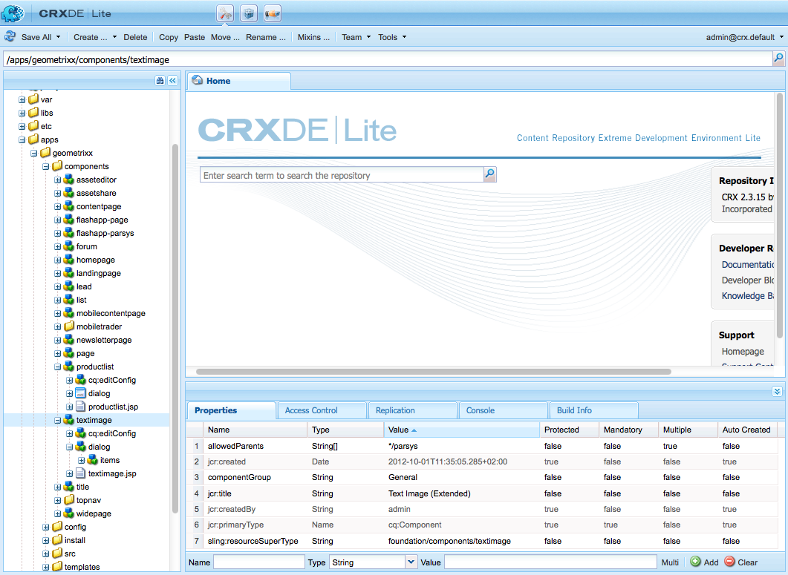

# AEM 구성 요소 개발(클래식 UI){#developing-aem-components-classic-ui}

클래식 UI 파섹 이러한 위젯의 특성 때문에 구성 요소가 클래식 UI와 [터치 지원 UI와 상호 작용하는 방식은 약간 다릅니다](/help/sites-developing/developing-components.md).

>[!NOTE]
>
>구성 요소 개발의 많은 측면이 클래식 UI와 터치 지원 UI에 공통적이므로, 클래식 UI의 **세부 사항을 다루는 이 페이지를 사용하기[전에](/help/sites-developing/components-basics.md)AEM 구성 요소 - 기본 사항을** 읽어야 합니다.

>[!NOTE]
>
>HTML 템플릿 언어(HTL)와 JSP를 클래식 UI용 구성 요소를 개발하는 데 사용할 수 있지만 이 페이지에서는 JSP를 사용한 개발을 보여 줍니다. 이는 클래식 UI에서 JSP를 사용한 작업 내역이 기인한 것입니다.
>
>이제 AEM에 대한 권장 스크립팅 언어입니다. 메서드를 비교하려면 [HTL](https://docs.adobe.com/content/help/en/experience-manager-htl/using/overview.html) 및 [AEM 구성](/help/sites-developing/developing-components.md) 요소 개발을 참조하십시오.

## 구조 {#structure}

구성 요소의 기본 구조는 AEM 구성 요소 - [기본](/help/sites-developing/components-basics.md#structure)페이지에서 다룹니다. 이 기능은 터치 및 클래식 UI를 모두 적용합니다. 새 구성 요소에서 터치 지원 UI에 대한 설정을 사용할 필요가 없는 경우에도 기존 구성 요소에서 상속할 때 이를 파악하는 데 도움이 될 수 있습니다.

## JSP 스크립트 {#jsp-scripts}

JSP 스크립트 또는 서블릿을 사용하여 구성 요소를 렌더링할 수 있습니다. Sling의 요청 처리 규칙에 따라 기본 스크립트의 이름은 다음과 같습니다.

`<*componentname*>.jsp`

## global.jsp {#global-jsp}

JSP 스크립트 파일은 구성 요소를 렌더링하는 데 사용되는 모든 JSP 스크립트 파일에 대한 특정 객체(즉, 컨텐츠에 액세스하는 경우)에 빠르게 액세스할 수 있도록 하는 데 `global.jsp` 사용됩니다.

따라서 `global.jsp` 에서 제공되는 하나 이상의 객체가 사용되는 모든 구성 요소 렌더링 JSP 스크립트에 포함되어야 `global.jsp` 합니다.

기본 위치는 `global.jsp` 다음과 같습니다.

`/libs/foundation/global.jsp`

>[!NOTE]
>
>CQ 5.3 및 이전 버전에서 `/libs/wcm/global.jsp`사용한 경로가 이제 사용되지 않습니다.

### global.jsp, 사용된 API 및 Taglibs의 함수 {#function-of-global-jsp-used-apis-and-taglibs}

다음은 기본값에서 제공하는 가장 중요한 개체를 나열하는 `global.jsp`것입니다.

요약:

* `<cq:defineObjects />`

   * `slingRequest` - 래핑된 요청 개체( `SlingHttpServletRequest`)입니다.
   * `slingResponse` - 래핑된 응답 개체( `SlingHttpServletResponse`)입니다.
   * `resource` - Sling 리소스 객체( `slingRequest.getResource();`).
   * `resourceResolver` - Sling 리소스 확인자 개체( `slingRequest.getResoucreResolver();`)입니다.
   * `currentNode` - 요청에 대해 해결된 JCR 노드입니다.
   * `log` - 기본 로거().
   * `sling` - Sling 스크립트 도우미
   * `properties` - 주소 지정된 리소스( `resource.adaptTo(ValueMap.class);`)의 속성입니다.
   * `pageProperties` - 주소 지정된 리소스의 페이지 속성입니다.
   * `pageManager` - AEM 컨텐츠 페이지에 액세스하기 위한 페이지 관리자( `resourceResolver.adaptTo(PageManager.class);`).
   * `component` - 현재 AEM 구성 요소의 구성 요소 개체..
   * `designer` - 디자인 정보( `resourceResolver.adaptTo(Designer.class);`)를 검색하는 디자이너 개체입니다.
   * `currentDesign` - 주소 지정된 리소스의 디자인입니다.
   * `currentStyle` - 주소 지정된 리소스의 스타일입니다.

### 컨텐츠 액세스 {#accessing-content}

AEM WCM의 컨텐츠에 액세스하는 방법에는 다음 세 가지가 있습니다.

* 에 도입된 속성 개체를 통해 `global.jsp`:

   속성 개체는 ValueMap의 인스턴스이며(Sling API 참조 [](https://sling.apache.org/apidocs/sling5/org/apache/sling/api/resource/ValueMap.html)) 현재 리소스의 모든 속성을 포함합니다.

   예:페이지 구성 요소의 렌더링 스크립트에 `String pageTitle = properties.get("jcr:title", "no title");` 사용됩니다.

   예:표준 단락 구성 요소의 렌더링 스크립트에 `String paragraphTitle = properties.get("jcr:title", "no title");` 사용됩니다.

* 에 도입된 `currentPage` 객체를 통해 `global.jsp`:

   개체는 페이지의 `currentPage` 인스턴스입니다(AEM [API 참조](https://helpx.adobe.com/experience-manager/6-5/sites/developing/using/reference-materials/javadoc/com/day/cq/wcm/api/Page.mhtml)). 페이지 클래스는 컨텐츠에 액세스하는 몇 가지 방법을 제공합니다.

   예: `String pageTitle = currentPage.getTitle();`

* 다음 사이트에서 소개된 `currentNode` `global.jsp`개체를 통해:

   개체는 노드의 `currentNode` 인스턴스입니다(JCR API [참조](https://jackrabbit.apache.org/api/2.16/org/apache/jackrabbit/standalone/cli/core/CurrentNode.html)). 노드의 속성은 `getProperty()` 메서드에서 액세스할 수 있습니다.

   예: `String pageTitle = currentNode.getProperty("jcr:title");`

## JSP 태그 라이브러리 {#jsp-tag-libraries}

CQ 및 Sling 태그 라이브러리를 사용하면 템플릿 및 구성 요소의 JSP 스크립트에서 사용할 특정 기능에 액세스할 수 있습니다.

자세한 내용은 문서 태그 [라이브러리를 참조하십시오](/help/sites-developing/taglib.md).

## 클라이언트측 HTML 라이브러리 사용 {#using-client-side-html-libraries}

최신 웹 사이트에서는 복잡한 JavaScript 및 CSS 코드를 기반으로 하는 클라이언트측 처리에 크게 의존합니다. 이 코드의 제공을 구성하고 최적화하는 것은 복잡한 문제가 될 수 있습니다.

이 문제를 해결하기 위해 AEM에서는 **클라이언트측 코드를**&#x200B;저장소에 저장하고, 카테고리로 구성하고, 각 코드 카테고리가 클라이언트에 제공될 시기와 방법을 정의할 수 있는 클라이언트측 라이브러리 폴더를 제공합니다. 그런 다음 클라이언트측 라이브러리 시스템은 최종 웹 페이지에서 올바른 링크를 만들어 올바른 코드를 로드합니다.

자세한 내용은 [클라이언트측 HTML 라이브러리](/help/sites-developing/clientlibs.md) 사용 문서를 참조하십시오.

## 대화 상자 {#dialog}

작성자가 컨텐츠를 추가하고 구성할 수 있는 대화 상자가 구성 요소에 필요합니다.

자세한 [내용은 AEM 구성 요소 - 기본](/help/sites-developing/components-basics.md#dialogs) 사항을 참조하십시오.

## 편집 동작 구성 {#configuring-the-edit-behavior}

구성 요소의 편집 동작을 구성할 수 있습니다. 여기에는 구성 요소에 사용할 수 있는 작업, 즉석 편집기의 특성 및 구성 요소의 이벤트와 관련된 리스너와 같은 속성이 포함됩니다. 특정 차이점이 있지만 터치 지원 및 클래식 UI 모두에 일반적으로 구성이 사용됩니다.

구성 요소의 [편집 비헤이비어는 구성 요소 노드](/help/sites-developing/components-basics.md#edit-behavior) (유형 `cq:editConfig` 아래) 아래에 유형 `cq:EditConfig` 노드를 추가하고 특정 속성과 하위 노드를 추가하여 구성됩니다 `cq:Component`.

## ExtJS 위젯 사용 및 확장 {#using-and-extending-extjs-widgets}

자세한 [내용은 ExtJS 위젯](/help/sites-developing/widgets.md) 사용 및 확장을 참조하십시오.

## ExtJS 위젯용 xtypes 사용 {#using-xtypes-for-extjs-widgets}

자세한 [내용은 xtypes](/help/sites-developing/xtypes.md) 사용을 참조하십시오.

## 새 구성 요소 개발 {#developing-new-components}

이 섹션에서는 직접 구성 요소를 만들고 단락 시스템에 추가하는 방법에 대해 설명합니다.

빠른 시작 방법은 기존 구성 요소를 복사한 다음 원하는 대로 변경하는 것입니다.

구성 요소 개발 방법의 예는 텍스트 및 이미지 구성 요소 확장 - [예를 참조하십시오.](#extending-the-text-and-image-component-an-example)

### 새 구성 요소 개발(기존 구성 요소 조정) {#develop-a-new-component-adapt-existing-component}

기존 구성 요소를 기반으로 AEM용 새 구성 요소를 개발하려면 구성 요소를 복사하고, 새 구성 요소에 대한 javascript 파일을 만들어 AEM에서 액세스할 수 있는 위치에 저장할 수 있습니다(구성 요소 및 기타 요소 [사용자 정의 참조](/help/sites-developing/dev-guidelines-bestpractices.md#customizing-components-and-other-elements)).

1. CRXDE Lite를 사용하여

   / `apps/<myProject>/components/<myComponent>`

   노드 구조를 라이브러리처럼 다시 만든 다음 텍스트 구성 요소와 같은 기존 구성 요소의 정의를 복사합니다. 예를 들어 텍스트 구성 요소 복사본을 사용자 정의하려면 다음을 수행합니다.

   * 시작 시간:`/libs/foundation/components/text`
   * 끝 `/apps/myProject/components/text`

1. 새 이름을 반영하도록 `jcr:title` 를 수정합니다.
1. 새 구성 요소 폴더를 열고 필요한 사항을 변경합니다. 또한 폴더에서 불필요한 정보를 삭제합니다.

   다음과 같이 변경할 수 있습니다.

   * 대화 상자에서 새 필드 추가

      * `cq:dialog` - 터치 지원 UI에 대한 대화 상자
      * `dialog` - 클래식 UI에 대한 대화 상자
   * 파일 바꾸기(새 구성 요소 뒤에 이름 지정) `.jsp`
   * 원하는 경우 전체 구성 요소를 완전히 다시 작업할 수 있습니다.
   예를 들어, 표준 텍스트 구성 요소의 사본을 가지고 있는 경우 대화 상자에 추가 필드를 추가한 다음 해당 필드를 업데이트하여 `.jsp` 작성된 입력을 처리할 수 있습니다.

   >[!NOTE]
   >
   >A component for the:
   >
   >* 터치 지원 UI에서 Granite [구성 요소를](https://helpx.adobe.com/experience-manager/6-5/sites/developing/using/reference-materials/granite-ui/api/jcr_root/libs/granite/ui/index.html) 사용
   >* 클래식 UI에서 [ExtJS 위젯 사용](https://helpx.adobe.com/experience-manager/6-5/sites/developing/using/reference-materials/widgets-api/index.html)


   >[!NOTE]
   >
   >클래식 UI에 대해 정의된 대화 상자는 터치 지원 UI 내에서 작동합니다.
   >
   >터치 지원 UI에 대해 정의된 대화 상자는 클래식 UI 내에서 작동하지 않습니다.
   >
   >인스턴스와 작성 환경에 따라 구성 요소에 대해 두 유형의 대화 상자를 정의할 수 있습니다.

1. 새 구성 요소가 나타나려면 다음 노드 중 하나가 있고 제대로 초기화되어야 합니다.

   * `cq:dialog` - 터치 지원 UI에 대한 대화 상자
   * `dialog` - 클래식 UI에 대한 대화 상자
   * `cq:editConfig` - 구성 요소가 편집 환경에서 작동하는 방식(예: 드래그 앤 드롭)
   * `design_dialog` - 디자인 모드 대화 상자(클래식 UI만 해당)

1. 다음 방법 중 하나를 사용하여 단락 시스템에서 새 구성 요소를 활성화합니다.

   * crxde Lite를 사용하여 값 `<path-to-component>` (예: `/apps/geometrixx/components/myComponent`)을 노드의 속성 구성 요소에 추가합니다. `/etc/designs/geometrixx/jcr:content/contentpage/par`
   * paragraph systems [에 새 구성 요소 추가 지침](#adding-a-new-component-to-the-paragraph-system-design-mode)

1. AEM WCM에서 웹 사이트에서 페이지를 열고 방금 만든 유형의 새 단락을 삽입하여 구성 요소가 제대로 작동하는지 확인합니다.

>[!NOTE]
>
>페이지 로딩에 대한 시간 통계를 보려면 Ctrl-Shift-U - URL에 설정된 상태로 `?debugClientLibs=true` 를 사용할 수 있습니다.

### 단락 시스템에 새 구성 요소 추가(디자인 모드) {#adding-a-new-component-to-the-paragraph-system-design-mode}

구성 요소가 개발되면 작성자가 페이지를 편집할 때 구성 요소를 선택하고 사용할 수 있도록 단락 시스템에 구성 요소를 추가합니다.

1. 예를 들어 단락 시스템을 사용하는 작성 환경 내의 페이지에 `<contentPath>/Test.html`액세스합니다.
1. 다음 방법 중 하나를 사용하여 디자인 모드로 전환합니다.

   * url `?wcmmode=design` 의 끝에 추가하고 다시 액세스하는 예:

      `<contextPath>/ Test.html?wcmmode=design`

   * 사이드 킥에서 디자인 클릭
   이제 디자인 모드에서 단락 시스템을 편집할 수 있습니다.

1. 편집을 클릭합니다. 

   단락 시스템에 속하는 구성 요소 목록이 표시됩니다. 새 구성 요소도 나열됩니다.

   구성 요소를 활성화(또는 비활성화)하여 페이지를 편집할 때 작성자에게 제공되는 구성 요소를 결정할 수 있습니다.

1. 구성 요소를 활성화한 다음 일반 편집 모드로 돌아가 사용할 수 있는지 확인합니다.

### 텍스트 및 이미지 구성 요소 확장 - 예 {#extending-the-text-and-image-component-an-example}

이 섹션에서는 구성 가능한 이미지 배치 기능을 사용하여 널리 사용되는 텍스트 및 이미지 표준 구성 요소를 확장하는 방법에 대한 예를 제공합니다.

편집자는 텍스트 및 이미지 구성 요소의 확장을 통해 구성 요소의 모든 기존 기능을 사용할 수 있을 뿐만 아니라 이미지 배치를 지정할 수 있는 추가 옵션을 사용할 수 있습니다.

* 텍스트의 왼쪽(현재 동작 및 새 기본값)
* 오른쪽뿐만 아니라

이 구성 요소를 확장한 후 구성 요소의 대화 상자를 통해 이미지 배치를 구성할 수 있습니다.

이 연습에서는 다음 기법을 설명합니다.

* 기존 구성 요소 노드 복사 및 해당 메타데이터 수정
* 상위 대화 상자에서 위젯 상속을 포함하여 구성 요소의 대화 상자 수정
* 구성 요소의 스크립트를 수정하여 새 기능 구현

>[!NOTE]
>
>이 예제는 클래식 UI를 타깃팅합니다.

>[!NOTE]
>
>이 예는 We.Retail로 대체된 AEM과 함께 더 이상 제공되지 않는 Geometrixx 샘플 컨텐츠를 기반으로 합니다. Geometrixx [를 다운로드 및 설치하는](/help/sites-developing/we-retail.md#we-retail-geometrixx) 방법은 We.Retail 참조 구현 문서를 참조하십시오.

#### 기존 텍스트 이미지 구성 요소 확장 {#extending-the-existing-textimage-component}

새 구성 요소를 만들기 위해 표준 텍스트 이미지 구성 요소를 기본으로 사용하고 수정합니다. 새 구성 요소는 Geometrixx AEM WCM 예제 애플리케이션에 저장됩니다.

1. 대상 노드 이름으로 textimage를 사용하여 Geometrixx 구성 요소 `/libs/foundation/components/textimage` 폴더에 표준 텍스트 `/apps/geometrixx/components`시간 구성 요소를 복사합니다. 구성 요소로 이동하고 마우스 오른쪽 단추를 클릭하고 대상 디렉토리로 복사 및 탐색하여 구성 요소를 복사합니다.

   

1. 이 예제를 간단하게 유지하려면 복사한 구성 요소로 이동하고 다음 항목을 제외하고 새 텍스트 페이지 노드의 모든 하위 노드를 삭제합니다.

   * 대화 상자 정의: `textimage/dialog`
   * 구성 요소 스크립트: `textimage/textimage.jsp`
   * 구성 노드 편집(자산의 드래그 앤 드롭 허용): `textimage/cq:editConfig`
   >[!NOTE]
   >
   >대화 상자 정의는 UI에 따라 다릅니다.
   >
   >* Touch-enabled UI: `textimage/cq:dialog`
   >* 클래식 UI: `textimage/dialog`


1. 구성 요소 메타데이터를 편집합니다.

   * 구성 요소 이름

      * 다음으로 `jcr:description` 설정 `Text Image Component (Extended)`
      * 다음으로 `jcr:title` 설정 `Text Image (Extended)`
   * 그룹, 구성 요소가 사이드 킥에 나열되는 위치(그대로 두기)

      * Leave `componentGroup` set to `General`
   * 새 구성 요소에 대한 상위 구성 요소(표준 텍스트 이미지 구성 요소)

      * 다음으로 `sling:resourceSuperType` 설정 `foundation/components/textimage`
   이 단계 후에는 구성 요소 노드가 다음과 같이 표시됩니다.

   

1. 이미지의 편집 구성 노드의 `sling:resourceType` 속성을 변경합니다(속성:) to `textimage/cq:editConfig/cq:dropTargets/image/parameters/sling:resourceType``geometrixx/components/textimage.`

   이렇게 하면 이미지가 페이지의 구성 요소로 드롭될 때 확장 텍스트 `sling:resourceType` 시간 구성 요소의 속성이 다음으로 설정됩니다. `geometrixx/components/textimage.`

1. 새 옵션을 포함하도록 구성 요소의 대화 상자를 수정합니다. 새 구성 요소는 원본과 동일한 대화 상자의 부분을 상속합니다. The only addition we make the Advanced **tab, adding an Image** Position **dropdown list, with options** Left and Right ********:

   * 속성을 `textimage/dialog`변경하지 않고 그대로 둡니다.
   4개의 하위 노드(tab1-tab4)가 `textimage/dialog/items` 있는 방식을 참고하여 텍스트 크기 대화 상자의 4개 탭을 나타냅니다.

   * 처음 두 탭(탭1 및 탭2)의 경우:

      * xtype을 cqinclude(표준 구성 요소에서 상속)로 변경합니다.
      * 값과 값이 `/libs/foundation/components/textimage/dialog/items/tab1.infinity.json`각각 `/libs/foundation/components/textimage/dialog/items/tab2.infinity.json`있는 경로 속성을 추가합니다.
      * 다른 모든 속성 또는 하위 노드를 제거합니다.
   * 탭3의 경우:

      * 속성 및 하위 노드를 변경 없이 유지
      * 새 필드 정의를 `tab3/items`유형 노드 위치에 추가합니다. `cq:Widget`
      * 새 `tab3/items/position`노드에 대해 다음 속성(문자열 유형)을 설정합니다.

         * `name`: `./imagePosition`
         * `xtype`: `selection`
         * `fieldLabel`: `Image Position`
         * `type`: `select`
      * 이미지 배치에 대한 두 가지 선택 사항을 나타내는 하위 노드를 `position/options` 추가하고 그 아래에 두 개의 노드, o1 및 o2 유형이 `cq:WidgetCollection` `nt:unstructured`생성됩니다.
      * 노드의 경우 속성을 `position/options/o1` 설정합니다. `text` 및 `Left``value` to `left.`
      * 노드의 경우 속성을 `position/options/o2` 설정합니다.to `text` and `Right` to `value` `right`.
   * Delete tab4.
   이미지 위치는 `imagePosition`단락을 나타내는 노드의 `textimage` 속성으로 컨텐츠에 유지됩니다. 이러한 단계 후에는 구성 요소 대화 상자가 다음과 같이 표시됩니다.

   

1. 새 매개 변수를 추가로 처리하여 구성 요소 스크립트를 `textimage.jsp`확장합니다.

   ```xml
   Image image = new Image(resource, "image");
   
   if (image.hasContent() || WCMMode.fromRequest(request) == WCMMode.EDIT) {
        image.loadStyleData(currentStyle);
   ```

   강조된 코드 조각 *%>&lt;div class=&quot;image&quot;>&lt;%* 을(를) 이 태그에 대한 사용자 지정 스타일을 생성하는 새 코드로 바꿉니다.

   ```xml
   // todo: add new CSS class for the 'right image' instead of using
   // the style attribute
   String style="";
        if (properties.get("imagePosition", "left").equals("right")) {
             style = "style=\"float:right\"";
        }
        %><div <%= style %> class="image"><%
   ```

1. 구성 요소를 저장소에 저장합니다. 구성 요소를 테스트할 준비가 되었습니다.

#### 새 구성 요소 확인 {#checking-the-new-component}

구성 요소가 개발되면 작성자가 페이지를 편집할 때 구성 요소를 선택하고 사용할 수 있도록 단락 시스템에 구성 요소를 추가할 수 있습니다. 이러한 단계를 통해 구성 요소를 테스트할 수 있습니다.

1. English/Company와 같은 Geometrixx에서 페이지를 엽니다.
1. 사이드 킥에서 디자인을 클릭하여 디자인 모드로 전환합니다.
1. 페이지 중앙에 있는 단락 시스템에서 편집을 클릭하여 단락 시스템 디자인을 편집합니다. 단락 시스템에 배치할 수 있는 구성 요소 목록이 표시되며, 여기에는 새로 개발된 구성 요소인 텍스트 이미지(확장)가 포함되어야 합니다. 단락 시스템을 선택하고 확인을 클릭하여 활성화하십시오.
1. 편집 모드로 다시 전환합니다.
1. 텍스트 이미지(확장) 단락을 단락 시스템에 추가하고, 샘플 컨텐츠로 텍스트와 이미지를 초기화합니다. 변경 사항을 저장합니다.
1. 텍스트 및 이미지 단락의 대화 상자를 열고 고급 탭의 이미지 위치를 오른쪽으로 변경하고 확인을 클릭하여 변경 내용을 저장합니다.
1. 단락이 오른쪽에 이미지와 함께 렌더링됩니다.
1. 이제 구성 요소를 사용할 준비가 되었습니다.

구성 요소는 회사 페이지의 단락에 컨텐츠를 저장합니다.

### 이미지 구성 요소의 업로드 기능 비활성화 {#disable-upload-capability-of-the-image-component}

이 기능을 비활성화하려면 표준 이미지 구성 요소를 기본으로 사용하고 수정합니다. Geometrixx 예제 응용 프로그램에 새 구성 요소를 저장합니다.

1. 이미지를 대상 노드 이름으로 사용하여 표준 이미지 구성 요소를 Geometrixx 구성 요소 `/libs/foundation/components/image` 폴더로 `/apps/geometrixx/components`복사합니다.

   

1. 구성 요소 메타데이터를 편집합니다.

   * jcr: **title** 설정 `Image (Extended)`

1. 다음으로 이동 `/apps/geometrixx/components/image/dialog/items/image`.
1. 새 속성 추가:

   * **이름**: `allowUpload`
   * **유형**: `String`
   * **값**: `false`
   

1. 모두 **저장을 클릭합니다**. 구성 요소를 테스트할 준비가 되었습니다.
1. English/Company와 같은 Geometrixx에서 페이지를 엽니다.
1. 디자인 모드로 전환하고 이미지(확장)를 활성화합니다.
1. 편집 모드로 다시 전환하여 단락 시스템에 추가합니다. 다음 그림에서 원본 이미지 구성 요소와 방금 만든 이미지 구성 요소의 차이점을 확인할 수 있습니다.

   원본 이미지 구성 요소:

   

   새 이미지 구성 요소:

   

1. 이제 구성 요소를 사용할 준비가 되었습니다.

