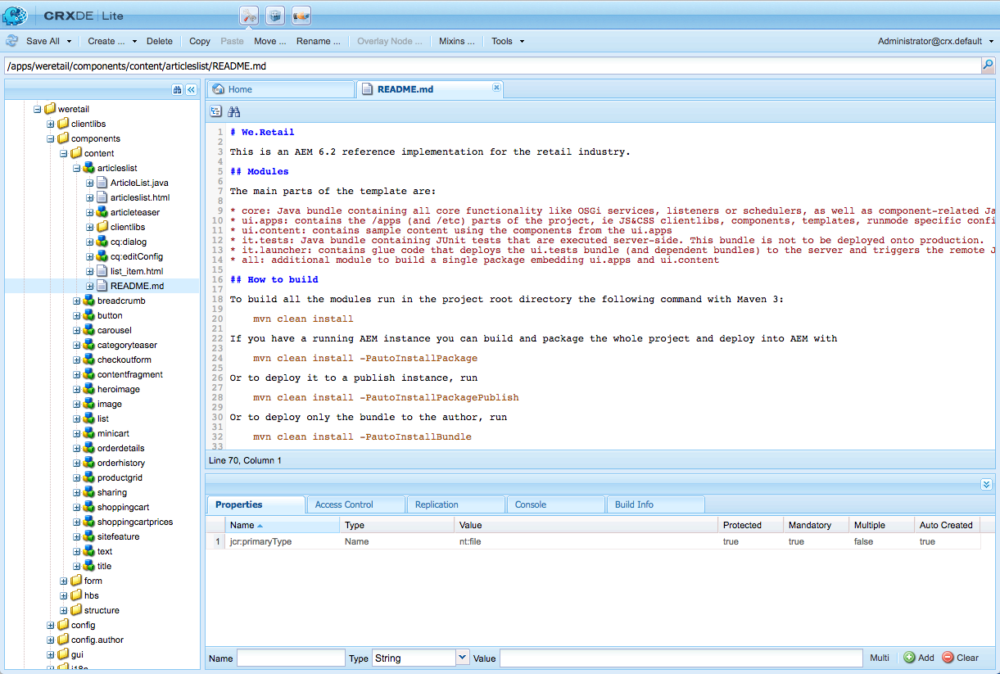

# AEM 구성 요소 개발{#developing-aem-components}

AEM 구성 요소는 웹 페이지에서 사용할 수 있는 컨텐츠를 저장, 포맷 및 렌더링하는 데 사용됩니다.

* [페이지 작성](/help/sites-authoring/default-components.md)에서는 작성자가 컨텐츠를 편집하고 구성할 수 있습니다.

   * [Commerce](/help/commerce/cif-classic/administering/ecommerce.md) 사이트를 구성할 때 구성 요소는 카탈로그에서 정보를 수집하고 렌더링할 수 있습니다.
자세한 내용은 [eCommerce 개발](/help/commerce/cif-classic/developing/ecommerce.md)을 참조하십시오.

   * [Communities](/help/communities/author-communities.md) 사이트를 구성할 때 구성 요소는 방문자에게 정보를 제공하고 방문자로부터 정보를 수집할 수 있습니다.
자세한 내용은 [커뮤니티 개발](/help/communities/communities.md) 을 참조하십시오.

* 게시 인스턴스에서 구성 요소는 컨텐츠를 렌더링하여 웹 사이트 방문자에게 필요한 대로 제공합니다.

>[!NOTE]
>
>이 페이지는 [AEM 구성 요소 - 기본 사항](/help/sites-developing/components-basics.md) 문서의 연속입니다.

>[!CAUTION]
>
>`/libs/cq/gui/components/authoring/dialog` 아래의 구성 요소는 편집기(작성의 구성 요소 대화 상자)에서만 사용하기 위한 것입니다. 다른 곳에서 사용하는 경우(예를 들어 마법사 대화 상자에서와 같이) 예상대로 작동하지 않을 수 있습니다.

## 코드 샘플 {#code-samples}

이 페이지에서는 AEM용 새 구성 요소를 개발하는 데 필요한 참조 설명서(또는 참조 설명서에 대한 링크)를 제공합니다. 몇 가지 실용적인 예는 [AEM 구성 요소 개발 - 코드 샘플](/help/sites-developing/developing-components-samples.md)을 참조하십시오.

## 구조 {#structure}

구성 요소의 기본 구조는 페이지 [AEM 구성 요소 - 기본 사항](/help/sites-developing/components-basics.md#structure)에서 다룹니다. 이 문서에서는 터치 지원 및 클래식 UI에 대해 설명합니다. 새 구성 요소에서 클래식 설정을 사용할 필요가 없는 경우에도 기존 구성 요소에서 상속할 때 이를 인식하는 데 도움이 될 수 있습니다.

## 기존 구성 요소 및 대화 상자 확장 {#extending-existing-components-and-dialogs}

구현하려는 구성 요소에 따라 전체 [구조](#structure)를 처음부터 정의하고 개발하지 않고 기존 인스턴스를 확장하거나 사용자 지정할 수 있습니다.

기존 구성 요소나 대화 상자를 확장하거나 사용자 정의할 때 변경 작업을 수행하기 전에 전체 구조 또는 대화 상자에 필요한 구조를 복사하거나 복제할 수 있습니다.

### 기존 구성 요소 확장 {#extending-an-existing-component}

기존 구성 요소를 확장하는 방법은 [리소스 유형 계층 구조](/help/sites-developing/components-basics.md#component-hierarchy-and-inheritance) 및 관련 상속 메커니즘을 사용하여 완수할 수 있습니다.

>[!NOTE]
>
>검색 경로 로직을 기반으로 오버레이로 구성 요소를 재정의할 수도 있습니다. 그러나 이 경우 [Sling Resource Merger](/help/sites-developing/sling-resource-merger.md)는 트리거되지 않고 `/apps`가 전체 오버레이를 정의해야 합니다.

>[!NOTE]
>
>[컨텐츠 조각 구성 요소](/help/sites-developing/customizing-content-fragments.md)도 사용자 지정하고 확장할 수 있지만, 자산과의 전체 구조 및 관계를 고려해야 합니다.

### 기존 구성 요소 대화 상자 사용자 지정 {#customizing-a-existing-component-dialog}

[Sling Resource Merger](/help/sites-developing/sling-resource-merger.md)를 사용하여 *구성 요소 대화 상자*&#x200B;를 재정의하고 `sling:resourceSuperType` 속성을 정의할 수도 있습니다.

즉, `sling:resourceSuperType` 사용)을 사용하여 전체 대화 상자를 재정의하는 것과 대조적으로 필요한 차이만 재정의할 수 있습니다. 이제 구성 요소 대화 상자를 확장하는 데 권장되는 방법입니다

자세한 내용은 [Sling Resource Merger](/help/sites-developing/sling-resource-merger.md)를 참조하십시오.

## 마크업 정의 {#defining-the-markup}

구성 요소가 [HTML](https://www.w3schools.com/htmL/html_intro.asp)로 렌더링됩니다. 구성 요소는 필요한 컨텐츠를 가져온 다음 작성 환경과 게시 환경 모두에서 필요에 따라 렌더링하는 데 필요한 HTML을 정의해야 합니다.

### HTML Template Language 사용 {#using-the-html-template-language}

AEM 6.0에서 도입된 [HTML 템플릿 언어 (HTL)](https://docs.adobe.com/content/help/en/experience-manager-htl/using/overview.html)는 HTML의 서버측 템플릿 시스템으로 JSP(Java 서버 페이지) 대신 선호되고 권장됩니다. 강력한 엔터프라이즈 웹 사이트를 구축해야 하는 웹 개발자의 경우 HTL을 사용하면 보안 및 개발 효율성이 향상됩니다.

>[!NOTE]
>
>HTL과 JSP를 구성 요소 개발에 사용할 수 있지만 AEM에 권장되는 스크립팅 언어이므로 이 페이지에서 HTL을 사용한 개발을 보여 줍니다.

## 컨텐츠 논리 개발 {#developing-the-content-logic}

이 선택적 로직은 렌더링할 컨텐츠를 선택하거나 계산합니다. 적절한 Use-API 패턴을 사용하여 HTL 표현식에서 호출됩니다.

논리를 모양과 구분하기 위한 메커니즘은 주어진 보기에 대해 라는 것을 명확히 하는 데 도움이 됩니다. 또한 동일한 리소스의 다른 보기에 대해 다른 논리를 사용할 수도 있습니다.

### Java 사용 {#using-java}

[HTL Java Use-API를 사용하면 HTL 파일이 사용자 지정 Java 클래스의 보조 메서드에 액세스하도록 설정할 수 있습니다](https://helpx.adobe.com/experience-manager/htl/using/use-api-java.html). 구성 요소 컨텐츠를 선택하고 구성하는 로직을 구현하는 데 Java 코드를 사용할 수 있습니다.

### JavaScript 사용 {#using-javascript}

[HTL JavaScript Use-API를 사용하면 HTL 파일이 JavaScript로 작성된 헬퍼 코드에 액세스할 수 있습니다](https://helpx.adobe.com/experience-manager/htl/using/use-api-javascript.html). 이렇게 하면 JavaScript 코드를 사용하여 구성 요소 컨텐츠를 선택하고 구성하는 로직을 구현할 수 있습니다.

### 클라이언트측 HTML 라이브러리 사용 {#using-client-side-html-libraries}

최신 웹 사이트는 복잡한 JavaScript 및 CSS 코드로 구동되는 클라이언트측 처리에 주로 의존합니다. 이 코드의 제공을 구성하고 최적화하는 것은 복잡한 문제가 될 수 있습니다.

이 문제를 지원하기 위해 AEM은 **클라이언트 측 라이브러리 폴더**&#x200B;를 제공합니다. 이 폴더를 저장소에 저장하고, 카테고리로 구성하고, 각 코드 카테고리가 클라이언트에 제공될 시기와 방법을 정의할 수 있습니다. 그런 다음 클라이언트측 라이브러리 시스템은 최종 웹 페이지에서 올바른 링크를 만들어 올바른 코드를 로드합니다.

자세한 내용은 [클라이언트측 HTML 라이브러리 사용](/help/sites-developing/clientlibs.md)을 참조하십시오.

## 편집 동작 구성 {#configuring-the-edit-behavior}

구성 요소에 사용할 수 있는 작업, 즉석 편집기의 특성 및 구성 요소의 이벤트와 관련된 리스너 등의 속성을 포함하는 구성 요소의 편집 동작을 구성할 수 있습니다. 터치 지원 UI와 클래식 UI 양쪽에서 일반적으로 구성되며, 특정한 차이점이 있습니다.

구성 요소의 [편집 동작은 구성 요소 노드(유형 `cq:Component`)의 아래에 `cq:EditConfig` 유형의 `cq:editConfig` 노드를 추가하고 특정 속성 및 하위 노드를 추가하여 ](/help/sites-developing/components-basics.md#edit-behavior) 구성됩니다.

## 미리 보기 동작 구성 {#configuring-the-preview-behavior}

페이지를 새로 고치지 않아도 **미리 보기** 모드로 전환할 때 [WCM 모드](https://helpx.adobe.com/experience-manager/6-5/sites/developing/using/reference-materials/javadoc/com/day/cq/wcm/api/WCMMode.html) 쿠키가 설정됩니다.

WCM 모드에 민감한 렌더링을 사용하는 구성 요소의 경우 특별히 새로 고친 다음, 쿠키의 값에 의존하도록 정의해야 합니다.

>[!NOTE]
>
>터치가 활성화된 UI에서는 [WCM 모드](https://helpx.adobe.com/experience-manager/6-5/sites/developing/using/reference-materials/javadoc/com/day/cq/wcm/api/WCMMode.html) 쿠키에 `EDIT` 및 `PREVIEW` 값만 사용됩니다.

## 대화 상자 만들기 및 구성 {#creating-and-configuring-a-dialog}

대화 상자는 작성자가 구성 요소와 상호 작용할 수 있도록 하는 데 사용됩니다. 작성자 및/또는 관리자는 대화 상자를 사용하여 컨텐츠를 편집하거나 구성 요소를 구성하거나 디자인 매개 변수를 정의할 수 있습니다( [디자인 대화 상자](#creating-and-configuring-a-design-dialog) 사용)

### Coral UI 및 Granite UI {#coral-ui-and-granite-ui}

[Coral ](https://helpx.adobe.com/kr/experience-manager/6-5/sites/developing/using/reference-materials/coral-ui/coralui3/index.html) UI 및  [Granite ](https://helpx.adobe.com/experience-manager/6-5/sites/developing/using/reference-materials/granite-ui/api/index.html) UI는 AEM의 최신 모양과 느낌을 정의합니다.

[Granite UI는 작성 환경에서 대화 상자를 만드는 데 ](https://helpx.adobe.com/experience-manager/6-5/sites/developing/using/reference-materials/granite-ui/api/index.html) 필요한 다양한 기본 구성 요소(위젯)를 제공합니다. 필요한 경우 이 선택 항목을 확장하고 [고유한 위젯](#creatinganewwidget)을 만들 수 있습니다.

자세한 내용은 다음을 참조하십시오.

* Coral UI

   * 모든 클라우드 솔루션에서 일관된 UI 제공
   * [AEM 터치 지원 UI의 개념 - Coral UI](/help/sites-developing/touch-ui-concepts.md#coral-ui)
   * [Coral UI 안내서](https://helpx.adobe.com/experience-manager/6-5/sites/developing/using/reference-materials/coral-ui/coralui3/index.html)

* Granite UI

   * UI 콘솔 및 대화 상자 작성을 위해 Sling 구성 요소에 래핑된 Coral UI 마크업을 제공합니다
   * [AEM 터치 지원 UI의 개념 - Granite UI](/help/sites-developing/touch-ui-concepts.md#coral-ui)
   * [Granite UI 설명서](https://helpx.adobe.com/experience-manager/6-5/sites/developing/using/reference-materials/granite-ui/api/index.html)

>[!NOTE]
>
>Granite UI 구성 요소의 특성(및 ExtJS 위젯의 차이)으로 인해, 구성 요소가 터치 지원 UI와 상호 작용하는 방법과 [클래식 UI](/help/sites-developing/developing-components-classic.md) 사이에는 몇 가지 차이점이 있습니다.

### 새 대화 상자 만들기 {#creating-a-new-dialog}

터치 지원 UI에 대한 대화 상자:

* 이름은 `cq:dialog`으로 지정됩니다.
* 는 `sling:resourceType` 속성이 설정된 `nt:unstructured` 노드로 정의됩니다.

* 은 해당 구성 요소 정의 옆에 있는 `cq:Component` 노드 아래에 있습니다.
* 컨텐츠 구조 및 `sling:resourceType` 속성을 기반으로 서버측(Sling 구성 요소)에 렌더링됩니다.
* granite UI 프레임워크를 사용합니다.
* 대화 상자 내의 필드를 설명하는 노드 구조를 포함합니다.

   * 이러한 노드는 필요한 `sling:resourceType` 속성이 있는 `nt:unstructured`입니다.

노드 구조의 예는 다음과 같습니다.

```xml
newComponent (cq:Component)
  cq:dialog (nt:unstructured)
    content
      layout
      items
        column
          items
            file
            description
```

대화 상자 자체는 구성 요소(예: 클라이언트 라이브러리에서 제공하는 동작/스타일과 함께 구성 요소 스크립트로 렌더링되는 마크업)이므로 대화 상자를 사용자 정의하는 것은 구성 요소를 개발하는 것과 비슷합니다.

예를 보려면 다음을 참조하십시오.

* `/libs/foundation/components/text/cq:dialog`
* `/libs/foundation/components/download/cq:dialog`

>[!NOTE]
>
>터치 지원 UI에 대해 구성 요소에 정의된 대화 상자가 없는 경우, 클래식 UI 대화 상자는 호환성 레이어 내의 폴백으로 사용됩니다. 이러한 대화 상자를 사용자 지정하려면 클래식 UI 대화 상자를 사용자 지정해야 합니다. 클래식 UI에 대해서는 [AEM 구성 요소](/help/sites-developing/developing-components-classic.md)를 참조하십시오.

### 대화 상자 필드 사용자 지정 {#customizing-dialog-fields}

>[!NOTE]
>
>다음을 참조하십시오.
>
>* [대화 상자 필드 사용자 지정](https://docs.adobe.com/content/ddc/en/gems/customizing-dialog-fields-in-touch-ui.html)의 AEM Gems 세션.
>* [코드 샘플 - 대화 상자 필드를 사용자 지정하는 방법](/help/sites-developing/developing-components-samples.md#code-sample-how-to-customize-dialog-fields)에서 다루는 관련 샘플 코드입니다.

>


#### 새 필드 만들기 {#creating-a-new-field}

터치 지원 UI에 대한 위젯은 Granite UI 구성 요소로 구현됩니다.

터치 지원 UI에 대한 구성 요소 대화 상자에서 사용할 새 위젯을 만들려면 [새 Granite UI 필드 구성 요소](/help/sites-developing/granite-ui-component.md)를 만들어야 합니다.

>[!NOTE]
>
>Granite UI에 대한 자세한 내용은 [Granite UI 설명서](https://helpx.adobe.com/experience-manager/6-5/sites/developing/using/reference-materials/granite-ui/api/index.html)를 참조하십시오.

대화 상자를 양식 요소의 단순 컨테이너로 간주하는 경우 대화 상자 컨텐츠의 기본 컨텐츠를 양식 필드로 볼 수도 있습니다. 새 양식 필드를 만들려면 리소스 유형을 만들어야 합니다. 이는 새 구성 요소를 만드는 것과 같습니다. 해당 작업을 지원하기 위해 Granite UI는 상속할 일반 필드 구성 요소를 제공합니다(`sling:resourceSuperType` 사용).

`/libs/granite/ui/components/coral/foundation/form/field`

특히 Granite UI는 대화 상자에서 사용하기 적합한 다양한 필드 구성 요소를 제공합니다(또는 일반적으로, [forms](https://helpx.adobe.com/experience-manager/6-5/sites/developing/using/reference-materials/granite-ui/api/jcr_root/libs/granite/ui/components/foundation/form/index.html)에서).

>[!NOTE]
>
>위젯은 `cq:Widgets` 노드로 표시되며, 각 노드는 특정 `xtype` 로 표시되어 해당 ExtJS 위젯과의 관계를 설정합니다. 구현 관점에서 이러한 위젯은 ExtJS 프레임워크에 의해 클라이언트측에서 렌더링되었습니다.

리소스 유형을 만들면 방금 도입한 리소스 유형을 참조하는 `sling:resourceType` 속성을 사용하여 대화 상자에서 새 노드를 추가하여 필드를 인스턴스화할 수 있습니다.

#### 스타일 및 동작에 대한 클라이언트 라이브러리 만들기 {#creating-a-client-library-for-style-and-behavior}

구성 요소에 대한 스타일 및 동작을 정의하려는 경우 사용자 지정 CSS/LESS 및 JS를 정의하는 전용 [클라이언트 라이브러리](/help/sites-developing/clientlibs.md)를 만들 수 있습니다.

구성 요소 대화 상자용으로만 클라이언트 라이브러리를 로드하려면(즉, 다른 구성 요소에 대해 로드되지 않음) 대화 상자의 속성 `extraClientlibs`**을 방금 만든 클라이언트 라이브러리의 카테고리 이름으로 설정해야 합니다. 클라이언트 라이브러리가 매우 크고 필드가 해당 대화 상자에만 특화된 경우 다른 대화 상자에서는 필요하지 않습니다.

모든 대화 상자에 대해 클라이언트 라이브러리를 로드하려면 클라이언트 라이브러리의 카테고리 속성을 `cq.authoring.dialog`으로 설정하십시오. 모든 대화 상자를 렌더링할 때 기본적으로 포함된 클라이언트 라이브러리의 카테고리 이름입니다. 클라이언트 라이브러리가 작거나 필드가 일반적이고 다른 대화 상자에서 다시 사용할 수 있는 경우 이러한 작업을 수행합니다.

예를 보려면 다음을 참조하십시오.

* `cqgems/customizingfield/components/colorpicker/clientlibs`

   * [코드 샘플](/help/sites-developing/developing-components-samples.md#code-sample-how-to-customize-dialog-fields)에서 제공

#### 필드 확장(상속됨) {#extending-inheriting-from-a-field}

요구 사항에 따라 다음 중 하나를 수행할 수 있습니다.

* 지정된 Granite UI 필드를 구성 요소 상속으로 확장( `sling:resourceSuperType`)
* 위젯 라이브러리 API(JS/CSS 상속)를 따라 기본 위젯 라이브러리(Granite UI의 경우, Coral UI임)에서 해당 위젯을 확장합니다

#### 대화 상자 필드에 액세스 {#access-to-dialog-fields}

또한 렌더링 조건( `rendercondition`)을 사용하여 대화 상자의 특정 탭/필드에 액세스할 수 있는 사용자를 제어할 수도 있습니다. 예:

```xml
+ mybutton
  - sling:resourceType = granite/ui/components/coral/foundation/button
  + rendercondition
    - sling:resourceType = myapp/components/renderconditions/group
    - groups = ["administrators"]
```

### 필드 이벤트 처리 {#handling-field-events}

이제 대화 상자 필드의 이벤트 처리 방법이 사용자 지정 클라이언트 라이브러리](#listeners-in-a-custom-client-library)의 [리스너에 수행됩니다. 이는 컨텐츠 구조](#listenersinthecontentstructureclassicui)에서 [리스너를 갖는 이전 방법에서 변경한 것입니다.

#### 사용자 지정 클라이언트 라이브러리의 리스너 {#listeners-in-a-custom-client-library}

필드에 논리를 삽입하려면 다음을 수행해야 합니다.

1. 필드를 주어진 CSS 클래스( *hook*)로 표시하십시오.
1. 클라이언트 라이브러리에서 해당 CSS 클래스 이름에 연결된 JS 리스너를 정의합니다. 이렇게 하면 사용자 지정 논리 범위가 필드에만 적용되며 동일한 유형의 다른 필드에 영향을 주지 않습니다.

이를 위해서는 상호 작용할 기본 위젯 라이브러리에 대해 알고 있어야 합니다. 응답할 이벤트를 식별하려면 [Coral UI 설명서](https://helpx.adobe.com/experience-manager/6-5/sites/developing/using/reference-materials/coral-ui/coralui3/index.html) 를 참조하십시오. 이는 이전에 ExtJS를 사용하여 수행해야 했던 프로세스와 매우 유사합니다. 주어진 위젯의 설명서 페이지를 찾은 다음 해당 이벤트 API의 세부 사항을 확인합니다.

예를 보려면 다음을 참조하십시오.

* `cqgems/customizingfield/components/clientlibs/customizingfield`

   * [코드 샘플](/help/sites-developing/developing-components-samples.md#code-sample-how-to-customize-dialog-fields)에서 제공

#### 컨텐츠 구조의 청취자 {#listeners-in-the-content-structure}

ExtJS를 사용하는 클래식 UI에서는 콘텐츠 구조에 주어진 위젯의 리스너를 갖는 것이 일반적이었습니다. 터치 활성화 UI에서 동일하게 구현하는 것은 JS 리스너 코드(또는 모든 코드)가 더 이상 컨텐츠에 정의되지 않은 것과 다릅니다.

컨텐츠 구조는 시맨틱 구조를 설명합니다. 기본 위젯의 특성을 의미해서는 안 됩니다(반드시). 컨텐츠 구조에 JS 코드가 없으므로 컨텐츠 구조를 변경하지 않고도 구현 세부 사항을 변경할 수 있습니다. 즉, 컨텐츠 구조를 터치하지 않고 위젯 라이브러리를 변경할 수 있습니다.

#### 대화 상자의 가용성 검색 {#dialog-ready}

대화 상자를 사용할 수 있고 준비할 때만 실행해야 하는 사용자 지정 JavaScript가 있는 경우 `dialog-ready` 이벤트를 수신해야 합니다.

이 이벤트는 대화 상자가 로드(또는 다시 로드)될 때마다 트리거되며, 사용할 준비가 될 때마다(즉, 대화 상자의 DOM에 변경(만들기/업데이트)이 있을 때마다 트리거됩니다.

`dialog-ready` 대화 상자 또는 유사한 작업 내의 필드에서 사용자 지정을 수행하는 JavaScript 사용자 지정 코드를 후크하는 데 사용할 수 있습니다.

### 필드 유효성 검사 {#field-validation}

#### 필수 필드 {#mandatory-field}

주어진 필드를 필수로 표시하려면 필드의 컨텐츠 노드에서 다음 속성을 설정해야 합니다.

* 이름: `required`
* 유형: `Boolean`

예를 보려면 다음을 참조하십시오.

```xml
/libs/foundation/components/page/cq:dialog/content/items/tabs/items/basic/items/column/items/title/items/title
```

#### 필드 유효성 검사(Granite UI) {#field-validation-granite-ui}

Granite UI 및 Granite UI 구성 요소(위젯과 같음)의 필드 유효성 검사는 `foundation-validation` API를 사용하여 수행됩니다. [자세한  `foundation-valdiation` 내용은 Granite 설명서를 참조하십시오.](https://helpx.adobe.com/experience-manager/6-5/sites/developing/using/reference-materials/granite-ui/api/jcr_root/libs/granite/ui/components/coral/foundation/clientlibs/foundation/js/validation/index.html)

예를 보려면 다음을 참조하십시오.

* `cqgems/customizingfield/components/clientlibs/customizingfield/js/validations.js`

   * [코드 샘플](/help/sites-developing/developing-components-samples.md#code-sample-how-to-customize-dialog-fields)에서 제공

* `/libs/cq/gui/components/authoring/dialog/clientlibs/dialog/js/validations.js`

## 디자인 대화 상자 만들기 및 구성 {#creating-and-configuring-a-design-dialog}

구성 요소에 [디자인 모드](/help/sites-authoring/default-components-designmode.md)에서 편집할 수 있는 디자인 세부 사항이 있을 때 디자인 대화 상자가 제공됩니다.

이 정의는 컨텐츠](#creating-a-new-dialog)를 편집하는 데 사용되는 [ 대화 상자의 정의와 매우 유사하며, 노드로 정의된 차이도 있습니다.

* 노드 이름: `cq:design_dialog`
* 유형: `nt:unstructured`

## 즉석 편집기 만들기 및 구성 {#creating-and-configuring-an-inplace-editor}

즉석 편집기를 사용하면 대화 상자를 열지 않고도 단락 흐름에서 직접 컨텐츠를 편집할 수 있습니다. 예를 들어, 표준 텍스트 및 제목 구성 요소 모두 즉석 편집기가 있습니다.

즉석 편집기는 모든 구성 요소 유형에 필요하지/의미가 없습니다.

자세한 내용은 [페이지 작성 확장 - 새 즉석 편집기 추가](/help/sites-developing/customizing-page-authoring-touch.md#add-new-in-place-editor)를 참조하십시오.

## 구성 요소 도구 모음 사용자 지정 {#customizing-the-component-toolbar}

[구성 요소 도구 모음](/help/sites-developing/touch-ui-structure.md#component-toolbar)은 사용자가 편집, 구성, 복사 및 삭제와 같은 구성 요소에 대한 다양한 작업에 액세스할 수 있도록 합니다.

자세한 내용은 [페이지 작성 확장 - 구성 요소 도구 모음에 새 작업 추가](/help/sites-developing/customizing-page-authoring-touch.md#add-new-action-to-a-component-toolbar)를 참조하십시오.

## 참조 레일에 대한 구성 요소 구성(빌린/빌려준) {#configuring-a-component-for-the-references-rail-borrowed-lent}

새 구성 요소가 다른 페이지의 컨텐츠를 참조하는 경우 [**참조**](/help/sites-authoring/basic-handling.md#references) 레일의 **빌린 컨텐츠** 및 **빌려준 컨텐츠** 섹션에 영향을 주는지 여부를 고려할 수 있습니다.

즉시 사용 가능한 AEM은 참조 구성 요소만 확인합니다. 구성 요소를 추가하려면 OSGi 번들 **WCM 작성 컨텐츠 참조 구성**&#x200B;을 구성해야 합니다.

정의에 체크 인할 속성과 함께 구성 요소를 지정하여 새 항목을 만듭니다. 예:

`/apps/<*your-Project*>/components/reference@parentPath`

>[!NOTE]
>
>AEM을 사용하여 작업하는 경우 이러한 서비스에 대한 구성 설정을 관리하는 방법에는 여러 가지가 있습니다. 자세한 내용 및 권장 방법은 [OSGi](/help/sites-deploying/configuring-osgi.md) 구성 을 참조하십시오.

## 단락 시스템에 구성 요소 활성화 및 추가 {#enabling-and-adding-your-component-to-the-paragraph-system}

구성 요소가 개발되면 필요한 페이지에서 사용할 수 있도록 해당 단락 시스템에서 활성화해야 합니다.

이 작업은 다음 중 한 방법으로 수행할 수 있습니다.

* 특정 페이지를 편집할 때 [디자인 모드](/help/sites-authoring/default-components-designmode.md) 사용
* [템플릿 `components` 의 단락 시스템에서 속성 정의](/help/sites-developing/components-basics.md#adding-your-component-to-the-paragraph-system).

## 단락 시스템 구성 및 자산 드래그를 통한 구성 요소 인스턴스 생성 {#configuring-a-paragraph-system-so-that-dragging-an-asset-creates-a-component-instance}

AEM에서는 사용자가 (적절한) 자산을 해당 페이지](/help/sites-authoring/editing-content.md#insertingacomponenttouchoptimizedui) 인스턴스에 드래그할 때 새 구성 요소의 인스턴스가 자동으로 생성되도록 페이지에서 단락 시스템을 구성할 수 있는 기능을 제공합니다(항상 빈 구성 요소를 페이지로 드래그하지 않아도 됨).[

이 동작 및 필요한 자산-구성 요소 관계를 구성할 수 있습니다.

1. 페이지 디자인의 단락 정의 아래에 있습니다. 예:

   * `/etc/designs/<myApp>/page/par`

   새 노드를 만듭니다.

   * 이름: `cq:authoring`
   * 유형: `nt:unstructured`


1. 이 아래에서 모든 자산-구성 요소 매핑을 보유할 새 노드를 만듭니다.

   * 이름: `assetToComponentMapping`
   * 유형: `nt:unstructured`

1. 각 자산-구성 요소 매핑에 대해 노드를 만듭니다.

   * 이름: text; 이름은 자산 및 관련 구성 요소 유형을 나타내는 것이 좋습니다. 예: 이미지
   * 유형: `nt:unstructured`

   각각 다음 속성을 사용합니다.

   * `assetGroup`:

      * 유형: `String`
      * 값: 관련 자산이 속한 그룹; 예: `media`
   * `assetMimetype`:

      * 유형: `String`
      * 값: 관련 자산의 mime 유형; 예: `image/*`
   * `droptarget`:

      * 유형: `String`
      * 값: 드롭 대상; 예: `image`
   * `resourceType`:

      * 유형: `String`
      * 값: 관련 구성 요소 리소스 예: `foundation/components/image`
   * `type`:

      * 유형: `String`
      * 값: 유형(예: `Images`)


예를 보려면 다음을 참조하십시오.

* `/etc/designs/geometrixx/jcr:content/page/par/cq:authoring`
* `/etc/designs/geometrixx-outdoors/jcr:content/page/par/cq:authoring`
* `/etc/designs/geometrixx-media/jcr:content/article/article-content-par/cq:authoring`

GITHUB의 코드

GitHub에서 이 페이지의 코드를 찾을 수 있습니다

* [GitHub에서 aem-project-archetype 프로젝트 열기](https://github.com/Adobe-Marketing-Cloud/aem-project-archetype)
* 프로젝트를 [ZIP 파일](https://github.com/Adobe-Marketing-Cloud/aem-project-archetype/archive/master.zip)로 다운로드합니다

>[!NOTE]
>
>이제 [코어 구성 요소](https://docs.adobe.com/content/help/ko/experience-manager-core-components/using/introduction.html) 및 편집 가능한 템플릿을 사용할 때 UI 내에서 구성 요소 인스턴스 자동 만들기를 쉽게 구성할 수 있습니다. 지정된 미디어 유형과 자동으로 연결되는 구성 요소를 정의하는 방법에 대한 자세한 내용은 [페이지 템플릿 만들기](/help/sites-authoring/templates.md#editing-a-template-structure-template-author) 를 참조하십시오.

## AEM Brackets 확장 사용 {#using-the-aem-brackets-extension}

[AEM Brackets 확장](/help/sites-developing/aem-brackets.md)은 AEM 구성 요소 및 클라이언트 라이브러리를 편집하는 원활한 워크플로우를 제공합니다. 이것은 [Brackets](https://brackets.io/) 코드 편집기를 기반으로 합니다.

확장:

* Maven 또는 File Vault가 필요 없는 간편한 동기화를 통해 개발자 효율성을 높이고 제한된 AEM 지식을 갖춘 프런트 엔드 개발자도 프로젝트에 참여할 수 있습니다.
* 구성 요소 개발을 단순화하고 보안을 강화하기 위해 설계된 템플릿 언어인 일부 [HTL](https://docs.adobe.com/content/help/en/experience-manager-htl/using/overview.html) 지원을 제공합니다.

>[!NOTE]
>
>브래킷은 구성 요소를 만드는 데 권장되는 메커니즘입니다. 클래식 UI용으로 설계된 CRXDE Lite - 구성 요소 만들기 기능을 대체합니다.

## 클래식 구성 요소에서 마이그레이션 {#migrating-from-a-classic-component}

클래식 UI와 함께 사용하도록 디자인된 구성 요소를 터치 지원 UI와 함께 사용할 수 있는 구성 요소로 마이그레이션할 때 다음 문제를 고려해야 합니다.

* HTL

   * [HTL](https://docs.adobe.com/content/help/en/experience-manager-htl/using/overview.html)을 사용해야 하는 것은 필수가 아니지만 구성 요소를 업데이트해야 하는 경우 [JSP에서 HTL](/help/sites-developing/components-basics.md#htl-vs-jsp)로 마이그레이션하는 것을 고려해야 할 최적의 시간입니다.

* 구성 요소

   * 클래식 UI 특정 함수를 사용하는 [ `cq:listener`](/help/sites-developing/developing-components.md#migrating-cq-listener-code) 코드 마이그레이션
   * RTE 플러그인, 자세한 내용은 [리치 텍스트 편집기 구성](/help/sites-administering/rich-text-editor.md)을 참조하십시오.
   * [클래식  `cq:listener` ](#migrating-cq-listener-code) UI에 관련된 함수를 사용하는 코드 마이그레이션

* 대화 상자

   * 터치 지원 UI에서 사용할 새 대화 상자를 만들어야 합니다. 그러나 호환성을 위해 터치 지원 UI에 대해 대화 상자가 정의되지 않은 경우 터치 지원 UI가 클래식 UI 대화 상자의 정의를 사용할 수 있습니다.
   * 기존 구성 요소를 확장하는 데 도움이 되도록 [AEM 현대화 도구](/help/sites-developing/modernization-tools.md)가 제공됩니다.
   * [ExtJS를 Granite UI 구성 요소에 매핑하면 ](/help/sites-developing/touch-ui-concepts.md#extjs-and-corresponding-granite-ui-components) 동일한 Granite UI 리소스 유형을 사용하는 ExtJS xtype 및 노드 유형에 대한 편리한 개요를 제공합니다.
   * 필드 사용자 지정 을 참조하십시오. 자세한 내용은 [대화 상자 필드 사용자 지정](https://docs.adobe.com/content/ddc/en/gems/customizing-dialog-fields-in-touch-ui.html)에서 AEM Gems 세션을 참조하십시오.
   * 유형에서 [Granite UI 유효성 검사](https://helpx.adobe.com/experience-manager/6-5/sites/developing/using/reference-materials/granite-ui/api/jcr_root/libs/granite/ui/components/foundation/clientlibs/foundation/js/validation/index.html)로 마이그레이션
   * JS 리스너를 사용하여 자세한 내용은 [필드 이벤트 처리](#handling-field-events) 및 [대화 상자 필드 사용자 지정](https://docs.adobe.com/content/ddc/en/gems/customizing-dialog-fields-in-touch-ui.html)의 AEM Gems 세션을 참조하십시오.

### cq:listener 코드 마이그레이션 {#migrating-cq-listener-code}

클래식 UI용으로 설계된 프로젝트를 마이그레이션하는 경우 `cq:listener` 코드(및 구성 요소 관련 clientlibs)는 클래식 UI(예: `CQ.wcm.*`)에 고유한 함수를 사용할 수 있습니다. 마이그레이션의 경우 터치 지원 UI에서 해당 개체/함수를 사용하여 해당 코드를 업데이트해야 합니다.

프로젝트가 터치 지원 UI로 완전히 마이그레이션되는 경우 터치 지원 UI와 관련된 개체 및 함수를 사용하려면 해당 코드를 바꿔야 합니다.

그러나 마이그레이션 기간(일반적인 시나리오) 동안 프로젝트가 클래식 UI와 터치 지원 UI를 모두 충족해야 하는 경우 스위치를 구현하여 해당 개체를 참조하는 별도의 코드를 구분해야 합니다.

이 스위치 메커니즘은 다음과 같이 구현할 수 있습니다.

```
if (Granite.author) {
    // touch UI
} else {
    // classic UI
}
```

## 구성 요소 문서화 {#documenting-your-component}

개발자는 구성 요소 설명서에 쉽게 액세스하여 다음 사항을 빠르게 이해할 수 있도록 해야 합니다.

* 설명
* 목적
* 컨텐츠 구조 및 속성
* 노출된 API 및 확장 지점
* 기타

이러한 이유로 구성 요소 자체 내에서 사용 가능한 모든 기존 설명서 Markdown을 만드는 것은 매우 쉽습니다.

구성 요소 구조에 `README.md` 파일을 배치하기만 하면 됩니다. 그러면 이 markdown이 [구성 요소 콘솔](/help/sites-authoring/default-components-console.md)에 표시됩니다.



지원되는 Markdown은 [컨텐츠 조각](/help/assets/content-fragments/content-fragments-markdown.md)에 대한 매핑과 동일합니다.
