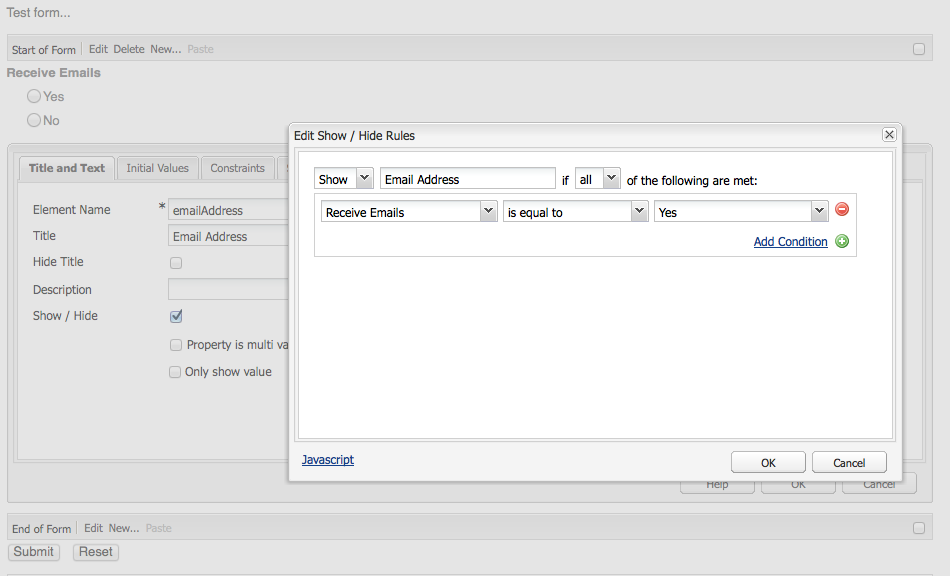

# 양식 개발(클래식 UI){#developing-forms-classic-ui}

양식의 기본 구조는 다음과 같습니다.

* 양식 시작
* 양식 요소
* 양식 끝

이러한 모든 구성 요소는 표준 AEM 설치에서 사용할 수 있는 일련의 기본 [양식 구성 요소](/help/sites-authoring/default-components.md#form)로 구현됩니다.

양식에 사용할 [새 구성 요소](/help/sites-developing/developing-components-samples.md)를 개발하는 것 외에도 다음을 수행할 수 있습니다.

* [값을 사용하여 양식 미리 로드](#preloading-form-values)
* [값이 여러 개인 필드 미리 로드(특정)](#preloading-form-fields-with-multiple-values)
* [새로운 동작 개발](#developing-your-own-form-actions)
* [새로운 제약 조건 개발](#developing-your-own-form-constraints)
* [특정 양식 필드 표시 또는 숨기기](#showing-and-hiding-form-components)

[필요한 ](#developing-scripts-for-use-with-forms) 경우 스크립트를 사용하여 기능을 확장할 수 있습니다.

>[!NOTE]
>
>이 문서는 클래식 UI에서 [기본 구성 요소](/help/sites-authoring/default-components-foundation.md)를 사용하여 양식을 개발하는 데 중점을 둡니다. 터치가 활성화된 UI에서 양식 개발을 위해 새 [핵심 구성 요소](https://docs.adobe.com/content/help/ko-KR/experience-manager-core-components/using/introduction.html) 및 [조건 숨기기](/help/sites-developing/hide-conditions.md)를 활용하는 것이 좋습니다.

## 양식 값 미리 로드 중 {#preloading-form-values}

양식 시작 구성 요소는 저장소의 노드를 가리키는 선택적 경로인 **로드 경로**&#x200B;에 대한 필드를 제공합니다.

로드 경로는 사전 정의된 값을 양식의 여러 필드에 로드하는 데 사용되는 노드 속성의 경로입니다.

저장소의 노드에 대한 경로를 지정하는 선택적 필드입니다. 이 노드의 속성이 필드 이름과 일치하면 양식의 해당 필드에 이러한 속성의 값이 미리 로드됩니다. 일치하는 속성이 없으면 필드에 기본값이 포함됩니다.

>[!NOTE]
>
>[양식 작업](#developing-your-own-form-actions)도 초기 값을 로드할 리소스를 설정할 수 있습니다. 이 작업은 `init.jsp` 내부의 `FormsHelper#setFormLoadResource`을 사용하여 수행됩니다.
>
>이 값이 설정되지 않은 경우에만 작성자가 시작 양식 구성 요소의 경로 설정에서 양식을 채웁니다.

### 값이 여러 개인 양식 필드 미리 로드 중 {#preloading-form-fields-with-multiple-values}

또한 다양한 양식 필드에는 **항목 로드 경로**&#x200B;도 있으며, 다시 저장소의 노드를 가리키는 선택적 경로가 있습니다.

**항목 로드 경로**&#x200B;는 사전 정의된 값을 양식의 특정 필드에 로드하는 데 사용되는 노드 속성의 경로입니다(예: [드롭다운 목록](/help/sites-authoring/default-components-foundation.md#dropdown-list), [확인란 그룹](/help/sites-authoring/default-components-foundation.md#checkbox-group) 또는 [라디오 그룹](/help/sites-authoring/default-components-foundation.md#radio-group)).

#### 예 - 여러 값이 {#example-preloading-a-dropdown-list-with-multiple-values}인 드롭다운 목록 미리 로드

선택 가능한 값 범위를 사용하여 드롭다운 목록을 구성할 수 있습니다.

**항목 로드 경로**&#x200B;를 사용하여 저장소의 폴더의 목록에 액세스하여 다음 필드에 미리 로드할 수 있습니다.

1. 새 sling 폴더 만들기( `sling:Folder`)
예를 들어 `/etc/designs/<myDesign>/formlistvalues`

1. 드롭다운 항목 목록을 포함할 다중 값 문자열( `String[]`) 유형의 새 속성(예: `myList`)을 추가합니다. 셸 스크립트의 JSP 스크립트 또는 cURL과 같은 스크립트를 사용하여 컨텐츠를 가져올 수도 있습니다.

1. **항목 로드 경로** 필드에 전체 경로를 사용합니다.
예를 들어 `/etc/designs/geometrixx/formlistvalues/myList`

`String[]`의 값이 다음과 같은 형식의 경우

* `AL=Alabama`
* `AK=Alaska`
* *etc.*

그러면 AEM에서 다음과 같이 목록을 생성합니다.

* `<option value="AL">Alabama</option>`
* `<option value="AK">Alaska</option>`

예를 들어 이 기능을 다중 언어 설정에서 쉽게 사용할 수 있습니다.

### 양식 작업 개발 {#developing-your-own-form-actions}

양식에는 작업이 필요합니다. 작업은 사용자 데이터와 함께 양식이 전송될 때 실행되는 작업을 정의합니다.

표준 AEM 설치 시 다양한 작업이 제공되므로 아래에서 확인할 수 있습니다.

`/libs/foundation/components/form/actions`

및 **양식** 구성 요소의 **작업 유형** 목록에서 다음을 수행합니다.

이 섹션에서는 이 목록에 포함할 양식 작업을 개발할 수 있는 방법을 설명합니다.

다음과 같이 `/apps` 아래에 자신의 동작을 추가할 수 있습니다.

1. `sling:Folder` 유형의 노드를 만듭니다. 구현할 작업을 반영하는 이름을 지정합니다.

   예:

   `/apps/myProject/components/customFormAction`

1. 이 노드에서 다음 속성을 정의한 다음 **모두 저장**&#x200B;을 클릭하여 변경 내용을 유지합니다.

   * `sling:resourceType` - 다음으로 설정  `foundation/components/form/action`

   * `componentGroup` - 다음으로 정의  `.hidden`

   * 원할 경우:

      * `jcr:title` - 원하는 제목을 지정합니다. 드롭다운 선택 목록에 표시됩니다. 설정하지 않으면 노드 이름이 표시됩니다.

      * `jcr:description` - 원하는 설명을 입력합니다.

1. 폴더에서 대화 상자 노드를 만듭니다.

   1. 작업을 선택한 후 작성자가 양식 대화 상자를 편집할 수 있도록 필드를 추가합니다.

1. 폴더에서 다음 중 하나를 만듭니다.

   1. 게시물 스크립트.
스크립트 이름은 `post.POST.<extension>`입니다(예:`post.POST.jsp`
양식 처리를 위해 양식이 전송될 때 게시물 스크립트가 호출되며, 이 스크립트는 양식에서 도착하는 데이터를 처리하는 코드를 포함합니다 
`POST`.

   1. 양식이 전송될 때 호출할 전달 스크립트를 추가합니다.
스크립트 이름은 `forward.<extension`>입니다(예:`forward.jsp`
이 스크립트는 경로를 정의할 수 있습니다. 그러면 현재 요청이 지정된 경로로 전달됩니다.
   필요한 호출은 `FormsHelper#setForwardPath`(변형 2개)입니다. 일반적인 경우는 일부 유효성 검사 또는 논리를 수행하여 대상 경로를 찾은 다음 해당 경로로 이동하여 기본 Sling POST 서블릿이 JCR의 실제 스토리지를 수행하도록 하는 것입니다.

   실제 처리를 수행하는 다른 서블릿도 있을 수 있습니다. 예를 들어 양식 작업과 `forward.jsp`은 &quot;접착제&quot; 코드로만 작용합니다. 이 방법의 예는 `/libs/foundation/components/form/actions/mail`에 있는 메일 동작입니다. 이 작업은 메일 서블릿이 있는 `<currentpath>.mail.html`으로 세부 정보를 전달합니다.

   So:

   * `post.POST.jsp`은 작업 자체에 의해 완전히 수행되는 작은 작업에 유용합니다.
   * 반면에 `forward.jsp`은 위임만 필요한 경우에 유용합니다.

   스크립트에 대한 실행 순서는 다음과 같습니다.

   * 양식 렌더링 시( `GET`):

      1. `init.jsp`
      1. 모든 필드의 제한 사항에 대해:`clientvalidation.jsp`
      1. form&#39;s validationRT:`clientvalidation.jsp`
      1. 설정된 경우 로드 리소스를 통해 양식이 로드됩니다.
      1. `addfields.jsp` 내부 렌더링  `<form></form>`
   * 양식 `POST`을(를) 처리할 때:

      1. `init.jsp`
      1. 모든 필드의 제한 사항에 대해:`servervalidation.jsp`
      1. form&#39;s validationRT:`servervalidation.jsp`
      1. `forward.jsp`
      1. 전방 경로( `FormsHelper.setForwardPath`)가 설정된 경우 요청을 전달한 다음 `cleanup.jsp`

      1. 전방 경로를 설정하지 않은 경우 `post.POST.jsp`(여기에 끝남, `cleanup.jsp`이 호출되지 않음)을 호출합니다.

1. 폴더에 다시 선택적으로 추가:

   1. 필드를 추가하는 스크립트입니다.
스크립트 이름은 `addfields.<extension>`입니다(예:`addfields.jsp`
양식 시작 HTML이 작성되는 즉시 추가 필드 스크립트가 호출됩니다. 이를 통해 액션에서 사용자 정의 입력 필드 또는 기타 HTML을 양식 내에 추가할 수 있습니다.

   1. 초기화 스크립트.
스크립트 이름은 `init.<extension>`입니다(예:`init.jsp`
이 스크립트는 양식이 렌더링될 때 호출됩니다. 작업 세부 사항을 초기화하는 데 사용할 수 있습니다.&quot;

   1. 정리 스크립트입니다.
스크립트 이름은 `cleanup.<extension>`입니다(예:`cleanup.jsp`
이 스크립트는 정리를 수행하는 데 사용할 수 있습니다.

1. parsys에서 **Forms** 구성 요소를 사용합니다. 이제 **작업 유형** 드롭다운에 새 작업이 포함됩니다.

   >[!NOTE]
   >
   >제품에 포함된 기본 작업을 보려면:
   >
   >
   >`/libs/foundation/components/form/actions`

### 고유한 양식 제약 조건 개발 {#developing-your-own-form-constraints}

제한 사항은 두 수준에서 지정할 수 있습니다.

* [개별 필드의 경우(다음 절차 참조)](#constraints-for-individual-fields)
* [form-global 유효성 검사](#form-global-constraints)

#### 개별 필드에 대한 제약 조건 {#constraints-for-individual-fields}

다음과 같이 개별 필드(`/apps` 아래)에 대한 고유한 제한 사항을 추가할 수 있습니다.

1. `sling:Folder` 유형의 노드를 만듭니다. 구현할 제한을 반영하는 이름을 지정합니다.

   예:

   `/apps/myProject/components/customFormConstraint`

1. 이 노드에서 다음 속성을 정의한 다음 **모두 저장**&#x200B;을 클릭하여 변경 내용을 유지합니다.

   * `sling:resourceType` - 설정  `foundation/components/form/constraint`

   * `constraintMessage` - 양식을 제출할 때 제한 사항에 따라 필드가 유효하지 않을 경우 표시되는 사용자 지정된 메시지

   * 원할 경우:

      * `jcr:title` - 원하는 제목을 지정합니다. 선택 목록에 표시됩니다. 설정하지 않으면 노드 이름이 표시됩니다.
      * `hint` - 사용자를 위한 추가 정보, 필드 사용 방법

1. 이 폴더 내에서 다음 스크립트가 필요할 수 있습니다.

   * 클라이언트 유효성 검사 스크립트:
스크립트 이름은 `clientvalidation.<extension>`입니다(예:`clientvalidation.jsp`
양식 필드를 렌더링할 때 호출됩니다. 클라이언트 JavaScript를 만들어 클라이언트의 필드를 검증할 수 있습니다.

   * 서버 유효성 검사 스크립트:
스크립트 이름은 `servervalidation.<extension>`입니다(예:`servervalidation.jsp`
양식을 제출하면 호출됩니다. 이 필드를 제출한 후 서버의 필드를 확인하는 데 사용할 수 있습니다.

>[!NOTE]
>
>다음은 샘플 제한 사항입니다.
>
>`/libs/foundation/components/form/constraints`

#### 양식-글로벌 제약 조건 {#form-global-constraints}

양식 전역 유효성 검사는 시작 양식 구성 요소( `validationRT`)에 리소스 유형을 구성하여 지정합니다. 예:

`apps/myProject/components/form/validation`

그런 다음 다음을 정의할 수 있습니다.

* `clientvalidation.jsp` - 필드의 클라이언트 유효성 검사 스크립트 뒤에 삽입됨
* 및 `servervalidation.jsp` - 개별 필드 서버 유효성 검사 후에 호출됩니다. `POST`

### 양식 구성 요소 표시 및 숨기기 {#showing-and-hiding-form-components}

양식의 다른 필드 값에 따라 양식 구성 요소를 표시하거나 숨기도록 양식을 구성할 수 있습니다.

양식 필드의 표시 여부를 변경하는 방법은 해당 필드가 특정한 조건에서만 필요한 경우에 유용합니다. 예를 들어 사용자 의견 양식에서 고객에게 이메일로 제품 정보를 받아 볼지를 물어본 후, 고객이 &#39;예&#39;를 선택하면 이메일 주소를 입력하는 텍스트 필드를 표시할 수 있습니다.

**표시/숨기기 규칙 편집** 대화 상자를 사용하여 양식 구성 요소가 표시되거나 숨겨지는 조건을 지정합니다.

대화 상자 위쪽의 필드를 사용하여 다음 정보를 지정합니다.

* 지정하는 조건이 구성 요소를 숨길 조건인지 아니면 표시할 조건인지
* 구성 요소를 표시하거나 숨기려면 조건이 하나라도 true이면 되는지 아니면 모든 조건이 true여야 하는지

이러한 필드 아래에 하나 이상의 조건이 표시됩니다. 조건에서는 같은 양식에 있는 다른 양식 구성 요소의 값을 특정 값과 비교합니다. 필드의 특정 값이 조건을 만족하면 해당 조건이 true로 평가됩니다. 조건에는 다음 정보가 포함됩니다.

* 테스트 대상 양식 필드의 제목
* 연산자
* 필드 값과 비교할 값

예를 들어 제목이 `Receive email notifications?`**인 라디오 그룹 구성 요소에는 `Yes` 및 `No` 라디오 단추가 포함되어 있습니다. `Email Address`의 제목을 가진 텍스트 필드 구성 요소는 `Yes`을 선택한 경우 표시되도록 다음 조건을 사용합니다.

Javascript에서는 조건이 요소 이름 속성의 값을 사용하여 필드를 참조합니다. 이전 예에서 라디오 그룹 구성 요소의 요소 이름 속성은 `contact`입니다. 다음 코드는 해당 예제와 동일한 Javascript 코드입니다.

`((contact == "Yes"))`

**양식 구성 요소를 표시하거나 숨기려면:**

1. 특정 양식 구성 요소를 편집합니다.

1. **표시 / 숨기기**&#x200B;를 선택하여 **표시/숨기기 규칙 편집** 대화 상자를 엽니다.

   * 첫 번째 드롭다운 목록에서 **표시** 또는 **숨기기**&#x200B;를 선택하여 조건이 구성 요소를 표시할지 아니면 숨길지를 지정합니다.

   * 맨 위 줄 끝의 드롭다운 목록에서 다음을 선택합니다.

      * **모두**  - 구성 요소를 표시하거나 숨기려면 모든 조건이 true여야 하는 경우
      * **임의**  - 구성 요소를 표시하거나 숨기려면 하나 이상의 조건이 true여야 하는 경우
   * 조건 라인(기본값으로 표시된 항목)에서 구성 요소, 연산자를 선택한 다음 값을 지정합니다.
   * **조건 추가**&#x200B;를 클릭하여 필요한 경우 조건을 더 추가합니다.

   예:

   

1. **확인**&#x200B;을 클릭하여 정의를 저장합니다.

1. 정의를 저장한 후 양식 구성 요소 속성의 **표시 / 숨기기** 옵션 옆에 **규칙 편집** 링크가 나타납니다. 이 링크를 클릭하여 **표시/숨기기 규칙 편집** 대화 상자를 열어 변경합니다.

   모든 변경 내용을 저장하려면 **확인**&#x200B;을 클릭합니다.

   

   >[!CAUTION]
   >
   >표시/숨기기 정의 효과를 보고 테스트할 수 있습니다.
   >
   >
   >
   >    * 작성 환경의 **미리 보기** 모드에서(미리 보기로 전환하기 위해 처음 전환할 때 페이지 다시 로드 필요)
      >
      >    
   * 게시 환경에서

#### 끊어진 구성 요소 참조 처리 {#handling-broken-component-references}

표시/숨기기 조건에서는 요소 이름 속성의 값을 사용하여 양식의 다른 구성 요소를 참조합니다. 삭제되었거나 요소 이름 속성이 변경된 구성 요소를 참조하는 조건이 하나라도 있으면 표시/숨기기 구성이 무효화됩니다. 이러한 경우 조건을 직접 업데이트해야 하며, 그러지 않으면 양식이 로드될 때 오류가 발생합니다.

표시/숨기기 구성이 잘못된 경우 구성이 JavaScript 코드로만 제공됩니다. 코드를 편집하여 문제를 수정하십시오. 코드는 원래 구성 요소를 참조하는 데 사용되었던 요소 이름 속성을 사용합니다.

### Forms {#developing-scripts-for-use-with-forms}에서 사용할 스크립트 개발

스크립트를 작성할 때 사용할 수 있는 API 요소에 대한 자세한 내용은 양식](https://helpx.adobe.com/experience-manager/6-5/sites/developing/using/reference-materials/javadoc/com/day/cq/wcm/foundation/forms/package-summary.html)과 관련된 [javadocs를 참조하십시오.

양식을 제출하기 전에 서비스를 호출하고 실패한 경우 서비스를 취소하는 등의 작업에 이 옵션을 사용할 수 있습니다.

* 유효성 검사 리소스 유형 정의
* 유효성 검사용 스크립트 포함:

   * JSP에서 웹 서비스를 호출하고 오류 메시지가 포함된 `com.day.cq.wcm.foundation.forms.ValidationInfo` 객체를 만듭니다. 오류가 발생하면 양식 데이터가 게시되지 않습니다.
