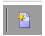
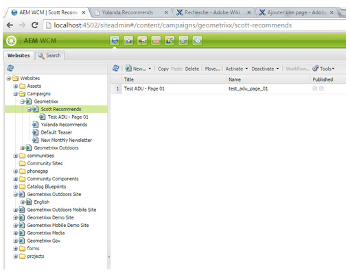

# 사용자 지정 확장 프로그램 만들기{#creating-custom-extensions}

일반적으로 프로젝트를 구현할 때에는 AEM과 Adobe Campaign 모두에 사용자 지정 코드가 있습니다. 기존 API를 사용하면 AEM 또는 AEM에서 Adobe Campaign으로 Adobe Campaign에서 사용자 지정 코드를 호출할 수 있습니다. 이 문서에서는 이 작업을 수행하는 방법을 설명합니다.

## 사전 요구 사항 {#prerequisites}

다음을 설치해야 합니다.

* Adobe Experience Manager
* Adobe Campaign 6.1

자세한 내용은 [AEM과 Adobe Campaign 6.1 통합](/help/sites-administering/campaignonpremise.md) 추가 정보.

## 예제 1: AEM에서 Adobe Campaign으로 {#example-aem-to-adobe-campaign}

AEM과 Campaign 간의 표준 통합은 JSON과 JSSP(JavaScript Server 페이지)를 기반으로 합니다. 이러한 JSSP 파일은 캠페인 콘솔에서 찾을 수 있으며 모두 다음으로 시작합니다 **amc** (Adobe Marketing Cloud).


>[!NOTE]
>
>[이 예는 Geometrixx을 참조하십시오](/help/sites-developing/we-retail.md): 패키지 공유에서 사용할 수 있습니다.

이 예제에서는 새로운 사용자 지정 JSSP 파일을 만들고 AEM 측에서 이 파일을 호출하여 결과를 검색합니다. 예를 들어 Adobe Campaign에서 데이터를 검색하거나 데이터를 Adobe Campaign에 저장하는 데 사용할 수 있습니다.

1. Adobe Campaign에서 새 JSSP 파일을 만들려면 **새로 만들기** 아이콘.

   

1. 이 JSSP 파일의 이름을 입력합니다. 이 예제에서는 **cus:custom.jssp** (즉, **cus** namespace)만 로드하는 것입니다.

   

1. jssp 파일 내에 다음 코드를 넣습니다.

   ```
   <%
   var origin = request.getParameter("origin");
   document.write("Hello from Adobe Campaign, origin : " + origin);
   %>
   ```

1. 작업 내용을 저장합니다. 나머지 작업은 AEM에 있습니다.
1. 이 JSSP를 호출하기 위해 AEM 측에 단순 서블릿을 만듭니다. 이 예에서는 다음을 가정합니다.

   * AEM과 Campaign 간에 연결이 작동합니다
   * 캠페인 클라우드 서비스가 **/content/geometrixx-outdoors**

   이 예에서 가장 중요한 개체는 **일반 캠페인 커넥터**: Adobe Campaign 측에서 jssp 파일을 호출(get 및 post)할 수 있도록 해줍니다.

   다음은 작은 코드 조각입니다.

   ```
   @Reference
   private GenericCampaignConnector campaignConnector;
   ...
   Map<String, String> params = new HashMap<String, String>();
   params.put("origin", "AEM");
   CallResults results = campaignConnector.callGeneric("/jssp/cus/custom.jssp", params, credentials);
   return results.bodyAsString();
   ```

1. 이 예제에서 알 수 있듯이 호출로 자격 증명을 전달해야 합니다. Campaign 클라우드 서비스가 구성된 페이지에서 전달하는 getCredentials() 메서드를 통해 이 코드를 가져올 수 있습니다.

   ```xml
   // page containing the cloudservice for Adobe Campaign
   Configuration config = campaignConnector.getWebserviceConfig(page.getContentResource().getParent());
   CampaignCredentials credentials = campaignConnector.retrieveCredentials(config);
   ```

전체 코드는 다음과 같습니다.

```java
import java.io.IOException;
import java.io.PrintWriter;
import java.util.HashMap;
import java.util.Map;

import javax.servlet.ServletException;

import org.apache.felix.scr.annotations.Reference;
import org.apache.felix.scr.annotations.sling.SlingServlet;
import org.apache.sling.api.SlingHttpServletRequest;
import org.apache.sling.api.SlingHttpServletResponse;
import org.apache.sling.api.servlets.SlingSafeMethodsServlet;
import org.slf4j.Logger;
import org.slf4j.LoggerFactory;

import com.day.cq.mcm.campaign.CallResults;
import com.day.cq.mcm.campaign.CampaignCredentials;
import com.day.cq.mcm.campaign.GenericCampaignConnector;
import com.day.cq.wcm.api.Page;
import com.day.cq.wcm.api.PageManager;
import com.day.cq.wcm.api.PageManagerFactory;
import com.day.cq.wcm.webservicesupport.Configuration;

@SlingServlet(paths="/bin/campaign", methods="GET")
public class CustomServlet extends SlingSafeMethodsServlet {

 private final Logger log = LoggerFactory.getLogger(this.getClass());

 @Reference
 private GenericCampaignConnector campaignConnector;

 @Reference
 private PageManagerFactory pageManagerFactory;

 @Override
 protected void doGet(SlingHttpServletRequest request,
   SlingHttpServletResponse response) throws ServletException,
   IOException {

  PageManager pm = pageManagerFactory.getPageManager(request.getResourceResolver());

  Page page = pm.getPage("/content/geometrixx-outdoors");

  String result = null;
  if ( page != null) {
   result = callCustomFunction(page);
  }
  if ( result != null ) {
   PrintWriter pw = response.getWriter();
   pw.print(result);
  }
 }

 private String callCustomFunction(Page page ) {
  try {
   Configuration config = campaignConnector.getWebserviceConfig(page.getContentResource().getParent());
   CampaignCredentials credentials = campaignConnector.retrieveCredentials(config);

   Map<String, String> params = new HashMap<String, String>();
   params.put("origin", "AEM");
   CallResults results = campaignConnector.callGeneric("/jssp/cus/custom.jssp", params, credentials);
   return results.bodyAsString();
  } catch (Exception e ) {
   log.error("Something went wrong during the connection", e);
  }
  return null;

 }

}
```

## 예제 2: Adobe Campaign에서 AEM으로 {#example-adobe-campaign-to-aem}

AEM은 siteadmin explorer 보기에서 임의의 위치에서 사용할 수 있는 개체를 검색하기 위한 기본 API를 제공합니다.



>[!NOTE]
>
>[이 예는 Geometrixx을 참조하십시오](/help/sites-developing/we-retail.md): 패키지 공유에서 사용할 수 있습니다.

탐색기의 각 노드에 대해 연결된 API가 있습니다. 예를 들어 노드의 경우:

* [http://localhost:4502/siteadmin#/content/campaigns/geometrixx/scott-recommends](http://localhost:4502/siteadmin#/content/campaigns/geometrixx/scott-recommends)

API는 다음과 같습니다.

* [http://localhost:4502/content/campaigns/geometrixx/scott-recommends.1.json](http://localhost:4502/content/campaigns/geometrixx/scott-recommends.2.json)

URL의 끝 **.1.json** 교체 가능 **.2.json**, **.3.json**&#x200B;를 검색하는 하위 수준의 수에 따라, To get all of the keyword를 가져옵니다. **무한대** 사용할 수 있는 항목:

* [http://localhost:4502/content/campaigns/geometrixx/scott-recommends.infinity.json](http://localhost:4502/content/campaigns/geometrixx/scott-recommends.2.json)

이제 API를 사용하려면 기본적으로 AEM이 기본 인증을 사용한다는 것을 알고 있어야 합니다.

이름이 인 JS 라이브러리 **amcIntegration.js** 는 여러 다른 논리 중 해당 논리를 구현하는 6.1.1(build 8624 이상)에서 사용할 수 있습니다.

### AEM API 호출 {#aem-api-call}

```java
loadLibrary("nms:amcIntegration.js");

var cmsAccountId = sqlGetInt("select iExtAccountId from NmsExtAccount where sName=$(sz)","aemInstance")
var cmsAccount = nms.extAccount.load(String(cmsAccountId));
var cmsServer = cmsAccount.server;

var request = new HttpClientRequest(cmsServer+"/content/campaigns/geometrixx.infinity.json")
aemAddBasicAuthentication(cmsAccount, request);
request.method = "GET"
request.header["Content-Type"] = "application/json; charset=UTF-8";
request.execute();
var response = request.response;
```
