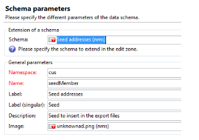

# 사용자 지정 양식 매핑 만들기{#creating-custom-form-mappings}

Adobe Campaign에서 사용자 지정 테이블을 만들 때 해당 사용자 지정 테이블에 매핑되는 양식을 AEM에서 작성할 수 있습니다.

이 문서에서는 사용자 지정 양식 매핑을 만드는 방법을 설명합니다. 이 문서의 단계를 완료하면 사용자에게 예정된 이벤트에 등록할 수 있는 이벤트 페이지를 제공합니다. 그런 다음 Adobe Campaign을 통해 이러한 사용자를 따릅니다.

## 사전 요구 사항 {#prerequisites}

다음을 설치해야 합니다.

* Adobe Experience Manager
* Adobe Campaign Classic

자세한 내용은 [AEM과 Adobe Campaign Classic 통합](/help/sites-administering/campaignonpremise.md) 추가 정보.

## 사용자 지정 양식 매핑 만들기 {#creating-custom-form-mappings-2}

사용자 지정 양식 매핑을 만들려면 다음 섹션에 자세히 설명된 이러한 고급 단계를 따라야 합니다.

1. 사용자 지정 테이블을 만듭니다.
1. 확장 **시드** 테이블.
1. 사용자 지정 매핑을 만듭니다.
1. 사용자 지정 매핑을 기반으로 게재를 만듭니다.
1. AEM에서 양식을 작성합니다. 그러면 생성된 게재를 사용합니다.
1. 양식을 제출하여 테스트하십시오.

### Adobe Campaign에서 사용자 지정 테이블 만들기 {#creating-the-custom-table-in-adobe-campaign}

먼저 Adobe Campaign에서 사용자 지정 테이블을 만듭니다. 이 예제에서는 다음 정의를 사용하여 이벤트 테이블을 만듭니다.

```xml
<element autopk="true" label="Event" labelSingular="Event" name="event">
 <attribute label="Event Date" name="eventdate" type="date"/>
 <attribute label="Event Name" name="eventname" type="string"/>
 <attribute label="Email" name="email" type="string"/>
 <attribute label="Number of Seats" name="seats" type="long"/>
</element>
```

이벤트 테이블을 만든 후 **데이터베이스 구조 업데이트 마법사** 테이블을 만들려면

### 시드 테이블 확장 {#extending-the-seed-table}

Adobe Campaign에서 탭/클릭합니다 **추가** 의 새 확장을 만들려면 **시드 주소(nms)** 테이블.



이제 **이벤트** 확장할 테이블 **시드** 표:

```xml
<element label="Event" name="custom_cus_event">
 <attribute name="eventname" template="cus:event:event/@eventname"/>
 <attribute name="eventdate" template="cus:event:event/@eventdate"/>
 <attribute name="email" template="cus:event:event/@email"/>
 <attribute name="seats" template="cus:event:event/@seats"/>
 </element>
```

그런 다음 를 실행합니다. **데이터베이스 업데이트 마법사** 변경 사항을 적용하려면

### 사용자 지정 대상 매핑 만들기 {#creating-custom-target-mapping}

in **관리/캠페인 관리** t, 이동 **Target 매핑** 새 T **대상 매핑 .**

>[!NOTE]
>
>에 의미 있는 이름을 사용해야 합니다 **내부 이름**.


### 사용자 지정 게재 템플릿 만들기 {#creating-a-custom-delivery-template}

이 단계에서는 생성된 을 사용하는 게재 템플릿을 추가합니다 **대상 매핑**.

in **리소스/템플릿**&#x200B;게재 템플릿으로 이동하고 기존 AEM 배달을 복제합니다. 를 클릭하면 **종료**, 이벤트 만들기 선택 **대상 매핑**.


### AEM에서 양식 작성 {#building-the-form-in-aem}

AEM에서에서 Cloud Service을 구성했는지 확인합니다. **페이지 속성**.

그런 다음 **Adobe Campaign** 탭에서 에서 만든 게재를 선택합니다 [사용자 지정 게재 템플릿 만들기](#creating-a-custom-delivery-template).


필드를 구성할 때는 양식 필드에 고유한 요소 이름을 지정해야 합니다.

필드가 구성된 후에는 수동으로 매핑을 변경해야 합니다.

CRXDE-lite에서 **jcr:content** (페이지의) 노드 및 **acMapping** 값의 내부 이름을 나타내는 값입니다. **대상 매핑**.


양식 구성에서 존재하지 않을 경우 만들기 확인란을 선택해야 합니다


### 양식 제출 {#submitting-the-form}

이제 양식을 제출하고 Adobe Campaign 측에서 값이 저장되었는지 확인할 수 있습니다.


## 문제 해결 {#troubleshooting}

**&quot;요소 &#39;@eventdate&#39;의 값 &#39;02/02/2015&#39;에 대한 유형이 잘못되었습니다. &#39;Event(&#39; 유형의 문서[adb:event])&#39;)&quot;**

양식을 제출할 때 이 오류는 **error.log** AEM에서 확인하십시오.

날짜 필드의 형식이 잘못되었기 때문입니다. 해결 방법은 다음을 제공하는 것입니다 **yyyy-mm-dd** 를 값으로 채우는 방법을 설명합니다.
