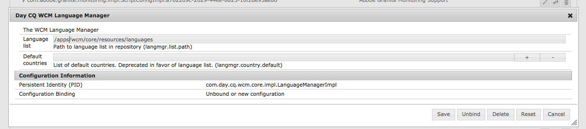

# 다중 사이트 관리자 확장{#extending-the-multi-site-manager}

이 페이지는 다중 사이트 관리자의 기능을 확장하는 데 도움이 됩니다.

* MSM Java API의 주요 구성원에 대해 알아봅니다.
* 롤아웃 구성에 사용할 수 있는 새 동기화 작업을 만듭니다.
* 기본 언어 및 국가 코드를 수정합니다.

<!-- * Remove the "Chapters" step in the Create Site wizard. -->

>[!NOTE]
>
>이 페이지는 [컨텐츠 재사용과 함께 읽어야 합니다.다중 사이트 관리자](/help/sites-administering/msm.md).
>
>AEM 6.4의 사이트 저장소 재구조화의 다음 섹션에도 관심이 있을 수 있습니다.
>* [다중 사이트 관리자 블루프린트 구성](https://docs.adobe.com/content/help/en/experience-manager-64/deploying/restructuring/sites-repository-restructuring-in-aem-6-4.html#multi-site-manager-blueprint-configurations)
>* [다중 사이트 관리자 롤아웃 구성](https://docs.adobe.com/content/help/en/experience-manager-64/deploying/restructuring/sites-repository-restructuring-in-aem-6-4.html#multi-site-manager-rollout-configurations)


>[!CAUTION]
>
>다중 사이트 관리자 및 해당 API는 웹 사이트를 작성할 때 사용되므로 작성 환경에서만 사용할 수 있습니다.

## Java API {#overview-of-the-java-api} 개요

다중 사이트 관리는 다음 패키지로 구성됩니다.

* [com.day.cq.wcm.msm.api](https://helpx.adobe.com/experience-manager/6-5/sites/developing/using/reference-materials/javadoc/com/day/cq/wcm/msm/api/package-frame.html)
* [com.day.cq.wcm.msm.commons](https://helpx.adobe.com/experience-manager/6-5/sites/developing/using/reference-materials/javadoc/com/day/cq/wcm/msm/commons/package-frame.html)

기본 MSM API 개체는 다음과 같이 상호 작용합니다([사용된 용어](/help/sites-administering/msm.md#terms-used) 참조).


* **`Blueprint`**

   `Blueprint`(예: [블루프린트 구성](/help/sites-administering/msm.md#source-blueprints-and-blueprint-configurations))은 Live Copy가 컨텐츠를 상속할 수 있는 페이지를 지정합니다.

   

   * 블루프린트 구성( `Blueprint`)의 사용은 선택 사항이지만, 다음과 같습니다.

      * 작성자가 소스(명시적으로)에서 이 소스에서 상속되는 Live Copy에 대한 수정 내용을 푸시할 때 **롤아웃** 옵션을 사용할 수 있습니다.
      * 작성자가 **사이트 만들기**;를 사용할 수 있습니다.따라서 사용자는 손쉽게 언어를 선택하고 live copy의 구조를 구성할 수 있습니다.
      * 결과 Live Copy에 대한 기본 롤아웃 구성을 정의합니다.

* **`LiveRelationship`** Live Copy 분기의 리소스와 해당 소스/블루프린트 리소스 간의 연결(관계)을  `LiveRelationship` 지정합니다.

   * 관계는 상속과 롤아웃을 구현할 때 사용됩니다.
   * `LiveRelationship` 개체는 롤아웃 구성(),  `RolloutConfig`및 관계와 관련된  `LiveCopy`개체에 대한 액세스(참조) `LiveStatus` 를 제공합니다.

   * 예를 들어 Live Copy는 `/content/we-retail/language-masters`의 소스/블루프린트에서 `/content/copy/us`에 만들어집니다. `/content/we.retail/language-masters/en/jcr:content` 및 `/content/copy/us/en/jcr:content` 리소스는 관계를 형성합니다.

* **`LiveCopy`** `LiveCopy` live copy 리소스와 소스/블루프린트 리소스 간의 관계(  `LiveRelationship`)에 대한 구성 세부 사항을 포함합니다.

   * `LiveCopy` 클래스를 사용하여 페이지의 경로, 소스/블루프린트 페이지의 경로, 롤아웃 구성 및 하위 페이지가 `LiveCopy`에도 포함되는지 여부에 액세스합니다.

   * `LiveCopy` 노드는 **사이트 만들기** 또는 **Live Copy 만들기**&#x200B;를 사용할 때마다 생성됩니다.

* **`LiveStatus`**

   `LiveStatus` 개체는 런타임 상태에 대한 액세스를 제공합니다 `LiveRelationship`. Live Copy의 동기화 상태를 쿼리하는 데 사용합니다.

* **`LiveAction`**

   `LiveAction`은 롤아웃에 관련된 각 리소스에서 실행되는 작업입니다.

   * LiveActions는 RolloutConfigs에서만 생성됩니다.

* **`LiveActionFactory`**

   `LiveAction` 구성이 지정된 `LiveAction` 개체를 만듭니다. 구성은 저장소에 리소스로 저장됩니다.

* **`RolloutConfig`** 트리거할 때 사용할 목록 `RolloutConfig` 이  `LiveActions`들어 있습니다. `LiveCopy`은 `RolloutConfig`을 상속하고 결과는 `LiveRelationship`에 있습니다.

   * Live Copy를 처음으로 설정하면 RolloutConfig(LiveActions를 트리거함)도 사용됩니다.

## 새 동기화 작업 만들기 {#creating-a-new-synchronization-action}

롤아웃 구성에 사용할 사용자 정의 동기화 작업을 만듭니다. [설치된 작업](/help/sites-administering/msm-sync.md#installed-synchronization-actions)이 사용자의 특정 응용 프로그램 요구 사항을 충족하지 않을 때 동기화 작업을 만듭니다. 이렇게 하려면 두 개의 클래스를 만듭니다.

* 작업을 수행하는 [ `com.day.cq.wcm.msm.api.LiveAction`](https://helpx.adobe.com/experience-manager/6-5/sites/developing/using/reference-materials/javadoc/com/day/cq/wcm/msm/api/LiveAction.html) 인터페이스의 구현입니다.
* [ `com.day.cq.wcm.msm.api.LiveActionFactory`](https://helpx.adobe.com/experience-manager/6-5/sites/developing/using/reference-materials/javadoc/com/day/cq/wcm/msm/api/LiveActionFactory.html) 인터페이스를 구현하고 `LiveAction` 클래스의 인스턴스를 만드는 OSGI 구성 요소입니다.

`LiveActionFactory`은 지정된 구성에 대한 `LiveAction` 클래스의 인스턴스를 만듭니다.

* `LiveAction` 클래스에는 다음 메서드가 포함되어 있습니다.

   * `getName`:작업 이름을 반환합니다. 롤아웃 구성에서 작업을 참조하는 데 사용되는 이름입니다.
   * `execute`:작업의 작업을 수행합니다.

* `LiveActionFactory` 클래스에는 다음 멤버가 포함됩니다.

   * `LIVE_ACTION_NAME`:연결된 이름을 포함하는 필드입니다 `LiveAction`. 이 이름은 `LiveAction` 클래스의 `getName` 메서드에서 반환하는 값과 일치해야 합니다.

   * `createAction`:의 인스턴스를 만듭니다 `LiveAction`. 선택적 `Resource` 매개 변수를 사용하여 구성 정보를 제공할 수 있습니다.

   * `createsAction`:연결된 이름을 반환합니다 `LiveAction`.

### LiveAction 구성 노드 {#accessing-the-liveaction-configuration-node} 액세스

저장소의 `LiveAction` 구성 노드를 사용하여 `LiveAction` 인스턴스의 런타임 동작에 영향을 주는 정보를 저장합니다. `LiveAction` 구성을 저장하는 저장소의 노드는 런타임 시 `LiveActionFactory` 개체에서 사용할 수 있습니다. 따라서 구성 노드에 속성을 추가하여 필요에 따라 `LiveActionFactory` 구현에서 사용할 수 있습니다.

예를 들어 `LiveAction`은 블루프린트 작성자의 이름을 저장해야 합니다. 구성 노드의 속성에는 정보를 저장하는 블루프린트 페이지의 속성 이름이 포함됩니다. 런타임 시 `LiveAction`은 구성에서 속성 이름을 검색한 다음 속성 값을 가져옵니다.

` [LiveActionFactory](https://helpx.adobe.com/experience-manager/6-5/sites/developing/using/reference-materials/javadoc/com/day/cq/wcm/msm/api/LiveActionFactory.html).createAction` 메서드의 매개 변수는 `Resource` 개체입니다. 이 `Resource` 개체는 롤아웃 구성의 이 라이브 작업에 대한 `cq:LiveSyncAction` 노드를 나타냅니다.[롤아웃 구성 만들기](/help/sites-administering/msm-sync.md#creating-a-rollout-configuration)를 참조하십시오. 구성 노드를 사용할 때와 같이 `ValueMap` 개체에 적용해야 합니다.

```java
public LiveAction createAction(Resource resource) throws WCMException {
        ValueMap config;
        if (resource == null || resource.adaptTo(ValueMap.class) == null) {
            config = new ValueMapDecorator(Collections.<String, Object>emptyMap());
        } else {
            config = resource.adaptTo(ValueMap.class);
        }
        return new MyLiveAction(config, this);
}
```

### Target 노드, 소스 노드 및 LiveRelationship {#accessing-target-nodes-source-nodes-and-the-liverelationship} 액세스

다음 개체는 `LiveAction` 개체의 `execute` 메서드의 매개 변수로 제공됩니다.

* Live Copy의 소스를 나타내는 [ `Resource`](https://helpx.adobe.com/experience-manager/6-5/sites/developing/using/reference-materials/javadoc/org/apache/sling/api/resource/Resource.html) 개체
* Live Copy의 대상을 나타내는 `Resource` 개체입니다.
* Live Copy에 대한 [ `LiveRelationship`](https://helpx.adobe.com/experience-manager/6-5/sites/developing/using/reference-materials/javadoc/com/day/cq/wcm/msm/api/LiveRelationship.html) 개체
* `autoSave` 값은 `LiveAction`이 저장소에 수행된 변경 사항을 저장할지 여부를 나타냅니다.

* 재설정 값은 롤아웃 재설정 모드를 나타냅니다.

이러한 객체에서 `LiveCopy`에 대한 모든 정보를 얻을 수 있습니다. `Resource` 개체를 사용하여 `ResourceResolver`, `Session` 및 `Node` 개체를 가져올 수도 있습니다. 이러한 개체는 저장소 컨텐츠를 조작하는 데 유용합니다.

다음 코드의 첫 번째 줄에서 소스는 소스 페이지의 `Resource` 개체입니다.

```java
ResourceResolver resolver = source.getResourceResolver();
Session session = resolver.adaptTo(javax.jcr.Session.class);
Node sourcenode = source.adaptTo(javax.jcr.Node.class);
```

>[!NOTE]
>
>`Resource` 인수는 [ `NonExistingResource` ](https://helpx.adobe.com/experience-manager/6-5/sites/developing/using/reference-materials/javadoc/org/apache/sling/api/resource/NonExistingResource.html) 개체와 같은 `Node` 개체에 적용되지 않는 `null` 또는 `Resources` 개체일 수 있습니다.

## 새 롤아웃 구성 만들기 {#creating-a-new-rollout-configuration}

설치된 롤아웃 구성이 응용 프로그램 요구 사항을 충족하지 않을 때 롤아웃 구성을 만듭니다.

* [롤아웃 구성을 생성](#create-the-rollout-configuration)합니다.
* [롤아웃 구성에 동기화 작업을 추가](#add-synchronization-actions-to-the-rollout-configuration)합니다.

그러면 블루프린트 또는 Live Copy 페이지에서 롤아웃 구성을 설정할 때 새 롤아웃 구성을 사용할 수 있습니다.

>[!NOTE]
>
>롤아웃을 사용자 지정하기 위한 [우수 사례를 참조하십시오](/help/sites-administering/msm-best-practices.md#customizing-rollouts).

### 롤아웃 구성 {#create-the-rollout-configuration} 만들기

새 롤아웃 구성을 만들려면:

1. 개방형 CRXDE Lite;예를 들면 다음과 같습니다.
   [http://localhost:4502/crx/de](http://localhost:4502/crx/de)

1. 다음으로 이동 :
   `/apps/msm/<your-project>/rolloutconfigs`

   >[!NOTE]
   >프로젝트의 사용자 지정 버전:
   >`/libs/msm/wcm/rolloutconfigs`
   >첫 번째 구성일 경우 만들어야 합니다.

   >[!NOTE]
   >
   >/libs 경로에서 아무 것도 변경하면 안 됩니다.
   >이는 다음에 인스턴스를 업그레이드할 때 /libs의 내용이 덮어쓰기되기 때문입니다(핫픽스 또는 기능 팩을 적용할 때 덮어쓸 수 있음).
   >구성 및 기타 변경에 대해 권장되는 방법은 다음과 같습니다.
   >* /apps 아래의 필요한 항목(즉, /libs에 있는 항목)을 다시 만듭니다.
   >* /apps 내에서 변경


1. 이 **다음 속성을 갖는 노드를 만듭니다.**

   * **이름**:롤아웃 구성의 노드 이름입니다. md#installed-synchronization-actions)(예: `contentCopy` 또는 `workflow`).
   * **유형**: `cq:RolloutConfig`

1. 이 노드에 다음 속성을 추가합니다.
   * **이름**: `jcr:title`

      **유형**: `String`
      **값**:UI에 표시되는 식별 제목입니다.
   * **이름**: `jcr:description`

      **유형**: `String`
      **값**:선택적 설명입니다.
   * **이름**: `cq:trigger`

      **유형**: `String`
      **값**:사용할  [롤아웃 ](/help/sites-administering/msm-sync.md#rollout-triggers) 트리거입니다. 다음 중에서 선택합니다.
      * `rollout`
      * `modification`
      * `publish`
      * `deactivate`

1. **모두 저장**&#x200B;을 클릭합니다.

### 롤아웃 구성에 동기화 작업 추가 {#add-synchronization-actions-to-the-rollout-configuration}

롤아웃 구성은 `/apps/msm/<your-project>/rolloutconfigs` 노드에서 만든 [롤아웃 구성 노드](#create-the-rollout-configuration) 아래에 저장됩니다.

롤아웃 구성에 동기화 작업을 추가하려면 `cq:LiveSyncAction` 유형의 하위 노드를 추가합니다. 동기화 작업 노드의 순서는 작업이 발생하는 순서를 결정합니다.

1. 여전히 CRXDE Lite에서 [롤아웃 구성](#create-the-rollout-configuration) 노드를 선택합니다.

   예:
   `/apps/msm/myproject/rolloutconfigs/myrolloutconfig`

1. **다음 노드** 속성을 사용하여 노드를 만듭니다.

   * **이름**:동기화 작업의 노드 이름입니다.
이름은 [동기화 작업](/help/sites-administering/msm-sync.md#installed-synchronization-actions) 아래의 테이블에 있는 **작업 이름**&#x200B;과 같아야 합니다(예: `contentCopy` 또는 `workflow`).
   * **유형**: `cq:LiveSyncAction`

1. 필요한 만큼 동기화 작업 노드를 추가하고 구성합니다. 작업 노드를 다시 배열하여 해당 순서가 수행하려는 순서와 일치하게 합니다. 맨 위에 있는 작업 노드가 먼저 발생합니다.

## 단순 LiveActionFactory 클래스 만들기 및 사용 {#creating-and-using-a-simple-liveactionfactory-class}

이 섹션의 절차에 따라 `LiveActionFactory`을(를) 개발하고 롤아웃 구성에 사용하십시오. 절차는 Maven 및 Eclipse를 사용하여 `LiveActionFactory`을(를) 개발하고 배포합니다.

1. [전문적인 프로젝트](#create-the-maven-project) 를 만들어 Eclipse로 가져옵니다.
1. [POM ](#add-dependencies-to-the-pom-file) 파일에 종속 항목을 추가합니다.
1. [인터페이스를  `LiveActionFactory` ](#implement-liveactionfactory) 구현하고 OSGi 번들을 배포합니다.
1. [롤아웃 구성을 생성](#create-the-example-rollout-configuration)합니다.
1. [Live Copy를 만듭니다](#create-the-live-copy).

Java 클래스의 Maven 프로젝트 및 소스 코드는 공개 Git 리포지토리에서 사용할 수 있습니다.

GITHUB에 대한 코드

GitHub에서 이 페이지의 코드를 찾을 수 있습니다

* [GitHub에서 Experiencemanager-java-msmrollout 프로젝트 열기](https://github.com/Adobe-Marketing-Cloud/experiencemanager-java-msmrollout)
* 프로젝트를 ZIP 파일[으로 다운로드합니다.](https://github.com/Adobe-Marketing-Cloud/experiencemanager-java-msmrollout/archive/master.zip)

### 마스터 프로젝트 만들기 {#create-the-maven-project}

다음 절차를 수행하려면 Maven 설정 파일에 adobe-public 프로필을 추가해야 합니다.

* adobe-public 프로필에 대한 자세한 내용은 [콘텐츠 패키지 Maven 플러그인 얻기](/help/sites-developing/vlt-mavenplugin.md#obtaining-the-content-package-maven-plugin)를 참조하십시오.
* Maven 설정 파일에 대한 자세한 내용은 Maven [설정 참조](https://maven.apache.org/settings.html)를 참조하십시오.

1. 터미널 또는 명령줄 세션을 열고 디렉토리를 변경하여 프로젝트를 만들 위치를 가리킵니다.
1. 다음 명령을 입력합니다.

   ```xml
   mvn archetype:generate -DarchetypeGroupId=com.day.jcr.vault -DarchetypeArtifactId=multimodule-content-package-archetype -DarchetypeVersion=1.0.0 -DarchetypeRepository=adobe-public-releases
   ```

1. 대화형 프롬프트에서 다음 값을 지정합니다.

   * `groupId`: `com.adobe.example.msm`
   * `artifactId`:  `MyLiveActionFactory`
   * `version`:  `1.0-SNAPSHOT`
   * `package`:  `MyPackage`
   * `appsFolderName`:  `myapp`
   * `artifactName`:  `MyLiveActionFactory package`
   * `packageGroup`:  `myPackages`

1. Eclipse를 시작하고 [Maven 프로젝트](/help/sites-developing/howto-projects-eclipse.md#import-the-maven-project-into-eclipse)를 가져옵니다.

### POM 파일에 종속성 추가 {#add-dependencies-to-the-pom-file}

Eclipse 컴파일러가 `LiveActionFactory` 코드에서 사용되는 클래스를 참조할 수 있도록 종속성을 추가합니다.

1. Eclipse 프로젝트 탐색기에서 파일을 엽니다.

   `MyLiveActionFactory/pom.xml`

1. 편집기에서 `pom.xml` 탭을 클릭하고 `project/dependencyManagement/dependencies` 섹션을 찾습니다.
1. `dependencyManagement` 요소 내에 다음 XML을 추가한 다음 파일을 저장합니다.

   ```xml
    <dependency>
     <groupId>com.day.cq.wcm</groupId>
     <artifactId>cq-msm-api</artifactId>
     <version>5.6.2</version>
     <scope>provided</scope>
    </dependency>
    <dependency>
     <groupId>org.apache.sling</groupId>
     <artifactId>org.apache.sling.api</artifactId>
     <version>2.4.3-R1488084</version>
     <scope>provided</scope>
    </dependency>
    <dependency>
     <groupId>com.day.cq.wcm</groupId>
     <artifactId>cq-wcm-api</artifactId>
     <version>5.6.6</version>
     <scope>provided</scope>
    </dependency>
    <dependency>
     <groupId>org.apache.sling</groupId>
     <artifactId>org.apache.sling.commons.json</artifactId>
     <version>2.0.6</version>
     <scope>provided</scope>
    </dependency>
    <dependency>
     <groupId>com.day.cq</groupId>
     <artifactId>cq-commons</artifactId>
     <version>5.6.4</version>
     <scope>provided</scope>
    </dependency>
    <dependency>
     <groupId>org.apache.sling</groupId>
     <artifactId>org.apache.sling.jcr.jcr-wrapper</artifactId>
     <version>2.0.0</version>
     <scope>provided</scope>
    </dependency>
    <dependency>
     <groupId>com.day.cq</groupId>
     <artifactId>cq-commons</artifactId>
     <version>5.6.4</version>
     <scope>provided</scope>
    </dependency>
   ```

1. `MyLiveActionFactory-bundle/pom.xml`에서 **Project Explorer**&#x200B;의 번들의 POM 파일을 엽니다.
1. 편집기에서 `pom.xml` 탭을 클릭하고 프로젝트/종속성 섹션을 찾습니다. 종속성 요소 내에 다음 XML을 추가한 다음 파일을 저장합니다.

   ```xml
    <dependency>
     <groupId>com.day.cq.wcm</groupId>
     <artifactId>cq-msm-api</artifactId>
    </dependency>
    <dependency>
     <groupId>org.apache.sling</groupId>
     <artifactId>org.apache.sling.api</artifactId>
    </dependency>
    <dependency>
     <groupId>com.day.cq.wcm</groupId>
     <artifactId>cq-wcm-api</artifactId>
    </dependency>
    <dependency>
     <groupId>org.apache.sling</groupId>
     <artifactId>org.apache.sling.commons.json</artifactId>
    </dependency>
    <dependency>
     <groupId>com.day.cq</groupId>
     <artifactId>cq-commons</artifactId>
    </dependency>
    <dependency>
     <groupId>org.apache.sling</groupId>
     <artifactId>org.apache.sling.jcr.jcr-wrapper</artifactId>
    </dependency>
    <dependency>
     <groupId>com.day.cq</groupId>
     <artifactId>cq-commons</artifactId>
    </dependency>
   ```

### LiveActionFactory 구현 {#implement-liveactionfactory}

다음 `LiveActionFactory` 클래스는 소스 및 대상 페이지에 대한 메시지를 기록하는 `LiveAction`을 구현하고 소스 노드에서 대상 노드로 `cq:lastModifiedBy` 속성을 복사합니다. 라이브 작업의 이름은 `exampleLiveAction`입니다.

1. Eclipse 프로젝트 탐색기에서 `MyLiveActionFactory-bundle/src/main/java/com.adobe.example.msm` 패키지를 마우스 오른쪽 단추로 클릭하고 **새로 만들기** > **클래스**&#x200B;를 클릭합니다. **이름**&#x200B;에 `ExampleLiveActionFactory`를 입력한 다음 **마침**&#x200B;을 클릭합니다.
1. `ExampleLiveActionFactory.java` 파일을 열고 다음 코드로 컨텐트를 바꾼 다음 파일을 저장합니다.

   ```java
   package com.adobe.example.msm;
   
   import java.util.Collections;
   
   import org.apache.felix.scr.annotations.Component;
   import org.apache.felix.scr.annotations.Property;
   import org.apache.felix.scr.annotations.Service;
   import org.apache.sling.api.resource.Resource;
   import org.apache.sling.api.resource.ResourceResolver;
   import org.apache.sling.api.resource.ValueMap;
   import org.apache.sling.api.wrappers.ValueMapDecorator;
   import org.apache.sling.commons.json.io.JSONWriter;
   import org.apache.sling.commons.json.JSONException;
   
   import org.slf4j.Logger;
   import org.slf4j.LoggerFactory;
   
   import javax.jcr.Node;
   import javax.jcr.RepositoryException;
   import javax.jcr.Session;
   
   import com.day.cq.wcm.msm.api.ActionConfig;
   import com.day.cq.wcm.msm.api.LiveAction;
   import com.day.cq.wcm.msm.api.LiveActionFactory;
   import com.day.cq.wcm.msm.api.LiveRelationship;
   import com.day.cq.wcm.api.WCMException;
   
   @Component(metatype = false)
   @Service
   public class ExampleLiveActionFactory implements LiveActionFactory<LiveAction> {
    @Property(value="exampleLiveAction")
    static final String actionname = LiveActionFactory.LIVE_ACTION_NAME;
   
    public LiveAction createAction(Resource config) {
     ValueMap configs;
     /* Adapt the config resource to a ValueMap */
           if (config == null || config.adaptTo(ValueMap.class) == null) {
               configs = new ValueMapDecorator(Collections.<String, Object>emptyMap());
           } else {
               configs = config.adaptTo(ValueMap.class);
           }
   
     return new ExampleLiveAction(actionname, configs);
    }
    public String createsAction() {
     return actionname;
    }
    /************* LiveAction ****************/
    private static class ExampleLiveAction implements LiveAction {
     private String name;
     private ValueMap configs;
     private static final Logger log = LoggerFactory.getLogger(ExampleLiveAction.class);
   
     public ExampleLiveAction(String nm, ValueMap config){
      name = nm;
      configs = config;
     }
   
     public void execute(Resource source, Resource target,
       LiveRelationship liverel, boolean autoSave, boolean isResetRollout)
         throws WCMException {
   
      String lastMod = null;
   
      log.info(" *** Executing ExampleLiveAction *** ");
   
      /* Determine if the LiveAction is configured to copy the cq:lastModifiedBy property */
      if ((Boolean) configs.get("repLastModBy")){
   
       /* get the source's cq:lastModifiedBy property */
       if (source != null && source.adaptTo(Node.class) !=  null){
        ValueMap sourcevm = source.adaptTo(ValueMap.class);
        lastMod = sourcevm.get(com.day.cq.wcm.msm.api.MSMNameConstants.PN_PAGE_LAST_MOD_BY, String.class);
       }
   
       /* set the target node's la-lastModifiedBy property */
       Session session = null;
       if (target != null && target.adaptTo(Node.class) !=  null){
        ResourceResolver resolver = target.getResourceResolver();
        session = resolver.adaptTo(javax.jcr.Session.class);
        Node targetNode;
        try{
         targetNode=target.adaptTo(javax.jcr.Node.class);
         targetNode.setProperty("la-lastModifiedBy", lastMod);
         log.info(" *** Target node lastModifiedBy property updated: {} ***",lastMod);
        }catch(Exception e){
         log.error(e.getMessage());
        }
       }
       if(autoSave){
        try {
         session.save();
        } catch (Exception e) {
         try {
          session.refresh(true);
         } catch (RepositoryException e1) {
          e1.printStackTrace();
         }
         e.printStackTrace();
        }
       }
      }
     }
     public String getName() {
      return name;
     }
   
     /************* Deprecated *************/
     @Deprecated
     public void execute(ResourceResolver arg0, LiveRelationship arg1,
       ActionConfig arg2, boolean arg3) throws WCMException {
     }
     @Deprecated
     public void execute(ResourceResolver arg0, LiveRelationship arg1,
       ActionConfig arg2, boolean arg3, boolean arg4)
         throws WCMException {
     }
     @Deprecated
     public String getParameterName() {
      return null;
     }
     @Deprecated
     public String[] getPropertiesNames() {
      return null;
     }
     @Deprecated
     public int getRank() {
      return 0;
     }
     @Deprecated
     public String getTitle() {
      return null;
     }
     @Deprecated
     public void write(JSONWriter arg0) throws JSONException {
     }
    }
   }
   ```

1. 터미널 또는 명령 세션을 사용하여 디렉토리를 `MyLiveActionFactory` 디렉토리(Maven 프로젝트 디렉토리)로 변경합니다. 그런 다음 다음 다음 명령을 입력합니다.

   ```shell
   mvn -PautoInstallPackage clean install
   ```

   AEM `error.log` 파일은 번들이 시작되었음을 나타내야 합니다.

   예: [https://localhost:4502/system/console/status-slinglogs](https://localhost:4502/system/console/status-slinglogs).

   ```xml
   13.08.2013 14:34:55.450 *INFO* [OsgiInstallerImpl] com.adobe.example.msm.MyLiveActionFactory-bundle BundleEvent RESOLVED
   13.08.2013 14:34:55.451 *INFO* [OsgiInstallerImpl] com.adobe.example.msm.MyLiveActionFactory-bundle BundleEvent STARTING
   13.08.2013 14:34:55.451 *INFO* [OsgiInstallerImpl] com.adobe.example.msm.MyLiveActionFactory-bundle BundleEvent STARTED
   13.08.2013 14:34:55.453 *INFO* [OsgiInstallerImpl] com.adobe.example.msm.MyLiveActionFactory-bundle Service [com.adobe.example.msm.ExampleLiveActionFactory,2188] ServiceEvent REGISTERED
   13.08.2013 14:34:55.454 *INFO* [OsgiInstallerImpl] org.apache.sling.audit.osgi.installer Started bundle com.adobe.example.msm.MyLiveActionFactory-bundle [316]
   ```

### 예제 롤아웃 구성 {#create-the-example-rollout-configuration} 만들기

사용자가 만든 `LiveActionFactory`을 사용하는 MSM 롤아웃 구성을 만듭니다.

1. 표준 프로시저](/help/sites-administering/msm-sync.md#creating-a-rollout-configuration)로 [롤아웃 구성을 만들고 구성하고 다음 속성을 사용합니다.

   * **제목**:롤아웃 구성 예
   * **이름**:expleroloutconfig
   * **cq:trigger**:  `publish`

### 예제 롤아웃 구성 {#add-the-live-action-to-the-example-rollout-configuration}에 라이브 작업 추가

이전 프로시저에서 만든 롤아웃 구성을 구성하여 `ExampleLiveActionFactory` 클래스를 사용합니다.

1. 개방형 CRXDE Lite;예: [https://localhost:4502/crx/de](https://localhost:4502/crx/de).
1. `/apps/msm/rolloutconfigs/examplerolloutconfig/jcr:content` 아래에 다음 노드를 만듭니다.

   * **이름**: `exampleLiveAction`
   * **유형**: `cq:LiveSyncAction`

1. **모두 저장**&#x200B;을 클릭합니다.
1. `exampleLiveAction` 노드를 선택하고 다음 속성을 추가합니다.

   * **이름**: `repLastModBy`
   * **유형**: `Boolean`
   * **값**:  `true`

   이 속성은 `ExampleLiveAction` 클래스에 `cq:LastModifiedBy` 속성이 소스에서 대상 노드로 복제되어야 함을 나타냅니다.

1. **모두 저장**&#x200B;을 클릭합니다.

### Live Copy {#create-the-live-copy} 만들기

[롤아웃 구성을 사용하여 We.Retail ](/help/sites-administering/msm-livecopy.md#creating-a-live-copy-of-a-page) 참조 사이트의 영어/제품 분기의 라이브 카피를 생성합니다.

* **출처**:  `/content/we-retail/language-masters/en/products`

* **롤아웃 구성**:롤아웃 구성 예

소스 분기의 **제품**(영어) 페이지를 활성화하고 `LiveAction` 클래스가 생성하는 로그 메시지를 확인합니다.

```xml
16.08.2013 10:53:33.055 *INFO* [Thread-444535] com.adobe.example.msm.ExampleLiveActionFactory$ExampleLiveAction  ***ExampleLiveAction has been executed.***
16.08.2013 10:53:33.055 *INFO* [Thread-444535] com.adobe.example.msm.ExampleLiveActionFactory$ExampleLiveAction  ***Target node lastModifiedBy property updated: admin ***
```

<!--
## Removing the Chapters Step in the Create Site Wizard {#removing-the-chapters-step-in-the-create-site-wizard}

In some cases, the **Chapters** selection is not required in the create site wizard (only the **Languages** selection is required). To remove this step in the default We.Retail English blueprint:

1. In CRX Explorer, remove the node:
   `/etc/blueprints/weretail-english/jcr:content/dialog/items/tabs/items/tab_chap`.

1. Navigate to `/libs/wcm/msm/templates/blueprint/defaults/livecopy_tab/items` and create a new node:

    1. **Name** = `chapters`; **Type** = `cq:Widget`.

1. Add following properties to the new node:

    1. **Name** = `name`; **Type** = `String`; **Value** = `msm:chapterPages`

    1. **Name** = `value`; **Type** = `String`; **Value** = `all`

    1. **Name** = `xtype`; **Type** = `String`; **Value** = `hidden`
-->

## 언어 이름 및 기본 국가 {#changing-language-names-and-default-countries} 변경

AEM에서는 기본 언어 및 국가 코드를 사용합니다.

* 기본 언어 코드는 ISO-639-1에서 정의한 소문자, 두 문자 코드입니다.
* 기본 국가 코드는 ISO 3166에서 정의한 소문자 또는 대문자, 두 문자 코드입니다.

MSM은 언어 및 국가 코드의 저장된 목록을 사용하여 페이지의 언어 버전 이름과 연결된 국가 이름을 결정합니다. 필요한 경우 목록의 다음 측면을 변경할 수 있습니다.

* 언어 제목
* 국가 이름
* 언어 기본 국가(예: `en`, `de`, 기타 코드의 경우)

언어 목록은 `/libs/wcm/core/resources/languages` 노드 아래에 저장됩니다. 각 하위 노드는 언어 또는 언어 국가를 나타냅니다.

* 노드의 이름은 언어 코드(예: `en` 또는 `de`) 또는 language_country 코드(예: `en_us` 또는 `de_ch`)입니다.

* 노드의 `language` 속성은 코드의 전체 언어 이름을 저장합니다.
* 노드의 `country` 속성은 코드의 국가 전체 이름을 저장합니다.
* 노드 이름이 언어 코드(예: `en`)로만 구성되면 country 속성은 `*`이고 추가 `defaultCountry` 속성은 사용할 국가를 나타내는 언어 국가 코드를 저장합니다.


언어를 수정하려면:

1. 웹 브라우저에서 CRXDE Lite 열기예: [https://localhost:4502/crx/de](https://localhost:4502/crx/de)
1. `/apps` 폴더를 선택하고 **만들기**&#x200B;를 클릭한 다음 **폴더 만들기를 클릭합니다.**

   새 폴더 이름을 `wcm`으로 지정합니다.

1. 이전 단계를 반복하여 `/apps/wcm/core` 폴더 트리를 만듭니다. `resources`이라는 `core`에 `sling:Folder` 유형의 노드를 만듭니다. <!--  -->

1. `/libs/wcm/core/resources/languages` 노드를 마우스 오른쪽 단추로 클릭하고 **복사**&#x200B;를 클릭합니다.
1. `/apps/wcm/core/resources` 폴더를 마우스 오른쪽 단추로 클릭하고 **붙여넣기**&#x200B;를 클릭합니다. 필요에 따라 하위 노드를 수정합니다.
1. **모두 저장**&#x200B;을 클릭합니다.
1. **도구**, **작업**&#x200B;을 클릭한 다음 **웹 콘솔**&#x200B;을 클릭합니다. 이 콘솔에서 **OSGi**&#x200B;을 클릭한 다음 **구성**&#x200B;을 클릭합니다.
1. **일 CQ WCM 언어 관리자**&#x200B;를 찾아 클릭하고 **언어 목록**&#x200B;의 값을 `/apps/wcm/core/resources/languages`로 변경한 다음 **저장**&#x200B;을 클릭합니다.

   

## 페이지 속성에서 MSM 잠금 구성(터치 지원 UI) {#configuring-msm-locks-on-page-properties-touch-enabled-ui}

사용자 지정 페이지 속성을 만들 때 새 속성이 Live Copy로 롤아웃할 수 있는지 여부를 고려해야 할 수 있습니다.

예를 들어 두 개의 새 페이지 속성이 추가되고 있는 경우:

* 연락처 이메일:

   * 이 속성은 각 국가(또는 브랜드 등)마다 다르므로 롤아웃할 필요가 없습니다.

* 주요 시각적 스타일:

   * 프로젝트 요구 사항은 이 속성이 모든 국가(또는 브랜드 등)에 공통으로 제공되므로 롤아웃되어야 합니다.

그런 다음 다음을 확인해야 합니다.

* 연락처 이메일:

   * 롤아웃된 속성에서 제외됩니다.동기화[에서 속성 및 노드 유형 제외를 참조하십시오.](/help/sites-administering/msm-sync.md#excluding-properties-and-node-types-from-synchronization)

* 주요 시각적 스타일:

   * 상속이 취소되지 않는 한 터치가 활성화된 UI에서 이 속성을 편집할 수 없도록 하고 상속을 복원할 수도 있습니다.이는 연결 상태를 나타내는 전환 체인/끊어진 체인 링크를 클릭하여 제어합니다.

페이지 속성이 롤아웃될 항목인지, 따라서 편집 시 상속을 취소/복원할 수 있는지 여부는 대화 상자 속성에 의해 제어됩니다.

* `cq-msm-lockable`

   * 터치 지원 UI 대화 상자의 항목에 적용 가능
   * 대화 상자에서 체인 링크 기호를 만듭니다.
   * 상속이 취소되는 경우(체인 링크가 끊어진 경우에만 편집 가능)
   * 리소스의 첫 번째 하위 수준에만 적용됩니다.
   * **유형**: `String`

   * **값**:고려 중인 속성의 이름을 보유하며, 속성 값과 비교할 수  `name`있습니다.for example, see
      `/libs/foundation/components/page/cq:dialog/content/items/tabs/items/basic/items/column/items/title/items/title`

`cq-msm-lockable`이(가) 정의되면 체인을 끊거나 닫으면 다음과 같이 MSM과 상호 작용합니다.

* `cq-msm-lockable`의 값이 다음과 같은 경우:

   * **상대** (예:  `myProperty` 또는  `./myProperty`)

      * `cq:propertyInheritanceCancelled`에서 속성을 추가하고 제거합니다.
   * **절대** (예: `/image`)

      * 체인을 끊으면 `cq:LiveSyncCancelled` 믹싱을 `./image`에 추가하고 `cq:isCancelledForChildren`를 `true`에 설정하여 상속이 취소됩니다.

      * 체인을 닫으면 상속이 취소됩니다.


>[!NOTE]
>
>`cq-msm-lockable` 편집할 리소스의 첫 번째 하위 수준에 적용되며 값이 절대이나 상대적 값으로 정의되었는지에 관계없이 더 높은 수준 상위 항목에서 작동하지 않습니다.

>[!NOTE]
>
>상속을 다시 활성화하면 Live Copy 페이지 속성이 소스 속성과 자동으로 동기화되지 않습니다. 필요한 경우 동기화를 수동으로 요청할 수 있습니다.
