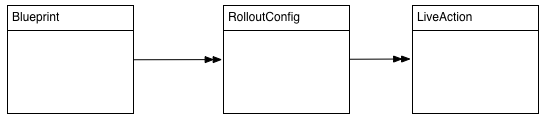
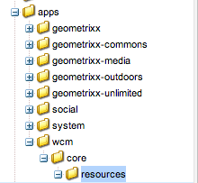

# 다중 사이트 관리자 확장{#extending-the-multi-site-manager}

이 페이지에서는 다중 사이트 관리자의 기능을 확장할 수 있습니다.

* MSM Java API 파섹
* 롤아웃 구성에 사용할 수 있는 새 동기화 작업을 만듭니다.
* 사이트 만들기 마법사에서 &quot;장&quot; 단계를 제거합니다.
* 기본 언어 및 국가 코드를 수정합니다.

>[!NOTE]
>
>이 페이지는 컨텐츠 재사용과 함께 읽어야 [합니다.다중 사이트 관리자를 참조하십시오](/help/sites-administering/msm.md).

>[!CAUTION]
>
>다중 사이트 관리자 및 해당 API는 웹 사이트를 작성할 때 사용되므로 작성 환경에서만 사용할 수 있습니다.

## Java API 개요 {#overview-of-the-java-api}

다중 사이트 관리는 다음 패키지로 구성됩니다.

* [com.day.cq.wcm.msm.api](https://helpx.adobe.com/experience-manager/6-5/sites/developing/using/reference-materials/javadoc/com/day/cq/wcm/msm/api/package-frame.html)
* [com.day.cq.wcm.msm.commons](https://helpx.adobe.com/experience-manager/6-5/sites/developing/using/reference-materials/javadoc/com/day/cq/wcm/msm/commons/package-frame.html)

기본 MSM API 개체는 다음과 같이 상호 작용합니다(사용되는 [용어 참조](/help/sites-administering/msm.md#terms-used)).


* **`Blueprint`**

   Live Copy `Blueprint` 가 컨텐츠를 상속할 수 있는 페이지를 [블루프린트 구성에서와](/help/sites-administering/msm.md#source-blueprints-and-blueprint-configurations)같이 지정합니다.

   

   * 블루프린트 구성( `Blueprint`)의 사용은 선택 사항이지만,

      * 작성자가 소스의 **롤아웃** 옵션을 사용하여(명시적으로) 이 소스에서 상속되는 Live Copy에 대한 수정 내용을 푸시할 수 있습니다.
      * 작성자가 사이트 만들기를 사용할 **수 있도록**&#x200B;허용사용자는 언어를 쉽게 선택하고 Live Copy 구조를 구성할 수 있습니다.
      * 결과 Live Copy에 대한 기본 롤아웃 구성을 정의합니다.

* **`LiveRelationship`** Live Copy 분기의 리소스와 해당 소스/블루프린트 리소스 간의 연결(관계)을 `LiveRelationship` 지정합니다.

   * 관계는 상속과 롤아웃을 구현할 때 사용됩니다.
   * `LiveRelationship` 개체는 롤아웃 구성(), `RolloutConfig``LiveCopy`및 관계와 관련된 `LiveStatus` 개체에 대한 액세스(참조)를 제공합니다.

   * 예를 들어 Live Copy는 의 소스/ `/content/copy/us` 블루프린트에서 만듭니다 `/content/we-retail/language-masters`. 리소스와 관계를 `/content/we.retail/language-masters/en/jcr:content` `/content/copy/us/en/jcr:content` 형성합니다.

* **`LiveCopy`** Live Copy `LiveCopy` 리소스와 소스/블루프린트 리소스 간의 관계( `LiveRelationship`)에 대한 구성 세부 정보를 보유합니다.

   * 이 `LiveCopy` 클래스를 사용하여 페이지의 경로, 소스/블루프린트 페이지의 경로, 롤아웃 구성 및 하위 페이지가 포함되는지 여부를 확인할 수 `LiveCopy`있습니다.

   * Create Site 또는 Live `LiveCopy` Copy **만들기가 사용될 때마다** 노드가 **** 만들어집니다.

* **`LiveStatus`**

   `LiveStatus` 개체는 런타임 상태에 대한 액세스를 제공합니다 `LiveRelationship`. Live Copy의 동기화 상태를 쿼리하는 데 사용합니다.

* **`LiveAction`**

   A `LiveAction` 는 롤아웃에 관련된 각 리소스에서 실행되는 작업입니다.

   * LiveActions는 RolloutConfigs에서만 생성됩니다.

* **`LiveActionFactory`**

   구성이 지정된 `LiveAction` 개체를 `LiveAction` 만듭니다. 구성은 저장소에 리소스로 저장됩니다.

* **`RolloutConfig`** 트리거할 때 사용할 수 `RolloutConfig` 있는 목록이 `LiveActions`들어 있습니다. The `LiveCopy` inherits `RolloutConfig` and the result is present in the `LiveRelationship`.

   * Live Copy를 처음으로 설정하면 LiveActions를 트리거하는 RolloutConfig도 사용됩니다.

### 새 동기화 작업 만들기 {#creating-a-new-synchronization-action}

롤아웃 구성에 사용할 사용자 정의 동기화 작업을 만듭니다. [설치된 작업이](/help/sites-administering/msm-sync.md#installed-synchronization-actions) 특정 응용 프로그램 요구 사항을 충족하지 않을 때 동기화 작업을 만듭니다. 이렇게 하려면 두 개의 클래스를 만듭니다.

* 작업을 수행하는 [ 인터페이스 `com.day.cq.wcm.msm.api.LiveAction`](https://helpx.adobe.com/experience-manager/6-5/sites/developing/using/reference-materials/javadoc/com/day/cq/wcm/msm/api/LiveAction.html) 구현입니다.
* 인터페이스를 구현하고 [ `com.day.cq.wcm.msm.api.LiveActionFactory`](https://helpx.adobe.com/experience-manager/6-5/sites/developing/using/reference-materials/javadoc/com/day/cq/wcm/msm/api/LiveActionFactory.html) `LiveAction` 클래스의 인스턴스를 만드는 OSGI 구성 요소입니다.

The `LiveActionFactory` creates instances of the `LiveAction` class for a given configuration:

* `LiveAction` 클래스에는 다음 메서드가 포함되어 있습니다.

   * `getName`:작업 이름을 반환합니다. 롤아웃 구성에서 작업을 참조하는 데 사용되는 이름입니다.
   * `execute`:작업의 작업을 수행합니다.

* `LiveActionFactory` 클래스에는 다음 멤버가 포함됩니다.

   * `LIVE_ACTION_NAME`:연결된 필드의 이름이 들어 있는 `LiveAction`필드입니다. 이 이름은 `getName` 클래스의 `LiveAction` 메서드에서 반환되는 값과 일치해야 합니다.

   * `createAction`:의 인스턴스를 `LiveAction`만듭니다. 선택 `Resource` 매개 변수를 사용하여 구성 정보를 제공할 수 있습니다.

   * `createsAction`:연관된 `LiveAction`이름을 반환합니다.

### LiveAction 구성 노드 액세스 {#accessing-the-liveaction-configuration-node}

저장소의 `LiveAction` 구성 노드를 사용하여 인스턴스의 런타임 동작에 영향을 주는 정보를 저장합니다 `LiveAction` . 구성을 저장하는 저장소의 노드는 런타임 시 `LiveAction` `LiveActionFactory` 객체에서 사용할 수 있습니다. 따라서 구성 노드에 속성을 추가하여 필요에 따라 `LiveActionFactory` 구현에서 사용할 수 있습니다.

예를 들어 블루프린트 작성자의 이름을 저장해야 `LiveAction` 합니다. 구성 노드의 속성에는 정보를 저장하는 블루프린트 페이지의 속성 이름이 포함됩니다. 런타임 시 구성 요소에서는 `LiveAction` 속성 이름을 검색한 다음 속성 값을 가져옵니다.

메서드의 매개 변수는 ` [LiveActionFactory](https://helpx.adobe.com/experience-manager/6-5/sites/developing/using/reference-materials/javadoc/com/day/cq/wcm/msm/api/LiveActionFactory.html).createAction` 개체입니다 `Resource` . 이 `Resource` `cq:LiveSyncAction` 개체는 롤아웃 구성의 이 라이브 작업에 대한 노드를 나타냅니다.롤아웃 [구성 만들기를 참조하십시오](/help/sites-administering/msm-sync.md#creating-a-rollout-configuration). 구성 노드를 사용할 때와 같이, `ValueMap` 개체에 맞게 수정해야 합니다.

```java
public LiveAction createAction(Resource resource) throws WCMException {
        ValueMap config;
        if (resource == null || resource.adaptTo(ValueMap.class) == null) {
            config = new ValueMapDecorator(Collections.<String, Object>emptyMap());
        } else {
            config = resource.adaptTo(ValueMap.class);
        }
        return new MyLiveAction(config, this);
}
```

### 대상 노드, 소스 노드 및 LiveRelationship 액세스 {#accessing-target-nodes-source-nodes-and-the-liverelationship}

다음 개체는 `execute` 객체의 `LiveAction` 메서드 매개 변수로 제공됩니다.

* Live Copy의 소스를 나타내는 [ `Resource`](https://helpx.adobe.com/experience-manager/6-5/sites/developing/using/reference-materials/javadoc/org/apache/sling/api/resource/Resource.html) 개체.
* Live Copy의 대상을 나타내는 `Resource` 개체입니다.
* Live Copy의 [ `LiveRelationship`](https://helpx.adobe.com/experience-manager/6-5/sites/developing/using/reference-materials/javadoc/com/day/cq/wcm/msm/api/LiveRelationship.html) 객체입니다.
* 이 `autoSave` `LiveAction` 값은 저장소에 수행된 변경 사항을 저장할지 여부를 나타냅니다.

* 재설정 값은 롤아웃 재설정 모드를 나타냅니다.

이러한 객체에서 에 대한 모든 정보를 얻을 수 `LiveCopy`있습니다. 객체를 사용하여 `Resource``ResourceResolver`및 `Session``Node` 객체를 가져올 수도 있습니다. 이러한 객체는 저장소 컨텐츠를 조작하는 데 유용합니다.

다음 코드의 첫 번째 줄에서 소스는 소스 페이지의 `Resource` 개체입니다.

```java
ResourceResolver resolver = source.getResourceResolver();
Session session = resolver.adaptTo(javax.jcr.Session.class);
Node sourcenode = source.adaptTo(javax.jcr.Node.class);
```

>[!NOTE]
>
>인수는 `Resource` 개체와 같은 `null` 개체에 적용되지 않는 개체이거나 `Resources` 개체일 수 있습니다 `Node` [ `NonExistingResource`](https://helpx.adobe.com/experience-manager/6-5/sites/developing/using/reference-materials/javadoc/org/apache/sling/api/resource/NonExistingResource.html) .

### Creating a New Rollout Configuration {#creating-a-new-rollout-configuration}

설치된 롤아웃 구성이 응용 프로그램 요구 사항을 충족하지 않을 때 롤아웃 구성을 만듭니다.

* [롤아웃 구성을 생성](#create-the-rollout-configuration)합니다.
* [롤아웃 구성에 동기화 작업을 추가](#add-synchronization-actions-to-the-rollout-configuration)합니다.

그러면 블루프린트 또는 Live Copy 페이지에서 롤아웃 구성을 설정할 때 새 롤아웃 구성을 사용할 수 있습니다.

>[!NOTE]
>
>롤아웃을 사용자 지정하기 위한 [우수 사례를 참조하십시오](/help/sites-administering/msm-best-practices.md#customizing-rollouts).

#### Create the Rollout Configuration {#create-the-rollout-configuration}

1. 클래식 UI **에서** 도구 콘솔을 엽니다.예: [https://localhost:4502/miscadmin#/etc](https://localhost:4502/miscadmin#/etc)

   >[!NOTE]
   >
   >표준 터치 지원 UI에서 레일 항목 도구, 작업 **및 구성을 사용하여 클래식 UI 도구**&#x200B;콘솔로 **이동할** ****&#x200B;수있습니다.

1. 폴더 트리에서 도구, **MSM**, **롤아웃 구성****** 폴더를선택합니다.
1. 새로 **만들기를**&#x200B;클릭한 다음 **새** 페이지를 클릭하여 롤아웃 구성 속성을 정의합니다.

   * **제목**:내 롤아웃 구성과 같은 롤아웃 구성의 제목
   * **이름**:myrolloutconfig와 같은 속성 값을 저장하는 노드의 이름입니다.
   * 롤아웃 구성 **템플릿을 선택합니다**.

1. **만들기**&#x200B;를 클릭합니다.
1. 추가 구성을 위해 만든 롤아웃 구성을 두 번 클릭하여 엽니다.
1. **편집**&#x200B;을 클릭합니다. 
1. 롤아웃 **구성** 대화 상자에서 **[동기화 트리거를 선택하여 롤아웃을](/help/sites-administering/msm-sync.md#rollout-triggers)**발생시키는 작업을 정의합니다.
1. **확인**&#x200B;을 클릭하여 변경 사항을 저장합니다.

#### Add Synchronization Actions to the Rollout Configuration {#add-synchronization-actions-to-the-rollout-configuration}

롤아웃 구성은 `/etc/msm/rolloutconfigs` 노드 아래에 저장됩니다. 롤아웃 구성에 동기화 작업을 `cq:LiveSyncAction` 추가하려면 유형의 하위 노드를 추가합니다. 동기화 작업 노드의 순서는 작업이 발생하는 순서를 결정합니다.

1. CRXDE Lite 열기;예: [https://localhost:4502/crx/de](https://localhost:4502/crx/de)
1. 롤아웃 구성 노드 아래의 `jcr:content` 노드를 선택합니다.

   예를 들어, 의 Name **속성이 있는** 롤아웃 구성의 경우 `myrolloutconfig`노드를 선택합니다.

   `/etc/msm/rolloutconfigs/myrolloutconfig/jcr:content`

1. 만들기를 **클릭하고** 노드 **만들기를 클릭합니다**. 그런 다음 다음 다음 노드 속성을 구성하고 확인을 **클릭합니다**.

   * **이름**:동기화 작업의 노드 이름입니다. 이름은 동기화 작업 아래의 **테이블에 있는 작업** 이름과 동일해야 [합니다](/help/sites-administering/msm-sync.md#installed-synchronization-actions)(예: `contentCopy` 또는 `workflow`).

   * **유형**: `cq:LiveSyncAction`

1. 방금 만든 작업 노드를 선택하고 다음 속성을 노드에 추가합니다.

   * **이름**:작업의 속성 이름입니다. 이름은 동기화 작업 아래의 **테이블에** 있는 속성 이름과 같아야 [합니다](/help/sites-administering/msm-sync.md#installed-synchronization-actions). 예를 들면 `enabled`다음과 같습니다.

   * **유형**:문자열

   * **값**:작업의 속성 값. 유효한 값은 동기화 **작업의** 속성 [열을](/help/sites-administering/msm-sync.md#installed-synchronization-actions)참조하십시오 `true`. 예를들면 다음과 같습니다.

1. 필요한 만큼 동기화 작업 노드를 추가하고 구성합니다. 작업 노드를 재배열하여 해당 순서가 수행하려는 순서와 일치하도록 합니다. 맨 위의 작업 노드가 먼저 발생합니다.
1. 모두 **저장을 클릭합니다**.

### 간단한 LiveActionFactory 클래스 만들기 및 사용 {#creating-and-using-a-simple-liveactionfactory-class}

이 섹션의 절차를 따라 `LiveActionFactory` 개발 및 롤아웃 구성에서 사용합니다. 이 절차에서는 Maven 및 Eclipse를 사용하여 `LiveActionFactory`다음을 개발하고 배포합니다.

1. [전문적인 프로젝트를](#create-the-maven-project) 만들어 Eclipse로 가져올 수 있습니다.
1. [POM 파일에 종속성을](#add-dependencies-to-the-pom-file) 추가합니다.
1. [인터페이스를 `LiveActionFactory` 구현하고](#implement-liveactionfactory) OSGi 번들을 배포합니다.
1. [롤아웃 구성을 생성](#create-the-example-rollout-configuration)합니다.
1. [Live Copy를](#create-the-live-copy)만듭니다.

Maven 프로젝트와 Java 클래스의 소스 코드는 공개 Git 리포지토리에서 사용할 수 있습니다.

GITHUB에 대한 코드

GitHub에서 이 페이지의 코드를 찾을 수 있습니다

* [GitHub에서 Experiencemanager-java-msmrollout 프로젝트 열기](https://github.com/Adobe-Marketing-Cloud/experiencemanager-java-msmrollout)
* 프로젝트를 ZIP [파일로 다운로드](https://github.com/Adobe-Marketing-Cloud/experiencemanager-java-msmrollout/archive/master.zip)

#### Maven 프로젝트 만들기 {#create-the-maven-project}

다음 절차를 수행하려면 Maven 설정 파일에 adobe-public 프로필을 추가해야 합니다.

* adobe-public 프로필에 대한 자세한 내용은 Content Package Maven [Plugin 받기를 참조하십시오.](/help/sites-developing/vlt-mavenplugin.md#obtaining-the-content-package-maven-plugin)
* Maven 설정 파일에 대한 자세한 내용은 Maven 설정 [참조를 참조하십시오](https://maven.apache.org/settings.html).

1. 터미널 또는 명령줄 세션을 열고 디렉토리를 변경하여 프로젝트를 만들 위치를 지정합니다.
1. 다음 명령을 입력합니다.

   ```xml
   mvn archetype:generate -DarchetypeGroupId=com.day.jcr.vault -DarchetypeArtifactId=multimodule-content-package-archetype -DarchetypeVersion=1.0.0 -DarchetypeRepository=adobe-public-releases
   ```

1. 대화형 프롬프트에 다음 값을 지정합니다.

   * `groupId`: `com.adobe.example.msm`
   * `artifactId`: `MyLiveActionFactory`
   * `version`: `1.0-SNAPSHOT`
   * `package`: `MyPackage`
   * `appsFolderName`: `myapp`
   * `artifactName`: `MyLiveActionFactory package`
   * `packageGroup`: `myPackages`

1. Eclipse를 시작하고 Maven 프로젝트를 [가져옵니다](/help/sites-developing/howto-projects-eclipse.md#import-the-maven-project-into-eclipse).

#### POM 파일에 종속성 추가 {#add-dependencies-to-the-pom-file}

Eclipse 컴파일러가 `LiveActionFactory` 코드에 사용된 클래스를 참조할 수 있도록 종속성을 추가합니다.

1. Eclipse 프로젝트 탐색기에서 파일을 엽니다.

   `MyLiveActionFactory/pom.xml`

1. 편집기에서 탭을 클릭하고 `pom.xml` `project/dependencyManagement/dependencies` 섹션을 찾습니다.
1. 다음 XML을 `dependencyManagement` 요소 안에 추가한 다음 파일을 저장합니다.

   ```xml
    <dependency>
     <groupId>com.day.cq.wcm</groupId>
     <artifactId>cq-msm-api</artifactId>
     <version>5.6.2</version>
     <scope>provided</scope>
    </dependency>
    <dependency>
     <groupId>org.apache.sling</groupId>
     <artifactId>org.apache.sling.api</artifactId>
     <version>2.4.3-R1488084</version>
     <scope>provided</scope>
    </dependency>
    <dependency>
     <groupId>com.day.cq.wcm</groupId>
     <artifactId>cq-wcm-api</artifactId>
     <version>5.6.6</version>
     <scope>provided</scope>
    </dependency>
    <dependency>
     <groupId>org.apache.sling</groupId>
     <artifactId>org.apache.sling.commons.json</artifactId>
     <version>2.0.6</version>
     <scope>provided</scope>
    </dependency>
    <dependency>
     <groupId>com.day.cq</groupId>
     <artifactId>cq-commons</artifactId>
     <version>5.6.4</version>
     <scope>provided</scope>
    </dependency>
    <dependency>
     <groupId>org.apache.sling</groupId>
     <artifactId>org.apache.sling.jcr.jcr-wrapper</artifactId>
     <version>2.0.0</version>
     <scope>provided</scope>
    </dependency>
    <dependency>
     <groupId>com.day.cq</groupId>
     <artifactId>cq-commons</artifactId>
     <version>5.6.4</version>
     <scope>provided</scope>
    </dependency>
   ```

1. 에서 프로젝트 탐색기에서 번들의 POM 파일을 **엽니다**`MyLiveActionFactory-bundle/pom.xml`.
1. 편집기에서 탭을 클릭하고 프로젝트/종속성 섹션을 찾습니다. `pom.xml` 종속성 요소 내에 다음 XML을 추가한 다음 파일을 저장합니다.

   ```xml
    <dependency>
     <groupId>com.day.cq.wcm</groupId>
     <artifactId>cq-msm-api</artifactId>
    </dependency>
    <dependency>
     <groupId>org.apache.sling</groupId>
     <artifactId>org.apache.sling.api</artifactId>
    </dependency>
    <dependency>
     <groupId>com.day.cq.wcm</groupId>
     <artifactId>cq-wcm-api</artifactId>
    </dependency>
    <dependency>
     <groupId>org.apache.sling</groupId>
     <artifactId>org.apache.sling.commons.json</artifactId>
    </dependency>
    <dependency>
     <groupId>com.day.cq</groupId>
     <artifactId>cq-commons</artifactId>
    </dependency>
    <dependency>
     <groupId>org.apache.sling</groupId>
     <artifactId>org.apache.sling.jcr.jcr-wrapper</artifactId>
    </dependency>
    <dependency>
     <groupId>com.day.cq</groupId>
     <artifactId>cq-commons</artifactId>
    </dependency>
   ```

#### LiveActionFactory 구현 {#implement-liveactionfactory}

다음 `LiveActionFactory` 클래스는 소스 및 대상 페이지에 대한 메시지를 기록하고 소스 노드의 `LiveAction` `cq:lastModifiedBy` 속성을 대상 노드로 복사하는 것을 구현합니다. 라이브 작업의 이름은 입니다 `exampleLiveAction`.

1. Eclipse 프로젝트 탐색기에서 패키지를 마우스 오른쪽 단추로 클릭하고 새로 만들기 `MyLiveActionFactory-bundle/src/main/java/com.adobe.example.msm` > **클래스를** 클릭합니다 ****. 이름에 **대해**&#x200B;를 `ExampleLiveActionFactory` 입력한 다음 마침을 **클릭합니다**.
1. 파일을 열고 다음 코드로 콘텐트를 바꾼 다음 파일을 저장합니다. `ExampleLiveActionFactory.java`

   ```java
   package com.adobe.example.msm;
   
   import java.util.Collections;
   
   import org.apache.felix.scr.annotations.Component;
   import org.apache.felix.scr.annotations.Property;
   import org.apache.felix.scr.annotations.Service;
   import org.apache.sling.api.resource.Resource;
   import org.apache.sling.api.resource.ResourceResolver;
   import org.apache.sling.api.resource.ValueMap;
   import org.apache.sling.api.wrappers.ValueMapDecorator;
   import org.apache.sling.commons.json.io.JSONWriter;
   import org.apache.sling.commons.json.JSONException;
   
   import org.slf4j.Logger;
   import org.slf4j.LoggerFactory;
   
   import javax.jcr.Node;
   import javax.jcr.RepositoryException;
   import javax.jcr.Session;
   
   import com.day.cq.wcm.msm.api.ActionConfig;
   import com.day.cq.wcm.msm.api.LiveAction;
   import com.day.cq.wcm.msm.api.LiveActionFactory;
   import com.day.cq.wcm.msm.api.LiveRelationship;
   import com.day.cq.wcm.api.WCMException;
   
   @Component(metatype = false)
   @Service
   public class ExampleLiveActionFactory implements LiveActionFactory<LiveAction> {
    @Property(value="exampleLiveAction")
    static final String actionname = LiveActionFactory.LIVE_ACTION_NAME;
   
    public LiveAction createAction(Resource config) {
     ValueMap configs;
     /* Adapt the config resource to a ValueMap */
           if (config == null || config.adaptTo(ValueMap.class) == null) {
               configs = new ValueMapDecorator(Collections.<String, Object>emptyMap());
           } else {
               configs = config.adaptTo(ValueMap.class);
           }
   
     return new ExampleLiveAction(actionname, configs);
    }
    public String createsAction() {
     return actionname;
    }
    /************* LiveAction ****************/
    private static class ExampleLiveAction implements LiveAction {
     private String name;
     private ValueMap configs;
     private static final Logger log = LoggerFactory.getLogger(ExampleLiveAction.class);
   
     public ExampleLiveAction(String nm, ValueMap config){
      name = nm;
      configs = config;
     }
   
     public void execute(Resource source, Resource target,
       LiveRelationship liverel, boolean autoSave, boolean isResetRollout)
         throws WCMException {
   
      String lastMod = null;
   
      log.info(" *** Executing ExampleLiveAction *** ");
   
      /* Determine if the LiveAction is configured to copy the cq:lastModifiedBy property */
      if ((Boolean) configs.get("repLastModBy")){
   
       /* get the source's cq:lastModifiedBy property */
       if (source != null && source.adaptTo(Node.class) !=  null){
        ValueMap sourcevm = source.adaptTo(ValueMap.class);
        lastMod = sourcevm.get(com.day.cq.wcm.api.NameConstants.PN_PAGE_LAST_MOD_BY, String.class);
       }
   
       /* set the target node's la-lastModifiedBy property */
       Session session = null;
       if (target != null && target.adaptTo(Node.class) !=  null){
        ResourceResolver resolver = target.getResourceResolver();
        session = resolver.adaptTo(javax.jcr.Session.class);
        Node targetNode;
        try{
         targetNode=target.adaptTo(javax.jcr.Node.class);
         targetNode.setProperty("la-lastModifiedBy", lastMod);
         log.info(" *** Target node lastModifiedBy property updated: {} ***",lastMod);
        }catch(Exception e){
         log.error(e.getMessage());
        }
       }
       if(autoSave){
        try {
         session.save();
        } catch (Exception e) {
         try {
          session.refresh(true);
         } catch (RepositoryException e1) {
          e1.printStackTrace();
         }
         e.printStackTrace();
        }
       }
      }
     }
     public String getName() {
      return name;
     }
   
     /************* Deprecated *************/
     @Deprecated
     public void execute(ResourceResolver arg0, LiveRelationship arg1,
       ActionConfig arg2, boolean arg3) throws WCMException {
     }
     @Deprecated
     public void execute(ResourceResolver arg0, LiveRelationship arg1,
       ActionConfig arg2, boolean arg3, boolean arg4)
         throws WCMException {
     }
     @Deprecated
     public String getParameterName() {
      return null;
     }
     @Deprecated
     public String[] getPropertiesNames() {
      return null;
     }
     @Deprecated
     public int getRank() {
      return 0;
     }
     @Deprecated
     public String getTitle() {
      return null;
     }
     @Deprecated
     public void write(JSONWriter arg0) throws JSONException {
     }
    }
   }
   ```

1. 터미널 또는 명령 세션을 사용하여 디렉토리를 `MyLiveActionFactory` 디렉토리(Maven 프로젝트 디렉토리)로 변경합니다. 그런 다음 다음 명령을 입력합니다.

   ```shell
   mvn -PautoInstallPackage clean install
   ```

   AEM `error.log` 파일은 번들이 시작되었음을 나타냅니다.

   예: https://localhost:4502/system/console/status-slinglogs [를 참조하십시오](https://localhost:4502/system/console/status-slinglogs).

   ```xml
   13.08.2013 14:34:55.450 *INFO* [OsgiInstallerImpl] com.adobe.example.msm.MyLiveActionFactory-bundle BundleEvent RESOLVED
   13.08.2013 14:34:55.451 *INFO* [OsgiInstallerImpl] com.adobe.example.msm.MyLiveActionFactory-bundle BundleEvent STARTING
   13.08.2013 14:34:55.451 *INFO* [OsgiInstallerImpl] com.adobe.example.msm.MyLiveActionFactory-bundle BundleEvent STARTED
   13.08.2013 14:34:55.453 *INFO* [OsgiInstallerImpl] com.adobe.example.msm.MyLiveActionFactory-bundle Service [com.adobe.example.msm.ExampleLiveActionFactory,2188] ServiceEvent REGISTERED
   13.08.2013 14:34:55.454 *INFO* [OsgiInstallerImpl] org.apache.sling.audit.osgi.installer Started bundle com.adobe.example.msm.MyLiveActionFactory-bundle [316]
   ```

#### Create the Example Rollout Configuration {#create-the-example-rollout-configuration}

만든 MSM 롤아웃 구성을 `LiveActionFactory` 사용합니다.

1. 표준 절차와 [속성을 사용하여 롤아웃 구성을](/help/sites-administering/msm-sync.md#creating-a-rollout-configuration) 만들고 구성합니다.

   1. 만들기:

      1. **제목**:롤아웃 구성 예
      1. **이름**:explerollout config
      1. RolloutConfig **템플릿 사용을 참조하십시오**.
   1. 편집:

      1. **동기화 트리거**:활성화 시


#### 예제 롤아웃 구성에 라이브 작업 추가 {#add-the-live-action-to-the-example-rollout-configuration}

이전 프로시저에서 만든 롤아웃 구성을 구성하여 `ExampleLiveActionFactory` 클래스를 사용합니다.

1. CRXDE Lite 열기;예: [https://localhost:4502/crx/de](https://localhost:4502/crx/de).
1. 다음 노드를 `/etc/msm/rolloutconfigs/examplerolloutconfig/jcr:content`만듭니다.

   * **이름**: `exampleLiveAction`
   * **유형**: `cq:LiveSyncAction`
   

1. 모두 **저장을 클릭합니다**.
1. 노드를 `exampleLiveAction` 선택하고 다음 속성을 추가합니다.

   * **이름**: `repLastModBy`
   * **유형**: `Boolean`
   * **값**: `true`
   이 속성은 `ExampleLiveAction` 클래스에서 `cq:LastModifiedBy` 속성이 소스에서 대상 노드로 복제되어야 함을 나타냅니다.

1. 모두 **저장을 클릭합니다**.

#### Live Copy 만들기 {#create-the-live-copy}

[롤아웃 구성을 사용하여 We.Retail 참조 사이트의 영어/제품 분기 Live Copy](/help/sites-administering/msm-livecopy.md#creating-a-live-copy-of-a-page) 만들기:

* **출처**: `/content/we-retail/language-masters/en/products`

* **롤아웃 구성**:롤아웃 구성 예

소스 **분기의 제품** (영어) 페이지를 활성화하고 `LiveAction` 클래스에서 생성하는 로그 메시지를 확인합니다.

```xml
16.08.2013 10:53:33.055 *INFO* [Thread-444535] com.adobe.example.msm.ExampleLiveActionFactory$ExampleLiveAction  ***ExampleLiveAction has been executed.***
16.08.2013 10:53:33.055 *INFO* [Thread-444535] com.adobe.example.msm.ExampleLiveActionFactory$ExampleLiveAction  ***Target node lastModifiedBy property updated: admin ***
```

### 사이트 만들기 마법사에서 장 단계 제거 {#removing-the-chapters-step-in-the-create-site-wizard}

경우에 따라 사이트 **만들기** 마법사에서 장(Chapters)을 선택할 필요가 없습니다(언어 **선택만** 필요). 기본 We.Retail 영어 블루프린트에서 이 단계를 제거하려면:

1. CRX 탐색기에서 노드를 제거합니다.
   `/etc/blueprints/weretail-english/jcr:content/dialog/items/tabs/items/tab_chap`.

1. 새 노드로 `/libs/wcm/msm/templates/blueprint/defaults/livecopy_tab/items` 이동하여 만듭니다.

   1. **이름** = `chapters`; **유형** = `cq:Widget`.

1. 새 노드에 다음 속성을 추가합니다.

   1. **이름** = `name`; **유형** = `String`;값 **** = `msm:chapterPages`

   1. **이름** = `value`; **유형** = `String`;값 **** = `all`

   1. **이름** = `xtype`; **유형** = `String`;값 **** = `hidden`

### 언어 이름 및 기본 국가 변경 {#changing-language-names-and-default-countries}

AEM에서는 기본 언어 및 국가 코드 세트를 사용합니다.

* 기본 언어 코드는 ISO-639-1에서 정의한 소문자, 두 문자 코드입니다.
* 기본 국가 코드는 ISO 3166에서 정의한 소문자 또는 대문자, 두 문자 코드입니다.

MSM 파섹 필요한 경우 목록의 다음 측면을 변경할 수 있습니다.

* 언어 제목
* 국가 이름
* 언어에 대한 기본 국가( `en`다른 국가 `de`중에서 코드)

언어 목록은 `/libs/wcm/core/resources/languages` 노드 아래에 저장됩니다. 각 하위 노드는 언어 또는 언어 국가를 나타냅니다.

* 노드의 이름은 언어 코드( `en` 또는 `de`같은) 또는 language_country 코드( `en_us` 또는 `de_ch`)입니다.

* 노드의 `language` 속성은 코드의 전체 언어 이름을 저장합니다.
* 노드의 `country` 속성은 코드의 국가 전체 이름을 저장합니다.
* 노드 이름이 언어 코드( `en`예:)로만 구성되면 country 속성은 `*`되고 추가 `defaultCountry` 속성은 사용할 국가를 나타내는 언어 국가 코드를 저장합니다.


언어를 수정하려면:

1. 웹 브라우저에서 CRXDE Lite 열기;예: [https://localhost:4502/crx/de](https://localhost:4502/crx/de)
1. 폴더를 선택하고 `/apps` 만들기를 클릭한 **다음**&#x200B;폴더 **만들기를 클릭합니다.**

   새 폴더의 이름을 `wcm`지정합니다.

1. 이전 단계를 반복하여 `/apps/wcm/core` 폴더 트리를 만듭니다. 라는 `sling:Folder` 이름의 노드를 `core` 만듭니다 `resources`.

   

1. 노드를 마우스 오른쪽 단추로 클릭하고 `/libs/wcm/core/resources/languages` 복사를 **클릭합니다**.
1. 폴더를 마우스 오른쪽 버튼으로 클릭하고 `/apps/wcm/core/resources` 붙여넣기를 **클릭합니다**. 필요에 따라 하위 노드를 수정합니다.
1. 모두 **저장을 클릭합니다**.
1. 도구 **,**&#x200B;작업 **, 웹** 콘솔을 차례로 **클릭합니다**. 이 콘솔에서 OSGi **를**&#x200B;클릭한 다음 구성을 **클릭합니다**.
1. Day CQ WCM **Language Manager를**&#x200B;찾아 클릭한 다음 **언어 목록** 값을 변경한 `/apps/wcm/core/resources/languages`다음 저장을 **클릭합니다**.

   

### 페이지 속성에서 MSM 잠금 구성(터치 지원 UI) {#configuring-msm-locks-on-page-properties-touch-enabled-ui}

사용자 지정 페이지 속성을 만들 때 새 속성을 Live Copy로 롤아웃할 수 있는지 여부를 고려해야 할 수 있습니다.

예를 들어, 두 개의 새 페이지 속성이 추가되는 경우:

* 연락처 이메일:

   * 이 속성은 각 국가(또는 브랜드 등)마다 다르므로 롤아웃할 필요가 없습니다.

* 주요 시각적 스타일:

   * 프로젝트 요구 사항은 이 속성이 (일반적으로) 모든 국가(또는 브랜드 등)에 공통으로 롤아웃되는 것입니다.

그런 다음 다음을 확인해야 합니다.

* 연락처 이메일:

   * 롤아웃된 속성에서 제외됩니다.동기화에서 [속성 및 노드 유형 제외를 참조하십시오](/help/sites-administering/msm-sync.md#excluding-properties-and-node-types-from-synchronization).

* 주요 시각적 스타일:

   * 상속이 취소되지 않는 한 터치 활성화 UI에서 이 속성을 편집할 수 없도록 하십시오.이것은 연결 상태를 나타내는 토글 체인/끊어진 체인 링크를 클릭하여 제어합니다.

페이지 속성이 롤아웃될 수 있는지 여부와 따라서 편집 시 상속을 취소/복구할 수 있는지 여부는 대화 상자 속성에 의해 제어됩니다.

* `cq-msm-lockable`

   * 터치 지원 UI 대화 상자의 항목에 적용 가능
   * 대화 상자에서 체인 링크 기호를 만듭니다.
   * 상속이 취소된 경우(체인 링크가 끊어진 경우) 편집만 허용
   * 리소스의 첫 번째 하위 수준에만 적용됩니다.
   * **유형**: `String`

   * **값**:고려 중인 속성의 이름을 보유하며, 자산의 가치와 비교할 수 `name`있습니다.예를 들어
      `/libs/foundation/components/page/cq:dialog/content/items/tabs/items/basic/items/column/items/title/items/title`

정의된 `cq-msm-lockable` 경우 체인을 분리/닫으면 다음과 같은 방식으로 MSM과 상호 작용합니다.

* 의 값이 `cq-msm-lockable` 다음과 같은 경우입니다.

   * **상대적** (예: `myProperty` 또는 `./myProperty`)

      * 속성을 추가하고 `cq:propertyInheritanceCancelled`제거합니다.
   * **절대** (예:( `/image`)

      * 체인을 끊으면 `cq:LiveSyncCancelled` 믹싱을 에 `./image` 추가하고 로 설정하여 상속이 취소됩니다 `cq:isCancelledForChildren` `true`.

      * 체인을 닫으면 상속이 되돌려집니다.


>[!NOTE]
>
>`cq-msm-lockable` 는 편집할 리소스의 첫 번째 하위 수준에 적용되며 값이 절대 또는 상대적 값으로 정의되었는지에 관계없이 더 깊은 상위 레벨에서 작동하지 않습니다.

>[!NOTE]
>
>상속을 다시 활성화하면 Live Copy 페이지 속성이 소스 속성과 자동으로 동기화되지 않습니다. 필요한 경우 동기화를 수동으로 요청할 수 있습니다.
