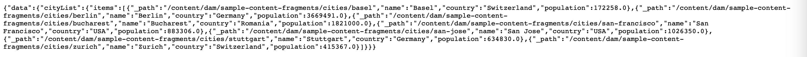

# GraphiQL IDE 사용 {#graphiql-ide}

표준 구현 [GraphiQL](https://graphql.org/learn/serving-over-http/#graphiql) IDE는 AEM(Adobe Experience Manager)의 GraphQL API와 함께 사용할 수 있습니다.

>[!NOTE]
>
>GraphiQL은 AEM의 모든 환경에 포함되어 있지만 엔드포인트를 구성할 때만 액세스/볼 수 있습니다.
>
>이전 릴리스에서는 GraphiQL IDE를 설치하려면 패키지가 필요했습니다. 이를 설치했다면 이제 제거할 수 있습니다.

>[!NOTE]
>GraphiQL IDE를 사용하기 전에 [구성 브라우저](/help/assets/content-fragments/content-fragments-configuration-browser.md)에서 [엔드포인트를 구성](/help/sites-developing/headless/graphql-api/graphql-endpoint.md)해야 합니다.

다음 **GraphiQL** 도구를 사용하면 다음을 수행할 수 있으므로 GraphQL 쿼리를 테스트하고 디버그할 수 있습니다.

* 쿼리에 사용하려는 Sites 구성에 적합한 **엔드포인트**&#x200B;를 선택합니다.
* 새 쿼리 직접 입력
* **[지속 쿼리](/help/sites-developing/headless/graphql-api/persisted-queries.md)** 제작 및 액세스
* 쿼리를 실행하여 결과를 즉시 확인
* **쿼리 변수** 관리
* **지속 쿼리** 저장 및 관리
* **지속 쿼리** 게시 또는 게시 취소 (예: `dev-publish`에/에서)
* 이전 쿼리의 **내역** 참조
* **설명서 탐색기**&#x200B;를 사용하여 설명서에 액세스합니다. 이를 통해 사용 가능한 방법을 쉽게 배우고 이해할 수 있습니다.

다음 중 하나에서 쿼리 편집기에 액세스할 수 있습니다.

* **도구** -> **일반** -> **GraphQL 쿼리 편집기**
* 직접 (예: `http://localhost:4502/aem/graphiql.html`)

GET 요청을 사용하고 쿼리를 게시하여 클라이언트 애플리케이션에서 쿼리를 요청할 수 있도록 시스템에서 GraphiQL을 사용할 수 있습니다. 프로덕션을 사용하는 경우 [쿼리를 프로덕션 환경으로 이전](/help/sites-developing/headless/graphql-api/persisted-queries.md#transfer-persisted-query-production)할 수 있습니다. 처음은 쿼리로 새로 작성된 콘텐츠를 확인하기 위해 프로덕션 작성자로 복제되고, 마지막은 라이브 소비를 위해 프로덕션 게시로 복제됩니다.

## 엔드포인트 선택 중 {#selecting-endpoint}

첫 번째 단계로, 쿼리에 사용하려는 Sites 구성에 적합한 **[엔드포인트](/help/sites-developing/headless/graphql-api/graphql-endpoint.md)**&#x200B;를 선택해야 합니다. 엔드포인트는 쿼리에 사용하려는 Sites 구성에 적합합니다.

오른쪽 상단의 드롭다운 목록에서 사용할 수 있습니다.

## 새 쿼리 제작 및 지속 중 {#creating-new-query}

GraphiQL 로고 바로 아래 왼쪽 중간 패널에 있는 편집기에 새 쿼리를 입력할 수 있습니다.

>[!NOTE]
>
>이미 지속 쿼리가 선택되고 편집기 패널에 표시되는 경우 (**지속 쿼리** 옆의) `+`를 선택하여 새 쿼리에 맞는 편집기를 비웁니다.

입력이 시작되기만 하면 편집기는 다음 작업을 수행합니다.

* 마우스 오버를 사용하여 요소에 대한 추가 정보 표시
* 구문 강조, 자동 완성, 자동 제안 등의 기능 제공

>[!NOTE]
>
>GraphQL 쿼리는 일반적으로 `{` 문자로 시작됩니다.
>
>`#`으로 시작되는 라인은 무시됩니다.

**다른 이름으로 저장**&#x200B;을 사용하여 새 쿼리를 지속합니다.

## 지속 쿼리 업데이트 중 {#updating-persisted-query}

**[지속 쿼리](/help/sites-developing/headless/graphql-api/persisted-queries.md)** 패널(맨 왼쪽)의 목록에서 업데이트하려는 쿼리를 선택합니다.

쿼리가 편집기 패널에 표시됩니다. 필요한 변경 내용을 적용한 다음 **저장**&#x200B;을 사용하여 지속 쿼리에 맞게 업데이트를 커밋합니다.

## 쿼리 실행 중 {#running-queries}

새 쿼리를 바로 실행하거나 지속 쿼리를 로드하고 실행할 수 있습니다. 지속 쿼리를 로드하는 경우 목록에서 선택하면 쿼리가 편집기 패널에 표시됩니다.

두 경우 모두 편집기 패널에 표시되는 쿼리는 다음 두 가지 작업을 수행하는 경우 실행되는 쿼리입니다.

* **쿼리 실행** 아이콘 클릭/탭
* 키보드 조합 `Control-Enter` 사용

## 쿼리 변수 {#query-variables}

<!-- more details needed here? -->

GraphiQL IDE를 사용하여 [쿼리 변수](/help/sites-developing/headless/graphql-api/graphql-api-content-fragments.md#graphql-variables).

예:

<!--
## Managing cache for your persisted queries {#managing-cache}

[Persisted queries](/help/headless/graphql-api/persisted-queries.md) are recommended as they can be cached at the dispatcher and CDN layers, ultimately improving the performance of the requesting client application. By default AEM will invalidate the Content Delivery Network (CDN) cache based on a default Time To Live (TTL).

>[!NOTE]
>
>Custom rewrite rules on the Dispatcher might override defaults from AEM publish. 
>
>In the case that you are sending TTL-based cache-control headers from the dispatcher, based on a location match pattern, then, if necessary, you might want to exclude `/graphql/execute.json/*` from the matches.

Using GraphQL you can configure the HTTP Cache Headers  to control these parameters for your individual persisted query.

1. The **Headers** option is accessible via the three vertical dots to the right of the persisted query name (far left panel):

   

1. Selecting this will open the **Cache Configuration** dialog:

   

1. Select the appropriate parameter, then adjust the value as required:

   * **cache-control** - **max-age**
     Caches can store this content for specified number of seconds. Typically this is the browser TTL (Time To Live).
   * **surrogate-control** - **s-maxage**
     Same as max-age but applies specifically to proxy caches.
   * **surrogate-control** - **stale-while-revalidate**
     Caches may continue to serve a cached response after it becomes stale, for up to the specified number of seconds.
   * **surrogate-control** - **stale-if-error**
     Caches may continue to serve a cached response in case of or origin error, for up to the specified number of seconds.

1. Select **Save** to persist the changes.
-->

## 지속 쿼리 게시 {#publishing-persisted-queries}

을(를) 선택하면 [지속 쿼리](/help/sites-developing/headless/graphql-api/persisted-queries.md) 목록(왼쪽 패널)에서 **게시** 및 **게시 취소** 작업. 테스트할 때 애플리케이션에서 간편하게 액세스할 수 있도록 게시 환경(예: `dev-publish`)에 맞게 액션을 활성화합니다.

>[!NOTE]
>
>지속 쿼리의 캐시 `Time To Live` {&quot;cache-control&quot;:&quot;parameter&quot;:value} 기본값은 2시간(7,200초)입니다.

## URL을 복사하여 쿼리에 직접 액세스합니다. {#copy-url}

다음 **URL 복사** 옵션을 사용하면 지속 쿼리에 직접 액세스하고 결과를 조회하는 데 사용되는 URL을 복사하여 쿼리를 시뮬레이션할 수 있습니다. 그런 다음 테스트에 사용할 수 있습니다(예: 브라우저에서 액세스).

<!--
  >[!NOTE]
  >
  >The URL will need [encoding before using programmatically](/help/headless/graphql-api/persisted-queries.md#encoding-query-url).
  >
  >The target environment might need adjusting, depending on your requirements.
-->

예:

`http://localhost:4502/graphql/execute.json/global/article-list-01`

브라우저에서 이 URL을 사용하여 다음 결과를 확인할 수 있습니다.

지속 쿼리 이름(맨 왼쪽 패널) 오른쪽에 있는 세 개의 세로 점을 통해 **URL 복사** 옵션에 액세스할 수 있습니다.

## 지속 쿼리 삭제 중 {#deleting-persisted-queries}

지속 쿼리 이름(맨 왼쪽 패널) 오른쪽에 있는 세 개의 세로 점을 통해서도 **삭제** 옵션에 액세스할 수 있습니다.

<!-- what happens if you try to delete something that is still published? -->

## 프로덕션에 지속 쿼리 설치 중 {#installing-persisted-query-production}

GraphiQL로 지속 쿼리를 개발 및 테스트하고 나서 [프로덕션 환경으로 이전](/help/sites-developing/headless/graphql-api/persisted-queries.md#transfer-persisted-query-production)하여 애플리케이션에서 활용하는 것이 이 작업의 최종 목표입니다.

## 키보드 단축키 {#keyboard-shortcuts}

IDE에서 작업 아이콘에 직접 액세스하는 키보드 단축키의 선택 항목은 다음과 같습니다.

* 쿼리 정렬: `Shift-Control-P`
* 쿼리 병합: `Shift-Control-M`
* 쿼리 실행: `Control-Enter`
* 자동 완성: `Control-Space`

>[!NOTE]
>
>키보드에서 `Control` 키가 `Ctrl`로 레이블이 지정됩니다.
