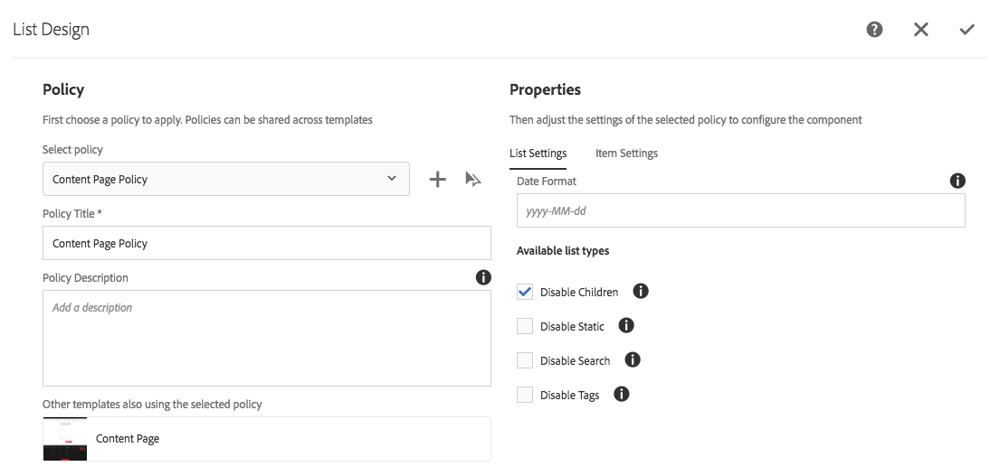
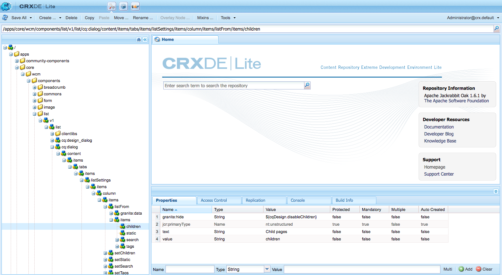

# 숨기기 조건 사용{#using-hide-conditions}

숨기기 조건을 사용하여 구성 요소 리소스가 렌더링되었는지 확인할 수 있습니다. 템플릿 작성자가 [템플릿 편집기](/help/sites-authoring/templates.md)에 핵심 구성 요소 [목록 구성 요소](https://helpx.adobe.com/experience-manager/core-components/using/list.html)을 구성하고 하위 페이지를 기준으로 목록을 만드는 옵션을 비활성화하기로 결정하는 경우가 이에 해당됩니다. 디자인 대화 상자에서 이 옵션을 비활성화하면 목록 구성 요소가 렌더링될 때 숨기기 조건이 평가되고 하위 페이지를 표시하는 옵션이 표시되지 않도록 속성이 설정됩니다.

## 개요 {#overview}

대화 상자는 사용자가 원하는 옵션 중 일부만 사용할 수 있는 다양한 옵션을 통해 매우 복잡해질 수 있습니다. 이로 인해 사용자에게 사용자 인터페이스 환경이 크게 저하될 수 있습니다.

숨기기 조건을 사용하면 관리자, 개발자 및 수퍼 사용자는 규칙 세트를 기반으로 리소스를 숨길 수 있습니다. 이 기능을 사용하면 작성자가 컨텐츠를 편집할 때 표시할 리소스를 결정할 수 있습니다.

>[!NOTE]
>
>식을 기반으로 리소스를 숨기면 ACL 권한이 대체되지 않습니다. 컨텐츠는 편집 가능하지만 표시되지는 않습니다.

## 구현 및 사용 세부 정보 {#implementation-and-usage-details}

`com.adobe.granite.ui.components.FilteringResourceWrapper` 는 필터링할 필드에 있는  `granite:hide` 속성의 존재와 값을 기반으로 리소스를 필터링하는 책임을 집니다. `/libs/cq/gui/components/authoring/dialog/dialog.jsp`의 구현에 `FilteringResourceWrapper.`의 인스턴스가 포함되어 있습니다.

구현은 Granite [ELResolver API](https://helpx.adobe.com/experience-manager/6-5/sites/developing/using/reference-materials/granite-ui/api/jcr_root/libs/granite/ui/docs/server/el.html)를 사용하고 ExpressionCustomizer를 통해 `cqDesign` 사용자 지정 변수를 추가합니다.

다음은 `etc/design` 아래 또는 컨텐트 정책으로 있는 디자인 노드에서 숨기기 조건의 몇 가지 예입니다.

```
${cqDesign.myProperty}
${!cqDesign.myProperty}
${cqDesign.myProperty == 'someText'}
${cqDesign.myProperty != 'someText'}
${cqDesign.myProperty == true}
${cqDesign.myProperty == true}
${cqDesign.property1 == 'someText' && cqDesign.property2 || cqDesign.property3 != 1 || header.myHeader}
```

숨기기 표현식을 정의할 때는 다음 사항을 염두에 두십시오.

* 유효하려면 속성이 있는 범위를 표시해야 합니다(예:`cqDesign.myProperty`).
* 값은 읽기 전용입니다.
* 기능(필요한 경우)은 서비스가 제공하는 특정 세트로 제한되어야 합니다.

## 예 {#example}

숨기기 조건의 예제는 AEM 및 [핵심 구성 요소](https://docs.adobe.com/content/help/ko-KR/experience-manager-core-components/using/introduction.html)에서 찾을 수 있습니다. 예를 들어 [목록 핵심 구성 요소](https://helpx.adobe.com/experience-manager/core-components/using/list.html)를 고려하십시오.

[템플릿 작성자는 템플릿 편집기를](/help/sites-authoring/templates.md) 사용하여 디자인 대화 상자에서 페이지 작성자가 사용할 수 있는 목록 구성 요소의 옵션을 정의할 수 있습니다. 목록을 정적 목록으로 허용할지 여부, 하위 페이지 목록, 태그 있는 페이지 목록 등과 같은 옵션 활성화 또는 비활성화할 수 있습니다.

템플릿 작성자가 하위 페이지 옵션을 비활성화하도록 선택하면 디자인 속성이 설정되고 숨기기 조건이 평가되어 페이지 작성자에 대해 옵션이 렌더링되지 않습니다.

1. 기본적으로 페이지 작성자는 목록 핵심 구성 요소를 사용하여 **하위 페이지** 옵션을 선택하여 하위 페이지를 사용하여 목록을 만들 수 있습니다.

   

1. 목록 핵심 구성 요소의 디자인 대화 상자에서 템플릿 작성자는 옵션 **하위 비활성화**&#x200B;을 선택하여 하위 페이지를 기준으로 목록을 생성하는 옵션이 페이지 작성자에게 표시되지 않게 할 수 있습니다.

   

1. 정책 노드는 `/conf/we-retail/settings/wcm/policies/weretail/components/content/lis`t 아래에 `disableChildren` 속성이 `true`로 설정된 상태로 만들어집니다.
1. 숨기기 조건은 대화 상자 속성 노드 `/conf/we-retail/settings/wcm/policies/weretail/components/content/list`에 있는 `granite:hid`e 속성의 값으로 정의됩니다.

   

1. `disableChildren`의 값이 디자인 구성에서 가져오고 `${cdDesign.disableChildren}` 식이 `false`로 평가됩니다. 즉, 옵션이 구성 요소의 일부로 렌더링되지 않습니다.

   숨기기 식은 GitHub](https://github.com/Adobe-Marketing-Cloud/aem-core-wcm-components/blob/master/content/src/content/jcr_root/apps/core/wcm/components/list/v1/list/_cq_dialog/.content.xml#L40)에서 `granite:hide` 속성 [의 값으로 볼 수 있습니다.

1. 목록 구성 요소를 사용할 때 **하위 페이지** 옵션이 더 이상 페이지 작성자에 대해 렌더링되지 않습니다.

   

